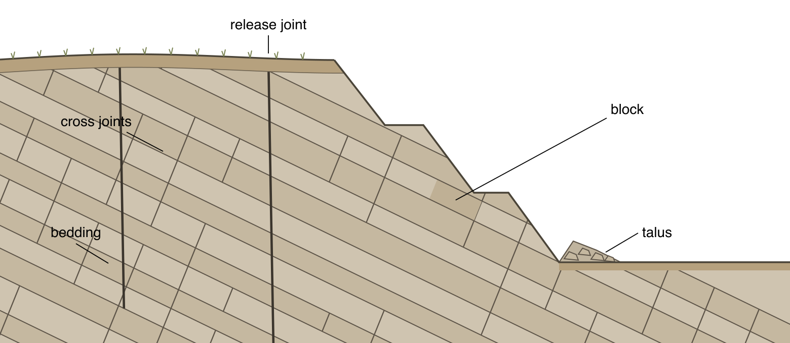
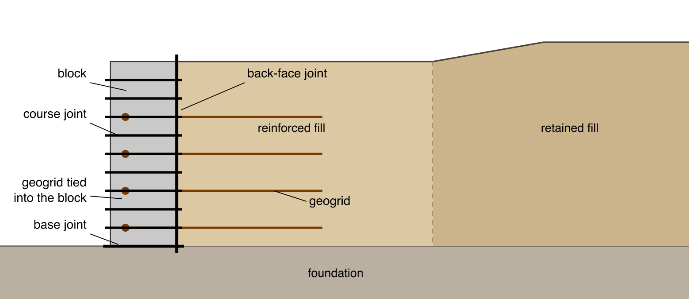
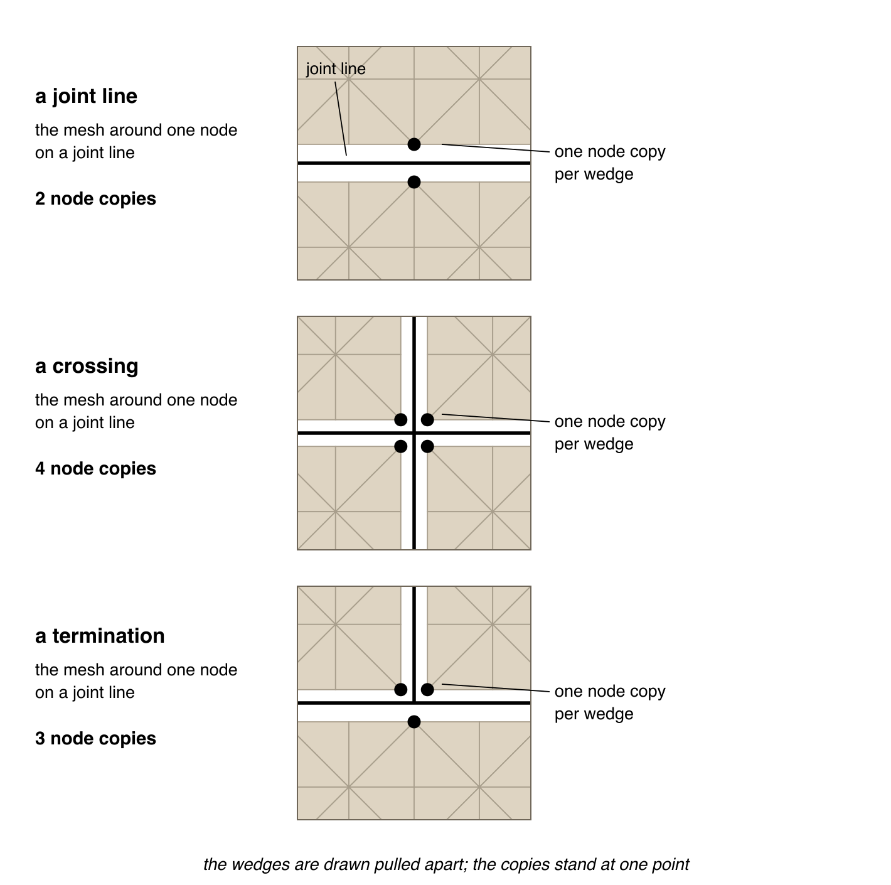
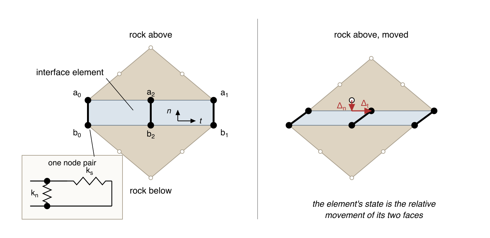
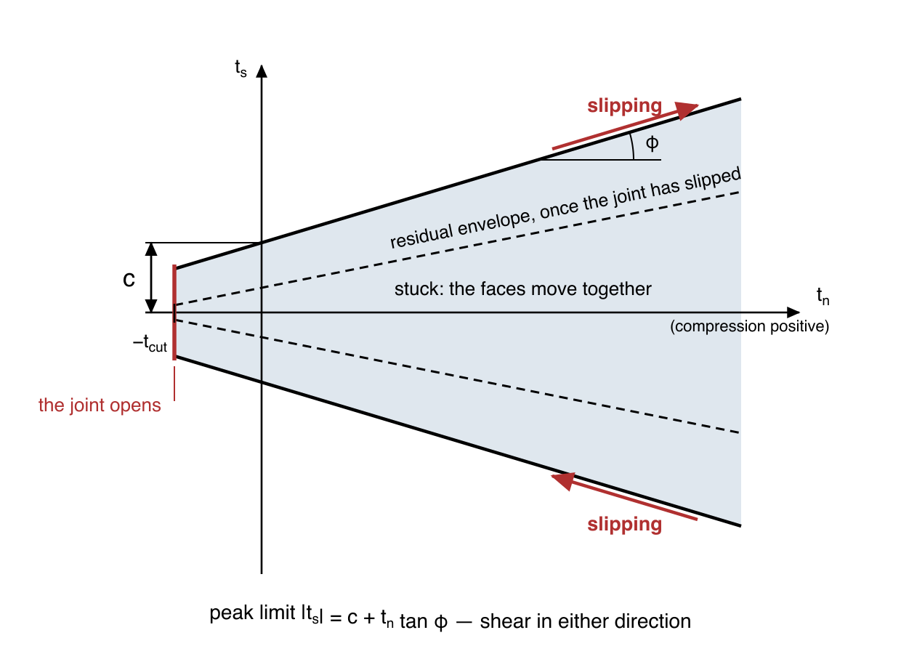
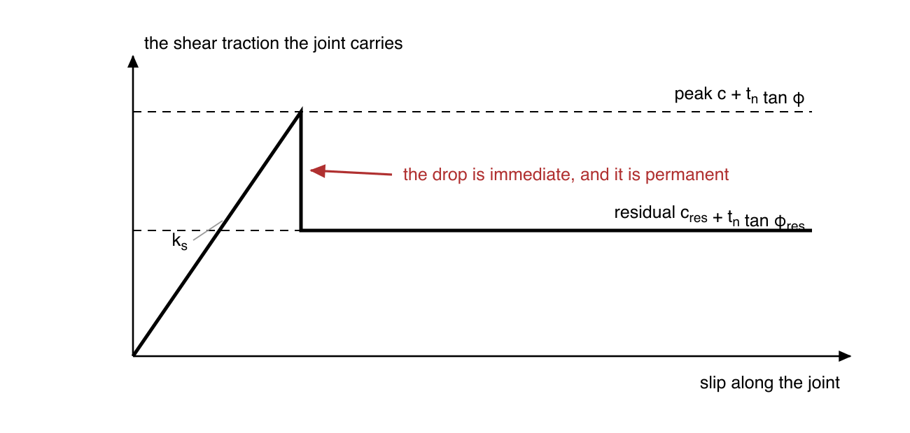
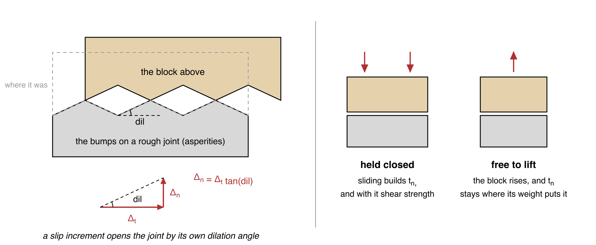
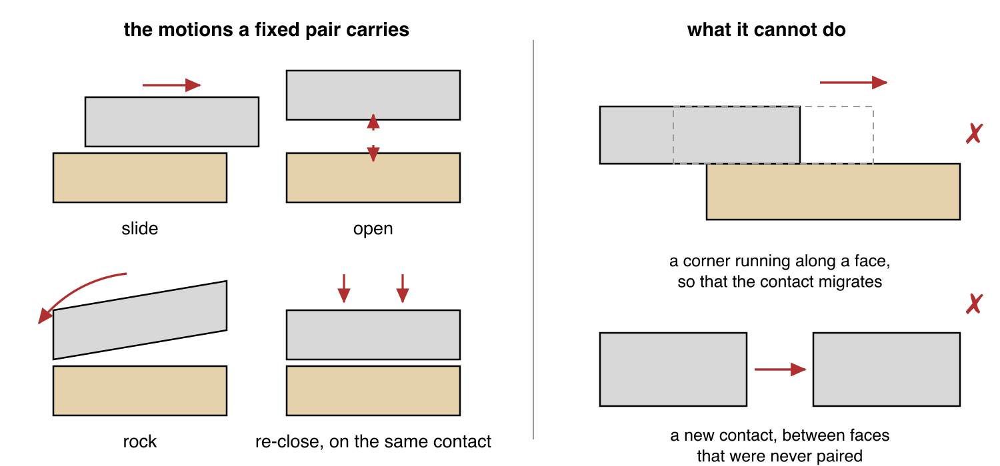
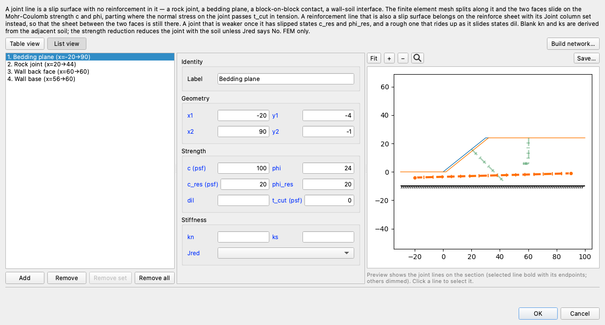
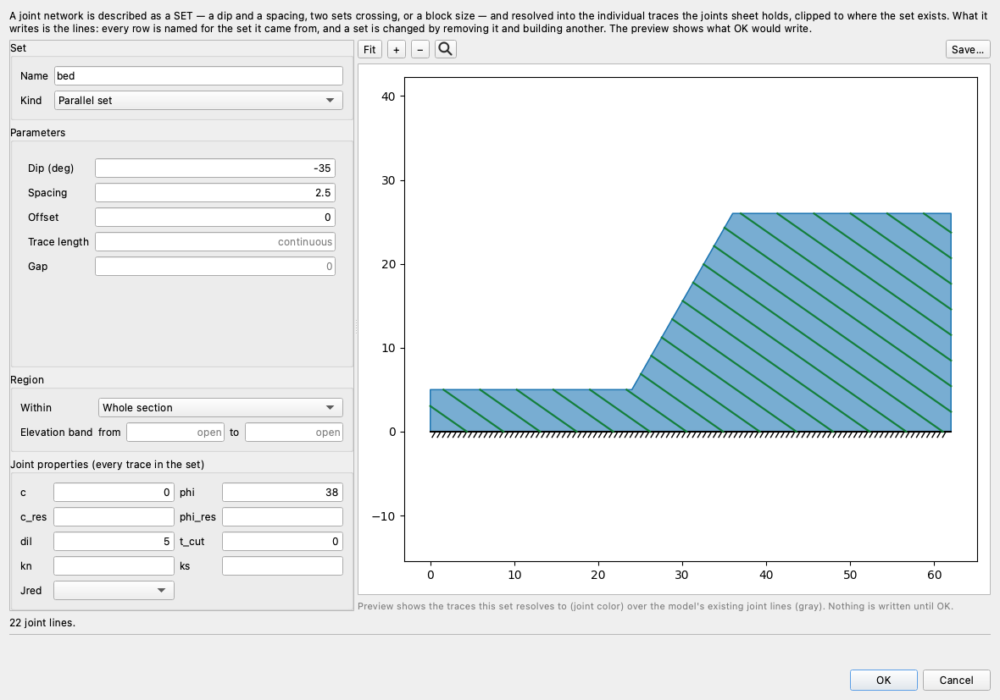

# Joints and Interface Elements

A **joint** is a surface two bodies meet on and can slide along: a rock joint, a bedding plane, the
contact between one facing block and the next, the back of a retaining wall against the soil it
holds, a geosynthetic sheet the fill above it can slide on. XSLOPE models one as a **joint line** —
a line the finite element mesh is split along, with an interface element carrying the traction
between the two faces. The faces can then slide on each other, part, and come back together, which
a single bonded mesh cannot do.

{width=900}

Joint lines come from two places. A line on the **joints** worksheet is a joint and nothing else —
the rock joint, the bedding plane, the block contact above. A line on the **reinforce** worksheet
whose `Joint` column reads **Yes** is a reinforcement sheet that is *also* a slip surface: the mesh
splits along it, and the sheet keeps its own tension. Everything on this page applies to both
kinds; [Two ways to represent a sheet](reinforcement.md#two-ways-to-represent-a-sheet) covers what
is particular to the reinforced one.

A joint line is finite element geometry. The limit equilibrium engines do not read the joints
worksheet at all.

## When a Model Needs a Joint

A joint belongs where the mechanism **runs along** a surface rather than cutting through it.

**Rock.** A jointed rock mass fails on its discontinuities, not through intact rock: block and
flexural toppling of a columnar face, a plane failure on a bedding plane that daylights, a step-path
surface running from one joint to the next through short rock bridges, a slab ploughing into the
block below it. The rock itself is often elastic in such a model, so every mechanism it has is a
joint mechanism.

**Blocks and walls.** A segmental block wall is a stack of discrete units: a joint under the base,
a joint on the back face against the fill, and a joint at every course line make it a stack that can
slide, part and rock, instead of a notched solid. The same applies to a gravity or gabion wall and
to the contact between a structure and the ground.

**Sheets that are the slip surface.** A base geotextile under an embankment on soft clay, a smooth
geomembrane or liner, the wrapped face of a reinforced wall: the fill slides *on* the sheet at the
interface friction. Those are reinforce-sheet lines with `Joint = Yes`; which of the two
representations a sheet wants is set out under
[Bonded bar or joint?](reinforcement.md#bonded-bar-or-joint).

{width=900}

## The Split Mesh

Where a joint line runs, the mesher gives every node on it **one copy per wedge of material around
it**. A node in the middle of a line has material above and below, so it becomes two nodes at the
same point. A node where two joint lines cross sits at the middle of four wedges and becomes four.
A node where one joint line ends on another has three wedges and becomes three. Each element keeps
the copy on its own side of every line through the point, so the wedges are free to move relative to
one another, and the interface elements between the copies are what hold them together.

{width=760}

The split is invisible on a mesh plot, because the copies stand at one point; a jointed line is
drawn in its own style so it can be told from a bonded one.

### Where a joint ends on another joint

A joint that stops **on** another joint — a column's base beginning partway along its neighbor's
side joint, a release trace running down onto the bedding plane that releases it — needs the two
lines to meet at exactly one point, because the mesher only places a node where the geometry carries
one. Whether they meet is a question of arithmetic rather than of the drawing: an endpoint computed
from the same angle as the line it belongs on can miss it by a part in a thousand billion, and one
stated to six decimals by a part in a million, and the sliver between the two lines is thinner than
any mesh resolves.

So **every jointed line's end within a millionth of the section of another jointed line is moved
onto it**, and the line it stops on is given a vertex at that same point, before the mesh is built.
The through line is not moved: it is the plane the ending line belongs to, and it keeps the geometry
it was stated with. An end already on another line is left exactly where it is.

Two things a joint line may not do, both refused by name in the [model
checks](../usage/preflight.md): lie **on** another joint line over a stretch, and run along the
outside of the section, where there is material on one side only and nothing for the other face to
be.

## The Interface Element

Each interface element is a zero-thickness joint (Goodman, Taylor & Brekke, 1968) spanning the node
pairs of one mesh edge: three pairs on a quadratic mesh, two on a linear one. It has no area and no
thickness. Its state is the relative displacement of the two faces, resolved along the element's own
chord into a tangential component $\Delta_t$ (sliding) and a normal component $\Delta_n$ (closing,
compression positive).

{width=920}

While the joint is intact its tractions are elastic,

$$t_n = k_n \Delta_n, \qquad t_s = k_s \Delta_t,$$

and they are integrated at the element's own **nodes** (Newton-Cotes, or Lobatto) rather than at
Gauss points: $L/6$, $L/6$, $2L/3$ on the three-pair element, $L/2$, $L/2$ on the two-pair one.
Nodal integration keeps the node pairs uncoupled, which is what keeps the traction along a stiff
interface free of the oscillation Gauss quadrature produces there (Schellekens & de Borst, 1993).
The traction spread along an element, measured on a direct shear test, *falls* from 15% to 1.8%
when $k_n$ is multiplied by a hundred.

### Stiffness

$k_n$ and $k_s$ are penalty stiffnesses: large enough that an intact joint does not visibly deform,
small enough not to ill-condition the system. Stated on the line, they are used as stated. Left
blank, they are derived as $E_{adj}/d_v$ and $G_{adj}/d_v$ over a virtual thickness
$d_v = 0.1\,L_{1D}$, with $E_{adj}$ and $G_{adj}$ those of the **softer** of the two materials the
element stands between — which differ where a line crosses a material boundary.

The factor of safety is insensitive to the pair: it moves by about 1.5% over two orders of
magnitude. The **cost** is not. The slip a viscoplastic sweep puts into a joint is the excess
traction divided by $k_s$, so a model that states stiffnesses an order of magnitude above the
derived default needs its iteration budget raised by the same factor.

### Strength

The shear traction is limited by Mohr-Coulomb,

$$|t_s| \le c_j + t_n \tan\phi_j ,$$

and the normal traction by a **tension cutoff** `t_cut`. Past the shear limit the joint **slips**:
the traction stays at the limit while the tangential offset grows, which is perfectly plastic slip.
Past the tension cutoff it **opens**: both tractions and both stiffnesses go to zero, and it carries
nothing until the two faces come back into contact, when it closes again and carries traction as
before.

{width=800}

A joints-sheet line states `c`, `phi` and `t_cut` in columns of its own. A jointed reinforcement
line takes its `Adhesion` and `Delta` as $c_j$ and $\phi_j$, and its tension cutoff is zero: a
soil-geosynthetic contact carries no tension, where a rock joint may hold a little.

### Residual strength

A rough surface shears through its asperities the first time it reaches its limit and does not
rebuild them, so a joint that has slipped may be weaker than one that has not. `c_res` and
`phi_res` state what it keeps. The drop is **immediate** — the limit falls from
$c + t_n \tan\phi$ to $c_{res} + t_n \tan\phi_{res}$ on the sweep after the one that first found the
pair at its limit — and **permanent**: the pair stays on the residual branch for the rest of the
run, even where it later closes or unloads.

{width=820}

Blank residuals mean no residual branch, and the peak carries throughout. Neither residual may
exceed its peak.

### Dilation

A rough joint rides up on its asperities as it slides. `dil` is that angle: a slip increment
$|\Delta_t|$ opens the joint by $|\Delta_t| \tan(\text{dil})$, accumulated as a plastic normal
offset $u_{open}$, so the elastic part of the normal closing — and with it the normal traction

$$t_n = k_n (\Delta_n + u_{open})$$

— grows while the joint slides.

{width=950}

Where the material around the joint holds it closed, that is **dilatant hardening**: sliding builds
normal stress and with it shear strength. Where the sliding block is free to lift, it lifts instead,
and the normal traction stays at whatever equilibrium with the block's weight requires. The dilation
is **non-directional** — the joint opens whichever way it slides — and it does not decay with
accumulated slip: a joint that slides a long way keeps riding up at the stated angle. Blank is zero.

### Strength reduction

A strength reduction divides $c_j$ and $\tan\phi_j$ by the trial factor along with the soil's, on
both the peak and the residual branch, on every jointed line unless that line sets `Jred = No` —
which holds a joint at full strength through the reduction, for a construction detail rather than a
geotechnical surface. The stiffnesses $k_n$ and $k_s$ are structural and are not reduced, exactly as
the bar's properties are not.

## What the Method Can and Cannot Model

The element is a small-strain interface between **fixed node pairs**. A pair carries compression
across the joint and Coulomb shear along it, opens when the normal traction goes into tension, slips
when the shear reaches its limit, and re-closes when the two faces meet again — and it keeps the
partner it started with for the whole solve.

{width=950}

So blocks slide on their contacts, open at them, rock about them and re-seat on them, and where a
mechanism keeps its contacts the answer is rigid-block statics. What the element does not reach
follows from the same construction: a corner cannot run along a face, so a contact cannot migrate or
shorten as a block moves; no new contact forms between two faces that were not paired to begin with;
rotations stay small, the element being written on the undeformed section; there is no excavation
stage; and the joint law is Coulomb with residual strength and dilation rather than a hyperbolic or
work-softening one.

That reach covers the mechanisms a jointed slope usually turns on — block toppling, flexural
toppling, plane failure, step-path failure through rock bridges, ploughing slabs, a tessellated
block mass, a block wall sliding and rocking on its courses, an embankment sliding on its base
sheet. It does not cover a mass that travels far enough to find contacts the section does not
already carry, which is what a distinct-element code is for.

The element's own law — the peak limit, the residual drop and the opening a dilating joint produces
per unit of slip — is checked against its closed forms by `test/joint_element_check.py`.

## Inputs

### The joints worksheet

One row per line: a `Label`, the endpoints `x1, y1, x2, y2`, and the properties above — `c`, `phi`,
`c_res`, `phi_res`, `dil`, `t_cut`, `kn`, `ks` and `Jred`. Only `phi` and the endpoints are
required; every other column is blank for the ordinary case. The columns and their units are
documented with the rest of the template under
[Worksheet: joints](../usage/input_template.md#worksheet-joints).

### Joint regions and generated networks

A jointed rock mass is rarely described one line at a time. A polygon whose **Type** is `joints` is
a [joint region](../usage/input_template.md#joint-regions) — an authoring region that says where a
generated network exists, optionally narrowed to an elevation band. Networks are generated from
`xslope.joints`: `parallel_set` for one set at a dip and spacing, `cross_jointed` for two sets
crossed, and `voronoi` for a tessellated block mass with no preferred orientation.

{width=900}

Studio's [Build network](../studio/editing.md#build-network) dialog is the same three generators
with the canvas previewing the traces before they are written. The output is ordinary rows on the
joints worksheet, labeled `set-01`, `set-02` and so on: the lines are the input, and the recipe that
made them is not stored. A network is changed by removing it and building another.

{width=760}

### A reinforcement line as a joint

Setting `Joint = Yes` on a reinforcement line splits the mesh along it and puts the sheet between
two interfaces, one against the soil above and one against the soil below, so the sheet's two
interfaces act in series where a joints-sheet line carries one contact.
[Ends, ties and the bar](reinforcement.md#ends-ties-and-the-bar) covers how such a sheet is
anchored, and what the bar does and does not carry once the interfaces carry the grip.

## Running a Jointed Model

### The sweep budget

A joint reaches equilibrium by **growing slip**, a little per sweep, so a jointed model settles over
tens of thousands of viscoplastic sweeps where a bonded one settles over hundreds. A
strength-reduction trial that runs out of sweeps is recorded undecided, the bracket reads that as
not standing, and the factor of safety comes out low — a reading of the budget rather than of the
slope.

Raise `max_iterations` on `solve_fem()` and `solve_ssrm()`, or the sweep limit in Studio's Run FEM
dialog, from its default of 12,000. The model checks warn below **100,000**, which is a floor rather
than a sufficiency; allowing more costs almost nothing, because a trial that decides stops. A
six-course block wall with three geogrid layers needs about 36,000 sweeps per trial, and run at the
default one trial of its bracket is read as standing where more sweeps show it still moving, so the
factor of safety comes out too high.

The slip a sweep puts into a joint is the excess traction divided by $k_s$, and
`joint_slip_stiffness_factor` scales the stiffness used in that division on the pairs that are at
their limit — the traction limit, the assembled elastic stiffness and a pair that re-sticks are all
untouched. It is **off by default**, and the reason is a stability limit rather than a preference:
one sweep already returns the traction exactly to its limit at the current displacement field, so
the iteration sits at its boundary and a factor $f$ is a relaxation of $1/f$. Values near 1 are
stable and buy nothing, and a factor of 0.01 diverges outright. Reach for the budget instead.

### How a trial is decided

On a jointed model almost all of the out-of-balance force sits on the joints, and a pair of faces
at its slip limit alternates between slipping and sticking as the material around it breathes. What
that leaves is a steady back-and-forth the sweeps never damp out, so its average never falls under
a force tolerance no matter how many sweeps are allowed. A jointed trial that neither converges nor
runs away is therefore read from the **joints** rather than from the displacement field: slip still
growing at an undiminishing rate while the slope keeps moving is a slope failing on its joints, and
slip and movement both stopped with the soil in equilibrium is a slope standing behind that
back-and-forth. [The joint verdict](overview.md#the-joint-verdict) gives both readings and their
thresholds.

The standing reading counts only under the default `hybrid`
[failure criterion](overview.md#ssrm-failure-criteria); under `non_convergence` a trial that has
stopped moving but never converged is still a non-converged trial, and the search reads it as
failed.

A jointed trial is also handed to the [Newton
corrector](overview.md#finishing-a-trial-with-the-newton-corrector), which starts from the state
the sweeps have reached — the slip, the opening and the residual strength each joint has arrived at
— and looks for equilibrium at that strength directly. Where it finds one, the trial stands,
usually within a few hundred more sweeps. Where it does not, the trial is left as the sweeps read
it: not finding an equilibrium this way is not evidence that none exists.

### What the results show

Each interface is drawn as a thin line on the line it runs along, colored by how far its two faces
have slid, on a colorbar titled *Joint slip*: a green ramp, because the strain field under it runs
blue through white to red. A slipping span is backed by a thin white stroke so it reads over a dark
field; a joint that is not slipping is a neutral gray hairline; a stretch that has **opened** is
marked with a short tick across the line rather than given a color, because opening is a condition
and not a quantity. A model where no joint slipped carries no colorbar. The weight is deliberate: a
generated network puts hundreds of traces over the field.

On a jointed model the displacement panel is the scaled deformed mesh rather than an arrow field,
drawn as the **blocks** the joints cut the section into — each block under a faint tint of its own,
its joint faces in the same green, the outside of the deformed mesh as a dark line against the
dashed undeformed outline. A block is a piece of the mesh that moves as one body, found by following
element adjacency: the split gives the two sides of a joint their own nodes, so they are no longer
neighbors. That is what a jointed failure looks like — blocks moving as bodies, with all of the
movement taken up at the joints, where a slipped or opened joint shows as two lines that no longer
lie on each other. An arrow field samples that at nodes and misses exactly the thing that happened.

**1D Details…** lists every jointed line under a *Joints* heading and draws four panels along the
line: the bar's tension over its capacity where the line carries one, the normal traction the
interface carries, the shear traction with the Mohr-Coulomb limit $c_j + t_n \tan\phi_j$ drawn
beside it, and the slip. Where the two shear curves meet is where the interface is at its limit. A
generated report carries the same reading as a table: the share of each line's length standing at
its limit, and the largest offset the two faces reached.

## References

Goodman, R.E., Taylor, R.L., & Brekke, T.L. (1968). A model for the mechanics of jointed rock.
*Journal of the Soil Mechanics and Foundations Division*, 94(SM3), 637-659.

Schellekens, J.C.J., & de Borst, R. (1993). On the numerical integration of interface elements.
*International Journal for Numerical Methods in Engineering*, 36(1), 43-66.
