# Joints and Interface Elements

A **joint** is a surface two bodies meet on and can slide along: a rock joint, a bedding plane, the
contact between one facing block and the next, the back of a retaining wall against the soil it
holds, a geosynthetic sheet the fill above it can slide on. XSLOPE models one as a **joint line** —
a line the finite element mesh is split along, with an interface element carrying the normal and
shear stress between the two faces (mechanics texts call these the tractions). The faces can then
slide on each other, part, and come back together, which a single bonded mesh cannot do.

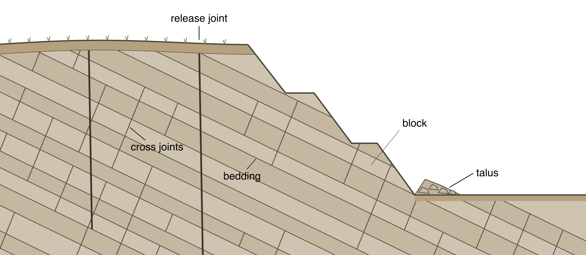{width=900}

Joint lines come from two places. A line on the **joints** worksheet is a joint and nothing else —
the rock joint, the bedding plane, the block contact above. A line on the **reinforce** worksheet
whose `Joint` column reads **Yes** is a reinforcement sheet that is *also* a slip surface: the mesh
splits along it, and the sheet keeps its own tension. Everything on this page applies to both
kinds; [Two ways to represent a sheet](reinforcement.md#two-ways-to-represent-a-sheet) covers what
is particular to the reinforced one.

A joint line is finite element geometry. The limit equilibrium engines do not read the joints
worksheet at all.

## When a Model Needs a Joint

A joint belongs where failure **runs along** a surface rather than cutting across it.

**Rock.** A jointed rock mass fails on its discontinuities, not through intact rock: block and
flexural toppling of a columnar face, a plane failure on a bedding plane that daylights, a step-path
surface running from one joint to the next through short rock bridges, a slab plowing into the
block below it. The rock itself is often modeled as elastic, so every way such a slope can fail is
a movement on its joints.

**Blocks and walls.** A segmental block wall is a stack of separate blocks. Modeled as one solid
it cannot move the way a stack does. With a joint under the bottom block, a joint on the back of the
wall against the fill, and a joint between every course of blocks, the blocks can slide on one
another, separate, and tip. The same applies to a gravity or gabion wall, and to the contact between
a structure and the ground it stands on.

**Sheets that are the slip surface.** A base geotextile under an embankment on soft clay, a smooth
geomembrane or liner, a wrap-around geotextile wall (no facing blocks: each lift of fill sits on its
sheet, which is folded back over the face and buried under the next lift): the fill slides *on* the
sheet at the interface friction. Those are reinforce-sheet lines with `Joint = Yes`; which of the two a sheet
needs is set out under
[Choosing a bonded bar or a joint](reinforcement.md#bonded-bar-or-joint).

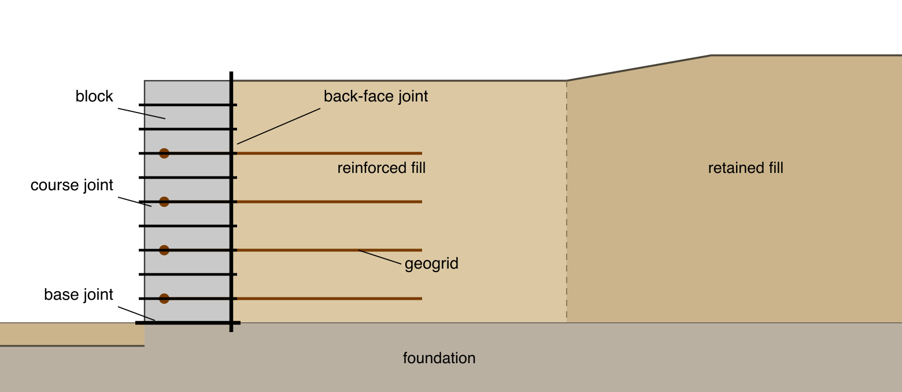{width=900}

## The Split Mesh

Where a joint line runs, the mesher gives every node on it **one copy for each piece of material
around it**. A node in the middle of a line has material above and below, so it becomes two nodes at
the same point, one on each side. Where two joint lines cross, the node sits at the middle of four
wedges of material and becomes four; where one joint line ends on another, three wedges and three
copies. Each element keeps the copy on its own side of every line through the point, so the pieces
are free to move relative to one another, and the interface elements between the copies hold them
together.

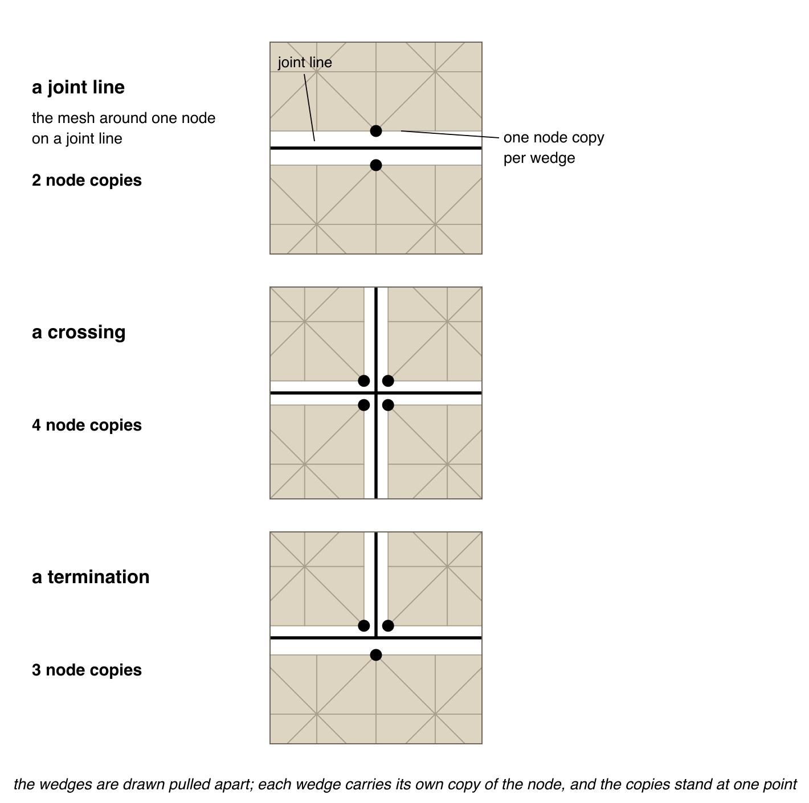{width=760}

The split is invisible on a mesh plot, because the copies stand at one point; a jointed line is
drawn in a style of its own, so it can be told from a line the mesh is not split along.

### Where a joint ends on another joint

Joints may meet: a release joint can end on a bedding plane, and a block's base can start partway
along its neighbor's side. Where two joint lines are meant to meet but the coordinates miss by a
hair, the end is moved onto the other line before the mesh is built, so nothing has to be entered
to more decimals than the drawing gives.

A joint line may not do two things, and the model checks reject both, naming the line: run along
another joint line for part of its length, and run along the outer boundary of the section, where there is
rock on one side only.

## The Interface Element

Each interface element is a zero-thickness joint (Goodman, Taylor & Brekke, 1968) spanning the node
pairs of one mesh edge: three pairs on a quadratic mesh, two on a linear one. It has no area and no
thickness. Its state is the relative displacement of the two faces, resolved along the element's own
chord into a tangential component $\Delta_t$ (sliding) and a normal component $\Delta_n$ (closing,
compression positive).

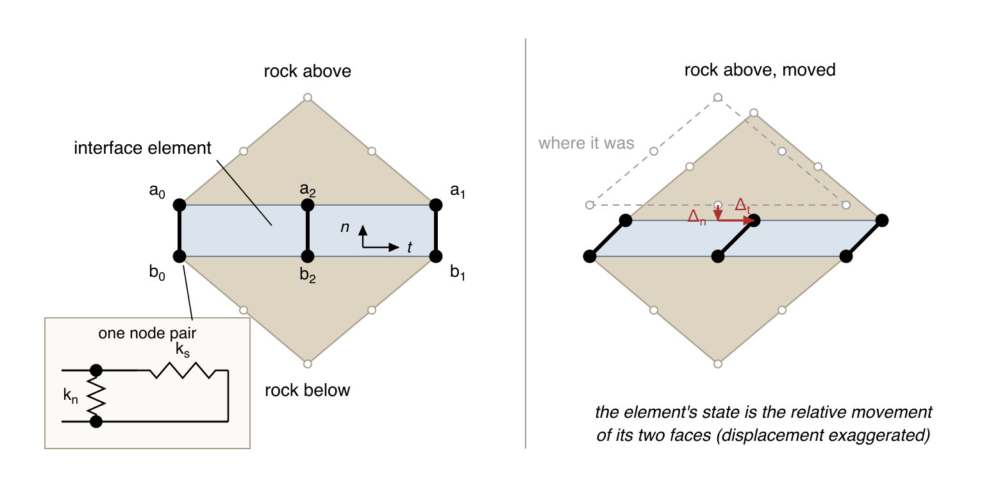{width=920}

While the joint is intact the normal and shear stress on it, $t_n$ and $t_s$, grow with that
movement:

$$t_n = k_n \Delta_n, \qquad t_s = k_s \Delta_t,$$

and they are integrated at the element's own nodes rather than at Gauss points, which keeps the
stress along a stiff interface free of the oscillation Gauss quadrature produces there
(Schellekens & de Borst, 1993).

### Stiffness

A joint has two stiffnesses. The normal stiffness `kn` acts across the joint: how much the two
faces compress together under a given normal stress. The shear stiffness `ks` acts along it: how
far the faces shift past each other under a given shear stress before the joint slips. They are not
soil properties. They exist so that a joint that has not slipped or opened behaves as if it were
not there, its two faces moving together like the material on either side, whether that is rock on
rock or fill on a geosynthetic sheet; they need to be just large enough for that and no larger. Enter them in the `kn` and `ks` columns of the joints
sheet, or of the reinforce sheet for a reinforcement line that is a slip surface. Left blank,
they are derived from the softer of the two materials the joint runs between: the normal stiffness
is that material's Young's modulus divided by a notional joint thickness, the shear stiffness its
shear modulus divided by the same thickness, and the thickness is one tenth of the joint element's
length,

$$k_n = \frac{E}{d_v}, \qquad k_s = \frac{G}{d_v}, \qquad d_v = 0.1\,L_{elem}.$$

Where a joint line crosses a material boundary, the softer material can differ from one end of the
line to the other, and so can the derived stiffness.

How much the factor of safety depends on them depends on the mechanism. For a block sliding on a
plane it changes by about 1.5% over a hundredfold range of stiffness. For a stack of columns that
lean on one another, the joints' give is part of how the load passes from column to column, and
the factor moved by about 4% over the same range on a toppling problem of the RS2 joint
verification set. What they always change is run time. A joint ten times stiffer takes about ten times as many iterations to
settle, so a model that states stiffnesses well above the defaults needs its iteration budget
raised to match.

### Strength

The shear stress on the joint is limited by Mohr-Coulomb,

$$|t_s| \le c_j + t_n \tan\phi_j ,$$

and the normal stress by a **tension cutoff** `t_cut`. Past the shear limit the joint **slips**:
the shear stress stays at the limit while the tangential offset grows, which is perfectly plastic
slip. Past the tension cutoff it **opens**: both stresses and both stiffnesses go to zero, and it
carries nothing until the two faces come back into contact, when it closes again and carries stress
as before.

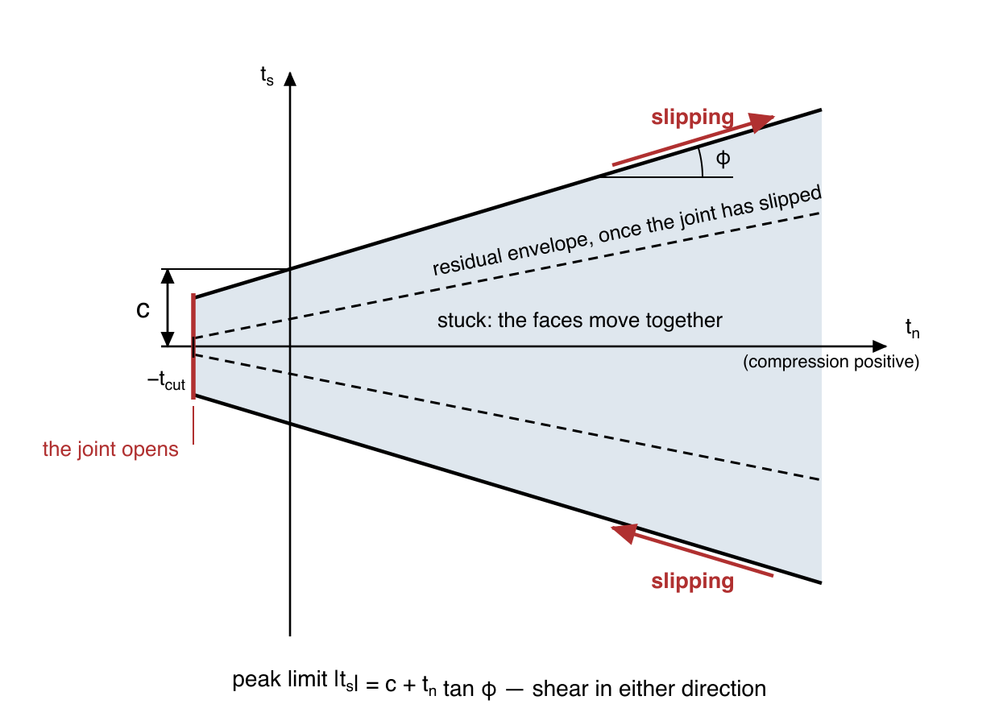{width=800}

A joints-sheet line states `c`, `phi` and `t_cut` in columns of its own. A jointed reinforcement
line takes its `Adhesion` and `Delta` as the joint's cohesion and friction angle, and its tension
cutoff is zero: a
soil-geosynthetic contact carries no tension, where a rock joint may hold a little.

### Residual strength

A rough joint surface shears off its bumps and ridges (its asperities, in rock-mechanics terms) the
first time it slips and does not grow them back, so a joint that has slipped may be weaker than one that has not. `c_res` and
`phi_res` state what it keeps. The drop is **immediate** — the limit falls from
$c + t_n \tan\phi$ to $c_{res} + t_n \tan\phi_{res}$ on the sweep after the one that first found the
pair at its limit — and **permanent**: the pair stays on the residual branch for the rest of the
run, even where it later closes or unloads.

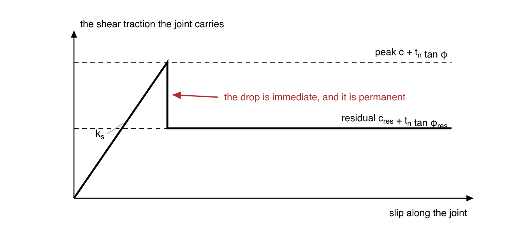{width=820}

Blank residuals mean no residual branch, and the peak carries throughout. Neither residual may
exceed its peak.

### Dilation

A rough joint rides up over the bumps on its surface as it slides. `dil` is that angle. As the joint slips it also
opens, in proportion to the slip: an opening of $\Delta_n = \Delta_t \tan(\text{dil})$ for a slip
of $\Delta_t$, and that opening is permanent. Where the joint is held shut, the
opening it cannot make is taken up as extra compression across it, so the normal stress on the
joint grows while it slides.

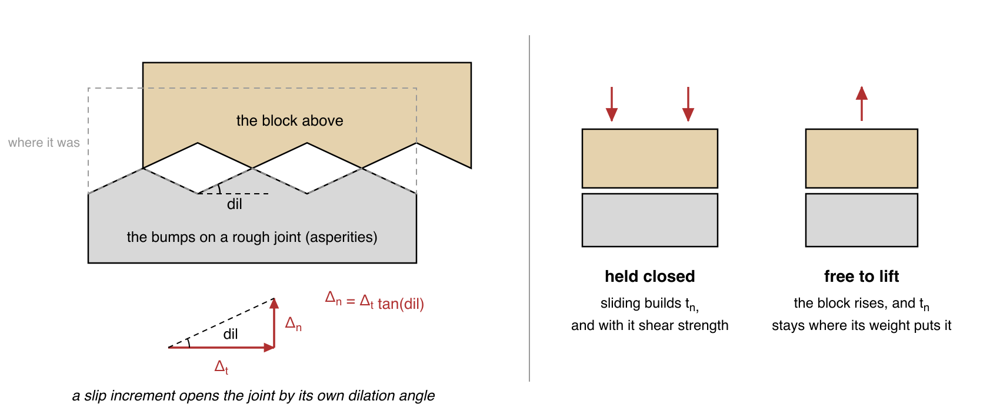{width=950}

Where the material around the joint holds it closed, that is **dilatant hardening**: sliding builds
normal stress and with it shear strength. Where the sliding block is free to lift, it lifts instead,
and the normal stress stays at whatever equilibrium with the block's weight requires. The joint opens whichever direction it slides, since the opening depends on how far it slips and
not on which way. Blank is zero.

**There is no limit on the opening.** A real joint stops dilating once it has climbed or sheared
off its bumps, so its opening is limited to about the bump height. The law here has no such limit
and keeps opening at the stated angle for as long as the joint slides. That simplification is
harmless at the slips a standing model reaches, which are millimeters, and a joint that slides far
enough for the limit to matter is on a slope that has already failed.

### Strength reduction

A strength reduction divides $c_j$ and $\tan\phi_j$ by the trial factor along with the soil's, on
both the peak and the residual branch, on every jointed line. A line that sets `Jred = No` is
left at full strength while everything else is weakened. Use that for a contact whose strength is
known and not in question, such as a wall's base on a prepared bedding or a liner with a measured
interface friction; a natural joint whose strength is uncertain is part of the margin the search is
looking for, and should be reduced with the rock. The stiffnesses `kn` and `ks` are not
strengths, so they are not reduced, any more than the bar's are.

The element's own law — the peak limit, the residual drop and the opening a dilating joint produces
per unit of slip — is checked against its closed forms by `test/joint_element_check.py`.

## What the Method Can and Cannot Model

The element is a small-strain interface between **fixed node pairs**. A pair carries compression
across the joint and Coulomb shear along it, opens when the normal stress goes into tension, slips
when the shear reaches its limit, and re-closes when the two faces meet again — and it keeps the
partner it started with for the whole solve.

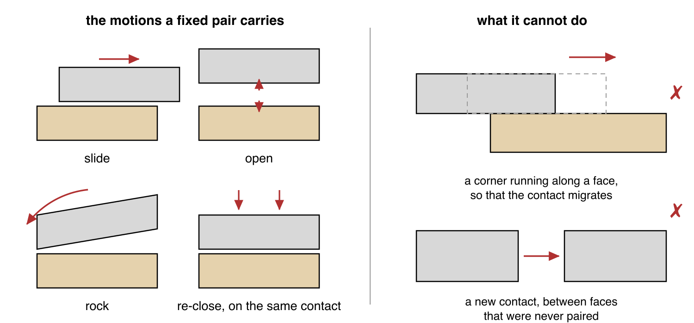{width=950}

So blocks slide on their contacts, open at them, tip about them and settle back onto them, and
where the blocks keep the same contacts throughout, the answer is the one rigid-block statics gives.
What the element cannot do follows from the same construction: a corner cannot travel along a face,
so a contact cannot move or shorten as a block moves; no new contact forms between two faces that
were not paired to begin with; rotations have to stay small, because the element is written on the
undeformed geometry; there is no excavation stage; and the joint obeys Mohr-Coulomb with a residual
strength and a dilation angle, rather than a hyperbolic or work-softening law.

That covers the mechanisms a jointed slope usually fails by — block toppling, flexural toppling,
plane failure, step-path failure through rock bridges, plowing slabs, a mass cut into many small
blocks, a block wall sliding and tipping on its courses, an embankment sliding on its base sheet.

The factor of safety a jointed strength reduction reports is
valid: it is the factor by which the joint strengths can be reduced before the mass starts to move,
which is the same quantity the closed forms and a distinct element strength reduction report. On
the problems that have a closed form the method reproduces them — a slab on a daylighting bedding
plane to within a bisection step of tan φ / tan β, the block toppling stacks of Goodman & Bray to
within a few percent ([Tutorial FEM-5](../tutorials/fem05_rock_slope_joints.md) works the first by
hand). What the method does not answer is anything about the movement after that point: how far
the blocks travel, where they come to rest, or what they strike on the way. The deformed section
at failure shows the mechanism that starts, not the run-out. Those questions need a distinct
element program such as UDEC, in which blocks separate, rotate through large angles and make new
contacts as they go, or a rockfall program that follows each block down the slope.

Jointed models need far more iterations than models without joints; see
[Running a Jointed Model](#how-many-iterations-a-jointed-model-needs) for the limits and how to continue a run.

## Inputs

A joint enters a model as a row on the **joints** worksheet of the
[input template](../usage/input_template.md#worksheet-joints), one line per row with its
endpoints and properties. You can type those rows into the workbook in Excel, edit them in
Studio's joints editor, or have XSLOPE generate a whole network of them from a pattern you
describe. A reinforcement line can also be declared a joint on the reinforce worksheet, so that
the soil slides on the sheet instead of bonding to it.

### The joints worksheet

One row per line: a `Label`, the endpoints `x1, y1, x2, y2`, and the properties above — `c`, `phi`,
`c_res`, `phi_res`, `dil`, `t_cut`, `kn`, `ks` and `Jred`. Only `phi` and the endpoints are
required; every other column is blank for the ordinary case. The columns and their units are
documented with the rest of the template under
[Worksheet: joints](../usage/input_template.md#worksheet-joints). In Studio the same rows are
edited in the joints editor, as a table or one line at a time with the section drawn beside it.

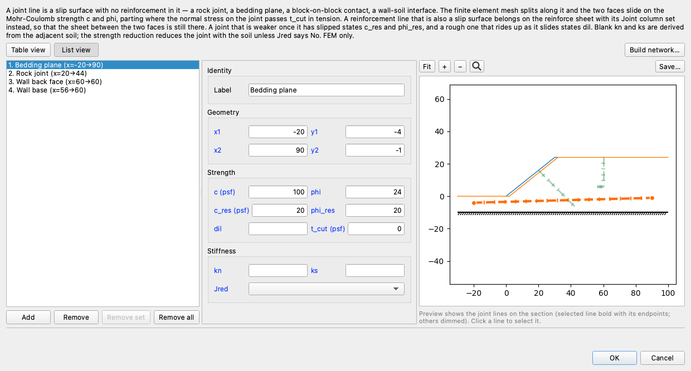{width=1240}

### Generating a network of joints

A jointed rock mass may have hundreds of joints. To create a network of joints in Studio, press
[Build network](../studio/editing.md#build-network) on the joints editor, choose the pattern,
enter its numbers and pick the region; the canvas previews the joints before anything is written.

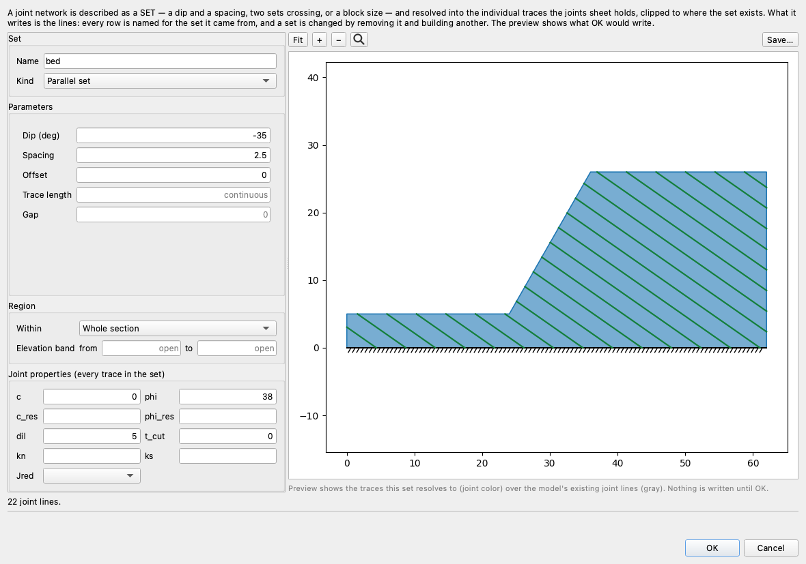{width=1180}

A joint network is built from one of three kinds of pattern, chosen in the dialog's **Kind**
selector:

- **Parallel set.** One family of joints at a given dip and spacing, such as bedding planes every
  2 m dipping 35° out of the face.
- **Cross-jointed (two sets).** Two such families crossing, such as bedding plus a steeper joint
  set, which cuts the rock into blocks.
- **Voronoi (blocky mass).** A random pattern of blocks of a given size, for a rock mass with no
  preferred joint direction.

Each kind has its own numbers, which appear below the selector. **Within** says where the set
exists: the whole section, one material, or a region you draw. A drawn region is a polygon on
the polygon sheet with its **Type** set to `joints` (see
[joint regions](../usage/input_template.md#joint-regions) on the template page), and
**Elevation band** limits the set to a range of elevations. No joints are written outside the
region.

Enter a name for the set in the **Name** field, or keep the one the dialog offers (`set1`,
`set2`, …). The generator writes one row per joint on the joints worksheet and labels each row
with that name and a number, so a set called `bed` gives `bed-01`, `bed-02` and so on. To
remove the network later, select any of its rows in the joints editor and press **Remove set**.
XSLOPE keeps the lines, not the pattern that made them, so to change a network you remove the
set and build a new one.

To generate a joint network from a Python script, call `parallel_set`, `cross_jointed` or
`voronoi` from `xslope.joints`; they write the same rows.

### A reinforcement line as a joint

Joints are also used with reinforcement lines. To make a reinforcement line a slip surface,
set its **Joint** column to `Yes` on the reinforce worksheet, or the Joint field in Studio's
reinforcement editor. The mesh then
splits along the line and the sheet sits between two interfaces, one against the soil above and
one against the soil below, whose strength comes from the line's own **Adhesion** and **Delta**.
The sheet's two interfaces act in series where a line on the joints worksheet has a single
contact. How such a sheet is anchored, and what the bar carries once the interfaces carry the
grip, is on the reinforcement page under
[Ends, ties and the bar](reinforcement.md#ends-ties-and-the-bar); when a sheet should be a
joint and when it should be a bonded bar is worked through in
[Tutorial FEM-3](../tutorials/fem03_block_wall_joints.md#part-3-when-a-sheet-is-a-slip-surface-and-when-it-is-bonded).

A reinforcement line that ends on a joint line, or crosses one, must be a joint itself or stop
short of the joint, and a pile, which cannot be a joint, has to stop short. The split gives every
node on the joint one copy for each side, and a bonded bar attaches to the soil's own nodes, so a
bar standing on one of those nodes has no single side to attach to. A geogrid running back from a
block facing ends on the back-face joint, which is why each sheet in such a wall is set to
`Joint = Yes`. The model checks name the line and the joint before the mesh is built, and count
an end that misses the joint by less than the mesher tells apart as being on it.

## Running a Jointed Model

A jointed model is run the way any other finite element model is: build the mesh, open
**Run → Run FEM…**, choose the strength reduction, and press **Run**. The differences are in
how many iterations the run needs, how each trial is judged, and what the results show.

### How many iterations a jointed model needs

A joint reaches equilibrium by slipping a little at a time, so a jointed model settles over tens
or hundreds of thousands of iterations where a model without joints settles over hundreds.
The search narrows a range of factors (the bracket) by halving it until it is small enough.
A strength-reduction trial that runs out of iterations before it has settled is recorded undecided.
When that trial is still the top of the final bracket, the run found no failure and reports the
factor of safety as "at least" the highest strength the slope came to rest at, since no trial
above it was shown to fail.

Set **Max iterations per trial** in Studio's Run FEM dialog to at least **100,000** for a jointed
model, in place of the 12,000 it opens with (`max_iterations` on `solve_fem()` and
`solve_ssrm()` in Python). Allowing more costs almost nothing, because a trial that settles stops
as soon as it has.

When a run stops short, the closing summary in the Log reports it: it gives the factor of safety
as "at least" some value, or states that the answer depends on the iteration limit. There are two ways
to give the run more iterations. On the FEM · Results toolbar, press
**Continue with a higher limit…**, enter a new **Max iterations per trial** (the dialog offers
five times the limit the run stopped at), and the search picks up where its trials stopped,
keeping every trial it has already decided. Or open **Run → Run FEM…**, raise **Max iterations
per trial** and the **Iteration ceiling** with it, and run again from the start; the answer is
the same. The geogrid wall of [Tutorial FEM-3](../tutorials/fem03_block_wall_joints.md) reports
a factor of safety of at least 1.56 at 100,000 iterations and gives way at 2.0 with the limit at
a million; the tutorial shows both runs.

### How a trial is decided {#how-a-trial-is-decided}

Every strength-reduction trial ends standing, sliding or undecided. A jointed trial needs extra
rules because a contact at its limit can keep flickering between slipping and gripping, or between
open and closed, after the slope has come to rest. A trial that converges needs no extra reading;
the rules judge one that neither converges nor runs away.

Almost all of the leftover force can sit on the joints. On one rock slope the force reading was
a million times larger on the joints than in the rock, and it stayed at that size however long
the trial ran. More iterations do not remove an imbalance of that kind.

Use the default `hybrid` [failure criterion](solver.md#ssrm-failure-criteria) for a jointed model:
it accepts a trial shown to be standing even when the force tolerance is not met. The
`non_convergence` criterion requires convergence and counts an otherwise settled jointed trial
as failed, except where the solver leaves the trial undecided; it is kept for reproducing
published results obtained that way.

#### Slipping or standing

A trial counts as sliding when the ground and the joints keep moving without appreciable slowing
over the last part of the run. The check waits until late in the run: a slow trial can look like
a sliding one for tens of thousands of iterations. A trial whose movement is still slowing
is given more iterations, up to the limit set for the run.

A trial counts as standing when, over the second half of its run, the joints have stopped
slipping, the ground has stopped moving, the rock or soil away from the joints is in balance,
and the leftover force on the joints has stopped falling. If it is still falling, the trial may
yet converge outright, so it runs on.

A standing trial raises the lower end of the search for the factor of safety, and a sliding one
lowers the upper end. A trial that neither test decides is judged the same way as a trial
without joints; see [Trials that reach the iteration limit](solver.md#creep-trend).

#### Contacts that cycle

Where a joint has cohesion but no tensile strength, a contact at zero normal stress can keep
switching between closed, carrying shear, and open, carrying nothing. Held closed, it would
need tension to balance; held open, the faces would have to overlap. Neither is allowed by the
joint law, so the contact keeps cycling while the rest of the slope stays still.

Such a trial counts as standing only if it reaches the **Iteration ceiling** (the most iterations
any trial may be given) with a few contacts repeating the same short cycle exactly and the rest
of the slope not moving. The Log and report name the contacts and note that force balance was
not met: "stands: the only movement is 3 contacts cycling (period 8 iterations), no net movement;
force balance not met".

#### Finishing a slow jointed trial {#finishing-a-slow-jointed-trial}

The ordinary iteration treats a slipping joint as if it were still stiff, so it closes in on
the balanced state very slowly; on one toppling trial it took 13,000 iterations to cut the error
a thousandfold.

While a trial is slowing down, the run periodically takes a shortcut: from the state already
reached, the [Newton corrector](solver.md#finishing-a-trial-with-the-newton-corrector) solves
directly for a balanced state, keeping the joint's slip and opening history. The ordinary
iteration then continues from that state to confirm that the slope stays put (the hold test).
If the shortcut or hold test finds nothing acceptable, the ordinary iteration carries on unchanged.

The shortcut is on by default; `joint_newton=False` turns it off.

Jointed trials are sped up by default; the answer is unchanged. The Log's opening lines show
whether acceleration was on.

The [jointed-model reference](solver.md#jointed-models) on the Solver page gives the numerical
limits, windows, recorded results and the solver options (`fem_solver`, `joint_tangent`,
`accelerate`) behind these rules.

### What the results show

For jointed models, the results panels include features that show what the joints are doing: on
the shear strain panel every joint is drawn and colored by how far it has slipped, the deformed
section is drawn as the blocks the joints cut it into, and **1D Details…** lists every jointed
line with the stresses along it.

On the shear strain panel every joint is a thin line along its trace, colored on a green scale
titled *Joint slip* by how far its two faces have slid. A closed joint, one that has not slipped,
is a gray hairline. A stretch that has **opened** is drawn as two thin gray lines with a white gap
between them, since opening is a condition rather than an amount; no other line carries white. A
jointed reinforcement sheet is drawn as its two faces, one on each side of the bar. A key names the
three states in a corner of the panel that the section does not reach, or below the panel when the
section reaches every corner, and a model where no joint slipped carries no slip colorbar. On a
model whose soil or rock can yield, the joints are drawn over the strain field and the panel keeps
its strain title and colorbar, with the slip colorbar beside it; on a model whose every material is
elastic there is no strain to draw, and the panel is the joints' own, titled *Joint slip*. The
lines are kept thin because a generated network puts hundreds of them over the field.

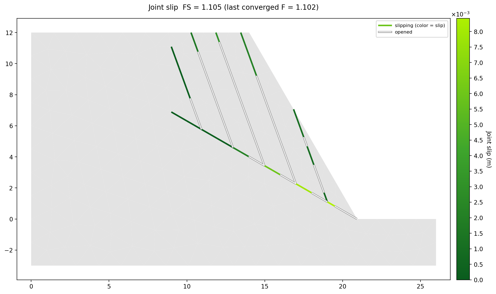{width=900}

**Show joints** is set separately for the shear strain panel and the deformed mesh panel, and
is on for both by default on a jointed model. On the **Deformed mesh** panel, with it on, the
deformed section is drawn as the **blocks** the joints cut it into: the section under a faint
tint, one per material, the joints drawn as on the shear strain panel, and the deformed outline as a
dark line against the dashed undeformed outline. Two things differ from the shear strain panel: a
closed joint keeps the full joint-face weight, so the thick gray joints outline the blocks, and the
slipping joints are drawn at that same weight. The panel carries its own slip colorbar and key. A block is a piece of the mesh that moves as one body; the mesh split gives
the two sides of a joint their own nodes, so the pieces between joints are found by following
which elements still share nodes. A jointed failure looks like this, blocks moving as bodies with
all of the movement taken up at the joints, and a joint that has slipped or opened shows as two
lines that no longer lie on each other. The element grid is drawn under the blocks, in light
gray, when the model has eight or fewer jointed lines and left out when it has more, so a
generated network stays readable; **Element edges** in the display panel turns it on or off
either way. **Color by block** sets the fill: off (the default), one tint per material; on, each
block under its own tint so the bodies can be told apart. The toppling stack of Tutorial FEM-5
with the grid on and off:

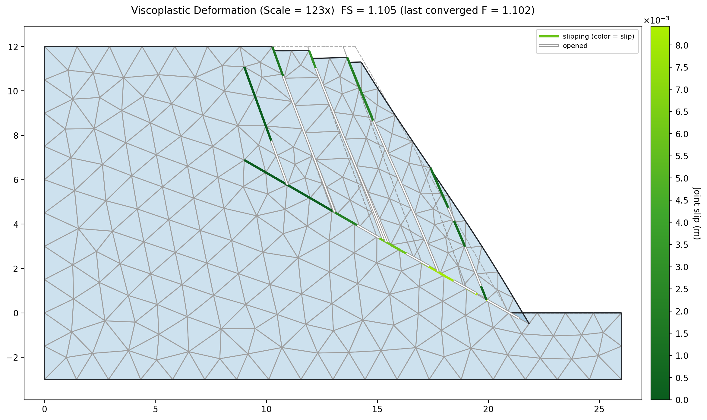{width=900}

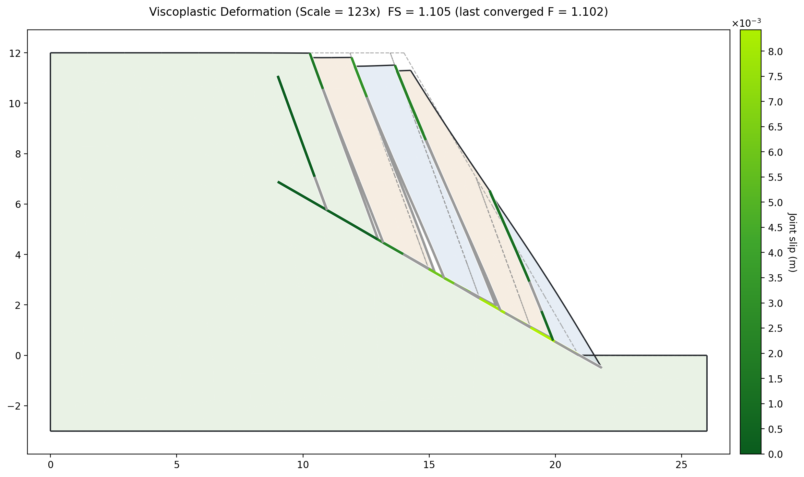{width=900}

With Show joints off the panel draws the ordinary deformed mesh. The **Displacement vectors**
panel is the same as on any other model.

**1D Details…** lists every jointed line, from the joints sheet and from the reinforce sheet
alike, under a *Joints* heading, and draws panels along each line: the normal stress on the
interface, the shear stress with its Mohr-Coulomb limit drawn beside it, and the slip. A
reinforcement line that is also a joint gets a fourth panel above those, the bar's tension against
its capacity; a joints-sheet line has no bar and shows the three. Where the shear stress meets its
limit is where the interface is slipping. A
generated report gives the same information as a table: the share of each line's length standing at
its limit, and the largest offset the two faces reached.

{width=900}

#### Shear traction zigzag on a gripping interface {#shear-zigzag}

Along a stretch of interface
that is not slipping, the shear traction plotted station by station can alternate high and low:
the end stations of each interface element read low and the middle station reads high. The
stations are the element's three node pairs, and each pair's traction is the force passed
through that node divided by the length of interface the node stands for, one sixth of the
element at each end and two thirds in the middle. Where the interface grips, its relative
displacement is tiny, so the traction at a pair is set by the force the neighboring soil
elements pass through that node. Quadratic soil elements pass the forces carried through their
bodies to their mid-side nodes (the weight of a six-node triangle, for instance, is carried
entirely at its three mid-side nodes), and that is what the middle stations show. The zigzag comes
from that sharing rather than from a variation of the stress along the sheet: the element average, one sixth of
each end station plus two thirds of the middle one, is the force the element actually
transfers, it runs smoothly, and a ten times stiffer interface does not change it. It
disappears where the interface slips, because every slipping station is held at its own
Mohr-Coulomb limit, which follows the normal stress. Read a gripping stretch by its element
averages, not station by station.
## References

Goodman, R.E., Taylor, R.L., & Brekke, T.L. (1968). A model for the mechanics of jointed rock.
*Journal of the Soil Mechanics and Foundations Division*, 94(SM3), 637-659.

Schellekens, J.C.J., & de Borst, R. (1993). On the numerical integration of interface elements.
*International Journal for Numerical Methods in Engineering*, 36(1), 43-66.
