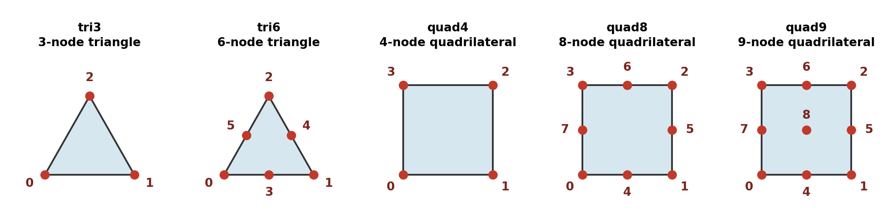
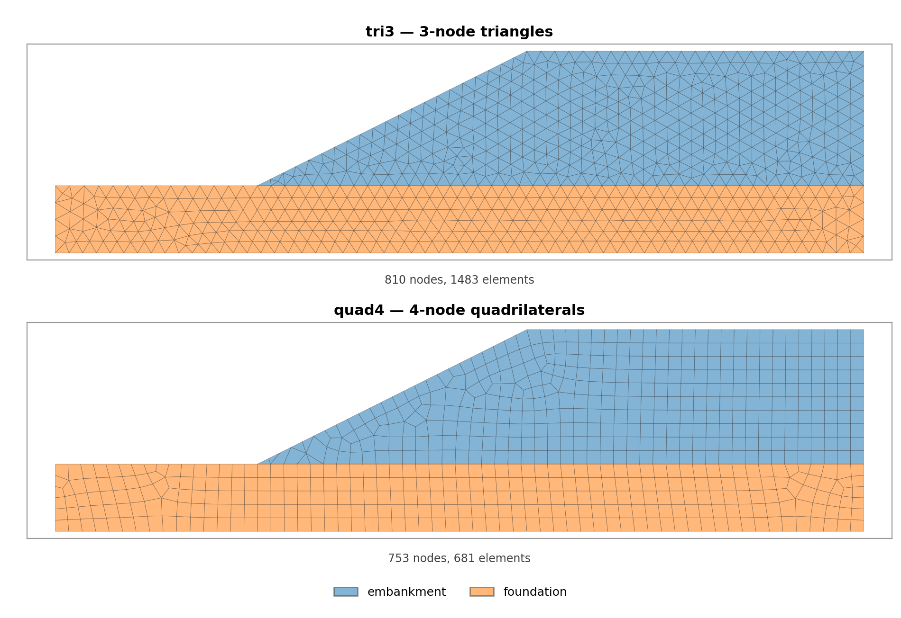
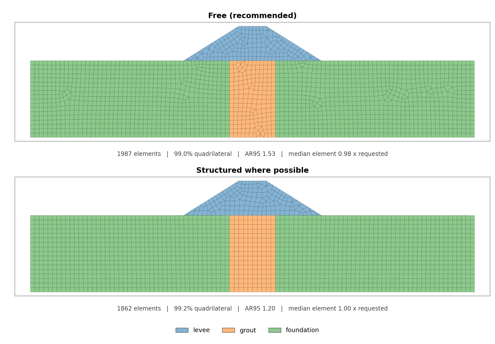
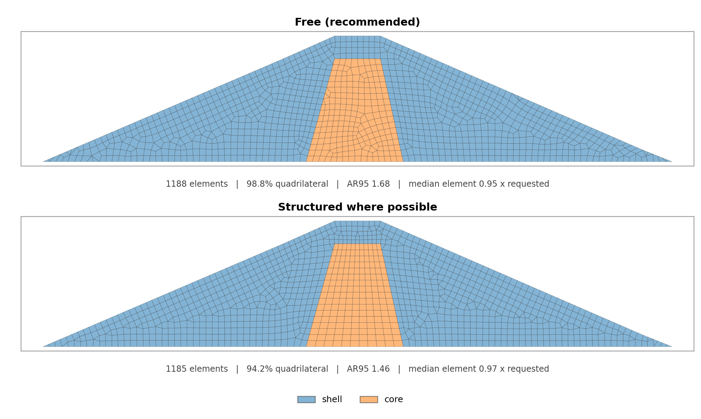
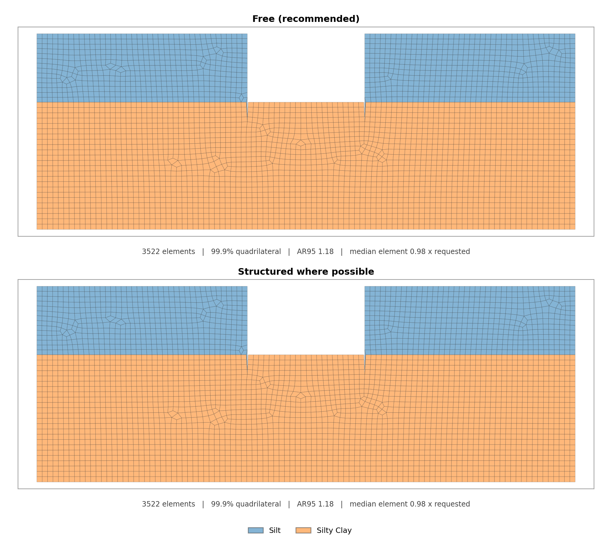
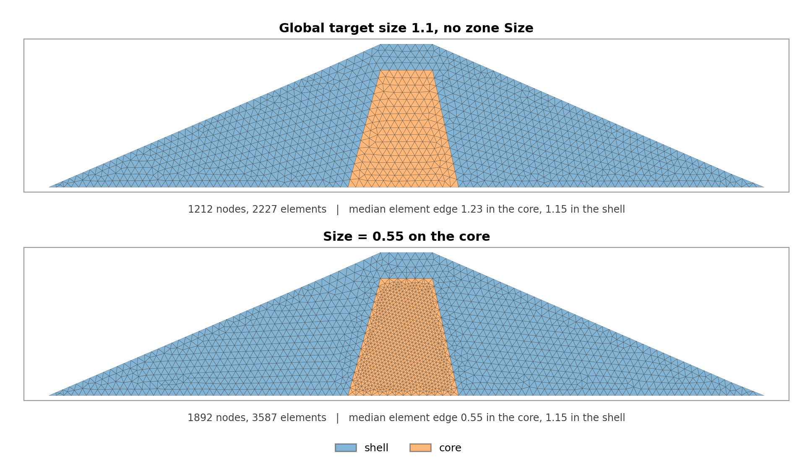
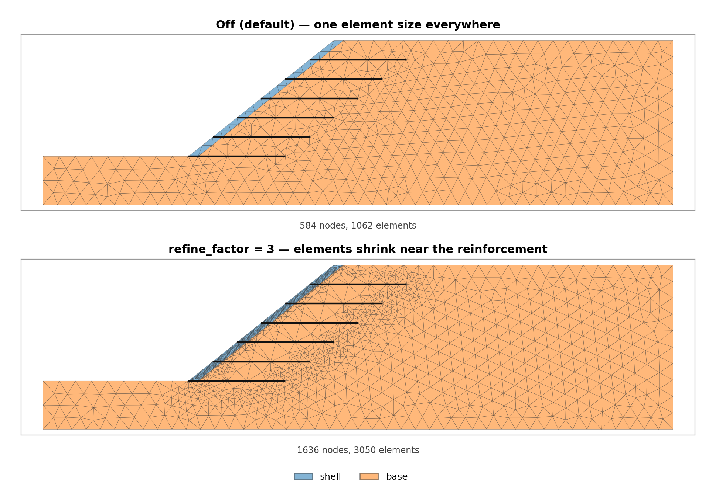

# Mesh Generation

Seepage and finite-element analyses run on a mesh of triangles or quadrilaterals
covering the section. Limit-equilibrium analysis does not need one. You build the mesh
explicitly — in Studio with **Build Mesh**, or in a script with
`build_mesh_from_polygons()` — and it is saved beside the model as `{stem}_mesh.json`,
so one mesh serves every run until the geometry changes.

Meshing happens in two stages. First the model's geometry becomes a set of closed
material-zone polygons whose shared boundaries match exactly. Then
[gmsh](https://gmsh.info) fills each polygon with elements and welds the zones together
along those shared boundaries, so the mesh conforms across every material interface and
no element straddles one. gmsh is an optional dependency:
`pip install "xslope[fem]"`.

## Building a mesh

### In Studio

In **Seepage** or **FEM** mode, **Build Mesh** opens a dialog with the element type, the
target element size, the quadrilateral style, and the feature-refinement switch:


The target size is either entered directly or auto-sized as the width of the section
divided by a number of divisions (100 by default). The mesh is built on a background
thread, appears in a **Mesh** tab, and is written to the `{stem}_mesh.json` sidecar;
**Run** stays disabled until a mesh exists, and a geometry edit that invalidates the
mesh clears it. The dialog is described control by control under
[Studio → Building a mesh](../studio/analysis.md#building-a-mesh).

### From a script

The same build in Python. Reinforcement and pile lines are extracted first so their
vertices become polygon vertices, which is what lets gmsh recover them as element edges:

```python
from xslope.fileio import load_slope_data
from xslope.mesh import (build_mesh_from_polygons, export_mesh_to_json,
                         extract_constraint_line_geometry, extract_size_regions,
                         get_material_polygons)

slope_data = load_slope_data("xslope_earth_dam1.xlsx")

lines, n_reinf, n_pile = extract_constraint_line_geometry(slope_data)
polygons = get_material_polygons(slope_data, reinf_lines=lines or None)

mesh = build_mesh_from_polygons(
    polygons,
    target_size=1.1,
    element_type="tri6",
    lines=lines or None,
    size_regions=extract_size_regions(slope_data),
)
export_mesh_to_json(mesh, "xslope_earth_dam1_mesh.json")
```

The returned mesh is a dictionary of NumPy arrays:

| Key | Contents |
| --- | --- |
| `nodes` | `(n_nodes, 2)` node coordinates |
| `elements` | `(n_elements, 9)` node indices per element; unused slots are 0 |
| `element_types` | nodes per element — 3, 4, 6, 8 or 9 |
| `element_materials` | material ID per element, 1-based in `mat` sheet order |
| `elements_1d`, `element_types_1d`, `element_materials_1d` | the same three arrays for embedded 1D elements, present only when `lines` is given |

## Element types

Five element types are available. The linear types, `tri3` and `quad4`, carry their
solution variable linearly across the element; the quadratic types, `tri6`, `quad8` and
`quad9`, add midside nodes and carry it quadratically, which resolves a curving field
with far fewer elements.

`build_mesh_from_polygons()` defaults to `tri6`, and Studio's *Build mesh* dialog opens
on it. A quadratic mesh is therefore what a run gets whenever nothing states otherwise —
including a model whose `main!D18` is left blank. `tri3` is the explicit lighter choice,
typical of seepage meshes, where the solve is cheaper and nothing is lost. It is never
the right choice for a factor of safety; see
[Element choice for FEM analyses](#element-choice-for-fem-analyses) below.



Node ordering is the same for every type: corner nodes first, counterclockwise, then the
midside nodes in edge order (0–1, 1–2, and so on), then — for `quad9` alone — the center
node. Counterclockwise corners give a positive Jacobian everywhere, which the element
integration relies on. Each row of `elements` holds the nodes in that order, and the
matching entry of `element_types` says how many of the nine slots are used.

| Type | Nodes | Variation within the element | Built from |
| --- | --- | --- | --- |
| `tri3` | 3 | linear | — |
| `tri6` | 6 | quadratic | `tri3` |
| `quad4` | 4 | bilinear | — |
| `quad8` | 8 | quadratic (serendipity) | `quad4` |
| `quad9` | 9 | quadratic (Lagrange) | `quad4` |

### Triangles or quadrilaterals

Both fill any section. The difference is what they cost and how they behave:



At one requested element size the two meshes carry a similar number of nodes — which is
what sets the size of the solve — but the quadrilateral mesh reaches it with roughly half
as many elements. Triangles fit an irregular boundary with less distortion and never fail
to fill a corner; quadrilaterals give a more regular element layout wherever the shape
allows.

For a finite-element stress analysis the choice that matters more is linear against
quadratic — see the next section. Between the two shapes, `tri6` conforms better to
irregular geometry, and `quad8` or `quad9` give the more regular element layout wherever
the section is block-like.

A quadrilateral mesh is quad-*dominant* rather than pure: a small fraction of elements,
usually well under one percent, stays triangular where no pairing exists. XSLOPE carries
mixed meshes end to end, so those triangles are cosmetic.

### Element choice for FEM analyses {#element-choice-for-fem-analyses}

**Do not use linear elements with the FEM or SSRM solver.** `tri3` and `quad4` suffer
[volumetric locking](overview.md#element-type-selection-and-volumetric-locking): plastic
flow under Mohr-Coulomb is nearly incompressible, and a linear element has too few degrees
of freedom to shear at constant volume and represent the displacement field at the same
time. It responds too stiffly, resists the developing failure mechanism, and needs a
larger strength reduction before it collapses — so the factor of safety comes back **too
high, in the unconservative direction**. On the Griffiths & Lane Example 1 benchmark, at a
target size of 5 against a reference of about 1.40, `tri3` returns 1.70 (+21%) and `quad4`
returns 1.56 (+11%), while `tri6`, `quad8` and `quad9` all return 1.41 (under 1%).

Use `tri6`, `quad8` or `quad9` for any finite element or strength-reduction run. The run
gate warns before a FEM or SSRM solve starts on a linear mesh; it is a warning rather than
a refusal, because demonstrating the locking is itself a legitimate reason to solve one.

`tri3` remains the right choice for **seepage**. The seepage field is scalar, no
incompressibility constraint exists, nothing can lock, and the smaller system solves
faster. Linear triangles are also fine for an elastic stress distribution or for
qualitative work — never for a factor of safety.

## Quadrilateral meshing styles

A quadrilateral element type can be meshed in either of two styles, chosen per run:
`build_mesh_from_polygons(..., quad_style='free' | 'structured')` in a script, or the
**Quadrilateral style** radio group in Studio's *Build mesh* dialog. Triangular element
types ignore the setting. Both styles are driven by the same requested element size, so
switching between them changes how the elements are arranged, not how big they are.

**Free** is the default and the right choice for most sections. gmsh's
Frontal-Delaunay-for-quads algorithm lays down a triangulation whose points are placed so
that pairs of triangles form near-square quadrilaterals, and the Blossom algorithm of
[Remacle et al. (2012)](https://doi.org/10.1002/nme.3279) decides which triangles to pair
by solving a global minimum-cost perfect matching over the whole zone. It works on any
shape and needs nothing of the geometry.

**Structured where possible** adds a sweep in front of that. Each material zone is tested
against a conservative mappability check — four logical sides, opposite sides of
compatible length, corners near square, and a predicted element aspect ratio no worse
than 2:1 — and every zone that passes is filled with a regular grid of rows and columns.
The row and column counts come from the requested element size, and a boundary shared by
two zones gets exactly one count, so a swept zone and its free-meshed neighbor meet at the
same node spacing with no hanging nodes. Choose it when the section is built of block-like
zones — a layered foundation, a cutoff or grout curtain, a rectangular core — where rows
of aligned elements are worth having.

A zone the check declines is simply meshed by the free mesher, and the rest of the model
is unaffected. The sweep is a per-zone improvement, never a whole-mesh commitment, so this
style cannot produce a worse mesh than the default — at worst it *is* the default. The
three sections below show what that means in practice. Each is meshed with `quad4`
elements at the same requested size in both panels, the section width divided by 100.
AR95 is the 95th-percentile element aspect ratio — longest corner edge over shortest — so
lower is better, and the last figure in each caption is the median delivered element size
as a multiple of the size requested.

**A levee on a blocked foundation.** The three foundation blocks sweep as exact grids. The
embankment is a trapezoid whose base and crest differ by about 5:1, and a grid swept
through that shape would have to stretch its elements by the same ratio, so it is declined
and stays free-meshed in both panels.



**An earth dam with a central clay core.** Only the core is mappable; the shell that wraps
around it is not. The swept core is visibly regular, and the aspect ratio of the mesh as a
whole improves, but the free-meshed shell now has to close against a fixed grid, which
leaves a few more triangles behind than the free mesh did.



**A dredged trench in silt.** No zone passes the check — the trench gives each of them
more corners than the four a swept grid needs — so every zone falls back to the free
mesher and the two panels are the same mesh, element for element. A section like this is
the reason the style is named *where possible*: a partly structured mesh, or no structure
at all, is the expected result rather than a sign that something went wrong.



The style is not stored in the input file. A model re-opened elsewhere meshes in the
default style unless a mesh built at the other setting travels with it as the companion
`{stem}_mesh.json`.

## Element size

### The global target size

`target_size` is the requested element size, in model length units, and both triangular
and quadrilateral meshing work at that size directly — nothing rescales it internally.
Studio's auto-sizing offers the width of the section divided by 100, which puts roughly
100 elements across a typical model; the **Mesh target size** cell on the `main` sheet
overrides that opening value.

One background size field decides the element size everywhere, for both element
families and whether or not anything is being refined: the requested size in the far
field, and a graded band around each refined feature. Nothing else sets a size — the
geometry's own vertices and edges carry no element count, so no polygon edge can be
discretised coarser than what was asked for. Delivered node spacing along the geometry
runs 0.75 to 1.00 times the requested size across the sample and verification sections;
the shortfall is gmsh rounding a curve up to a whole number of divisions, which can only
make an edge finer.

Where a band is refined, the size grows back to the target at about 1.2 per element.
That rate is fixed and internal: it is the value that keeps the worst element in the
corpus well shaped on both families, and there is nothing to set.

Structured quadrilateral sweeps are the one exception, and deliberately so — a swept
zone's rows and columns are counted from the requested size and laid down as a grid, so
the field governs the free zones around it rather than the sweep itself.

### A Size on one zone

A material zone can ask for a finer size of its own through the **Size** cell on its
polygon (or on its profile line). Everything outside keeps the global target size, and the
size grows smoothly back to it across the zone boundary rather than stepping, so there is
no abrupt change in element size at the interface:



A Size only ever refines — a value at or above the global target has no effect, and
XSLOPE warns rather than silently ignoring it. A polygon whose **Type** is `refine`
carries nothing *but* a Size: it is not a material, never becomes a mesh region, and only
makes the mesh finer where it is drawn. Refine polygons reach the mesher through
`extract_size_regions()`, passed as `size_regions`. Both are described on the
[Input Template](../usage/input_template.md#refine-regions) page.

A Size resolves a zone it is entered on, however thin the zone is — the size field
reaches the zone's boundary as well as its interior. What a Size cannot do is find the
zone: for that, and for a section whose thin bands nobody has gone through by hand, use
the automatic thin-zone refinement below.

### Refining near features

Some models concentrate their numerically demanding behavior in a few small features —
load transfer along a reinforcement or pile line, the singularity at a crack or notch tip,
the kinematics inside a thin soft band. Refining the whole domain to resolve them is
wasteful. `refine_factor` shrinks elements only where a feature is present and lets them
grow smoothly back to the target size elsewhere:

```python
mesh = build_mesh_from_polygons(
    polygons,
    target_size=2.9,
    element_type="tri3",
    lines=lines,
    refine_factor=3.0,             # local size = target_size / 3; None (default) = off
    refine_features=None,          # None = reinforcement, piles, cracks, thin zones
)
```



Both panels are the same reinforced slope at the same target size. In the lower one every
one of the six reinforcement lines carries a band of finer elements, and the thin shell
along the face — detected as a thin zone, not as a line — is refined along its whole
length.

Features are detected from the model geometry; there are no coordinates to enter by hand.
The classes are:

- **Reinforcement and pile lines** — the embedded 1D lines get a distance-based band,
  finest along the polyline and coarsening away from it.
- **Crack and notch tips** — the deepest vertex of a slit, where the material wraps
  almost all the way around the point, such as the notch a sheet-pile wall is modelled
  with. Tips are refined twice as strongly, to resolve the singularity that governs
  convergence there. A sharp *convex* corner is not a tip and is not refined: a layer
  tapering to a point across the section, or an embankment toe, has the same edge
  directions as a slit and none of the physics.
- **Thin material zones** — a zone whose local width cannot fit three elements at the
  target size is refined until it can, subject to the cap below. The refinement follows
  the zone's own shape, so an inclined band is resolved without over-refining its
  neighbors.
- **High-contrast material interfaces** — a boundary between two zones whose major
  hydraulic conductivities differ by 100× or more, where a seepage solve must resolve a
  steep head gradient. This class is **opt-in**: it needs conductivities that only a
  seepage model carries, so select it explicitly and pass them,
  `refine_features=['interfaces'], material_k={0: 1.67e-5, 1: 1.67e-7}`.

`refine_factor=None`, the default, adds no band: the background size field is the
requested size everywhere and the mesh is what it would be without the option. Refinement
composes with the field rather than editing the geometry, and detection is pure geometry,
so a refined mesh is reproducible from run to run. Each band holds its local size for
about two element widths and then grows back to the target at 1.2 per element, so a
refined region joins the far field gradually instead of stepping.

Because nothing else can outrank the field, a feature is meshed at the size that was
asked for: at a sheet-pile tip and along a reinforcement line the delivered size is
within about 15 % of the request on either family.

### Thin material zones {#thin-material-zones}

A thin zone is the one refinement case that is not an efficiency question. A soft seam
one element thick cannot carry a shear band, so the model finds no mechanism through it
and the analysis returns a factor of safety that is too high — quietly, with nothing in
the output to say the mesh was the reason. Because the failure is silent, Studio's
**Build mesh** dialog carries a **Refine thin zones** checkbox that is **on by default**;
it sizes every thin zone for about four element rows across its local width. A section
with no thin zone is meshed exactly as it would be with the box clear, and the Log names
each zone that was refined with the local size it received.

What counts as the zone's width is the **material's** thickness, not a polygon's. A
single layer is routinely stored as several polygons — a benched face or a step in the
ground surface cuts it into pieces — and each piece is thinner than the layer. Polygons
sharing a material are measured together, so a layer the global element size already
resolves is left alone even where its individual pieces would not be.

The refinement factor plays no part: a thin zone's size is its own thickness over four,
and the same at any factor. Two limits apply to that size. It is never coarser than the
global target — a zone the mesh already resolves is dropped from the plan, which is what
makes the option free on a section with no thin zone. And it is never finer than one
sixth of the global target.

That cap matters on a model whose thin band is small against its overall size. vp005's
filter zone is 2.9 units wide in a 648-unit section, so a quarter of its width is
eighteen times finer than the target element size — a refinement large enough to multiply
the node count, from a checkbox that is on by default and was never asked for on this
run. Capped, the zone gets six times the target instead, and carries about two element
rows rather than four.

A zone the cap leaves short is not left silent. The model checks measure the mesh that
was actually built and name any zone carrying fewer than three element rows, whatever the
reason, so an under-resolved band shows up in the checks panel rather than in a factor of
safety nobody can explain. The two ways to give such a zone the size it wants are a
**Size** on the zone, which is not capped, and a finer global target.

Both element families take the same mechanism: the `thin_zones` refine feature, whose
size field resolves the zone's interior and its own boundary alike. It composes with a
**Size** declared on the zone by taking the smaller of the two, so a declared size finer
than the derived one is what the zone is meshed at, and a declared size too coarse to
resolve the zone does not leave it unresolved.

On the Griffiths soft-band section at a 3-unit target size, the band carries 1.6 element
rows on a default triangular mesh and 1.2 on a quadrilateral one; with the option on both
carry 4.0.

From a script this is `refine_features=['thin_zones']` with a `refine_factor`. A `size`
on the polygon dict, or a `size_regions` entry, is the manual equivalent for a zone you
have measured yourself.

## From input file to material polygons

A model defines its geometry one of two ways, and the two are mutually exclusive — a file
that populates both sheets is rejected:

- **Polygon sheet.** Each material zone is drawn directly as a closed polygon. The
  polygons *are* the geometry, and they go to the mesher as they were entered.
- **Profile sheet.** Each material boundary is drawn as a profile line running left to
  right, entered from the top of the section downwards. `build_polygons()` closes them
  into zones: it projects each line's endpoints onto the boundary below to create the
  connecting vertices, then traces each zone between one line and the next, with the
  bottom zone closed off at `max_depth`.

Either way, `get_material_polygons()` is the single entry point that returns
mesh-ready zones, and it does the same preparation for both paths:

- Reinforcement and pile line vertices are inserted into the boundary edges they touch,
  so the mesh can recover the line as a chain of element edges.
- Distributed-load endpoints and seepage boundary-condition vertices are inserted the
  same way. Without them an element edge straddling a load end is dropped by the edge-load
  integrator and less load is applied than the model asked for.
- A zone pinched out to zero thickness — a dam core whose top line runs along the
  foundation beyond the core, for example — produces a self-touching ring that gmsh
  refuses. Those rings are repaired, and a zone split in two by a trench or key is kept as
  two regions carrying the same material.

Inside the mesher, one more pass makes adjacent zones conforming: where a zone's vertex
lands in the interior of a neighbor's edge, that edge is split there, so the interface
meshes without a slit. Every polygon becomes one gmsh surface tagged with its material,
and points shared between zones are created once and reused, which is what makes the
resulting mesh continuous across material boundaries.

## Quadratic elements

Quadratic meshes are built in two steps: gmsh generates the linear mesh (`tri3` for
`tri6`, `quad4` for `quad8` and `quad9`), then `convert_linear_to_quadratic_mesh()` adds
the extra nodes. This is more robust than asking gmsh for quadratic elements directly,
particularly when 1D elements are embedded in the mesh.

Each unique edge in the linear mesh receives one midside node at its midpoint, shared by
both elements that use the edge, so the mesh stays conforming. A `quad9` also gets a
center node at the average of its four corners. A leftover triangle in a `quad8` or
`quad9` mesh becomes a `tri6` — the mesh stays mixed rather than forcing a bad
quadrilateral. Embedded 1D elements stay 2-node: a truss uses only its end nodes, so a
midside node there would add no stiffness and could leave the system singular.

## Reinforcement and pile lines

Reinforcement lines, pile lines and other constraint lines are passed to
`build_mesh_from_polygons()` as `lines`, a list of polylines.
`extract_constraint_line_geometry(slope_data)` returns them from a loaded model in that
form, along with the count of each kind.

The lines are embedded in the 2D mesh rather than meshed separately: gmsh is required to
place element edges along each polyline, and the 1D elements are then extracted from those
edges. Every 1D node is therefore a node of the surrounding 2D mesh, which is what
transfers load between the reinforcement and the soil. A line that runs along the domain
boundary — on the base at `max_depth`, or along the ground surface — or that extends
outside the section cannot be embedded; it is rejected before meshing starts, with a
message naming the line, rather than producing a mesh the line is silently missing from.

Node spacing along a line comes from the size field like everything else — the global
target away from any refinement, and the local size where the line itself is a refined
feature. `target_size_1d` asks for a finer size along the lines specifically; left at
`None`, the default and what Studio passes, the lines simply follow the field. A value at
or above `target_size` is ignored, since the field composes by taking the minimum and a
coarser request could never bind. `element_materials_1d` numbers the lines 1, 2, 3, … in
the order they were passed, so each line's elements can be given their own properties.

## gmsh options

`mesh_params` is a pass-through: every entry is a gmsh option name set verbatim before the
mesh is generated, overriding the corresponding default.

```python
mesh = build_mesh_from_polygons(
    polygons, target_size=1.5, element_type="quad4",
    mesh_params={"Mesh.Smoothing": 20},        # extra smoothing passes
)
```

The defaults are chosen for slope geometry — Frontal-Delaunay for triangles, and
Frontal-Delaunay-for-quads with Blossom recombination for quadrilaterals — so this is an
escape hatch rather than a routine control.

## Saving and reusing a mesh

`export_mesh_to_json(mesh, path)` and `import_mesh_from_json(path)` write and read the
mesh as JSON. Studio writes `{stem}_mesh.json` next to the model automatically, and that
file is what a seepage or FEM run loads, so a mesh is built once and reused. The
[sample models](samples.md) ship with their meshes for exactly this reason.

`verify_mesh_connectivity(mesh)` and `print_mesh_connectivity_report(mesh)` inspect a
mesh after the fact: nodes duplicated at one location, nodes no element uses, and
elements that reference the same node twice.
