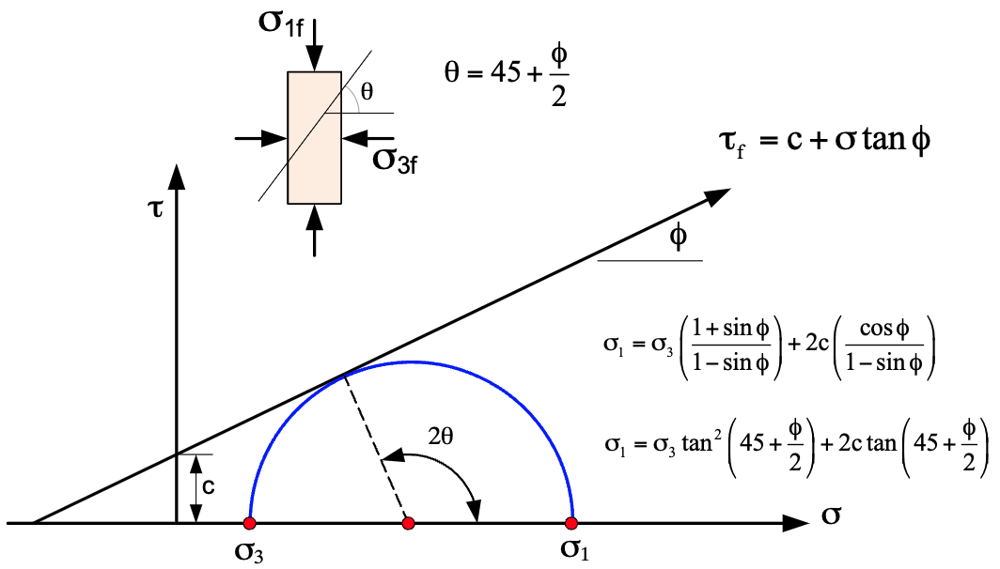
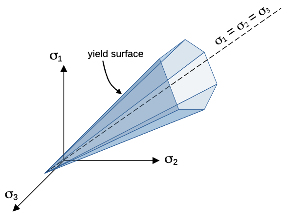
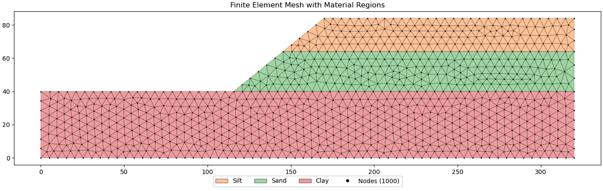
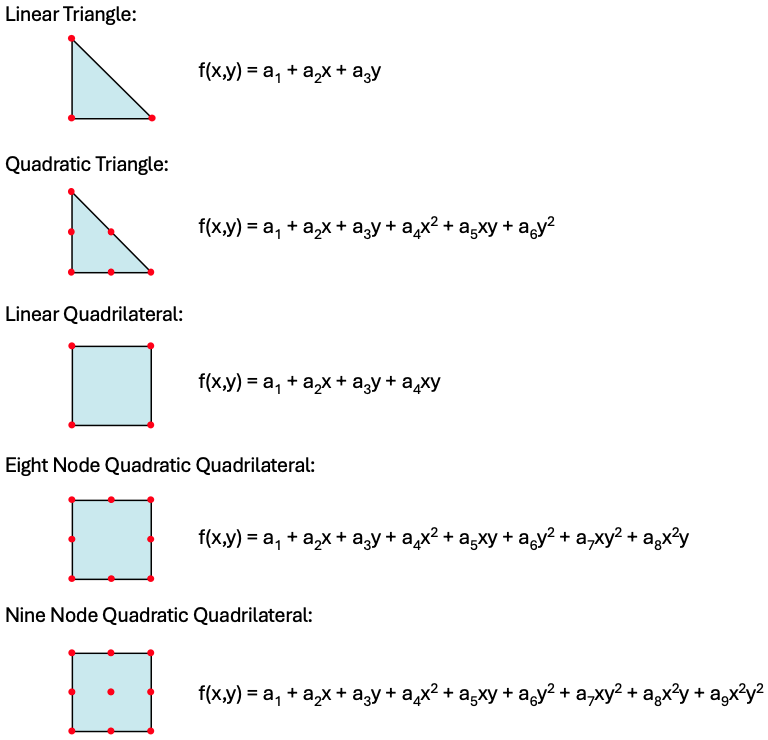

# Finite Element Method for Slope Stability Analysis

## Introduction

The finite element method (FEM) provides a powerful numerical technique for slope stability analysis that overcomes 
many fundamental limitations of traditional limit equilibrium methods. While limit equilibrium approaches require the engineer to assume a failure surface geometry and then check whether equilibrium conditions are satisfied, FEM allows potential failure mechanisms to emerge naturally through rigorous stress analysis and progressive failure development (Griffiths & Lane, 1999; Duncan, 1996). Rather than imposing kinematic constraints through assumed failure surfaces, FEM solves the complete stress-strain problem throughout the slope domain. The method can capture the complex stress redistribution that occurs as soil elements progressively reach failure, leading to the natural development of failure zones without prior assumptions about their geometry or location. Perhaps most importantly, FEM uses realistic stress-strain constitutive models that can capture the actual behavior of soil materials, including nonlinear elastic behavior, plastic yielding, strain softening, and progressive failure. This provides a much more accurate representation of soil response compared to the rigid-perfectly plastic assumptions typically used in limit equilibrium methods.

## Governing Equations

### Equilibrium Equations

The foundation of finite element slope stability analysis rests on the fundamental equilibrium equations that govern the static behavior of continuum mechanics. In two dimensions, these equilibrium equations express the requirement that forces acting on any infinitesimal element of soil must be in balance:

>>$\dfrac{\partial \sigma_x}{\partial x} + \dfrac{\partial \tau_{xy}}{\partial y} + b_x = 0$

>>$\dfrac{\partial \tau_{xy}}{\partial x} + \dfrac{\partial \sigma_y}{\partial y} + b_y = 0$

Here, $\sigma_x$ and $\sigma_y$ represent the normal stresses acting in the x and y directions respectively, while $\tau_{xy}$ denotes the shear stress. The body force terms $b_x$ and $b_y$ account for forces distributed throughout the volume of the material, with gravity being the most common example where $b_x = 0$ and $b_y = -\gamma$, where $\gamma$ is the unit weight of the soil.

These equations must be satisfied at every point within the slope domain for the system to be in static equilibrium. The challenge in slope stability analysis arises because soil materials exhibit nonlinear, inelastic behavior that violates these equilibrium conditions when failure occurs, leading to the progressive development of failure zones.

### Stress-Strain Relations

The constitutive behavior of soil in finite element slope stability analysis is typically modeled using an elastic-perfectly plastic framework that combines linear elastic behavior with Mohr-Coulomb plasticity. This approach recognizes that soil behaves elastically under small stress changes but exhibits permanent deformation once failure is reached.

During the elastic phase, before any yielding occurs, the relationship between stress and strain follows Hooke's law expressed in matrix form:

>>$\{\sigma\} = [D_e] \{\varepsilon\}$

The elastic constitutive matrix $[D_e]$ for plane strain conditions, which is most appropriate for slope stability problems, takes the form:

>>$[D_e] = \dfrac{E}{(1+\nu)(1-2\nu)} \begin{bmatrix}
1-\nu & \nu & 0 \\
\nu & 1-\nu & 0 \\
0 & 0 & \dfrac{1-2\nu}{2}
\end{bmatrix}$

This formulation requires several fundamental material properties that must be determined through laboratory testing or empirical correlations. Young's modulus $E$ governs the stiffness of the soil under loading, while Poisson's ratio $\nu$ controls the relationship between axial and lateral strains. For slope stability analysis, additional strength parameters are critical: the cohesion $c$ and friction angle $\phi$ define the failure envelope, while the unit weight $\gamma$ determines the gravitational body forces. The coefficient of earth pressure at rest $K_0$ is often needed to establish initial stress conditions, particularly for natural slopes that have developed under gravitational loading over geological time.

#### Typical Elastic Parameters for Finite Element Analysis

The following table provides typical ranges of elastic parameters for common soil types under **drained** conditions. 
These values should be used as initial estimates and refined based on site-specific testing when available.

| Soil Type | Young's Modulus $E$ [MPa] | Young's Modulus $E$ [kPa] | Young's Modulus $E$ [psf] | Poisson's Ratio $\nu$ | Notes |
|-----------|:-------------------------:|:-------------------------:|:-------------------------:|:--------------------:|-----------------|
| **Soft Clay** | 2 - 15 | 2,000 - 15,000 | 41,800 - 313,000 | 0.40 - 0.50 | Use lower E values for very soft clays |
| **Medium Clay** | 15 - 50 | 15,000 - 50,000 | 313,000 - 1,044,000 | 0.35 - 0.45 | Plasticity index affects stiffness |
| **Stiff Clay** | 50 - 200 | 50,000 - 200,000 | 1,044,000 - 4,175,000 | 0.20 - 0.40 | Overconsolidated clays have higher E |
| **Loose Sand** | 10 - 25 | 10,000 - 25,000 | 209,000 - 522,000 | 0.25 - 0.35 | Depends on relative density |
| **Medium Sand** | 25 - 75 | 25,000 - 75,000 | 522,000 - 1,565,000 | 0.30 - 0.40 | Well-graded sands toward upper range |
| **Dense Sand** | 75 - 200 | 75,000 - 200,000 | 1,565,000 - 4,175,000 | 0.25 - 0.35 | Angular particles give higher stiffness |
| **Loose Silt** | 5 - 20 | 5,000 - 20,000 | 104,000 - 418,000 | 0.30 - 0.45 | Non-plastic silts toward lower ν |
| **Dense Silt** | 20 - 100 | 20,000 - 100,000 | 418,000 - 2,088,000 | 0.25 - 0.40 | Cementation increases stiffness |
| **Gravel** | 100 - 500 | 100,000 - 500,000 | 2,088,000 - 10,440,000 | 0.15 - 0.30 | Well-graded, dense materials |
| **Rock Fill** | 50 - 300 | 50,000 - 300,000 | 1,044,000 - 6,260,000 | 0.20 - 0.35 | Depends on gradation and compaction |
| **Soft Rock** | 1,000 - 10,000 | 1,000,000 - 10,000,000 | 20,880,000 - 208,800,000 | 0.15 - 0.30 | Weathered or fractured rock |

The first column for E is for reference only. When working in metric units, E should always be entered in $Kpa$ to be consistent with the unit weights and cohesion values. For English units, E should always be entered in $psf$. 

   For undrained shearing conditions, the undrained modulus can be determined through several approaches:
  
  - **Direct Laboratory Testing**: Unconsolidated undrained (UU) triaxial tests or unconfined compression tests provide direct measurement of $E_u$. The initial tangent modulus from stress-strain curves gives the most representative value.
  
  - **Empirical Correlations**: For clays, $E_u$ can be estimated from undrained shear strength using:

    >>$E_u = (150-1500) \times S_u$

    where $S_u$ is the undrained shear strength. Use lower multipliers (150-400) for soft clays and higher values (400-1500) for stiff clays.
  
  - **Relationship to Drained Modulus**: For saturated clays, the undrained modulus is typically higher than the drained modulus:

    >>$E_u = \dfrac{E'(1-2\nu')}{(1-2\nu_u)(1+\nu')} \times \dfrac{(1+\nu_u)}{(1-\nu')}$

    where $E'$ and $\nu'$ are drained parameters, and $\nu_u \approx 0.5$ for undrained conditions. This often simplifies to $E_u \approx (1.2-2.0) \times E'$ for typical clay parameters.

- **Laboratory vs. Field Values**: Laboratory-derived moduli are often higher than field values due to sample disturbance and scale effects. Field moduli (from pressuremeter, plate load tests) may be more representative.

- **Empirical Correlations**: When direct testing is unavailable, Young's modulus can be estimated from standard penetration test (SPT) or cone penetration test (CPT) data using published correlations.

!!! NOTE
    In finite element slope stability analysis using the Shear Strength Reduction Method (SSRM), the elastic modulus E primarily affects the magnitude of computed deformations but has minimal impact on the calculated factor of safety. The factor of safety is governed by the strength parameters (cohesion c and friction angle φ) rather than the elastic response. Therefore, approximate values of E are often sufficient for slope stability calculations, and extensive effort to precisely determine elastic moduli may not be warranted unless deformation predictions are also required.

### Mohr-Coulomb Failure Criterion

The constitutive behavior described above is valid only while the soil remains in the elastic domain. Once the stress state reaches the failure envelope, plastic yielding occurs and the material behavior changes fundamentally. The Mohr-Coulomb failure criterion forms the theoretical foundation for determining when this failure occurs in finite element slope stability analysis.

This criterion, developed from extensive experimental observations of soil behavior, recognizes that soil failure is fundamentally a shear phenomenon that depends on both the normal stress acting on the failure plane and the inherent strength properties of the material. The following figure illustrates the Mohr-Coulomb failure envelope in stress space, which defines the boundary between stable and unstable states for a given soil material:

{width=800px}

The line defined by the Mohr-Coulomb criterion represents the maximum shear stress that can be sustained by the soil at a given effective normal stress. The slope of this line is determined by the angle of internal friction $\phi$, while the intercept on the shear stress axis is defined by the cohesion $c$ of the soil. The basic form of the Mohr-Coulomb criterion expresses the relationship between shear strength and normal stress on any potential failure plane:

>>$\tau_f = c + \sigma \tan \phi$

In this formulation, $\tau_f$ represents the shear strength available to resist failure, $c$ is the cohesion representing the portion of strength that is independent of normal stress, $\sigma$ is the normal stress acting perpendicular to the failure plane, and $\phi$ is the angle of internal friction that governs how strength increases with normal stress. When written in terms of effective stresses, the criterion becomes:

>>$\tau_f = c + \sigma' \tan \phi$

>>$\tau_f = c + (\sigma - u) \tan \phi$

where $\sigma'$ is the effective normal stress, defined as the total normal stress minus pore water pressure (u). This effective stress formulation is critical for understanding how changes in pore water pressure, such as those caused by rainfall or groundwater fluctuations, can significantly affect slope stability.

**Yield Function for Finite Element Implementation:**

For computational implementation in finite element analysis, it is more convenient to express the failure criterion in terms of principal stresses. This transformation yields the yield function:

>>$f(\sigma_1', \sigma_3') = \dfrac{\sigma_1' - \sigma_3'}{2} - \left(\dfrac{\sigma_1' + \sigma_3'}{2} \sin \phi + c \cos \phi\right) = 0$

where $\sigma_1'$ and $\sigma_3'$ are the major and minor principal effective stresses respectively. This yield function defines the boundary between elastic and plastic behavior in the soil:

- When $f < 0$: stress state lies within the elastic domain
- When $f = 0$: stress state lies exactly on the yield surface (incipient yielding)
- When $f > 0$: stress state has exceeded the yield strength (plastic deformation required)

The yield function can be visualized in principal stress space, where the failure envelope is a hyperbolic surface that separates stable and unstable states:

This principal stress formulation allows direct evaluation of the yield function using the principal stresses computed at each integration point within the finite element mesh. The evaluation of principal stresses $\sigma_1'$ and $\sigma_3'$ from the general stress tensor requires solution of the eigenvalue problem, which can be computationally intensive but is essential for accurate yield detection.

The implementation of this failure criterion within the finite element framework will be discussed after the basic finite element formulation is presented.

## Finite Element Formulation

### Discretization

The transformation from continuous domain to discrete finite element system begins with dividing the slope domain 
into a collection of simple geometric elements, typically triangles or quadrilaterals.

This discretization process 
is fundamental to the finite element method because it allows the complex, continuous displacement field throughout 
the slope to be approximated using simple polynomial functions defined over each element. The element types 
supported in XSLOPE include linear triangular elements, quadratic triangular elements, linear quadrilateral elements, and quadratic quadrilateral elements. Each element type has its own set of shape functions that define how displacements vary within the element based on the nodal values.

{width=600px}

Within each element, the displacement field is interpolated from the nodal displacement values using shape functions. For a typical two-dimensional element, the horizontal and vertical displacements at any point within the element are expressed as:

>>$u = [N] \{u_e\}$

>>$v = [N] \{v_e\}$

The shape function matrix $[N]$ contains the interpolation functions that define how displacements vary spatially within the element, while $\{u_e\}$ and $\{v_e\}$ are vectors containing the nodal displacement values. For linear triangular elements, the shape functions are simply the area coordinates that ensure displacement compatibility between adjacent elements and provide a linear variation of displacement within each element.

The choice of element type significantly impacts both accuracy and computational efficiency. Triangular elements 
with linear shape functions are particularly well-suited for slope stability problems because they can easily conform to irregular slope geometries and provide adequate accuracy for capturing the stress distributions that govern failure development. The linear displacement variation within each element leads to constant strain and stress fields, which is appropriate for modeling the elastic-perfectly plastic soil behavior typically assumed in slope stability analysis. However, when linear triangles are used on a narrow section of a problem, there is a chance that they may result in artificial stiffness in the solution. The tools for building finite element meshes in XSLOPE are described in the [Automated Mesh Generation](mesh.md) page. 

### Element Stiffness Matrix

The element stiffness matrix represents the fundamental relationship between nodal forces and nodal displacements for each finite element. This matrix is derived through application of the principle of virtual work, which states that for a system in equilibrium, the virtual work done by external forces must equal the virtual work done by internal stresses for any kinematically admissible virtual displacement field. The mathematical expression for the element stiffness matrix emerges from this principle as:

>>$[K_e] = \int_{A_e} [B]^T [D_e] [B] \, dA$

This elegant formulation embodies the essential physics of the problem. The strain-displacement matrix $[B]$ 
transforms nodal displacements into strains throughout the element, while the constitutive matrix $[D_e]$ relates 
these strains to stresses according to the material's stress-strain behavior. The integration over the element area $A_e$ ensures that the stiffness contribution from every point within the element is properly accounted for.

For the commonly used linear triangular elements, the strain-displacement matrix takes the specific form:

>>$[B] = \dfrac{1}{2A} \begin{bmatrix}
b_1 & 0 & b_2 & 0 & b_3 & 0 \\
0 & c_1 & 0 & c_2 & 0 & c_3 \\
c_1 & b_1 & c_2 & b_2 & c_3 & b_3
\end{bmatrix}$

The coefficients $b_i$ and $c_i$ are geometric constants determined by the nodal coordinates of the triangle, and $A$ represents the triangle area. This matrix remains constant throughout the element because of the linear nature of the shape functions, which simplifies the integration process and leads to computational efficiency.

### Global System Assembly

The transition from individual element stiffness matrices to the global system of equations represents one of the most elegant aspects of the finite element method. Each element contributes to the overall structural behavior according to its connectivity with other elements, creating a sparse but symmetric global stiffness matrix that captures the mechanical interaction throughout the entire slope domain.

The global system of equations takes the familiar form:

>>$[K] \{U\} = \{F\}$

The global stiffness matrix $[K]$ is assembled by systematically adding each element's stiffness contribution to the appropriate locations corresponding to the degrees of freedom associated with that element's nodes. This assembly process ensures displacement compatibility between adjacent elements and force equilibrium at every node in the mesh.

The global displacement vector $\{U\}$ contains the unknown nodal displacements for the entire mesh, while the global force vector $\{F\}$ represents the applied loads including both external forces and body forces due to gravity. The sparsity of the global stiffness matrix, where most entries are zero due to the local connectivity of finite elements, allows efficient solution algorithms to be employed even for large-scale slope stability problems.

The solution of this global system provides the displacement field throughout the slope under the applied loading conditions. From these displacements, the strain and stress fields can be computed at every point in the domain, enabling assessment of the proximity to failure according to the chosen yield criterion.

## Boundary Conditions

The proper specification of boundary conditions is crucial for obtaining physically meaningful solutions in finite element slope stability analysis. Boundary conditions define how the slope interacts with its surroundings and constrain the displacement field to reflect realistic physical constraints. The choice of boundary conditions significantly affects both the stress distribution within the slope and the computed factor of safety.

### Displacement Boundary Conditions

Displacement boundary conditions are applied where the motion of the soil mass is constrained by physical limitations or where the model boundaries must represent the behavior of the extended soil mass beyond the computational domain.

**Fixed supports** represent locations where both horizontal and vertical displacements are completely prevented, 
typically expressed as $u = 0$ and $v = 0$. These conditions are most commonly applied at the base of the finite element model when the analysis extends to sufficient depth that the displacement of deep soil layers has negligible effect on slope stability. The depth required for this assumption depends on the slope geometry and soil properties, but generally the model should extend at least one slope height below the toe and preferably to bedrock or very stiff soil layers.

**Roller supports** constrain displacement in only one direction while allowing free movement in the perpendicular direction. Along vertical side boundaries, horizontal displacement is typically prevented ($u = 0$) while vertical movement is allowed, reflecting the assumption that the slope extends laterally beyond the model boundaries with similar geometry and loading conditions. At the model base, vertical displacement may be prevented ($v = 0$) while allowing horizontal movement, which is appropriate when the analysis does not extend to truly fixed boundary conditions.

**Free boundaries** occur along the ground surface and slope face where no external constraints are applied. These boundaries represent the natural boundary condition of zero traction, meaning that no external forces act normal or tangential to these surfaces except for applied loads such as surcharge loads or foundation pressures.

For slope stability analysis, the most common displacement boundary conditions are fixed supports at the 
base of the 
model, roller supports (free movement in the vertical direction) along the left and right vertical boundaries, and free 
boundaries along the slope face and ground surface. These 
conditions ensure 
that the 
model 
accurately reflects the physical constraints of the slope while allowing for realistic stress distributions and 
potential failure mechanisms to develop. These displacement boundary conditions are automatically applied in XSLOPE.

### Force Boundary Conditions

Force boundary conditions specify the external loads acting on the slope. In XSLOPE, force boundary conditions 
correspond to distributed loads which are defined in the input template as as line loads with a sequence of coordinates and corresponding load values (force per unit length). These can represent:

- **Traffic loads** (vehicles, equipment)
- **Structural loads** (buildings, foundations)  
- **Hydrostatic pressure** (water on slope face)

The distributed loads in the XSLOPE input template can be used either for limit equilibrium analysis or finite element 
analysis. For limit equilibrium analysis, each distributed load is converted to a resultant force applied at the top of each 
slice. The total load on each slice is calculated by integrating the distributed load over the slice width. 

For finite element analysis, the same distributed loads are converted to equivalent nodal forces. Since distributed loads in XSLOPE always vary linearly along the ground surface (creating simple trapezoidal load distributions), the conversion to nodal forces can be simplified using trapezoidal integration rather than general finite element shape functions. For a linear load distribution between two adjacent nodes with load intensities $q_1$ and $q_2$ separated by distance $L$, the equivalent nodal forces perpendicular to the ground surface are:

>>$F_1 = \frac{L}{6}(2q_1 + q_2)$

>>$F_2 = \frac{L}{6}(q_1 + 2q_2)$

Since distributed loads always act perpendicular to the ground surface, these forces must be decomposed into horizontal and vertical components at each node. For a ground surface segment with slope angle $\beta$ (measured from horizontal), the nodal force components are:

>>$F_{1x} = -F_1 \sin \beta$

>>$F_{1y} = -F_1 \cos \beta$

>>$F_{2x} = -F_2 \sin \beta$

>>$F_{2y} = -F_2 \cos \beta$

where the negative signs indicate that the loads act downward and into the slope (typical for traffic or structural loads). The slope angle $\beta$ is calculated from the coordinates of adjacent nodes along the ground surface. For a given node on the ground surface, the total resultant force is the sum of the contributions of the distributed load on both the left and right sides of the node.

#### Body Forces

Body forces act throughout the volume of soil elements, primarily gravitational forces (self-weight of soil). For gravitational loading, the body force components are:

>>$b_x = 0$ 
$b_y = -\gamma$

where $\gamma$ is the unit weight of the soil. These body forces are incorporated into the equilibrium equations:

>>$\dfrac{\partial \sigma_x}{\partial x} + \dfrac{\partial \tau_{xy}}{\partial y} + b_x = 0$

>>$\dfrac{\partial \tau_{xy}}{\partial x} + \dfrac{\partial \sigma_y}{\partial y} + b_y = 0$

In the finite element formulation, body forces are converted to equivalent nodal forces using:

>>$\{F\}_b = \sum_{e=1}^{N_{elem}} \int_{A_e} [N]^T \{b\} \, dA$

where $[N]$ are the shape functions and the integration is performed over each element area $A_e$, then summed over all elements in the mesh. This integration distributes the self-weight of the soil to the nodes of each element, ensuring that the gravitational loading is properly represented throughout the slope domain.

### Implementation of Boundary Conditions

The boundary conditions described above must be incorporated into the global system of equations $[K]{U} = {F}$ to 
obtain a solvable system. The implementation of boundary conditions fundamentally modifies both the stiffness matrix and force vector.

**Displacement Boundary Conditions:**

For prescribed displacements (such as u = 0 or v = 0), the most common implementation approach is the penalty method or direct modification:

1. **Direct Modification Method:** 
- For a node with prescribed displacement $U_i = 0$, replace row i of the stiffness matrix with zeros except for the diagonal term, which is set to a large number 
- Set the corresponding force term $F_i = 0$ 
- This forces the solution to satisfy the constraint $U_i = 0$  

2. **Example:** For a node at the base with both u = 0 and v = 0:
   >$\begin{bmatrix} K_{11} & K_{12} & \cdots \\ 0 & 1 \times 10^{12} & 0 & \cdots \\ 0 & 0 & 1 \times 10^{12} & \cdots \\ \vdots & \vdots & \vdots & \ddots \end{bmatrix} \begin{bmatrix} U_1 \\ 0 \\ 0 \\ \vdots \end{bmatrix} = \begin{bmatrix} F_1 \\ 0 \\ 0 \\ \vdots \end{bmatrix}$

**Force Boundary Conditions:**

Applied forces and distributed loads are incorporated directly into the global force vector {F} through the integration processes described above. The stiffness matrix [K] remains unchanged for force boundary conditions.

## Elastic-Plastic Behavior

The finite element formulation described above assumes purely elastic behavior governed by the elastic constitutive 
matrix $[D_e]$. However, when soil elements reach the failure envelope defined by the Mohr-Coulomb criterion, the 
material behavior transitions from elastic to plastic, fundamentally changing the element response and requiring modification of the solution process.

### Plastic Yielding and Stress Return

When the stress state at any point reaches the yield surface (f = 0), the material can no longer respond according to purely elastic behavior. Instead, plastic yielding occurs, which fundamentally changes the stress-strain relationship and requires special treatment in the finite element formulation.

**Yielding Detection:** During the finite element solution process, the yield function is continuously monitored at each integration point. When f > 0, the stress state has exceeded the yield strength and plastic deformation must occur to return the stress to an admissible state on the yield surface.

**Stress Return Process:** When yielding is detected, a stress return algorithm projects the inadmissible stress state back onto the yield surface:

1. **Elastic Predictor:** Calculate trial stress assuming purely elastic behavior
2. **Yield Check:** Evaluate f for the trial stress state  
3. **Plastic Corrector:** If f > 0, apply plastic correction using:

>>$\{\sigma'\}_{n+1} = \{\sigma'\}_{trial} - \Delta \lambda \dfrac{\partial f}{\partial \sigma'}$

where $\Delta \lambda$ is the plastic multiplier determined by requiring f = 0 for the final stress state.

**Impact on Element Stiffness:** Once yielding occurs, the material stiffness is fundamentally altered. The elastic 
constitutive matrix $[D_e]$ is replaced by an elastic-plastic matrix $[D_{ep}]$ that accounts for the reduced stiffness 
in the direction of plastic flow. This ensures that further loading does not violate the yield criterion while maintaining equilibrium.

### Elastic-Plastic Solution Process

The incorporation of plastic yielding fundamentally changes the finite element solution process from a simple linear system to an iterative nonlinear procedure. For a given set of strength parameters (c, φ) and applied loads, the solution process works as follows:

**1. Initial Elastic Solution:** 
>- Assemble global stiffness matrix $[K]$ using elastic constitutive matrix $[D_e]$ for all elements 
- Apply boundary conditions and external loads 
- Solve linear system: $[K]{U} = {F}$ 
- Calculate stresses at all integration points

**2. Yield Check:** 
>- Evaluate yield function $f$ at each integration point 
- Identify elements where $f > 0$ (yielding has occurred)

**3. Stress Return and Stiffness Modification:** 
>- For yielded integration points, apply stress return algorithm to project stresses back to yield surface 
- Replace elastic constitutive matrix $[D_e]$ with elastic-plastic matrix $[D_{ep}]$ for yielded points 
- $[D_{ep}]$ accounts for reduced stiffness in the direction of plastic flow

**4. Iterative Solution:** 
>- Reassemble global stiffness matrix with modified $[D_{ep}]$ for yielded elements 
- Solve updated system: $[K_{modified}]{U} = {F}$ 
- Check convergence of displacements and forces 
- If not converged, repeat steps 2-4 until equilibrium is achieved

**Key Points:** 
>- **Mixed Response:** The slope contains both elastic elements (f < 0) and plastic elements (f = 0) simultaneously 
>- **Load Redistribution:** As elements yield and lose stiffness, loads redistribute to remaining elastic elements 
>- **Iterative Convergence:** Multiple iterations are required to achieve equilibrium with the correct combination of elastic and plastic element responses 
>- **Strength Dependency:** The final pattern of plastic zones depends entirely on the strength parameters (c, φ) - stronger soils develop fewer/smaller plastic zones

This iterative elastic-plastic solution process forms the foundation for understanding how the Shear Strength Reduction Method works by systematically weakening the strength parameters.

## Shear Strength Reduction Method (SSRM)

The Shear Strength Reduction Method (SSRM) represents the most widely adopted approach for determining factors of 
safety in finite element slope stability analysis, providing a rigorous and theoretically sound alternative to traditional limit equilibrium methods (Matsui & San, 1992; Griffiths & Lane, 1999). This method elegantly bridges the gap between the limit equilibrium concept of factor of safety and the stress-strain framework of finite element analysis. The fundamental principle underlying SSRM is conceptually straightforward yet mathematically sophisticated. Rather than assuming a failure surface and checking equilibrium conditions, SSRM systematically reduces the soil's shear strength parameters until the finite element system can no longer maintain equilibrium under the applied loading conditions. The reduction factor required to bring the slope to the brink of failure represents the factor of safety, defined consistently with traditional limit equilibrium approaches.

### Methodology

The SSRM procedure follows a systematic approach that progressively weakens the soil until failure occurs. The process begins by reducing both cohesion and friction angle by a trial factor $F$ according to the relationships:

>>$c_r = \dfrac{c}{F}$ 
$\tan \phi_r = \dfrac{\tan \phi}{F}$

This reduction scheme ensures that both components of shear strength are diminished proportionally, maintaining the fundamental character of the Mohr-Coulomb failure criterion while systematically reducing the available resistance to shear failure. The choice to reduce the tangent of the friction angle rather than the friction angle itself ensures mathematical consistency and avoids complications that arise when the friction angle approaches zero.

With the reduced strength parameters, the finite element system is solved using the same equilibrium equations and constitutive relationships employed in conventional stress analysis. However, as the reduction factor increases, the soil's capacity to resist the applied gravitational and external loads diminishes, leading to progressively larger deformations and increasing numbers of elements reaching the yield condition.

The iterative nature of SSRM requires careful monitoring of the solution behavior to identify the onset of failure. Convergence characteristics provide the primary indicator of impending failure, as the finite element system transitions from stable equilibrium solutions to unstable behavior characterized by rapidly increasing displacements and failure to achieve force equilibrium.

The critical factor of safety is determined when the iterative solution process fails to converge within acceptable tolerances, indicating that the reduced strength parameters are insufficient to maintain equilibrium under the applied loading conditions. This point represents the transition from stable to unstable behavior and corresponds to the classical definition of factor of safety as the ratio of available strength to required strength for equilibrium.

### Convergence Criteria

The identification of failure in SSRM relies on robust convergence criteria that can reliably distinguish between stable solutions with large but finite displacements and unstable solutions where displacements grow without bound. Two primary convergence criteria are commonly used, and most practical implementations employ both criteria simultaneously for robust failure detection.

**Displacement-Based Convergence Criterion:** 

The displacement-based criterion, as proposed by Dawson et al. (1999), monitors the relative change in displacement between successive iterations:

>>$\dfrac{||\{U\}_{i+1} - \{U\}_i||}{||\{U\}_{i+1}||} < \text{tol}_U$

This criterion becomes increasingly difficult to satisfy as the slope approaches failure because displacements grow rapidly while the change between iterations remains large.

**Force-Based Convergence Criterion:**

The force-based criterion monitors the equilibrium residual:

>>$\dfrac{||\{R\}||}{||\{F\}||} < \text{tol}_F$

The residual force vector $\{R\}$ represents the out-of-balance forces that remain after each iteration of the solution process. As failure approaches, these residual forces become increasingly difficult to eliminate because the soil's capacity to redistribute stress through elastic deformation is exhausted.

**Typical Implementation:**

In practice, both criteria are used together with typical tolerance values:

>>$\text{tol}_U = 10^{-3}$ to $10^{-2}$ 
$\text{tol}_F = 10^{-4}$ to $10^{-3}$

Convergence is achieved only when **both** criteria are satisfied simultaneously. Failure to achieve convergence within a specified maximum number of iterations (typically 50-200) indicates that the current reduction factor corresponds to an unstable configuration and the critical factor of safety has been reached or exceeded.

## Seismic Forces

For both limit equilibrium and finite element slope stability analysis in XSLOPE, seismic loading is simulated using the pseudo-static method, which is a widely accepted approach for incorporating seismic effects into slope stability assessments. This method simplifies the complex dynamic response of soil during earthquakes by representing seismic loading as equivalent static forces applied to the slope mass. The pseudo-static approach assumes that the earthquake ground acceleration can be represented by a constant horizontal acceleration applied throughout the slope mass. This acceleration generates inertial forces that act on every element of soil, creating additional driving forces that tend to destabilize the slope.

In the finite element formulation, seismic loading is incorporated by modifying the body force vector to include both gravitational and seismic components:

>>$\{b\}_{total} = \{b\}_{gravity} + \{b\}_{seismic}$

For a horizontal seismic coefficient $k$, representing the ratio of horizontal acceleration to gravitational acceleration, the seismic body forces are:

>>$b_{x,seismic} = k \gamma$ 
$b_{y,seismic} = 0$

The direction of the horizontal seismic force is chosen to maximize the driving forces that promote slope failure. For typical left-facing slopes, this corresponds to a leftward (negative x-direction) seismic acceleration that increases the shear stresses along potential failure surfaces. For a right-facing slope, the force acts in the positive x-direction. For some problems, such as dams or levees, the slope geometry can include both right- and left-facing slopes. With the limit equilibrium method, XSLOPE determines if a slope is right- or left-facing based on the location and geometry of the failure surface. But with the finite element method, both sides of a dam or levee are analyzed at the same time. Therefore, the user should adjust the sign of the seismic coefficient (k) in the Excel input template to indicate the direction of the psuedostatic seismic force. For the left-facing slopes, k should be entered as a negative value indicating a force in the negative x direction, and for right-facing slopes, k should be entered as a positive value. 

The equilibrium equations are modified to include seismic body forces as follows:

>>$\dfrac{\partial \sigma_x}{\partial x} + \dfrac{\partial \tau_{xy}}{\partial y} + b_x + k\gamma = 0$

>>$\dfrac{\partial \tau_{xy}}{\partial x} + \dfrac{\partial \sigma_y}{\partial y} + b_y = 0$

where $k\gamma$ represents the additional horizontal body force due to seismic loading, with $k$ being the seismic coefficient and $\gamma$ the unit weight of the soil.

The seismic body forces are incorporated into the global force vector through element-level integration:

>>$\{F\}_{seismic} = \sum_{e=1}^{N_{elem}} \int_{A_e} [N]^T \{b\}_{seismic} \, dA$

For linear triangular elements, this integration yields nodal forces that distribute the seismic loading according to the element shape functions. The seismic forces are added to the gravitational body forces and any external applied loads to form the complete loading vector.

## Soil Reinforcement 

The integration of soil reinforcement elements such as geotextiles, soil nails, and ground anchors into finite element slope stability analysis represents a significant advancement in modeling stabilized slopes. These reinforcement systems fundamentally alter the stress distribution and failure mechanisms within slopes, requiring sophisticated modeling approaches to capture their beneficial effects accurately (Duncan & Wright, 2005).

The modeling of reinforced slopes presents unique challenges because the reinforcement elements typically have dramatically different mechanical properties compared to the surrounding soil. Reinforcement elements are usually much stiffer in tension and often have negligible compressive strength, creating a highly anisotropic composite material that requires specialized finite element formulations.

### Truss Element Approach

While there are numerous ways to simulate soil reinforcement in the finite element method including the equivalent 
force method and interface element modeling, the most straightforward method involves representing reinforcement elements as one-dimensional truss elements embedded within the two-dimensional soil continuum. These truss elements are characterized by their axial stiffness $EA/L$, where $E$ is the elastic modulus of the reinforcement material, $A$ is the cross-sectional area, and $L$ is the element length. 

This approach is particularly effective for modeling geosynthetic reinforcement, soil nails, and tie-back anchors. 
The truss elements can only carry tension loads up to a specified tensile strength limit $T_{max}$, beyond which 
they either yield plastically to a residual strength $T_{res}$, or fail completely. The inability to carry compression loads 
accurately 
reflects the behavior of flexible reinforcement materials like geotextiles and ensures that the reinforcement cannot resist compressive buckling. The truss elements are oriented along the centerline of the physical reinforcement and connected to the surrounding soil elements through shared nodes. This connection ensures that the reinforcement participates in the overall deformation pattern of the slope while contributing its tensile resistance to improve stability.

Truss elements are incorporated into the XSLOPE finite element mesh by passing the geometry of the reinforcement 
lines from the input template to the mesh generation process. The reinforcement lines are discretized into multiple 
truss elements based on the specified mesh density (target_size). The 1D elements are fully integrated with the 2D 
elements - each 1D element corresponds to the edge of two adjacent 2D elements and both the 1D and 2D elements share 
the same nodes. The 1D elements have their own set of material properties corresponding to the properties of the 
corresponding reinforcement lines input by the user and include $T_{max}$, $T_{res}$, $E$, and cross-sectional area 
$A$. 
The meshing algorithms used in XSLOPE, including the integration of 1D and 2D elements for problems involving soil 
reinforcement are documented in the [Automated Mesh Generation](mesh.md) page. 

### Mathematical Formulation

**Truss Element Stiffness Matrix:** Each 1D truss element contributes to the global stiffness matrix through its element stiffness matrix. For a truss element with nodes $i$ and $j$, the element stiffness matrix in local coordinates is:

>>$[K_e]_{local} = \dfrac{AE}{L} \begin{bmatrix} 1 & -1 \\ -1 & 1 \end{bmatrix}$

where $A$ is the cross-sectional area, $E$ is the elastic modulus, and $L$ is the element length.

**Coordinate Transformation:** The local stiffness matrix must be transformed to global coordinates using the transformation matrix $[T]$:

>>$[K_e]_{global} = [T]^T [K_e]_{local} [T]$

For a truss element oriented at angle $\theta$ to the horizontal:

>>$[T] = \begin{bmatrix} \cos\theta & \sin\theta & 0 & 0 \\ 0 & 0 & \cos\theta & \sin\theta \end{bmatrix}$

**Assembly Process:** The global stiffness matrix combines contributions from both 2D soil elements and 1D truss elements:

>>$[K]_{global} = \sum_{soil} [K_e]_{soil} + \sum_{truss} [K_e]_{truss}$

**Force Vector Assembly:** The global force vector includes both soil body forces and any applied forces on reinforcement:

>>$\{F\}_{global} = \{F\}_{soil} + \{F\}_{reinforcement}$

### Force Behavior and Failure Modes

The forces and failure modes in 1D truss elements are analyzed in an iterative fashion. In general, each truss element 
has a maximum allowable tensile capacity $T_{allow}$ and a residual tensile capacity $T_{res}$ derived from the 
user-specified reinforcement parameter inputs. The force in each element is calculated as $T = A*E/L$ as described above until the tensile force meets or exceeds $T_{allow}$ at which point it is converted to $T_{res}$. These two parameters can be adapted to simulate a variety of  behaviors and failure modes, depending on the reinforcement material and loading conditions:

**Complete Failure Model:**

A complete failure model is appropriate for brittle materials (some steel cables, fiber reinforcement). 

- When $T > T_{allow}$, the element fails completely and is removed from the stiffness matrix 
- This is simulated by setting $T_{res} = 0$ in the input for the reinforcement line

**Peak-Residual Model:**

This model is appropriate for ductile materials (geotextiles, some geosynthetics) and is the most common scenario. 

- When $T > T_{allow}$, the element capacity drops to a residual strength $T_{residual}$ 
- The element remains active but with reduced stiffness: $E_{residual} = E \times (T_{residual}/T_{allow})$ 
- Typical residual strength ratios for geosynthetics: $T_{residual}/T_{allow} = 0.3-0.7$

**Pullout Failure Model:**

For each reinforcement line, it is assume that the tension force in the reinforcement is zero at the two ends and increases linearly with distance along the line as frictional resistance between the reinforcement and the surrounding soil developed. Full tension force develops over a pullout distance, $L_p$.

- Pullout failure may occur in elements where the embedment length is less than the pullout length $L_p$ 
- The available strength is limited by pullout resistance rather than material strength 
- For elements at distance $d$ from the reinforcement end where $d < L_p$: 
  >>$T_{available} = T_{allow} \times \frac{d}{L_p}$ 
- Pullout failure is typically sudden and complete (no residual capacity) 
- Progressive pullout can occur as elements near the ends fail sequentially

**Tension-Only Behavior:** 

Truss elements are restricted to carry only tension forces. This is implemented by:

- Checking element force after each iteration 
- If compression develops, remove the element's stiffness contribution 
- Reanalyze until equilibrium is achieved with only tension-carrying elements

### Reinforcement Line Input Parameters and Element Properties

In the Excel input template used by XSLOPE, the user can define up to 20 reinforcement lines by entering the reinforcement line geometry and properties into the lines of a table. Each row of the table includes the following:

| Item | Description |
|:----:|-------------|
| x1, y1 | The x and y coordinates of the left end of the line |
| x2, y2 | The x and y coordinates of the right end of the line |
| Tmax | Maximum allowable tensile force |
| Tres | Residual tensile force |
| Lp1  | The pullout length on the left side |
| Lp2  | The pullout length on the right side |
| E    | The modulus of elasticity of reinforcement material  |
| Area | The cross-sectional area of the reinforcement material  |

The units for E and Area need to compatible with each other and with the other weight and length units used. For metric units, E should be in $Kpa$ and Area should be in $M^2$. For English units, E should be in $psf$ and Area should be in $ft^2$. Alternately, E could be in $psi$ as long as Area is in $in^2$.

A separate pullout length (Lp) is used for each end since each end be embedded in a separate soil with different shear resistance values. 

During mesh generation, each reinforcement line is discretized into multiple truss elements based on the specified mesh density. The discretization process follows these steps:

1. **Material Property Assignment**: Each truss element along the line receives the same material properties:

>>Cross-sectional area: $Area$ 
Elastic modulus: $E$ 
Element stiffness: $K_e = AE/L$ (where L varies based on element length) 

2. **Tensile Capacity Assignment**: Each truss element is assigned an allowable $T_{allow}$ and residual $T_{res}$ tensile capacity based on the following logic:

>>For an element whose center is at distance $d$ from the nearest end:
>>
>>$T_{allow} = \begin{cases}
T_{max} \cdot \dfrac{d}{L_p} & \text{if } d < L_p \\
T_{max} & \text{if } d \geq L_p
\end{cases}$

>>
>>$T_{res} = \begin{cases}
0 & \text{if } d < L_p \\
T_{residual} & \text{if } d \geq L_p
\end{cases}$

This approach ensures that elements near the reinforcement ends have reduced capacity (starting from zero at the ends), while elements beyond the pullout length carry the full design strength. The linear variation within the pullout length reflects the gradual development of pullout resistance through interface friction. For the residual capacity, if $d < L_p$, the residual capicity is set to zero because it is assumed that a pullout failure is sudden and complete and there is no residual capacity. If  $d \geq L_p$, the residual strength specified by the user for the element is used. 

### Determining Reinforcement Line Pullout Lengths

The pullout length $L_p$ represents the distance from each end of the reinforcement over which the full tensile strength is mobilized. This variation captures the physical reality that pullout resistance must develop over a finite distance from the reinforcement ends through interface friction between the reinforcement and surrounding soil. This friction cannot be mobilized instantaneously but requires relative displacement to develop, creating the gradual strength buildup characteristic of all reinforcement systems. Pullout length can be estimated as follows:

**For Soil Nails:**
>>$L_p = \dfrac{T_{max}}{\alpha \pi D \sigma_n' \tan \phi_{interface}}$

where: 
>>$T_{max}$ = design tensile capacity of the nail 
$\alpha$ = surface roughness factor (0.5-1.0 for grouted nails) 
$D$ = effective nail diameter  
$\sigma_n'$ = average effective normal stress along the nail 
$\phi_{interface}$ = interface friction angle (typically 0.8-1.0 times soil friction angle)

**For Geotextiles:**
>>$L_p = \dfrac{T_{max}}{2 \alpha \sigma_n' \tan \phi_{interface}}$

where the factor of 2 accounts for friction on both sides of the geotextile.

These equations are a general guide that can be used to come up with reasonable estimates of Lp. Typical values are as follows:

|Reinforcement Type | Pullout Length $L_p$ (m) | Notes |
|-------------------|--------------------------|-------|
| **Soil Nails** | 1.5 - 3.0 | Depends on soil conditions and nail diameter |
| **Geotextiles** | 0.5 - 1.5 | Depends on normal stress and surface texture |
| **Geogrid** | 1.0 - 2.0 | Depends on aperture size and bearing resistance |

## Integration with XSLOPE Framework

The integration of finite element capabilities into the XSLOPE framework represents leverages the established infrastructure for limit equilibrium and seepage analysis while extending the analysis 
capabilities to include 
rigorous 
stress-strain based slope stability assessment. 

### Input Integration

The finite element implementation uses XSLOPE's  Excel-based input system. The slope geometry definitions, material 
property specifications, and boundary condition inputs that currently support limit equilibrium analysis provide an 
excellent foundation for finite element modeling. Material property definitions can leverage the existing cohesion 
$c$, friction angle $\phi$, and unit weight $\gamma$ specifications that are  in the XSLOPE input system. Additional 
parameters required for finite element analysis, such as Young's modulus $E$ and Poisson's ratio $\nu$, are included 
in the material property table in the Material tab.

The existing seepage analysis infrastructure provides a particularly valuable foundation for coupled seepage-stability finite element analysis. The current mesh generation capabilities and pore pressure calculation tools can be directly utilized to provide the groundwater input conditions required for effective stress analysis in the finite element system.

In the reinforcement table, some of the properties for each reinforcement line such as the pullout length $L_p$ and 
maximum tensile force $T_{max}$ are used for both limit equilibrium and finite element analysis. The additional 
parameters required for finite element analysis, such as the modulus of elasticity $E$ and cross-sectional area $A$, are also included in the reinforcement table. This allows the same reinforcement definitions to be used seamlessly across both analysis methods.

### Seepage Analysis Coupling

One of the most powerful aspects of integrating finite element slope stability analysis with the existing XSLOPE framework is the ability to seamlessly couple the established seepage analysis capabilities in `seep.py` with the structural finite element analysis. This coupling enables rigorous analysis of slopes under varying groundwater conditions, which is critical for understanding slope behavior during rainfall events, reservoir drawdown, or other transient groundwater conditions.

The existing seepage analysis infrastructure provides a robust foundation for determining pore pressure distributions throughout the slope domain. The seepage analysis solves the groundwater flow equation using finite element methods on triangular meshes, producing hydraulic head values at all nodes in the seepage mesh. These hydraulic head values are then converted to pore pressures using the fundamental relationship:

>>$u = \gamma_w (h - z)$

where $u$ is the pore pressure, $\gamma_w$ is the unit weight of water, $h$ is the hydraulic head from the seepage analysis, and $z$ is the elevation coordinate.

The challenge lies in efficiently transferring these pore pressure values from the seepage mesh to the structural analysis mesh used for slope stability calculations. While both analyses use triangular finite element meshes, they may have different mesh densities and node locations optimized for their respective analysis requirements.

The transfer of pore pressure data between seepage and structural meshes can be accomplished using several interpolation approaches, building upon the existing mesh handling capabilities in `mesh.py`:

**Direct Node Mapping**: When the seepage and structural meshes are identical, pore pressures can be directly transferred from seepage nodes to corresponding structural nodes. This approach provides the highest accuracy but requires careful coordination of mesh generation to ensure node correspondence.

**Element-Based Interpolation**: For cases where mesh geometries differ, pore pressures can be interpolated from the seepage mesh to structural analysis points using the shape functions of the seepage elements. For any point with coordinates $(x, y)$ in the structural mesh, the pore pressure is calculated as:

>>$u(x,y) = \sum_{i=1}^{3} N_i(x,y) \cdot u_i$

where $N_i$ are the triangular shape functions of the seepage element containing point $(x,y)$, and $u_i$ are the pore pressures at the seepage element nodes.

## Implementation Strategy

The following instructions are for Claude Code or Cursor to implement the finite element slope stability analysis in 
XSLOPE. The code development will be done in the `fem.py` module, which will be integrated into the existing XSLOPE framework. The 
implementation will follow the structure of the existing limit equilibrium analysis code, leveraging the established 
infrastructure for file input, mesh generation, and plotting of results.

The implementation will be divided into the following key components:

### Step 1: Mesh Generation

The meshing tools in mesh.py are already complete and can be used to generate the finite element mesh based on the 
slope geometry defined in the Excel input template. This code already includes the ability to generate 1D truss 
elements for soil reinforcement lines, which will be used to model the reinforcement systems in the slope. Each 
reinforcement line is discretized into multiple truss elements based on the specified mesh density (target_size) and 
the 1D elements share the same nodes as the 2D elements and the 1D elements coincide with the edges of the 2D 
elements. Each 1D element is assigned a material id which is the number of the reinforcement line in the input template.

No new code is needed for this step, as the existing mesh generation code in `mesh.py` can be reused.

### Step 2: Construction of the fem_data dictionary

Next we need to create a function in the `fel.py` file called `build_fem_data`. This will be somewhat similar to the 
`build_seep_data` function in `seep.py`. This function will take two arguments: the mesh generated in Step 1 and the slope_data dictionary that contains all of the data imported from the Excel template using the `load_slope_data` function in `fileio.py`.

The build_fem_data function will create a dictionary called `fem_data` that is similar to seep_data in that it will 
include a finite element mesh, but it will also include material properties need by the fem analysis, including the 
shear strength (c and phi), pore pressure option, and the two stress parameters E and nu. These will be stored in an 
array, one item per element like we do in seep_data. For the mc option, we will use c and phi directly. For the cp option, we will use the c/p and r-elev values to assign shear strength to each element with the corresponding material id, by computing the centroid of the element and finding the depth below the r-elev parameter and multiplying that depth by the c/p ratio to get an undrained strength that we assign to c field for element and we will set phi=0. The material properties will also include the unit weight for each element based on the values in the materials list.

We will also populate an array of pore pressure values (one per node), if the pore pressure option does not = "none” 
for any of the materials. If the pore pressure option is either seep or piezo, we need to first do a check to ensure 
that the user has not mixed a combination of seep and piezo. They have to all be piezo or all seep. To populate the 
values, if the piezo option is selected, we will use the piezo line to find the depth of the node below the piezo 
line and multiply that depth by the unit weight of water. If the node is above the piezo line, the pore pressure = 
zero. If the seep option is selected, there should already be a seepage pore pressure solution (one per node) that 
we can just copy over. However, as we copy it over, if any of the pore pressures are < 0, they should be set to 0 
because negative pore pressures would increase the effective stress and be unconservative. 

For the reinforcement lines, the mesh should include a set of 1D elements correponding to the lines. We will need to 
create a list of material properties for the 1D element, stored in a set of arrays - one per element. The properties will be the t_max, t_res. For each element, we can also compute the length of the element and use that to compute the axial stiffness $k = \frac{E 
\cdot A}{L}$, where $E$ is the modulus of elasticity, $A$ is the cross-sectional area, and $L$ is the length of the 
element. The stiffness will be stored in an array, one per element.

For each of the reinforcement lines, we will also need to compute the distance of the centroid of the element from 
the left and right ends of the reinforcement line. This will be used to compute the allowable tensile force and 
residual tensile force for each element based on the pullout length as described in the previous section (part 2 of 
Reinforcement Line Input Parameters and Element Properties). This logic will be used to compute a t_allow and t_res for each element, which will be stored in arrays, one per element.

We will also need to create a set of boundary conditions. For each node we will have a bc type and potentially two bc values. The types of boundary condtions are as follows:

0 = none
1 = fixed (no movement in either x or y direction)
2 = x roller (no movement in y, can move in x)
3 = y roller (no movement in x, can move in y)
4 = specified force

For type 4, we will also have the f_x an f_y values with are the x and y components of a force vector acting at the node. 

To build the boundary conditions, we will do the following:

a) if no other type is applied, assume type=0 by default

b) all nodes on the bottom of the mesh will be type=1. we will take the max_depth global parameter and find all nodes where the y value = max_depth and assign this value.

c) all nodes on the left and right sides of the mesh will be type=3 (y roller). We will look at the ground_surface line in the slope_data dictionary which is the top profile of the mesh from left to right. The x coordinate of the first point in this line should be the min x value (x_left) and the x coordiante of the last point in this line should be the max value (x_right). We will then find all nodes where the x coordinate of the node = x_left or x_right and mark those nodes as type=3.

d) The type=4 boundary nodes will correspond to the distributed loads. If there is a set of distributed load lines in slope_data, each line is a set of xy coordinates with a load value that is assumed to vary linearly between each load. These lines are defined along the edge of the mesh (typically at the top). The loads are assumed to act perpendicular to the face of the slope (edges of the elements). These will be converted to point forces by finding each node that is coincident with a distributed load line and then for the 1/2 distance along the element edge on either side of the node, we will integrate the distributed load trapezoid to come up with a force with x and y components. These will be stored as f_x and f_y for the boundary condition values. 

We will need to store the seismic coefficient in the fem_data dictionary as well, which will be used to apply the pseudo-static seismic forces to the mesh.

The mesh argument will be optional. If mesh=None, the function will look for the mesh data in the slope_data dictionary
and use that to build the fem_data dictionary. If mesh is provided, it will use that mesh to build the fem_data 
dictionary. If mesh=None and the slope_data dictionary does not contain a mesh, the function will raise an error.

The function will return a dictionary called `fem_data` that contains the following keys:

    Returns:
        dict: fem_data dictionary with the following structure:
            - nodes: np.ndarray (n_nodes, 2) of node coordinates
            - elements: np.ndarray (n_elements, 9) of element node indices
            - element_types: np.ndarray (n_elements,) indicating 3 for tri3 elements, 4 for quad4 elements, etc
            - element_materials: np.ndarray (n_elements,) of material IDs (1-based)
            - bc_type: np.ndarray (n_nodes,) of boundary condition flags (0=free, 1=fixed, 2=x roller, 3=y roller, 4=force)
            - bc_values: np.ndarray (n_nodes, 2) of boundary condition values (f_x, f_y for type 4)
            - c_by_mat: np.ndarray (n_materials,) of cohesion values
            - phi_by_mat: np.ndarray (n_materials,) of friction angle values (degrees
            - E_by_mat: np.ndarray (n_materials,) of Young's modulus values
            - nu_by_mat: np.ndarray (n_materials,) of Poisson's ratio values
            - gamma_by_mat: np.ndarray (n_materials,) of unit weight values
            - u: np.ndarray (n_nodes,) of pore pressures (if applicable)
            - elements_1d: np.ndarray (n_1d_elements, 3) of 1D element node indices
            - element_types_1d: np.ndarray (n_1d_elements,) indicating 2 for linear elements and 3 for quadratic elements
            - element_materials_1d: np.ndarray (n_1d_elements,) of material IDs (1-based) corresponding to reinforcement lines
            - t_allow_by_1d_elem: np.ndarray (n_1d_elements,) of maximum tensile forces for reinforcement lines
            - t_res_by_1d_elem: np.ndarray (n_1d_elements,) of residual tensile forces for reinforcement lines
            - k_by_1d_elem: np.ndarray (n_1d_elements,) of axial stiffness values for reinforcement lines
            - unit_weight: float, unit weight of water
            - k_seismic: float, seismic coefficient (horizontal acceleration / gravity)

### Step 3: Finite Element Analysis Solver

We will implement the finite element solver in a new function called `solve_fem` in `fem.py`. This function will 
take the 'fem_data' dictionary as input and return a solution dictionary. It will also take an optional argument F, 
which is the shear strength reduction factor (default = 1.0). It will reduce the mohr-coulomb shear strength parameters 
(c and phi) by the factor F, and then solve the finite element system of equations to find the nodal displacements and stresses. 

The solver will follow the steps outlined in the `Elastic-Plastic Solution Process` section above, which includes 
assembling the global stiffness matrix and force vector, applying boundary conditions, solving the system of 
equations, and checking for convergence. Critical implementation details include:

- **Yield detection and stress return**: Follow the elastic predictor-plastic corrector algorithm described in the `Elastic-Plastic Behavior` section
- **Constitutive matrix switching**: Replace elastic matrix $[D_e]$ with elastic-plastic matrix $[D_{ep}]$ for yielded integration points as detailed in the `Elastic-Plastic Solution Process` 
- **Reinforcement integration**: Truss elements contribute to the global stiffness matrix and force vector based on their axial stiffness and tensile capacity, with tension-only behavior enforced through iterative removal of compression-carrying elements

The function will return a solution dictionary containing nodal displacements, stresses, strains, 
and any other relevant quantities, including an indicator of whether the solution converged.

The function should include an optional argument debug_level, which can be used to control the verbosity of the output.
If debug_level = 1, only the main diagnostics will be printed, such as whether the solution converged. If debug_level 
= 2, the function should print detailed information about the 
convergence process, including the current iteration number, convergence criteria values, and any other relevant 
information. If debug_level = 3, highly detailed diagnostics for debugging will be output.

### Step 4: SSRM Implementation

We will implement the strength reduction method (SSRM) in a new function called `solve_ssrm` in `fem.py`. This 
function will take the `fem_data` dictionary as input and return a solution dictionary. It will repeatedly call the 
`solve_fem` function with different shear strength reduction factors until convergence is achieved as outlined in 
the SSRM section above. 

The main steps for the SSRM implementation are as follows:

1. **Initialize Reduction Factor**: Start with an initial shear strength reduction factor $F = 1.0$.
2. **Iterative Analysis Loop**: 
   - Call `solve_fem` with the current reduction factor $F$.
   - Check the SSRM convergence criteria based on displacement and force residuals.
   - If convergence is not achieved, increment the reduction factor (e.g., by 0.05) and repeat until convergence is reached or a maximum number of iterations is exceeded.
3. **Determine Critical Factor of Safety**: The critical factor of safety is the last reduction factor $F$ for which convergence was achieved. This represents the maximum reduction in shear strength that still allows the slope to remain stable under the applied loading conditions.
4. **Output Solution Dictionary**: Return a solution dictionary containing the critical factor of safety, nodal displacements, stresses, and any other relevant quantities.

It would be helpful to implement a convergence check function that can be reused in both the `solve_fem` and `solve_ssrm` functions. This function will take the current and previous displacement vectors and force vectors as inputs and return a boolean indicating whether convergence has been achieved based on the specified tolerance levels.

It would also be helpful to intelligently adjust the reduction factor increment based on the convergence behavior. If convergence is achieved quickly, the increment can be reduced to allow for finer resolution near the critical factor of safety. If convergence is slow, a larger increment can be used to speed up the analysis.

The function should include an optional argument debug_level, which can be used to control the verbosity of the output.
If debug_level = 1, only the main diagnostics will be printed, such as whether the solution converged and the factor 
of safety.
If debug_level 
= 2, the function should print detailed information about the 
convergence process, including the current iteration number, convergence criteria values, current reduction factor, and 
any other relevant 
information. If debug_level = 3, highly detailed diagnostics for debugging will be output.

### Step 5: Output and Visualization

We will need to implement some new functions in a new file called 'plot_fem.py` that will take 
the solution dictionary and the fem_data dictionary as inputs and generate plots of the results. This functions will 
create the following plots:

1. **Displacement Contours**: A contour plot showing the nodal displacements in the x and y directions, with color 
   gradients indicating the magnitude of displacement. It would be helpful to include on overlay of the 
   reinforcement lines if they exist, to visualize how the reinforcement interacts with the slope. 
2. **Stress Contours**: A contour plot showing the von Mises stress distribution across the slope, highlighting 
   areas of high stress concentration. It would be helpful to include color codes thick lines corresponding to the reinforcement lines, indicating the tensile forces in the reinforcement elements. The color gradient should indicate the magnitude of the von Mises stress, with a threshold for failure (e.g., a red line for areas where the stress exceeds the material strength).
3. **Mesh Displacement**: A deformed mesh plot showing the original mesh overlaid with the deformed mesh based on the nodal displacements. This will help visualize how the slope deforms under loading conditions.
4. **Reinforcement Force Distribution**: A plot showing the tensile forces in the reinforcement elements, indicating 
   how the reinforcement contributes to slope stability. It should include some kind of indicator of whether the 
   reinforcement has reached its maximum tensile capacity or residual capacity. This chart could be a stacked series of 
   line plots, one for each reinforcement line, showing the tensile force along the length of the reinforcement line. The 
   vertical axis would be the tensile force and the horizontal axis would be the distance along the reinforcement 
   line. The vertical axis size would need to be carefully chosen to ensure that the forces are visible for all of 
   the reinforcement lines, but not so large that the chart is difficult to read.

The first two items (displacement and stress) could perhaps be handled by passing arguments to a single function. Another option is to put the stress/strain contours in one axis on top and plot the deformation (item 3) in a second axis at the bottom. 

## References

Dawson, E.M., Roth, W.H., & Drescher, A. (1999). Slope stability analysis by strength reduction. *Géotechnique*, 49(6), 835-840.

Duncan, J.M. (1996). State-of-the-art: Limit equilibrium and finite element analysis of slopes. *Journal of Geotechnical Engineering*, 122(7), 577-596.

Duncan, J.M., & Wright, S.G. (2005). *Soil Strength and Slope Stability*. John Wiley & Sons.

Dyson, A.P., & Tolooiyan, A. (2018). Comparative approaches to probabilistic finite element methods for slope stability analysis. *Innovative Infrastructure Solutions*, 3(1), 1-11.

Griffiths, D.V., & Lane, P.A. (1999). Slope stability analysis by finite elements. *Géotechnique*, 49(3), 387-403.

Matsui, T., & San, K.C. (1992). Finite element slope stability analysis by shear strength reduction technique. *Soils and Foundations*, 32(1), 59-70.

Zheng, H., Liu, D.F., & Li, C.G. (2005). Slope stability analysis based on elasto‐plastic finite element method. *International Journal for Numerical Methods in Engineering*, 64(14), 1871-1888.