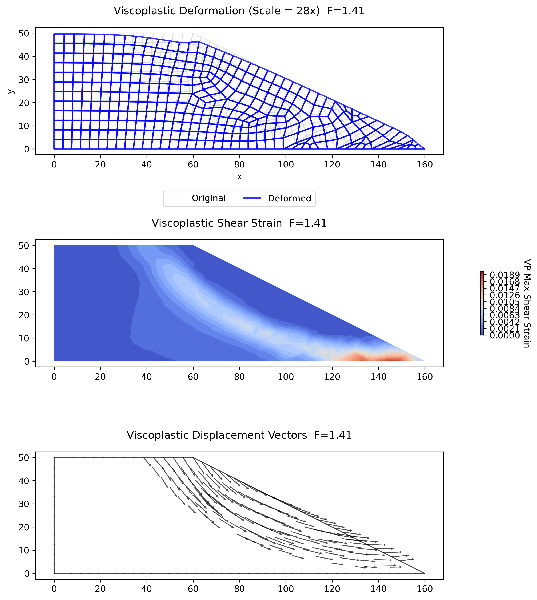
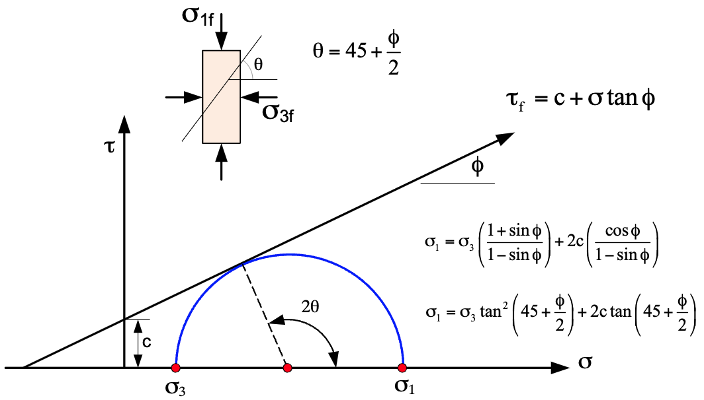
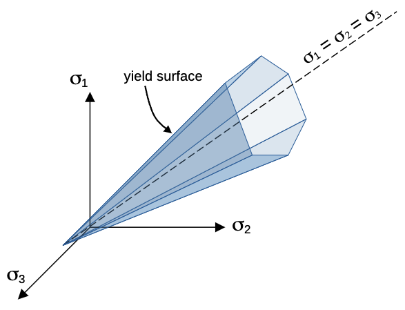
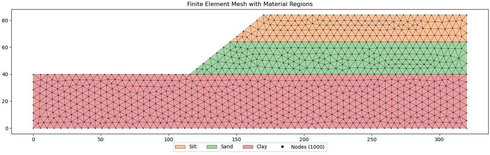
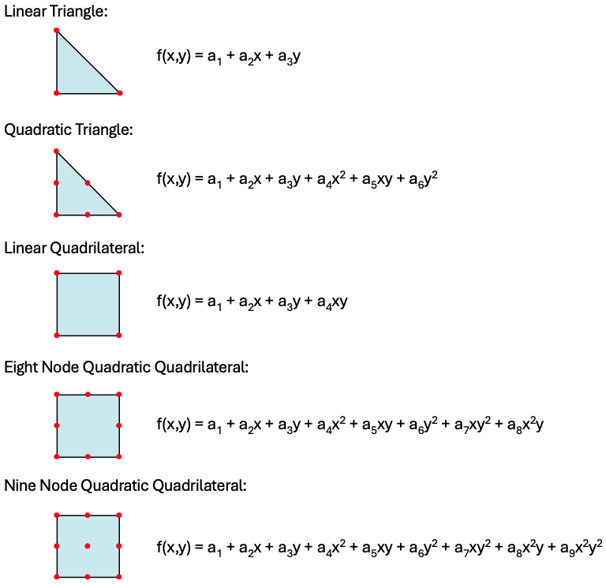
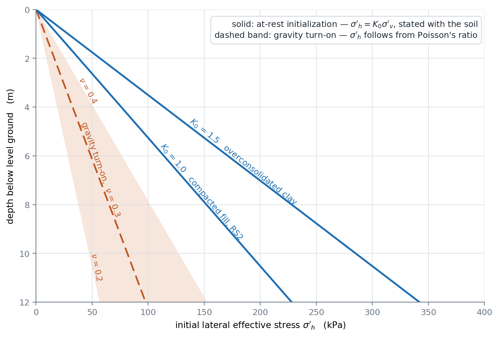
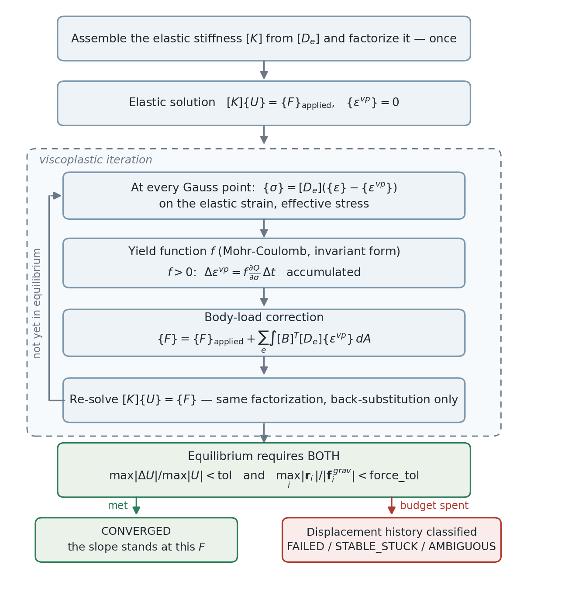
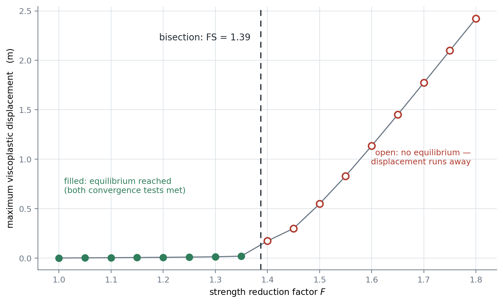
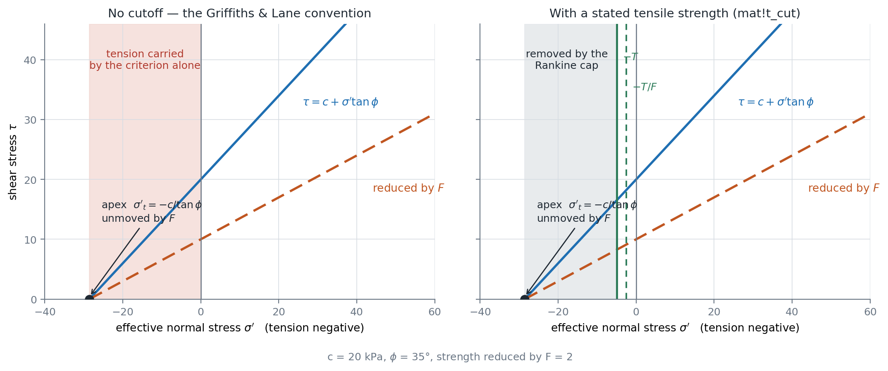

# Finite Element Method for Slope Stability Analysis

## Introduction

The finite element method (FEM) removes the central assumption of limit equilibrium analysis: that
the engineer already knows the shape and location of the failure surface. Instead of imposing a
surface and checking equilibrium on it, the FEM solves the stress-strain problem over the whole
slope domain and lets the failure mechanism emerge where the soil actually runs out of strength
(Griffiths & Lane, 1999; Duncan, 1996). Stress redistributes as elements yield, and the shear band
that develops is an output rather than an input.

XSLOPE's implementation is the viscoplastic elastic-perfectly-plastic algorithm of Griffiths &
Lane (1999) and Smith & Griffiths (2004), with the factor of safety obtained by the shear strength
reduction method (SSRM). Material properties, geometry, water and loads come from the same Excel
input file the limit-equilibrium solvers read, with Young's modulus $E$ and Poisson's ratio $\nu$
added on the **mat** sheet.

{width=800}

The same analysis runs point-and-click in [XSLOPE Studio](../studio/index.md): build a mesh, run a
single trial or an SSRM search (with cancel), and view deformation and shear-strain results. See
[Studio → Running Analyses](../studio/analysis.md#finite-element-fem).

## Governing equations

### Equilibrium

In two dimensions, static equilibrium of a continuum requires

>>$\dfrac{\partial \sigma_x}{\partial x} + \dfrac{\partial \tau_{xy}}{\partial y} + b_x = 0$

>>$\dfrac{\partial \tau_{xy}}{\partial x} + \dfrac{\partial \sigma_y}{\partial y} + b_y = 0$

where $\sigma_x$, $\sigma_y$ and $\tau_{xy}$ are the stress components and $b_x$, $b_y$ are body
forces — gravity, $b_x = 0$ and $b_y = -\gamma$, plus the pseudo-static
[seismic](#seismic-forces) term when one is applied.

### Elastic stress-strain

Below yield the material is linear elastic, $\{\sigma\} = [D_e]\{\varepsilon\}$, with the
plane-strain constitutive matrix

>>$[D_e] = \dfrac{E}{(1+\nu)(1-2\nu)} \begin{bmatrix}
1-\nu & \nu & 0 \\
\nu & 1-\nu & 0 \\
0 & 0 & \dfrac{1-2\nu}{2}
\end{bmatrix}$

$E$ and $\nu$ are required for every material; $E$ must be positive and $\nu$ in $[0, 0.5)$, and a
missing or out-of-range value stops the build rather than being defaulted.

#### Typical elastic parameters

Typical **drained** ranges, to be refined by site-specific testing where deformations matter:

| Soil Type | Young's Modulus $E$ [kPa] | Young's Modulus $E$ [psf] | Poisson's Ratio $\nu$ | Notes |
|-----------|:-------------------------:|:-------------------------:|:--------------------:|-----------------|
| **Soft Clay** | 2,000 - 15,000 | 41,800 - 313,000 | 0.40 - 0.50 | Use lower E values for very soft clays |
| **Medium Clay** | 15,000 - 50,000 | 313,000 - 1,044,000 | 0.35 - 0.45 | Plasticity index affects stiffness |
| **Stiff Clay** | 50,000 - 200,000 | 1,044,000 - 4,175,000 | 0.20 - 0.40 | Overconsolidated clays have higher E |
| **Loose Sand** | 10,000 - 25,000 | 209,000 - 522,000 | 0.25 - 0.35 | Depends on relative density |
| **Medium Sand** | 25,000 - 75,000 | 522,000 - 1,565,000 | 0.30 - 0.40 | Well-graded sands toward upper range |
| **Dense Sand** | 75,000 - 200,000 | 1,565,000 - 4,175,000 | 0.25 - 0.35 | Angular particles give higher stiffness |
| **Loose Silt** | 5,000 - 20,000 | 104,000 - 418,000 | 0.30 - 0.45 | Non-plastic silts toward lower ν |
| **Dense Silt** | 20,000 - 100,000 | 418,000 - 2,088,000 | 0.25 - 0.40 | Cementation increases stiffness |
| **Gravel** | 100,000 - 500,000 | 2,088,000 - 10,440,000 | 0.15 - 0.30 | Well-graded, dense materials |
| **Rock Fill** | 50,000 - 300,000 | 1,044,000 - 6,260,000 | 0.20 - 0.35 | Depends on gradation and compaction |
| **Soft Rock** | 1,000,000 - 10,000,000 | 20,880,000 - 208,800,000 | 0.15 - 0.30 | Weathered or fractured rock |

Enter $E$ in kPa with metric inputs and psf with English inputs, consistent with the unit weights
and cohesions. XSLOPE never converts units; when the model declares a unit system (the **Units**
selector on the main sheet) it labels the result colorbars and writes a `# units:` header into the
exported CSVs with that system's units, and leaves an undeclared model's output unchanged.

For undrained conditions, $E_u$ is measured directly by UU triaxial or unconfined compression tests,
or estimated from $E_u = (150-1500)\,S_u$ — the low end for soft clays, the high end for stiff ones.
Laboratory moduli generally exceed field values because of sample disturbance.

How precisely $E$ must be known depends on the question. Under the SSRM the factor of safety is
governed by $c$ and $\phi$; $E$ scales the computed displacements but has little effect on the
critical strength reduction factor. Approximate moduli are therefore adequate unless the deformation
prediction is itself a deliverable.

### Mohr-Coulomb failure criterion

Shear strength on any plane is

>>$\tau_f = c + \sigma' \tan \phi = c + (\sigma - u) \tan \phi$

{width=800px}

In principal effective stresses the criterion becomes the yield function

>>$f(\sigma_1', \sigma_3') = \dfrac{\sigma_1' - \sigma_3'}{2} - \left(\dfrac{\sigma_1' + \sigma_3'}{2} \sin \phi + c \cos \phi\right)$

with $f < 0$ elastic, $f = 0$ on the yield surface and $f > 0$ inadmissible — a state the
viscoplastic algorithm returns to the surface.



The solver evaluates $f$ at every Gauss point in the invariant form used by Smith & Griffiths
(mean stress $\sigma_m$, deviatoric stress $\bar{\sigma}$ and Lode angle $\theta$), which avoids
solving an eigenvalue problem per point:

>>$f = \sigma_m\sin\phi + \bar{\sigma}\left(\dfrac{\cos\theta}{\sqrt{3}} - \dfrac{\sin\theta\sin\phi}{3}\right) - c\cos\phi$

**Strength options.** The FEM reads five of the **mat** sheet's strength options: `mc`
(Mohr-Coulomb), `cp` (undrained strength at a reference elevation increasing at a rate `cp` with
depth, assigned per element from the element centroid, $\phi = 0$), `pow` and `hb` (the curved
envelopes below), and `elastic`. Any other option is refused rather than silently run as
zero-strength soil.

**Elastic-only materials.** A material whose **option** is `elastic` is never checked against the
yield criterion — $[D_e]$ is its complete stress-strain law at every strength reduction factor, and
only $\gamma$/$\gamma_{sat}$, $E$ and $\nu$ are meaningful for it. This mirrors RS2's "Plasticity
Specifications: None". `solve_fem()` and `solve_ssrm()` take the affected names through
`elastic_materials`, auto-wired from the **option** column when left unset; a
[polygon-addressed twin](#ssr-exclusion-zones) names the same treatment by outline. See
[Worksheet: mat](../usage/input_template.md#worksheet-mat).

### Curved failure envelopes

Two strength options are not straight lines in $\tau$–$\sigma'_n$ space: the power curve (`pow`) and
the generalized Hoek-Brown criterion (`hb`), both described in the
[LEM overview](../lem/overview.md#hoek-brown-strength). The FEM carries no separate yield function
for either. It keeps the Mohr-Coulomb machinery and **re-linearizes the curve into an instantaneous
tangent $(c_i, \phi_i)$ at every Gauss point on every viscoplastic iteration**, using that
iteration's own stress state. Because the algorithm is already iterating the stress field to
convergence, the tangent converges with it: at equilibrium every yielding Gauss point sits on the
true curved envelope at its own normal stress.

**Where the curve is linearized matters.** The power curve uses the in-plane Mohr-circle centre,
$s' = -(\sigma_x + \sigma_y)/2$ (compression-positive) — mild enough curvature that the centre is a
stable, fully vectorizable choice. Hoek-Brown is far more sharply curved and uses the normal stress
on the **failure plane**,

$$\sigma_n = s'\cos^2\phi - c\,\sin\phi\,\cos\phi$$

evaluated from the previous iteration's *reduced* tangent. That is exactly where a Mohr circle
touches its tangent line, so it closes as a fixed point inside the viscoplastic loop at no extra
cost, and it is the same abscissa the LEM uses (the slice-base normal stress).

Strength reduction divides the *instantaneous* cohesion and $\tan\phi_i$ by $F$, once per iteration,
after the tangent is computed. The curve's own constants are never reduced — $\sigma_{ci}/F$ is a
different envelope entirely because of the exponent $a$, and would give the wrong factor of safety.
For the same reason the minor principal stress $\sigma'_3$ is not used as the abscissa: Balmer's
$\sigma'_3 \rightarrow$ tangency mapping is derived for the **unreduced** envelope, so under
reduction it names a stale point, and because the Hoek-Brown envelope is concave a tangent taken
there lies above the true envelope and inflates the factor of safety.

!!! note "Verification"
    The Hoek-Brown implementation is verified end-to-end against Example 1 of Hammah, R.E., Yacoub, T.E.,
    Corkum, B., & Curran, J.H. (2005), *The shear strength reduction method for the generalized Hoek-Brown
    criterion*, Proc. 40th U.S. Symposium on Rock Mechanics (ARMA/USRMS), Paper 05-810 — a 10 m, 45° slope in
    a weak rock mass ($\sigma_{ci}$ = 30 MPa, GSI = 5, $m_i$ = 2, $D$ = 0). XSLOPE returns Spencer **1.152**
    and Bishop **1.150** against the paper's 1.152 and 1.153, and SSRM **1.159** against its published SSRM
    value of 1.15. The derived constants ($m_b$ = 0.0672, $s$ = 2.605e-5, $a$ = 0.6192) reproduce the paper's
    Table 1 exactly.

### Matric suction (apparent cohesion above the water table)

By default the solver clamps pore pressure to $u = \max(0, u)$ at every Gauss point before the yield
check, so the negative pore pressures above the water table add no strength. Where matric suction is
a first-order effect — an unsaturated cut slope, for instance — a per-material unsaturated friction
angle $\phi^b$ turns that credit on, using the same Fredlund extended Mohr-Coulomb criterion the
[limit-equilibrium solver uses](../lem/overview.md#matric-suction-apparent-cohesion-above-the-water-table):

>>$\tau_f = c' + (\sigma_n - u_a)\tan\phi' + (u_a - u_w)\tan\phi^b$

With pore-air pressure $u_a = 0$ the last term becomes an **apparent cohesion**

>>$c_{suction} = \min(s,\; s_{cap})\,\tan\phi^b, \qquad s = \max(0,\; -u_w)$

added to $c'$ in the yield function, where $s$ is the suction at the Gauss point and $s_{cap}$ an
optional ceiling. The effective-normal-stress term keeps the ordinary clamped $u \ge 0$, so only the
cohesive intercept picks up the extra strength; below the water table $s = 0$ and the term vanishes.

The suction is drawn from the material's own pore-pressure source and is credited only for the
effective-stress strength options (`mc`, `pow`, `hb`) with a signed source — `u = piezo` or
`u = seep`, the only ones carrying negative pressure above the water table. It is inert for `cp` and
`elastic` materials and for the `none` and `ru` sources, exactly as in the limit-equilibrium solver.

In an SSRM solve the apparent cohesion is reduced by the trial factor alongside $c'$ and
$\tan\phi'$, $c_{suction,\,r} = \min(s, s_{cap})\tan\phi^b / F$, so the credit scales as $1/F$ and
enters the reduced envelope on the same footing as the effective cohesion. That distinguishes it
from the [tension cutoff](#tensile-strength-in-ssrm), which caps a stress.

$\phi^b$ is blank for every material unless set, so the credit is **off by default**. It is
controlled by the `phi_b` and `s_cap` columns on the
[mat worksheet](../usage/input_template.md#worksheet-mat) and auto-wired into `solve_fem()` and
`solve_ssrm()`; their `suction_phi_b` / `suction_cap` arguments override the file.

!!! warning "Cap the suction on a piezometric source"
    A piezometric line's hydrostatic head grows negative without bound above the line, so the higher a Gauss point
    sits above it the larger the (unphysical) suction and the larger the credited apparent cohesion. **Always set
    `s_cap`** when using `phi_b` with `u = piezo`. With `u = seep` the finite-element seepage field is self-bounded
    by the unsaturated-flow physics, so a cap there is a useful backstop rather than a hard requirement.

## Finite element formulation

### Discretization

The domain is divided into triangular or quadrilateral elements, each carrying shape functions that
interpolate displacement from its nodal values, $u = [N]\{u_e\}$.



XSLOPE supports linear and quadratic triangles and quadrilaterals:

{width=600px}

Quadratic elements are required for reliable factors of safety — linear triangles and bilinear
quads lock volumetrically and read high (see
[Element type and volumetric locking](#element-type-selection-and-volumetric-locking)). Mesh
construction is covered in [Mesh Generation](mesh.md).

### Stiffness and assembly

Each element's stiffness follows from virtual work,

>>$[K_e] = \int_{A_e} [B]^T [D_e] [B] \, dA$

where the strain-displacement matrix $[B]$ maps nodal displacements to strains. For a linear
triangle it is constant over the element,

>>$[B] = \dfrac{1}{2A} \begin{bmatrix}
b_1 & 0 & b_2 & 0 & b_3 & 0 \\
0 & c_1 & 0 & c_2 & 0 & c_3 \\
c_1 & b_1 & c_2 & b_2 & c_3 & b_3
\end{bmatrix}$

with $b_i$, $c_i$ geometric constants and $A$ the triangle area; higher-order elements integrate
$[B]$ at Gauss points. Element contributions are assembled by node connectivity into the sparse
global system

>>$[K] \{U\} = \{F\}$

whose solution gives the nodal displacements, and from them the strains and stresses used in the
yield check.

## Boundary conditions

### Displacement boundary conditions

**Fixed supports** ($u = v = 0$) represent rigid bedrock or a boundary deep enough that its movement
does not matter. The model should extend at least one slope height below the toe, and preferably to
a stiff layer.

**Roller supports** prevent movement in one direction only. On vertical side boundaries $u = 0$ with
$v$ free represents ground continuing beyond the model with the same geometry and loading.

**Free boundaries** — the ground surface and slope face — carry zero traction except where a load is
applied.

### Distributed loads

Force boundary conditions in XSLOPE come from the **dloads** sheets: line loads given as a sequence
of coordinates with load intensities (force per unit length), shared with the limit-equilibrium
solvers, which convert them to a resultant on each slice.

Hydrostatic pressure on a submerged face need not be entered at all. With the main sheet's **Water
loads** selector on `auto`, the ponded-water load is derived from the model's own water definition
and applied here as tractions — from the *same* derivation the limit-equilibrium slice forces use,
so the two engines cannot end up carrying different water. It is a load, not a strength, so a
strength reduction leaves it alone: the derived reservoir is constant across an SSRM bracket. See
[Automatic water loads](../usage/preflight.md#automatic-water-loads).

For the FEM the loads are converted to nodal forces by **consistent** edge integration of the shape
functions, $f_i = \int N_i\, p\, d\Gamma$. For a linear intensity variation from $q_1$ to $q_2$ over
a length $L$ this gives

>>$F_1 = \frac{L}{6}(2q_1 + q_2) \qquad F_2 = \frac{L}{6}(q_1 + 2q_2)$

and on a quadratic edge under uniform pressure the 1/6–2/3–1/6 corner–midside–corner split. Simple
tributary-length lumping is *not* used: on quadratic edges it misallocates corner and midside
forces, leaving a chain of self-equilibrated nodal couples of order $pL/6$ that appears as spurious
near-surface stress oscillation — strong enough to falsely yield the skin elements under a large
applied pressure such as reservoir loading.

**Direction.** A load block's **Direction** column chooses how the traction is oriented: `normal`
(the default, and what every file written before template version 21 means) applies it perpendicular
to the surface, resolved into components from the local surface angle $\beta$; `vertical` applies
the same magnitude straight down, which is what a gravity surcharge on an inclined crest is — the
normal form would give it a horizontal thrust of $\tan\beta$ times the surcharge that the load does
not have. A model may mix the two. Derived water loads always act normal to the surface.

**Which way "into the slope" is** is decided by the mesh, not by the order the load line's points
were entered. For each loaded edge the material lies on one side — the centroid of the element that
owns the edge — and the pressure is directed at it; where an edge is shared by elements on both
sides the contributions cancel and the load acts along the tangent-normal as usual. The same rule
applies node-by-node on the tributary-lumping fallback used when a load line does not follow
complete element edges. A load line authored right-to-left therefore assembles the same nodal forces
as the same line authored left-to-right, and a pool against a downstream face is not pushed the
wrong way.

**Body forces.** Self weight enters as $b_y = -\gamma$, integrated to nodal forces element by
element,

>>$\{F\}_b = \sum_{e} \int_{A_e} [N]^T \{b\} \, dA$

Prescribed displacements are imposed on the assembled system by direct modification of the
constrained rows; applied forces enter $\{F\}$ directly and leave $[K]$ unchanged.

### What XSLOPE assigns automatically

`build_fem_data()` derives every displacement boundary condition from the mesh geometry — nothing is
specified by hand:

1. **All nodes start free**, the natural zero-traction condition.

2. **Fixed supports at the base.** The base is the part of the domain boundary that is neither
   ground surface nor a side edge, so an undulating or stepped bedrock base is fixed along its whole
   length; on a flat-bottomed domain this is exactly the set of nodes at the minimum $y$.

3. **Side restraint on the left and right.** A side is the boundary edge that reaches the extreme
   $x$-coordinate, not only the nodes standing exactly at it, so a far-field truncation digitized
   slightly off plumb is still a side and the whole face is restrained. The main sheet's **Side BC**
   cell chooses what the restraint is: `rollers` (the default, and every file that does not declare
   it) gives $u = 0$ with $v$ free, so truncated ground can still settle under its own weight;
   `fixed` clamps both components, which is what RS2 does on its side boundaries. Fixing the sides
   is a vendor-parity option rather than a better model — it adds shear restraint the real ground
   does not have and stiffens a domain truncated close to the slope. Corner nodes where a side meets
   the base keep the fixed condition either way.

4. **Force boundary conditions** from the distributed loads, integrated edge by edge as above. Where
   a loaded node also carries a displacement constraint, both are kept.

The figure below shows the result for the reinforced slope of [FEM Samples](samples.md) Problem 1:
fixed supports (triangles) along the base, x-rollers (circles) on the sides, a free ground surface,
arrows for the 240 psf surcharge on the crest, and reinforcement elements in red.

{width=1000}

## Pore pressures {#pore-pressure-options}

Pore pressures reduce effective stress and therefore available strength. Each material names its
source in the **u** column of the **mat** sheet, and one model may use only one source — mixing
`piezo` and `seep` across materials is refused.

| `u` | Source | Pore pressure at a Gauss point |
|:----|:-------|:-------------------------------|
| `none` | none | $u = 0$; the yield check is a total-stress check |
| `piezo` | piezometric line | $u = \gamma_w (z_{piezo} - y_{gp})$ from the line elevation above the point |
| `ru` | pore-pressure ratio | $u = r_u\,\sigma_v$, with $\sigma_v$ the weight of the soil column above the point |
| `seep` | seepage solution | $u = \sum N_i u_i$ interpolated from the seepage analysis' nodal values |

All four are evaluated **once**, at `build_fem_data()` time, at every Gauss point — the physical
coordinates come from the shape functions, $x_{gp} = \sum N_i x_i$ — so the viscoplastic loop does
no interpolation. Negative values are clamped to zero for the yield check; the raw signed field is
retained so the optional [matric-suction](#matric-suction-apparent-cohesion-above-the-water-table)
credit can use it.

The `ru` overburden is the soil column only, integrated by intersecting a vertical ray with the
material zones, which is the definition the LEM slicer uses (Bishop & Morgenstern): distributed
loads and crack water are excluded, and moist unit weights are used throughout.

A piezometric line assigns pore pressure only over its own horizontal extent, exactly as in the
[LEM](../lem/overview.md#pore-pressures); nothing is extrapolated past either end. Because the FEM
samples the line at every node and Gauss point, the whole mesh must lie within that extent — a point
outside stops the build with an error naming the point, its x-coordinate and the line's extent. A
line that deliberately stops short (a reservoir on one side of a dam only) is modelled by carrying
it on at an elevation below the mesh, which states that the ground beyond is dry. Selecting
`u = piezo` when the file defines no piezometric line is refused on the same grounds: a model with
no water is `u = none`.

**How pore pressure enters the equilibrium.** With `pp_formulation="effective"` (the default) the
total-stress statement $\int B^T (\sigma' - u\,m)\,dV = F_{ext}$, $m = [1, 1, 0, 1]^T$, is
rearranged so the pore-pressure term joins the load vector,

>>$\int B^T \sigma'\, dV = F_{ext} + \int B^T m\, u\, dV$

and the stresses computed from the displacement solution are **effective stresses directly**.
Physically the added load term converts the body force in submerged soil to its buoyant weight (plus
seepage forces wherever $u$ is not hydrostatic), so all three effective stress components below a
flooded boundary come out compressive and level flooded ground sits elastically at rest. The legacy
alternative, `pp_formulation="total"` — solve the total-stress problem and subtract $u$ at each
Gauss point before the yield check — leaves a spurious effective-tension zone of magnitude
$\frac{1-2\nu}{1-\nu}u$ at submerged boundaries, which yields and creeps at any strength reduction
factor.

## K0 initial stress

A finite element analysis computes deformation from a **change** in stress, so before it can run it
has to be told what stress the ground was already in. That in-situ state is not implied by the mesh:
the same geometry, strengths and loads are consistent with many lateral stress states, and the one
chosen fixes the confinement every element starts with — which, in a frictional material, is very
nearly the same thing as fixing its strength. XSLOPE offers both conventions in general use.

**Gravity turn-on** is the default and the Griffiths & Lane convention: the model starts from **zero
stress** and self weight is switched on in a single step. The lateral stress that results is not a
soil property at all — solving the elastic problem under a body force with zero lateral strain gives

>>$\sigma'_h = \dfrac{\nu}{1-\nu}\,\sigma'_v$

so the model's at-rest coefficient is fixed by **Poisson's ratio**. Normally consolidated sand does
sit near Jaky's $K_0 = 1 - \sin\phi' \approx 0.43$, so at $\nu = 0.3$ the accident is often a happy
one. Compacted fill and overconsolidated clay do not: they carry locked-in lateral stress at
$K_0 = 1$ and beyond.

**At-rest initialization** states the in-situ stress directly instead of inferring it from the
stiffness: the vertical stress is the weight of the soil column above the point, the lateral stress
is $K_0$ times it, and $K_0$ is a modelling input carrying the soil's stress history.

{width=700}

Where the choice matters most is a **part of the model whose strength depends on confinement** — the
reinforced-soil block of a geosynthetic wall being the clearest case, and any near-cohesionless
material a close second, since with $c'$ near zero the confinement is essentially the whole of the
strength. Where it matters least is a homogeneous cohesive embankment.
[What to expect](#what-to-expect) quantifies both ends.

### Formulation

Leave the **K0 initial stress** cell on the main sheet blank — the default — and the run is the
gravity turn-on. Enter a value (or pass `k0=` to `solve_fem()` / `solve_ssrm()`, or tick **K0
initial stress** in Studio's Run FEM dialog) and the initial stress at every Gauss point is built
from the overburden instead:

>>$\sigma'_v = -\!\!\int \gamma\,dz \;+\; u \qquad
  \sigma'_h = \sigma'_z = K_0\,\sigma'_v \qquad \tau_{xy} = 0$

(tension-positive, effective; the vertical integral is the weight of the soil column directly above
the point, obtained by intersecting a vertical ray with the material zones — the same definition the
`ru` pore-pressure option uses). $\sigma_h$ is set both **in-plane and out-of-plane**: the
out-of-plane stress is no longer $\nu(\sigma_x+\sigma_y)$ but the same $K_0\sigma'_v$, which is what
makes the state genuinely at-rest rather than plane-strain elastic.

The state is carried by the classical **initial-stress method**. Writing

>>$\{\sigma\} = \{\sigma_0\} + [D]\big([B]\{u\} - \{\varepsilon^{vp}\}\big)$

and substituting into $\int [B]^T\{\sigma\}\,dV = \{F_{ext}\}$ gives

>>$[K]\{u\} = \{F_{ext}\} - \int [B]^T\{\sigma_0\}\,dV + \int [B]^T[D]\{\varepsilon^{vp}\}\,dV$

so the only changes are one extra load term and one extra addend at the yield check. The solver
still **iterates to equilibrium under the body forces**; it simply starts from the $K_0$ state
rather than from nothing.

Three details follow from the definition:

- The overburden is **soil only**. Surface tractions — a reservoir load, a distributed load, a
  footing — are not in-situ stress and are applied as boundary forces during the equilibrium
  iteration, where a load applied after the in-situ state belongs.
- In a **staged** run the state is rebuilt per stage from that stage's pore pressure, so stage 1
  gets the dry $K_0$ state and stage 2 the submerged one.
- The compiled [fast kernel](#fast-kernel) has no slot for an initial stress, so a $K_0$ run always
  takes the NumPy reference path — the oracle, but slower.

On **level ground** the $K_0$ field is an exact equilibrium for any $K_0$ whatsoever: vertical
equilibrium contains only $\sigma_v(z)$, which the overburden integral satisfies by construction,
and horizontal equilibrium contains only the lateral variation of $\sigma_h$, which vanishes when
nothing varies horizontally. A correct implementation therefore has nothing to redistribute under
flat ground — it converges on the first iteration, leaves the mesh undisplaced to machine precision
and yields nowhere. That is the one configuration where the answer is known in closed form, and the
verification suite runs it on every pass as the standing check on the whole path.

### In-situ equilibration

Under a **slope** the same field is not an equilibrium. There is no soil column beside the face to
balance the lateral stress there, so a substantial share of the weight is left out of balance and
has to redistribute — about a quarter of it on Griffiths & Lane Example 1.

That redistribution belongs to **establishing the in-situ state**, not to strength reduction, and
the SSRM runs them as the two separate steps they are. A $K_0$ analysis begins with one
**full-strength equilibration solve**: the $K_0$ field settles against the real geometry at
unreduced strength, and every bisection trial then starts from the resulting stress state, with a
zero displacement datum, and reduces strength from there. The equilibration is solved once and
shared by all trials, and its outcome is returned in `result['k0_equilibration']`.

Run the two steps together instead and every trial repeats the in-situ redistribution against soil
already weakened by $F$, then charges the displacement and plastic strain it produces to the trial.
On Example 1 at $K_0 = 1$, $F = 1.2$, that reports about three times the displacement the strength
reduction actually causes.

Displacements are reported relative to the equilibrated state, because the in-situ travel is an
artifact of imposing a stress field the geometry does not hold in equilibrium, not motion of the
slope. Stresses and structural forces — bar tensions, pile end forces — are functions of the
absolute displacement and are unaffected by where its zero is put.

A single `solve_fem()` call at full strength *is* an equilibration solve. At a reduced $F$ a single
call does both at once, which is the sequencing the SSRM avoids; use `solve_ssrm()` when the two
must be kept apart. If the equilibration does not come back stable, the slope does not stand at full
strength with that initial stress ($FS < 1$): XSLOPE warns, and the bisection proceeds without a
carried in-situ state and finds the sub-unity factor of safety.

### Choosing a value

$K_0$ is a property of the soil's **stress history**, and the usual estimates are the ones already
used for a retaining-wall or settlement calculation:

>- **Normally consolidated** soil sits at Jaky's $K_0 = 1 - \sin\phi'$ — roughly 0.4 to
>  0.5 for sands and 0.5 to 0.7 for soft clays, falling as the friction angle rises.<br>
>- **Overconsolidated** soil carries more, commonly estimated as
>  $K_0 \approx (1 - \sin\phi')\,\mathrm{OCR}^{\sin\phi'}$. A lightly overconsolidated deposit
>  reaches 0.7 to 1.0; a heavily overconsolidated clay passes 1.0 and can approach the passive limit.<br>
>- **Compacted fill** is overconsolidated by the compaction plant itself — $K_0 = 1$ or above is
>  normal, and this is exactly the case of a reinforced-soil block, where the confinement decides the
>  frictional strength of a thin, tall zone.<br>
>- If the stress history is genuinely unknown, run it **both ways** and report the range. The
>  gravity turn-on is the lower-confinement, lower-factor-of-safety end.

**Vendor conventions.** RS2 writes an explicit initial field stress into the model file with
$\sigma_x = \sigma_y = \sigma_z$ and $K_x = K_z = 1$ — an isotropic at-rest state — and does so
uniformly across the verification corpus. **Set $K_0 = 1$ whenever the target is an RS2 SSR
number.** Plaxis takes the other convention: its $K_0$ procedure defaults to Jaky's
$1 - \sin\phi'$ per material. XSLOPE's own default — gravity turn-on — matches Griffiths & Lane and
the academic literature built on it, which is why it stays the default.

**How it is set.** The **K0 initial stress (FEM)** cell on the main sheet carries it with the model;
`k0=` on `solve_fem()` / `solve_ssrm()` sets it from a script; Studio's Run FEM dialog exposes it as
a checkbox and a value. Blank everywhere means the gravity turn-on.

### What to expect

$K_0$ initialization is **off by default**, and all but two locked factors of safety in the
verification suite are computed without it. The exceptions are both vendor reproductions: the
[RS2-48](../verification/rs2.md#rs2-48) geotextile wall, authored at $K_x = 1$, and the second
[RS2-4](../verification/rs2.md#rs2-4) row, which reproduces RS2's own settings on the Talbingo dam.
It is a modelling choice, not a correction.

How much it changes is a property of the model, and the pattern is **cohesion**. Raising the
confinement raises the initial deviatoric demand as well as the frictional capacity, so a slope
whose strength is mostly cohesive barely notices; a slope whose envelope passes near the origin has
almost nothing *but* confinement to draw on:

| Model | Gravity turn-on | $K_0 = 1$ | Change |
|---|---|---|---|
| [Griffiths & Lane Example 1](../verification/ssrm.md#verification-griffiths1) — homogeneous embankment | 1.366 | 1.378 | +0.9% |
| [RS2-31](../verification/rs2.md#rs2-31) Mohr-Coulomb member, $c' = 11.6$ kPa | 1.529 | 1.529 | 0.0% |
| [RS2-31](../verification/rs2.md#rs2-31) Mohr-Coulomb member, $c' = 0.39$ kPa | 0.931 | 0.969 | +4.0% |
| [RS2-31](../verification/rs2.md#rs2-31) power-curve member, $\tau(0) = 0$ | 0.921 | 0.973 | +5.6% |
| [RS2-48](../verification/rs2.md#rs2-48) multi-tier geosynthetic wall | 0.956 | 0.994 | +3.9% |
| [RS2-4](../verification/rs2.md#rs2-4) Talbingo dam, under RS2's own exclusion area | 1.831 | 1.881 | +2.7% |

The three members of RS2-31 are the cleanest statement of the pattern, being the same slope under
three strength models: the one with real cohesion does not move at all, and the one whose envelope
passes through the origin moves the most. In every model measured the at-rest state gives the
*higher* factor of safety, so the default gravity turn-on is the conservative side of the choice.

One consequence to keep in mind when reading a non-converged trial: the displacement scale the
[hybrid criterion](#ssrm-failure-criteria) measures against is the elastic response to the
**applied** load, which is the same quantity with or without $K_0$. What $K_0$ changes is the zero —
a trial's displacement is counted from the equilibrated in-situ state, so it carries only the
movement the strength reduction causes.

## Elastic-plastic behavior: the viscoplastic algorithm {#elastic-plastic-behavior-viscoplastic-algorithm}

When a Gauss point reaches the failure envelope, the stress it cannot carry has to go somewhere.
XSLOPE handles that with the **viscoplastic algorithm** of
[Griffiths & Lane (1999)](https://doi.org/10.1680/geot.1999.49.3.387) and Smith & Griffiths (2004):
the elastic stiffness matrix never changes, and plasticity enters as a body load built from
accumulated viscoplastic strains. The matrix is therefore assembled and factorized **once** and
reused by back-substitution for every iteration of every strength reduction trial.

{width=700}

### The iteration {#viscoplastic-iteration-process}

Stress is carried in the 4-component plane-strain form of Smith & Griffiths (their nst = 4), with
$\sigma_z$ explicit so the algorithm can relax it through plastic $\varepsilon_z$. At each Gauss
point on each iteration:

>- Total in-plane strains come from the current displacements, $\{\varepsilon\} = [B]\{u_e\}$, and
>  the **elastic** strains are $\{\varepsilon\} - \{\varepsilon^{vp}\}$, with
>  $\varepsilon_z^{el} = -\varepsilon_z^{vp}$ (total $\varepsilon_z = 0$). Using the elastic strain
>  rather than the total strain is what accounts for the stress relief already taken by plastic flow.<br>
>- The stress $\{\sigma\} = [D_e^{4}]\{\varepsilon^{el}\}$ is reduced to the invariants
>  $\sigma_m$, $\bar{\sigma} = \sqrt{3J_2}$ and $\theta$, and the yield function is evaluated in
>  invariant form.<br>
>- Where $f > 0$, a viscoplastic strain increment
>  $\Delta\varepsilon^{vp} = f \cdot \partial Q/\partial\sigma \cdot \Delta t$ is accumulated, using
>  the non-associated plastic potential with dilation angle $\psi = 0$ (no plastic volume change).
>  Within about 0.7° of the Lode-angle corners ($|\sin\theta| > 0.49$) the $\theta$-dependence is
>  frozen at the corner value, keeping the flow direction finite where $\tan 3\theta$ blows up.<br>
>- The accumulated strains form the body-load correction
>  $\{F\} \mathrel{+}= \sum_{e} \int [B]^T [D_e] \{\varepsilon^{vp}\} \, dA$, and the system is
>  re-solved with the existing factorization.

The **pseudo-time step** $\Delta t$ is a numerical parameter, not physical time, taken from Smith &
Griffiths' Program 6.1 as $\Delta t = 4(1+\nu)/(3E)$. The alternative Mohr-Coulomb stability bound
$4(1+\nu)(1-2\nu)/[E(1-2\nu+\sin^2\phi)]$ was found to drive a sustained limit cycle at Gauss points
in mild effective tension beneath reservoir loading; the smaller value is in the stable regime. The
per-iteration displacement increment scales with $\Delta t$, so the convergence tolerance and the
failure criterion are calibrated jointly with it — see the warning on `dt_scale` below.

A **tension cutoff** is available as a second viscoplastic yield surface acting through the same
mechanism; because it decides SSRM answers rather than ordinary stress analyses, it is described
under [Tensile strength in the SSRM](#tensile-strength-in-ssrm).

**Staged loading.** With `staged=True`, a model carrying water solves in two stages: gravity only
(dry) first, then the water loads and pore pressures added on top of the converged stage-1 state
with its accumulated viscoplastic strains — the construction history of a fill that was built and
then filled.

### Convergence criterion

A displacement-change test alone is not sufficient: a slope past its critical strength reduction
factor can creep slowly enough that the per-iteration change drops below any tolerance while the
slope is in fact failing. XSLOPE therefore requires **two conditions simultaneously**:

1. **Displacement settled** — Smith & Griffiths' CHECON test, the maximum-norm relative change
   between iterations:

>>$\dfrac{\max_i |U_i^{(k+1)} - U_i^{(k)}|}{\max_i |U_i^{(k+1)}|} < \text{tol}$

2. **Force equilibrium** — the criterion of
   [Dawson, Roth & Drescher (1999)](https://doi.org/10.1680/geot.1999.49.6.835): every node's
   out-of-balance force, normalized by the gravitational body force acting on *that* node, below a
   tolerance:

>>$\displaystyle\max_i \dfrac{|\,\mathbf{r}_i\,|}{|\,\mathbf{f}^{\,grav}_i\,|} < \text{force\_tol}$

Because this is an initial-stress scheme, each solve satisfies
$\int B^T D(Bu - \varepsilon^{vp})\,dV = F_{ext}$ *exactly* using the previous iteration's plastic
strains. What is still out of balance is therefore the amount by which the viscoplastic body load is
**still changing**. When plastic flow ceases that increment decays to zero; when the slope is
failing, flow never ceases and the increment plateaus at a non-zero value that feeds displacement
indefinitely.

The **locality** of the test is what makes it trustworthy. The increment is non-zero only at nodes
adjacent to Gauss points that are still flowing, so material that merely sits in equilibrium — a
deeper foundation, a longer runout — contributes exactly zero and cannot shift the maximum. A global
norm ratio measures the mechanism against the weight of the entire mesh and offers no such
protection: padding the domain changes the yardstick without changing the slope. The denominator is
a **lumped** tributary weight, $\sum_e \gamma_e A_e / n_e$ over the elements touching the node, not
the consistent nodal gravity load — the consistent load is exactly zero at a tri6 corner node and
slightly negative at a quad8 corner, which would make the ratio there meaningless.

The converse does **not** hold: a plateau above the tolerance is not by itself evidence of failure.
A slope can stand perfectly still while the residual stalls above an absolute threshold it never
reaches. The size of the gap between the two regimes is problem-dependent — several orders of
magnitude on a Hoek-Brown slope, about two on the Griffiths & Lane benchmark, and on a Mohr-Coulomb
slope with a non-associated flow rule it can close entirely. The
[hybrid criterion](#2-hybrid-hybrid-default), the default, is what asks the displacement field
directly in that case.

Four dependencies are worth knowing, because the tolerance is absolute:

>- **The yield-surface limit cycle (why `oob_window` exists).** A *one-iteration* increment does not
>  decay on a settled slope: Gauss points resting exactly on the yield surface flip their flow
>  direction on alternate iterations, producing a clean **period-2** oscillation in the viscoplastic
>  body load whose amplitude is proportional to $\Delta t$. Damping the timestep shrinks it but never
>  removes it, so with a one-iteration window a stable slope is reported as failing forever.
>  Averaging the increment over `oob_window` iterations (default 10) cancels the mode exactly while
>  leaving genuine plastic drift untouched. The verdict is insensitive to the width — 10, 50 and 200
>  agree on the same $F$ at the same iteration — so this rejects a specific numerical mode rather
>  than tuning a threshold.<br>
>- **Iteration count.** The test demands *actual* force equilibrium rather than a decayed rate, and
>  displacements settle long before the per-node maximum does. Budget roughly **3× the iterations** a
>  rate-based criterion needs; a ceiling set too low silently truncates a converging solve and reports
>  it as failure, biasing FS **low**.<br>
>- **Element size.** The ratio scales roughly as $1/h$ — the numerator is an internal-force residual
>  ($\sim\sigma h$), the denominator a body force ($\sim\gamma h^2$). A coarser mesh narrows the margin.<br>
>- **Timestep scale.** The residual is the *increment* of the viscoplastic body load and is
>  proportional to $\Delta t$. Shrinking `dt_scale` shrinks the residual without making the slope any
>  more stable, so a failing state can be driven under an absolute `force_tol` and reported as
>  converged. Leave `dt_scale` at 1.0, and never lower it to force a reluctant model to "converge".

**Defaults and budgets.** $\text{tol} = 10^{-3}$ (displacement) and
$\texttt{force\_tol} = 10^{-3}$ (force equilibrium, Dawson's published value), with a ceiling of
3000 iterations — 1500–4000 iterations is normal just below failure, consistent with Griffiths &
Lane's reported 792 iterations just below their Example 1 failure point. A genuinely stable trial
that exhausts the ceiling is called failed, which biases the factor of safety **low**, the
conservative direction; under the default hybrid criterion such a trial is checked against its
displacement field before the verdict is taken.

A **no-progress early exit** stops a solve that goes 1500 iterations without improving on the lowest
out-of-balance value it has seen by more than 1%, and reports it as failed exactly as an exhausted
ceiling would. This is a **budget** decision, not an independent test of the slope: because the
residual can stall long before the outcome is decided, the exit can truncate a solve that would
still have converged, biasing the factor of safety low. That is the trade for the iterations it
saves. Turn it off with `early_exit=False` on `solve_fem()` when a marginal trial matters more than
runtime; inside the bisection the hybrid criterion handles the same problem by suppressing the exit
where it would fire on a stable-looking state.

The **displacement limit** (`max_disp_factor`) is disabled on the default criterion, and
deliberately so: its yardstick is the height of the *mesh*, not of the *slope*, so it loosens as a
model is given a deeper foundation. The force-equilibrium test has no such dependence.

**Submerged boundaries** converge like any other problem under the effective-stress formulation
combined with consistent boundary-load integration: the submerged soil carries its buoyant weight,
the flooded surface skin is in compression, and sub-critical trials reach true equilibrium (the G&L
Example 6 dam at $F = 1$ settles in a handful of iterations). A useful check on any submerged model
is a single solve at $F = 1$: flooded ground at working strength must settle quickly with an
essentially elastic strain field, and if it does not, suspect the inputs — loads inconsistent with
boundary pore pressures — rather than the solver knobs. Quadratic **triangles** (tri6) are preferred
over quad8 for this problem class, because the 2×2 reduced-integration quad has a zero-energy
hourglass mode that persistent near-surface forcing can excite.

### Surficial (skin) failures and the minimum-slip-depth filter

On a purely frictional face ($c = 0$) the critical mechanism is a shallow slide running parallel to
the slope, with $FS = \tan\phi / \tan\beta$ — a result *independent of depth*, so the shallowest
surface governs. The per-node force-equilibrium criterion detects this "skin" faithfully, and
because it is the true global minimum the reported factor of safety can sit well below a deeper,
more conventional mechanism, and below published values that report the deeper one. This is
physically correct but often not the engineering question, and the steep frictional faces of
embankment dams are where it shows up.

The optional **`min_slip_depth`** parameter — on `solve_fem()`/`solve_ssrm()` and on the LEM
searches, **off by default** — excludes any failure shallower than the given depth below the ground
surface. In the FEM it acts on the **failure verdict**, not on the strength: nodes shallower than
the cutoff are left out of the per-node out-of-balance maximum, so a shallow skin can no longer
declare the slope failing on its own, while a deep-seated mechanism still trips the criterion
through its deep nodes. Nothing is held at full strength and no element is masked — the skin still
yields, it simply stops casting the deciding vote. It is a **run option rather than a file setting**:
pass `min_slip_depth=` to a solve or to a `circular_search()` / `noncircular_search()` call, or set
**Min slip depth** in Studio's Run FEM dialog. A depth deeper than the mesh is refused rather than
answered.

Steering the mechanism by **depth** is one of two ways to keep a competing failure out of the
answer; the other is to steer it by **region**, which is what
[SSR search areas and exclusion zones](#ssr-exclusion-zones) do. Use the depth filter when the
mechanism to exclude is defined by how shallow it is (a face-parallel skin, which no zone boundary
separates from the deep surface because both run through the same material); use a zone when it
belongs to an identifiable part of the model (a stiff foundation, a shell, a bench).

**Choosing a value — sweep it and find the plateau.** As the depth increases, the factor of safety
holds at the surficial-skin value while the cutoff is still inside the failing band, rises as the
cutoff clears the band, then **flattens onto a plateau**: the deep-seated factor of safety. Any
depth on the flat part returns the same FS, so the choice is robust. Run a handful of depths (say
5, 10, 15, 20, 25% of the slope height) and read the trend:

>- Still rising → the cutoff is inside the surficial band; go deeper.<br>
>- Flat → that value is the deep-seated FS. Report it.<br>
>- Still climbing at a large fraction of the slope height → you are past the real mechanism and are
>  excluding genuine failure; back off to where it plateaued.

A large gap between the filter-off value and the plateau means a surficial skin was governing the
unfiltered result; a small gap means the deep mechanism already governs and the filter can stay off.
On a low fill over soft ground the plateau can sit deep as a fraction of height — the embankment on
soft ground of [RS2-66](../verification/rs2.md#rs2-66) plateaus at a 4 m cutoff on a 10 m fill,
while the 162 m Talbingo dam of [RS2-4](../verification/rs2.md#rs2-4) is already on its plateau by
10 m (its 1.67 downstream-bench skin against a 1.82–1.83 plateau held flat from 10 m out to 30 m).
Set the same `min_slip_depth` in the LEM search and the SSRM run so both report the same mechanism.

### The `solve_fem()` function

`solve_fem()` takes a FEM data dictionary from `build_fem_data()` and an optional strength reduction
factor, assembles and factors the stiffness once, and runs the viscoplastic loop to convergence or
to its iteration budget:

```python
from xslope.fileio import load_slope_data
from xslope.mesh import build_mesh_from_polygons, get_material_polygons
from xslope.fem import build_fem_data, solve_fem

slope_data = load_slope_data("docs/fem/files/xslope_griffiths1.xlsx")

# quadratic elements are required for a trustworthy factor of safety
mesh = build_mesh_from_polygons(get_material_polygons(slope_data),
                                target_size=6, element_type='tri6')

fem_data = build_fem_data(slope_data, mesh)
solution = solve_fem(fem_data, F=1.0, debug_level=1)

if solution['converged']:
    print(f"Converged in {solution['iterations']} iterations")
    print(f"Max displacement: {solution['max_displacement']:.6f}")
else:
    print(f"No equilibrium after {solution['iterations']} iterations "
          f"({solution['exit_reason']}, verdict {solution['verdict']})")
```

Its principal arguments:

>- **`F`** (default 1.0): strength reduction factor, applied as $c_r = c/F$ and
>  $\tan\phi_r = \tan\phi/F$.<br>
>- **`max_iterations`** (default 3000) and **`tolerance`** (default $10^{-3}$): the iteration budget
>  and the CHECON displacement tolerance.<br>
>- **`force_tol`** (default $10^{-3}$): the per-node force-equilibrium tolerance; with `oob_window`
>  (default 10) the averaging width that cancels the yield-surface limit cycle.<br>
>- **`failure_criterion`** (default `"hybrid"`): how a non-converged trial is judged — see
>  [SSRM failure criteria](#ssrm-failure-criteria).<br>
>- **`max_disp_factor`** (default 0.1, `None` to disable): displacement backstop as a fraction of
>  mesh height. The SSRM's default path disables it.<br>
>- **`early_exit`** (default `True`): the no-progress budget exit described above.<br>
>- **`k0`**, **`staged`**, **`min_slip_depth`**, **`tension_cutoff`**, **`elastic_mask`**,
>  **`bond_slip`**, **`suction_phi_b`** / **`suction_cap`**: the options described in their own
>  sections; all default to off or to what the input file declares.<br>
>- **`debug_level`** (default 0): 0 silent, 1 summary, 2 per-iteration.

The returned dictionary carries `converged` and `stable`, the verdict metadata (`verdict`,
`u_ratio`, `u_growth`, `exit_reason`), `iterations`, the nodal `displacements` and
`displacements_elastic`, element `stresses` and `strains`, `plastic_elements`, and the 1D structural
element forces — everything `plot_fem_results()` and `export_fem_solution()` need.

## Shear strength reduction method (SSRM)

Instead of assuming a surface and checking equilibrium on it, the SSRM (Matsui & San, 1992;
Griffiths & Lane, 1999) reduces the soil's strength until the finite element system can no longer
find equilibrium under the applied loads. The reduction factor at that transition is the factor of
safety, defined consistently with the limit-equilibrium definition.

### Methodology

Each trial divides both strength components by the trial factor,

>>$c_r = \dfrac{c}{F}$<br>
$\tan \phi_r = \dfrac{\tan \phi}{F}$

reducing $\tan\phi$ rather than $\phi$ so the scheme stays well behaved as the friction angle
approaches zero. As $F$ rises, more Gauss points yield, displacements grow, and at some point the
viscoplastic iteration stops reaching equilibrium at all. `solve_ssrm()` brackets that transition
and bisects it.

{width=760}

The sweep above is the [Griffiths & Lane Example 1](../verification/ssrm.md#verification-griffiths1)
sample file solved at fixed strength reduction factors on a deliberately coarse mesh: trials below
the critical factor settle to equilibrium with small viscoplastic displacement, trials above it
never settle and their displacement runs away. The bisection locates that transition — here 1.36 on
this illustration mesh, against the paper's 1.4 and the finer meshes used for the locked benchmark.
Note that the displacement of a failing trial depends on the iteration budget it was given, which is
why the *verdict*, not the displacement magnitude, is what the bisection reads.

### SSRM failure criteria

Four criteria are selectable through the `failure_criterion` argument of `solve_ssrm()`.

#### 1. Non-convergence (`"non_convergence"`)

The classical Griffiths & Lane (1999) approach: bisection on whether the viscoplastic iteration
converges. In XSLOPE "converges" means **true equilibrium** — both the CHECON displacement test and
the force-equilibrium test — so the bisection brackets the genuine boundary between states that
reach static equilibrium and states that creep indefinitely.

The force-equilibrium half is Dawson, Roth & Drescher's, not Griffiths & Lane's, whose own criterion
is the displacement test plus an iteration ceiling. In practice the displacement test alone almost
never discriminates: a slope creeping steadily past its critical factor produces a bounded
per-iteration change measured against a growing total, so the ratio decays and the test passes on
states that are plainly failing.

Validated against Griffiths & Lane Example 1 (FS ≈ 1.40 vs published 1.4), their Example 6 dam
without free surface (≈ 2.4–2.5 vs published ~2.4), and the geogrid-reinforced slope (≈ 1.65 vs the
limit-equilibrium Spencer value 1.59 on the same model).

#### 2. Hybrid (`"hybrid"`, default) {#2-hybrid-hybrid-default}

The same bisection, with one addition: **a trial that fails to reach equilibrium must also show
displacement evidence of failure before the bisection counts it as a failed slope.**
Non-convergence on its own is a statement about the solver; the hybrid asks the slope as well.

Two signals are read from the trial's own iteration history, both measured against its **elastic
displacement** — the purely elastic response to the same loads, which every solve already computes:

>- **Scale.** $u_{ratio} = \max|u| / \max|u|_{elastic}$ at the end of the solve. Is the field beyond
>  elastic scale at all?<br>
>- **Growth.** The gain in $\max|u|$ over the last quarter of the history, in elastic displacements.
>  Is it still moving?

`max|u|` is sampled every 10 iterations from the value the CHECON test already computes, so the
instrumentation costs nothing measurable and no extra solves are needed.

| Evidence | Verdict | Effect on the bisection |
|---|---|---|
| Beyond elastic scale **and** growing (or the displacement cap was tripped) | `FAILED` | Failed — same as the default criterion |
| At elastic scale **and** frozen | `STABLE_STUCK` | **Not** failed: the bracket moves up |
| One signal without the other, or too little history | `AMBIGUOUS` | Failed — the default criterion's verdict stands |

Requiring *both* signals in each direction is what keeps this conservative: the hybrid overrides only
where the evidence is unambiguous, and every trial's verdict, $u_{ratio}$ and growth come back in
`result['trials']`, so an override is never silent.

**The history must be a full-budget history.** Both signals are calibrated on solves that ran to
their iteration ceiling. A slow runaway takes far longer to become visible in the displacement field
than the no-progress early exit takes to fire, so a truncated history can look frozen while the
slope is accelerating. Under the hybrid criterion the early exit is therefore **suppressed** whenever
it trips on a state that currently looks stuck; every other case exits as before, keeping the time
saving where the FAILED verdict is already corroborated.

**Calibration.** The thresholds are $u_{ratio} \le 1.25$ for "at elastic scale", $u_{ratio} \ge 1.5$
for "beyond it", and a growth of 0.02 elastic displacements over the trailing window for "still
moving". They come from measured behavior: stable-but-stuck trials sit at **1.0–1.1×** elastic and
are frozen there whether the budget is 10,000 iterations or 80,000, while genuinely failing trials
reach **4–21×** and are still growing when the budget runs out. Both signals are ratios, so when the
elastic displacement comes back smaller than $10^{-6}$ of the model height — a level model whose
initial stress is already in equilibrium — the verdict is `AMBIGUOUS` rather than a ratio taken
against rounding noise. The one verdict that survives a missing yardstick is a trial stopped by the
displacement limit, which is an absolute fraction of mesh height and is evidence in its own right.

**Why it is the default.** All 103 FEM benchmarks were solved under both criteria on the same mesh
with the same options. It moved **four** rows, **none of them downward**; ninety-nine are identical
to the last digit, because on a healthy model every non-converged trial carries real displacement
evidence and the extra test simply agrees with non-convergence.

| Case | Non-convergence | Hybrid | What moved |
|---|---|---|---|
| [Griffiths & Lane Example 1](../verification/ssrm.md#verification-griffiths1) | 1.366 | 1.366 | Nothing — the 99-row majority case |
| [RS2-62c](../verification/rs2.md#rs2-62) as locked | 0.769 | 0.781 | Exit suppression only: with its full budget the $F = 0.775$ trial *converges* at 29,786 iterations, where the no-progress exit had stopped it at 11,834 and called it failed |
| [RS2-48](../verification/rs2.md#rs2-48) baseline geotextile wall | *no bracket* | 0.994 | An outright rescue. Under the vendor's $T = 0$ cap the trials are stationary rather than collapsing, so non-convergence has no failure side to bisect: it drives the auto-bracket to its floor and returns no factor of safety, while the hybrid brackets the same model within 0.4% of the problem's published referee |

Pass `failure_criterion="non_convergence"` for the classical Griffiths & Lane verdict; it remains
fully supported, and every criterion returns the same per-trial records.

#### 3. Displacement limit (`"displacement_limit"`)

Bisection on whether the maximum viscoplastic displacement exceeds `max_disp_factor` of the mesh
height within the iteration budget. A simple physical backstop, but its verdict is coupled to the
budget for any state that creeps slowly rather than racing.

#### 4. Displacement catastrophe (`"displacement_increase"`)

Sweeps $F$, locates the sharpest upturn of displacement versus $F$ (the evidence Griffiths & Lane
present as their Figs 2 and 18), and refines around it; related to the average-residual-displacement
criterion of [Sun, Wang & Zhang (2021)](https://doi.org/10.1007/s10064-021-02237-y), and like it
reads a **characteristic point** rather than the global maximum. The point is selected
automatically — after the coarse sweep, the node whose plastic displacement grew fastest between the
lowest and highest $F$ becomes the measurement point and the curve is re-read there — which keeps
the measurement on the mechanism rather than on any localized background deformation that grows at
*all* $F$. A specific point can be supplied through `char_point=(x, y)`.

#### Choosing a criterion

| Problem class | Criterion | Why |
|---|---|---|
| All slope problems, including submerged boundaries and reservoir loading | `hybrid` (default) | Bisection on true equilibrium, with a non-converged trial required to show displacement evidence before it counts as failed. Certified over the whole FEM benchmark corpus: it matches `non_convergence` on 99 of 103 rows and never returns a lower factor of safety |
| Reproducing the classical Griffiths & Lane (1999) verdict, or a published result obtained that way | `non_convergence` | The same bisection without the displacement-evidence test. Expect agreement with the default except where a slow-but-converging trial is truncated at the no-progress exit |
| Evidence and reporting | `displacement_increase` | Produces the displacement-vs-$F$ curve; read the upturn at the automatically selected characteristic point |

FEM-SSRM and limit equilibrium are different formulations, and some difference in computed factors
of safety is expected; running both — as the verification suite does — is the strongest consistency
check available.

### The `solve_ssrm()` function

```python
from xslope.fem import solve_ssrm

result = solve_ssrm(fem_data, F_min=1.0, F_max=2.0, tolerance=0.05, debug_level=1)

if result['converged']:
    print(f"Factor of Safety: {result['FS']:.2f}")
    print(f"Final interval: {result['final_interval']}")
```

Its principal arguments:

>- **`F_min`** (1.0) and **`F_max`** (2.0): the starting bracket. If the slope fails at `F_min` or
>  stands at `F_max`, the bracket **auto-expands** in steps of **`f_adjust`** (0.25) until it is
>  valid, bounded by **`f_min_floor`** (0.1), **`f_max_ceiling`** (10.0) and **`max_expand`** (20
>  steps each way) — so a wrong guess still finds the factor of safety, and a good guess simply
>  brackets on the first try.<br>
>- **`tolerance`** (0.01): the bisection stops when the bracket is narrower than this. The reported
>  FS is the bracket midpoint (± tolerance/2); the bracket is returned in `final_interval`.<br>
>- **`grid`** (`None`): bisect over a **fixed global grid** of this step instead of halving the
>  supplied bracket. Because the failure threshold sits between two fixed grid points — a property of
>  the slope and mesh, not of the bracket — every starting bracket then converges to the same cell and
>  the reported FS is independent of the bracket, at the same $\log_2$ cost. Used by the
>  [reliability analysis](../reliability/fem.md) for reproducible results.<br>
>- **`failure_criterion`** (`"hybrid"`), **`convergence_tol`** ($10^{-3}$), **`force_tol`**
>  ($10^{-3}$), **`max_iterations`** (3000): passed to each trial.<br>
>- **`max_disp_factor`** (0.1): the displacement-limit fraction. It is what the
>  `"displacement_limit"` criterion bisects on; the equilibrium-based criteria disable it in their
>  trials.<br>
>- **`dt_scale`** (1.0): multiplier on the viscoplastic pseudo-time step. **Do not lower it to make
>  a model converge** — it shrinks the residual without making the slope any more stable, and can push
>  a failing state under an absolute `force_tol`.<br>
>- **`pp_formulation`** (`"effective"`), **`k0`**, **`staged`**, **`min_slip_depth`**,
>  **`ssr_exclude`** / **`ssr_zone`**, **`tension_cutoff_by_material`** / **`tension_srf`**,
>  **`elastic_materials`**, **`bond_slip`**, **`suction_phi_b`** / **`suction_cap`**: as described in
>  their own sections.<br>
>- **`n_sweep`** (10): coarse sweep points for the `"displacement_increase"` criterion.<br>
>- **`capture_failure_state`** (`True`) and **`capture_margin`** (0.15): after the bracket resolves,
>  take one extra solve at $F = \text{FS}\times(1 + \text{capture\_margin})$ — with the displacement
>  backstop and early exit off and a generous ceiling — so the unconverged field develops the
>  **at-failure mechanism** (the rotational collapse: crest settlement, toe heave). Right at the
>  critical factor the collapse develops too slowly to become visible in a finite number of
>  iterations, hence the margin. The result is returned as `failure_solution` and changes nothing
>  else, so turning it off leaves the factor of safety, the bracket and `last_solution` untouched —
>  which is what the reliability and sensitivity analyses do, since they never draw the field.

The result dictionary carries `FS`, the last converged solution (`last_solution`), `final_interval`,
the per-trial records (`trials`), and — with the capture on — `failure_solution`. Passing
`last_solution` to `plot_fem_results()` shows the near-critical converged state; passing
`failure_solution` shows the developed collapse mechanism.

### SSR search areas and exclusion zones {#ssr-exclusion-zones}

A strength reduction run finds the weakest mechanism the model admits, which is not always the
mechanism the analysis is about: a stiff foundation, a bench, a shell or a face skin can hold the
global minimum while the surface of interest lies elsewhere. Both XSLOPE and the vendor codes handle
that by naming **where** the reduction applies, in one of two complementary forms.

>- An **exclusion area** names the part of the model held at **full strength** — everything else is
>  reduced. Use it when the competing mechanism is the one you can point at: "not through the
>  foundation", "not through the downstream shell".<br>
>- A **search area** names the part that **is** reduced — everything else is held at full strength.
>  Use it when the mechanism of interest is the one you can point at: a corridor around a proposed
>  slip surface, one face of an embankment, a single tier of a wall.

Both constrain the answer, so the factor of safety they return is conditional on the constraint —
run the unconstrained case as well. The depth-based alternative, which steers the mechanism without
naming a region, is [`min_slip_depth`](#surficial-skin-failures-and-the-minimum-slip-depth-filter).

**By material name.** `ssr_exclude` takes a list of material names. At every trial factor, every
zone *not* named has its $c$ and $\tan\phi$ divided by $F$ as usual, but a named zone keeps its full
strength and the developing shear band is forced up and out of it. This reproduces RS2's
per-material **Apply_SSR** flag, presented in its interface as an "SSR Exclusion Area".

```python
result = solve_ssrm(fem_data, F_min=1.2, F_max=1.5, tolerance=0.02,
                    ssr_exclude=["Foundation lower"])
```

Names must match a material's `name` exactly; an unknown name raises `ValueError` rather than
silently reducing nothing. [RS2-P4-VP67](../verification/rs2.md#p4-vp67) works through the
constrained/unconstrained pair on a USACE end-of-construction embankment: an unconstrained SSRM of
1.076 riding a deep foundation mechanism, against 1.303 with the foundation's lower zone excluded,
landing on the same toe-circle family RS2 reports at 1.33 under its own exclusion area. In Studio
this is the **SSR exclusions…** button in the Run FEM dialog.

**By polygon, on the input file.** A zone is drawn where the rest of the model is drawn: a row on
the [**polygon** sheet](../usage/input_template.md#ssr-zones) whose **Type** is one of three words.

| Type | Meaning |
|:-----|:--------|
| **`ssr reduce`** | **Search area** — reduce **only inside**. |
| **`ssr hold`** | **Exclusion, full strength** — never reduced inside, but can still yield. |
| **`ssr elastic`** | **Exclusion, elastic** — linear elastic inside, cannot yield at all. |

(Template version 20 encoded the same three as negative Material IDs, −1 / −2 / −3, and those files
still load unchanged.)

Several zones combine by one rule: **the reduced region is the union of the `ssr reduce` zones,
minus the union of the `ssr hold` and `ssr elastic` zones**, defaulting to the whole model when no
search area is drawn. Exclusions therefore always carve out — of a search area they sit inside, or
of the model as a whole — and an interior hole in a search area is drawn by putting an `ssr hold`
(or `ssr elastic`) polygon on top of it.

These rows are **analysis overlays, not geometry**. They are never meshed, never become material
regions and never generate slices; they may overlap one another and cross material boundaries
freely. Membership is decided element by element, by where each element's centroid falls, so a zone
can be added to a finished model without disturbing it — the mesh, the material assignment and the
factor of safety are unchanged unless the zone actually constrains something. The limit-equilibrium
solvers ignore the rows entirely.

**By polygon, at the run.** `solve_ssrm()` also takes an explicit **`ssr_zone`** polygon (a vertex
list) — the programmatic primitive, and what RS2's "SSR Search Area" maps onto when a vendor model
is imported. It has **one sense only, reduce inside**, and it takes precedence over the file's own
zones with a warning when both are present rather than quietly intersecting them. It classifies
elements by the same centroid test, so the same polygon written into the file and passed as the
argument give identical answers.

A vendor **exclusion** polygon passed through `ssr_zone` must therefore be converted to its
**complement within the model outline**; passing it as-drawn reduces exactly the wrong region.
[RS2-4](../verification/rs2.md#rs2-4) is the worked case: RS2 holds the whole downstream benched
shell of the Talbingo dam at full strength, and reproducing that answer through the argument means
passing the complementary ring — everything upstream of the shell — as the search area.

Which route to reach for follows the shape of the region. If it **is** a material zone,
`ssr_exclude` names it directly and the mesh follows the zone boundary exactly. If it cuts across
the materials, it has to be a polygon. On [RS2-64b](../verification/rs2.md#rs2-64) the two paths
give identical factors of safety on the same mesh, and the conforming mesh's own answer sits about
6% below the non-conforming one — the difference is the discretization, not the masking.

### Tensile strength in the SSRM {#tensile-strength-in-ssrm}

Mohr-Coulomb is not a compression-only criterion. Extended into the tensile quadrant, the straight
envelope closes on an apex at

>>$\sigma'_t = -\dfrac{c}{\tan\phi}$

so a Mohr-Coulomb material given no further treatment carries an **implicit tensile strength** of
$c/\tan\phi$. For $\phi = 0$ — an undrained `cp` material, or `mc` entered with $\phi = 0$ — the
apex is at infinity and the implicit tensile strength is unbounded. That number is an artifact of
fitting a straight line to compression tests and extrapolating backwards, not a measured property:
real soil cracks at a small fraction of it, and often at zero.

{width=900}

In an ordinary stress analysis this rarely surfaces, because under the effective-stress formulation
a slope at working strength is in compression nearly everywhere. It surfaces in the **SSRM**, and it
surfaces asymmetrically: reducing strength divides $c$ and $\tan\phi$ by the same factor, so the
apex $c/\tan\phi$ is *invariant under reduction* — the tensile strength a material has at $F = 1$ it
still has at $F = 3$ (left panel above). Where the mechanism has to open a tension zone to develop —
a steep entry cut at a crest, a vertical face, the head of a scarp — that capacity acts as a
structural member holding the cut shut, and the model reaches *genuine* equilibrium at strength
reductions the real slope would never survive. Nothing in the failure criterion flags it: the states
are converged, force-balanced and budget-independent. The factor of safety simply comes out high.

**The cap.** The mat sheet's **t_cut** column sets a per-material tensile strength $T$, applied as a
**Rankine cutoff** $F_t = \sigma_1' - T$ that caps the major (most-tensile) principal effective
stress — a second viscoplastic yield surface driven by the same damped mechanism as the
Mohr-Coulomb surface, the two combined by Koiter's rule where both are active. It layers on top of
the shear envelope and never alters it. Blank (the default) means no cutoff; `t_cut = 0` means the
material carries no tension at all. The column is read automatically by `solve_fem()` and
`solve_ssrm()`; a script can override it per element with `tension_cap_by_elem`, per material with
`tension_cutoff_by_material`, or globally with the `tension_cutoff` flag, which is simply the
$T = 0$ case applied everywhere.

The cutoff also covers a limitation of the flow rule: $\psi = 0$ Mohr-Coulomb flow is purely
deviatoric and cannot on its own return a stress state near or beyond the apex. Griffiths & Lane
(1999) include no tension treatment, which is why XSLOPE's default is no cutoff.

**Reducing the cap with $F$.** `tension_srf` decides whether the cap shrinks with the trial factor.
With `tension_srf=True` (**the default**) the solver divides it, $T_r = T/F$, exactly as it divides
$c$ and $\tan\phi$, so the reported factor of safety is the factor by which the *whole* envelope,
shear and tensile, is reduced (right panel above). With `tension_srf=False` the cap is held at its
authored value through the whole bisection. This is RS2's `tensilestrength_SRF` switch, and matching
it matters when the target is an RS2 answer: on a tension-controlled mechanism the two settings do
not converge to the same factor of safety. The default is on because it only ever acts *where a cap
exists* — a model with no `t_cut` and no global cutoff has no $T$ to reduce, so every cap-less run
(including all the Griffiths & Lane anchors) is identical either way. It is reachable three ways:
the `tension_srf` keyword, the **Tension SRF** cell on the main sheet, and the matching checkbox in
Studio's Run FEM dialog.

**Which convention to run.** XSLOPE's default is *no cutoff*, the Griffiths & Lane convention, and
every [Griffiths & Lane anchor](../verification/ssrm.md) in the verification suite is locked under
it. RS2 and Plaxis cap tension as a matter of course, writing an explicit per-material tensile
strength into the model (in Rocscience's own published verification models it is almost always
$T = c$, well below the apex). Neither convention is wrong, but they are not interchangeable, and
the difference is largest exactly where the mechanism is tension-controlled. **When comparing
against RS2 or Plaxis, set `t_cut` from the vendor model rather than leaving it blank**, and match
the vendor's tension-SRF switch. XSLOPE's RS2 reader does the first half automatically:
`xslope.rs2.read_fez` maps each material's tensile strength onto `t_cut`.

[RS2-62](../verification/rs2.md#rs2-62) — Cheng, Lansivaara & Wei's three-layer slope with a soft
band — is the benchmark where this decides the answer. Its vendor model caps the three materials at
$T$ = 20 / 0 / 10 kPa and reduces them with the SRF. Run uncapped, the cap soil's implicit
$c/\tan\phi \approx 28$ kPa holds the crest entry cut shut and the model equilibrates to
$F \ge 1.3$; run with the vendor caps and the tension SRF, the band mechanism mobilizes as limit
equilibrium predicts and the factor of safety is 0.781, against RS2's 0.81 and Plaxis' 0.82.

### Fast kernel

The cost of an SSRM run is dominated by the per–Gauss-point constitutive update, evaluated for every
Gauss point on every iteration of every trial. XSLOPE ships a **compiled kernel** that runs this
update in C (via Cython) instead of NumPy, which shortens a typical Mohr-Coulomb SSRM solve by
roughly a third to a half.

It is **used automatically when it is available**: the `fast_kernel` argument of `solve_fem()`
defaults to `"auto"`, meaning the compiled kernel if it is built and the NumPy path if it is not.
(`solve_ssrm()` has no such argument; its trials inherit the same automatic choice.) The installer
builds compile the kernel; a `pip install` gets a pure-Python wheel and therefore the NumPy path.
Both give the same answers, certified over all 103 FEM benchmarks, so which one a machine has
affects wall-clock time and nothing else. You never need the kernel to run XSLOPE.

The pure-NumPy path remains the permanent reference implementation and the **oracle**: every locked
factor of safety in the verification suite is defined by it, and the compiled kernel is required to
reproduce it bit-for-bit. Do not use the compiled kernel to define or re-record a locked factor of
safety; pin `fast_kernel=False` for that work. `fast_kernel=True` *requires* the kernel but warns
and falls back to NumPy if it has not been built, so the flag is always safe to set.

The kernel handles the standard Mohr-Coulomb path, including the Rankine tension cutoff and the
matric-suction term. Curved-envelope materials (power-curve and Hoek-Brown), $K_0$ runs, and all 1D
reinforcement and pile work stay on the NumPy path automatically — a model that mixes them
accelerates its Mohr-Coulomb groups and leaves the rest unchanged.

To build it locally, with Cython installed:

```bash
pip install Cython
python setup_kernel.py build_ext --inplace
```

This compiles `xslope/_fem_kernel` next to its `.pyx` source; only the `.pyx` is tracked in the
repository. Once built, the default `"auto"` setting picks it up with no code change.

## Element type and volumetric locking {#element-type-selection-and-volumetric-locking}

**Linear elements are not to be used with the FEM/SSRM solver.** 3-node linear triangles (tri3) and
4-node bilinear quadrilaterals (quad4) suffer from **volumetric locking**, and they overestimate the
factor of safety because of it — by 21% and 11% on the benchmark below, in the unconservative
direction. Quadratic elements — tri6, quad8 and quad9 — are required practice for any finite element
or strength-reduction run.

Plastic deformation under Mohr-Coulomb with a non-associated flow rule ($\psi = 0$) is nearly
incompressible: the material shears without changing volume. Low-order elements have too few degrees
of freedom to satisfy that constraint and represent the displacement field at the same time, so they
respond too stiffly, resist plastic deformation more than they should, and require a larger strength
reduction before failure develops. Constant-strain triangles, with one integration point and 6 DOFs,
are the worst affected; bilinear quads are better but still significantly locked.

Quadratic elements — tri6, quad8 and quad9 — have enough degrees of freedom to represent
incompressible plastic deformation without artificial stiffness. The following are SSRM results for
the Griffiths & Lane (1999) Example 1 benchmark (homogeneous slope, $c/\gamma H = 0.05$,
$\phi = 20°$, slope angle 26.57°) at a target mesh size of 5, against an expected FS of about 1.40
(Griffiths & Lane report 1.4 by FEM; Spencer's method gives 1.376):

| Element Type | Nodes per Element | SSRM Factor of Safety | Error vs. Reference | Recommendation |
|:---:|:---:|:---:|:---:|:---|
| tri3 | 3 | 1.70 | +21% | Do not use — severe locking |
| quad4 | 4 | 1.56 | +11% | Do not use — significant locking |
| **tri6** | **6** | **1.41** | **< 1%** | **Recommended** |
| **quad8** | **8** | **1.41** | **< 1%** | **Recommended** |
| **quad9** | **9** | **1.41** | **< 1%** | **Recommended** |

The three quadratic types converge on the same answer; the low-order ones read 11–21% high, which is
unconservative.

In practice: **use tri6, quad8 or quad9 for any factor of safety.** `build_mesh_from_polygons()`
defaults to `tri6`, so a quadratic mesh is what a FEM run gets unless something else is asked for
explicitly (on the call or on the main sheet); `tri3` is the lighter explicit choice, typical of
seepage meshes. The run gate warns before a FEM or SSRM solve starts on a linear mesh.

quad8 with 2×2 reduced integration is the Griffiths & Lane combination and avoids locking while
giving accurate stress fields; tri6 conforms better to complex geometry where quads would distort,
and is preferred for submerged problems, where quad8's reduced integration admits an hourglass mode;
quad9 with full 3×3 integration is correct too, at the cost of the extra Gauss points and centre
node. tri3 and quad4 remain useful for seepage, for elastic stress distributions and for qualitative
work — never for a factor of safety. [Element types](mesh.md#element-types) on the mesh page carries
the full list and how each is built.

## Seismic forces

Seismic loading uses the pseudo-static method in both the limit-equilibrium and finite element
solvers: a constant horizontal acceleration, expressed as a fraction $k$ of gravity, applied to the
whole soil mass as an additional body force,

>>$b_{x,seismic} = k \gamma, \qquad b_{y,seismic} = 0$

integrated to nodal forces exactly as self weight is,
$\{F\}_{seismic} = \sum_e \int_{A_e} [N]^T \{b\}_{seismic} \, dA$, and added to the load vector. The
horizontal equilibrium equation gains the corresponding term:

>>$\dfrac{\partial \sigma_x}{\partial x} + \dfrac{\partial \tau_{xy}}{\partial y} + k\gamma = 0$

**The sign of $k$ matters in the FEM.** The driving direction is the one that promotes sliding:
negative $x$ for a left-facing slope, positive $x$ for a right-facing one. The limit-equilibrium
solvers work out which from the location and geometry of the failure surface and use the magnitude
of $k$ only. The finite element solver has no failure surface to read, and analyses both faces of a
dam or levee at once, so it uses the **signed** value exactly as entered: enter $k$ negative to
drive a left-facing slope and positive to drive a right-facing one.

## Structural elements

XSLOPE supports two kinds of one-dimensional structural element embedded in the 2D soil mesh. Both
share nodes with the surrounding soil elements and participate in the viscoplastic iteration through
body-force corrections.

- **[Soil Reinforcement](reinforcement.md)**: geotextiles, soil nails and ground anchors as
  tension-only truss elements with axial stiffness $EA/L$ — including the failure modes (pullout,
  peak-residual softening, complete failure) and typical material properties. The optional
  **`bond_slip`** run argument replaces a line's fixed pullout ramp with a stress-dependent Coulomb
  bond that caps the force gradient along the embedded length,
  $dT/ds \le P(c_{bond} + \sigma_n \tan\phi_{bond})$; it is off by default. See
  [Bond-Slip Load Transfer](reinforcement.md#bond-slip-load-transfer-optional).

- **[Piles and Concrete Piers](piles.md)**: beam elements carrying both axial stiffness ($EA/L$) and
  lateral bending stiffness ($12EI/L^3$), and — unlike reinforcement — both tension and compression.
  Rotational DOFs are eliminated by static condensation to stay compatible with the 2-DOF-per-node
  soil mesh.

Structural properties are **not reduced** during strength reduction; only soil $c$ and $\tan\varphi$
are. The factor of safety is therefore the margin in the soil strength, given the structural
elements as designed.

## Visualization of results

`plot_fem_results()` renders one or more panels, stacked vertically, selected by `plot_type`:

| Plot Type | Description |
|-----------|-------------|
| `deformation` | Deformed mesh over a dashed light outline of the original extent. Viscoplastic displacements (total minus elastic) are used when available, so the panel shows the failure mechanism rather than gravity settlement. With a captured at-failure field the title reads "…at Failure". The exaggeration is auto-sized so the maximum deformation is about `deform_percent` of the mesh height, measured on the field actually drawn. |
| `shear_strain` | Viscoplastic maximum shear strain contours — the most useful panel for identifying the mechanism, since high shear strain reveals the failure surface with no prior assumption about its shape or location. Falls back to total shear strain when viscoplastic data is unavailable. |
| `displace_vector` | Displacement vectors at corner nodes, viscoplastic where available. Vectors below a threshold fraction of the maximum are hidden to reduce clutter. |
| `displace_mag` | Displacement magnitude contours. |
| `stress` | Von Mises stress contours with yielded elements highlighted. |
| `strain` | Von Mises equivalent strain contours from total strains. |
| `yield` | Mohr-Coulomb yield function contours; positive values are yielding. |

The default is `['deformation', 'shear_strain', 'displace_vector']`. The example below is the
non-circular problem from [FEM Samples](samples.md) Problem 3, where a thin weak clay layer controls
the mechanism:

{width=900}

{width=1000}

The deformed mesh, the shear-strain concentration through the clay layer, and the displacement
vectors confirming lateral sliding along it.

Common options:

- `fs` — the SSRM factor of safety. When it differs at display rounding from the $F$ the field was
  rendered at, the titles name both.
- `failure_solution` — the at-failure field captured by `solve_ssrm()`
  (`result['failure_solution']`). Supplied, it is what the panels draw.
- `field_state` — which field EVERY panel renders when `failure_solution` is given: `'failure'`
  (default) or `'converged'`, so a multi-panel figure never mixes states. (`strain_state` is a
  backward-compatible alias.)
- `show_original` — the original-mesh reference on the deformation panel: `'outline'` (default),
  `'mesh'` for the full light grid, or `False`.
- `deform_scale` / `deform_percent` — an explicit exaggeration factor, or the target deformation as
  a percentage of mesh height when the factor is auto-sized (default 15).
- `deformed_color` — color of the deformed grid (default black).
- `show_mesh` — mesh lines where the mesh *is* the content: the deformation panel's grid and the
  vector panel's edge context. It does **not** overlay edges on the filled-contour panels; that is
  `mesh_on_fields` (default `False`), kept separate because element edges muddy a filled field.
- `color_by_magnitude` / `vector_cmap` — color the displacement arrows by $|u|$ with a colorbar
  instead of the default solid black.
- `cmap`, `cbar_shrink` — the shear-strain color ramp and the colorbar length.
- `show_reinforcement` (default `True`), `label_elements`, `figsize` (default `(12, 8)`),
  `save_png`, `save_dxf`, `dpi` (default 300).

A typical SSRM call passes the captured at-failure field so the panels show the collapse mechanism:

```python
plot_fem_results(fem_data, result['last_solution'],
                 plot_type=['deformation', 'shear_strain', 'displace_vector'],
                 fs=result['FS'],
                 failure_solution=result.get('failure_solution'),
                 save_png=True)
```

A single plot type may be given as a string rather than a list:

```python
plot_fem_results(fem_data, solution, plot_type='shear_strain')
```

## Exported files

Analysis outputs are written to files sharing the input file stem. The mesh file is written when a
new mesh is generated; the CSVs are written by

```python
export_fem_solution(fem_data, solution, output_stem)
```

When an SSRM run has captured the at-failure mechanism, that snapshot is persisted alongside the
converged solution as a second CSV pair plus a small metadata file, so a reloaded solution can
re-render the deformation and vector panels from the failure mechanism. Structural results are
written as their own engineer-readable CSVs when the model carries the corresponding elements —
these double as results tables for reading and let a reloaded solution re-render the reinforcement
force and pile shear colorbars without re-solving.

| File | Description |
|------|-------------|
| `*_mesh.json` | Finite element mesh definition used by the analysis, so the mesh can be reused. |
| `*_fem_nodes.csv` | One row per node containing displacement results. |
| `*_fem_elements.csv` | One row per 2D element containing stress, strain, and yielding results. |
| `*_fem_reinf.csv` | One row per reinforcement 1D element: ids, endpoints, axial force, capacities, the cap the solve enforced, mobilization, and failure flags. |
| `*_fem_piles.csv` | One row per pile beam element: ids, endpoints, axial/shear forces, end moments, structural capacities, and yield flags. |
| `*_fem_failure_nodes.csv` | At-failure nodal displacements, same columns as `*_fem_nodes.csv`. |
| `*_fem_failure_elements.csv` | At-failure element results, same columns as `*_fem_elements.csv`. |
| `*_fem_failure_reinf.csv` | At-failure reinforcement results, same columns as `*_fem_reinf.csv`. |
| `*_fem_failure_piles.csv` | At-failure pile results, same columns as `*_fem_piles.csv`. |
| `*_fem_failure_meta.json` | Scalar metadata for the at-failure snapshot, including its trial strength reduction factor. |

Each is written only when the corresponding data exists, so a model without reinforcement, piles or
a captured mechanism simply omits those rows.

### Mesh file contents

| Field | Description |
|-------|-------------|
| `nodes` | Node coordinates. |
| `elements` | Element connectivity. |
| `element_types` | Number of active nodes in each element. |
| `element_materials` | Material id assigned to each 2D element. |
| `elements_1d` | 1D reinforcement or pile element connectivity, when present. |
| `element_types_1d` | Number of active nodes in each 1D element, when present. |
| `element_materials_1d` | Reinforcement or pile line id for each 1D element, when present. |

### Nodal results columns

| Column | Description |
|--------|-------------|
| `node_id` | 1-based node number. |
| `x`, `y` | Node coordinates. |
| `u_x`, `u_y`, `u_mag` | Total displacement components and magnitude. |
| `u_x_vp`, `u_y_vp`, `u_mag_vp` | Viscoplastic displacement (total minus elastic) components and magnitude. |

### Element results columns

| Column | Description |
|--------|-------------|
| `element_id` | 1-based element number. |
| `material_id` | Material id assigned to the element. |
| `x_centroid`, `y_centroid` | Element centroid coordinates. |
| `sigma_x`, `sigma_y`, `tau_xy` | Average element stresses. |
| `sigma_vm` | Von Mises stress. |
| `eps_x`, `eps_y`, `gamma_xy` | Average element strains. |
| `max_shear_strain` | Maximum shear strain from the strain state. |
| `vp_shear_strain` | Viscoplastic maximum shear strain. |
| `plastic` | Whether the element yielded. |
| `yield_function` | Mohr-Coulomb yield function for the final stress state. |

### Reinforcement results columns

| Column | Description |
|--------|-------------|
| `element_id` | Global 1D element index. |
| `line_id` | 1-based reinforcement line id. |
| `x_start`, `y_start`, `x_end`, `y_end` | Element endpoint coordinates. |
| `axial_force` | Axial (tensile) force carried by the element. |
| `t_allow` | Allowable tensile capacity (reduced toward the ends by the pullout ramp). |
| `t_cap` | The tensile cap the solve actually enforced. Equal to `t_allow` except where the optional [bond-slip model](reinforcement.md#bond-slip-load-transfer-optional) replaced the pullout ramp with its Coulomb bond envelope, which is a run option and so cannot be recovered from the model alone. Absent in files written before this column existed, which read back as `t_allow`. |
| `t_res` | Residual tensile capacity after softening (0 for brittle rupture). |
| `mobilization` | Ratio of axial force to allowable capacity. |
| `failed`, `softened` | Whether the element reached its capacity, and whether it dropped to residual. |

### Pile results columns

| Column | Description |
|--------|-------------|
| `pile_index` | 0-based pile element index (the order used by the pile-force arrays and colorbar). |
| `element_id` | Global 1D element index. |
| `line_id` | 1-based pile line id. |
| `x_start`, `y_start`, `x_end`, `y_end` | Element endpoint coordinates. |
| `axial_force`, `shear_force` | Axial and lateral forces in the element. |
| `moment_1`, `moment_2` | Bending moments at the element's two nodes. |
| `v_cap`, `m_cap` | Structural shear and moment capacity per unit width (`inf` when uncapped). |
| `yielded_shear`, `yielded_moment`, `yielded` | Capacity flags. |

## References

Dawson, E.M., Roth, W.H., & Drescher, A. (1999). Slope stability analysis by strength reduction. *Géotechnique*, 49(6), 835-840.

Duncan, J.M. (1996). State-of-the-art: Limit equilibrium and finite element analysis of slopes. *Journal of Geotechnical Engineering*, 122(7), 577-596.

Duncan, J.M., & Wright, S.G. (2005). *Soil Strength and Slope Stability*. John Wiley & Sons.

Dyson, A.P., & Tolooiyan, A. (2018). Comparative approaches to probabilistic finite element methods for slope stability analysis. *Innovative Infrastructure Solutions*, 3(1), 1-11.

Griffiths, D.V., & Lane, P.A. (1999). Slope stability analysis by finite elements. *Géotechnique*, 49(3), 387-403.

Itasca Consulting Group. (2019). *FLAC — Fast Lagrangian Analysis of Continua, Version 8.1, User's Guide*. Itasca Consulting Group, Inc., Minneapolis, Minnesota.

Matsui, T., & San, K.C. (1992). Finite element slope stability analysis by shear strength reduction technique. *Soils and Foundations*, 32(1), 59-70.

Smith, I.M., & Griffiths, D.V. (2004). *Programming the Finite Element Method* (4th ed.). John Wiley & Sons.

Sun, G., Lin, S., Jiang, W., & Yang, Y. (2021). A simplified solution for determining the factor of safety of a slope reinforced with piles based on the shear strength reduction method. *Bulletin of Engineering Geology and the Environment*, 80, 7719-7730.

Zheng, H., Liu, D.F., & Li, C.G. (2005). Slope stability analysis based on elasto‐plastic finite element method. *International Journal for Numerical Methods in Engineering*, 64(14), 1871-1888.
