# Finite Element Method for Slope Stability Analysis

The finite element method (FEM) removes the central assumption of limit equilibrium analysis: that
the engineer already knows the shape and location of the failure surface. Instead of imposing a
surface and checking equilibrium on it, the FEM solves the stress-strain problem over the whole
slope domain and lets the failure mechanism emerge where the soil actually runs out of strength
(Griffiths & Lane, 1999; Duncan, 1996). Stress redistributes as elements yield, and the shear band
that develops is an output rather than an input.

XSLOPE's implementation is the viscoplastic elastic-perfectly-plastic algorithm of Griffiths &
Lane (1999) and Smith & Griffiths (2004). The factor of safety comes from the
[shear strength reduction method (SSRM)](solver.md#shear-strength-reduction-method-ssrm): the selected
soil and joint shear strengths, cohesion and $\tan\phi$, are divided by a trial factor $F$, the
slope is solved at that reduced strength, and $F$ is raised until the slope can no longer come to
equilibrium. The $F$ at which it stops standing is the factor of safety, the same quantity limit
equilibrium defines as the ratio of available to mobilized strength. The [Solver](solver.md) page
describes the trials, how each is decided and how the search over $F$ runs. Material properties,
geometry, water and loads come from the same Excel input file the limit-equilibrium solvers read,
with Young's modulus $E$ and Poisson's ratio $\nu$ added on the **mat** sheet.

A strength reduction run returns the deformed mesh, the shear-strain field and the displacement
vectors of the failure mechanism:

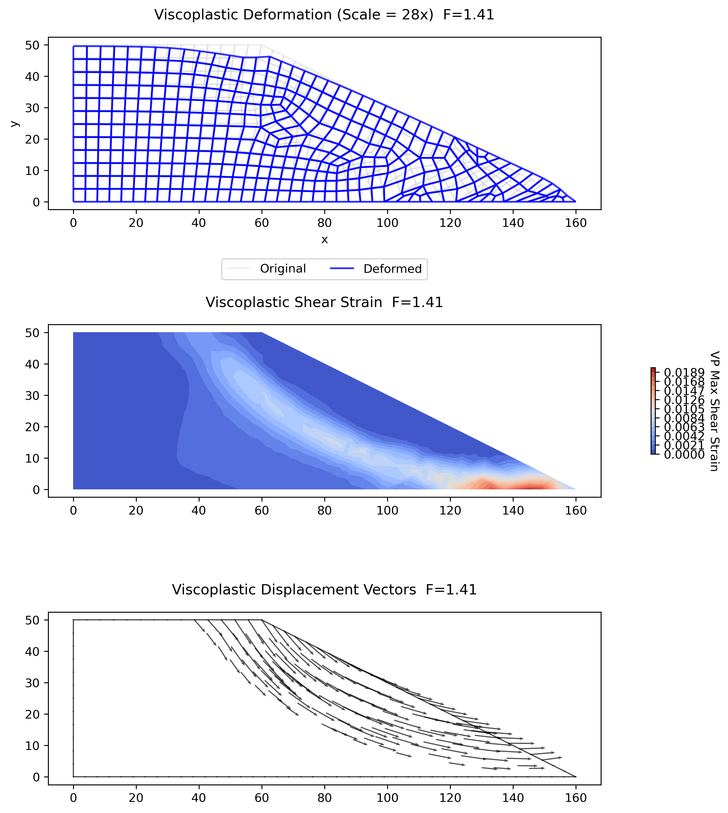{width=800}

The same analysis runs point-and-click in [XSLOPE Studio](../studio/index.md): build a mesh, run a
single trial or an SSRM search (with cancel), and view deformation and shear-strain results. See
[Studio → Running Analyses](../studio/analysis.md#finite-element-fem).

## Governing equations

The stress field must balance the applied loads, while the material law relates stress to strain
and sets the strength beyond which plastic deformation occurs.

### Equilibrium

In two dimensions, static equilibrium of a continuum requires

>>$\dfrac{\partial \sigma_x}{\partial x} + \dfrac{\partial \tau_{xy}}{\partial y} + b_x = 0$

>>$\dfrac{\partial \tau_{xy}}{\partial x} + \dfrac{\partial \sigma_y}{\partial y} + b_y = 0$

where $\sigma_x$ and $\sigma_y$ are the normal stresses on planes perpendicular to the $x$ and $y$
axes, $\tau_{xy}$ is the shear stress on those planes, and $b_x$ and $b_y$ are the body forces per
unit volume. Under gravity alone $b_x = 0$ and $b_y = -\gamma$, with $\gamma$ the unit weight; a
pseudo-static [seismic](#seismic-forces) term adds a horizontal component when one is applied.
Stresses are tension-positive throughout the solver, so the compressive stress of self weight is
negative.

### Elastic stress-strain

Below yield the material is linear elastic: the stress vector $\{\sigma\} = (\sigma_x, \sigma_y,
\tau_{xy})$ is related to the strain vector $\{\varepsilon\} = (\varepsilon_x, \varepsilon_y,
\gamma_{xy})$ by $\{\sigma\} = [D_e]\{\varepsilon\}$, where $[D_e]$ is the plane-strain
constitutive matrix

>>$[D_e] = \dfrac{E}{(1+\nu)(1-2\nu)} \begin{bmatrix}
1-\nu & \nu & 0 \\
\nu & 1-\nu & 0 \\
0 & 0 & \dfrac{1-2\nu}{2}
\end{bmatrix}$

$E$ is Young's modulus and $\nu$ is Poisson's ratio, both required for every material. Plane strain
means the out-of-plane strain $\varepsilon_z$ is zero, so the out-of-plane stress
$\sigma_z = \nu(\sigma_x + \sigma_y)$ is carried without being an unknown.

#### Typical elastic parameters

The table gives typical drained ranges, to be refined by site-specific testing where deformations
matter. Undrained moduli, which differ, follow it.

| Soil Type | Young's Modulus $E$ [kPa] | Young's Modulus $E$ [psf] | Poisson's Ratio $\nu$ | Notes |
|-----------|:-------------------------:|:-------------------------:|:--------------------:|-----------------|
| **Soft Clay** | 2,000 - 15,000 | 41,800 - 313,000 | 0.40 - 0.50 | Use lower E values for very soft clays |
| **Medium Clay** | 15,000 - 50,000 | 313,000 - 1,044,000 | 0.35 - 0.45 | Plasticity index affects stiffness |
| **Stiff Clay** | 50,000 - 200,000 | 1,044,000 - 4,175,000 | 0.20 - 0.40 | Overconsolidated clays have higher E |
| **Loose Sand** | 10,000 - 25,000 | 209,000 - 522,000 | 0.25 - 0.35 | Depends on relative density |
| **Medium Sand** | 25,000 - 75,000 | 522,000 - 1,565,000 | 0.30 - 0.40 | Well-graded sands toward upper range |
| **Dense Sand** | 75,000 - 200,000 | 1,565,000 - 4,175,000 | 0.25 - 0.35 | Angular particles give higher stiffness |
| **Loose Silt** | 5,000 - 20,000 | 104,000 - 418,000 | 0.30 - 0.45 | Non-plastic silts toward lower ν |
| **Dense Silt** | 20,000 - 100,000 | 418,000 - 2,088,000 | 0.25 - 0.40 | Cementation increases stiffness |
| **Gravel** | 100,000 - 500,000 | 2,088,000 - 10,440,000 | 0.15 - 0.30 | Well-graded, dense materials |
| **Rock Fill** | 50,000 - 300,000 | 1,044,000 - 6,260,000 | 0.20 - 0.35 | Depends on gradation and compaction |
| **Soft Rock** | 1,000,000 - 10,000,000 | 20,880,000 - 208,800,000 | 0.15 - 0.30 | Weathered or fractured rock |

Enter $E$ in kPa with metric inputs and psf with English inputs, consistent with the unit weights
and cohesions.

For undrained conditions, $E_u$ is measured directly by UU triaxial or unconfined compression tests,
or estimated from $E_u = (150-1500)\,S_u$ — the low end for soft clays, the high end for stiff ones.
Laboratory moduli generally exceed field values because of sample disturbance.

How precisely $E$ must be known depends on the question. Under the SSRM the factor of safety is
governed by $c$ and $\phi$; $E$ scales the computed displacements but has little effect on the
critical strength reduction factor. Approximate moduli are therefore adequate unless the deformation
prediction is itself a deliverable.

### Mohr-Coulomb failure criterion

Elastic behavior holds only up to a limit, and for soils that limit is set by the Mohr-Coulomb
criterion: on any plane through a point, the shear stress the soil can carry is

>>$\tau_f = c + \sigma' \tan \phi = c + (\sigma - u_w) \tan \phi$

where $c$ is the cohesion, $\phi$ the friction angle, $\sigma$ the normal stress on the plane and
$\sigma' = \sigma - u_w$ the effective normal stress, with $u_w$ the pore-water pressure.
Here normal stresses are plotted compression-positive, the opposite sign to the solver's
components defined under [Equilibrium](#equilibrium). Plotted against $\sigma'$, the strength is a
straight line, the failure envelope, and a stress state is at failure when its Mohr circle touches it:

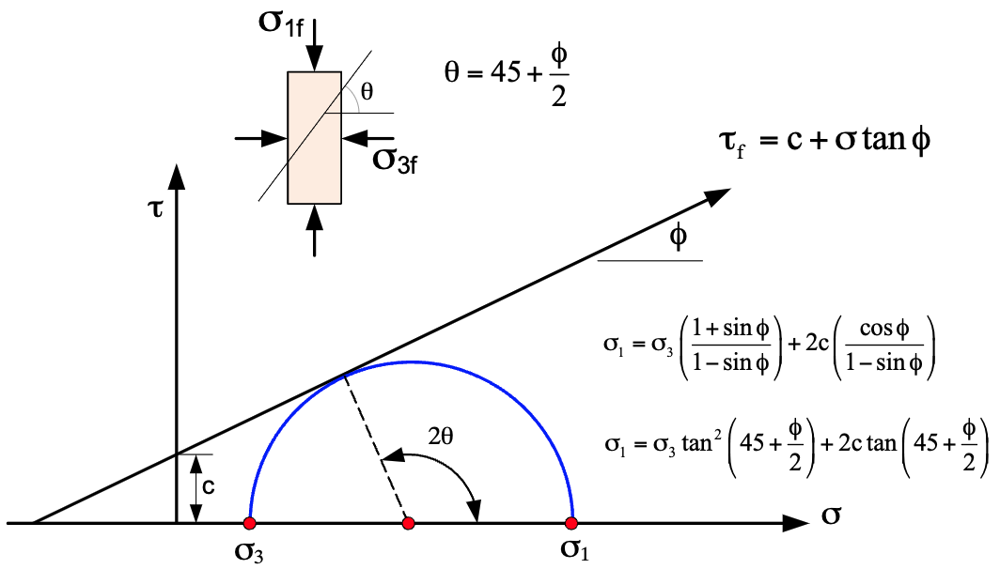{width=800px}

In principal effective stresses the criterion becomes the yield function

>>$f(\sigma_1', \sigma_3') = \dfrac{\sigma_1' - \sigma_3'}{2} - \left(\dfrac{\sigma_1' + \sigma_3'}{2} \sin \phi + c \cos \phi\right)$

with $f < 0$ elastic, $f = 0$ on the yield surface and $f > 0$ inadmissible — a state the
viscoplastic algorithm returns to the surface.

In principal-stress space the yield function is the surface below:

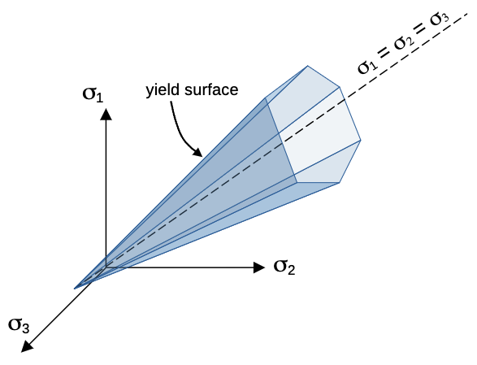

The solver evaluates $f$ at every Gauss point in the invariant form used by Smith & Griffiths
(mean stress $\sigma_m$, deviatoric stress $\bar{\sigma}$ and Lode angle $\theta$), which avoids
solving an eigenvalue problem per point:

>>$f = \sigma_m\sin\phi + \bar{\sigma}\left(\dfrac{\cos\theta}{\sqrt{3}} - \dfrac{\sin\theta\sin\phi}{3}\right) - c\cos\phi$

Mohr-Coulomb is the usual choice, but it is one of five strength options a material can carry on
the **mat** sheet. The FEM accepts `mc`, the criterion above; `cp`, an undrained strength that
increases with depth from a reference elevation, assigned to each element at its centroid; `pow`
and `hb`, the curved envelopes described next; and `elastic`, for a material that is never checked
against a yield criterion and so stays elastic at every strength reduction factor (RS2's
"Plasticity: None"). Any other option is refused rather than run as zero-strength soil. The inputs
for each are on the [mat worksheet](../usage/input_template.md#worksheet-mat) page.

### Curved failure envelopes

Two of the five options, the power curve (`pow`) and the generalized Hoek-Brown criterion (`hb`),
give a strength envelope that curves in $\tau$–$\sigma'$ space instead of the straight line above;
both are defined on the [LEM overview](../lem/overview.md#hoek-brown-strength). The FEM has no
separate yield function for them. At every Gauss point, on every iteration, it draws the tangent
to the curve at that point's current normal stress and applies the Mohr-Coulomb formulation with
the tangent's own cohesion and friction angle, $c_i$ and $\phi_i$. As the iteration converges the
stress at each point settles, the tangent settles with it, and at equilibrium every yielding
point sits on the true curve at its own normal stress.

The normal stress at which the tangent is taken differs between the two. The power curve bends
gently, and the center of the in-plane Mohr circle, $s' = -(\sigma_x + \sigma_y)/2$ (compression
positive), serves. Hoek-Brown bends sharply, and the tangent is taken at the normal stress on the
failure plane, $\sigma_n = s'\cos^2\phi - c\sin\phi\cos\phi$, computed from the previous iteration's
reduced tangent. That is the point where the Mohr circle touches its tangent line, and the same
normal stress the LEM uses at a slice base.

Strength reduction divides $c_i$ and $\tan\phi_i$ by $F$ after the tangent is taken. The curve's own
constants are never divided: $\sigma_{ci}/F$ would be a different envelope, because of the exponent
$a$, and would give a wrong factor of safety.

The Hoek-Brown implementation is verified against Example 1 of Hammah, Yacoub, Corkum & Curran
(2005); see the [verification page](../verification/ssrm.md#hoek-brown).

## Finite element formulation

The continuum equations are solved on a mesh by interpolating displacement within each element
and assembling the element stiffnesses into a system of nodal equations.

### Discretization

The domain is divided into triangular or quadrilateral elements. Within each element the
displacement at any point, $\mathbf{u} = (u, v)$, is interpolated from the displacements of the
element's nodes, $\{u_e\}$, through the element's shape functions $[N]$:
$\mathbf{u} = [N]\{u_e\}$. The shape functions are polynomials in the element's local coordinates,
linear for a three-node triangle or four-node quadrilateral and quadratic for the six-, eight-
and nine-node forms, and each takes the value 1 at its own node and 0 at the others.

A typical slope mesh is shown below.

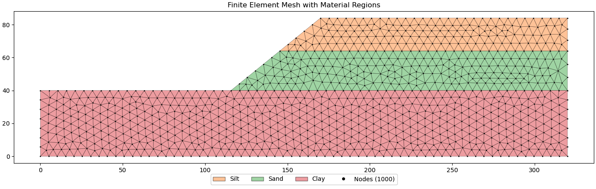

XSLOPE supports linear and quadratic triangles and quadrilaterals. The red markers below
show the nodes added between corners in the quadratic forms, alongside the embedded bars and beams.

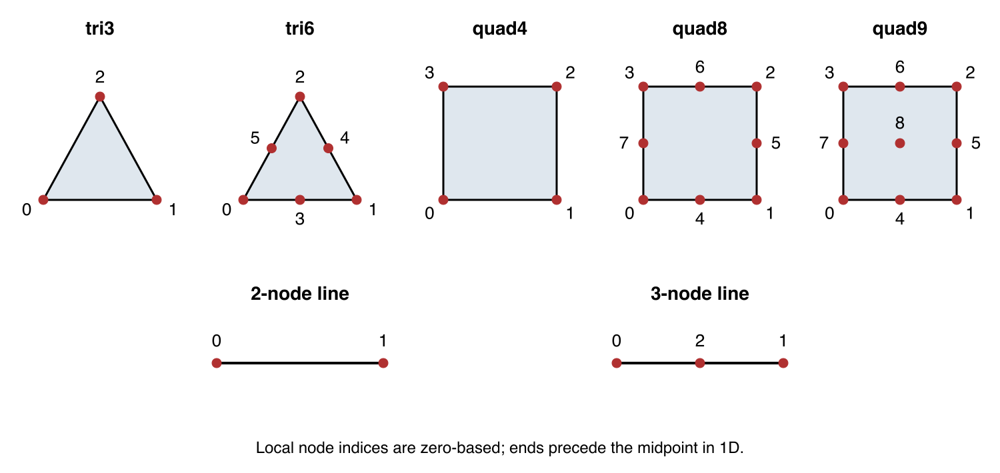{width=1500px}

[Mesh Generation](mesh.md) covers mesh construction and
[element choice for FEM analyses](mesh.md#element-choice-for-fem-analyses).

### Stiffness and assembly

Each element's stiffness follows from virtual work,

>>$[K_e] = \int_{A_e} [B]^T [D_e] [B] \, dA$

where $[B]$ is the strain-displacement matrix, which gives the strains $(\varepsilon_x,
\varepsilon_y, \gamma_{xy})$ from the nodal displacements by $\{\varepsilon\} = [B]\{u_e\}$,
$[D_e]$ is the elastic matrix of the previous section and the integral is over the element's area
$A_e$. For a linear triangle $[B]$ is constant over the element,

>>$[B] = \dfrac{1}{2A} \begin{bmatrix}
b_1 & 0 & b_2 & 0 & b_3 & 0 \\
0 & c_1 & 0 & c_2 & 0 & c_3 \\
c_1 & b_1 & c_2 & b_2 & c_3 & b_3
\end{bmatrix}$

with $b_i$ and $c_i$ the differences of the nodal coordinates ($b_1 = y_2 - y_3$,
$c_1 = x_3 - x_2$, and cyclically) and $A$ the triangle's area; for higher-order elements $[B]$
varies over the element and the integral is evaluated numerically at Gauss points. The element
matrices are assembled by shared nodes into the global system

>>$[K] \{U\} = \{F\}$

where $\{U\}$ holds every nodal displacement in the mesh and $\{F\}$ the nodal forces from body
forces, surface loads and, as the iteration proceeds, the viscoplastic body loads. Its solution
gives the nodal displacements, and from them the strains and stresses used in the yield check.

## Boundary conditions

The assembled equations need displacement restraints to prevent rigid-body motion and boundary
loads to represent the forces acting on the model.

The section below shows the restraints and surface loads, with the water table drawn separately.

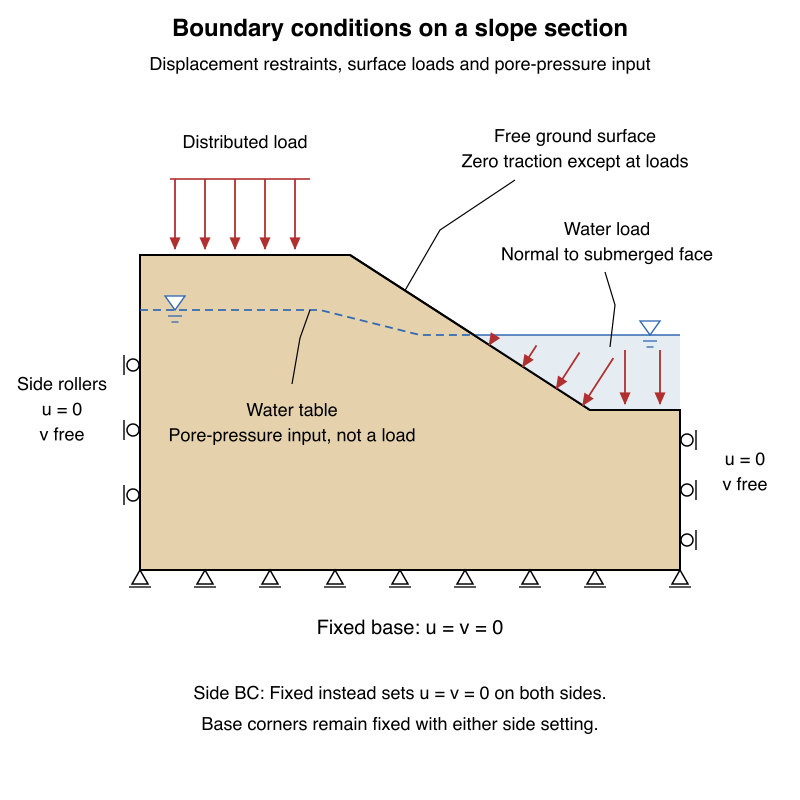{width=800px}

The red arrows are applied loads; the water table supplies pore pressures, not a boundary traction.

### Displacement boundary conditions

**Fixed supports** ($u = v = 0$) represent rigid bedrock or a boundary deep enough that its movement
does not matter. The model should extend at least one slope height below the toe, and preferably to
a stiff layer.

**Roller supports** prevent movement in one direction only. On vertical side boundaries $u = 0$ with
$v$ free represents ground continuing beyond the model with the same geometry and loading.

**Free boundaries** — the ground surface and slope face — carry zero traction except where a load is
applied.

Prescribed displacements are imposed on the assembled system by direct modification of the
constrained rows; applied forces enter $\{F\}$ directly and leave $[K]$ unchanged.

### Loads {#distributed-loads}

Distributed loads are line loads along the ground surface, given as coordinates with intensities
(force per unit length) on the **dloads** sheet and shared with the limit-equilibrium solvers,
which convert them to a resultant on each slice.

Hydrostatic pressure on a submerged face need not be entered at all. With the main sheet's **Water
loads** selector on `auto`, the ponded-water load is derived from the model's own water definition
and applied here as tractions — from the *same* derivation the limit-equilibrium slice forces use,
so the two engines always apply the same water. Because it is a load rather than a strength,
strength reduction does not change it: the derived reservoir is constant across an SSRM bracket. See
[Automatic water loads](../usage/preflight.md#automatic-water-loads).

For the FEM the loads are converted to nodal forces by **consistent** edge integration of the shape
functions, $f_i = \int N_i\, p\, d\Gamma$. For a linear intensity variation from $q_1$ to $q_2$ over
a length $L$ this gives

>>$F_1 = \frac{L}{6}(2q_1 + q_2) \qquad F_2 = \frac{L}{6}(q_1 + 2q_2)$

and on a quadratic edge under uniform pressure the 1/6–2/3–1/6 corner–midside–corner split. Simple
tributary-length lumping is *not* used: on quadratic edges it misallocates corner and midside
forces, leaving a chain of self-equilibrated nodal couples of order $pL/6$ that appears as spurious
near-surface stress oscillation — strong enough to falsely yield the skin elements under a large
applied pressure such as reservoir loading.

**Direction.** A load block's **Direction** column chooses how the traction is oriented: `normal`
(the default, and what every file written before template version 21 means) applies it perpendicular
to the surface, resolved into components from the local surface angle $\beta$; `vertical` applies
the same magnitude straight down, which is what a gravity surcharge on an inclined crest is — the
normal form would give it a horizontal thrust of $\tan\beta$ times the surcharge that the load does
not have. A model may mix the two. Derived water loads always act normal to the surface.

**Load direction into the slope.** The mesh, not the order in which the load line's points were
entered, decides which way is into the slope. For each loaded edge the material lies on one side — the centroid of the element that
owns the edge — and the pressure is directed at it; where an edge is shared by elements on both
sides the contributions cancel and the load acts along the tangent-normal as usual. The same rule
applies node-by-node on the tributary-lumping fallback used when a load line does not follow
complete element edges. A load line authored right-to-left therefore assembles the same nodal forces
as the same line authored left-to-right, and a pool against a downstream face is not pushed the
wrong way.

**Body forces.** Self weight enters as $b_y = -\gamma$, integrated to nodal forces element by
element,

>>$\{F\}_b = \sum_{e} \int_{A_e} [N]^T \{b\} \, dA$

**Moist and saturated unit weight.** Soil below the water table weighs more than the same soil above
it, and the **mat** sheet holds both weights: $\gamma$ is the moist unit weight, $\gamma_{sat}$ the
saturated one. When a material carries both, $\gamma$ is not a constant over the element — it is
evaluated at every Gauss point of the body-force integral, $\gamma_{sat}$ at a point at or below the
water table and $\gamma$ at one above it. An element the water table cuts through therefore carries
the weight it really has, part saturated and part moist, rather than one compromise weight for the
whole element. Leave $\gamma_{sat}$ blank and the soil weighs $\gamma$ everywhere.

The water table itself is a property of the **problem**, not of any material: there is one per model,
and it is read from the seepage solution's $u_w = 0$ contour when the model carries one and from the
piezometric line otherwise. That is the same surface, chosen the same way, that the
[LEM slicer](../lem/overview.md) splits slice weights at. It is independent of each material's
pore-pressure option, so a total-stress material (`u = none`) standing below the water table still
weighs $\gamma_{sat}$, and a piezometric line drawn on a model whose materials read no pore pressure
from it still locates the water table. A model that declares $\gamma_{sat}$ but no water table has no
elevation to split at, and is weighed $\gamma$ throughout.

Two other quantities are weighed from the same split: the vertical overburden integral behind the
[K0 initial stress](#k0-initial-stress) and the soil column the [`ru`
pore-pressure option](#pore-pressure-options) reads. Both are integrated $\gamma_{sat}$ over the part of the column below the
water table and $\gamma$ over the part above it.

### What XSLOPE assigns automatically

`build_fem_data()` derives every displacement boundary condition from the mesh geometry — nothing is
specified by hand:

1. **All nodes start free**, the natural zero-traction condition.

2. **Fixed supports at the base.** The base is the part of the domain boundary that is neither
   ground surface nor a side edge, so an undulating or stepped bedrock base is fixed along its whole
   length; on a flat-bottomed domain this is exactly the set of nodes at the minimum $y$.

3. **Side restraint on the left and right.** A side is the boundary edge that reaches the extreme
   $x$-coordinate, not only the nodes standing exactly at it, so a far-field truncation digitized
   slightly off plumb is still a side and the whole face is restrained. The main sheet's **Side BC**
   cell chooses what the restraint is: `rollers` (the default, and every file that does not declare
   it) gives $u = 0$ with $v$ free, so truncated ground can still settle under its own weight;
   `fixed` clamps both components, which is what RS2 does on its side boundaries. Fixing the sides
   matches the vendor's setting rather than improving the model — it adds shear restraint the real ground
   does not have and stiffens a domain truncated close to the slope. Corner nodes where a side meets
   the base keep the fixed condition either way.

4. **Force boundary conditions** from the distributed loads, integrated edge by edge as above. Where
   a loaded node also carries a displacement constraint, both are kept.

The figure below shows the result for the reinforced slope built in [FEM-2](../tutorials/fem02_reinforcement.md):
fixed supports (triangles) along the base, x-rollers (circles) on the sides, a free ground surface,
arrows for the 240 psf surcharge on the crest, and reinforcement elements in red.

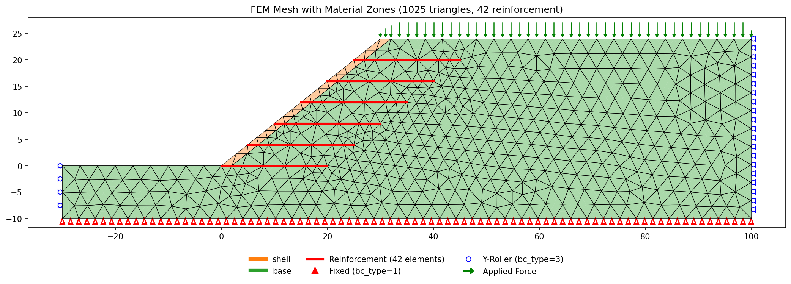{width=1000}

## Pore pressures {#pore-pressure-options}

Pore pressures reduce effective stress and therefore available strength. Each material names its
source in the **u** column of the **mat** sheet, and one model may use only one source — mixing
`piezo` and `seep` across materials is refused.

| `u` | Source | Pore pressure at a Gauss point |
|:----|:-------|:-------------------------------|
| `none` | none | $u_w = 0$; the yield check is a total-stress check |
| `piezo` | piezometric line | $u_w = \gamma_w (y_{piezo} - y_{gp})$ from the line elevation above the point |
| `ru` | pore-pressure ratio | $u_w = r_u\,\sigma_v$, with $\sigma_v$ the weight of the soil column above the point |
| `seep` | seepage solution | $u_w = \sum N_i u_{w,i}$ interpolated from the seepage analysis' nodal values |

All four are evaluated **once**, at `build_fem_data()` time, at every Gauss point — the physical
coordinates come from the shape functions, $x_{gp} = \sum N_i x_i$ — so the viscoplastic loop does
no interpolation. Negative values are clamped to zero for the yield check; the raw signed field is
retained so the optional [matric-suction](#matric-suction-apparent-cohesion-above-the-water-table)
credit can use it.

The `ru` overburden is the soil column only, integrated by intersecting a vertical ray with the
material zones, which is the definition the LEM slicer uses (Bishop & Morgenstern): distributed
loads and crack water are excluded, and the column is weighed $\gamma_{sat}$ below the water table
and $\gamma$ above it — moist throughout on the usual `ru` model, which carries no water table.

A piezometric line assigns pore pressure only over its own horizontal extent, exactly as in the
[LEM](../lem/overview.md#pore-pressures); nothing is extrapolated past either end. Because the FEM
samples the line at every node and Gauss point, the whole mesh must lie within that extent — a point
outside stops the build with an error naming the point, its x-coordinate and the line's extent. A
line that deliberately stops short (a reservoir on one side of a dam only) is modeled by carrying
it on at an elevation below the mesh, which states that the ground beyond is dry. The build also
stops when a material has `u = piezo` and the file defines no piezometric line; a material with no
water takes `u = none`.

**How pore pressure enters the equilibrium.** The total-stress statement
$\int B^T (\sigma' - u_w\,m)\,dV = F_{ext}$, $m = [1, 1, 0, 1]^T$, is
rearranged so the pore-pressure term joins the load vector,

>>$\int B^T \sigma'\, dV = F_{ext} + \int B^T m\, u_w\, dV$

and the stresses computed from the displacement solution are **effective stresses directly**.
Physically the added load term converts the body force in submerged soil to its buoyant weight (plus
seepage forces wherever $u_w$ is not hydrostatic), so all three effective stress components below a
flooded boundary come out compressive and level flooded ground sits elastically at rest.

### Matric suction (apparent cohesion above the water table)

The signed pore-pressure field also supplies matric suction above the water table.
By default the solver clamps pore pressure to $u_w = \max(0, u_w)$ at every Gauss point before the yield
check, so the negative pore pressures above the water table add no strength. Where matric suction is
a first-order effect — an unsaturated cut slope, for instance — a per-material unsaturated friction
angle $\phi^b$ turns that credit on, using the same Fredlund extended Mohr-Coulomb criterion the
[limit-equilibrium solver uses](../lem/overview.md#matric-suction-apparent-cohesion-above-the-water-table):

>>$\tau_f = c' + (\sigma_n - u_a)\tan\phi' + (u_a - u_w)\tan\phi^b$

With pore-air pressure $u_a = 0$ the last term becomes an **apparent cohesion**

>>$c_{suction} = \min(s,\; s_{cap})\,\tan\phi^b, \qquad s = \max(0,\; -u_w)$

added to $c'$ in the yield function, where $s$ is the suction at the Gauss point and $s_{cap}$ an
optional ceiling. The effective-normal-stress term keeps the ordinary clamped $u_w \ge 0$, so only the
cohesive intercept picks up the extra strength; below the water table $s = 0$ and the term vanishes.

The suction is drawn from the material's own pore-pressure source and is credited only for the
effective-stress strength options (`mc`, `pow`, `hb`) with a signed source — `u = piezo` or
`u = seep`, the only ones carrying negative pressure above the water table. It is inert for `cp` and
`elastic` materials and for the `none` and `ru` sources, exactly as in the limit-equilibrium solver.

In an SSRM solve the apparent cohesion is reduced by the trial factor alongside $c'$ and
$\tan\phi'$, $c_{suction,\,r} = \min(s, s_{cap})\tan\phi^b / F$, so the credit scales as $1/F$ and
enters the reduced envelope on the same footing as the effective cohesion. That distinguishes it
from the [tension cutoff](solver.md#tensile-strength-in-ssrm), which caps a stress.

$\phi^b$ is blank for every material unless set, so the credit is **off by default**. It is
controlled by the `phi_b` and `s_cap` columns on the
[mat worksheet](../usage/input_template.md#worksheet-mat) and read automatically by `solve_fem()` and
`solve_ssrm()`; their `suction_phi_b` / `suction_cap` arguments override the file.

!!! warning "Cap the suction on a piezometric source"
    A piezometric line's hydrostatic head grows negative without bound above the line, so the higher a Gauss point
    sits above it the larger the (unphysical) suction and the larger the credited apparent cohesion. **Always set
    `s_cap`** when using `phi_b` with `u = piezo`. With `u = seep` the finite-element seepage field is self-bounded
    by the unsaturated-flow physics, so a cap there is a useful backstop rather than a hard requirement.

## K0 initial stress

In-situ stress is the stress the ground carries before the analysis; the mesh, strengths and loads
alone do not specify its lateral component. Deformation is computed from changes in that state.
XSLOPE offers two conventions: gravity turn-on builds stress from self weight; at-rest initialization
sets the lateral effective stress to $K_0$ times the vertical effective stress, where $K_0$ is the
at-rest earth-pressure coefficient.

To use at-rest initialization, enter $K_0$ in the **K0 initial stress (FEM)** cell on the main sheet,
pass `k0=` to `solve_fem()` / `solve_ssrm()`, or check **K0 initial stress** in Studio's Run FEM dialog
and enter a value. Leave the cell blank, omit `k0=`, and keep the checkbox unchecked for gravity turn-on.

### The two conventions

Gravity turn-on starts from zero stress and applies self weight in one step. Under elastic conditions
with zero lateral strain, the horizontal effective stress is fixed by Poisson's ratio $\nu$:

>>$\sigma'_h = \dfrac{\nu}{1-\nu}\,\sigma'_v$

At $\nu = 0.3$ the coefficient is approximately 0.43, equal to the normally consolidated value from
[Jaky's formula](#choosing-a-value) at $\phi' \approx 35^\circ$, but it does not represent the
locked-in stress of compacted fill or overconsolidated clay. At-rest initialization instead specifies
that stress history through $K_0$, building the effective stress at each Gauss point (an integration
point inside an element) from the weight of the soil column above it:

>>$\sigma'_v = -\!\!\int \gamma\,dy \;+\; u_w \qquad
  \sigma'_h = \sigma'_z = K_0\,\sigma'_v \qquad \tau_{xy} = 0$

Stresses are tension-positive; $x$ is horizontal, $y$ vertical and $z$ out-of-plane, and $u_w$ is
pore-water pressure. The soil column above each Gauss point is weighed with the saturated unit weight
$\gamma_{sat}$ below the water table and the moist unit weight $\gamma$ above, as in the
[`ru` option](#pore-pressure-options). The out-of-plane stress is therefore $K_0\sigma'_v$ rather
than the plane-strain elastic value $\nu(\sigma'_x+\sigma'_y)$.

The initial-stress method (Smith & Griffiths, 2004) adds the prescribed field $\{\sigma_0\}$ to
the stress from deformation:

>>$\{\sigma\} = \{\sigma_0\} + [D]\big([B]\{U\} - \{\varepsilon^{vp}\}\big)$

Here $[D]$ is the elastic stiffness, $[B]$ converts nodal displacements $\{U\}$ to strain, and
$\{\varepsilon^{vp}\}$ is the viscoplastic strain. Substitution into equilibrium,
$\int [B]^T\{\sigma\}\,dV = \{F_{ext}\}$, gives

>>$[K]\{U\} = \{F_{ext}\} - \int [B]^T\{\sigma_0\}\,dV + \int [B]^T[D]\{\varepsilon^{vp}\}\,dV$

The prescribed field therefore enters twice: as the load term $-\int [B]^T\{\sigma_0\}\,dV$,
and as part of the stress the yield check tests.

The figure pairs an element at depth with the vertical and horizontal effective-stress profiles
for each convention:

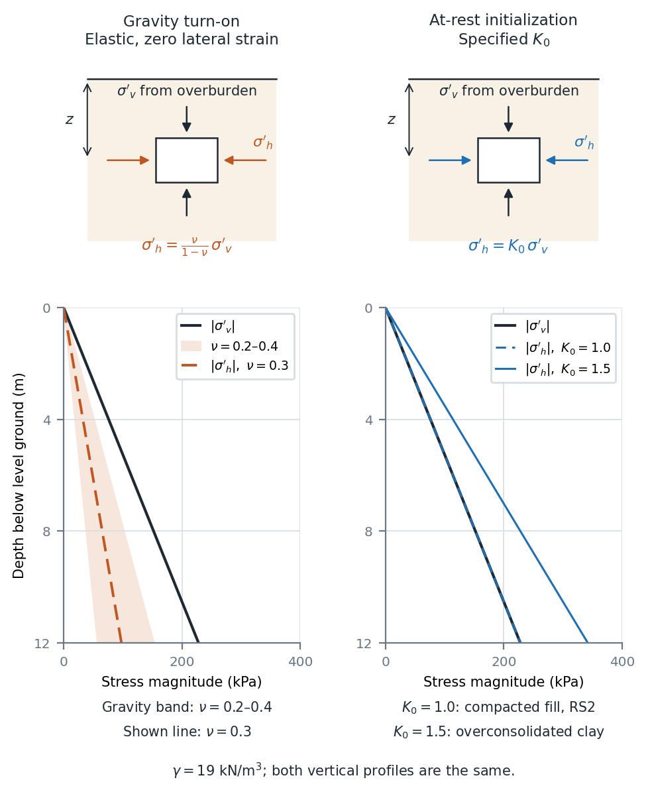{width=700}

The illustration is a uniform, dry level-ground column; the profiles show compression magnitudes.

The vertical profiles are identical. The shown at-rest profiles give larger horizontal compression
than the gravity-turn-on profile; the shaded band shows how the gravity result changes with
Poisson's ratio.

On level ground with no horizontal variation, a fixed base and horizontally restrained sides,
the $K_0$ field balances self weight for any $K_0$: the integral satisfies vertical equilibrium,
and $\sigma_h$ has no horizontal gradient. If the field lies inside the soil's yield envelope and
there are no additional surface loads, the solver converges on the first iteration, leaves the mesh
undisplaced to machine precision and yields nowhere.

Under a slope there is no soil column beside the face to balance the lateral stress, so the field
is not in equilibrium. With $K_0$ set, `solve_ssrm()` first runs one
[equilibration solve](solver.md#in-situ-equilibration) at full strength to redistribute that imbalance
before reducing strength. If it establishes a stable state, every trial starts from that state,
and displacements are counted from it.

Surface loads (reservoir, distributed, footing) are not part of the overburden. They are applied
as boundary forces in that equilibration solve.

### Choosing a value

The usual $K_0$ estimates for retaining-wall and settlement calculations apply:

- Normally consolidated soil: Jaky's $K_0 = 1 - \sin\phi'$, roughly 0.4–0.5 for sands and
  0.5–0.7 for soft clays, decreasing as the friction angle rises.
- Overconsolidated soil: $K_0 \approx (1 - \sin\phi')\,\mathrm{OCR}^{\sin\phi'}$, where OCR is
  the overconsolidation ratio. Light overconsolidation gives 0.7–1.0; heavily overconsolidated
  clay exceeds 1.0 and can approach the passive limit.
- Compacted fill: the compaction plant overconsolidates it, so $K_0 = 1$ or above is normal.
- Unknown history: run both conventions and report [their factor-of-safety range](#what-to-expect).

[RS2's published verification models](../verification/rs2.md) prescribe
$\sigma_x = \sigma_y = \sigma_z$ and lateral coefficients of 1 in both horizontal directions,
an isotropic at-rest state; set $K_0 = 1$ to compare with their SSRM results. Plaxis defaults to
Jaky's value per material. Gravity turn-on, XSLOPE's default, is the convention of
[Griffiths & Lane (1999)](../verification/ssrm.md) and most published SSRM benchmarks.

### What to expect

How much the factor of safety moves with $K_0$ depends on how much of the strength is frictional.
A larger $K_0$ raises the confining stress and with it the frictional strength, but cohesion does not
depend on confinement: a homogeneous cohesive embankment changes little, whereas the thin, tall
reinforced-soil block of a geosynthetic wall or a near-cohesionless soil depends mainly on confinement.
The table gives the SSRM factor of safety of six models under each convention:

| Model | FS, gravity turn-on | FS, $K_0 = 1$ | Change |
|---|---|---|---|
| [Griffiths & Lane Example 1](../verification/ssrm.md#verification-griffiths1) — homogeneous embankment | 1.372 | 1.378 | +0.5% |
| [RS2-31](../verification/rs2.md#rs2-31) Mohr-Coulomb member, $c' = 11.6$ kPa | 1.529 | 1.529 | 0.0% |
| [RS2-31](../verification/rs2.md#rs2-31) Mohr-Coulomb member, $c' = 0.39$ kPa | 0.931 | 0.969 | +4.0% |
| [RS2-31](../verification/rs2.md#rs2-31) power-curve member, $\tau(0) = 0$ | 0.921 | 0.973 | +5.6% |
| [RS2-48](../verification/rs2.md#rs2-48) multi-tier geosynthetic wall | 0.956 | 0.994 | +3.9% |
| [RS2-4](../verification/rs2.md#rs2-4) Talbingo dam, under RS2's own exclusion area | 1.869 | 1.894 | +1.3% |

In RS2-31 the change grows as cohesion falls: 0.0% at $c' = 11.6$ kPa, 4.0% at 0.39 kPa
and 5.6% for the power curve through the origin. Each $K_0 = 1$ result is equal to or higher
than its gravity-turn-on result, so gravity turn-on is the conservative choice for these models.

## Element type and volumetric locking {#element-type-selection-and-volumetric-locking}

The element type sets whether the mesh can deform plastically without locking.

Plastic deformation under Mohr-Coulomb with a non-associated flow rule ($\psi = 0$) is nearly
incompressible: the material shears without changing volume. Low-order elements have too few degrees
of freedom to satisfy that constraint and represent the displacement field at the same time, so they
respond too stiffly, resist plastic deformation more than they should, and require a larger strength
reduction before failure develops, overestimating the factor of safety.
This is **volumetric locking**. Constant-strain 3-node triangles (tri3), with one
integration point and 6 DOFs, are the worst affected; bilinear 4-node quads (quad4) are better
but still significantly locked.

Quadratic elements — tri6, quad8 and quad9 — have enough degrees of freedom to represent
incompressible plastic deformation without artificial stiffness. The following are SSRM results for
the Griffiths & Lane (1999) Example 1 benchmark (homogeneous slope, $c/\gamma H = 0.05$,
$\phi = 20°$, slope angle 26.57°) at a target mesh size of 5, against an expected FS of about 1.40
(Griffiths & Lane report 1.4 by FEM; Spencer's method gives 1.376):

| Element Type | Nodes per Element | SSRM Factor of Safety | Error vs. Reference |
|:---:|:---:|:---:|:---:|
| tri3 | 3 | 1.70 | +21% |
| quad4 | 4 | 1.56 | +11% |
| **tri6** | **6** | **1.41** | **< 1%** |
| **quad8** | **8** | **1.41** | **< 1%** |
| **quad9** | **9** | **1.41** | **< 1%** |

[Element choice for FEM analyses](mesh.md#element-choice-for-fem-analyses) covers which type
to use for each analysis. [Element types](mesh.md#element-types) gives each type's nodes and
numbering; [Quadratic elements](mesh.md#quadratic-elements) describes how the midside nodes are added.

## Seismic forces

Seismic loading uses the pseudo-static method in both the limit-equilibrium and finite element
solvers: a constant horizontal acceleration, expressed as a fraction $k$ of gravity, applied to the
whole soil mass as an additional body force,

>>$b_{x,seismic} = k \gamma, \qquad b_{y,seismic} = 0$

integrated to nodal forces exactly as self weight is,
$\{F\}_{seismic} = \sum_e \int_{A_e} [N]^T \{b\}_{seismic} \, dA$, and added to the load vector. The
horizontal equilibrium equation gains the corresponding term:

>>$\dfrac{\partial \sigma_x}{\partial x} + \dfrac{\partial \tau_{xy}}{\partial y} + k\gamma = 0$

**Sign of $k$ in the FEM.** The driving direction is the one that promotes sliding:
negative $x$ for a left-facing slope, positive $x$ for a right-facing one. The limit-equilibrium
solvers work out which from the location and geometry of the failure surface and use the magnitude
of $k$ only. The finite element solver has no failure surface to read, and analyses both faces of a
dam or levee at once, so it uses the **signed** value exactly as entered: enter $k$ negative to
drive a left-facing slope and positive to drive a right-facing one.

## Structural elements

XSLOPE supports two kinds of one-dimensional structural element embedded in the 2D soil mesh. Bonded
reinforcement and piles share nodes with the surrounding soil elements and participate in the viscoplastic
iteration through body-force corrections; [jointed sheets](reinforcement.md#two-ways-to-represent-a-sheet)
couple to the soil through interfaces instead.

- **[Soil Reinforcement](reinforcement.md)**: geotextiles, soil nails and ground anchors as
  tension-only truss elements with axial stiffness $EA/L$, on every node of the soil edge they lie
  on — including the failure modes (perfectly
  plastic pullout, peak-residual softening, brittle rupture) and typical material properties.

- **[Piles and Concrete Piers](piles.md)**: beam elements carrying both axial stiffness ($EA/L$) and
  lateral bending stiffness ($12EI/L^3$), and — unlike reinforcement — both tension and compression.
  Pile nodes carry a rotational DOF as well as their two translations; other nodes carry only the
  translations. See the [mixed DOF system](piles.md#mixed-dof-system).

Structural properties are **not reduced** during strength reduction; only soil $c$ and $\tan\varphi$
are. The factor of safety is therefore the margin in the soil strength, given the structural
elements as designed.

Bonded reinforcement and pile lines are embedded in the same mesh, so their 1D elements are edges of the
soil elements around them and every 1D node is a soil node. That coupling makes their discretization
a mesh question rather than a per-member one: refining a member means refining the soil it transfers
its load to. A line enters the mesh as its two endpoints, subdivided at the 1D element size — its
capacity, and the law behind it, are read by the solver and never decide the discretization. The
**1D element size** on the main sheet sets it, blank to mesh them at the global target size like everything else. A stated size
is applied as a graded band around the lines, so the structural elements and the soil sharing their
nodes both come back at that size and grow back to the target away from them, and a member can be
discretized finely without a finer mesh across the whole section. It only ever refines: a value at
or above the target size cannot coarsen the lines and is ignored.

## Visualization of results

Results are drawn as panels of the deformed mesh, strain and stress fields, displacement vectors
and the displacement-vs-F curve; `plot_fem_results()` stacks the ones named in `plot_type`:

| Plot Type | Description |
|-----------|-------------|
| `deformation` | Deformed mesh over a dashed light outline of the original extent. Viscoplastic displacements (total minus elastic) are used when available, so the panel shows the failure mechanism rather than gravity settlement. With a captured at-failure field the title reads "…at Failure". The exaggeration is auto-sized so the maximum deformation is about `deform_percent` of the mesh height, measured on the field actually drawn. |
| `shear_strain` | Viscoplastic maximum shear strain contours — the most useful panel for identifying the mechanism, since high shear strain reveals the failure surface with no prior assumption about its shape or location. Falls back to total shear strain when viscoplastic data is unavailable. |
| `displace_vector` | Displacement vectors at corner nodes, viscoplastic where available. Vectors below a threshold fraction of the maximum are hidden to reduce clutter. |
| `displace_mag` | Displacement magnitude contours. |
| `stress` | Von Mises stress contours with yielded elements highlighted. |
| `strain` | Von Mises equivalent strain contours from total strains. |
| `yield` | Mohr-Coulomb yield function contours; positive values are yielding. |
| `ssrm_curve` | Displacement vs F: the maximum displacement of every strength reduction trial against its factor, drawn from the run record passed as `ssrm_record` (see [Displacement vs F](#displacement-vs-f)). |

The default is `['deformation', 'shear_strain', 'displace_vector']`. The example below is the
non-circular problem from [FEM Samples](samples.md) Problem 1, where a thin weak clay layer controls
the mechanism:

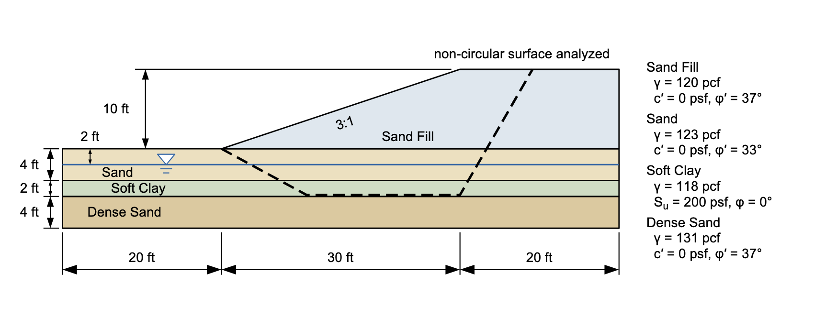{width=1000}

The SSRM results below show the deformed mesh, the concentration of shear strain in the clay layer,
and the displacement vectors showing lateral sliding along it.

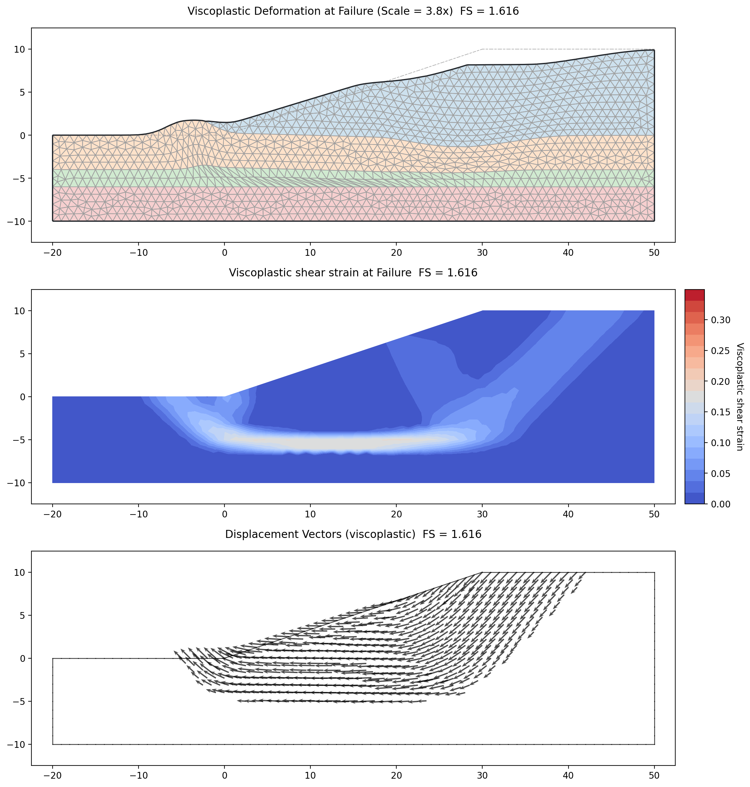{width=1000}

Common options:

- `fs` — the SSRM factor of safety. When it differs at display rounding from the $F$ the field was
  rendered at, the titles name both.
- `failure_solution` — the at-failure field captured by `solve_ssrm()`
  (`result['failure_solution']`). Supplied, it is what the panels draw.
- `field_state` — which field EVERY panel renders when `failure_solution` is given: `'failure'`
  (default) or `'converged'`, so a multi-panel figure never mixes states. (`strain_state` is a
  backward-compatible alias.)
- `show_original` — the original-mesh reference on the deformation panel: `'outline'` (default),
  `'mesh'` for the full light grid, or `False`.
- `deform_scale` / `deform_percent` — an explicit exaggeration factor, or the target deformation as
  a percentage of mesh height when the factor is auto-sized (default 15). The auto factor has no floor: a field that has already moved further than that percentage is drawn at a factor below 1.
- `deformed_color` — color of the deformed grid (default black).
- `show_mesh` — mesh lines where the mesh *is* the content: the deformation panel's grid and the
  vector panel's edge context. It does **not** overlay edges on the filled-contour panels; that is
  `mesh_on_fields` (default `False`), kept separate because element edges muddy a filled field.
- `color_by_magnitude` / `vector_cmap` — color the displacement arrows by $|u|$ with a colorbar
  instead of the default solid black.
- `cmap`, `cbar_shrink` — the shear-strain color ramp and the colorbar length.
- `show_reinforcement` (default `True`), `label_elements`, `figsize` (default `(12, 8)`),
  `save_png`, `save_dxf`, `dpi` (default 300).
- `ssrm_record` — the run the `ssrm_curve` panel is drawn from: `solve_ssrm()`'s result, or
  `import_fem_meta(stem)` for a saved run.

A typical SSRM call passes the captured at-failure field so the panels show the collapse mechanism,
and the run itself for the fourth panel:

```python
plot_fem_results(fem_data, result['last_solution'],
                 plot_type=['deformation', 'shear_strain', 'displace_vector', 'ssrm_curve'],
                 fs=result['FS'],
                 failure_solution=result.get('failure_solution'),
                 ssrm_record=result,
                 save_png=True)
```

A single plot type may be given as a string rather than a list:

```python
plot_fem_results(fem_data, solution, plot_type='shear_strain')
```

### Displacement vs F

Every strength reduction trial records the largest displacement it reached, and the `ssrm_curve`
panel plots those displacements against the trials' factors, sorted by $F$. A filled marker is a
trial in which the slope reached equilibrium, and the line joins only those. An open marker is a
trial that was stopped before it reached equilibrium. It is drawn at the point where it was
stopped, while the slope was still moving, with no line through it. The key says how it was
stopped: **stopped at the iteration limit, still moving**, **displacements ran away**, or **past
the [displacement limit](solver.md#3-displacement-limit-displacement_limit)**. The reported factor of safety is the dashed vertical line, and the final
bracket is shaded behind it. The same plot is available alone as
`xslope.plot_fem.plot_ssrm_curve(ax, record)`. Below is the embankment from
[FEM-1](../tutorials/fem01_strength_reduction.md) at that page's settings:

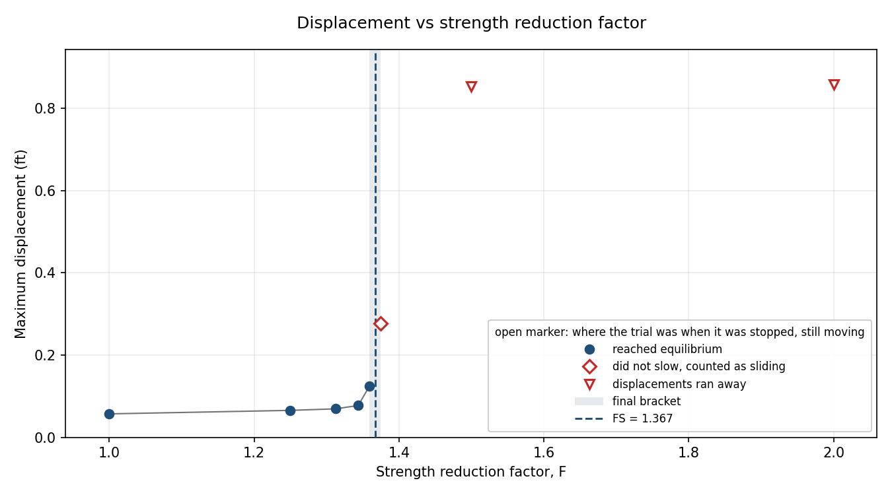{width=800}

**Interpreting the plot.** A flat run of displacements that turns up in a sharp knee is a strength limit. The
slope reached equilibrium at every factor below the knee and could not above it, and the factor of
safety sits at the knee. The trial above the knee was still moving fast when it was stopped. A
steady climb with no knee is a different result. The slope kept moving at every strength the
search tried, and the trial at the top of the bracket was still moving slowly when the iteration
limit stopped it. The factor of safety then depends on the iteration limit, and raising Max
iterations per trial may change it. A run whose top trial ended undecided found no failure, so the
dashed line sits at the highest strength the slope came to rest at and the key reads "FS ≥": no
trial above that strength was shown to fail. Where the iteration limit stopped the trial at the
top, the run can be [continued with a higher limit](solver.md#creep-trend) from where its trials stopped.

The run's closing summary gives the same information in words. It is printed as the last lines of
every strength reduction run and returned as `result['summary']`. It reports what happened at each
end of the bracket. When the trial at the top hit the iteration limit, the summary states whether it was
still moving fast (*the slope was failing; more iterations would only have let it move further*)
or still moving slowly (*the factor of safety depends on the iteration limit here*). Both quote
the largest displacement, its multiple of the elastic value and how much it grew over the last
quarter of the trial's iterations. A trial ended by any other rule is reported with the reading
that ended it: how much the joint slip grew and whether its rate slowed, the displacement reached
as a multiple of the elastic value, the displacement against the displacement limit, or how far
the out-of-balance force fell before the iteration ceiling.

## Exported files

Analysis outputs are written to files sharing the input file stem. The mesh file is written when a
new mesh is generated; the CSVs are written by

```python
export_fem_solution(fem_data, solution, output_stem)
```

When an SSRM run has captured the at-failure mechanism, that snapshot is persisted alongside the
converged solution as a second CSV pair plus a small metadata file, so a reloaded solution can
re-render the deformation and vector panels from the failure mechanism. Structural results are
written as their own engineer-readable CSVs when the model carries the corresponding elements —
these double as results tables for reading and let a reloaded solution re-render the reinforcement
force and pile shear colorbars without re-solving.

| File | Description |
|------|-------------|
| `*_mesh.json` | Finite element mesh definition used by the analysis, so the mesh can be reused. |
| `*_fem_nodes.csv` | One row per node containing displacement results. |
| `*_fem_elements.csv` | One row per 2D element containing stress, strain, and yielding results. |
| `*_fem_meta.json` | The run record: the factor of safety, the options and criterion, the final bracket, and every strength reduction trial with its verdict and maximum displacement, which the Displacement vs F plot is drawn from after a reload (`import_fem_meta(stem)`). |
| `*_fem_reinf.csv` | One row per reinforcement 1D element: ids, endpoints, axial force, capacities, the cap the solve enforced, mobilization, and failure flags. |
| `*_fem_piles.csv` | One row per pile beam element: ids, endpoints, axial/shear forces, end moments, structural capacities, and yield flags. |
| `*_fem_failure_nodes.csv` | At-failure nodal displacements, same columns as `*_fem_nodes.csv`. |
| `*_fem_failure_elements.csv` | At-failure element results, same columns as `*_fem_elements.csv`. |
| `*_fem_failure_reinf.csv` | At-failure reinforcement results, same columns as `*_fem_reinf.csv`. |
| `*_fem_failure_piles.csv` | At-failure pile results, same columns as `*_fem_piles.csv`. |
| `*_fem_failure_meta.json` | Scalar metadata for the at-failure snapshot, including its trial strength reduction factor. |

**Output units.** XSLOPE never converts units; when the model declares a unit system (the **Units**
selector on the main sheet) it labels the result colorbars and writes a `# units:` header into the
exported CSVs with that system's units, and leaves an undeclared model's output unchanged.

Each is written only when the corresponding data exists, so a model without reinforcement, piles or
a captured mechanism simply omits those rows.

### Mesh file contents

The mesh file records nodal coordinates, connectivity and material assignments for the 2D domain
and any 1D structural elements.

| Field | Description |
|-------|-------------|
| `nodes` | Node coordinates. |
| `elements` | Element connectivity. |
| `element_types` | Number of active nodes in each element. |
| `element_materials` | Material id assigned to each 2D element. |
| `elements_1d` | 1D reinforcement or pile element connectivity, when present. |
| `element_types_1d` | Number of active nodes in each 1D element, when present. |
| `element_materials_1d` | Reinforcement or pile line id for each 1D element, when present. |

### Nodal results columns

The nodal results locate each node and give its total and viscoplastic displacement.

| Column | Description |
|--------|-------------|
| `node_id` | 1-based node number. |
| `x`, `y` | Node coordinates. |
| `u_x`, `u_y`, `u_mag` | Total displacement components and magnitude. |
| `u_x_vp`, `u_y_vp`, `u_mag_vp` | Viscoplastic displacement (total minus elastic) components and magnitude. |

### Element results columns

The element results describe the stress, strain and yield state within the 2D domain.

| Column | Description |
|--------|-------------|
| `element_id` | 1-based element number. |
| `material_id` | Material id assigned to the element. |
| `x_centroid`, `y_centroid` | Element centroid coordinates. |
| `sigma_x`, `sigma_y`, `tau_xy` | Average element stresses. |
| `sigma_vm` | Von Mises stress. |
| `eps_x`, `eps_y`, `gamma_xy` | Average element strains. |
| `max_shear_strain` | Maximum shear strain from the strain state. |
| `vp_shear_strain` | Viscoplastic maximum shear strain. |
| `plastic` | Whether the element yielded. |
| `yield_function` | Mohr-Coulomb yield function for the final stress state. |

### Reinforcement results columns

For reinforcement, the results pair each element's axial force with its capacity and softening state.

| Column | Description |
|--------|-------------|
| `element_id` | Global 1D element index. |
| `line_id` | 1-based reinforcement line id. |
| `x_start`, `y_start`, `x_end`, `y_end` | Element endpoint coordinates. |
| `axial_force` | Axial (tensile) force carried by the element. |
| `t_allow` | Allowable tensile capacity (reduced toward the ends by the pullout ramp). |
| `t_res` | Residual tensile capacity after softening: the smaller of the $T_{res}$ entered for the line and the capacity the embedment develops at that element. Zero only where the line's $T_{res}$ is zero — brittle rupture. Blank where the line declares no $T_{res}$ and so never softens. |
| `mobilization` | Ratio of axial force to allowable capacity. |
| `failed`, `softened` | Whether the element reached its capacity, and whether it dropped to residual. |

These two flags, together with whether the elements at capacity sit inside a pullout ramp or out on the
$T_{max}$ plateau, are what the line's reported state is built from — *within capacity*, *near capacity*,
*pullout*, *yielded*, *softened*, *ruptured* or *inactive*, defined in
[The state of a line](reinforcement.md#the-state-of-a-line).

### Pile results columns

For piles, the results include axial and lateral forces, bending moments and the capacity flags
and plastic rotations that describe yielding.

| Column | Description |
|--------|-------------|
| `pile_index` | 0-based pile element index (the order used by the pile-force arrays and colorbar). |
| `element_id` | Global 1D element index. |
| `line_id` | 1-based pile line id. |
| `x_start`, `y_start`, `x_end`, `y_end` | Element endpoint coordinates. |
| `axial_force`, `shear_force` | Axial and lateral forces in the element. |
| `moment_1`, `moment_2` | Bending moments at the element's two nodes. |
| `v_cap`, `m_cap` | Structural shear and moment capacity per unit width (`inf` when uncapped). |
| `plastic_rotation_1`, `plastic_rotation_2` | Plastic hinge rotation at the element's two nodes (zero where no hinge formed). |
| `yielded_shear`, `yielded_moment`, `yielded` | Capacity flags. |

## References

Dawson, E.M., Roth, W.H., & Drescher, A. (1999). Slope stability analysis by strength reduction. *Géotechnique*, 49(6), 835-840.

Duncan, J.M. (1996). State-of-the-art: Limit equilibrium and finite element analysis of slopes. *Journal of Geotechnical Engineering*, 122(7), 577-596.

Duncan, J.M., & Wright, S.G. (2005). *Soil Strength and Slope Stability*. John Wiley & Sons.

Dyson, A.P., & Tolooiyan, A. (2018). Comparative approaches to probabilistic finite element methods for slope stability analysis. *Innovative Infrastructure Solutions*, 3(1), 1-11.

Griffiths, D.V., & Lane, P.A. (1999). Slope stability analysis by finite elements. *Géotechnique*, 49(3), 387-403.

Itasca Consulting Group. (2019). *FLAC — Fast Lagrangian Analysis of Continua, Version 8.1, User's Guide*. Itasca Consulting Group, Inc., Minneapolis, Minnesota.

Matsui, T., & San, K.C. (1992). Finite element slope stability analysis by shear strength reduction technique. *Soils and Foundations*, 32(1), 59-70.

Smith, I.M., & Griffiths, D.V. (2004). *Programming the Finite Element Method* (4th ed.). John Wiley & Sons.

Sun, G., Lin, S., Jiang, W., & Yang, Y. (2021). A simplified solution for determining the factor of safety of a slope reinforced with piles based on the shear strength reduction method. *Bulletin of Engineering Geology and the Environment*, 80, 7719-7730.

Zheng, H., Liu, D.F., & Li, C.G. (2005). Slope stability analysis based on elasto‐plastic finite element method. *International Journal for Numerical Methods in Engineering*, 64(14), 1871-1888.
