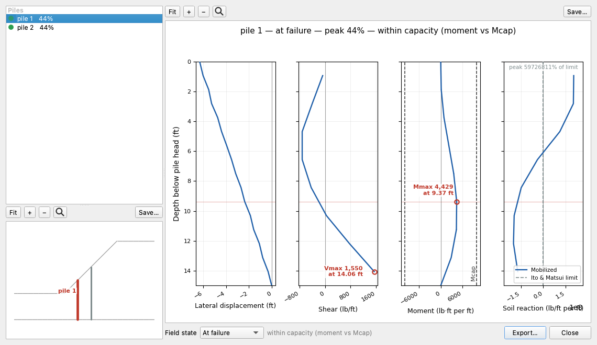

# Pile Elements in Finite Element Analysis

## Introduction

In the finite element method, piles and concrete piers are modeled as **one-dimensional beam elements** embedded within the two-dimensional soil continuum. Unlike the limit equilibrium approach where the user provides a single force $H$ at the failure surface, the FEM approach models the pile as a structural member with distributed stiffness that naturally interacts with the surrounding soil through shared nodes. The pile's resistance to lateral soil movement emerges from the analysis itself — no pre-specified pile force is needed.

This approach captures several behaviors that are difficult or impossible to model in LEM:

- The pile's resistance is mobilized progressively as the soil deforms, rather than applied as a fixed force
- Both axial (along the pile) and lateral (perpendicular to the pile) stiffness are modeled
- The pile can carry both tension and compression (unlike flexible reinforcement, which is tension-only)
- The bending stiffness of the pile ($EI$) naturally resists lateral soil movement
- Bending moments are computed directly at each node along the pile
- Structural capacity limits ($V_{\text{cap}}$, $M_{\text{cap}}$) are enforced during the analysis through plastic hinge formation
- During SSRM strength reduction, the pile stiffness remains constant while soil strength is reduced, and the analysis reveals when the soil can no longer transfer load to the pile (failure)

For background on the general finite element slope stability methodology in XSLOPE, see the [FEM Overview](overview.md). For the LEM treatment of piles, including force resolution, typical parameters, and the Ito & Matsui method, see [LEM Piles](../lem/piles.md).

## Applicability: Continuous Walls and Discrete Pile Rows

A two-dimensional beam element is a plane-strain member. It is continuous out of plane, and its $EA$ and
$EI$ are stiffnesses per metre of wall. That is an exact description of one kind of structure and an
idealization of another, and the difference decides which of XSLOPE's two paths a problem belongs on.

**Continuous walls** — sheet pile walls, diaphragm walls, secant pile walls — *are* continuous out of
plane, so the beam formulation represents them directly and the spacing $S$ is 1. This is the case the
finite element path is verified on, at both levels:

- The element itself is measured against closed-form beam theory with no soil present: simply supported
  and cantilever deflections, moments, shears and support reactions, the axial $EA/L$ action, the
  rotation into global coordinates at five orientations, the $1/S$ scaling and the circular-section
  constants derived from a diameter. All reproduce to machine precision
  (`test/beam_element_check.py`, against the closed forms of GeoStudio's SIGMA/W *Beams and Bars in a
  Frame* verification).
- The whole path — wall, soil, pore pressures and strength reduction together — is measured against
  GeoStudio's SIGMA/W *slope stabilization with piles* example, where a sheet pile wall driven from a bench
  through a weak clay band takes the slope from marginal stability to comfortably stable. XSLOPE reads
  1.011 without the wall and 1.451 with it, against SIGMA/W's own readings of about 1.025 and about 1.4,
  and recovers the wall's bending moment and shear down its length with the published shape and turning
  point. See [the SIGMA/W wall benchmark](../verification/geostudio.md#sigmaw-wall), which states how the
  published factors are read and how far XSLOPE sits from each.

**Discrete pile rows** are not continuous out of plane. Soil arches onto the piles and, at wide enough
spacing, moves between them, so the load a pile attracts is set by a three-dimensional mechanism. Dividing
$EA$ and $EI$ by the spacing (see [Assembly](#assembly)) smears one pile's stiffness over a metre of wall.
That reproduces the row's average stiffness; it does not reproduce the arching, and shared-node coupling
does not reproduce the slip that develops on each pile's surface (see
[Pile-Soil Interface and Load Transfer](#pile-soil-interface-and-load-transfer)).

The size of that idealization is measured rather than asserted. Cai & Ugai (2000) analysed one
pile-stabilized slope with a three-dimensional strength reduction finite element model that meshes the
individual piles with slip interfaces, and XSLOPE's SSRM is run on the same slope at a spacing of three
diameters in [the VP106 diagnostic](../verification/rocscience.md#vp106-fem). With no pile the two agree to
0.4%, which is what makes the rest of the comparison readable. With the pile row in place the
two-dimensional model reads 13.1% high with a free head and 8.3% high with the head rotation restrained: it
credits the row with multiplying the unreinforced factor of safety by 1.354 where the three-dimensional
model credits 1.193. Limit equilibrium with the Ito & Matsui force credits the same row 1.269, nearer the
three-dimensional value than the plane-strain beam gets.

**Which path to use.** For a discrete pile row, the validated route is limit equilibrium with the Ito &
Matsui (1975) limit pressure, which is a theory *of* the three-dimensional mechanism rather than a
two-dimensional substitute for it: XSLOPE computes it automatically from the pile diameter and spacing,
and it is verified across four spacings against both Slide2 and the originating paper in
[VP106](../verification/rocscience.md#vp106) and again in
[VP54](../verification/rocscience.md#vp54). See
[LEM vs. FEM Pile Modeling](../lem/piles.md#lem-vs-fem-pile-modeling), which states the same rule from the
limit equilibrium side and carries the measured pair on XSLOPE's own pile sample. The finite element path
remains the right one for a continuous wall, and for a pile row it is best read as a stiffness-and-force
study whose factor of safety carries the idealization above.

## Comparison with Reinforcement (Truss) Elements

The existing FEM module models flexible reinforcement as **2-node truss elements** (axial only, tension only). Piles reuse much of this infrastructure but differ in key ways:

| Property | Reinforcement (Truss) | Pile (Beam) |
|----------|----------------------|-------------|
| Axial stiffness | $EA/L$ | $EA/L$ |
| Lateral stiffness | None | $12EI/L^3$ (from bending) |
| Compression | Not allowed (zeroed via body-force corrections) | Allowed |
| Orientation | Inclined (along reinforcement) | Vertical or battered |
| Failure mode | Tension rupture / pullout | Shear / bending capacity (plastic hinge) |
| DOFs per node | 2 (translational only) | 3 (translational + rotational) |

For details on the truss element formulation used for reinforcement, see [Soil Reinforcement](reinforcement.md).

## Beam Element Formulation

### Euler-Bernoulli Beam Stiffness

XSLOPE uses the standard Euler-Bernoulli beam element with 3 DOFs per node ($u_x$, $u_y$, $\theta$), giving a 6×6 element stiffness matrix in local coordinates (beam axis along local $x$):

>$\mathbf{K}_{\text{local}} = \begin{bmatrix} \frac{EA}{L} & 0 & 0 & -\frac{EA}{L} & 0 & 0 \\ 0 & \frac{12EI}{L^3} & \frac{6EI}{L^2} & 0 & -\frac{12EI}{L^3} & \frac{6EI}{L^2} \\ 0 & \frac{6EI}{L^2} & \frac{4EI}{L} & 0 & -\frac{6EI}{L^2} & \frac{2EI}{L} \\ -\frac{EA}{L} & 0 & 0 & \frac{EA}{L} & 0 & 0 \\ 0 & -\frac{12EI}{L^3} & -\frac{6EI}{L^2} & 0 & \frac{12EI}{L^3} & -\frac{6EI}{L^2} \\ 0 & \frac{6EI}{L^2} & \frac{2EI}{L} & 0 & -\frac{6EI}{L^2} & \frac{4EI}{L} \end{bmatrix}$

where $E$ is Young's modulus, $A$ is the cross-sectional area, $I$ is the moment of inertia, and $L$ is the element length.

### Mixed DOF System

The 2D soil elements have 2 DOFs per node ($u_x$, $u_y$), while beam elements require 3 DOFs per node ($u_x$, $u_y$, $\theta$). XSLOPE uses a **mixed DOF system**: nodes belonging to pile elements are assigned 3 DOFs, and all other nodes retain 2 DOFs. A DOF offset array maps each node index to its starting position in the global displacement vector.

This approach avoids adding unnecessary rotational DOFs to the thousands of soil-only nodes while giving pile nodes the rotation needed for proper bending behavior. Soil elements at pile nodes only access the translational DOFs ($u_x$, $u_y$); the rotational DOF ($\theta$) is used exclusively by the beam element stiffness.

### Coordinate Transformation

The local stiffness matrix is transformed to global coordinates using a 6×6 rotation matrix:

>$\mathbf{K}_{\text{global}} = \mathbf{T}^T \, \mathbf{K}_{\text{local}} \, \mathbf{T}$

where $\mathbf{T}$ is a block-diagonal rotation matrix with $\cos\theta$, $\sin\theta$ direction cosines for translational DOFs and identity for rotational DOFs.

For a **vertical pile** ($\cos\theta = 0$, $\sin\theta = -1$), the axial stiffness $EA/L$ acts in the $y$-direction (vertical) and the lateral stiffness $12EI/L^3$ acts in the $x$-direction (horizontal) — exactly the behavior needed for resisting lateral slope movement.

### Assembly

The global stiffness matrix combines contributions from all element types:

>$[\mathbf{K}]_{\text{global}} = \sum_{\text{soil}} [\mathbf{K}_e]_{\text{soil}} + \sum_{\text{truss}} [\mathbf{K}_e]_{\text{truss}} + \sum_{\text{beam}} [\mathbf{K}_e]_{\text{beam}}$

The total DOF count is $2 \times n_{\text{soil nodes}} + 3 \times n_{\text{pile nodes}}$, typically only a few DOFs more than the pure 2-DOF system. The global matrix is factored once (via sparse LU decomposition) and reused for all viscoplastic iterations.

## Mesh Generation

Pile elements are integrated into the finite element mesh using the same approach as reinforcement elements. The pile line geometry — defined as two endpoints $(x_1, y_1)$ to $(x_2, y_2)$ in the `piles` sheet of the input template — is passed to the mesh generator as a constraint. The mesh generator ensures that element edges align along the pile line, so that 1D beam elements can be extracted from the edges of adjacent 2D soil elements.

When a pile endpoint is within a small tolerance of a polygon boundary (e.g., the ground surface), it is automatically snapped to the nearest boundary point. This prevents near-zero-length elements that would otherwise arise from minor coordinate mismatches between the pile definition and the ground surface interpolation.

For details on the mesh generation process and 1D element extraction, see [Mesh Generation](mesh.md).

## Force and Moment Computation

At each viscoplastic iteration, the forces and moments in each beam element are computed from the 6-DOF nodal displacements. The global displacements are transformed to local coordinates using the rotation matrix $\mathbf{T}$, then:

>**Axial force**: $T = \dfrac{EA}{L} (u_2 - u_1)$

>**Shear force**: $V = \dfrac{12EI}{L^3}(v_1 - v_2) + \dfrac{6EI}{L^2}(\theta_1 + \theta_2)$

>**Bending moments** at nodes 1 and 2: $M_1, M_2 = \mathbf{K}_{\text{local}}[\text{rows 2, 5}] \cdot \mathbf{u}_{\text{local}}$

The bending moment diagram along the pile varies from element to element. The maximum moment typically occurs near the failure surface, where the transition from sliding to stable soil creates the largest lateral loading.

## Structural Capacity Checks

### Shear Capacity ($V_{\text{cap}}$)

When $V_{\text{cap}}$ is provided, the shear force in each beam element is compared against $V_{\text{cap}} / S$ (per-unit-width capacity). If the elastic shear exceeds this limit, a body-force correction is applied to cap the force:

>$\Delta V = \text{sign}(V) \cdot V_{\text{cap}}/S - V$

The correction is converted to equivalent nodal forces perpendicular to the element axis and added to the load vector for the next iteration.

### Moment Capacity ($M_{\text{cap}}$) — Plastic Hinge

When $M_{\text{cap}}$ is provided, the bending moment at each node is compared against $M_{\text{cap}} / S$. If exceeded, a **moment correction** is applied directly to the rotational DOF at that node:

>$\Delta M = \text{sign}(M) \cdot M_{\text{cap}}/S - M$

This is added to the load vector at the node's rotation DOF, creating an elastic-perfectly-plastic hinge. The pile carries moment up to $M_{\text{cap}}$ at the hinge location and redistributes the excess through the viscoplastic iteration — the same correction pattern used for soil yielding and reinforcement capacity.

The plastic hinge approach is the standard method used in commercial geotechnical FEM software (PLAXIS, RS2, FLAC) for modeling pile structural failure.

### Interaction

Both checks are applied independently at each iteration. An element can yield in shear, moment, or both. The summary output reports which elements have yielded and by which mechanism.

## Pile Head Fixity

The **Fixity** column in the `piles` sheet controls the rotational boundary condition at the pile head (top node):

- **free** (default): The pile head can rotate freely. This is the standard assumption for passive stabilizing piles with no structural connection at the top.
- **fixed**: Zero rotation at the pile head. This models a pile connected to a pile cap, retaining wall, or other structure that prevents rotation.

The pile tip (bottom node) rotation is always free — the embedment in stable soil naturally provides restraint through the soil elements.

Fixity has no effect on LEM analysis.

## SSRM Treatment

During the Shear Strength Reduction Method:

- Pile material properties ($E$, $I$, $A$) and structural capacities ($V_{\text{cap}}$, $M_{\text{cap}}$) are **not reduced** — they remain constant throughout the SSRM bisection
- Only soil strength parameters ($c$ and $\tan\varphi$) are reduced by the trial factor $F$
- As soil strength is reduced, the soil deforms more around the pile; the pile's stiffness naturally resists this additional deformation
- If structural capacity limits are provided, plastic hinges may form during the SSRM — the pile yields structurally before the soil fails around it, giving a lower (and more realistic) factor of safety
- Convergence failure (slope collapse) occurs when the reduced soil strength can no longer transfer load to/from the piles effectively
- The resulting factor of safety represents the margin of safety in the **soil** strength, given the pile reinforcement as-designed

This treatment is consistent with how reinforcement elements are handled in the SSRM (see [Soil Reinforcement](reinforcement.md)) and follows standard practice in commercial geotechnical FEM software.

## Pile-Soil Interface and Load Transfer

### Shared-Node Coupling (Current Implementation)

In XSLOPE, pile beam element nodes are the same nodes as the adjacent soil element nodes — the beam stiffness is assembled directly into the global stiffness matrix at the shared DOF indices. This means the pile and soil have **identical displacements** at every shared node. There is no relative slip between the pile shaft and the surrounding soil.

This shared-node approach is equivalent to a **perfectly bonded interface** with infinite shear strength. When the soil deforms (e.g., during SSRM strength reduction), the pile resists through its $EI$ and $EA$ stiffness, and whatever force is needed to maintain displacement compatibility is transmitted at each node. There is no cap on the interface shear stress — the force transfer is limited only by the soil elements yielding (via the viscoplastic algorithm) or the pile reaching its structural capacity ($V_{\text{cap}}$, $M_{\text{cap}}$).

**What this is NOT**: The shared-node coupling does not model skin friction. Real skin friction involves relative slip between the pile shaft and the soil, governed by an interface shear strength (adhesion + normal stress × friction). The shared-node approach has no mechanism for:

- Shaft slip — the pile cannot move relative to the soil at any point
- Progressive load transfer — in reality, skin friction mobilizes from the top down as the pile settles; with shared nodes, load distributes based on relative stiffness alone
- Distinct end-bearing vs. skin-friction behavior — the load path depends entirely on the stiffness ratio between the beam $EA$ and the surrounding soil elements

### Adequacy for Passive (Stabilizing) Piles

For **passive stabilizing piles** in SSRM slope stability, the shared-node approach is standard and widely used in the literature (Griffiths & Lane 1999, Wei & Cheng 2009, Sun et al. 2021). In this application:

- The soil is pushing **laterally** against the pile — the dominant interaction is lateral, not axial
- The limiting mechanism is the **soil yielding** around the pile, not interface slip
- The viscoplastic algorithm naturally limits the forces that the soil can transmit to the pile — when soil elements reach their Mohr-Coulomb yield surface, they redistribute stress
- The shared-node coupling somewhat overestimates the pile-soil bond, but this makes the computed factor of safety slightly **unconservative** (more pile resistance than reality), and the effect is generally small for passive piles

This is the same approach used by published SSRM implementations with beam elements and produces results consistent with commercial software for the passive pile case.

### Limitation for Load-Bearing Piles

For **load-bearing piles** carrying vertical structural loads (bridge abutments, building foundations near slopes), the shared-node approach has a more significant limitation. The vertical load at the pile head must transfer to the soil through a combination of shaft skin friction and tip end bearing. With shared nodes:

- The load distributes to the soil based on the **relative stiffness** of the beam element vs. the surrounding soil elements at each node
- This is a rough approximation of load transfer, but it is not governed by interface shear strength — the pile cannot slip through the soil regardless of how large the axial force becomes
- There is no way to model bearing capacity failure of the pile (punch-through)
- The depth distribution of load transfer depends on the mesh and element sizes rather than on soil-pile interface properties

The practical consequence depends on the geometry. For a pile embedded through a shallow sliding mass into deep stable ground, the rigid bond tends to transfer more load to the soil **near the pile head** (where the stiffness mismatch is greatest) rather than allowing load to migrate to depth via skin friction. Whether this is conservative or unconservative for slope stability depends on where the failure surface develops relative to the load transfer zone, and cannot be determined a priori.

### Commercial Software Approach

Commercial geotechnical FEM packages (Plaxis 2D, RS2/Phase2, FLAC) address the interface limitation using **interface elements** along the pile shaft:

- **Interface elements** are zero-thickness element pairs inserted between the structural element nodes and the soil nodes. They have separate nodes at the same coordinates, connected by a constitutive model — typically Mohr-Coulomb with a strength reduction factor $R_{\text{inter}}$:

>$c_{\text{inter}} = R_{\text{inter}} \cdot c_{\text{soil}}, \qquad \tan\phi_{\text{inter}} = R_{\text{inter}} \cdot \tan\phi_{\text{soil}}$

- $R_{\text{inter}}$ typically ranges from 0.5 to 1.0 (concrete on soil $\approx$ 0.7, steel on soil $\approx$ 0.5)
- The interface has a high **normal stiffness** $k_n$ (to prevent interpenetration) and a **shear stiffness** $k_s$ (governing pre-slip deformation)
- When the interface shear stress reaches the interface strength, relative slip occurs — this is the mechanism that produces realistic skin friction behavior
- In Plaxis 2D, interfaces are an explicit toggle on plate (beam) elements — without interfaces enabled, the behavior is the same shared-node coupling that XSLOPE uses

XSLOPE does not currently implement interface elements. Adding them would require duplicating nodes along the pile shaft, introducing a new element type with its own constitutive model, and including the interface strength reduction in the SSRM loop.

### Practical Guidance for Load-Bearing Piles in XSLOPE

Until interface elements are implemented, the recommended approach for load-bearing piles near slopes follows the same bounding strategy described in the [LEM piles documentation](../lem/piles.md#load-bearing-piles):

1. **Model the pile as a passive beam element** (current capability) to capture its lateral resistance to slope movement
2. **Apply the structural load as a surface surcharge** via the `dloads` sheet — this is the conservative upper bound, placing the full load at the surface to maximize driving forces on any failure surface
3. **Run both with and without the surcharge** to bracket the result when the pile tip is well below the anticipated failure surface (the lower-bound assumption being that the load bypasses the sliding mass entirely)

The surface surcharge approach is conservative because it ignores the fact that some (or most) of the structural load reaches stable ground below the failure surface via end bearing and deep skin friction. For end-bearing piles in competent material with a shallow failure surface, the conservatism may be substantial. For friction piles in weak soil with a deep failure surface, the conservatism is smaller.

This bounding approach avoids the need for explicit skin friction modeling and is consistent with standard LEM practice (FHWA, AASHTO). For cases where the difference between upper and lower bounds is unacceptably large, a commercial FEM package with interface elements (Plaxis, RS2) should be used to resolve the load transfer explicitly.

## Input Parameters

Pile properties for FEM analysis are specified in the `piles` sheet of the input template. The FEM-relevant columns are:

| Column | Field | Description |
|--------|-------|-------------|
| C-F | $(x_1, y_1)$, $(x_2, y_2)$ | Pile geometry (top and tip coordinates) |
| I | $D$ | Pile diameter — used to compute $I$ and $A$ if not provided |
| J | $S$ | Center-to-center spacing — scales $EI$ and $EA$ by $1/S$ for per-unit-width |
| K | $E$ | Young's modulus of pile material |
| L | $I$ | Moment of inertia of pile cross-section |
| M | $Area$ | Cross-sectional area of pile cross-section |
| N | $V_{\text{cap}}$ | Shear capacity per pile (force units). Blank = no limit. |
| O | $M_{\text{cap}}$ | Moment capacity per pile (force × length units). Blank = no limit. |
| P | Fixity | Pile head rotation: **free** (default) or **fixed** |

If $D$ is provided and $I$/$Area$ are omitted, a solid circular section is assumed:

>$A = \dfrac{\pi D^2}{4}, \qquad I = \dfrac{\pi D^4}{64}$

The LEM-specific columns ($H$, $\theta_p$) are not used for FEM analysis. See [LEM Piles](../lem/piles.md) for typical material property values and structural capacities.

## Inspecting the Results

The FEM results view colors pile elements by the shear they carry. To read one pile down its length, use the
**1D Details…** button on that view's toolbar. It opens a panel listing every pile and reinforcement line in the
model, each with a utilization badge, and draws the selected member's profiles beside the list. Piles whose rows
share a label are numbered so they can be told apart. Under the list is a map of the section with the selected
pile picked out, so a name in a list is a place on the slope. The button is dimmed for a model with no piles and
no reinforcement lines.

{width=1000}

Four panels share one depth axis, pile head at the top:

- **Lateral displacement** — the component of nodal displacement normal to the pile axis.
- **Shear** — the element shear $V$, after the $V_{\text{cap}}$ limit of the
  [structural capacity checks](#structural-capacity-checks) is applied.
- **Moment** — the bending moment, assembled from the beam elements' end moments into a continuous profile, with
  the maximum marked and its depth annotated. A free head and a free toe both read zero, which is a useful check
  that the profile is being read correctly.
- **Soil reaction** — the lateral resistance the ground mobilizes per unit length of pile, obtained from the
  shear discontinuity the soil imposes at each interior node. The Ito & Matsui limiting resistance
  $p(z) = (c A_1 + \gamma z A_2)/S$ is drawn dashed beside it, from the same coefficients the LEM uses for its
  passive-pile force (see [LEM Piles](../lem/piles.md)), and the peak fraction of that limit is stated in the
  panel. The limiting resistance grows with depth and is often far above anything mobilized, in which case the
  panel is scaled to the mobilized profile and the limit runs off the sides. For a pile far enough inside its
  working range that the envelope does not reach the panel at all, it is not drawn, there is no legend, and the
  note that states the peak fraction says how far off the envelope is.

Capacity lines appear only where the model declares a capacity: $V_{\text{cap}}$ and $M_{\text{cap}}$ are inputs,
and no substitute is computed from an assumed section — the pile inputs carry force capacities, not section
moduli. Where the model does supply $D$ and $S$ but no structural capacities, the utilization badge falls back to
the mobilized soil reaction against the Ito & Matsui limit; with neither, the badge stays neutral rather than
reporting a ratio the model does not support.

The depth at which the viscoplastic shear strain concentrates across the pile is ruled across all four panels. On
a run that captured a mechanism it is the failure band and is labelled as one; on a run that converged and reached
no failure it is labelled a shear strain band, which is what it is. A pile the concentration does not reach carries
no rule.

A **Field state** control at the foot of the panel selects which field the displacement, shear and moment profiles
are read from — the at-failure mechanism an SSRM run captured, or the last converged solution — and is the same
switch, with the same default, as the one on the results view. It is dimmed for a run that captured no mechanism,
and the limiting-resistance envelope and the band rule are the same in both states.

**Export** writes the current view as a PNG and its plotted series as a CSV named from the model, the pile and the
field state, with that state also recorded in the CSV's header.
The panel is non-modal and reads the solution it was opened with, and works the same on a solution reloaded from
its saved sidecar files as on a fresh solve.

The screenshot above is the piles sample's own strength reduction run, $FS = 1.370$, read at the mechanism it
developed (see [FEM sample problems](samples.md)).

## References

Griffiths, D.V., & Lane, P.A. (1999). Slope stability analysis by finite elements. *Geotechnique*, 49(3), 387-403.

Smith, I.M., & Griffiths, D.V. (2004). *Programming the Finite Element Method* (4th ed.). John Wiley & Sons.

Sun, G., Lin, S., Jiang, W., & Yang, Y. (2021). A simplified solution for determining the factor of safety of a slope reinforced with piles based on the shear strength reduction method. *Bulletin of Engineering Geology and the Environment*, 80, 7719-7730.
