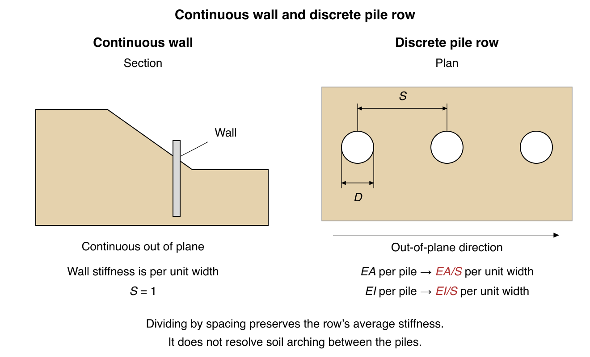
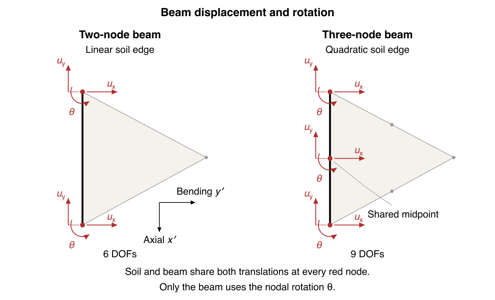
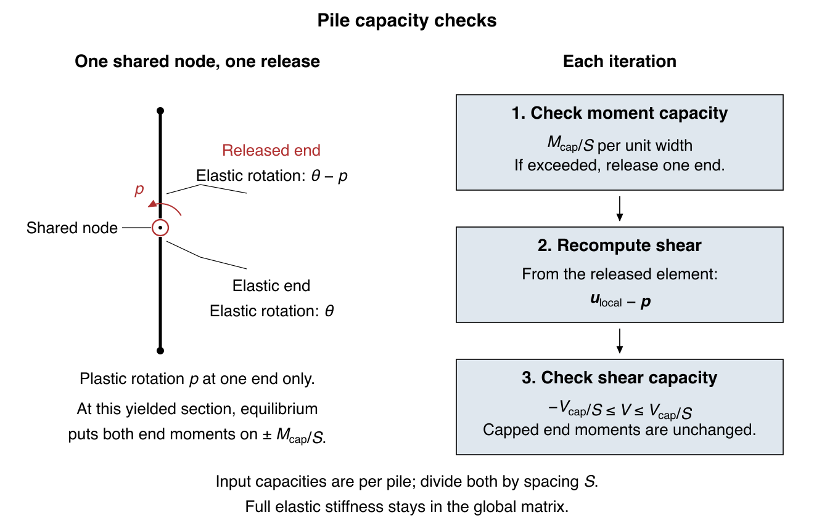
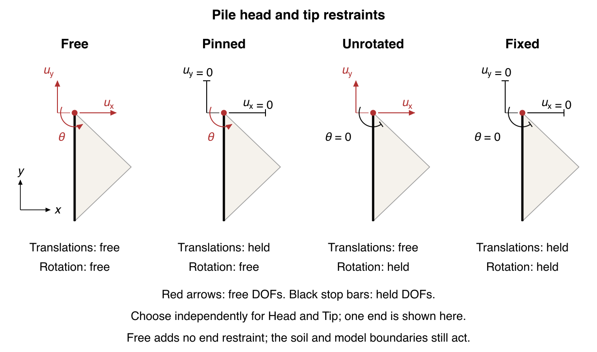
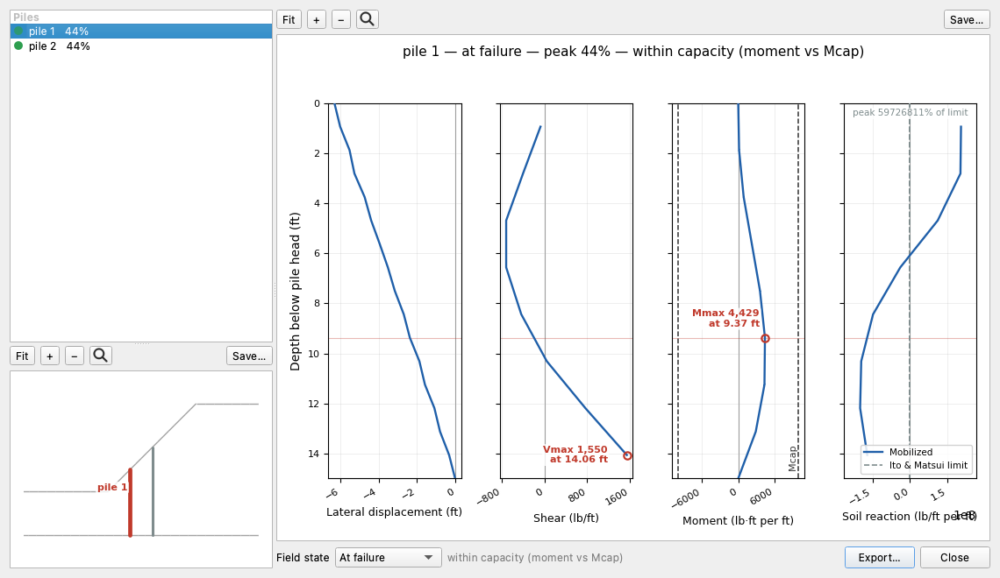

# Piles and Concrete Piers in Finite Element Analysis

A pile or concrete pier is modeled as a chain of Euler-Bernoulli beam elements embedded in the soil mesh and sharing its nodes. [Limit equilibrium](../lem/piles.md) applies one pile force, $H$, entered or computed by Ito & Matsui; here no pile force is applied: the beam carries axial force, shear and bending moment, in tension or compression, as the soil deforms around it, up to the structural capacities $V_{\text{cap}}$ and $M_{\text{cap}}$ where they are given.

## Applicability: Continuous Walls and Discrete Pile Rows

A two-dimensional beam element is a plane-strain member. It is continuous out of plane, and its $EA$ and
$EI$ are stiffnesses per unit width of wall. That is an exact description of one kind of structure and an
idealization of another, and the difference determines which of XSLOPE's two analyses suits a problem.

**Continuous walls.** Sheet pile, diaphragm and secant pile walls are continuous out of plane, so the beam
represents them directly, with $S = 1$. The element is checked against closed-form beam theory in
`test/beam_element_check.py`, and a wall analysis is compared with GeoStudio's in
[the SIGMA/W wall benchmark](../verification/geostudio.md#sigmaw-wall).

**Discrete pile rows.** A row of separate piles is not continuous out of plane. Soil arches onto the piles and,
at wide enough spacing, moves between them, so the load a pile attracts is set by a three-dimensional mechanism.
Dividing $EA$ and $EI$ by the spacing (see [Assembly](#assembly)) smears one pile's stiffness over a unit width
of wall. That reproduces the row's average stiffness; it does not reproduce the arching, and shared-node coupling
does not reproduce the slip that develops on each pile's surface (see
[Pile-Soil Interface and Load Transfer](#pile-soil-interface-and-load-transfer)).

The wall section and pile-row plan below show what the spacing conversion represents.

{width=880px}

The row's center-to-center spacing $S$, not the pile diameter $D$, divides its axial and bending stiffnesses to give stiffness per unit wall width.

On the one pile-stabilized slope with a published three-dimensional answer (Cai & Ugai, 2000), the
plane-strain beam gives a factor of safety 16.0% above it with a free head and 9.9% above it with the head
rotation restrained ([VP106 finite-element diagnostic](../verification/rocscience.md#vp106-fem)). For a
discrete row, use limit equilibrium with the Ito & Matsui (1975) force, which models the three-dimensional
mechanism; use the finite element analysis for a continuous wall, and for a pile row only as a study of
stiffness and member forces. [LEM vs. FEM pile modeling](../lem/piles.md#lem-vs-fem-pile-modeling) sets out
the choice and compares both engines on the pile sample.

## Comparison with Reinforcement (Truss) Elements

The FEM models flexible reinforcement as **truss elements** (axial only, tension only) on the same nodes. Piles use much of the same formulation but differ in key ways:

| Property | Reinforcement (Truss) | Pile (Beam) |
|----------|----------------------|-------------|
| Axial stiffness | $EA/L$ | $EA/L$ |
| Lateral stiffness | None | $12EI/L^3$ (from bending) |
| Compression | Not allowed (zeroed via body-force corrections) | Allowed |
| Orientation | Inclined (along reinforcement) | Vertical or battered |
| Failure mode | Tension rupture / pullout | Shear / bending capacity (plastic hinge) |
| DOFs per node | 2 (translational only) | 3 (translational + rotational) |

For details on the truss element formulation used for reinforcement, see [Soil Reinforcement](../reinforcement/fem.md).

## Beam Element Formulation

XSLOPE uses the standard Euler-Bernoulli beam element with 3 DOFs per node ($u_x$, $u_y$, $\theta$). On a linear soil mesh the element has two nodes, giving a 6×6 element stiffness matrix in local coordinates (beam axis along local $x$):

>$\mathbf{K}_{\text{local}} = \begin{bmatrix} \frac{EA}{L} & 0 & 0 & -\frac{EA}{L} & 0 & 0 \\ 0 & \frac{12EI}{L^3} & \frac{6EI}{L^2} & 0 & -\frac{12EI}{L^3} & \frac{6EI}{L^2} \\ 0 & \frac{6EI}{L^2} & \frac{4EI}{L} & 0 & -\frac{6EI}{L^2} & \frac{2EI}{L} \\ -\frac{EA}{L} & 0 & 0 & \frac{EA}{L} & 0 & 0 \\ 0 & -\frac{12EI}{L^3} & -\frac{6EI}{L^2} & 0 & \frac{12EI}{L^3} & -\frac{6EI}{L^2} \\ 0 & \frac{6EI}{L^2} & \frac{2EI}{L} & 0 & -\frac{6EI}{L^2} & \frac{4EI}{L} \end{bmatrix}$

where $E$ is Young's modulus, $A$ is the cross-sectional area, $I$ is the moment of inertia, and $L$ is the element length.

### Three-node elements on a quadratic mesh

On a quadratic soil mesh (tri6, quad8, quad9) the edge a beam element lies on carries a midside node as well as its
two corners, and the beam element stands on all three. It then has 9 DOFs — $u_x$, $u_y$ and $\theta$ at every one of
its nodes — and its local stiffness is 9×9 (see [Quadratic elements](mesh.md#quadratic-elements)).

The deflection of the three-node element is the quintic that matches a value and a slope at all three of its nodes —
six conditions on six coefficients. That keeps Euler-Bernoulli exactly: the bending block is
$EI \int H_i'' H_j'' \, dx$ over the same shape functions, and the quintic contains both the cubic and the quartic
deflected shapes the classical beam solutions take, so the element reproduces them exactly. Axial action is the
quadratic bar over the same three nodes. Bending and axial stay uncoupled, as on the two-node element.

Unlike the two-node element, the three-node element gives the distributed load along its own length. A cubic
deflection has a zero fourth derivative everywhere, so a chain of two-node elements can report the soil reaction only
as the shear step between one element and the next; the quintic's fourth derivative is a genuine linear distribution
along the element, and $EI$ times it is the reaction that element is carrying. Because a fourth derivative magnifies small unevenness in the nodal loads, each element's reaction is reported as the value, at its own depth, of a least-squares line through it and its two neighbors.

### Mixed DOF System

The 2D soil elements have 2 DOFs per node ($u_x$, $u_y$), while beam elements require 3 DOFs per node ($u_x$, $u_y$, $\theta$). XSLOPE uses a **mixed DOF system**: nodes belonging to pile elements are assigned 3 DOFs, and all other nodes retain 2 DOFs. A DOF offset array maps each node index to its starting position in the global displacement vector.

The figure shows a vertical three-node beam element on the edge of a quadratic soil element, with the degrees of freedom at each of its nodes:

{width=640px}

The midpoint the beam shares with the soil carries a rotation as the two ends do, which gives the element its nine degrees of freedom.

### Coordinate Transformation

The local stiffness matrix is transformed to global coordinates using a rotation matrix — 6×6 for a
two-node beam, 9×9 for a three-node beam:

>$\mathbf{K}_{\text{global}} = \mathbf{R}^T \, \mathbf{K}_{\text{local}} \, \mathbf{R}$

where $\mathbf{R}$ is a block-diagonal rotation matrix with $\cos\alpha$, $\sin\alpha$ the direction cosines of the pile axis for translational DOFs and identity for rotational DOFs.

For a **vertical pile** ($\cos\alpha = 0$, $\sin\alpha = -1$), the axial stiffness $EA/L$ acts in the $y$-direction (vertical) and the lateral stiffness $12EI/L^3$ acts in the $x$-direction (horizontal) — exactly the behavior needed for resisting lateral slope movement.

### Assembly

Each pile's $EA$ and $EI$ are divided by its center-to-center spacing $S$ before assembly, so the beam carries the
row's stiffness per unit width of section; $V_{\text{cap}}$ and $M_{\text{cap}}$ are divided by $S$ the same way.
The global stiffness matrix combines contributions from all element types:

>$[\mathbf{K}]_{\text{global}} = \sum_{\text{soil}} [\mathbf{K}_e]_{\text{soil}} + \sum_{\text{truss}} [\mathbf{K}_e]_{\text{truss}} + \sum_{\text{beam}} [\mathbf{K}_e]_{\text{beam}}$

The total DOF count is $2 \times n_{\text{all nodes}} + n_{\text{pile nodes}}$: every node has two
translations, and each pile node has one extra rotation. Pile nodes are included in the all-node count.

## Mesh Generation

A pile line is meshed like any constraint line: its two endpoints from the `piles` sheet are embedded in the mesh,
element edges follow the line, and its beam elements are those edges
([Reinforcement and pile lines](mesh.md#reinforcement-and-pile-lines)).

## Force and Moment Computation

At each viscoplastic iteration, the forces and moments in each beam element are computed from its nodal
displacements — 6 DOFs on a two-node beam, 9 on a three-node beam. The global displacements are transformed
to local coordinates using the rotation matrix $\mathbf{R}$. In local coordinates $u_1, u_2$ are the axial
displacements of the element's end nodes, $v_1, v_2$ their transverse displacements and $\theta_1, \theta_2$
their rotations:

>**Axial force**: $T = \dfrac{EA}{L} (u_2 - u_1)$

>**Shear force**: $V = \dfrac{12EI}{L^3}(v_1 - v_2) + \dfrac{6EI}{L^2}(\theta_1 + \theta_2)$ (two-node element; on a three-node element the shear is the quintic deflection's at the element center)

>**Bending moments** at nodes 1 and 2: $M_1, M_2 = \mathbf{K}_{\text{local}}[\text{rows 3 and 6}] \cdot \mathbf{u}_{\text{local}}$ (the two rotation rows)

## Structural Capacity Checks

Both capacities are imposed as a body-load correction, as soil yield and a bar's tension cap are. The stiffness matrix $\mathbf{K}$ keeps the member's full elastic stiffness; the correction $\mathbf{c}$ is the part of the elastic action above the capacity; the solver solves $\mathbf{K}\mathbf{u} = \mathbf{F} + \mathbf{c}$, so the member carries $\mathbf{K}\mathbf{u} - \mathbf{c}$, which is the capacity where the capacity is reached. The pile actions XSLOPE reports are $\mathbf{K}\mathbf{u} - \mathbf{c}$.

### Moment Capacity ($M_{\text{cap}}$) — Plastic Hinge

A moment capacity is a plastic hinge. Once an element end's moment reaches $M_{\text{cap}}/S$, the per-unit-width capacity, that end rotates by a plastic rotation $\mathbf{p}$ in addition to the nodal rotation, so the element delivers

>$\mathbf{s} = \mathbf{K}_{\text{local}} (\mathbf{u}_{\text{local}} - \mathbf{p})$

and $\mathbf{K}_{\text{local}}\,\mathbf{p}$ is added to the load vector, on the element's translational rows as well as its rotational ones. $\mathbf{p}$ comes from one small linear solve on the rotational block of $\mathbf{K}_{\text{local}}$ that puts each hinged end exactly on the capacity. Releasing one end raises the moment at the other, so the set of hinged ends is grown until it is stable. At an interior node, where two element ends meet, only one end takes the plastic rotation; equilibrium at the node puts the other on the capacity with the opposite sign. The released shaft deflects further, and the factor of safety falls.

### Shear Capacity ($V_{\text{cap}}$)

When $V_{\text{cap}}$ is provided, the shear in each beam element is compared against $V_{\text{cap}} / S$. Where the elastic shear exceeds it, the correction

>$\Delta V = V - \text{sign}(V) \cdot V_{\text{cap}}/S$

is applied on the shear's own internal-force pattern — $+1$ and $-1$ on the transverse rows of the element's two end nodes, rotated into global coordinates. The element then delivers exactly $V_{\text{cap}} / S$ and no more.

The hinge check runs first; the shear is then read off the released element:

{width=880px}

The third step caps the shear without changing the capped end moments.

### Yield reporting

An element can yield in shear, in bending, or in both, and the plastic rotation at each end node is carried alongside the actions. The summary output reports which elements have yielded and by which mechanism.

## Head and Tip Fixity

Each end of a pile carries its own boundary condition. The **Head** column in the `piles` sheet sets the condition at the top node (highest $y$) and the **Tip** column sets it at the bottom node (lowest $y$). An end has two things that can be held, its translation and its rotation, so each column offers the same four settings, with the same meaning at either end:

| Setting | Translation | Rotation | At the head | At the tip |
|---|---|---|---|---|
| **free** (default) | free | free | no structural connection at the top | floating in the soil, or resting on the model boundary |
| **pinned** | held | free | tie-rods or anchors holding the head in place | bearing on a hard stratum inside the mesh |
| **unrotated** | free | held | a cap beam tying the heads together | rarely meaningful; offered so the two lists match |
| **fixed** | held | held | cap beam and anchors | socketed into rock |

The four choices below act on the same three nodal degrees of freedom at either end.

{width=880px}

Red arrows mark the degrees of freedom an end leaves free, and black stop bars mark those it holds.

Cai & Ugai (2000) define the same four conditions, calling pinned "hinged".

Which tip condition is right depends on where the pile ends. A shaft that continues well below the slip surface is restrained by the soil it passes through, and leaving the tip free is correct. A shaft whose bottom node lands on a fixed boundary is already pinned by that boundary — its translations are held there but its rotation is not, so the pile swings about its toe — and `pinned` changes nothing; `fixed` is the socketed case. A shaft that ends on a hard stratum inside the mesh needs `pinned`, since the soil elements below it would otherwise let the tip move.

Neither column has any effect on LEM analysis.

## SSRM Treatment

Strength reduction leaves the pile's $E$, $I$, $A$, $V_{\text{cap}}$ and $M_{\text{cap}}$ unchanged, as it does every
[structural property](overview.md#structural-elements).

## Pile-Soil Interface and Load Transfer

A pile's beam elements stand on the nodes of the soil element edges they lie on, the midside node included on a
quadratic mesh, so pile and soil have the same displacement at every node. The interface is perfectly bonded: the
shaft cannot slip, and no interface strength limits the shear passed between pile and soil; only the soil's yield
and the pile's $V_{\text{cap}}$ and $M_{\text{cap}}$ do. XSLOPE has no interface element along a
pile shaft; [interface elements](joints.md) apply only to joint lines and jointed reinforcement lines.

**Passive (stabilizing) piles.** The soil pushes laterally on the pile, and the soil yielding around it limits the
load. The bond overstates the pile's resistance and makes the factor of safety unconservative; the excess measured
under [Applicability](#applicability-continuous-walls-and-discrete-pile-rows) includes this effect together with the
plane-strain smear.

**Load-bearing piles.** An axial load at the head reaches the soil in proportion to the stiffness of the beam and of
the soil elements at each node, not through skin friction and end bearing. The pile cannot slip or punch through,
and the depth at which the load is transferred depends on the mesh. For a pile near a slope that also carries a
structural load, model the pile as a passive beam and bracket the load as described under
[Load-bearing piles](../lem/piles.md#load-bearing-piles): once as a surcharge on the `dloads` sheet, once without
it.

## Input Parameters

Pile properties for FEM analysis are specified in the `piles` sheet of the input template. The FEM-relevant columns are:

| Column | Field | Description |
|--------|-------|-------------|
| C-F | $(x_1, y_1)$, $(x_2, y_2)$ | Pile geometry; the higher end is the head |
| I | $D$ | Pile diameter — used to compute $I$ and $A$ if not provided |
| J | $S$ | Center-to-center spacing — scales $EI$ and $EA$ by $1/S$ for per-unit-width |
| K | $V_{\text{cap}}$ | Shear capacity per pile (force units). Blank = no limit. |
| L | $M_{\text{cap}}$ | Moment capacity per pile (force × length units). Blank = no limit. |
| M | $E$ | Young's modulus of pile material |
| N | $I$ | Moment of inertia of pile cross-section |
| O | $Area$ | Cross-sectional area of pile cross-section |
| P | Head | Pile head (top node) restraint: **free** (default), **pinned**, **unrotated** or **fixed** |
| Q | Tip | Pile tip (bottom node) restraint: **free** (default), **pinned**, **unrotated** or **fixed** — the same four as Head |

If $D$ is provided and $I$/$Area$ are omitted, a solid circular section is assumed:

>$A = \dfrac{\pi D^2}{4}, \qquad I = \dfrac{\pi D^4}{64}$

Columns G and H, the pile force $H$ and **Appl**, are not used by the finite element analysis. See [LEM Piles](../lem/piles.md) for typical material property values and structural capacities.

## Inspecting the Results

The FEM results view colors pile elements by the shear they carry. The **1D Details…** panel, described under
[Inspecting the results](../reinforcement/fem.md#inspecting-the-results) on the reinforcement page, lists each member with a
utilization badge and draws a selected pile's profiles; piles whose rows share a label are numbered so they can be
told apart.

The screenshot below is a strength reduction run on the two pile rows of [LEM-12](../tutorials/lem12_piles.md),
used again in [FEM-4](../tutorials/fem04_piles.md), shown at the mechanism it developed:

{width=1000}

Four panels share one depth axis, pile head at the top:

- **Lateral displacement** — the component of nodal displacement normal to the pile axis.
- **Shear** — the element shear $V$, after the $V_{\text{cap}}$ limit of the
  [structural capacity checks](#structural-capacity-checks) is applied, with the largest marked and its depth
  annotated.
- **Moment** — the bending moment, assembled from the beam elements' end moments into a continuous profile, with
  the maximum marked and its depth annotated. The moment is zero at a free head and a free toe, which is a useful
  check on the profile.
- **Soil reaction** — the lateral resistance the ground mobilizes per unit length of pile, computed as described
  under [Three-node elements on a quadratic mesh](#three-node-elements-on-a-quadratic-mesh) (on a linear mesh, as
  the shear step between consecutive elements). The Ito & Matsui limiting resistance
  $p(z) = (c A_1 + \gamma z A_2)/S$ is drawn dashed beside it, where $c$ and $\gamma$ are the cohesion and unit
  weight of the soil at depth $z$ below the pile head, and $A_1$ and $A_2$ are the Ito & Matsui coefficients from
  $D$, the clear spacing $S - D$ and the soil's friction angle $\phi$, the same coefficients the LEM uses for its
  passive-pile force (see [LEM Piles](../lem/piles.md)). The panel states the peak fraction of that limit. The
  limiting resistance grows with depth and is often far above anything mobilized, in which case the panel is
  scaled to the mobilized profile and the limit runs off the sides. For a pile far enough inside its
  working range that the envelope does not reach the panel at all, it is not drawn, that panel carries no legend,
  and the note that states the peak fraction gives how far off the envelope is. The envelope does not change with
  the [Field state](../reinforcement/fem.md#inspecting-the-results) setting.

Capacity lines appear only where the model declares a capacity: $V_{\text{cap}}$ and $M_{\text{cap}}$ are inputs,
and no substitute is computed from an assumed section — the pile inputs carry force capacities, not section
moduli. Where the model does supply $D$ and $S$ but no structural capacities, the utilization badge falls back to
the mobilized soil reaction against the Ito & Matsui limit; with neither, the badge stays neutral rather than
reporting a ratio the model does not support.

The pile panels do not mark where the shear band crosses the pile. A pile is loaded along its whole length by
the soil moving past it, and its moment peaks where the shear passes through zero, which is generally some
distance from where a band crosses it; the crossing is shown on the shear-strain field figure. The title states
which field the profiles were taken from: the mechanism an SSRM run captured, or the shear strain in a section that
is standing.

## References

Cai, F., & Ugai, K. (2000). Numerical analysis of the stability of a slope reinforced with piles. *Soils and Foundations*, 40(1), 73-84. [doi:10.3208/sandf.40.73](https://doi.org/10.3208/sandf.40.73)

Ito, T., & Matsui, T. (1975). Methods to estimate lateral force acting on stabilizing piles. *Soils and Foundations*, 15(4), 43-59.
