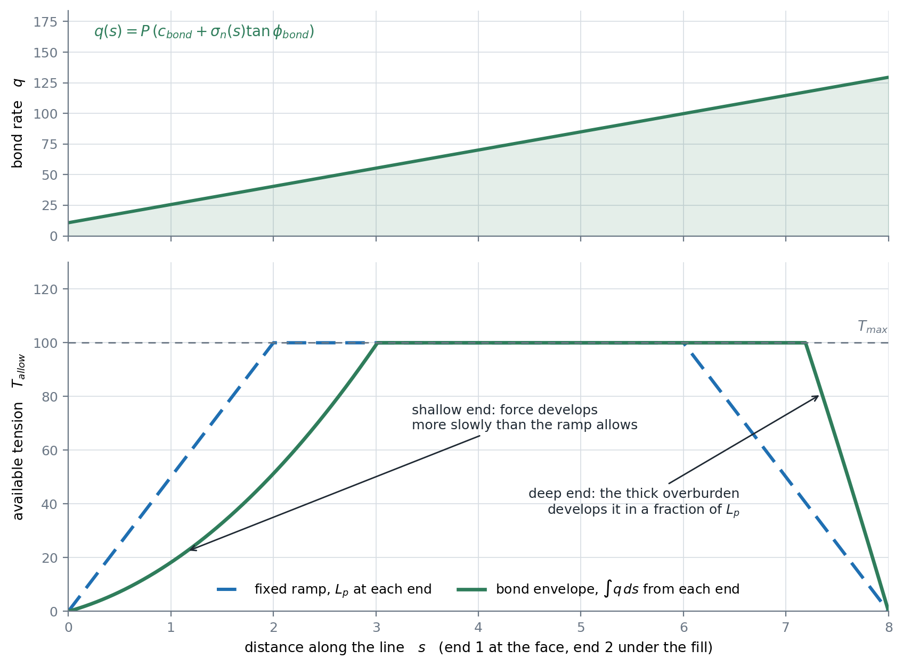

# Soil Reinforcement in Finite Element Analysis

The integration of soil reinforcement elements such as geotextiles, soil nails, and ground anchors into finite element slope stability analysis represents a significant advancement in modeling stabilized slopes. These reinforcement systems fundamentally alter the stress distribution and failure mechanisms within slopes, requiring sophisticated modeling approaches to capture their beneficial effects accurately (Duncan & Wright, 2005).


The modeling of reinforced slopes presents unique challenges because the reinforcement elements typically have dramatically different mechanical properties compared to the surrounding soil. Reinforcement elements are usually much stiffer in tension and often have negligible compressive strength, creating a highly anisotropic composite material that requires specialized finite element formulations.

## Truss Element Approach

While there are numerous ways to simulate soil reinforcement in the finite element method including the equivalent
force method and interface element modeling, the most straightforward method involves representing reinforcement elements as one-dimensional truss elements embedded within the two-dimensional soil continuum. These truss elements are characterized by their axial stiffness $EA/L$, where $E$ is the elastic modulus of the reinforcement material, $A$ is the cross-sectional area, and $L$ is the element length.

This approach is particularly effective for modeling geosynthetic reinforcement, soil nails, and tie-back anchors.
The truss elements can only carry tension loads up to a specified tensile strength limit $T_{max}$, beyond which
they either yield plastically to a residual strength $T_{res}$, or fail completely. The inability to carry compression loads
accurately
reflects the behavior of flexible reinforcement materials like geotextiles and ensures that the reinforcement cannot resist compressive buckling. The truss elements are oriented along the centerline of the physical reinforcement and connected to the surrounding soil elements through shared nodes. This connection ensures that the reinforcement participates in the overall deformation pattern of the slope while contributing its tensile resistance to improve stability.

Truss elements are incorporated into the XSLOPE finite element mesh by passing the geometry of the reinforcement
lines from the input template to the mesh generation process. The reinforcement lines are discretized into multiple
truss elements based on the specified mesh density (target_size). The 1D elements are fully integrated with the 2D
elements - each 1D element corresponds to the edge of two adjacent 2D elements and both the 1D and 2D elements share
the same nodes. The 1D elements have their own set of material properties corresponding to the properties of the
corresponding reinforcement lines input by the user and include $T_{max}$, $T_{res}$, $E$, and cross-sectional area
$A$.

Only the two end nodes of each 1D element are used for computing truss stiffness and axial forces. When the mesh uses
quadratic (8-node) 2D elements, the 1D elements may have a mid-side node shared with the adjacent 2D elements. This
mid-node participates in the 2D element shape functions for displacement interpolation but is ignored for the truss
element formulation. A 2-node linear truss element is exact for a prismatic bar with constant axial stiffness, so
the quadratic interpolation adds no physical fidelity for the 1D element.

The meshing algorithms used in XSLOPE, including the integration of 1D and 2D elements for problems involving soil
reinforcement are documented in the [Mesh Generation](mesh.md) page.

## Mathematical Formulation

**Truss Element Stiffness Matrix:** Each 1D truss element contributes to the global stiffness matrix through its element stiffness matrix. For a truss element with nodes $i$ and $j$, the element stiffness matrix in local coordinates is:

>>$[K_e]_{local} = \dfrac{AE}{L} \begin{bmatrix} 1 & -1 \\ -1 & 1 \end{bmatrix}$

where $A$ is the cross-sectional area, $E$ is the elastic modulus, and $L$ is the element length.

**Coordinate Transformation:** The local stiffness matrix must be transformed to global coordinates using the transformation matrix $[R]$:

>>$[K_e]_{global} = [R]^T [K_e]_{local} [R]$

The transformation is built from $\psi$, the inclination of the reinforcement line to the horizontal — the same
angle the LEM formulation uses for the direction of an axial reinforcement force:

>>$[R] = \begin{bmatrix} \cos\psi & \sin\psi & 0 & 0 \\ 0 & 0 & \cos\psi & \sin\psi \end{bmatrix}$

**Assembly Process:** The global stiffness matrix combines contributions from both 2D soil elements and 1D truss elements:

>>$[K]_{global} = \sum_{soil} [K_e]_{soil} + \sum_{truss} [K_e]_{truss}$

**Force Vector Assembly:** The global force vector includes both soil body forces and any applied forces on reinforcement:

>>$\{F\}_{global} = \{F\}_{soil} + \{F\}_{reinforcement}$

## Force Behavior and Failure Modes

The forces and failure modes in 1D truss elements are analyzed in an iterative fashion. Each truss element
has a maximum allowable tensile capacity $T_{allow}$, derived from the user-specified reinforcement parameters,
and optionally a residual tensile capacity $T_{res}$. The axial force in each element is calculated as
$T = (AE/L) \cdot \delta$, where $\delta$ is the element elongation (the component of relative nodal displacement
along the element axis).

The global stiffness matrix carries each bar's *full elastic* stiffness, so $K u$ always contains the uncapped
elastic force. The capacity is imposed the same way plasticity is imposed on the soil — through a viscoplastic
body load equal to the part of the elastic force the element **cannot** carry:

>>$f_{body} = (T - T_{true}) \cdot [-\cos\psi,\; -\sin\psi,\; +\cos\psi,\; +\sin\psi]$

where $T_{true}$ is the force the bar can actually deliver: the elastic $T$ clipped into $[0, T_{cap}]$. Because
equilibrium is solved as $K u - f_{body}$, this leaves exactly $T_{true}$ in the bar. (The sign matters. Adding
the *opposite* correction makes an overloaded bar carry $2T - T_{cap}$ — it gets **stiffer** the more it is
overloaded, an "anti-cap" under which a reinforced slope can never be driven to failure and the SSR factor is
insensitive to $T_{allow}$ altogether.)


Which of the three post-peak branches a bar follows is decided entirely by the $T_{res}$ column of its
reinforcement line.

**Elastic-Perfectly-Plastic Model (the default):**

If $T_{res}$ is left **blank**, the bar yields at $T_{allow}$ and holds it indefinitely while the surrounding soil
keeps straining. This is the default because it is what the mainstream FEM codes do (PLAXIS geogrids and anchors
are elastoplastic with a maximum axial force), and it is what published reinforced-slope analyses assume.

A blank $T_{res}$ means *no post-peak drop* — it does **not** mean zero.

**Peak-Residual Model:**

Entering a value for $T_{res}$ turns on post-peak behavior: an element that yields drops from $T_{allow}$ to
$T_{res}$. Appropriate for ductile materials where the published capacity is a peak rather than a plateau; typical
residual ratios for geosynthetics are $T_{res}/T_{allow} = 0.3-0.7$.

The drop is decided **only on a converged equilibrium state**, never inside the viscoplastic iteration. This
matters: the first iterate of a viscoplastic solve is the elastic predictor, whose bar forces overshoot badly
before the soil sheds load into them, so a mid-iteration trigger would condemn bars for a transient that never
physically existed, and the answer would depend on the path the solver happened to take. Instead the solver
converges with the bars capped at $T_{allow}$, then drops any bar whose elastic demand exceeded its capacity to
$T_{res}$ and re-solves. Shedding that load can push neighbors over, so the process repeats until the softened set
stops growing — a genuine progressive-failure fixed point, and one that is independent of the solution path.

**Complete (Brittle) Failure Model:**

Setting $T_{res} = 0$ explicitly is the brittle case: a yielding element ruptures and carries nothing afterwards.
Appropriate for brittle materials (some steel cables, fiber reinforcement).

!!! warning "Post-peak behavior makes the SSR factor mesh-sensitive"
    Once $T_{res} < T_{allow}$ actually engages, the reinforcement is strain-**softening**. A softening system in
    an unregularized continuum has no length scale to arrest localization, so the computed factor of safety can
    drift with mesh refinement instead of converging, and the SSRM bracket becomes less crisp. This is physics, not
    a numerical defect — but it means $T_{res}$ is best treated as a forensics/back-analysis parameter rather than
    a design default. Leave it blank unless you specifically intend to model post-peak strength loss.

**Pullout Failure Model:**

For each reinforcement line, it is assumed that the tension force in the reinforcement is zero at the two ends and increases linearly with distance along the line as frictional resistance between the reinforcement and the surrounding soil develops. Full tension force develops over a pullout distance, $L_p$.

- Pullout failure may occur in elements where the embedment length is less than the pullout length $L_p$<br>
- The available strength is limited by pullout resistance rather than material strength<br>
- For elements at distance $d$ from the reinforcement end where $d < L_p$:<br>
  >>$T_{available} = T_{allow} \times \frac{d}{L_p}$<br>
- Pullout failure is typically sudden and complete (no residual capacity)<br>
- Progressive pullout can occur as elements near the ends fail sequentially

**Tension-Only Behavior:**

Truss elements are restricted to carry only tension forces. This is implemented through body-force corrections within the viscoplastic iteration loop:

- After each iteration, the axial force in each element is computed from the current displacement field<br>
- If compression develops ($T < 0$), a corrective body force is applied that cancels the compressive force<br>
- The element remains in the stiffness matrix at full elastic stiffness; the correction enters through the load vector<br>
- This approach is consistent with the viscoplastic initial-stiffness method used for soil elements, where the stiffness matrix is factored once and all nonlinearity is driven through load corrections

## Integration with Viscoplastic Iteration

The 1D truss element nonlinearity (tension-only behavior, capacity limits, and failure) is handled through body-force
corrections within the [Griffiths & Lane (1999)](https://doi.org/10.1680/geot.1999.49.3.387) viscoplastic iteration loop, using the same initial-stiffness approach
that governs the 2D soil elements. The key principle is that the global stiffness matrix $[K]$ is assembled once with
the full elastic stiffness of all elements (both 2D soil and 1D truss) and pre-factored for efficient repeated solves.
All nonlinear behavior is then driven entirely through corrections to the right-hand-side load vector.

**Assembly:** The global stiffness matrix includes contributions from both 2D soil elements and 1D truss elements:

>>$[K]_{global} = \sum_{soil} [K_e]_{soil} + \sum_{truss} [K_e]_{truss}$

This matrix is factored once (via sparse LU decomposition) and reused for all viscoplastic iterations.

**Iteration procedure:** At each viscoplastic iteration, after solving for the updated displacement field $\{u\}$:

1. For each 1D truss element, compute the axial force from the current displacements:
>>$\delta = (u_{x,j} - u_{x,i})\cos\psi + (u_{y,j} - u_{y,i})\sin\psi$
>>$T = \dfrac{AE}{L} \cdot \delta$

2. Determine whether a correction is needed:
>>- If $T < 0$ (compression): set $\Delta T = -T$ (cancel the compressive force entirely)
>>- If $T > T_{allow}$ and the element has not previously failed: mark the element as failed and set $\Delta T = T_{res} - T$
>>- If $T > T_{res}$ and the element has previously failed: set $\Delta T = T_{res} - T$
>>- Otherwise: no correction ($\Delta T = 0$)

3. Convert the axial force correction to equivalent nodal forces and add to the load vector:
>>$\{F\}_{correction} = \Delta T \begin{Bmatrix} -\cos\psi \\ -\sin\psi \\ \cos\psi \\ \sin\psi \end{Bmatrix}$

These corrections are added to the same load vector that receives the soil viscoplastic strain corrections ($[B]^T [D] \{\varepsilon_{vp}\}$). The factored stiffness matrix then solves the corrected system, and the process repeats until convergence.

**Failure irreversibility:** Once an element is marked as failed (having exceeded $T_{allow}$), it remains failed for all subsequent iterations within that analysis. Its effective capacity permanently drops from $T_{allow}$ to $T_{res}$. This models the irreversible nature of material yielding or pullout failure.

## Strength Reduction and Reinforcement

In the Shear Strength Reduction Method (SSRM), only the soil shear strength parameters $c$ and $\tan\phi$ are reduced
by the strength reduction factor $F$. The reinforcement properties ($T_{max}$, $T_{res}$, $E$, $A$) are held constant
throughout the SSRM bisection. The resulting factor of safety represents the margin of safety in the soil strength,
given the structural reinforcement as-designed. This follows standard practice (Duncan & Wright, 2005) where
reinforcement capacity is treated as a structural property independent of the soil strength reduction.

This also means that the truss element contributions to the global stiffness matrix do not change between SSRM
bisection steps — only the soil yield parameters change — so the same pre-factored stiffness matrix approach remains
efficient.

## Reinforcement Line Input Parameters and Element Properties

In the Excel input template used by XSLOPE, the user can define up to 20 reinforcement lines by entering the reinforcement line geometry and properties into the lines of a table. Each row of the table includes the following:

| Item | Description |
|:----:|-------------|
| x1, y1 | The x and y coordinates of the left end of the line |
| x2, y2 | The x and y coordinates of the right end of the line |
| Tmax | Maximum allowable tensile force |
| Tres | Residual tensile force after yield. **Leave blank for no post-peak drop** (elastic-perfectly-plastic — the usual choice, and the default). An explicit `0` means brittle rupture. Used by the FEM only. |
| Lp1  | The pullout length on the left side |
| Lp2  | The pullout length on the right side |
| E    | The modulus of elasticity of reinforcement material  |
| Area | The cross-sectional area of the reinforcement material  |

The units for E and Area need to be compatible with each other and with the other weight and length units used. For
metric units, E should be in $kPa$ and Area should be in $m^2$. For English units, E should be in $psf$ and Area
should be in $ft^2$. Alternately, E could be in $psi$ as long as Area is in $in^2$.

### Element Discretization and Capacity Assignment

A separate pullout length (Lp) is used for each end since each end may be embedded in a separate soil with different shear resistance values.

During mesh generation, each reinforcement line is discretized into multiple truss elements based on the specified mesh density. The discretization process follows these steps:

1. **Material Property Assignment**: Each truss element along the line receives the same material properties:

>>Cross-sectional area: $Area$<br>
Elastic modulus: $E$<br>
Element stiffness: $K_e = AE/L$ (where L varies based on element length)<br>

2. **Tensile Capacity Assignment**: Each truss element is assigned an allowable $T_{allow}$ and residual $T_{res}$ tensile capacity based on the following logic:

>>For an element whose center is at distance $d$ from the nearest reinforcement end, where $L_p$ is the pullout length corresponding to that end ($L_{p1}$ if nearest to end 1, $L_{p2}$ if nearest to end 2):
>>
>>$T_{allow} = \begin{cases}
T_{max} \cdot \dfrac{d}{L_p} & \text{if } d < L_p \\
T_{max} & \text{if } d \geq L_p
\end{cases}$

>>
>>$T_{res} = \begin{cases}
\text{unset (no post-peak drop)} & \text{if } T_{res}\ \text{is blank in the input} \\
0 & \text{if } d < L_p \\
T_{residual} & \text{if } d \geq L_p
\end{cases}$

This approach ensures that elements near the reinforcement ends have reduced capacity (starting from zero at the ends), while elements beyond the pullout length carry the full design strength. The linear variation within the pullout length reflects the gradual development of pullout resistance through interface friction. Since each end of a reinforcement line may be embedded in a different soil with different shear resistance, the appropriate pullout length ($L_{p1}$ or $L_{p2}$) is selected based on which end is nearest to the element centroid.

The residual capacity is only assigned at all when the user has entered a $T_{res}$ for the line. Where post-peak behavior *is* switched on, an element inside a pullout ramp ($d < L_p$) takes a residual of zero, because pullout failure is assumed to be sudden and complete; beyond the ramp ($d \geq L_p$) the element takes the user's residual strength. If the line has end anchorage, the hardware survives soil/grout failure up to its own capacity, so the residual there is $\min(T_{res}, T_{end})$ for the governing end.

### Axial Stiffness (EA)

The analysis depends only on the product $EA$ (the axial stiffness, sometimes called the tensile stiffness or $J$ in
geosynthetic specifications), not on $E$ and $A$ independently. Any combination of $E$ and $A$ that produces the same
$EA$ will give identical results. The axial stiffness controls how much the reinforcement must elongate before
mobilizing its tensile capacity:

>>$EA = \dfrac{T_{max}}{\varepsilon_{rupture}}$

where $\varepsilon_{rupture}$ is the strain at which the reinforcement reaches its ultimate tensile strength.

### Determining Reinforcement Line Pullout Lengths

The pullout length $L_p$ represents the distance from each end of the reinforcement over which the full tensile strength is mobilized. This variation captures the physical reality that pullout resistance must develop over a finite distance from the reinforcement ends through interface friction between the reinforcement and surrounding soil. This friction cannot be mobilized instantaneously but requires relative displacement to develop, creating the gradual strength buildup characteristic of all reinforcement systems. Pullout length can be estimated as follows:

**For Soil Nails:**
>>$L_p = \dfrac{T_{max}}{\alpha \pi D \sigma_n' \tan \phi_{interface}}$

where:<br>
>>$T_{max}$ = design tensile capacity of the nail<br>
$\alpha$ = surface roughness factor (0.5-1.0 for grouted nails)<br>
$D$ = effective nail diameter <br>
$\sigma_n'$ = average effective normal stress along the nail<br>
$\phi_{interface}$ = interface friction angle (typically 0.8-1.0 times soil friction angle)

**For Geotextiles:**
>>$L_p = \dfrac{T_{max}}{2 \alpha \sigma_n' \tan \phi_{interface}}$

where the factor of 2 accounts for friction on both sides of the geotextile.

These equations are a general guide that can be used to come up with reasonable estimates of Lp. Typical values are as follows:

|Reinforcement Type | Pullout Length $L_p$ (m) | Notes |
|-------------------|--------------------------|-------|
| **Soil Nails** | 1.5 - 3.0 | Depends on soil conditions and nail diameter |
| **Geotextiles** | 0.5 - 1.5 | Depends on normal stress and surface texture |
| **Geogrid** | 1.0 - 2.0 | Depends on aperture size and bearing resistance |

### Bond-Slip Load Transfer (optional)

The pullout ramp above uses a **fixed** development length $L_p$ at each end: the available
tension rises linearly from zero at the end to $T_{max}$ at a distance $L_p$, regardless of
where the element sits in the slope. This is a good first approximation, but the pullout
resistance actually depends on the **local normal stress** — a bar segment under deep
overburden can develop force faster than one near the surface, so the development length is
not really constant along the line.

The optional **bond-slip** model makes this explicit. Instead of a fixed $L_p$, it caps the
rate at which tension can develop along the bar by a stress-dependent Coulomb bond per unit
length:

>>$\dfrac{dT}{ds} \leq q(s) = P\,\big(c_{bond} + \sigma_n(s)\,\tan\phi_{bond}\big)$

where $P$ is the bonded perimeter per unit width (2 for a geotextile sheet — friction on both
faces; $\pi D / S$ for a nail of diameter $D$ at horizontal spacing $S$), $c_{bond}$ and
$\phi_{bond}$ are the interface cohesion and friction angle, and $\sigma_n(s)$ is the local
vertical overburden at the segment (integrated soil column above it — the same quantity used
for $r_u$ pore pressures). The available tension at a point is the smaller of the two one-sided
integrals of $q$ from each free end, still capped by the material axial capacity:

>>$T_{allow}(s) = \min\!\Big(T_{max},\; \int_{\text{end 1}}^{s} q\,ds',\; \int_{s}^{\text{end 2}} q\,ds'\Big)$



The two envelopes on a line whose overburden grows from the face into the fill. The bond envelope develops
tension more slowly than the fixed ramp where the line is shallow, and far faster where it is deeply buried.

In the constant-$\sigma_n$, single-soil limit this reduces exactly to the fixed double-ended
ramp with slope $q$ in place of $T_{max}/L_p$ — the two models agree where the overburden is
uniform, and diverge where it is not (a face-parallel geotextile whose upslope end lies under
a thick fill develops force faster there than the fixed ramp allows). The bond parameters map
directly onto a grouted-joint interface property in continuum codes (RS2's stress-dependent
joint, for example).

Bond-slip is a **run option**, off by default:

```python
solve_ssrm(fem_data, bond_slip={"geotextile 1": (0.0, 28.35, 2.0)})
#                                 line label     c_bond  φ_bond  P
```

The dictionary is keyed by reinforcement line **label** (a string), **1-based id** (an
integer), or `"*"` (every reinforcement line); each value is the tuple
`(bond_c, bond_phi_deg, perimeter)`. Only the named lines switch from the fixed $L_p$ ramp to
the bond envelope — unnamed lines keep their ramp. With `bond_slip=None` (the default) the
solve is bit-identical to the fixed-ramp path. The same option is available on `solve_fem`,
and from a verification tag as `bond_slip=<line>:<c>:<phi_deg>:<perimeter>` (semicolon-separated
for several lines). The invariant (off ≡ fixed ramp), the closed-form envelope, the axial cap,
and unknown-name rejection are asserted by `benchmarks/bondslip_guard.py`.

### Wished-in-Place Analysis and EA Selection

XSLOPE currently uses a **wished-in-place** approach: the entire slope (all soil layers and all reinforcement) is
assumed to exist in its final geometry, and gravity is applied in a single step. The reinforcement starts at zero
strain and zero force. Tension develops only through deformation that occurs during the gravity application and
subsequent SSRM strength reduction. This differs from reality, where reinforcement accumulates tension progressively
as each soil lift is placed during construction.

The wished-in-place approach is **conservative** — it underestimates the reinforcement contribution because it misses
the construction-induced pre-tension. However, for the reinforcement to provide meaningful stabilization in a
wished-in-place SSRM analysis, it must be stiff enough to develop significant force from the relatively small
displacements that occur near the incipient failure state. Low-stiffness reinforcement may undergo insufficient
strain during SSRM to mobilize its capacity, leading to an unrealistically low factor of safety.

Parametric studies show that the computed factor of safety increases with $EA$ and then plateaus above a threshold
stiffness, beyond which further increases in $EA$ have negligible effect. For typical reinforced slope geometries,
this plateau is reached at approximately $EA \approx 100$–$200 \times T_{max}$. Below approximately
$EA \approx 50 \times T_{max}$, the reinforcement may not mobilize enough force to significantly improve the factor
of safety in a wished-in-place analysis.

The following table provides recommended $EA$ values for wished-in-place SSRM analysis. These values are deliberately
at the stiffer end of the physical range for each material type, because the wished-in-place approach requires
sufficient stiffness to compensate for the absence of construction-induced pre-tension:

| Reinforcement Type | Recommended $EA/T_{max}$ | $\varepsilon_{rupture}$ | Notes |
|---|---|---|---|
| **Woven geotextiles** | $50$–$100$ | 1–2% | Use stiffer end for SSRM |
| **HDPE geogrids** | $50$–$100$ | 1–2% | Uniaxial, reinforcement grade |
| **PET geogrids** | $100$–$200$ | 0.5–1% | Higher stiffness than HDPE at same strength |
| **Steel strips** | $500$–$2{,}000$ | 0.05–0.2% | Very stiff, minimal elongation |
| **Soil nails (grouted)** | $1{,}000$–$5{,}000$ | 0.02–0.1% | Based on steel bar + grout composite |

### Typical E and Area Values

The following tables provide representative $E$ and $Area$ values for common reinforcement materials. These are
intended as starting points when manufacturer-specific data is not available. Any combination of $E$ and $Area$
producing the target $EA$ will give identical results.

**English Units:**

| Material | $E$ (psf) | $Area$ (ft$^2$/ft) | $EA$ (lb/ft) | $T_{max}$ (lb/ft) |
|---|---|---|---|---|
| Woven geotextile (light) | 500,000 | 0.01 | 5,000 | 100 |
| Woven geotextile (heavy) | 2,000,000 | 0.02 | 40,000 | 500 |
| HDPE geogrid | 2,000,000 | 0.03 | 60,000 | 800 |
| PET geogrid | 5,000,000 | 0.02 | 100,000 | 1,000 |
| Steel strip (galvanized) | 400,000,000 | 0.0003 | 120,000 | 5,000 |
| Soil nail (grouted, #8 bar) | 600,000,000 | 0.0006 | 360,000 | 15,000 |

**Metric Units:**

| Material | $E$ (kPa) | $Area$ (m$^2$/m) | $EA$ (kN/m) | $T_{max}$ (kN/m) |
|---|---|---|---|---|
| Woven geotextile (light) | 25,000 | 0.003 | 75 | 1.5 |
| Woven geotextile (heavy) | 100,000 | 0.006 | 600 | 7 |
| HDPE geogrid | 100,000 | 0.009 | 900 | 12 |
| PET geogrid | 250,000 | 0.006 | 1,500 | 15 |
| Steel strip (galvanized) | 20,000,000 | 0.00009 | 1,800 | 75 |
| Soil nail (grouted, #8 bar) | 30,000,000 | 0.0002 | 6,000 | 220 |

### Staged Construction Alternative

In practice, reinforced slopes and walls are built in lifts. Each soil layer is placed and compacted on top of
previously installed reinforcement, which develops tension in the reinforcement before the next lift is added. By the
time the slope reaches its final geometry, the lower reinforcement layers may have accumulated significant
construction-induced pre-tension.

A **staged construction analysis** models this process by activating soil layers and reinforcement elements
sequentially in the FEM, solving for equilibrium at each stage. The stress state — including locked-in reinforcement
tension — carries forward from each stage to the next. The SSRM analysis then begins from the end-of-construction
stress state rather than from a zero-strain condition.

Staged construction analysis is supported by all major commercial geotechnical FEM packages (PLAXIS, FLAC,
RS2/Phase2, SIGMA/W) and is the recommended approach when:

- The reinforcement has low axial stiffness (extensible geosynthetics)
- The slope is tall with many reinforcement layers
- Accurate prediction of reinforcement forces is important (not just the factor of safety)
- The analysis needs to match instrumented field measurements

For the wished-in-place approach currently used by XSLOPE, selecting $EA$ values at the stiffer end of the
recommended range (see table above) partially compensates for the absence of construction-induced pre-tension and
produces conservative but reasonable factors of safety. Staged construction analysis may be implemented in a future
version of XSLOPE.

## Inspecting the Results

The FEM results view colors each reinforcement element by the force it carries, which shows at a glance which
lines are working hardest. To read one line along its length, use the **1D Details…** button on that view's
toolbar. It opens a panel listing every reinforcement line and pile in the model, each with a utilization badge,
and draws the selected member's profiles beside the list. The button is dimmed for a model with no reinforcement
lines and no piles.

{width=1000}

The main plot is the mobilized axial force $T$ against position along the line, drawn over the dashed capacity
envelope of the [pullout section above](#determining-reinforcement-line-pullout-lengths): the friction ramp
developing from each free end over its pullout length $L_p$, the tensile plateau at $T_{max}$ in the middle, and
the step to the end anchorage capacity $T_{end}$ where one is declared. That envelope is the same expression the
solver evaluates at each element centroid to set $T_{allow}$, so the curve and the element capacities cannot
disagree. Where $T_{res}$ is filled in, the residual capacity is drawn as a dotted step, and elements that have
softened to it are marked; elements that have pulled out are marked at zero force. The peak point is annotated
with its force and its fraction of capacity, and the extent of the failure band along the line — taken from the
viscoplastic shear strain of the captured mechanism — is shaded behind the profile.

Beneath the force profile is the bond transfer rate $dT/ds$: the force the ground hands the bar per unit of its
length, which is the gradient of the profile above it. There is no companion slip series because the formulation
has no slip degree of freedom — a reinforcement element is a truss bar on the continuum's own nodes, so bar and
soil displacement are the same number at every node. Load transfer is expressed through the capacity envelope
(or, with [bond-slip](#bond-slip-load-transfer-optional) enabled, through the Coulomb bond envelope that replaces
it), not through a slip law.

A **Field state** control at the foot of the panel selects which field the profiles are read from — the at-failure
mechanism an SSRM run captured, or the last converged solution — and is the same switch, with the same default, as
the one on the results view, so the two views can be set to the same instant of the analysis. It is dimmed for a
run that captured no mechanism, where there is only one field to read, and neither the capacity envelope nor the
shaded failure band moves with it.

**Export** writes the current view as a PNG and its plotted series as a CSV named from the model, the line and the
field state, with that state also recorded in the CSV's header, so the picture and the numbers behind it stay
together. The panel is non-modal and reads the solution it was opened
with, so it can stay open beside the results view; it works the same on a solution reloaded from its saved
sidecar files as on a fresh solve.

The screenshot above is the reinforcement sample solved at its own factor of safety, $F = 1.49$ (see
[FEM sample problems](samples.md)).

## References

Duncan, J.M., & Wright, S.G. (2005). *Soil Strength and Slope Stability*. John Wiley & Sons.

Griffiths, D.V., & Lane, P.A. (1999). Slope stability analysis by finite elements. *Geotechnique*, 49(3), 387-403.

Smith, I.M., & Griffiths, D.V. (2004). *Programming the Finite Element Method* (4th ed.). John Wiley & Sons.
