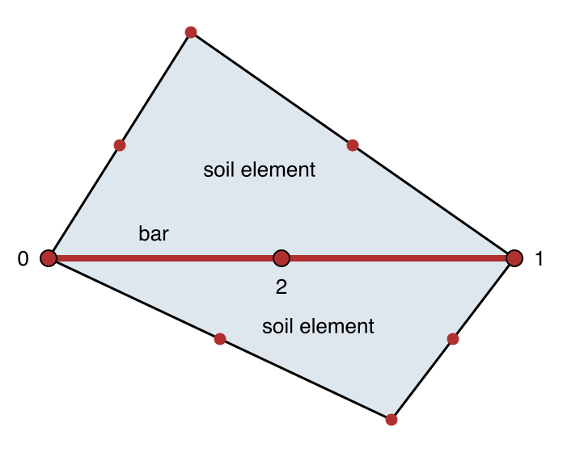
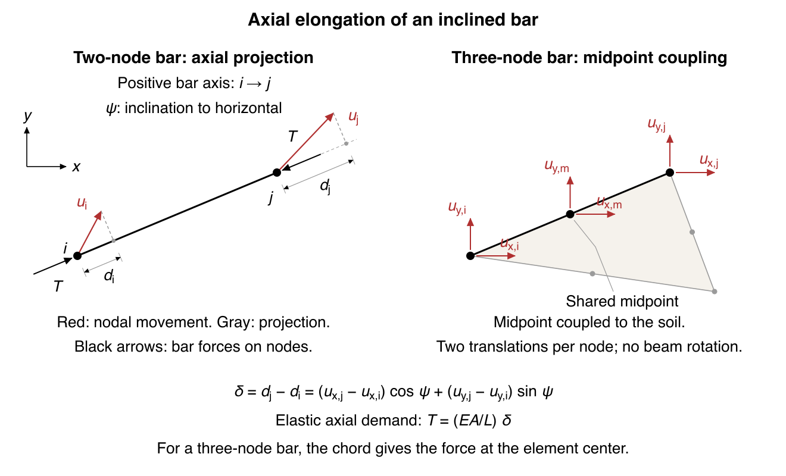
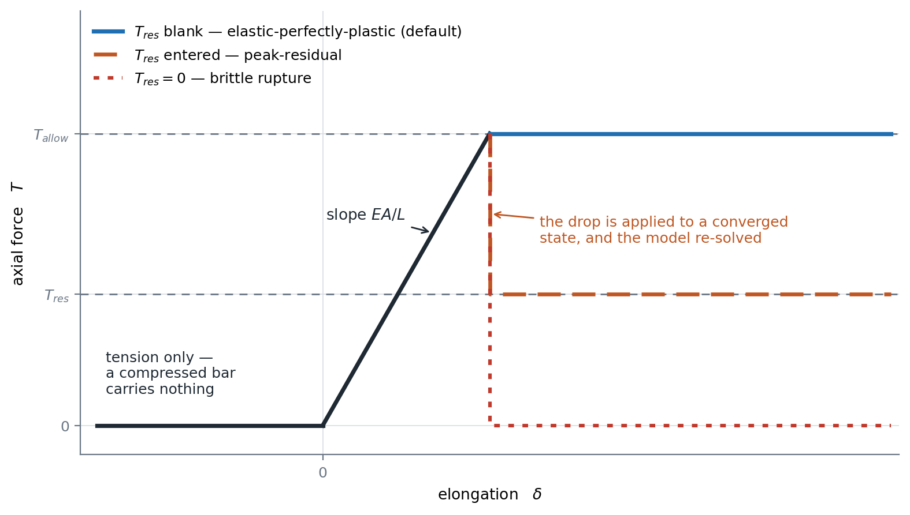
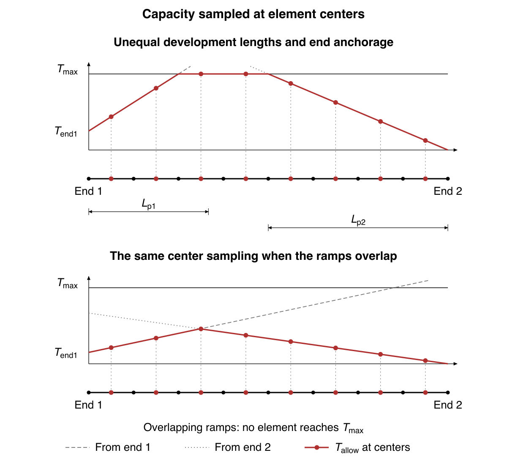
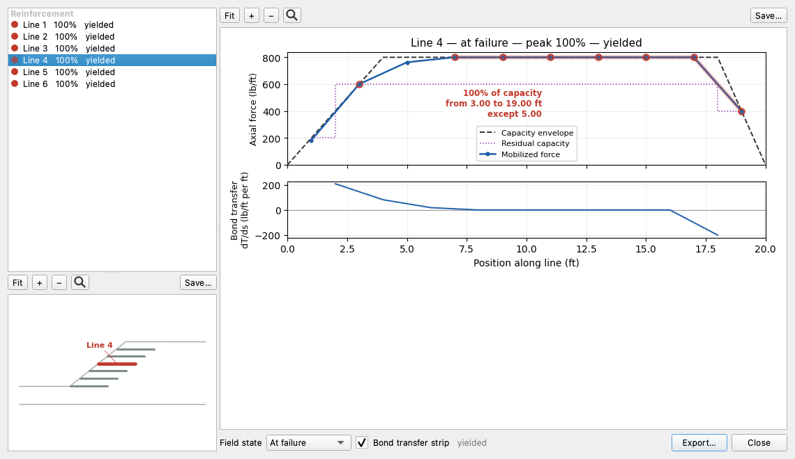
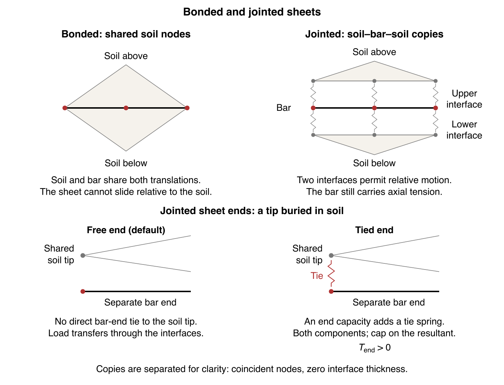
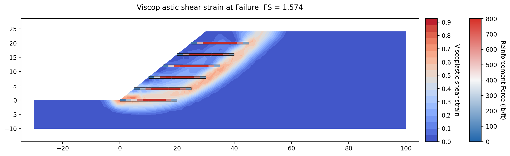

# Soil Reinforcement in Finite Element Analysis

Reinforcement supplies the tension that soil cannot carry: geosynthetic layers built into a fill, soil nails
grouted into a cut, tiebacks holding a wall, each crossing the zone where a slip surface would form and anchored in
the stable ground beyond it:

{width=1000}

From left to right: geogrid layers in the [FEM-2](../tutorials/fem02_reinforcement.md) reinforced fill, soil nails in a
nailed cut (Pockoski & Duncan), and tiebacks behind a soldier-pile wall
([LEM-9](../tutorials/lem09_tieback_wall.md)), each with the critical slip surface its source reports.

Geotextiles, geogrids, soil nails and ground anchors are modeled as one-dimensional truss (bar) elements embedded in
the soil mesh. A bar has axial stiffness $EA/L$ — $E$ the reinforcement's modulus, $A$ its cross-sectional area per
unit width, $L$ the element length — carries tension only, and is capped at a tensile capacity set by the line's
strength and its embedment ([Force behavior and failure modes](#force-behavior-and-failure-modes)).

Each reinforcement line is a row of bar elements whose nodes are nodes of the soil mesh. A bonded bar shares the nodes of the soil element edge it lies on, so bar and soil move together
([Reinforcement and pile lines](mesh.md#reinforcement-and-pile-lines)). On a linear mesh that is the edge's two
corner nodes. On a quadratic mesh (tri6, quad8, quad9) the bar also takes the edge's midside node, which makes it a
three-node bar ([Quadratic elements](mesh.md#quadratic-elements)), with two translations at each node and axial
stiffness only:

{width=430}

The bar's end nodes 0 and 1 are the edge's corners, and its node 2 is the edge's midside node, which ties the bar
to the soil in the middle of the edge. A line is divided into elements at the mesh
element size along it, the **1D element size** where the model states one, and every element takes the line's
$T_{max}$, $T_{res}$, $E$ and $A$. A line can instead be a slip surface the soil slides on; see
[Two ways to represent a sheet](#two-ways-to-represent-a-sheet).

Because a bar carries force only along its own axis, the direction of a reinforcement force is fixed in the
finite element analysis. In the limit equilibrium solvers it is chosen per line: tangent to the slip surface where
the line crosses it (the default for a geosynthetic), or along the line (the default for nails, tiebacks and
anchors). The figure compares the two on the [FEM-2](../tutorials/fem02_reinforcement.md) slope and its critical
circle:

{width=1000}

On the left, the limit equilibrium force at each crossing acts tangent to the circle, and the axial alternative is
drawn at the middle layer. On the right, each bar carries tension along its own length, from how much it stretches.

## Mathematical Formulation

**Truss Element Stiffness Matrix:** Each 1D truss element contributes to the global stiffness matrix through its element stiffness matrix. On a linear mesh the element has two nodes $i$ and $j$, and its stiffness in local (axial) coordinates is:

>>$[K_e]_{local} = \dfrac{AE}{L} \begin{bmatrix} 1 & -1 \\ -1 & 1 \end{bmatrix}$

On a quadratic mesh the element also carries the midside node $m$ of its soil edge, and its stiffness is the quadratic
bar's, in the node order $(i, j, m)$:

>>$[K_e]_{local} = \dfrac{AE}{3L} \begin{bmatrix} 7 & 1 & -8 \\ 1 & 7 & -8 \\ -8 & -8 & 16 \end{bmatrix}$

where $A$ is the cross-sectional area, $E$ is the elastic modulus, and $L$ is the element length.

The diagram below projects the end movements onto the bar axis to recover its elongation and center force.

{width=667px}

The end displacements projected on the bar axis, $d_i$ and $d_j$, differ by the chord elongation $d_j-d_i$, and
multiplying it by $EA/L$ gives the elastic force at the element center.
The midpoint displacement changes the quadratic bar's strain away from the center, but its contribution to strain is zero at the center.

**Coordinate Transformation:** The local stiffness matrix must be transformed to global coordinates using the transformation matrix $[R]$:

>>$[K_e]_{global} = [R]^T [K_e]_{local} [R]$

The transformation is built from $\alpha$, the inclination of the reinforcement line to the horizontal — the same
angle the LEM formulation uses for the direction of an axial reinforcement force:

>>$[R] = \begin{bmatrix} \cos\alpha & \sin\alpha & 0 & 0 \\ 0 & 0 & \cos\alpha & \sin\alpha \end{bmatrix}$

with one more row, $\begin{bmatrix} 0 & 0 & 0 & 0 & \cos\alpha & \sin\alpha \end{bmatrix}$, for the midside node of a
three-node bar.

**Assembly Process:** The global stiffness matrix combines contributions from both 2D soil elements and 1D truss elements:

>>$[K]_{global} = \sum_{soil} [K_e]_{soil} + \sum_{truss} [K_e]_{truss}$

**Force Vector Assembly:** The global force vector includes both soil body forces and any applied forces on reinforcement:

>>$\{F\}_{global} = \{F\}_{soil} + \{F\}_{reinforcement}$

## Force Behavior and Failure Modes

The forces and failure modes in 1D truss elements are analyzed in an iterative fashion. Each truss element
has a maximum allowable tensile capacity $T_{allow}$, derived from the user-specified reinforcement parameters,
and optionally a residual tensile capacity $T_{res}$. The axial force in each element is calculated as
$T = (AE/L) \cdot \delta$, where $\delta$ is the element elongation (the component of relative nodal displacement
along the element axis).

The global stiffness matrix carries each bar's *full elastic* stiffness, so $K u$ always contains the uncapped
elastic force. The capacity is imposed the same way plasticity is imposed on the soil — through a viscoplastic
body load equal to the part of the elastic force the element **cannot** carry:

>>$f_{body} = (T - T_{true}) \cdot [-\cos\alpha,\; -\sin\alpha,\; +\cos\alpha,\; +\sin\alpha]$

where $T_{true}$ is the force the bar can actually deliver: the elastic $T$ clipped into $[0, T_{allow}]$. Because
equilibrium is solved as $K u - f_{body}$, this leaves exactly $T_{true}$ in the bar.

A bar's axial force against its elongation is zero in compression and rises at $EA/L$ to $T_{allow}$; past that it
follows one of three branches:

{width=800}

Which of the three post-peak branches a bar follows is decided entirely by the $T_{res}$ column of its
reinforcement line.

**Elastic-Perfectly-Plastic Model (the default):**

If $T_{res}$ is left **blank**, the bar yields at $T_{allow}$ and holds it indefinitely while the surrounding soil
keeps straining.

A blank $T_{res}$ means *no post-peak drop* — it does **not** mean zero.

**Peak-Residual Model:**

Entering a value for $T_{res}$ turns on post-peak behavior: an element that yields drops from $T_{allow}$ to its
residual capacity, which is $T_{res}$ or the capacity its embedment can develop, whichever is smaller. Appropriate
for ductile materials where the published capacity is a peak rather than a plateau; typical residual ratios for
geosynthetics are $T_{res}/T_{allow} = 0.3-0.7$.

The drop is applied only to a converged equilibrium state: the solver converges with the bars capped at
$T_{allow}$, drops to $T_{res}$ every bar whose demand exceeded its capacity, and re-solves, repeating until the set
of softened bars stops growing. A capacity exceedance the solver records for reporting does not by itself change a
bar's capacity.

**Complete (Brittle) Failure Model:**

Setting $T_{res} = 0$ explicitly is the brittle case: a yielding element ruptures and carries nothing afterwards.
Appropriate for brittle materials (some steel cables, fiber reinforcement).

!!! warning "Post-peak behavior makes the SSR factor mesh-sensitive"
    Once $T_{res} < T_{allow}$ actually engages, the reinforcement is strain-**softening**. A softening system in
    an unregularized continuum has no length scale to arrest localization, so the computed factor of safety can
    drift with mesh refinement instead of converging, and the SSRM bracket becomes less sharp. This is a physical
    effect rather than a numerical defect, but it means $T_{res}$ is best treated as a forensics/back-analysis parameter rather than
    a design default. Leave it blank unless you specifically intend to model post-peak strength loss.

**Pullout Failure Model:**

Toward each end of a line, the capacity is limited by the pullout resistance the embedment can develop. Under the
development-length law the capacity rises linearly from the end anchorage $T_{end}$ (zero when blank) at the rate
$T_{max}/L_p$, so with no anchorage it reaches $T_{max}$ at the pullout length $L_p$ from the end; an $L_p$ of 0
makes that end fully anchored, with $T_{max}$ available at the end itself. The full envelope is under
[Element capacities](#element-discretization-and-capacity-assignment).

- Pullout is **perfectly plastic**. An element that reaches its embedment-limited capacity slips at that force and
  goes on carrying it: interface friction does not vanish once it has been overcome, so there is no drop to zero.
  The LEM envelope makes the same assumption.<br>
- Pullout spreads along a line as elements near the ends reach their capacity one after another and shed the
  balance of the demand into the interior

**Tension-Only Behavior:**

Truss elements are restricted to carry only tension forces. This is implemented through body-force corrections within the viscoplastic iteration loop:

- After each iteration, the axial force in each element is computed from the current displacement field<br>
- If compression develops ($T < 0$), a corrective body force is applied that cancels the compressive force

## Strength Reduction and Reinforcement

Strength reduction leaves a bonded line unchanged — $T_{max}$, $T_{res}$, $E$, $A$, and the pullout envelope from
$L_{p1}$, $L_{p2}$, $T_{end}$, `Adhesion` and `Delta` — as it does every
[structural property](overview.md#structural-elements). On a jointed line `Adhesion` and `Delta` are interface
strengths and are reduced unless the line sets `Jred = No`; see
[Strength reduction on a jointed line](#strength-reduction-and-what-decides-a-jointed-trial).

## Reinforcement Line Input Parameters and Element Properties

In the Excel input template used by XSLOPE, the user defines one reinforcement line per row of the table on the
`reinforce` sheet. The table has no row limit: the template is formatted for 30 lines, and more may be added in the
rows below them. The lines are read down to the first row whose x1 is blank. Each row of the table includes the
following, in sheet order:

| Column | Description |
|---|---|
| Label | optional name |
| x1, y1 / x2, y2 | end 1 and end 2 of the line |
| Type, Dir, Appl | limit equilibrium settings; not read by the FEM (see [Soil Reinforcement in LEM](../lem/reinforcement.md)) |
| Tmax | tensile strength, per element or per unit width |
| Lp1, Lp2 | pullout length at end 1 and end 2; 0 = fully anchored |
| Adhesion, Delta | interface adhesion and friction angle; filled together, they replace Lp1/Lp2 with the overburden law |
| Tend1, Tend2 | end anchorage capacity; on a jointed line, a value above zero ties that end |
| Spacing | spacing of discrete elements (nails, anchors, strips); Tmax, Tres, Tend and Area are divided by it; blank for a continuous sheet |
| Tres | residual tension; blank = no post-peak drop, 0 = brittle rupture; FEM only |
| E, Area | modulus and cross-sectional area |
| Joint, kn, ks, Jred | slip-surface option and its interface stiffnesses and reduction switch ([Two ways to represent a sheet](#two-ways-to-represent-a-sheet)) |

The units for E and Area need to be compatible with each other and with the other weight and length units used. For
metric units, E should be in $kPa$ and Area should be in $m^2$. For English units, E should be in $psf$ and Area
should be in $ft^2$. Alternately, E could be in $psi$ as long as Area is in $in^2$.

### Element capacities {#element-discretization-and-capacity-assignment}

Every element of a line takes the line's $E$ and $A$, so its stiffness is $EA/L$ with $L$ its own length, and is
assigned two tensile capacities, an allowable $T_{allow}$ and a residual $T_{res}$. $T_{allow}$ is the capacity
envelope at the element centroid — the **same** envelope the limit-equilibrium engine applies at a slip-surface
crossing, evaluated by the same function, so the two engines always use the same capacity:

>>For an element whose centroid is at distances $d_1$ and $d_2$ from the two ends of a line of length $L$:
>>
>>$T_{allow} = \min\left(T_{max},\;\; T_{end1} + \displaystyle\int_0^{d_1} r,\;\; T_{end2} + \int_{L-d_2}^{L} r\right)$
>>
>>where $r$ is the pullout resistance per unit length. Under the development-length law $r = T_{max}/L_p$ at each end, and the integrals are the linear ramps $T_{max}d_1/L_{p1}$ and $T_{max}d_2/L_{p2}$. Under the overburden-dependent law (Adhesion and Delta both filled) $r = 2(a + \sigma'_v\tan\delta)/S$, with $S$ the Spacing (1 when blank), varies along the line with the effective overburden, and $L_{p1}$/$L_{p2}$ are not read. Both laws, and the end anchorage capacities $T_{end}$, are set out in **[Soil Reinforcement in LEM](../lem/reinforcement.md#capacity-envelope)**.

An element's $T_{res}$ is unset (no post-peak drop) when the line's $T_{res}$ is blank in the input, and otherwise
the smaller of the line's entered $T_{res}$ and the element's $T_{allow}$.

Elements near a free end therefore have reduced capacity — zero at the end itself, unless an anchorage capacity
$T_{end}$ is entered there or that end's $L_p$ is 0 — while elements far enough from both ends carry the full design
strength.

Where post-peak behavior is switched on, two independent mechanisms can limit what an element retains, and the
smaller of the two governs. Bond slip is perfectly plastic, so the embedment goes on developing $T_{allow}$ — the
ramped envelope, end anchorage included — however far the bar is pulled. The line's entered $T_{res}$ is the rupture
residual, a property of the reinforcement itself and not of its embedment. Beyond the ramps $T_{allow} = T_{max}$
and the element takes the user's residual strength; inside a ramp it takes whichever of the two is less.

The diagram below pairs the constant-rate capacity envelope with the FEM element centers where it is sampled.

{width=768px}

Each red center takes the smallest of the tensile limit and the capacities developed from both ends; when the ramps overlap below $T_{max}$, no element reaches the full tensile strength.

### Axial Stiffness (EA)

The analysis depends only on the product $EA$ (the axial stiffness, sometimes called the tensile stiffness or $J$ in
geosynthetic specifications), not on $E$ and $A$ independently. Any combination of $E$ and $A$ that produces the same
$EA$ will give identical results. The axial stiffness controls how much the reinforcement must elongate before
mobilizing its tensile capacity:

>>$EA = \dfrac{T_{max}}{\varepsilon_{rupture}}$

where $\varepsilon_{rupture}$ is the strain at which the reinforcement reaches its ultimate tensile strength.

### Determining Reinforcement Line Pullout Lengths

A separate pullout length (Lp) is used for each end since each end may be embedded in a separate soil with different
shear resistance values. A line may instead state its interface strength through Adhesion and Delta, in which case
the resistance follows the effective overburden along the line and the pullout lengths are not used.

The pullout length $L_p$ represents the distance from each end of the reinforcement over which the full tensile strength is mobilized. Pullout length can be estimated as follows:

**For Soil Nails:**
>>$L_p = \dfrac{T_{max}}{\lambda \pi D \sigma_n' \tan \phi_{interface}}$

where:<br>
>>$T_{max}$ = design tensile capacity of the nail<br>
$\lambda$ = surface roughness factor (0.5-1.0 for grouted nails)<br>
$D$ = effective nail diameter <br>
$\sigma_n'$ = average effective normal stress along the nail<br>
$\phi_{interface}$ = interface friction angle (typically 0.8-1.0 times soil friction angle)

**For Geotextiles:**
>>$L_p = \dfrac{T_{max}}{2 \lambda \sigma_n' \tan \phi_{interface}}$

where the factor of 2 accounts for friction on both sides of the geotextile.

These equations are a general guide that can be used to come up with reasonable estimates of Lp. Typical values are as follows:

|Reinforcement Type | Pullout Length $L_p$ (m) | Notes |
|-------------------|--------------------------|-------|
| **Soil Nails** | 1.5 - 3.0 | Depends on soil conditions and nail diameter |
| **Geotextiles** | 0.5 - 1.5 | Depends on normal stress and surface texture |
| **Geogrid** | 1.0 - 2.0 | Depends on aperture size and bearing resistance |

### Initial state and EA selection

The reinforcement is placed with the soil in its final geometry and starts at zero force. It gains tension only from
the deformation of the gravity solve and of the strength reduction, not from construction in lifts; XSLOPE has no
staged construction. A bar must therefore be stiff enough to mobilize its capacity at the small displacements of an
incipient failure. Below about $EA = 50\,T_{max}$ the reinforcement may add little to the factor of safety, and above
about $100$–$200\,T_{max}$ further stiffness changes it little. The zero initial force matters most where the
reinforcement is extensible and the wall tall, or where reinforcement forces at working load are wanted.

Recommended values of $EA$ by reinforcement type:

| Reinforcement Type | Recommended $EA/T_{max}$ | $\varepsilon_{rupture}$ | Notes |
|---|---|---|---|
| **Woven geotextiles** | $50$–$100$ | 1–2% | Use stiffer end for SSRM |
| **HDPE geogrids** | $50$–$100$ | 1–2% | Uniaxial, reinforcement grade |
| **PET geogrids** | $100$–$200$ | 0.5–1% | Higher stiffness than HDPE at same strength |
| **Steel strips** | $500$–$2{,}000$ | 0.05–0.2% | Very stiff, minimal elongation |
| **Soil nails (grouted)** | $1{,}000$–$5{,}000$ | 0.02–0.1% | Based on steel bar + grout composite |

## Inspecting the Results

The FEM results view colors each reinforcement element by the force it carries, which shows which lines carry the
most force. To read one line along its length, use the **1D Details…** button on that view's
toolbar. It opens a panel listing every reinforcement line and pile in the model with its utilization and a badge
colored by it — a reinforcement row also names the state the line is in — and draws the selected member's profiles
beside the list. Under the list is a map of the section with the selected member picked out, so each listed member can
be located on the slope. The button is dimmed for a model with no reinforcement lines and no piles.

{width=1000}

The main plot is the mobilized axial force $T$ against position along the line, drawn over the dashed capacity
envelope of the [pullout section above](#determining-reinforcement-line-pullout-lengths): the friction ramp
developing from each free end over its pullout length $L_p$, the tensile plateau at $T_{max}$ in the middle, and
the step to the end anchorage capacity $T_{end}$ where one is declared. That envelope is the same expression the
solver evaluates at each element centroid to set $T_{allow}$, so the curve and the element capacities are
consistent. Where $T_{res}$ is filled in, the residual capacity is drawn as a dotted step beneath it — flat at
$T_{res}$ along the middle of the line, and following the friction ramp wherever the embedment develops less than
that — and elements that have softened onto it are marked. An element left with no residual at all, and therefore
carrying no force, is marked at zero.

The greatest utilization along a line is usually held over a stretch rather than at a point, the force being capped
by a flat envelope. Where it is a point, that point is ringed. Where it is a stretch, every sample on the stretch is
ringed and the run of curve between them is thickened — and a stretch with a sample inside it that stands below the
rest is drawn as separate runs, so a break in the thickened curve is where the line comes off capacity. The
legend calls the mark **At capacity**, or **Peak utilization** on a line that never reaches its envelope, and the
title states the fraction of capacity the peak reaches.

The profile does not mark where the shear band crosses the line; the crossing is shown on the field figure,
where the band is drawn as strain contours.

Every mark on the panel is named in the legend.

Beneath the force profile is the bond transfer rate $dT/ds$: the force transferred from the ground to the bar per
unit length, which is the gradient of the profile above it.

A **Field state** control at the foot of the panel selects which field the profiles are read from — the at-failure
mechanism an SSRM run captured, or the last converged solution — and is the same switch, with the same default, as
the one on the results view. It is dimmed for a run that captured no mechanism, and the capacity envelope does not
move with it. On a softening line the two fields can differ in kind: an element drops to its residual
only when an equilibrium state demands more than its capacity, so the last converged field may show no softened
element at all while the at-failure field — which starts from the set the failed-edge trial shed to — shows the
elements that gave way sitting on the residual line, marked *Softened*.

**Export** writes the current view as a PNG and its plotted series as a CSV named from the model, the line and the
field state, with that state also recorded in the CSV's header. The panel is non-modal and reads the solution it
was opened with; it works the same on a solution reloaded from its saved sidecar files as on a fresh solve.

The screenshot above is a strength reduction run on the reinforced slope built in
[FEM-2](../tutorials/fem02_reinforcement.md), shown at the mechanism it developed.

### The state of a line

One line is in one state, named the same way everywhere XSLOPE reports it: on the panel's list rows and under its
plot, in the title of a detail figure, in the table `print_reinforcement_summary()` prints, and in a generated
report.

| State | The line |
|-------|----------|
| within capacity | is below the capacity available to it everywhere along its length |
| near capacity | is below capacity everywhere, but close to it where it is most utilized |
| pullout | is slipping near an end at the capacity its embedment can develop there |
| yielded | is at its full tensile capacity away from the ends and holding it |
| softened | has dropped off its peak capacity onto its residual |
| ruptured | has softened with no residual capacity left and now carries nothing |
| inactive | carries no tension anywhere and is not engaged |

Pullout and yielded look alike on a badge: both are a line standing at
100% of what is available to it. **Pullout** is an end element at the reduced capacity its embedment can develop,
limited by the friction ramp, with the interior of the line still below capacity. **Yielded**
is an element out on the $T_{max}$ plateau, where the whole tensile strength of the reinforcement is mobilized. A
line in both states at once is reported yielded, the more serious of the two. **Softened** and **ruptured** need a
$T_{res}$: a line that declares none cannot reach them.


## Two Ways to Represent a Sheet

Everything above is the **bonded bar**: the truss element shares the soil's own nodes, so the soil above the line
and the soil below it are one body and the sheet cannot slide in the soil except by the bar reaching the capacity
its embedment develops. "Bond" there is a cap on the tension, read from the pullout envelope at each element's
position, and not a sliding surface.

The alternative is the **joint**. Setting `Joint = Yes` on a reinforcement line makes that line a slip surface: the
mesh is split along it, the sheet becomes a bar with its own nodes between an upper and a lower interface, and each
interface carries the line's own `Adhesion` and `Delta` as a Mohr-Coulomb strength. The soil on the two sides can
then slide on the sheet, and on each other, at that interface strength. The interface element, its stiffnesses and
their defaults are described under [The interface element](joints.md#the-interface-element); on a reinforcement line
the tension cutoff is zero.

The comparison below shows which nodes the soil and sheet share in the two representations.

{width=896px}

The bonded bar shares both translations with the soil; the jointed sheet has its own bar nodes, with an interface
on each side allowing the soil to move relative to it.

Every node on a jointed line exists three times at the same point — a copy for the soil above, a copy for the bar,
a copy for the soil below — and two interface elements connect them at each station: the soil above against the
bar, and the bar against the soil below. On a quadratic mesh the midside nodes are tripled too, so an interface
element has three node pairs and matches the adjacent triangles' edges. The split is invisible on a mesh plot,
because the three copies stand at one point; the jointed line is drawn in its input style with short ticks on both
sides so it can be told from a bonded one. A jointed run's results — the slip along each interface, the deformed
section as blocks, and the tractions along each line — are described under
[What the results show](joints.md#what-the-results-show).

### Ends, ties and the bar

The two soil faces rejoin at each end of the line: one shared soil node, a crack tip. The bar's end node is not
that node — it is the bar's own, connected to the soil only through the interfaces along it — so **a sheet end is
free by default**. It carries no load, it can pull out, and the tension the bar develops at any station is the
interface shear integrated from the free end, which is the pullout envelope produced by the elements instead of by
hand.

An end is **tied** when that end's `Tend1` / `Tend2` is above zero: a spring from the bar's end node to the soil (or
facing) node at the same point, perfectly plastic at the stated capacity, restraining both components with the
capacity read on the resultant. A wall sheet is connected to its facing this way.

On a jointed line the bar keeps its own law — tension only, rupture at $T_{max}$, softening to $T_{res}$ where
stated — **minus the bond-slip cap**. The grip on the soil is now the interface traction the joints integrate, so
applying the pullout envelope as well would count it twice; `Lp1` and `Lp2` are not read there, and the preflight
checks report this.

### Strength reduction on a jointed line {#strength-reduction-and-what-decides-a-jointed-trial}

Strength reduction divides a jointed line's `Adhesion` and the tangent of its `Delta` by the trial factor, as it does
the soil's strength ([Strength reduction](joints.md#strength-reduction)), unless the line sets `Jred = No`; the bar's
$T_{max}$ and the end ties are not reduced. Iteration budgets, and how a jointed trial is decided, are under
[Running a jointed model](joints.md#running-a-jointed-model).

## Joints Without Reinforcement {#joints-without-reinforcement}

A slip surface with no member in it — a rock joint, a block contact, the back of a wall — goes on the **joints**
worksheet and is described on [Joints and interface elements](joints.md). Its mesh split differs from a jointed
sheet's: each station carries two coincident nodes and one interface, where a jointed sheet carries three nodes and
two interfaces:

```
  Joint = Yes on a sheet             a joints-sheet line

   ----o----o----o----  upper        ----o----o----o----  upper face nodes
   ~~~~~~~~~~~~~~~~~~~  interface    ~~~~~~~~~~~~~~~~~~~  the interface
   ====b====b====b====  the bar      ----o'---o'---o'---  lower face nodes
   ~~~~~~~~~~~~~~~~~~~  interface
   ----o'---o'---o'---  lower
```

### Both kinds in one model

A model may carry both, and the multi-tiered geotextile wall is the case that needs both at once: each sheet is a
reinforcement line with `Joint = Yes`, so the fill can slide on it while the sheet still carries tension, and each
facing column stands on joints-sheet lines that let the blocks slide on each other, on the fill behind them and on
the foundation beneath. A sheet whose front end stops on the back face of a column is tied to the column when that
end's `Tend` is above zero; the tie represents the wrap's connection to the facing.

## Choosing a Bonded Bar or a Joint {#bonded-bar-or-joint}

The choice depends on the mechanism rather than on the material: whether the slip surface **cuts** the
reinforcement or runs **along** it.

**Surface crossing the layers.** A bonded bar is appropriate where the surface crosses the layers: a circle through
a geogrid slope, a nail wall, a pile row. The soil on both sides of each layer moves together, the layer carries
tension across the surface, and the only interface question is pullout, which the bar's capacity cap represents.
It corresponds to the limit equilibrium treatment — a force where the surface crosses the line — so the two engines compare like for
like.

In the [FEM-2](../tutorials/fem02_reinforcement.md) reinforced slope the band of shear strain at failure cuts
through all six layers, and each layer carries its tension across it:

{width=1000}

**Surface along the layer.** A joint is appropriate where the surface can run along the layer: a reinforced
embankment on soft clay sliding on
its base geotextile, a wrapped-face or block-faced wall where the fill between the sheets moves relative to them
and each sheet anchors to a facing, a smooth geomembrane or liner whose interface friction is well below the soil's,
any long flat sheet under a sliding mass. The interface shear strength along the sheet governs and the two sides move
differently. A bonded bar cannot represent this: its elements sit at their capacity, and the factor of safety then
depends on the mesh rather than on the interface strength.

In the liner model of [FEM-3](../tutorials/fem03_block_wall_joints.md#a-smooth-geomembrane-liner-on-a-firm-foundation),
where the liner is the weakest thing in the section, two wedges of fill slide outward on it. The liner's faces are
colored by how far they have slipped; the middle stays closed, and the slip grows toward each toe:

{width=1000}

Joints are off by default. On a wall or a base sheet,
running both ways answers the question: a bonded answer that matches the jointed one shows that the mechanism
crosses the sheets, and one that sits above it shows that the mechanism slides along them and the bond was holding
it up.

### Signs that a joint is needed {#what-says-a-joint-was-needed}

The preflight checks cannot determine the mechanism, but four of these cases show in the inputs, and the checks
report each of them as a warning naming the line:

- a sheet **lying on a material boundary** over most of its length — the base geotextile of a reinforced
  embankment, which slides on its own interface;
- a **long, flat sheet** within a few degrees of horizontal spanning most of the width of the zone above it;
- a **smooth interface**, `Delta` below about 0.6 of the surrounding soil's $\phi$ — a geomembrane or liner rather
  than an ordinary soil-geosynthetic contact;
- the **wall pattern**: four or more near-horizontal sheets at a vertical spacing under a meter, behind a face at
  least 70° steep, with their front ends inside a thin facing column.

Two stronger signals come out of a bonded run itself, and a strength reduction reports them when it finds them: the
shear strain band at the critical factor running **along** a sheet rather than across it, and **every bar element
on one sheet at its capacity**. In the second case the sheet is held only by its capacity cap, and the factor of
safety changes as the mesh along the sheet is refined instead of converging.
