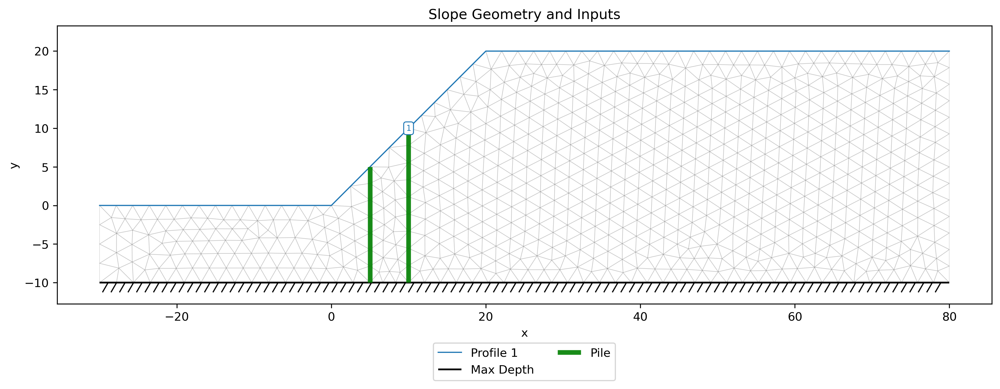
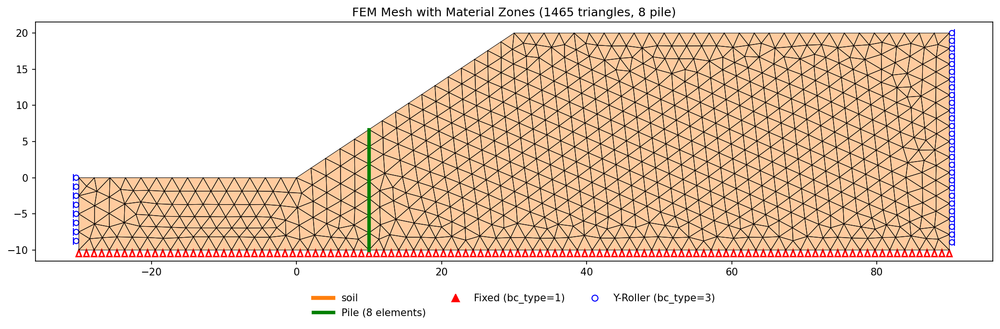
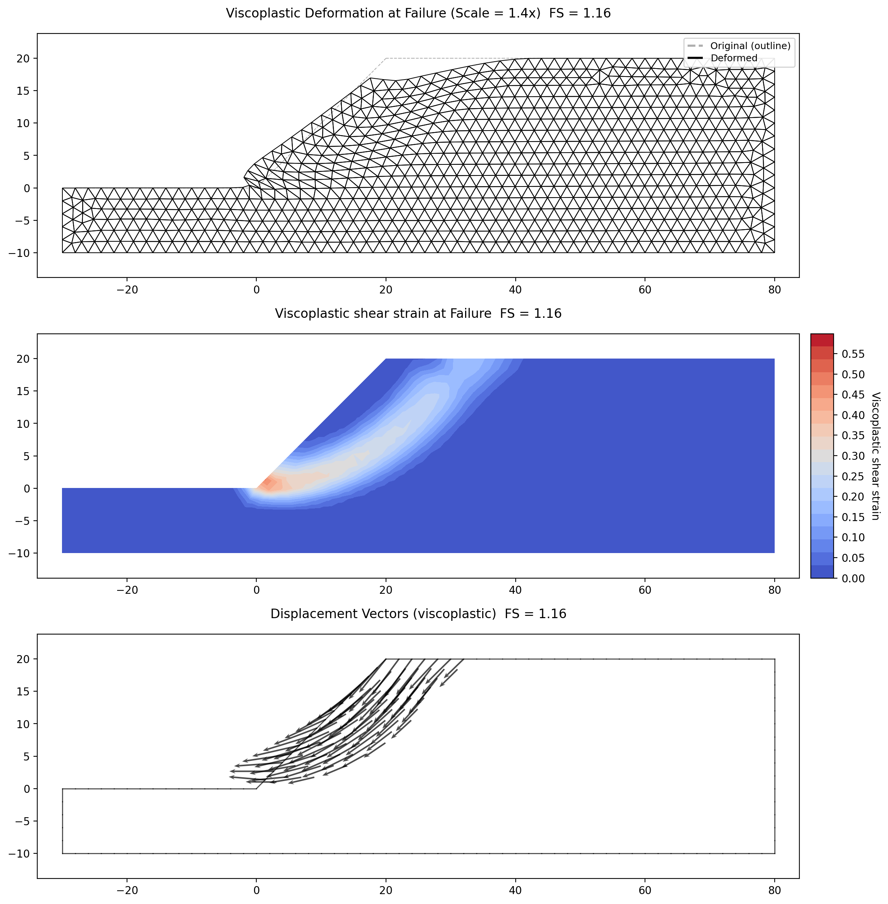
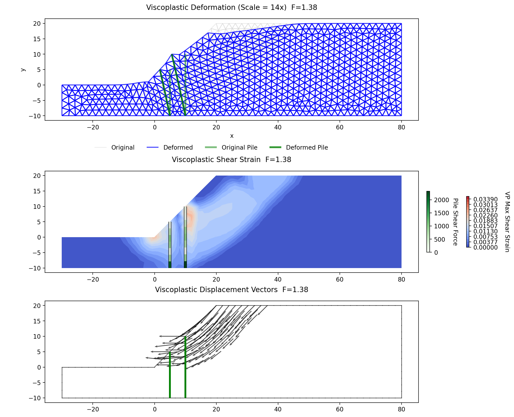
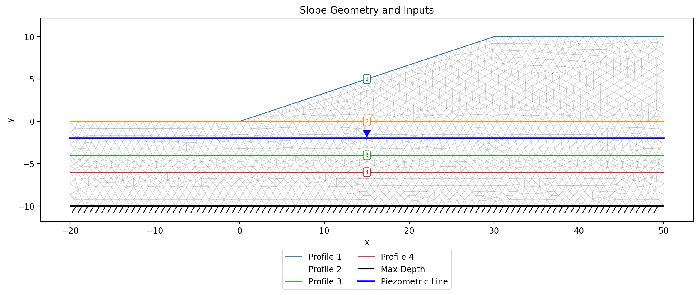
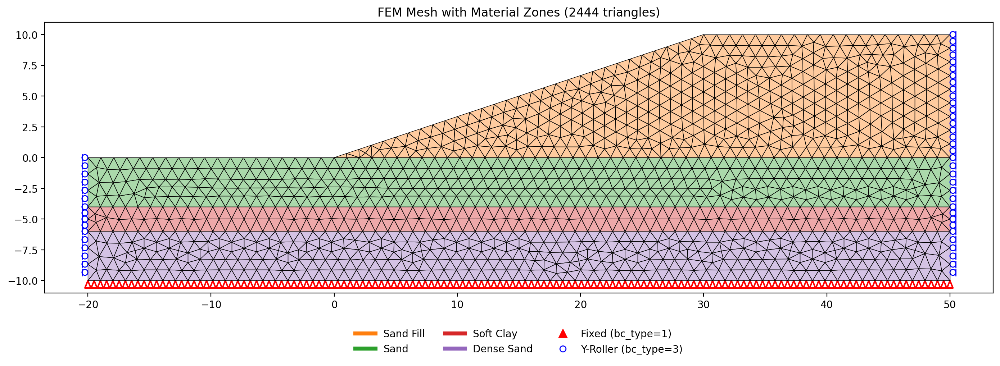
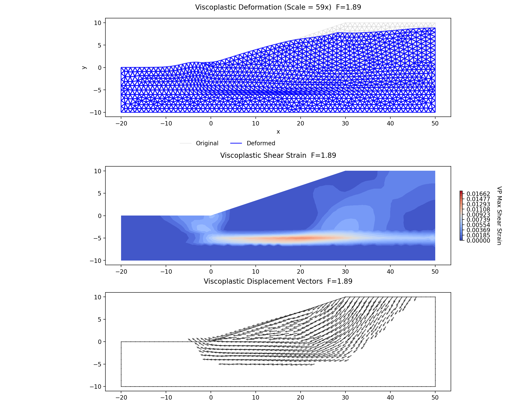
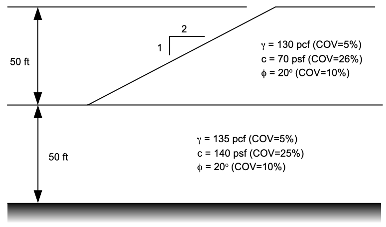

# Sample Problems - Finite Element Method

> **Verification benchmarks** (the Griffiths & Lane examples) are documented on the [FEM/SSRM verification page](../verification/ssrm.md).


The following examples illustrate how to use XSLOPE's finite element capabilities for slope stability analysis using
the Shear Strength Reduction Method (SSRM). Each of the Excel input files below can be uploaded and used with the following Google Colab notebook which has been set up specifically for running FEM slope stability analyses:

<a href="https://colab.research.google.com/github/njones61/xslope/blob/main/notebooks/xslope_fem.ipynb" target="_"></a>

The FEM implementation is described in the [FEM Overview](overview.md) page.

### 1. Reinforced Slope with Geogrid Reinforcement

This problem features an engineered slope with six layers of geogrid reinforcement. It is the FEM counterpart of
the LEM reinforced slope example described in the [LEM Samples](../lem/samples.md) page (Problem 9). The slope
geometry and soil properties are the same, with the addition of elastic modulus and Poisson's ratio for the FEM
analysis:

| Property | Shell | Base |
|----------|-------|------|
| Cohesion, $c$ (psf) | 300 | 0 |
| Friction angle, $\phi$ (degrees) | 37 | 37 |
| Unit weight, $\gamma$ (pcf) | 130 | 130 |
| Young's modulus, $E$ (psf) | 1,000,000 | 1,000,000 |
| Poisson's ratio, $\nu$ | 0.3 | 0.3 |

A 240 psf surcharge is applied along the slope crest from $x = 30$ ft to $x = 100$ ft.

Six reinforcement lines are defined with the following properties:

| Property | Value |
|----------|-------|
| $T_{max}$ | 800 lb/ft |
| $T_{res}$ | 600 lb/ft |
| $L_{p1}$, $L_{p2}$ | 4 ft |
| $E$ | 800,000 psf |
| $Area$ | 0.1 ft$^2$/ft |
| $EA$ | 80,000 lb/ft |

Excel input file: [xslope_reinforce_fem.xlsx](files/xslope_reinforce_fem.xlsx)

Inputs plotted with the XSLOPE plot_inputs() function:

{width=1000}

FEM mesh with boundary conditions and reinforcement elements (red lines):

{width=1000}

SSRM results. The computed factor of safety is **FS = 1.51**. The companion LEM analysis
gives **FS = 1.59** by Spencer's method (see [LEM sample problem 9](../lem/samples.md)),
and the FEM reads below it. This is a *peak-residual* run: $T_{res}$ = 600 lb/ft is filled
in, so a reinforcement element that reaches its full tensile capacity sheds to that
residual, while the LEM has no strain compatibility and simply applies the full envelope
value at each crossing (it ignores $T_{res}$ entirely — see
[LEM Reinforcement](../lem/reinforcement.md)).

Blank out $T_{res}$ and the same model runs elastic-perfectly-plastic at **FS = 1.559**, so
post-peak behavior accounts for 0.050 of the 0.077 that separates the two engines here. The
rest is the difference between prescribing the reinforcement force at one crossing point and
letting it emerge from displacement compatibility along the whole line.

The plots below show the solution at the computed factor of safety. The
top plot shows the deformed mesh with original and deformed reinforcement positions. The
middle plot shows the viscoplastic shear strain concentration with reinforcement elements
colored by axial force (blue = low, red = high): the middle of each line carries $T_{max}$
and the end segments carry the reduced force their embedment can develop. The bottom plot
shows the displacement vectors. The reinforcement summary table is shown below.

{width=1000}

The `print_reinforcement_summary()` function reports the state of each line — how many
elements are carrying tension, how many sit inside a pullout ramp, how many have yielded,
and how many have dropped to the residual capacity — together with the line's state, in the
vocabulary [The state of a line](reinforcement.md#the-state-of-a-line) sets out and the
Studio panel and the report use.

<!-- test: file=files/xslope_reinforce_fem.xlsx, type=fem_ssrm, expected_fs=1.509, element_type=tri6, target_size=2, tolerance=0.01, f_min=1.1, f_max=1.9, max_iter=16000 -->

At the last trial that reaches equilibrium, $F$ = 1.506, the reinforcement is heavily
mobilized but has not yet lost anything. The five upper lines each have one element inside a
pullout ramp ($L_p$ = 4 ft from each end) sitting at the 200 lb/ft its embedment can develop
and slipping there, which is what makes those five lines read **pullout**. The greatest force
anywhere is 795 lb/ft, just short of $T_{max}$, and nothing has softened. Only line 1, at the
toe, is clear of capacity altogether.

One trial higher, at $F$ = 1.513, the slope never finds equilibrium again: elements reach
$T_{max}$ = 800 lb/ft and shed to $T_{res}$ = 600 lb/ft, hand their load to their neighbors,
more of them yield, and the run ends in non-convergence. That is the mechanism the factor of
safety brackets — not the pullout
zones, which go on carrying what they were carrying, but the loss of tensile capacity in the
middle of the lines where the failure surface crosses them.

### 2. Slope Stabilized with Drilled Shaft Piles

This problem features a 1:1 slope in a medium-stiff clay stabilized by two rows of drilled shafts.

{width=1000}

Excel input file: [xslope_piles_fem.xlsx](files/xslope_piles_fem.xlsx)

The soil properties are:

| Property | Value |
|----------|-------|
| Cohesion, $c$ | 200 psf |
| Friction angle, $\phi$ | 20 degrees |
| Unit weight, $\gamma$ | 120 pcf |
| Young's modulus, $E$ | 2,000,000 psf |
| Poisson's ratio, $\nu$ | 0.3 |

Two rows of vertical drilled shafts are placed at $x = 5$ ft and $x = 10$ ft along the slope face, both extending from the ground surface to $y = -10$ ft:

| Property | Value |
|----------|-------|
| Diameter, $D$ | 2.0 ft |
| Spacing, $S$ | 6.0 ft |
| Young's modulus, $E_{\text{pile}}$ | 518,400,000 psf (concrete, $f'_c$ = 4000 psi) |
| Moment of inertia, $I$ | $\pi D^4 / 64$ = 0.785 ft$^4$ (auto-computed from $D$) |
| Cross-sectional area, $A$ | $\pi D^2 / 4$ = 3.14 ft$^2$ (auto-computed from $D$) |
| Shear capacity, $V_{\text{cap}}$ | 46,000 lb |
| Moment capacity, $M_{\text{cap}}$ | 60,000 ft·lb |
| Fixity | free |

Each pile is modeled as a chain of 6-DOF Euler-Bernoulli beam elements with rotational DOFs at each node (see [FEM Piles](piles.md) for the formulation). The pile stiffness ($EI$ and $EA$) is scaled by $1/S$ to convert from per-pile to per-unit-width quantities. Unlike the LEM approach where the user provides a single force $H$, the FEM beam elements naturally develop resistance as the soil deforms around the pile. Bending moments are computed directly at each node, and structural capacity limits ($V_{\text{cap}}$, $M_{\text{cap}}$) are enforced through the viscoplastic correction loop.

FEM mesh with boundary conditions. The piles are shown as green line elements along the pile axes:

{width=1000}

The unstabilized slope is the same model with its two pile rows cleared and nothing else changed, so the pair
differs only by the piles: [xslope_piles_fem_nopile.xlsx](files/xslope_piles_fem_nopile.xlsx). It is solved on the
same element type and mesh size as the stabilized run.

SSRM results without piles (**FS = 1.155**). The shear strain concentration shows a failure mechanism passing through the toe:

{width=1000}

<!-- test: file=files/xslope_piles_fem_nopile.xlsx, type=fem_ssrm, expected_fs=1.155, element_type=tri6, target_size=2, tolerance=0.01, f_min=1.0, f_max=1.6, max_iter=16000 -->

SSRM results with two rows of piles (**FS = 1.370**). The pile elements are colored by lateral (shear) force in the shear strain plot. The piles resist the sliding mass and the failure mechanism is modified by their presence:

{width=1000}

Pile summary. `print_pile_summary` reports whichever field it is given; this is the last converged trial:

```text
=== Pile Summary ===
Pile  Elems   Max |T|   Max |V|   Max |M|     V_cap     M_cap  Yielded  Status
--------------------------------------------------------------------------------
   1      8     361.0    1950.5    6186.0    7666.7   10000.0    0/8  OK
   2     10    1142.4    1940.2    6318.6    7666.7   10000.0    0/10  OK
--------------------------------------------------------------------------------
```

The two rows of piles increase the factor of safety from 1.155 to 1.370 — a 19% improvement. In the last converged
trial the largest bending moment is 6,319 per unit width (Pile 2), about 63% of the moment capacity
($M_{\text{cap}}/S$ = 10,000), and the largest shear 1,951 (Pile 1), about 25% of $V_{\text{cap}}/S$ = 7,667. In
the developed mechanism at failure — the state the results figure above draws — both are smaller: 4,429 (44%) and
1,580 (21%). The structural capacity does not govern for this problem in either state. The soil's ability to
transfer lateral load to the piles is the limiting factor, not the pile strength.

This is typical behavior for piles in relatively weak soil — the pile is much stiffer than the surrounding soil, and increasing the pile diameter or stiffness beyond a certain point produces diminishing returns. The 2D plane-strain model also does not capture the three-dimensional soil arching between piles that the Ito & Matsui theory accounts for in LEM, which can make the FEM result more conservative than the LEM result.

<!-- test: file=files/xslope_piles_fem.xlsx, type=fem_ssrm, expected_fs=1.370, element_type=tri6, target_size=2, tolerance=0.01, f_min=1.0, f_max=1.6, max_iter=16000 -->

### 3. Non-Circular Failure Surface with Thin Weak Layer

This is the FEM counterpart of the LEM non-circular failure surface example described in the [LEM Samples](../lem/samples.md)
page (Problem 7). The problem features a thin weak clay layer in the foundation of a slope, which controls the
failure mechanism. This problem was also featured in the user manual for the UTEXASED slope stability analysis
software developed by Stephen G. Wright at the University of Texas at Austin.

{width=900}

The slope geometry and strength properties are the same as the LEM problem. Young's modulus ($E$) and Poisson's
ratio ($\nu$) are estimated from typical correlations for each soil type:

| Soil | $c'$ (psf) | $\phi'$ (deg) | $\gamma$ (pcf) | $E$ (psf) | $\nu$ |
|------|:----------:|:--------------:|:---------------:|:---------:|:-----:|
| Sand Fill | 0 | 37 | 120 | 1,000,000 | 0.30 |
| Sand | 0 | 33 | 123 | 700,000 | 0.30 |
| Soft Clay ($S_u$ = 200) | 0 ($\phi = 0$) | 0 | 118 | 60,000 | 0.40 |
| Dense Sand | 0 | 37 | 131 | 1,500,000 | 0.28 |

The soft clay is modeled as an undrained material ($\phi = 0$) with $E/S_u \approx 300$. A Poisson's ratio of 0.40
is used rather than the theoretical undrained value of 0.5 to avoid numerical issues with near-incompressibility.

Excel input file: [xslope_noncircular_fem.xlsx](files/xslope_noncircular_fem.xlsx)

Inputs plotted with the XSLOPE plot_inputs() function:

{width=1000}

FEM mesh with boundary conditions and material zones. **Mesh resolution matters for this
problem**: the soft clay layer is only 2 ft thick, and the mesh must place at least two
elements through its thickness to resolve the shear band that controls the failure
mechanism — a target element size of 1.0 ft (or finer) is required. A coarser mesh
stiffens the thin layer artificially and distorts the strain field within it:

{width=1000}

SSRM results. The computed factor of safety is **FS = 1.53**. The plots show the solution
at the computed factor of safety. The middle plot shows the viscoplastic shear strain
concentration, which clearly reveals the non-circular failure mechanism passing through the
thin weak clay layer — matching the expected behavior without any prior assumption about
the failure surface shape. The bottom plot shows the displacement vectors, confirming
lateral sliding of the slope mass along the clay layer.

{width=1000}

The FEM result of FS = 1.62 is about 7% below the LEM result of FS = 1.74 obtained using
Spencer's method — both analyses use the same piezometric surface in the foundation sand.
Differences of this order between SSRM and LEM are typical: the FEM develops the failure
mechanism freely through the global stress field, while the LEM evaluates rigid-block
equilibrium on a prescribed surface, and the two methods answer subtly different questions.
The FS shows a mild residual mesh sensitivity characteristic of thin-shear-band
localization (1.63 / 1.53 / 1.52 at target sizes 2.0 / 1.0 / 0.75): the finer the mesh, the
more sharply the band through the 2-ft layer is resolved.

<!-- mesh resolution: the 2-ft soft clay layer needs >=2 elements through its thickness;
     target_size=1.0 or finer (ts=2.0 gives 1.634, ts=1.0 gives 1.534, ts=0.75 gives
     1.516 — mild thin-band localization sensitivity) -->
<!-- test: file=files/xslope_noncircular_fem.xlsx, type=fem_ssrm, expected_fs=1.616, element_type=tri6, target_size=1, tolerance=0.01, f_min=1.4, f_max=2.2, max_iter=16000 -->

### 4. Reliability Analysis: Two-Layer c–φ Slope

This example demonstrates a **finite-element reliability analysis** — the same
Taylor Series Probability Method as the [LEM reliability analysis](../reliability/taylor.md),
but with each factor of safety computed by SSRM. See
[Reliability Analysis (FEM)](../reliability/fem.md) for the method.

{width=600}

Excel input file: [xslope_simple_mult_layers_fem.xlsx](files/xslope_simple_mult_layers_fem.xlsx)

It reuses the geometry of the LEM
[Simple Slope with Multiple Layers](../lem/samples.md) example — an embankment
over a foundation layer — with the elastic properties ($E$, $\nu$) added for the
finite-element solve and the strength retuned to a **marginally stable c–φ slope**
so the reliability is interesting rather than near-certain:

| Material   | $c$ | $\phi$ | $\gamma$ | $E$     | $\nu$ | $\sigma_c$ (COV) | $\sigma_\phi$ (COV) | $\sigma_\gamma$ (COV) |
|------------|----:|-------:|---------:|--------:|------:|-----------------:|--------------------:|----------------------:|
| Embankment |  70 |    20° |      130 | 500,000 | 0.35  |  18 (26%)        |  2 (10%)            |  6.5 (5%)             |
| Foundation | 140 |    20° |      135 | 500,000 | 0.35  |  35 (25%)        |  2 (10%)            |  6.75 (5%)            |


Running the analysis (`reliability_fem`, or **Studio → Run FEM → Reliability**)
on a **tri6 mesh** (50 divisions across the width, target_size ≈ 2.4, ~2080 nodes)
gives:

| $F_{MLV}$ | $\sigma_F$ | $COV_F$ | $\beta_{LN}$ | Reliability $R$ | $P_f$ |
|----------:|-----------:|--------:|-------------:|----------------:|------:|
| 1.143     | 0.122      | 0.107   | 1.196        | **88.4%**       | 11.6% |

The most-likely factor of safety is only 1.14, so despite the moderate parameter
scatter the probability of failure is a non-trivial **≈11.6%** — a reminder that a
factor of safety comfortably above 1.0 does not by itself imply a low failure
probability.

The per-parameter ΔF table also shows *which* uncertainties matter:

| Parameter        | MLV | σ    | $F^+$ | $F^-$ | ΔF    |
|------------------|----:|-----:|------:|------:|------:|
| Embankment $\phi$ |  20 | 2    | 1.235 | 1.052 | 0.182 |
| Embankment $c$    |  70 | 18   | 1.220 | 1.059 | 0.160 |
| Embankment $\gamma$ | 130 | 6.5 | 1.127 | 1.159 | 0.031 |
| Foundation $\phi$ |  20 | 2    | 1.143 | 1.143 | 0.000 |
| Foundation $c$    | 140 | 35   | 1.143 | 1.143 | 0.000 |
| Foundation $\gamma$ | 135 | 6.75 | 1.143 | 1.143 | 0.000 |

The **foundation's properties have ΔF = 0**: the critical failure mechanism is
confined to the weaker embankment and never reaches the stronger foundation, so
its strength and its uncertainty have no effect on the factor of safety. The
embankment's friction angle and cohesion dominate the reliability. This is a
useful by-product of the Taylor Series method — it exposes each parameter's
contribution directly.

!!! note "The result depends on the mesh — but not on the bracket"
    These numbers are for the tri6 mesh above. A finer or different-element mesh
    gives a slightly different factor of safety and hence reliability — the FEM
    factor of safety converges *downward* toward the LEM value as the mesh refines
    (this slope: quad8 at target_size 2 → FS ≈ 1.25, matching LEM's 1.244). For a
    **fixed mesh**, though, the reliability is fully reproducible: `reliability_fem`
    runs each SSRM on a fixed global grid, so the result is identical to every
    decimal regardless of the `F_min`/`F_max` bracket — see
    [Numerical precision](../reliability/fem.md#numerical-precision-and-reproducibility).
    The reliability index amplifies that mesh dependence. With $COV_F$ essentially
    unchanged, $\beta_{LN} \approx \ln F_{MLV} / \sqrt{\ln(1+COV_F^2)}$, so a
    *relative* change in the factor of safety produces a relative change in
    $\beta_{LN}$ about $1/\ln F_{MLV}$ times as large — sevenfold at the
    $F_{MLV} \approx 1.15$ of this slope. Near $F_{MLV} = 1$ a factor of safety
    that moves by a couple of per cent moves the reliability index, and the
    probability of failure with it, by ten times that.

<!-- FEM reliability regression (marginally-stable two-layer slope). 13 SSRM solves, so it runs
     on a deliberately coarse 253-element mesh (target_size=5): at 2.4 this one test WAS the suite's
     wall clock (~510s; 5.0 runs in ~110s). beta is mesh-dependent but bit-reproducible for a fixed
     mesh, and the test guards the TSPM-over-SSRM pipeline, not mesh convergence. -->
<!-- test: file=files/xslope_simple_mult_layers_fem.xlsx, type=fem_reliability, expected_beta=1.356, tolerance=0.1, element_type=tri6, target_size=5.0, f_min=0.7, f_max=1.6, ssrm_tol=0.001, benchmark=REL-FEM -->


---

**An homage to [Griffiths & Lane (1999)](https://doi.org/10.1680/geot.1999.49.3.387).** XSLOPE's finite-element slope-stability
solver was built on the methodology of
[Griffiths & Lane (1999)](https://doi.org/10.1680/geot.1999.49.3.387), "Slope
stability analysis by finite elements" (*Géotechnique* 49(3), 387–403) — a
plane-strain elasto-plastic (Mohr–Coulomb) formulation solved by viscoplastic
**strength reduction**, with the factor of safety located by the
**non-convergence criterion**. In tribute to that lineage, the verification set
now reproduces **all six** of the paper's worked examples:

- [Example 1 — homogeneous slope](../verification/ssrm.md#verification-griffiths1)
- [Example 2 — foundation layer, the false base circle](../verification/ssrm.md#verification-griffiths2)
- [Example 3 — undrained clay with a thin weak layer](../verification/ssrm.md#verification-griffiths3) — figure-read Fig. 7 sweep and the two-mechanism showcase
- [Example 4 — undrained clay over a weak foundation](../verification/ssrm.md#verification-griffiths4) — the base→toe mechanism flip
- [Example 5 — "slow" drawdown sweep](../verification/ssrm.md#verification-griffiths5) — a pore-pressure and reservoir-load showcase
- [Example 6 — two-sided earth dam](../verification/ssrm.md#verification-griffiths6)

Each is documented in full — geometry, mesh, factor of safety, and the locked
regression tags — on the [FE Slope Stability (SSRM)](../verification/ssrm.md)
verification page, which also carries the two-tier
[Verification](../verification/index.md) overview.
