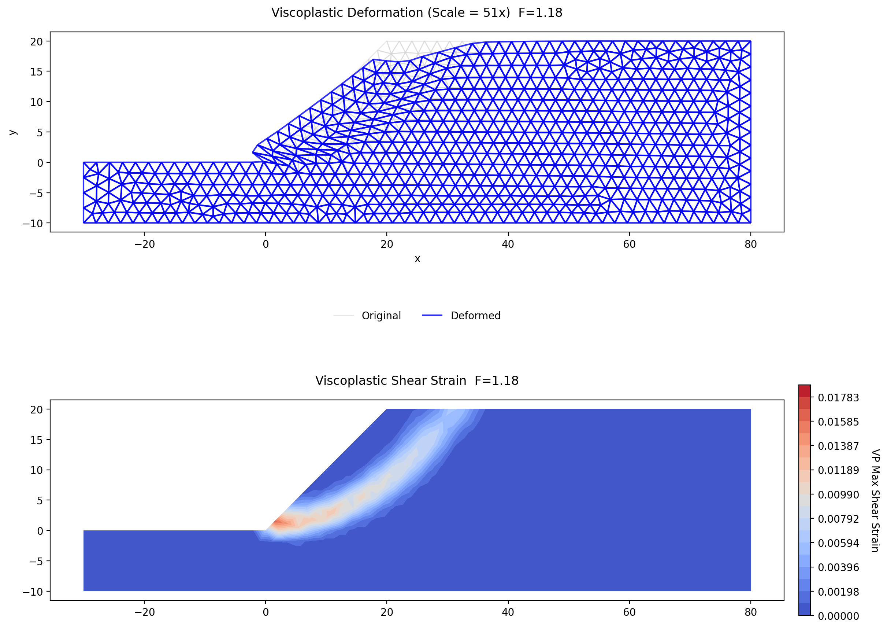

# Sample Problems - Finite Element Method

The following examples illustrate how to use XSLOPE's finite element capabilities for slope stability analysis using
the Shear Strength Reduction Method (SSRM). Each of the Excel input files below can be uploaded and used with the following Google Colab notebook which has been set up specifically for running FEM slope stability analyses:

<a href="https://colab.research.google.com/github/njones61/xslope/blob/main/notebooks/xslope_fem.ipynb" target="_"></a>

The FEM implementation is described in the [FEM Overview](overview.md) page.

### 1. Griffiths & Lane (1999) Example 1: Homogeneous Slope

This is the benchmark problem from Griffiths & Lane (1999), "Slope stability analysis by finite elements,"
*Geotechnique*, 49(3), 387-403. It features a homogeneous slope with the following properties:

| Property | Value |
|----------|-------|
| Cohesion, $c$ | 312.5 psf |
| Friction angle, $\phi$ | 20 degrees |
| Unit weight, $\gamma$ | 125 pcf |
| Young's modulus, $E$ | 700,000 psf |
| Poisson's ratio, $\nu$ | 0.3 |

The dimensionless parameter $c/\gamma H = 0.05$ with $\phi = 20°$ gives an expected factor of safety of
approximately 1.4 (Griffiths & Lane, 1999, Table 1).

Excel input file: [xslope_griffiths1.xlsx](files/xslope_griffiths1.xlsx)

Inputs plotted with the XSLOPE plot_inputs() function:

{width=1000}

FEM mesh with boundary conditions. Fixed supports (triangles) at the base, x-rollers (circles) on the sides:

{width=1000}

SSRM results. The computed factor of safety is **FS = 1.41**, in close agreement with the published result of
approximately 1.4. The top plot shows the deformed mesh at the last converged solution (F = 1.375). The bottom
plot shows the viscoplastic shear strain concentration, which reveals the circular failure mechanism without any
prior assumption about its shape or location.

{width=1000}

<!-- test: file=files/xslope_griffiths1.xlsx, type=fem_ssrm, expected_fs=1.41, element_type=quad8, target_size=3.5, tolerance=0.025, f_min=1.0, f_max=1.8 -->

### 2. Reinforced Slope with Geogrid Reinforcement

This problem features an engineered slope with six layers of geogrid reinforcement. It is the FEM counterpart of
the LEM reinforced slope example described in the [LEM Samples](../lem/samples.md) page (Problem 9). The slope
geometry and soil properties are the same, with the addition of elastic modulus and Poisson's ratio for the FEM
analysis:

| Property | Shell | Base |
|----------|-------|------|
| Cohesion, $c$ (psf) | 300 | 0 |
| Friction angle, $\phi$ (degrees) | 37 | 37 |
| Unit weight, $\gamma$ (pcf) | 130 | 130 |
| Young's modulus, $E$ (psf) | 1,000,000 | 1,000,000 |
| Poisson's ratio, $\nu$ | 0.3 | 0.3 |

A 240 psf surcharge is applied along the slope crest from $x = 30$ ft to $x = 100$ ft.

Six reinforcement lines are defined with the following properties:

| Property | Value |
|----------|-------|
| $T_{max}$ | 800 lb/ft |
| $T_{res}$ | 600 lb/ft |
| $L_{p1}$, $L_{p2}$ | 4 ft |
| $E$ | 800,000 psf |
| $Area$ | 0.1 ft$^2$/ft |
| $EA$ | 80,000 lb/ft |

Excel input file: [xslope_reinforce_fem.xlsx](files/xslope_reinforce_fem.xlsx)

Inputs plotted with the XSLOPE plot_inputs() function:

{width=1000}

FEM mesh with boundary conditions and reinforcement elements (red lines):

{width=1000}

SSRM results. This slope exhibits a **ductile** response: because the geogrid layers
mobilize progressively (and the deepest layers begin to pull out rather than rupture), the
viscoplastic displacement grows smoothly with the strength reduction factor and shows no
sharp displacement catastrophe — sweeps to F = 2.6 confirm steady growth with no knee. A
single SSRM factor of safety is therefore not well defined for this system in the way it is
for unreinforced slopes; the displacement-catastrophe criterion reports the onset of
significant plastic deformation at **F ≈ 1.2**, while the companion LEM analysis (fixed
reinforcement forces) gives FS = 1.55. Defining an appropriate SSRM failure measure for
ductile reinforced systems is an open item (see `plans/plan_comprehensive_audit.md`).
obtained using Janbu's method. The top plot shows the deformed mesh with original and deformed reinforcement
positions. The bottom plot shows the viscoplastic shear strain concentration with reinforcement elements colored by
axial force (blue = low, red = high). Gray elements at the left ends are inactive (no tension). Dashed black
elements at the right ends have pulled out. The reinforcement summary table is shown below.

{width=1000}

Reinforcement summary:

```bash
=== Reinforcement Summary ===
Line  Elems     Max T     Avg T  Tension  In Lp  At Tres  Broken  Status
--------------------------------------------------------------------------------
   1      9     324.6     172.0        9      4        0       0  OK
   2      9     598.7     468.1        7      4        0       1  PULLOUT
   3      9     706.9     559.1        7      4        0       1  PULLOUT
   4      9     796.5     610.7        6      4        0       2  PULLOUT
   5      9     773.0     572.7        7      4        1       1  YIELDED
   6      9     675.8     515.5        7      4        0       1  PULLOUT
--------------------------------------------------------------------------------

  OK: All elements within allowable capacity, no failures.
  PULLOUT: Elements near the reinforcement ends (within Lp) have failed due to insufficient embedment length. Interior elements are intact.
  YIELDED: One or more elements have exceeded Tallow and dropped to residual capacity Tres. The line is still carrying load at reduced strength.
```

<!-- test: file=files/xslope_reinforce_fem.xlsx, type=fem_ssrm, expected_fs=1.22, element_type=tri6, target_size=2, tolerance=0.05, f_min=1.2, f_max=1.8 -->

The results show that reinforcement lines 2-6 experience pullout failure at the right ends where the failure
surface intersects the reinforcement. Line 4 has one element that has yielded to residual capacity. The maximum
mobilized force is 780 lb/ft (line 5), which is close to but below the $T_{max}$ of 800 lb/ft.

### 3. Slope Stabilized with Drilled Shaft Piles

This problem features a 1:1 slope in a medium-stiff clay stabilized by two rows of drilled shafts.

{width=1000}

Excel input file: [xslope_piles_fem.xlsx](files/xslope_piles_fem.xlsx)

The soil properties are:

| Property | Value |
|----------|-------|
| Cohesion, $c$ | 200 psf |
| Friction angle, $\phi$ | 20 degrees |
| Unit weight, $\gamma$ | 120 pcf |
| Young's modulus, $E$ | 2,000,000 psf |
| Poisson's ratio, $\nu$ | 0.3 |

Two rows of vertical drilled shafts are placed at $x = 5$ ft and $x = 10$ ft along the slope face, both extending from the ground surface to $y = -10$ ft:

| Property | Value |
|----------|-------|
| Diameter, $D$ | 2.0 ft |
| Spacing, $S$ | 6.0 ft |
| Young's modulus, $E_{\text{pile}}$ | 518,400,000 psf (concrete, $f'_c$ = 4000 psi) |
| Moment of inertia, $I$ | $\pi D^4 / 64$ = 0.785 ft$^4$ (auto-computed from $D$) |
| Cross-sectional area, $A$ | $\pi D^2 / 4$ = 3.14 ft$^2$ (auto-computed from $D$) |
| Shear capacity, $V_{\text{cap}}$ | 46,000 lb |
| Moment capacity, $M_{\text{cap}}$ | 60,000 ft·lb |
| Fixity | free |

Each pile is modeled as a chain of 6-DOF Euler-Bernoulli beam elements with rotational DOFs at each node (see [FEM Piles](piles.md) for the formulation). The pile stiffness ($EI$ and $EA$) is scaled by $1/S$ to convert from per-pile to per-unit-width quantities. Unlike the LEM approach where the user provides a single force $H$, the FEM beam elements naturally develop resistance as the soil deforms around the pile. Bending moments are computed directly at each node, and structural capacity limits ($V_{\text{cap}}$, $M_{\text{cap}}$) are enforced through the viscoplastic correction loop.

FEM mesh with boundary conditions. The piles are shown as green line elements along the pile axes:

{width=1000}

SSRM results without piles (**FS = 1.19**). The shear strain concentration shows a failure mechanism passing through the toe:

{width=1000}

SSRM results with two rows of piles (**FS = 1.32**). The pile elements are colored by lateral (shear) force in the shear strain plot. The piles resist the sliding mass and the failure mechanism is modified by their presence:

{width=1000}

Pile summary:

```text
=== Pile Summary ===
Pile  Elems   Max |T|   Max |V|   Max |M|     V_cap     M_cap  Yielded  Status
--------------------------------------------------------------------------------
   1      7    1316.9    1277.3    5473.8    7666.7   10000.0    0/7  OK
   2      9    2512.0     583.4    2522.8    7666.7   10000.0    0/9  OK
--------------------------------------------------------------------------------
```

The two rows of piles increase the factor of safety from 1.19 to 1.32 — an 11% improvement. The maximum bending moment (5474 per unit width in Pile 1) reaches about 55% of the moment capacity ($M_{\text{cap}}/S$ = 10,000), indicating that the structural capacity does not govern for this problem. The soil's ability to transfer lateral load to the piles is the limiting factor, not the pile strength.

This is typical behavior for piles in relatively weak soil — the pile is much stiffer than the surrounding soil, and increasing the pile diameter or stiffness beyond a certain point produces diminishing returns. The 2D plane-strain model also does not capture the three-dimensional soil arching between piles that the Ito & Matsui theory accounts for in LEM, which can make the FEM result more conservative than the LEM result.

<!-- test: file=files/xslope_piles_fem.xlsx, type=fem_ssrm, expected_fs=1.21, element_type=tri6, target_size=2, tolerance=0.05, f_min=1.0, f_max=1.5 -->

### 4. Non-Circular Failure Surface with Thin Weak Layer

This is the FEM counterpart of the LEM non-circular failure surface example described in the [LEM Samples](../lem/samples.md)
page (Problem 7). The problem features a thin weak clay layer in the foundation of a slope, which controls the
failure mechanism. This problem was also featured in the user manual for the UTEXASED slope stability analysis
software developed by Stephen G. Wright at the University of Texas at Austin.

{width=900}

The slope geometry and strength properties are the same as the LEM problem. Young's modulus ($E$) and Poisson's
ratio ($\nu$) are estimated from typical correlations for each soil type:

| Soil | $c'$ (psf) | $\phi'$ (deg) | $\gamma$ (pcf) | $E$ (psf) | $\nu$ |
|------|:----------:|:--------------:|:---------------:|:---------:|:-----:|
| Sand Fill | 0 | 37 | 120 | 1,000,000 | 0.30 |
| Sand | 0 | 33 | 123 | 700,000 | 0.30 |
| Soft Clay ($S_u$ = 200) | 0 ($\phi = 0$) | 0 | 118 | 60,000 | 0.40 |
| Dense Sand | 0 | 37 | 131 | 1,500,000 | 0.28 |

The soft clay is modeled as an undrained material ($\phi = 0$) with $E/S_u \approx 300$. A Poisson's ratio of 0.40
is used rather than the theoretical undrained value of 0.5 to avoid numerical issues with near-incompressibility.

Excel input file: [xslope_noncircular_fem.xlsx](files/xslope_noncircular_fem.xlsx)

Inputs plotted with the XSLOPE plot_inputs() function:

{width=1000}

FEM mesh with boundary conditions and material zones:

{width=1000}

SSRM results. The computed factor of safety is **FS = 2.00**. The top plot shows the deformed mesh at the last
converged solution (F = 1.82). The middle plot shows the viscoplastic shear strain concentration, which clearly
reveals the non-circular failure mechanism passing through the thin weak clay layer — matching the expected behavior
without any prior assumption about the failure surface shape. The bottom plot shows the displacement vectors,
confirming lateral sliding of the slope mass along the clay layer.

{width=1000}

The FEM result of FS = 2.00 is higher than the LEM result of FS = 1.74 obtained using Spencer's method, consistent with the FEM-above-LEM offset observed on other problems with this geometry class.
This is consistent with the general observation that the SSRM tends to give slightly higher factors of safety than
LEM for non-circular mechanisms, since the FEM finds the natural failure mode through the global stress field rather
than being constrained to a prescribed failure surface geometry.

<!-- test: file=files/xslope_noncircular_fem.xlsx, type=fem_ssrm, expected_fs=2.00, element_type=tri6, target_size=2, tolerance=0.05, f_min=1.4, f_max=2.2 -->
