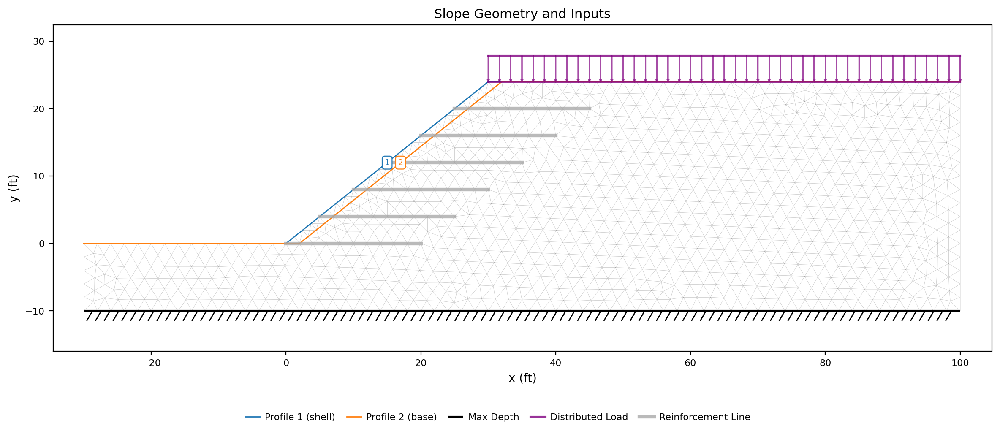
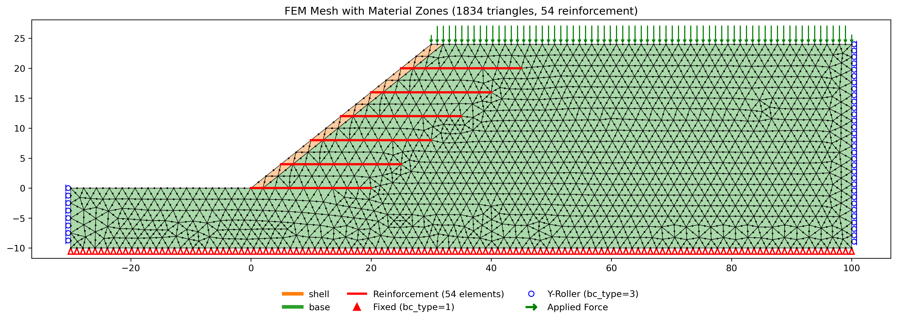
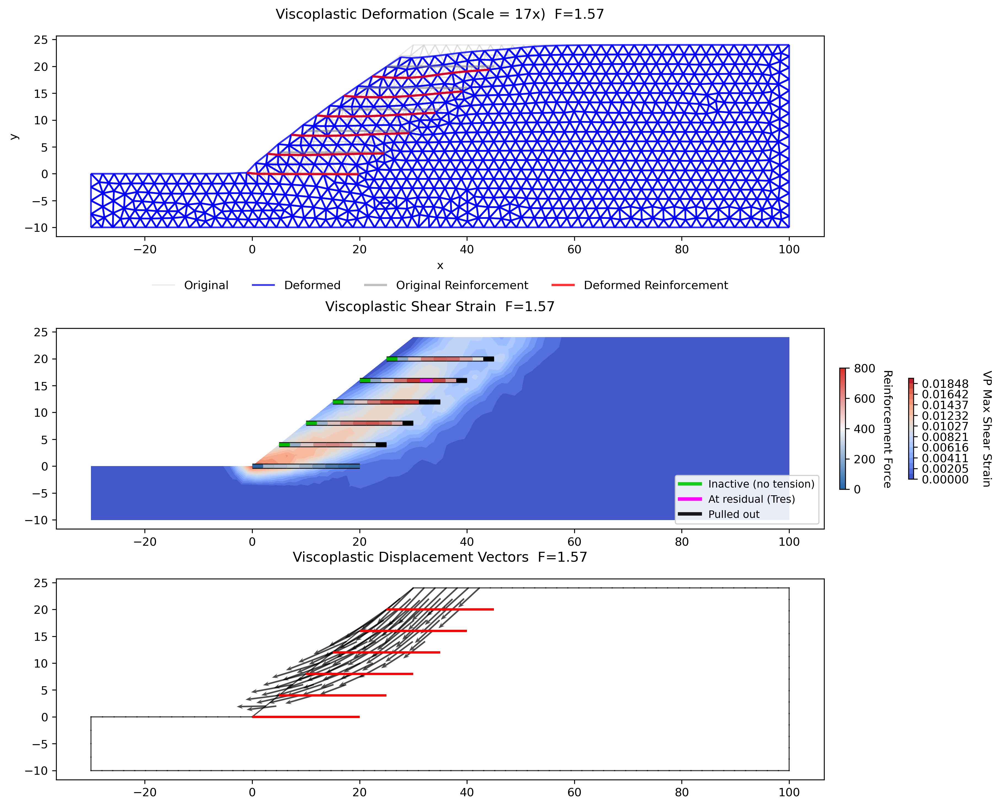

# Sample Problems - Finite Element Method

The following examples illustrate how to use XSLOPE's finite element capabilities for slope stability analysis using
the Shear Strength Reduction Method (SSRM). Each example includes an Excel input file that can be used with the
`main_fem.py` script. The FEM implementation is described in the [FEM Overview](overview.md) page.

### 1. Griffiths & Lane (1999) Example 1: Homogeneous Slope

This is the benchmark problem from Griffiths & Lane (1999), "Slope stability analysis by finite elements,"
*Geotechnique*, 49(3), 387-403. It features a homogeneous slope with the following properties:

| Property | Value |
|----------|-------|
| Cohesion, $c$ | 312.5 psf |
| Friction angle, $\phi$ | 20 degrees |
| Unit weight, $\gamma$ | 125 pcf |
| Young's modulus, $E$ | 700,000 psf |
| Poisson's ratio, $\nu$ | 0.3 |

The dimensionless parameter $c/\gamma H = 0.05$ with $\phi = 20°$ gives an expected factor of safety of
approximately 1.4 (Griffiths & Lane, 1999, Table 1).

Excel input file: [xslope_griffiths1.xlsx](files/xslope_griffiths1.xlsx)

Inputs plotted with the XSLOPE plot_inputs() function:

{width=1000}

FEM mesh with boundary conditions. Fixed supports (triangles) at the base, x-rollers (circles) on the sides:

{width=1000}

SSRM results. The computed factor of safety is **FS = 1.38**, which is consistent with the published result of
approximately 1.4. The top plot shows the deformed mesh at the last converged solution (F = 1.375). The bottom
plot shows the viscoplastic shear strain concentration, which reveals the circular failure mechanism without any
prior assumption about its shape or location.

{width=1000}

<!-- test: file=files/xslope_griffiths1.xlsx, type=fem_ssrm, expected_fs=1.38, element_type=quad8, target_size=3.5, tolerance=0.025, f_min=1.0, f_max=1.8 -->

### 2. Reinforced Slope with Geogrid Reinforcement

This problem features an engineered slope with six layers of geogrid reinforcement. It is the FEM counterpart of
the LEM reinforced slope example described in the [LEM Samples](../lem/samples.md) page (Problem 9). The slope
geometry and soil properties are the same, with the addition of elastic modulus and Poisson's ratio for the FEM
analysis:

| Property | Shell | Base |
|----------|-------|------|
| Cohesion, $c$ (psf) | 300 | 0 |
| Friction angle, $\phi$ (degrees) | 37 | 37 |
| Unit weight, $\gamma$ (pcf) | 130 | 130 |
| Young's modulus, $E$ (psf) | 1,000,000 | 1,000,000 |
| Poisson's ratio, $\nu$ | 0.3 | 0.3 |

Six reinforcement lines are defined with the following properties:

| Property | Value |
|----------|-------|
| $T_{max}$ | 800 lb/ft |
| $T_{res}$ | 600 lb/ft |
| $L_{p1}$, $L_{p2}$ | 4 ft |
| $E$ | 100,000 psf |
| $Area$ | 0.1 ft$^2$/ft |
| $EA$ | 10,000 lb/ft |

Excel input file: [xslope_reinforce_fem.xlsx](files/xslope_reinforce_fem.xlsx)

Inputs plotted with the XSLOPE plot_inputs() function:

{width=1000}

FEM mesh with boundary conditions and reinforcement elements (red lines):

{width=1000}

SSRM results. The computed factor of safety is **FS = 1.57**, which is consistent with the LEM result of FS = 1.55
obtained using Janbu's method. The top plot shows the deformed mesh with original and deformed reinforcement
positions. The bottom plot shows the viscoplastic shear strain concentration with reinforcement elements colored by
axial force (blue = low, red = high). Gray elements at the left ends are inactive (no tension). Dashed black
elements at the right ends have pulled out. The reinforcement summary table is shown below.

{width=1000}

Reinforcement summary:

```bash
=== Reinforcement Summary ===
Line  Elems     Max T     Avg T  Tension  In Lp  At Tres  Broken  Status
--------------------------------------------------------------------------------
   1      9     324.6     172.0        9      4        0       0  OK
   2      9     598.7     468.1        7      4        0       1  PULLOUT
   3      9     706.9     559.1        7      4        0       1  PULLOUT
   4      9     796.5     610.7        6      4        0       2  PULLOUT
   5      9     773.0     572.7        7      4        1       1  YIELDED
   6      9     675.8     515.5        7      4        0       1  PULLOUT
--------------------------------------------------------------------------------

  OK: All elements within allowable capacity, no failures.
  PULLOUT: Elements near the reinforcement ends (within Lp) have failed due to insufficient embedment length. Interior elements are intact.
  YIELDED: One or more elements have exceeded Tallow and dropped to residual capacity Tres. The line is still carrying load at reduced strength.
```

<!-- test: file=files/xslope_reinforce_fem.xlsx, type=fem_ssrm, expected_fs=1.57, element_type=tri6, target_size=2, tolerance=0.05, f_min=1.2, f_max=1.8 -->

The results show that reinforcement lines 2-6 experience pullout failure at the right ends where the failure
surface intersects the reinforcement. Line 4 has one element that has yielded to residual capacity. The maximum
mobilized force is 780 lb/ft (line 5), which is close to but below the $T_{max}$ of 800 lb/ft.
