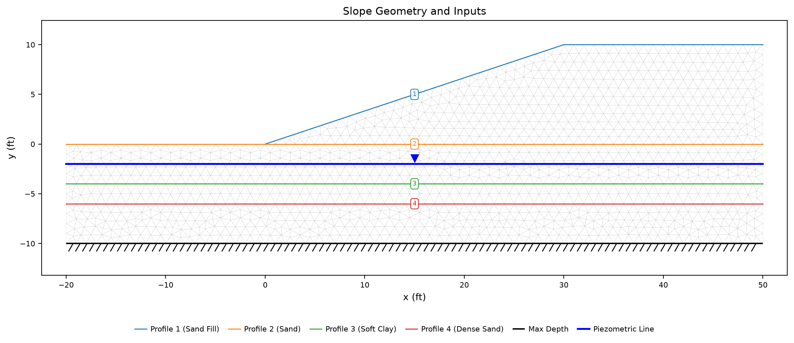
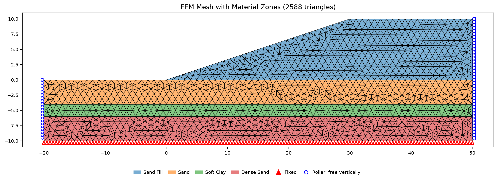
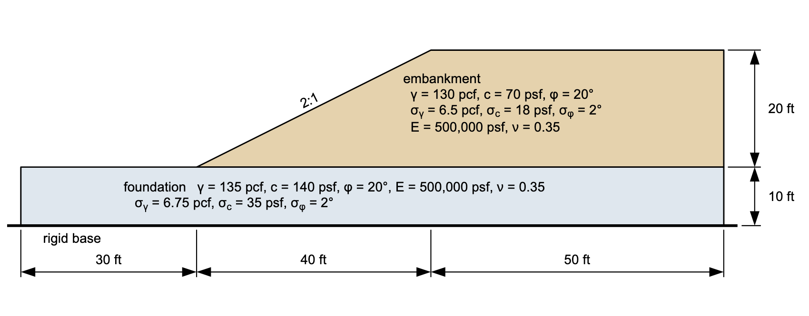

# Sample Problems - Finite Element Method

> **Verification benchmarks** (the Griffiths & Lane examples) are documented on the [FEM/SSRM verification page](../verification/ssrm.md).

The following examples illustrate how to use XSLOPE's finite element capabilities for slope stability analysis using
the Shear Strength Reduction Method (SSRM). Each of the Excel input files below can be uploaded and used with the following Google Colab notebook which has been set up specifically for running FEM slope stability analyses:

The FEM implementation is described in the [FEM Overview](overview.md) page.

### 1. Non-Circular Failure Surface with Thin Weak Layer

This is the FEM counterpart of the non-circular failure surface model of [Tutorial LEM-5](../tutorials/lem05_weak_layer_noncircular.md).
The problem features a thin weak clay layer in the foundation of a slope, which controls the
failure mechanism. This problem was also featured in the user manual for the UTEXASED slope stability analysis
software developed by Stephen G. Wright at the University of Texas at Austin.

{width=1000}

The slope geometry and strength properties are the same as the LEM problem. Young's modulus ($E$) and Poisson's
ratio ($\nu$) are estimated from typical correlations for each soil type:

| Soil | $c'$ (psf) | $\phi'$ (deg) | $\gamma$ (pcf) | $E$ (psf) | $\nu$ |
|------|:----------:|:--------------:|:---------------:|:---------:|:-----:|
| Sand Fill | 0 | 37 | 120 | 1,000,000 | 0.30 |
| Sand | 0 | 33 | 123 | 700,000 | 0.30 |
| Soft Clay ($S_u$ = 200) | 0 ($\phi = 0$) | 0 | 118 | 60,000 | 0.40 |
| Dense Sand | 0 | 37 | 131 | 1,500,000 | 0.28 |

The soft clay is modeled as an undrained material ($\phi = 0$) with $E/S_u \approx 300$. A Poisson's ratio of 0.40
is used rather than the theoretical undrained value of 0.5 to avoid numerical issues with near-incompressibility.

Excel input file: [xslope_noncircular_fem.xlsx](files/xslope_noncircular_fem.xlsx)

Inputs plotted with the XSLOPE plot_inputs() function:

{width=1000}

FEM mesh with boundary conditions and material zones. The soft clay layer is only 2 ft
thick, and the mesh must place at least two elements through its thickness to resolve the
shear band that controls the failure mechanism, which requires a target element size of
1.0 ft (or finer). A coarser mesh stiffens the thin layer artificially and distorts the
strain field within it:

{width=1000}

SSRM results. The computed factor of safety is **FS = 1.616**. The plots show the slope
at failure. The middle plot shows the concentration of viscoplastic shear strain, which
follows a non-circular failure mechanism through the thin weak clay layer. The finite
element solution finds this shape without any assumption about the shape of the failure
surface. The bottom plot shows the displacement vectors, with the slope mass sliding
laterally along the clay layer.

{width=1000}

<!-- mesh resolution: the 2-ft soft clay layer needs >=2 elements through its thickness;
     target_size=1.0 or finer -->
<!-- test: file=files/xslope_noncircular_fem.xlsx, type=fem_ssrm, expected_fs=1.616, element_type=tri6, target_size=1, tolerance=0.01, f_min=1.4, f_max=2.2, max_iter=16000 -->

### 2. Reliability Analysis: Two-Layer c–φ Slope

This example is a **finite-element reliability analysis**. It uses the same
Taylor Series Probability Method as the [LEM reliability analysis](../reliability/taylor.md),
with each factor of safety computed by SSRM. See
[Reliability Analysis (FEM)](../reliability/fem.md) for the method.

{width=1000}

Excel input file: [xslope_simple_mult_layers_fem.xlsx](files/xslope_simple_mult_layers_fem.xlsx)

It uses the geometry of the layered slope of
[Tutorial LEM-3](../tutorials/lem03_layered_slope.md), an embankment
over a foundation layer. The elastic properties ($E$, $\nu$) are added for the
finite-element solve, and the strengths are lowered to give a **marginally stable c–φ slope**
whose probability of failure is not negligible:

| Material   | $c$ | $\phi$ | $\gamma$ | $E$     | $\nu$ | $\sigma_c$ (COV) | $\sigma_\phi$ (COV) | $\sigma_\gamma$ (COV) |
|------------|----:|-------:|---------:|--------:|------:|-----------------:|--------------------:|----------------------:|
| Embankment |  70 |    20° |      130 | 500,000 | 0.35  |  18 (26%)        |  2 (10%)            |  6.5 (5%)             |
| Foundation | 140 |    20° |      135 | 500,000 | 0.35  |  35 (25%)        |  2 (10%)            |  6.75 (5%)            |

Running the analysis (`reliability_fem`, or **Studio → Run FEM → Reliability**)
on a **tri6 mesh** (50 divisions across the width, target_size ≈ 2.4, ~2080 nodes)
gives:

| $F_{MLV}$ | $\sigma_F$ | $COV_F$ | $\beta_{LN}$ | Reliability $R$ | $P_f$ |
|----------:|-----------:|--------:|-------------:|----------------:|------:|
| 1.143     | 0.122      | 0.107   | 1.196        | **88.4%**       | 11.6% |

The most-likely factor of safety is 1.14, and with the moderate parameter scatter
in the table above the probability of failure is **≈11.6%**. A factor of safety
above 1.0 does not by itself mean a low probability of failure.

The per-parameter ΔF table shows how much each parameter changes the factor of safety:

| Parameter        | MLV | σ    | $F^+$ | $F^-$ | ΔF    |
|------------------|----:|-----:|------:|------:|------:|
| Embankment $\phi$ |  20 | 2    | 1.235 | 1.052 | 0.182 |
| Embankment $c$    |  70 | 18   | 1.220 | 1.059 | 0.160 |
| Embankment $\gamma$ | 130 | 6.5 | 1.127 | 1.159 | 0.031 |
| Foundation $\phi$ |  20 | 2    | 1.143 | 1.143 | 0.000 |
| Foundation $c$    | 140 | 35   | 1.143 | 1.143 | 0.000 |
| Foundation $\gamma$ | 135 | 6.75 | 1.143 | 1.143 | 0.000 |

The foundation's properties have ΔF = 0. The critical failure mechanism stays
within the weaker embankment and does not reach the stronger foundation, so the
foundation's strength and its uncertainty have no effect on the factor of safety.
The embankment's friction angle and cohesion have the largest ΔF values and
account for most of the uncertainty in the factor of safety. The Taylor Series
method gives each parameter's contribution directly as its ΔF.

!!! note "Mesh dependence of the result"
    These numbers are for the tri6 mesh above. A finer mesh, or a different element
    type, gives a slightly different factor of safety and therefore a different
    reliability. The FEM factor of safety decreases toward the LEM value as the mesh
    is refined (on this slope, quad8 at target_size 2 gives FS ≈ 1.25, against LEM's
    1.244). For a **fixed mesh** the reliability is reproducible: `reliability_fem`
    runs each SSRM on a fixed global grid, so the result is identical to every
    decimal for any `F_min`/`F_max` bracket. See
    [Numerical precision](../reliability/fem.md#numerical-precision-and-reproducibility).
    The reliability index is more sensitive to the mesh than the factor of safety
    is. With $COV_F$ essentially unchanged, $\beta_{LN} \approx \ln F_{MLV} / \sqrt{\ln(1+COV_F^2)}$,
    so a *relative* change in the factor of safety produces a relative change in
    $\beta_{LN}$ about $1/\ln F_{MLV}$ times as large, or about seven times at the
    $F_{MLV} \approx 1.15$ of this slope. Near $F_{MLV} = 1$, a change of a couple of
    percent in the factor of safety changes the reliability index, and the
    probability of failure with it, by ten times as much.

<!-- FEM reliability regression (marginally-stable two-layer slope). 13 SSRM solves, so it runs
     on a deliberately coarse 253-element mesh (target_size=5): at 2.4 this one test WAS the suite's
     wall clock (~510s; 5.0 runs in ~110s). beta is mesh-dependent but bit-reproducible for a fixed
     mesh, and the test guards the TSPM-over-SSRM pipeline, not mesh convergence. -->
<!-- test: file=files/xslope_simple_mult_layers_fem.xlsx, type=fem_reliability, expected_beta=1.356, tolerance=0.1, element_type=tri6, target_size=5.0, f_min=0.7, f_max=1.6, ssrm_tol=0.001, benchmark=REL-FEM -->

---

**[Griffiths & Lane (1999)](https://doi.org/10.1680/geot.1999.49.3.387).** XSLOPE's finite-element slope-stability
solver follows the methodology of
[Griffiths & Lane (1999)](https://doi.org/10.1680/geot.1999.49.3.387), "Slope
stability analysis by finite elements" (*Géotechnique* 49(3), 387–403): a
plane-strain elasto-plastic (Mohr–Coulomb) formulation solved by viscoplastic
**strength reduction**, with the factor of safety located by the
**non-convergence criterion**. The verification set reproduces **all six** of the
paper's worked examples:

- [Example 1 — homogeneous slope](../verification/ssrm.md#verification-griffiths1)
- [Example 2 — foundation layer, the false base circle](../verification/ssrm.md#verification-griffiths2)
- [Example 3 — undrained clay with a thin weak layer](../verification/ssrm.md#verification-griffiths3) — a sweep read from the paper's Fig. 7, and the two competing mechanisms
- [Example 4 — undrained clay over a weak foundation](../verification/ssrm.md#verification-griffiths4) — the mechanism changes from a base failure to a toe failure
- [Example 5 — "slow" drawdown sweep](../verification/ssrm.md#verification-griffiths5) — pore pressure and reservoir load
- [Example 6 — two-sided earth dam](../verification/ssrm.md#verification-griffiths6)

Each is documented with its geometry, mesh and factor of safety on the
[FE Slope Stability (SSRM)](../verification/ssrm.md) verification page. The
[Verification](../verification/index.md) page gives an overview of the whole
verification set.
