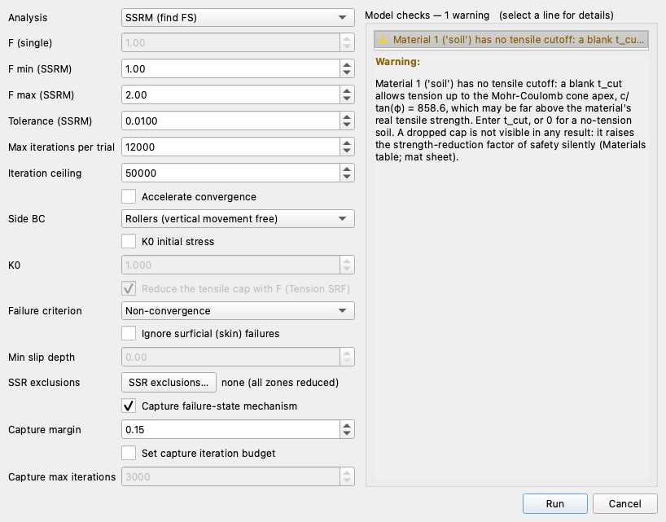
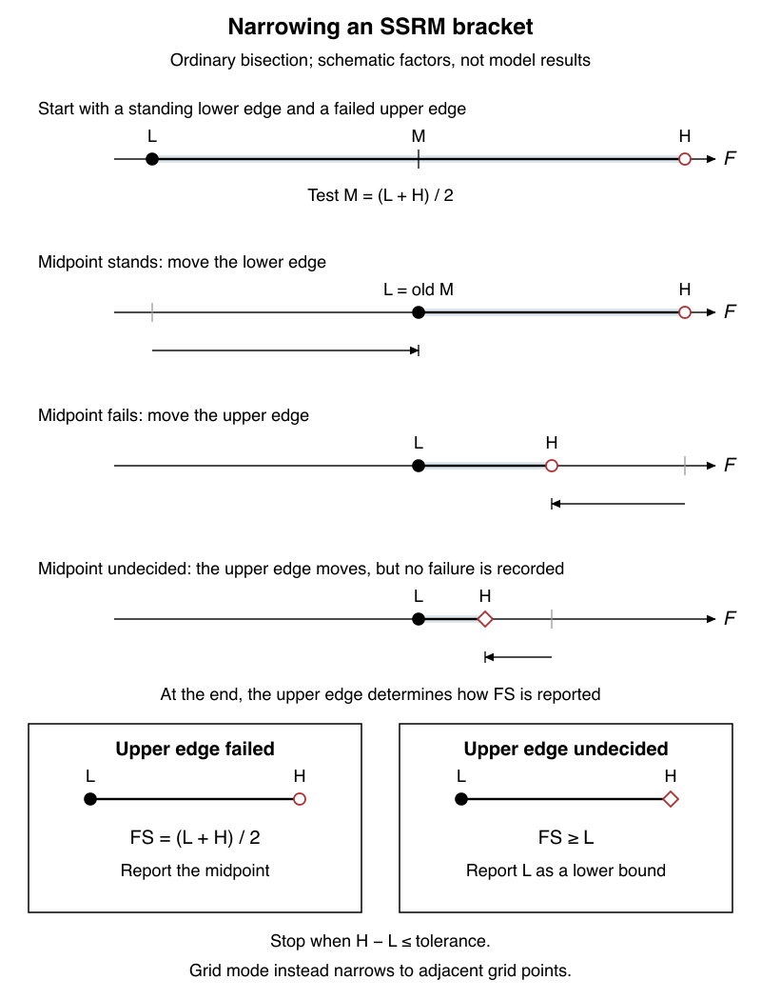
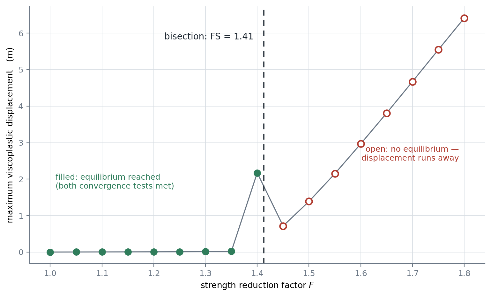
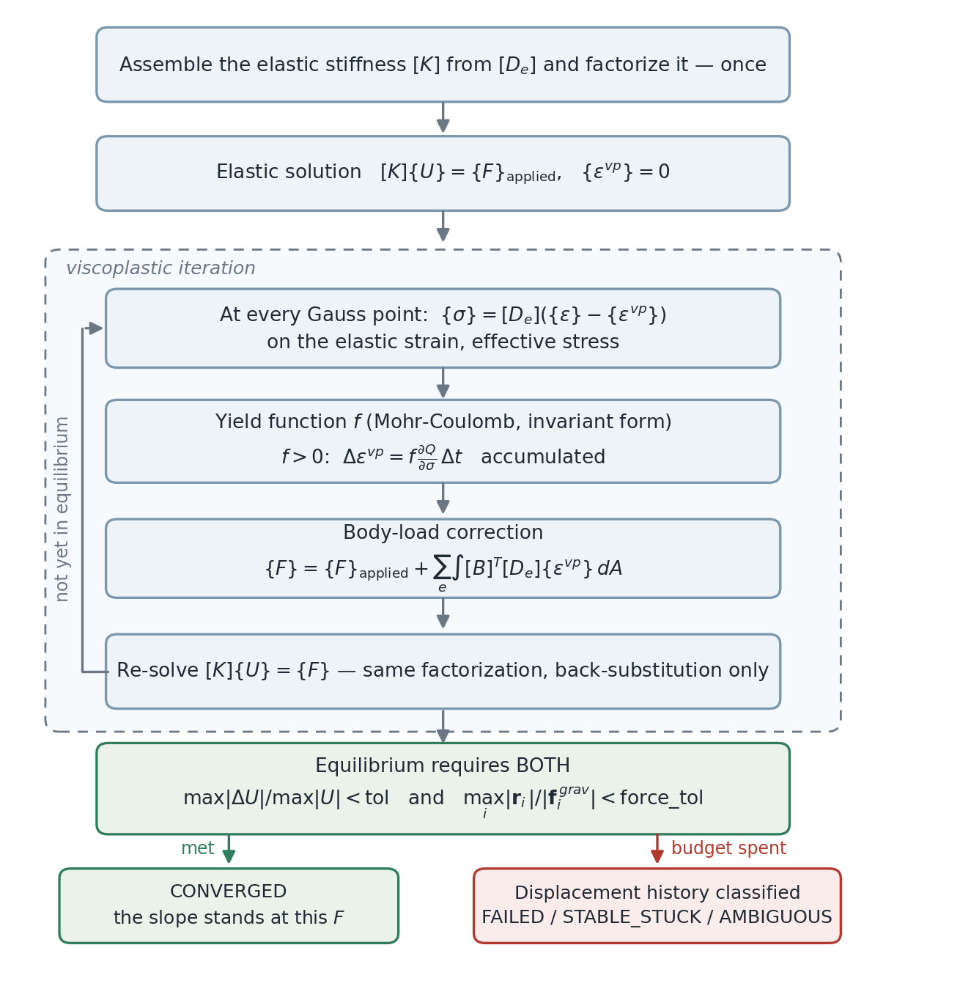
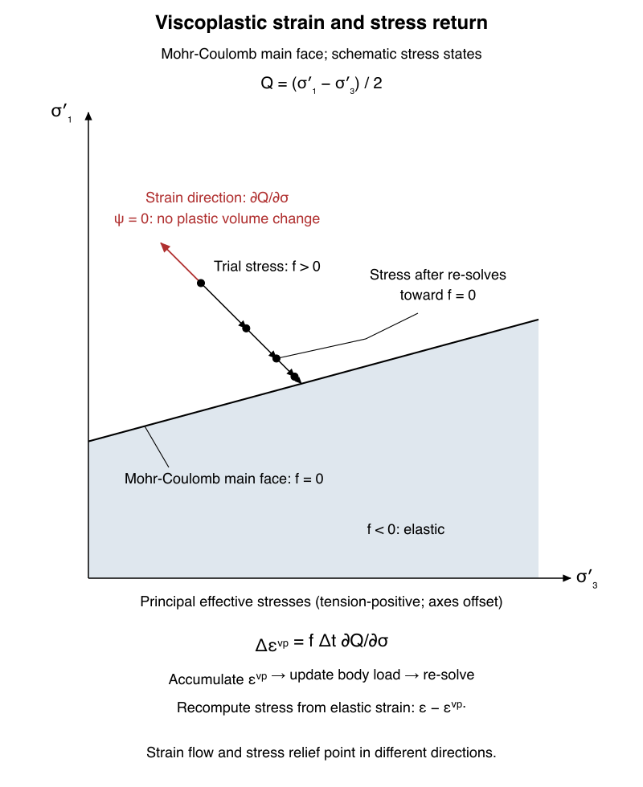
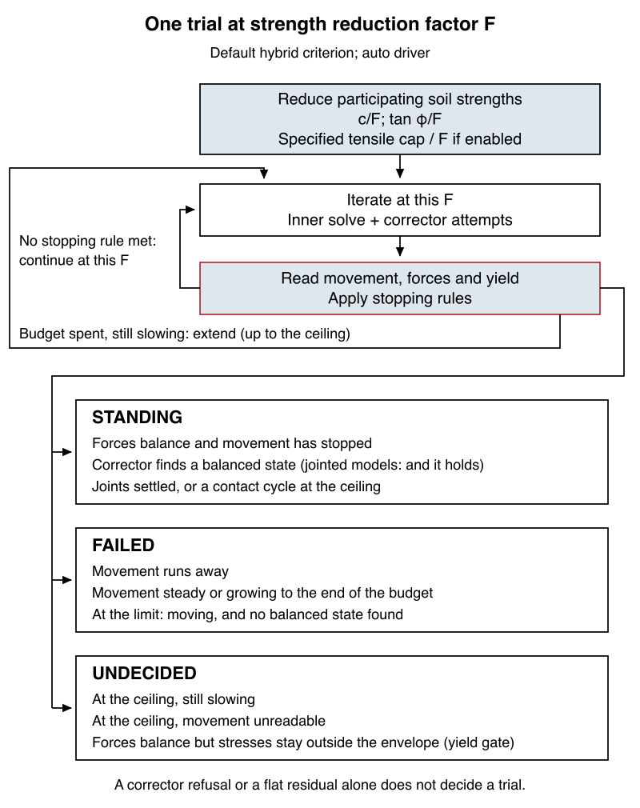
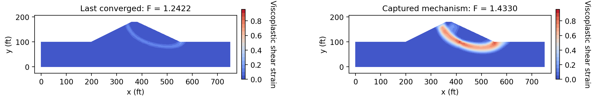
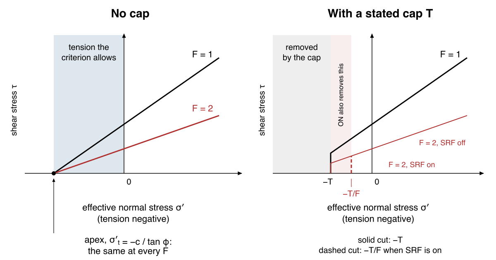

# Solver

XSLOPE's finite element solver computes the factor of safety of a slope by the shear strength
reduction method (SSRM). Starting from the model the [Overview](overview.md) describes (mesh, materials,
loads, boundary conditions and initial stress), it reduces the selected soil and joint shear strengths by a trial
factor F and iterates the model until the slope either comes to rest or shows that it cannot. A
search over F brackets the value at which the slope stops standing; that value is the factor of
safety. A single trial at a chosen F can also be run on its own, to see the stresses and
deformations at that strength. The iteration, the rules that decide a trial, the search and the
solve that draws the failure mechanism each have settings, whether the solver is run from Studio,
from a script with `solve_fem()` and `solve_ssrm()`, or from the input file.

## Run settings

In Studio the settings are made in the Run FEM dialog, shown below. The table that follows lists
them in the dialog's order and gives, for each, the cell on the Excel main sheet and the argument
of `solve_fem()` or `solve_ssrm()` that sets the same thing; a dash means there is none, and
arguments that apply only to a search belong to `solve_ssrm()`. The table is a map of this page:
each setting links to the section that explains what it controls and how to choose it, and the
sections follow in the order the solver uses them, from the strength reduction method itself
through a single trial, the rules that decide it, the search, and the options that shape the
mechanism.

{width=818}

| Dialog control | Excel input | API setting | Meaning |
|---|---|---|---|
| Analysis | — | `solve_fem()` or `solve_ssrm()` | [Single trial](#the-solve_fem-function) or [strength reduction search](#methodology). |
| F (single) | — | `solve_fem(F=)` | [Strength reduction factor](#the-solve_fem-function), default 1.0. |
| F min (SSRM) | `main!D21` | `solve_ssrm(F_min=)` | [Starting bracket](#the-solve_ssrm-function), default 1.0. |
| F max (SSRM) | `main!D22` | `solve_ssrm(F_max=)` | [Starting bracket](#the-solve_ssrm-function), default 2.0. |
| Tolerance (SSRM) | — | `solve_ssrm(tolerance=)` | [Final bracket width](#the-solve_ssrm-function), default 0.01; not the displacement convergence tolerance. |
| Max iterations per trial | — | `max_iterations=` (both functions) | [Trial budget](#creep-trend), default 12000. |
| Iteration ceiling | — | `max_iterations_ceiling=` (both functions) | [Hard limit on budget extensions](#creep-trend), default 50000. |
| Accelerate convergence | — | `accelerate=` (both functions) | [Lengthen admissible iteration steps](#jointed-model-acceleration); `False` runs the ordinary iteration. |
| Side BC | `main!D23` | `build_fem_data()` reads `slope_data['side_bc']`; no solve argument | [Side restraint](overview.md#what-xslope-assigns-automatically), rollers by default. |
| K0 initial stress | `main!D16` (blank disables) | `k0=` (both functions) | [At-rest initialization and equilibration](#in-situ-equilibration), off when unspecified. |
| K0 | `main!D16` | `k0=` (both functions) | [At-rest lateral stress coefficient](#in-situ-equilibration); the dialog value starts at 1.0 when enabled. |
| Reduce the tensile cap with F (Tension SRF, strength reduction factor) | `main!D17` | `tension_srf=` (both functions) | [Reduce a stated positive tensile cap](#tensile-strength-in-ssrm), on by default. |
| Failure criterion | — | `failure_criterion=` (both functions) | [Trial classification](#ssrm-failure-criteria); the API default is `hybrid`. |
| Ignore surficial (skin) failures | — | `min_slip_depth=None` disables (both functions) | [Depth filter](#surficial-skin-failures-and-the-minimum-slip-depth-filter), off by default. |
| Min slip depth | — | `min_slip_depth=` (both functions) | [Depth below ground](#surficial-skin-failures-and-the-minimum-slip-depth-filter), in model length units. |
| SSR exclusions… | `polygon` sheet SSR zones; no cell for the material picker | `solve_ssrm(ssr_exclude=)`; `ssr_zone=` for a search polygon | [Hold selected regions at full strength](#ssr-exclusion-zones). |
| Capture failure-state mechanism | — | `solve_ssrm(capture_failure_state=)` | [One at-failure solve after the search](#the-solve_ssrm-function), on by default. |
| Capture margin | — | `solve_ssrm(capture_margin=)` | [Capture factor above FS](#the-solve_ssrm-function), default 0.15 of FS. |
| Set capture iteration budget | — | `solve_ssrm(capture_max_iterations=None)` uses the automatic budget | [Override the capture budget](#the-solve_ssrm-function). |
| Capture max iterations | — | `solve_ssrm(capture_max_iterations=)` | [Capture ceiling](#the-solve_ssrm-function); automatic budget is `max(max_iterations, 3000)`. |

The [Studio page](../studio/analysis.md#finite-element-fem) describes model checks,
running, cancellation, continuation and result controls. For a transient seepage model,
the additional [Seepage time](../studio/analysis.md#seepage-time) control selects the
instant used for pore pressures.

## Shear strength reduction method (SSRM)

The SSRM
(Matsui & San, 1992; Griffiths & Lane, 1999) reduces soil strength until the
finite element system can no longer find equilibrium under the applied loads, without assuming
a failure surface. The reduction factor at that transition is the factor of safety, consistent
with the limit-equilibrium definition.

### Methodology

Each trial divides both strength components by the trial factor,

>>$c_r = \dfrac{c}{F}$<br>
$\tan \phi_r = \dfrac{\tan \phi}{F}$

reducing $\tan\phi$ rather than $\phi$ so the scheme stays well behaved as the friction angle
approaches zero. As $F$ rises, more Gauss points yield, displacements grow, and at some point the
[viscoplastic iteration](#elastic-plastic-behavior-viscoplastic-algorithm) (described next)
stops reaching equilibrium at all. `solve_ssrm()` brackets that transition
and bisects it.

A bracket has a lower factor at which the slope stands and an upper factor at which it fails.
Bisection tests the midpoint and replaces the appropriate end with that trial's factor, narrowing
the interval until it reaches the requested tolerance. A trial that ends neither standing nor failed (undecided, see
[Trials that reach the iteration limit](#creep-trend)) is not counted as a failure:
the bisection continues below it.

In the bracket below, L is the standing lower edge and H is the upper edge.

{width=800px}

The arrows show which edge changes; an undecided H leaves FS as a lower bound rather than a
midpoint estimate.

The starting bracket is `F_min` = 1.0 and `F_max` = 2.0. If the slope fails at `F_min` or
stands at `F_max`, the bracket **auto-expands** in steps of `f_adjust` (0.25) until it is
valid, bounded by `f_min_floor` (0.1), `f_max_ceiling` (10.0) and `max_expand` (20 steps each
way).

The figure below solves the [Griffiths & Lane Example 1](../verification/ssrm.md#verification-griffiths1)
sample at fixed factors on a deliberately coarse tri6 mesh with target element size 6:

{width=760}

Trials below the critical factor reach equilibrium; trials above it are still moving when stopped.
The bisection brackets the change in verdict — here 1.41 on
this illustration mesh (4,000 iterations per trial, fixed factor grid 0.025), against the paper's
1.4. The [SSRM-1 verification row](../verification/ssrm.md#verification-griffiths1) instead uses
quad8 elements at target size 3.5 and 16,000 iterations per trial. The converged point at $F = 1.40$
lies above the stopped point at $F = 1.45$: the latter is not an equilibrium displacement.
The displacement of a failing trial depends on the iteration budget it was given, which is
why the bisection uses the trial's verdict (standing, failed or undecided; see
[SSRM failure criteria](#ssrm-failure-criteria)) rather than the displacement magnitude.

## Elastic-plastic behavior: the viscoplastic algorithm {#elastic-plastic-behavior-viscoplastic-algorithm}

At a fixed trial factor, the solver reduces the material strengths and seeks equilibrium
under the applied loads. The **viscoplastic algorithm** of
[Griffiths & Lane (1999)](https://doi.org/10.1680/geot.1999.49.3.387) and Smith & Griffiths (2004)
returns stress a Gauss point cannot carry as a body load built from accumulated viscoplastic
strains. The elastic stiffness matrix is assembled and factorized **once**, then reused by
back-substitution for every iteration of every strength reduction trial.

The yield function $f$ defined on the [Overview](overview.md#mohr-coulomb-failure-criterion)
describes a surface in stress space, drawn below: for a stress state inside it, $f < 0$ and the
soil is elastic; on it, $f = 0$ and the soil is at failure; outside it, $f > 0$ and the state is one
the soil cannot carry.


The viscoplastic algorithm lets a Gauss point's stress go outside the surface for one iteration,
measures how far outside it is (the value of $f$), and turns that excess into plastic strain, which
brings the stress back toward the surface at the next solve. The direction of the plastic strain
comes from a second function, the plastic potential $Q$; XSLOPE takes the dilation angle $\psi$ as zero,
so $Q$ is the Mohr-Coulomb function with $\phi$ set to zero and the plastic flow is pure shear with no
change of volume. The accumulated plastic strain is written $\varepsilon^{vp}$. The stress state's position
relative to the surface is measured through three invariants, which do not depend on the axes:
the mean stress $\sigma_m$, the deviatoric stress $\bar{\sigma}$ (a measure of the shear) and the Lode
angle $\theta$ (which of the surface's six faces the state is nearest).

The loop below runs at every trial factor: solve, compute stresses, check yield, accumulate
viscoplastic strain, update the body load.

{width=700}

### The iteration {#viscoplastic-iteration-process}

At each Gauss point on each iteration:

>- Total in-plane strains come from the current displacements, $\{\varepsilon\} = [B]\{u_e\}$, and
>  the **elastic** strains are $\{\varepsilon\} - \{\varepsilon^{vp}\}$, with
>  $\varepsilon_z^{el} = -\varepsilon_z^{vp}$ (total $\varepsilon_z = 0$). Using the elastic strain
>  rather than the total strain accounts for the stress relief already taken by plastic flow.<br>
>- The stress $\{\sigma\} = [D_e^{4}]\{\varepsilon^{el}\}$ is reduced to the invariants
>  $\sigma_m$, $\bar{\sigma}$ and $\theta$, and the yield function is evaluated in
>  invariant form.<br>
>- Where $f > 0$, a viscoplastic strain increment
>  $\Delta\varepsilon^{vp} = f \cdot \partial Q/\partial\sigma \cdot \Delta t$ is accumulated, where
>  $\Delta t$ is the pseudo-time step, a numerical parameter defined below, using
>  the non-associated plastic potential with dilation angle $\psi = 0$ (no plastic volume change).
>  Close to the corners of the surface, where the flow direction is not defined, the direction
>  is held at the corner value.<br>
>- The accumulated strains form the body-load correction
>  $\{F\} \mathrel{+}= \sum_{e} \int [B]^T [D_e] \{\varepsilon^{vp}\} \, dA$, and the system is
>  re-solved with the existing factorization.

The figure shows a Mohr-Coulomb shear return in a two-dimensional principal-stress section.

{width=800px}

The plastic strain flows along $\partial Q/\partial\sigma$, while the stress is carried back
toward the surface in a different direction.

Stress is carried in the 4-component plane-strain form of Smith & Griffiths (their nst = 4), with
$\sigma_z$ explicit so the algorithm can relax it through plastic $\varepsilon_z$.

The **pseudo-time step** $\Delta t$ sets how much plastic strain is accumulated in one iteration.
It is a numerical parameter, not a time; XSLOPE uses $\Delta t = 4(1+\nu)/(3E)$, the value in
Smith & Griffiths' Program 6.1, which keeps the iteration stable where a stress state sits in
slight effective tension. Because the displacement change per iteration scales with $\Delta t$,
the convergence tolerance and the failure criteria are calibrated to this value;
[`dt_scale`](#the-solve_fem-function) changes it and should be left at 1.

A **tension cutoff** runs as a second viscoplastic yield surface through the same mechanism; because
it mainly affects SSRM results rather than ordinary stress analyses, it is described under
[Tensile strength in the SSRM](#tensile-strength-in-ssrm).

## Deciding a trial: convergence, corrector and yield check {#convergence-criterion}

A trial ends standing, failed or undecided. Three mechanisms decide it: the convergence tests,
the Newton corrector for slow trials, and the yield check.

The inner iteration updates stresses and loads; the outer loop below reads its results and
decides the trial.

{width=800px}

The return arrows keep $F$ fixed; the three outcome branches end this trial.

1. **Displacement settled** — Smith & Griffiths' CHECON test: the largest displacement change
   between iterations, divided by the largest current displacement, is below a tolerance:

>>$\dfrac{\max_i |U_i^{(k+1)} - U_i^{(k)}|}{\max_i |U_i^{(k+1)}|} < \text{tol}$

2. **Force equilibrium** — the criterion of
   [Dawson, Roth & Drescher (1999)](https://doi.org/10.1680/geot.1999.49.6.835): the out-of-balance
   force at every node, measured against that node's own weight, is below a tolerance:

>>$\displaystyle\max_i \dfrac{|\,\mathbf{r}_i\,|}{|\,\mathbf{f}^{\,grav}_i\,|} < \text{force\_tol}$

The force residual is the change in the viscoplastic body load from one iteration to the next,
averaged over ten iterations (the default for `oob_window`) to remove a known two-iteration
oscillation. Because the residual is measured node by node against that node's own weight,
enlarging the model does not dilute it.

The displacement test alone can pass on a slope creeping toward failure. The force test alone
can stall above its tolerance on a slope that is standing still, which is why the
[hybrid criterion](#2-hybrid-hybrid-default), the default, also reads the displacement field
directly.

The defaults are $\text{tol} = 10^{-3}$ for displacement and $\texttt{force\_tol} = 10^{-3}$
for force equilibrium, with a budget of `max_iterations` = 12000 per trial. A few thousand
iterations is normal well below failure, but the count climbs steeply near the critical factor
and with mesh refinement: the same reinforced slope reaches equilibrium at $F = 1.25$ in
5,054 iterations at 2.5 ft element size and 16,242 at 1 ft. These tests use the
[pseudo-time step](#elastic-plastic-behavior-viscoplastic-algorithm) described above; changing
`dt_scale` changes their calibration.

A single solve at $F = 1$ is a useful check on a submerged model: flooded ground at working
strength should settle quickly with an almost elastic strain field; if it does not, check
whether the loads and the boundary pore pressures disagree.

### Finishing a trial with the Newton corrector

The viscoplastic iteration approaches equilibrium from outside the yield surface, and its
convergence rate is linear, so a trial near the critical strength can spend tens of thousands of
iterations still improving and still undecided. XSLOPE runs a second, locally quadratic iteration on
top of it. The viscoplastic loop drives the solve and builds the plastic history; at a short series
of checkpoints — 300, 1,000 and 3,000 viscoplastic passes — at every block end where the
[trend reading](#creep-trend) finds the movement dying away, and again wherever one of the [iteration-limit rules](#creep-trend) would end the trial, the current displacement field and plastic strains are handed to a
single bounded Newton-Raphson solve at full gravity and this trial's reduced strengths. That solve
uses the consistent tangent of the Mohr-Coulomb return map, and from a starting state that has
already followed the load path it reaches equilibrium in tens of iterations where the viscoplastic loop needs
thousands.

A state the corrector returns ends the trial as standing only when it passes three checks:

>- **Force equilibrium** — the per-node Dawson measure described above, below `force_tol`, read on
>  the true residual at full gravity.<br>
>- **Yield** — the largest Mohr-Coulomb violation anywhere in the mesh, as a fraction of the local
>  strength, at or below $10^{-6}$. A field can be in force balance and still carry stress the
>  material cannot hold.<br>
>- **Displacement** — the translational movement below a tenth of the model height, read on the deep
>  degrees of freedom wherever a [`min_slip_depth`](#surficial-skin-failures-and-the-minimum-slip-depth-filter) filter is in force.

**When the corrector does not certify a state.** Where any of the checks fails, or the Newton solve does not
converge, the attempt is recorded and control returns to the viscoplastic loop with nothing about
its state changed — the corrector works on a copy of the displacement field and of every plastic
strain, so an attempt that fails leaves the continuing iteration unchanged. The loop then runs on
to its next checkpoint or to its own exit exactly as it would have. The corrector can therefore turn
a trial that the [iteration-limit rules](#creep-trend) would have ended into one certified as standing, but it cannot make
a trial fail.

A trial the corrector decides carries a record of how, under `corrector`: which checkpoint produced
the certified state, how many viscoplastic passes seeded it, the corrector's iterations and force
evaluations, the three readings against their limits, and every attempt made along the way.
`iterations` counts the seed's passes plus the corrector's, so a trial is charged for all the work
that produced it.

### The yield check

Every solved field carries an admissibility reading taken in invariant form: the largest
Mohr-Coulomb violation as a fraction of the local strength (`max_yield_violation`), the count of
Gauss points more than 1% of their strength outside the surface (`n_yield_above_1pct`), the same
pair for the [Rankine tension surface](#tensile-strength-in-ssrm), and where in the mesh the worst violation sits
(`max_yield_at`). It is one pass over the Gauss points and costs no solve.

The strength scale the violation is divided by, $c\cos\phi + |\sigma_m|\sin\phi$, carries an
**absolute floor** of $10^{-4}$ of the model's own overburden scale — the largest unit weight in the
model, $\gamma_{sat}$ included, times the mesh height, so the floor is in the model's stress units
whatever they are. The floor matters
because both terms of that scale vanish together in a cohesionless material near a free surface. A
Gauss point there can carry a fraction of a millipascal of numerical residue over a strength scale
of a few tens of micropascals and read as several times its own strength outside the surface, which
is a statement about the denominator rather than about the slope. The floor is orders of magnitude
below any stress that carries a mechanism, so it leaves a real violation exactly where it was.

A viscoplastic state that satisfies both convergence conditions but
sits more than $10^{-2}$ of the local strength outside the yield surface does not end the trial: it
is handed to the corrector, and where the corrector certifies an admissible field the trial stands
on that. The force test cannot see this on its own, because the viscoplastic scheme is in force
balance at every iteration and yield is what it relaxes.

The threshold is looser than the corrector's $10^{-6}$ because the two states are reached in
different ways. A Newton state solves the equations the reading is taken from and measures $10^{-8}$
or better. A viscoplastic state approaches the surface from outside along the relaxation and stops
when the *displacement* increment settles, so what is left of its yield violation is set by a
displacement tolerance and not by a yield one; holding it to the corrector's figure would reject
most of the verification states, which have simply not finished relaxing. $10^{-2}$ is where that
residual ends and unrelaxed yield begins, and it is also the fraction the reported Gauss-point count
is taken against, so the check and the reported count are consistent.

**When the yield check ends a trial.** The yield gate — the rule that ends a trial on the yield
check — arms only when both readings show that
the loop has stopped changing: the residual has reached a **no-progress plateau** — 1500 iterations without
improving the lowest out-of-balance value by more than 1% — **and** the trailing
displacements have stopped growing, as measured by the hybrid criterion's growth test.
Until then, a corrector refusal leaves the trial running through its checkpoints,
the [runaway rule](#creep-trend) and budget, and the yield reading is taken again on the next state.
Once the gate is armed, the corrector makes a final attempt. If it does not certify
an admissible state, the trial ends with `exit_reason = 'yield_gate'` and remains
**undecided**: the bisection continues below it, as for an [inconclusive trial](#creep-trend).
A state that passes the check ends the trial as it otherwise would.

When a state fails the check, look first at the material at `max_yield_at`; see
[Tensile strength in the SSRM](#tensile-strength-in-ssrm).

### Choosing the driver

Each trial is driven by the viscoplastic loop with the corrector and yield check (the default),
the viscoplastic loop alone, or a cold-start Newton solve; `fem_solver` on `solve_fem()` and
`solve_ssrm()` selects which:

>- **`'auto'`** (the default) — the viscoplastic loop with the corrector and the yield check
>  described under [the convergence, corrector and yield checks](#convergence-criterion).<br>
>- **`'viscoplastic'`** — that loop on its own: no corrector, no yield check. A trial ends
>  on ordinary convergence or the [iteration-limit rules](#creep-trend).<br>
>- **`'newton'`** — a cold-start Newton-Raphson solve, with [restrictions for jointed models](#jointed-model-solver-policy).

Setting `XSLOPE_FEM_SOLVER` selects the driver for a whole process. When the environment rather than
a call argument selects a non-default driver, one warning line is printed, because a shell variable
left from an earlier session otherwise changes every factor of safety in a run without any indication.

## SSRM failure criteria

The previous section describes the evidence a trial produces: whether its displacements and
forces settled, whether the corrector could certify a balanced state, whether the stresses are
admissible. A failure criterion is the rule that turns that evidence into the trial's verdict,
standing, failed or undecided, which the search then uses to move its bracket. XSLOPE offers
four, chosen by the `failure_criterion` argument of `solve_ssrm()`. The default, hybrid, is the
one to use; the others exist to reproduce published results that used them. The first three give
each trial a verdict for the bisection; the fourth does not judge trials at all but reads the
shape of the displacement-against-$F$ curve from a sweep.

### 1. Non-convergence (`"non_convergence"`)

The classical Griffiths & Lane (1999) approach: bisection on whether the viscoplastic iteration
converges. In XSLOPE "converges" means **true equilibrium** — both the CHECON displacement test and
the force-equilibrium test — so the bisection brackets the genuine boundary between states that
reach static equilibrium and states that creep indefinitely.

The force-equilibrium half is Dawson, Roth & Drescher's; Griffiths & Lane's own criterion is
the displacement test plus an iteration ceiling, which
[does not separate creep from equilibrium](#convergence-criterion).

This is the criterion Griffiths & Lane's published results were obtained with, and XSLOPE
reproduces them under it; see the [SSRM verification page](../verification/ssrm.md).

### 2. Hybrid (`"hybrid"`, default) {#2-hybrid-hybrid-default}

Under non-convergence, a trial that has not reached equilibrium by the end of its budget counts
as failed. That is not always right. The force test can stall just above its tolerance on a slope
that has stopped moving, because a few Gauss points resting on the yield surface keep the
residual from decaying all the way to zero, and such a trial would be counted as failed although
the slope stands. The hybrid criterion, the default, asks a second question before it accepts a
failure: does the displacement field show the slope failing? Two signals answer it, both
measured against the trial's elastic displacement (the displacement the same model would have if
nothing yielded, which every solve computes): the scale of the displacement at the end of the
trial, $u_{ratio} = \max|u| / \max|u|_{elastic}$, and its growth over the last quarter of the
iteration history.

| Evidence | Verdict | Effect on the bisection |
|---|---|---|
| Beyond elastic scale **and** growing (or the trial passed the [displacement limit](#3-displacement-limit-displacement_limit), `max_disp_factor`) | `FAILED` | Failed — same as non-convergence |
| At elastic scale **and** frozen | `STABLE_STUCK` | **Not** failed: the bracket moves up |
| One signal without the other, or too little history | `AMBIGUOUS` | Failed fallback, unless the trial has an [undecided exit](#creep-trend) or stops at the [yield gate](#the-yield-check) |

A trial beyond elastic scale and still growing is failed; one at elastic scale and no longer
moving is standing even though its forces never quite balanced; one showing a single signal
falls back to the non-convergence verdict unless it ended undecided.

The thresholds are $u_{ratio} \le 1.25$ for "at elastic scale", $u_{ratio} \ge 1.5$ for "beyond
it", and growth greater than 0.02 elastic displacements for "still moving". Stable-but-stuck
trials sit at 1.0–1.1 times elastic and stay there whether the budget is 10,000 iterations or
80,000; failing trials reach 4–21 times elastic and keep growing. Every trial's verdict,
$u_{ratio}$ and growth are returned in `result['trials']`. If the elastic displacement is
smaller than $10^{-6}$ of the model height, the verdict is `AMBIGUOUS` rather than a ratio
against rounding noise, except that passing the displacement limit remains evidence of failure
without that yardstick.

All 103 FEM benchmarks were solved under both criteria on the same mesh with the same options.
No row returns a lower factor under the hybrid, and almost all are identical to the last digit:
on those models the non-converged trials carry displacement evidence of failure.

| Case | Non-convergence | Hybrid | What the hybrid changes |
|---|---|---|---|
| [Griffiths & Lane Example 1, SSRM-1: quad8, target size 3.5, 16,000 iterations per trial](../verification/ssrm.md#verification-griffiths1) | 1.372 | 1.372 | Every non-converged trial is beyond elastic scale and still growing, so both criteria give the same verdict. |
| [RS2-62c](../verification/rs2.md#rs2-62) | 0.769 | 0.769 | The $F = 0.775$ trial is at elastic scale ($u_{ratio} = 1.23$) but still moving (growth 0.22). Its `AMBIGUOUS` verdict retains the non-convergence fallback. |
| [RS2-48](../verification/rs2.md#rs2-48) baseline geotextile wall | *no bracket* | 0.994 | With the vendor's zero [tensile cap](#tensile-strength-in-ssrm) ($T = 0$), the stationary trials prevent non-convergence from finding a bracket before the [auto-bracket](#methodology) reaches its floor. The hybrid brackets the same model. |

Pass `failure_criterion="non_convergence"` for the classical verdict; every criterion
returns the same per-trial records.

### 3. Displacement limit (`"displacement_limit"`)

Bisection on whether the maximum viscoplastic displacement exceeds `max_disp_factor` of the mesh
height within the iteration budget. A simple physical backstop, but its verdict is coupled to the
budget for any state that creeps slowly rather than racing.

In an SSRM search, `max_disp_factor` is disabled under `hybrid` and `non_convergence`: it measures
movement against the mesh height, so a deeper foundation would loosen the limit.

### 4. Displacement catastrophe (`"displacement_increase"`)

Sweeps $F$, locates the sharpest upturn of displacement versus $F$ (the evidence Griffiths & Lane
present as their Figs 2 and 18), and refines around it; related to the average-residual-displacement
criterion of [Sun, Wang & Zhang (2021)](https://doi.org/10.1007/s10064-021-02237-y), and like it
reads a **characteristic point** rather than the global maximum. The point is selected
automatically — after the coarse sweep, the node whose plastic displacement grew fastest between the
lowest and highest $F$ becomes the measurement point and the curve is re-read there — which keeps
the measurement on the mechanism rather than on any localized background deformation that grows at
*all* $F$. A specific point can be supplied through `char_point=(x, y)`.

### Choosing a criterion

| Problem class | Criterion | Why |
|---|---|---|
| All slope problems, including submerged boundaries and reservoir loading | `hybrid` (default) | Bisection on true equilibrium; a non-converged trial must show displacement evidence before it counts as failed |
| Reproducing the classical Griffiths & Lane (1999) verdict, or a published result obtained that way | `non_convergence` | The same bisection without the displacement-evidence test. |
| Evidence and reporting | `displacement_increase` | Produces the displacement-vs-$F$ curve; read the upturn at the automatically selected characteristic point |

FEM-SSRM and limit equilibrium are different formulations, and some difference in computed factors
of safety is expected; running both — as the verification suite does — is the strongest consistency
check available.

## Trials that reach the iteration limit {#creep-trend}

At the iteration limit, the trend of movement over the last part of the run decides the trial.
The window is five equal blocks spanning nominally half the original Max iterations per trial
allowance; movement is measured in [elastic displacements](#2-hybrid-hybrid-default).

| Trend | What happens |
|---|---|
| Dying away: every block moves forward, none more than its predecessor, with a rate ratio below 0.9 | The [Newton corrector](#finishing-a-trial-with-the-newton-corrector) is asked to finish the trial; a certified state stands. |
| Holding steady or growing: at least 0.02 elastic displacements over the window, rate ratio at least 0.9 | `exit_reason = 'not_slowing'`, `FAILED`, unless the corrector certifies standing. |
| Still: under $10^{-4}$ elastic displacements, or unclear | The hybrid classifier and the ceiling rules below decide it. |

Below `max_iterations_ceiling` (default 50000), a trial still dying away or unclear gets
another `max_iterations` worth and is read again. The reading is also taken at each block
end once the window is full (after 5,000 iterations on a jointed model), so a creeping trial can
be certified before its limit; [Griffiths & Lane Example 2](../verification/ssrm.md#verification-griffiths2)
at $F = 1.34375$ was certified at 11,200 iterations.

**Runaway rule.** A trial at 15 times its elastic displacement and still gaining at least 0.02
elastic displacements over the last doubling of the iteration count triggers a corrector attempt;
only if it is not certified standing is the trial cut short (`early_failure=False` turns this off).
The separate flat-residual test — a gain of one elastic displacement over 2,000 iterations —
is disabled by `_EARLY_FAIL_TREND_TEST = False`.

**Inconclusive at the ceiling.** A trial still progressing whose mean residual over the last
window is at least 1% below the preceding window (nominally 500 iterations each, shortened to
a quarter of a small budget, with a minimum of 20), or whose displacement verdict at the hard
ceiling is `AMBIGUOUS`, is left undecided if the corrector cannot certify standing.
The bisection does not count it as failed and continues below it.
If it is still the top of the final bracket, the result is FS ≥ the standing bottom
(`fs_is_lower_bound = True`); raise the ceiling or the per-trial budget to go further.

**Continuing a run.** Use `solve_ssrm(fem_data, resume=result, max_iterations=N)` or
**Continue with a higher limit…** in Studio.
Finished trials on the search path are reused and unfinished ones resume from where they stopped,
with `resumed_from` recording their earlier iteration count.
Continuation is not offered when the top trial ended on the yield check, and is not possible
for a run read back from files, because the continuation states are held only in memory.

The no-progress plateau is recorded (`plateau_iteration`, `plateau_ratio`) but never
ends a trial.

## Jointed models {#jointed-models}

A joint in XSLOPE is a zero-thickness interface along which two bodies of soil or rock can slip
and open, with its own friction, cohesion and stiffness. Joints model bedding or discontinuities
in rock slopes, block-wall contacts, and a sheet acting as a contact rather than a bonded bar.
The [Joints page](joints.md) describes how to define and mesh them.

### How a jointed trial is decided {#the-joint-verdict}

A contact at its limit can keep switching between slipping and gripping, or open and closed,
after the slope has come to rest. A trial that converges needs no extra reading; the extra rules
judge one that neither converges nor runs away.

#### Slipping or standing

A trial counts as sliding when the ground keeps moving without appreciable slowing, or it
keeps moving while joint slip continues without slowing. The before-limit check waits until late
in the allowance, because a slow trial can initially look like a sliding one.
A trial counts as standing when the joints and ground have stopped moving, the soil or rock away
from the joints is in balance, and the leftover force on the joints has stopped falling.
If that force is still falling, the trial runs on because it may yet converge outright.

Under the default `hybrid` criterion, standing raises the search's lower edge and sliding
lowers its upper edge. `non_convergence` requires convergence instead of accepting a standing
trial whose force tolerance was not met; undecided trials remain undecided under either criterion.

#### Contacts that cycle

A cohesive contact with no tensile strength at zero normal stress can cycle between closed,
carrying shear, and open, carrying nothing, while the rest of the slope stands still.
At the hard ceiling it counts as standing only if the whole contact-state set repeats exactly
with a period of at most 64 iterations over the last 256, one to four contacts change state,
and the field returns each period within $5\times10^{-8}$ elastic displacements per iteration.
The Log names those contacts and reports that force balance was not met.

#### Finishing a slow jointed trial {#finishing-a-slow-jointed-trial}

<span id="joint-corrector-and-hold-test"></span>

The ordinary iteration keeps the elastic joint stiffness, so a slipping joint can settle slowly.
The [Newton corrector](#finishing-a-trial-with-the-newton-corrector) seeks a balanced state from
the current slip and opening history; the ordinary iteration then continues from it for a hold
test, up to 3,000 iterations with no more than 0.01 elastic displacements of movement.
Only a state that also passes the standing reading is accepted; a refused corrector or hold test
leaves the continuing iteration unchanged. The shortcut is on by default; `joint_newton=False`
turns it off.

### Limits {#jointed-numerical-limits}

The standing readings use the trailing half of sampled history; the sliding reading uses the
[five-block movement window](#creep-trend), with slip rate compared between its two halves.
Sliding needs the movement limit and either the ground-rate limit or both slip limits.

| Reading | Standing limit | Sliding limit |
|---|---|---|
| Slip gain | At most 0.01% of accumulated slip | At least 2% of accumulated slip, for the slip route |
| Ground movement | At most $10^{-4}$ elastic displacements | At least 0.02 elastic displacements |
| Movement rate | No separate rate test | Geometric-mean ground block-rate ratio at least 0.9 with every block moving forward, or slip-rate ratio at least 0.9 |
| Soil force imbalance | Every sample no greater than `force_tol` | Not required |
| Joint force imbalance trend | Mean in second half of the window / mean in first half at least 0.85 | Not required |
| Timing | After 5,000 iterations | Before-limit decisions: at least 25,000 iterations and the last tenth of the current allowance; also read at the limit |

### Solver options {#jointed-model-solver-policy}

<span id="jointed-model-acceleration"></span>

| Setting | Default | What it does |
|---|---|---|
| `joint_newton` | On | Enables the corrector and hold test on joints; `False` turns the shortcut off. |
| `fem_solver` | `'auto'` | Ordinary iteration with corrector; `'viscoplastic'` disables it; `'newton'` starts Newton cold, without accumulated slip. |
| `joint_tangent`; `joint_tangent_factor` | Off; 0.01 | `'slip'` enables optional relief of slipping/open interfaces, scaling their stiffness by the factor; the ordinary iteration decides the trial. |
| `accelerate` | `None`: on for joints | Steps are lengthened by extrapolation, up to 50 times, while the solution keeps heading the same way; the answer is unchanged; `False` turns it off. |

A standing trial is recorded as `JOINT_SETTLED` with `converged = False` (force tolerance
not met); a sliding one as `FAILED`; one neither test decides goes to the hybrid classifier
and the [iteration-limit rules](#creep-trend).

## Equilibration and running the solver

The sections above describe one trial and how it is decided. A search is a sequence of such
trials: it begins by establishing the stress state every trial starts from, then runs the trials
through `solve_fem()` while `solve_ssrm()` manages the bracket, decides when to stop, and finally
captures the failure mechanism for the figures. This section covers each of those steps and the
two functions' arguments.

### In-situ equilibration

A search using [at-rest initial stress](overview.md#k0-initial-stress) runs one full-strength
equilibration before reducing strength. Its state, including each joint's slip and opening
history, is carried into every trial, and displacements are measured from that state.
The equilibration result is returned as `result['k0_equilibration']`.
If it does not come back stable, the slope does not stand at full strength with that initial
stress: XSLOPE warns, and the search proceeds without a carried state to find the sub-unity
factor of safety.

### The `solve_fem()` function

`solve_fem()` takes a FEM data dictionary from `build_fem_data()` and an optional strength reduction
factor, assembles and factors the stiffness once, and runs the viscoplastic loop to convergence or
to its iteration budget:

```python
from xslope.fileio import load_slope_data
from xslope.mesh import build_mesh_from_polygons, get_material_polygons
from xslope.fem import build_fem_data, solve_fem

slope_data = load_slope_data("docs/fem/files/xslope_griffiths1.xlsx")

# quadratic elements are required for a trustworthy factor of safety
mesh = build_mesh_from_polygons(get_material_polygons(slope_data),
                                target_size=6, element_type='tri6')

fem_data = build_fem_data(slope_data, mesh)
solution = solve_fem(fem_data, F=1.0, debug_level=1)

if solution['converged']:
    print(f"Converged in {solution['iterations']} iterations")
    print(f"Max displacement: {solution['max_displacement']:.6f}")
else:
    print(f"No equilibrium after {solution['iterations']} iterations "
          f"({solution['exit_reason']}, verdict {solution['verdict']})")
```

Its principal arguments:

>- **`F`** (default 1.0): strength reduction factor, applied as $c_r = c/F$ and
>  $\tan\phi_r = \tan\phi/F$.<br>
>- **`max_iterations`** (default 12000) and **`tolerance`** (default $10^{-3}$): the iteration budget
>  and the CHECON displacement tolerance.<br>
>- **`max_iterations_ceiling`** (default 50000): hard stop on the extension a trial still dying
>  away, or with no clear trend, is given at `max_iterations` (see the
>  [trend reading](#creep-trend)). Reaching it with the
>  out-of-balance still falling gives `exit_reason = 'inconclusive'`.<br>
>- **`force_tol`** (default $10^{-3}$): the per-node force-equilibrium tolerance; with `oob_window`
>  (default 10) the averaging width that cancels the yield-surface limit cycle.<br>
>- **`failure_criterion`** (default `"hybrid"`): how a non-converged trial is judged — see
>  [SSRM failure criteria](#ssrm-failure-criteria).<br>
>- **`max_disp_factor`** (default 0.1, `None` to disable): displacement backstop as a fraction of
>  mesh height; see [why equilibrium-based SSRM trials disable it](#creep-trend).<br>
>- **`early_exit`** (default `True`): watch the residual for the no-progress plateau described
>  above and report it.<br>
>- **`fem_solver`** (default `'auto'`): the per-trial driver — see
>  [Choosing the driver](#choosing-the-driver).<br>
>- **`k0`**, **`min_slip_depth`**, **`tension_cutoff`**, **`elastic_mask`**,
>  **`suction_phi_b`** / **`suction_cap`**: see [in-situ equilibration](#in-situ-equilibration),
>  the [depth filter](#surficial-skin-failures-and-the-minimum-slip-depth-filter),
>  [tensile strength](#tensile-strength-in-ssrm),
>  [elastic-only materials](overview.md#mohr-coulomb-failure-criterion) and
>  [matric suction](overview.md#matric-suction-apparent-cohesion-above-the-water-table); all default to off or to what the input file declares.<br>
>- **`elastic_materials`**: material names to keep elastic at every trial factor, taken from the
>  **option** column when left unset; `solve_ssrm()` accepts the same names. A
>  [polygon-addressed twin](#ssr-exclusion-zones) names the same treatment by outline.<br>
>- **`debug_level`** (default 0): 0 silent, 1 summary, 2 per-iteration.

The returned dictionary carries `converged` and `stable`, the verdict metadata (`verdict`,
[`u_ratio`](#2-hybrid-hybrid-default), `u_growth`, `exit_reason`), `iterations`, the nodal `displacements` and
`displacements_elastic`, element `stresses` and `strains`, `plastic_elements`, and the 1D structural
element forces — everything `plot_fem_results()` and `export_fem_solution()` need. It also carries
the [yield reading](#the-yield-check) (`max_yield_violation`, `n_yield_above_1pct`,
`max_yield_at`, `yield_flagged`) and, where a corrector decided the trial, the `corrector` record.

### The `solve_ssrm()` function

`solve_ssrm()` manages the initial equilibration, the search over trial factors and the optional
failure-state capture, using the selected criterion to interpret the trial results.

```python
from xslope.fem import solve_ssrm

result = solve_ssrm(fem_data, F_min=1.0, F_max=2.0, tolerance=0.05, debug_level=1)

if result['converged']:
    print(f"Factor of Safety: {result['FS']:.2f}")
    print(f"Final interval: {result['final_interval']}")
```

Its principal arguments:

>- **`F_min`** (1.0) and **`F_max`** (2.0): the [starting bracket and its automatic expansion](#methodology).<br>
>- **`tolerance`** (0.01): the bisection stops when the bracket is narrower than this. The reported
>  FS is the bracket midpoint (± tolerance/2), or the bracket's bottom as a lower bound
>  (`fs_is_lower_bound`) when the top is an undecided trial; the bracket is returned in
>  `final_interval`.<br>
>- **`grid`** (`None`): bisect over a **fixed global grid** of this step instead of halving the
>  supplied bracket. Because the failure threshold sits between two fixed grid points — a property of
>  the slope and mesh, not of the bracket — every starting bracket then converges to the same cell and
>  the reported FS is independent of the bracket, at the same $\log_2$ cost. Used by the
>  [reliability analysis](../reliability/fem.md) for reproducible results.<br>
>- **`failure_criterion`** (`"hybrid"`), **`convergence_tol`** ($10^{-3}$), **`force_tol`**
>  ($10^{-3}$), **`max_iterations`** (12000), **`max_iterations_ceiling`** (50000): passed to each
>  trial.<br>
>- **`max_disp_factor`** (0.1): the displacement-limit fraction. It is what the
>  `"displacement_limit"` criterion bisects on; see [the equilibrium-based criteria](#creep-trend).<br>
>- **`dt_scale`** (1.0): multiplier on the viscoplastic pseudo-time step. **Do not lower it to make
>  a model converge** — it shrinks the residual without making the slope any more stable, and can push
>  a failing state under an absolute `force_tol`.<br>
>- **`fem_solver`** (`'auto'`): the per-trial driver, passed to every trial — see
>  [Choosing the driver](#choosing-the-driver).<br>
>- **[`k0`](#in-situ-equilibration)**,
>  **[`min_slip_depth`](#surficial-skin-failures-and-the-minimum-slip-depth-filter)**,
>  **[`ssr_exclude` / `ssr_zone`](#ssr-exclusion-zones)**,
>  **[`tension_cutoff_by_material` / `tension_srf`](#tensile-strength-in-ssrm)**,
>  **[`elastic_materials`](overview.md#mohr-coulomb-failure-criterion)**,
>  **[`suction_phi_b` / `suction_cap`](overview.md#matric-suction-apparent-cohesion-above-the-water-table)**: follow the linked model and run settings.<br>
>- **`n_sweep`** (10): coarse sweep points for the `"displacement_increase"` criterion.<br>
>- **`capture_failure_state` (`True`): [capture the mechanism](#capturing-the-failure-mechanism) after the search.<br>
>- **`capture_margin` (0.15): [strength margin](#capturing-the-failure-mechanism) above FS for the capture.<br>
>- **`capture_max_iterations` (`None`): override the [automatic capture budget](#capturing-the-failure-mechanism).

The result dictionary carries `FS`, the last converged solution (`last_solution`),
`final_interval`, the per-trial records (`trials`), and, with capture on, `failure_solution`.

### Capturing the failure mechanism

The capture is an extra solve for the developed collapse mechanism, rather than the
near-critical settlement of the last converged trial. It runs at
$F = \mathrm{FS}(1+\texttt{capture\_margin})$, no lower than the failed bracket edge,
because right at the critical factor the collapse develops too slowly to be visible.

It runs with the corrector, displacement backstop and early exit off, with a generous iteration
ceiling, starting from the softened reinforcement state of the failed edge.
It stops at 20% of the mesh height or its ceiling; a numerical-growth guard can stop it sooner,
keeping the last usable field.

The field is returned as `failure_solution` for the figures.
Turning `capture_failure_state` off changes neither the factor of safety, the bracket nor
`last_solution`.

The pair below reloads the saved fields of the [W-3 report tutorial's reservoir embankment](../tutorials/w03_report.md).
The left is the last converged field; the right is the captured field above FS.
Both use the same shear-strain color range, equal aspect and identical section limits.

{width=1200}

The captured field shows a developed shear band, rather than the smaller strains in the
converged field; a color represents the same strain in both panels.

## Steering the mechanism

A strength reduction finds the weakest mechanism anywhere in the model, and that is not always
the one the analysis is about: a thin, face-parallel skin can fail at a factor below the deep
surface the engineer is designing against, or a mechanism can form in a stiff foundation that
cannot in reality fail. Two tools keep such a mechanism out of the answer. The depth filter is
for a mechanism defined by how shallow it is; exclusion zones are for one that belongs to an
identifiable part of the model, a foundation, a shell, a bench.

### Surficial (skin) failures and the minimum-slip-depth filter

A skin failure is a shallow slide running parallel to a frictional face. `min_slip_depth`
leaves nodes shallower than the stated depth out of the force and displacement readings, so a
mechanism entirely above that depth does not count as failure of the deeper slope.
Depth is measured vertically below the ground surface, in model length units.
The filter does not change strength: the shallow soil still yields. It is off by default;
set `min_slip_depth=` on the solve or **Min slip depth** in Studio.

To choose a depth, run a sweep with the filter at increasing depths and take the depth at which
the factor of safety stops changing. If it keeps rising without a level, the filter may be
excluding the deeper mechanism as well.
For example, the [RS2-66c deep-mechanism row](../verification/rs2.md#rs2-66) uses a 4 m filter
and reports FS = 1.094 on tri6 elements at target size 3 m with $K_0 = 1$.

### SSR search areas and exclusion zones {#ssr-exclusion-zones}

A material exclusion holds the named materials at full strength while the rest are reduced;
set `ssr_exclude=` to their exact names, or choose them with Studio's **SSR exclusions…**
picker. A search polygon does the opposite: reduction applies only inside it, with the rest
held at full strength; pass its vertices as `ssr_zone=`.

The [polygon sheet's SSR zones](../usage/input_template.md#ssr-zones) provide the file settings:
`ssr reduce` defines a search area, `ssr hold` holds an area at full strength,
and `ssr elastic` keeps an area elastic. The reduced region is the union of search areas
minus the exclusions, or the whole model minus exclusions when no search area is defined.
Membership uses each element's centroid; these overlays do not change the mesh.
A run's `ssr_zone` takes precedence over file zones with a warning.
The returned factor of safety is conditional on these constraints; run the unconstrained case
as well. RS2's Apply SSR flag and SSR Search Area do the same; see the
[RS2 verification page](../verification/rs2.md).

## Tensile strength in the SSRM {#tensile-strength-in-ssrm}

A Mohr-Coulomb material carries tension unless a cap is stated. Extended into the tensile
quadrant, the straight envelope closes on an apex at

>>$\sigma'_t = -\dfrac{c}{\tan\phi}$

so a Mohr-Coulomb material given no further treatment carries an **implicit tensile strength** of
$c/\tan\phi$. For $\phi = 0$ — an undrained `cp` material, or `mc` entered with $\phi = 0$ — the
apex is at infinity and the implicit tensile strength is unbounded. That number is an artifact of
fitting a straight line to compression tests and extrapolating backwards, not a measured property:
real soil cracks at a small fraction of it, and often at zero.

The left panel below shows the apex unchanged by strength reduction. The right panel compares a
stated cap with Tension SRF off ($-T$) and on ($-T/F$).

{width=900}

Both settings reduce the shear envelope; only Tension SRF on moves the stated positive cap
toward zero.

In an ordinary stress analysis this rarely surfaces, because under the effective-stress formulation
a slope at working strength is in compression nearly everywhere. It surfaces in the **SSRM**, and it
surfaces asymmetrically: reducing strength divides $c$ and $\tan\phi$ by the same factor, so the
apex $c/\tan\phi$ is *invariant under reduction* — the tensile strength a material has at $F = 1$ it
still has at $F = 3$ (left panel above). Where the mechanism has to open a tension zone to develop —
a steep entry cut at a crest, a vertical face, the head of a scarp — that capacity acts as a
structural member holding the cut shut, and the model reaches *genuine* equilibrium at strength
reductions the real slope would never survive. Nothing in the failure criterion flags it: the states
are converged, force-balanced and budget-independent, and the factor of safety is too high.

**The cap.** The mat sheet's **t_cut** column sets a per-material tensile strength $T$, applied as a
**Rankine cutoff** $F_t = \sigma_1' - T$ that caps the major (most-tensile) principal effective
stress — a second viscoplastic yield surface driven by the same damped mechanism as the
Mohr-Coulomb surface, the two combined by Koiter's rule where both are active. It layers on top of
the shear envelope and never alters it. `t_cut = 0` means the material carries no tension at all; a
positive value caps the major principal stress there. The column is read automatically by
`solve_fem()` and `solve_ssrm()`; a script can override it per element with `tension_cap_by_elem`,
per material with `tension_cutoff_by_material`, or globally with the `tension_cutoff` flag, which is
simply the $T = 0$ case applied everywhere.

**Blank cutoff.** Where the cell is blank the material's own envelope decides how much tension it
carries, and XSLOPE enforces the envelope's limit: every Mohr-Coulomb element runs a Rankine cap at
its own apex $c/\tan\phi$, the most tension the Mohr-Coulomb envelope allows. The working cap is the smaller of the two, so a stated $T$ below the apex governs and the
apex governs where nothing is stated. It takes no state away from the shear envelope — every state
it can act on is one Mohr-Coulomb already forbids — and what it adds is a **return path**. The
$\psi = 0$ flow is purely deviatoric: it can shrink a stress circle but cannot move the circle's
center, so a Gauss point pulled to mean tension is inadmissible with no direction of flow that
returns it, and the iteration cannot settle. The Rankine flow is volumetric at the biaxial apex and
supplies exactly that return.

A **cohesionless** material carries no tension whether its cell is blank or
`0`: its apex sits at the origin, so the two entries describe the same admissible set and give the
same answer. At $\phi = 0$ only a stated $T$ bounds the tension. Power-curve and Hoek-Brown elements are
left to their own envelopes, which carry a tensile strength of their own.

**Reducing the cap with $F$.** `tension_srf` decides whether the cap shrinks with the trial factor.
With `tension_srf=True` (**the default**) the solver divides it, $T_r = T/F$, exactly as it divides
$c$ and $\tan\phi$, so the reported factor of safety is the factor by which the *whole* envelope,
shear and tensile, is reduced (right panel above). With `tension_srf=False` the cap is held at its
authored value through the whole bisection. This is RS2's `tensilestrength_SRF` switch, and matching
it matters when the target is an RS2 answer: on a tension-controlled mechanism the two settings do
not converge to the same factor of safety. The default is on because it only ever acts *where a cap
exists and is positive* — a model with no `t_cut` and no global cutoff has no $T$ to reduce, so
every cap-less run (including all the Griffiths & Lane verification examples) is identical either way, and a
cutoff of $T = 0$ is left where it is for the same reason, since $0/F$ is $0$ at every trial factor.
The apex cap is never divided either: $(c/F)/(\tan\phi/F) = c/\tan\phi$ is the same number at every
trial factor, which is the invariance the left panel above shows. The switch is reachable three
ways: the `tension_srf` keyword, the **Tension SRF** cell on the main sheet, and the matching
checkbox in Studio's Run FEM dialog, which is dimmed for a single trial and on any model with no positive cap.

**Which convention to run.** XSLOPE's default is *the envelope's own limit* — the Griffiths & Lane
convention, since those analyses state no separate tensile strength and a plain Mohr-Coulomb
material allows tension up to its apex and no further. Every
[Griffiths & Lane verification example](../verification/ssrm.md) in the verification suite is locked under
it. RS2 and Plaxis cap tension as a matter of course, writing an explicit per-material tensile
strength into the model (in Rocscience's own published verification models it is almost always
$T = c$, well below the apex). Neither convention is wrong, but they are not interchangeable, and
the difference is largest exactly where the mechanism is tension-controlled. **When comparing
against RS2 or Plaxis, set `t_cut` from the vendor model rather than leaving it blank**, and match
the vendor's tension-SRF switch. XSLOPE's RS2 reader does the first half automatically:
`xslope.rs2.read_fez` maps each material's tensile strength onto `t_cut`.

[RS2-62](../verification/rs2.md#rs2-62) — Cheng, Lansivaara & Wei's three-layer slope with a soft
band — is a benchmark where the tension cap controls the answer. Its vendor model caps the three materials at
$T$ = 20 / 0 / 10 kPa and reduces them with the SRF. Run uncapped, the cap soil's implicit
$c/\tan\phi \approx 28$ kPa holds the crest entry cut shut and the model equilibrates to
$F \ge 1.3$; run with the vendor caps and the tension SRF, the band mechanism mobilizes as limit
equilibrium predicts and the factor of safety is 0.769, against RS2's 0.81 and Plaxis' 0.82.

## Fast kernel

The cost of an SSRM run is dominated by the per–Gauss-point constitutive update, evaluated for every
Gauss point on every iteration of every trial. XSLOPE ships a **compiled kernel** that runs this
update in C (via Cython) instead of NumPy, which shortens a typical Mohr-Coulomb SSRM solve by
roughly a third to a half.

It is **used automatically when it is available**: the `fast_kernel` argument of `solve_fem()`
defaults to `"auto"`, meaning the compiled kernel if it is built and the NumPy path if it is not.
`solve_ssrm()` has no such argument; its trials inherit the same automatic choice. The installer
builds compile the kernel; a `pip install` gets a pure-Python wheel and therefore the NumPy path.

The pure-NumPy path is the reference implementation: every factor of safety in the verification
suite is computed with it, and the compiled kernel reproduces it bit-for-bit. `fast_kernel=False`
forces the NumPy path. `fast_kernel=True` *requires* the kernel but warns
and falls back to NumPy if it has not been built.

The kernel handles the standard Mohr-Coulomb path, including the Rankine tension cutoff and the
matric-suction term; it takes the $K_0$ in-situ stress as an input, so at-rest runs accelerate like
other Mohr-Coulomb runs. Curved-envelope materials (power-curve and
Hoek-Brown) and all 1D reinforcement and pile work stay on the NumPy path automatically — a model
that mixes them accelerates its Mohr-Coulomb groups and leaves the rest unchanged.

To build it locally, with Cython installed:

```bash
pip install Cython
python setup_kernel.py build_ext --inplace
```

This compiles `xslope/_fem_kernel` next to its `.pyx` source; only the `.pyx` is tracked in the
repository. Once built, the default `"auto"` setting picks it up with no code change.

## References

Irons, B. M., and Tuck, R. C. (1969). [A version of the Aitken accelerator for computer
iteration](https://doi.org/10.1002/nme.1620010306). *International Journal for Numerical
Methods in Engineering*, 1(3), 275–277.
