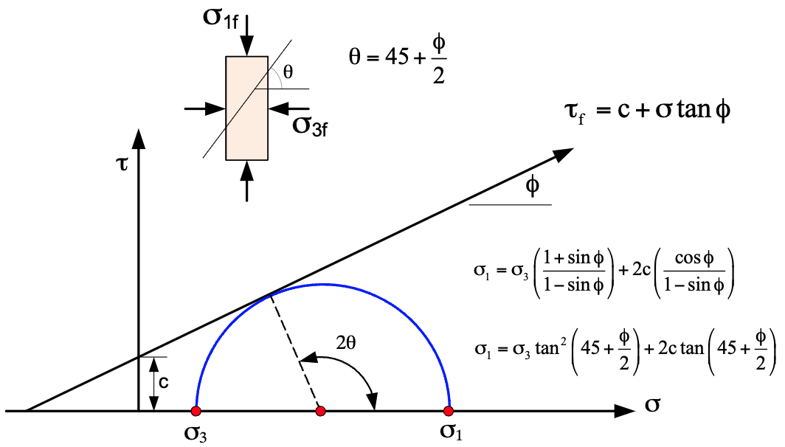
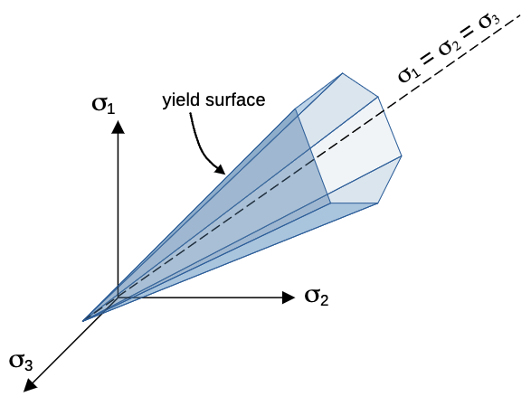
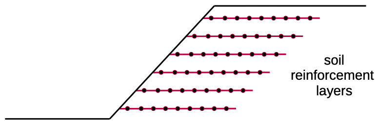

# Finite Element Method for Slope Stability Analysis

## Introduction

The finite element method (FEM) provides a powerful numerical technique for slope stability analysis that overcomes 
many fundamental limitations of traditional limit equilibrium methods. While limit equilibrium approaches require the engineer to assume a failure surface geometry and then check whether equilibrium conditions are satisfied, FEM allows potential failure mechanisms to emerge naturally through rigorous stress analysis and progressive failure development (Griffiths & Lane, 1999; Duncan, 1996).

This fundamental difference represents a paradigm shift in slope stability analysis. Rather than imposing kinematic constraints through assumed failure surfaces, FEM solves the complete stress-strain problem throughout the slope domain. The method can capture the complex stress redistribution that occurs as soil elements progressively reach failure, leading to the natural development of failure zones without prior assumptions about their geometry or location.

The advantages of this approach are substantial. FEM can model progressive failure development, where failure initiates in highly stressed regions and propagates through the slope as stresses redistribute. This is particularly important for understanding the actual mechanisms of slope failure, which often involve complex interactions between different soil layers, irregular geometries, and varying loading conditions. Additionally, FEM naturally integrates with other physical processes such as seepage flow, consolidation, and dynamic loading, enabling coupled analyses that capture the true multi-physics nature of slope behavior.

Perhaps most importantly, FEM uses realistic stress-strain constitutive models that can capture the actual behavior of soil materials, including nonlinear elastic behavior, plastic yielding, strain softening, and progressive failure. This provides a much more accurate representation of soil response compared to the rigid-perfectly plastic assumptions typically used in limit equilibrium methods.

## Governing Equations

### Equilibrium Equations

The foundation of finite element slope stability analysis rests on the fundamental equilibrium equations that govern the static behavior of continuum mechanics. In two dimensions, these equilibrium equations express the requirement that forces acting on any infinitesimal element of soil must be in balance:

>>$\dfrac{\partial \sigma_x}{\partial x} + \dfrac{\partial \tau_{xy}}{\partial y} + b_x = 0$

>>$\dfrac{\partial \tau_{xy}}{\partial x} + \dfrac{\partial \sigma_y}{\partial y} + b_y = 0$

Here, $\sigma_x$ and $\sigma_y$ represent the normal stresses acting in the x and y directions respectively, while $\tau_{xy}$ denotes the shear stress. The body force terms $b_x$ and $b_y$ account for forces distributed throughout the volume of the material, with gravity being the most common example where $b_x = 0$ and $b_y = -\gamma$, where $\gamma$ is the unit weight of the soil.

These equations must be satisfied at every point within the slope domain for the system to be in static equilibrium. The challenge in slope stability analysis arises because soil materials exhibit nonlinear, inelastic behavior that violates these equilibrium conditions when failure occurs, leading to the progressive development of failure zones.

### Stress-Strain Relations

The constitutive behavior of soil in finite element slope stability analysis is typically modeled using an elastic-perfectly plastic framework that combines linear elastic behavior with Mohr-Coulomb plasticity. This approach recognizes that soil behaves elastically under small stress changes but exhibits permanent deformation once failure is reached.

During the elastic phase, before any yielding occurs, the relationship between stress and strain follows Hooke's law expressed in matrix form:

>>$\{\sigma\} = [D_e] \{\varepsilon\}$

The elastic constitutive matrix $[D_e]$ for plane strain conditions, which is most appropriate for slope stability problems, takes the form:

>>$[D_e] = \dfrac{E}{(1+\nu)(1-2\nu)} \begin{bmatrix}
1-\nu & \nu & 0 \\
\nu & 1-\nu & 0 \\
0 & 0 & \dfrac{1-2\nu}{2}
\end{bmatrix}$

This formulation requires several fundamental material properties that must be determined through laboratory testing or empirical correlations. Young's modulus $E$ governs the stiffness of the soil under loading, while Poisson's ratio $\nu$ controls the relationship between axial and lateral strains. For slope stability analysis, additional strength parameters are critical: the cohesion $c$ and friction angle $\phi$ define the failure envelope, while the unit weight $\gamma$ determines the gravitational body forces. The coefficient of earth pressure at rest $K_0$ is often needed to establish initial stress conditions, particularly for natural slopes that have developed under gravitational loading over geological time.

#### Typical Material Properties for Finite Element Analysis

The following table provides typical ranges of elastic parameters for common soil types. These values should be used as initial estimates and refined based on site-specific testing when available.

| Soil Type | Young's Modulus $E$ (MPa) | Poisson's Ratio $\\nu$ | Typical Range Notes |
|-----------|---------------------------|----------------------|-------------------|
| **Soft Clay** | 2 - 15 | 0.40 - 0.50 | Use lower E values for very soft clays |
| **Medium Clay** | 15 - 50 | 0.35 - 0.45 | Plasticity index affects stiffness |
| **Stiff Clay** | 50 - 200 | 0.20 - 0.40 | Overconsolidated clays have higher E |
| **Loose Sand** | 10 - 25 | 0.25 - 0.35 | Depends on relative density |
| **Medium Sand** | 25 - 75 | 0.30 - 0.40 | Well-graded sands toward upper range |
| **Dense Sand** | 75 - 200 | 0.25 - 0.35 | Angular particles give higher stiffness |
| **Loose Silt** | 5 - 20 | 0.30 - 0.45 | Non-plastic silts toward lower ν |
| **Dense Silt** | 20 - 100 | 0.25 - 0.40 | Cementation increases stiffness |
| **Gravel** | 100 - 500 | 0.15 - 0.30 | Well-graded, dense materials |
| **Rock Fill** | 50 - 300 | 0.20 - 0.35 | Depends on gradation and compaction |
| **Soft Rock** | 1,000 - 10,000 | 0.15 - 0.30 | Weathered or fractured rock |

**Important Considerations:**

- **Stress Level Dependency**: Soil stiffness typically increases with confining stress. The values above represent typical ranges for moderate stress levels (50-200 kPa effective stress).

- **Strain Level**: These modulus values are appropriate for small to medium strain levels (< 1%). For large strain analysis, secant or degraded modulus values may be more appropriate.

- **Drainage Conditions**: For undrained analysis of saturated soils, use undrained modulus $E_u$ and Poisson's ratio approaches 0.5. For drained analysis, use drained parameters with $\\nu < 0.5$.

- **Laboratory vs. Field Values**: Laboratory-derived moduli are often higher than field values due to sample disturbance and scale effects. Field moduli (from pressuremeter, plate load tests) may be more representative.

- **Empirical Correlations**: When direct testing is unavailable, Young's modulus can be estimated from standard penetration test (SPT) or cone penetration test (CPT) data using published correlations.

### Mohr-Coulomb Failure Criterion

The Mohr-Coulomb failure criterion forms the theoretical foundation for determining when soil failure occurs in 
finite element slope stability analysis. This criterion, developed from extensive experimental observations of soil 
behavior, recognizes that soil failure is fundamentally a shear phenomenon that depends on both the normal stress 
acting on the failure plane and the inherent strength properties of the material. The following figure illustrates 
the Mohr-Coulomb failure envelope in stress space, which defines the boundary between stable and unstable states for a given soil material:

{width=800px}

The line defined by the Mohr-Coulomb criterion represents the maximum shear stress that can be sustained by the soil at a given effective normal stress. The slope of this line is determined by the angle of internal friction $\phi$, while the intercept on the shear stress axis is defined by the cohesion $c$ of the soil. The basic form of the Mohr-Coulomb criterion expresses the relationship between shear strength and normal stress on any potential failure plane:

>>$\tau_f = c + \sigma \tan \phi$

In this formulation, $\tau_f$ represents the shear strength available to resist failure, $c$ is the cohesion 
representing the portion of strength that is independent of normal stress, $\sigma$ is the  normal stress acting 
perpendicular to the failure plane, and $\phi$ is the angle of internal friction that governs how strength increases 
with normal stress. When written in terms of effective stresses, the criterion becomes:

>>$\tau_f = c + \sigma' \tan \phi$

>>$\tau_f = c + (\sigma - u) \tan \phi$

where $\sigma'$ is the effective normal stress, defined as the total normal stress minus pore water pressure (u). This 
effective stress formulation is critical for understanding how changes in pore water pressure, such as those caused by rainfall or groundwater fluctuations, can significantly affect slope stability.

For computational implementation in finite element analysis, it is more convenient to express the failure criterion in terms of principal stresses. This transformation yields:

>>$\dfrac{\sigma_1' - \sigma_3'}{2} = \dfrac{\sigma_1' + \sigma_3'}{2} \sin \phi + c \cos \phi$

where $\sigma_1'$ and $\sigma_3'$ are the major and minor principal effective stresses respectively. This 
formulation allows defines a "yield function" than can be evaluated directly in terms of principal stresses, which are 
computed at 
each integration point within the finite element mesh. The yield function can then be expressed as:

>>$f(\sigma_1', \sigma_3') = \dfrac{\sigma_1' - \sigma_3'}{2} - \left(\dfrac{\sigma_1' + \sigma_3'}{2} \sin \phi + c \cos \phi\right) = 0$

This yield function defines the boundary between elastic and plastic behavior in the soil. When the yield function 
is positive, the soil remains elastic; when it becomes zero or negative, plastic yielding occurs, indicating that 
failure has initiated. The yield function can be visualized in principal stress space, where the failure envelope is 
a hyperbolic surface that separates stable and unstable states, as shown in the figure below:

This principal stress formulation allows direct evaluation of the yield function using the principal stresses computed at each integration point within the finite element mesh.

## Finite Element Formulation

### Discretization

The transformation from continuous domain to discrete finite element system begins with dividing the slope domain into a collection of simple geometric elements, typically triangles or quadrilaterals. This discretization process is fundamental to the finite element method because it allows the complex, continuous displacement field throughout the slope to be approximated using simple polynomial functions defined over each element.

Within each element, the displacement field is interpolated from the nodal displacement values using shape functions. For a typical two-dimensional element, the horizontal and vertical displacements at any point within the element are expressed as:

>>$u = [N] \{u_e\}$

>>$v = [N] \{v_e\}$

The shape function matrix $[N]$ contains the interpolation functions that define how displacements vary spatially within the element, while $\{u_e\}$ and $\{v_e\}$ are vectors containing the nodal displacement values. For linear triangular elements, the shape functions are simply the area coordinates that ensure displacement compatibility between adjacent elements and provide a linear variation of displacement within each element.

The choice of element type significantly impacts both accuracy and computational efficiency. Triangular elements with linear shape functions are particularly well-suited for slope stability problems because they can easily conform to irregular slope geometries and provide adequate accuracy for capturing the stress distributions that govern failure development. The linear displacement variation within each element leads to constant strain and stress fields, which is appropriate for modeling the elastic-perfectly plastic soil behavior typically assumed in slope stability analysis.

### Element Stiffness Matrix

The element stiffness matrix represents the fundamental relationship between nodal forces and nodal displacements for each finite element. This matrix is derived through application of the principle of virtual work, which states that for a system in equilibrium, the virtual work done by external forces must equal the virtual work done by internal stresses for any kinematically admissible virtual displacement field.

The mathematical expression for the element stiffness matrix emerges from this principle as:

>>$[K_e] = \int_{A_e} [B]^T [D] [B] \, dA$

This elegant formulation embodies the essential physics of the problem. The strain-displacement matrix $[B]$ transforms nodal displacements into strains throughout the element, while the constitutive matrix $[D]$ relates these strains to stresses according to the material's stress-strain behavior. The integration over the element area $A_e$ ensures that the stiffness contribution from every point within the element is properly accounted for.

For the commonly used linear triangular elements, the strain-displacement matrix takes the specific form:

>>$[B] = \dfrac{1}{2A} \begin{bmatrix}
b_1 & 0 & b_2 & 0 & b_3 & 0 \\
0 & c_1 & 0 & c_2 & 0 & c_3 \\
c_1 & b_1 & c_2 & b_2 & c_3 & b_3
\end{bmatrix}$

The coefficients $b_i$ and $c_i$ are geometric constants determined by the nodal coordinates of the triangle, and $A$ represents the triangle area. This matrix remains constant throughout the element because of the linear nature of the shape functions, which simplifies the integration process and leads to computational efficiency.

### Global System Assembly

The transition from individual element stiffness matrices to the global system of equations represents one of the most elegant aspects of the finite element method. Each element contributes to the overall structural behavior according to its connectivity with other elements, creating a sparse but symmetric global stiffness matrix that captures the mechanical interaction throughout the entire slope domain.

The global system of equations takes the familiar form:

>>$[K] \{U\} = \{F\}$

The global stiffness matrix $[K]$ is assembled by systematically adding each element's stiffness contribution to the appropriate locations corresponding to the degrees of freedom associated with that element's nodes. This assembly process ensures displacement compatibility between adjacent elements and force equilibrium at every node in the mesh.

The global displacement vector $\{U\}$ contains the unknown nodal displacements for the entire mesh, while the global force vector $\{F\}$ represents the applied loads including both external forces and body forces due to gravity. The sparsity of the global stiffness matrix, where most entries are zero due to the local connectivity of finite elements, allows efficient solution algorithms to be employed even for large-scale slope stability problems.

The solution of this global system provides the displacement field throughout the slope under the applied loading conditions. From these displacements, the strain and stress fields can be computed at every point in the domain, enabling assessment of the proximity to failure according to the chosen yield criterion.

## Boundary Conditions

The proper specification of boundary conditions is crucial for obtaining physically meaningful solutions in finite element slope stability analysis. Boundary conditions define how the slope interacts with its surroundings and constrain the displacement field to reflect realistic physical constraints. The choice of boundary conditions significantly affects both the stress distribution within the slope and the computed factor of safety.

### Displacement Boundary Conditions

Displacement boundary conditions are applied where the motion of the soil mass is constrained by physical limitations or where the model boundaries must represent the behavior of the extended soil mass beyond the computational domain.

Fixed supports represent locations where both horizontal and vertical displacements are completely prevented, typically expressed as $u = 0$ and $v = 0$. These conditions are most commonly applied at the base of the finite element model when the analysis extends to sufficient depth that the displacement of deep soil layers has negligible effect on slope stability. The depth required for this assumption depends on the slope geometry and soil properties, but generally the model should extend at least one slope height below the toe and preferably to bedrock or very stiff soil layers.

Roller supports constrain displacement in only one direction while allowing free movement in the perpendicular direction. Along vertical side boundaries, horizontal displacement is typically prevented ($u = 0$) while vertical movement is allowed, reflecting the assumption that the slope extends laterally beyond the model boundaries with similar geometry and loading conditions. At the model base, vertical displacement may be prevented ($v = 0$) while allowing horizontal movement, which is appropriate when the analysis does not extend to truly fixed boundary conditions.

Free boundaries occur along the ground surface and slope face where no external constraints are applied. These boundaries represent the natural boundary condition of zero traction, meaning that no external forces act normal or tangential to these surfaces except for applied loads such as surcharge loads or foundation pressures.

For slope stability analysis, the most common displacement boundary conditions are fixed supports at the 
base of the 
model, roller supports (free movement in the vertical direction) along the left and right vertical boundaries, and free 
boundaries along the slope face and ground surface. These 
conditions ensure 
that the 
model 
accurately reflects the physical constraints of the slope while allowing for realistic stress distributions and 
potential failure mechanisms to develop. These displacement boundary conditions are automatically applied in XSLOPE.

### Force Boundary Conditions

Force boundary conditions specify the external loads acting on the slope. In XSLOPE, force boundary conditions 
correspond to distributed loads which are defined in the input template as as line loads with a sequence of coordinates and corresponding load values (force per unit length). These can represent:

- **Traffic loads** (vehicles, equipment)
- **Structural loads** (buildings, foundations)  
- **Hydrostatic pressure** (water on slope face)

The distributed loads in the input template can be used either for limit equilibrium analysis or finite element 
analysis. For limit equilibrium 
analysis, each 
distributed load is converted to a resultant force applied at the top of each 
slice. The total load on each slice is calculated by integrating the distributed load over the slice width. For 
finite element analysis, the same distributed loads are converted to equivalent nodal forces using:

>>$\{F_s\} = \int_{\Gamma} [N]^T \{q\} \, d\Gamma$

where $\{q\}$ is the distributed load intensity (force per unit length), $[N]$ are the shape functions, and $\Gamma$ represents the loaded boundary. The shape functions distribute the load to the nodes along the boundary, ensuring that the total applied load is correctly represented while maintaining consistency with the finite element approximation.

#### Body Forces

Body forces act throughout the volume of soil elements, primarily gravitational forces (self-weight of soil). For gravitational loading, the body force components are:

>>$b_x = 0$ 
$b_y = -\gamma$

where $\gamma$ is the unit weight of the soil. These body forces are incorporated into the equilibrium equations:

>>$\dfrac{\partial \sigma_x}{\partial x} + \dfrac{\partial \tau_{xy}}{\partial y} + b_x = 0$

>>$\dfrac{\partial \tau_{xy}}{\partial x} + \dfrac{\partial \sigma_y}{\partial y} + b_y = 0$

In the finite element formulation, body forces are converted to equivalent nodal forces using:

>>$\{F\}_b = \sum_{e=1}^{N_{elem}} \int_{A_e} [N]^T \{b\} \, dA$

where $[N]$ are the shape functions and the integration is performed over each element area $A_e$, then summed over all elements in the mesh. This integration distributes the self-weight of the soil to the nodes of each element, ensuring that the gravitational loading is properly represented throughout the slope domain.

## Seismic Forces

For both limit equilibrium and finite element slope stability analysis in XSLOPE, seismic loading is simulated using the pseudo-static method, which is a widely accepted approach for incorporating seismic effects into slope stability assessments. This method simplifies the complex dynamic response of soil during earthquakes by representing seismic loading as equivalent static forces applied to the slope mass. The pseudo-static approach assumes that the earthquake ground acceleration can be represented by a constant horizontal acceleration applied throughout the slope mass. This acceleration generates inertial forces that act on every element of soil, creating additional driving forces that tend to destabilize the slope.

In the finite element formulation, seismic loading is incorporated by modifying the body force vector to include both gravitational and seismic components:

>>$\{b\}_{total} = \{b\}_{gravity} + \{b\}_{seismic}$

For a horizontal seismic coefficient $k$, representing the ratio of horizontal acceleration to gravitational acceleration, the seismic body forces are:

>>$b_{x,seismic} = k \gamma$ 
$b_{y,seismic} = 0$

The direction of the horizontal seismic force is chosen to maximize the driving forces that promote slope failure. For typical left-facing slopes, this corresponds to a leftward (negative x-direction) seismic acceleration that increases the shear stresses along potential failure surfaces.

The equilibrium equations are modified to include seismic body forces:

>>$\dfrac{\partial \sigma_x}{\partial x} + \dfrac{\partial \tau_{xy}}{\partial y} + b_x + k\gamma = 0$

>>$\dfrac{\partial \tau_{xy}}{\partial x} + \dfrac{\partial \sigma_y}{\partial y} + b_y = 0$

where $k\gamma$ represents the additional horizontal body force due to seismic loading, with $k$ being the seismic coefficient and $\gamma$ the unit weight of the soil.

The seismic body forces are incorporated into the global force vector through element-level integration:

>>$\{F\}_{seismic} = \sum_{e=1}^{N_{elem}} \int_{A_e} [N]^T \{b\}_{seismic} \, dA$

For linear triangular elements, this integration yields nodal forces that distribute the seismic loading according to the element shape functions. The seismic forces are added to the gravitational body forces and any external applied loads to form the complete loading vector.

## Soil Reinforcement 

The integration of soil reinforcement elements such as geotextiles, soil nails, and ground anchors into finite element slope stability analysis represents a significant advancement in modeling stabilized slopes. These reinforcement systems fundamentally alter the stress distribution and failure mechanisms within slopes, requiring sophisticated modeling approaches to capture their beneficial effects accurately (Duncan & Wright, 2005).

The modeling of reinforced slopes presents unique challenges because the reinforcement elements typically have dramatically different mechanical properties compared to the surrounding soil. Reinforcement elements are usually much stiffer in tension and often have negligible compressive strength, creating a highly anisotropic composite material that requires specialized finite element formulations.

For limit equlibrium analysis in XSLOPE, reinforcement lines are read from the input template and treated as 
additional slices that contribute to the overall stability of the slope. Each line is designated by a series of 
points and a tensile strength value at each point. Typically, the tensile strength is zero at the ends of the line 
and linearly increases to a maximum value at a "pullout length" distance from the ends, reflecting the reality that 
pullout resistance must develop over a finite distance from the reinforcement ends. This tensile strength profile is 
critical for accurately modeling the contribution of reinforcement to slope stability. The same inputs are used for 
the finite element analysis, where the reinforcement lines are converted to one-dimensional truss elements.

### Truss Element Approach

While there are numerous ways to simulate soil reinforcement in the finite element method including the equivalent force method and interface element modeling, the most straightforward method for modeling reinforcement involves representing reinforcement elements as one-dimensional truss elements embedded within the two-dimensional soil continuum. These truss elements are characterized by their axial stiffness $EA/L$, where $E$ is the elastic modulus of the reinforcement material, $A$ is the cross-sectional area, and $L$ is the element length. 

This approach is particularly effective for modeling geosynthetic reinforcement, soil nails, and tie-back anchors. The truss elements can only carry tension loads up to a specified tensile strength limit $T_{max}$, beyond which they either yield plastically or fail completely. The inability to carry compression loads accurately reflects the behavior of flexible reinforcement materials like geotextiles and ensures that the reinforcement cannot resist compressive buckling. The truss elements are oriented along the centerline of the physical reinforcement and connected to the surrounding soil elements through shared nodes or interface elements. This connection ensures that the reinforcement participates in the overall deformation pattern of the slope while contributing its tensile resistance to improve stability.

Truss elements are incorporated into the XSLOPE finite element mesh by passing the geometry of the reinforcement lines from the input template to the mesh generation process. The reinforcement lines are discretized into multiple truss elements based on the specified mesh density, typically producing element lengths of 0.5-1.0 times the characteristic soil element size. The nodes along the reinforcement lines are automatically placed by the meshing algorithm, ensuring that they share nodes with adjacent soil elements for perfect displacement compatibility.

### Mathematical Formulation

**Truss Element Stiffness Matrix:** Each 1D truss element contributes to the global stiffness matrix through its element stiffness matrix. For a truss element with nodes $i$ and $j$, the element stiffness matrix in local coordinates is:

>>$[K_e]_{local} = \frac{AE}{L} \begin{bmatrix} 1 & -1 \\ -1 & 1 \end{bmatrix}$

where $A$ is the cross-sectional area, $E$ is the elastic modulus, and $L$ is the element length.

**Coordinate Transformation:** The local stiffness matrix must be transformed to global coordinates using the transformation matrix $[T]$:

>>$[K_e]_{global} = [T]^T [K_e]_{local} [T]$

For a truss element oriented at angle $\theta$ to the horizontal:

>>$[T] = \begin{bmatrix} \cos\theta & \sin\theta & 0 & 0 \\ 0 & 0 & \cos\theta & \sin\theta \end{bmatrix}$

**Assembly Process:** The global stiffness matrix combines contributions from both 2D soil elements and 1D truss elements:

>>$[K]_{global} = \sum_{soil} [K_e]_{soil} + \sum_{truss} [K_e]_{truss}$

**Force Vector Assembly:** The global force vector includes both soil body forces and any applied forces on reinforcement:

>>$\{F\}_{global} = \{F\}_{soil} + \{F\}_{reinforcement}$

**Tension-Only Behavior:** Truss elements are restricted to carry only tension forces. This is implemented by:
- Checking element force after each iteration
- If compression develops, remove the element's stiffness contribution
- Reanalyze until equilibrium is achieved with only tension-carrying elements

**Strength Limits:** Each truss element has a maximum tensile capacity $T_{max}$ derived from the user-specified reinforcement strength. When this limit is exceeded:
- The element either yields plastically or fails completely
- Failed elements are removed from the stiffness matrix
- Progressive failure can propagate along the reinforcement line

### Determining Reinforcement Line Pullout Lengths

The key to implementing truss element reinforcement in XSLOPE is properly specifying the tensile strength variation 
along each reinforcement line. This variation captures the physical reality that pullout resistance must develop over a finite distance from the reinforcement ends. The pullout length $L_p$ is the distance from each end of the reinforcement over which the full tensile strength is mobilized. Within this length, the available tensile strength increases from zero at the end to the full design capacity. Pullout resistance develops through interface friction between the reinforcement and surrounding soil. This friction cannot be mobilized instantaneously but requires relative displacement to develop, creating the gradual strength buildup characteristic of all reinforcement systems. Pullout length can be estimated as follows:

**For Soil Nails:**
>>$L_p = \dfrac{T_{design}}{\alpha \pi D \sigma_n' \tan \phi_{interface}}$

where: 
>>$T_{design}$ = design tensile capacity of the nail 
$\alpha$ = surface roughness factor (0.5-1.0 for grouted nails) 
$D$ = effective nail diameter  
$\sigma_n'$ = average effective normal stress along the nail 
$\phi_{interface}$ = interface friction angle (typically 0.8-1.0 times soil friction angle)

**For Geotextiles:**
>>$L_p = \dfrac{T_{design}}{2 \alpha \sigma_n' \tan \phi_{interface}}$

where the factor of 2 accounts for friction on both sides of the geotextile.

**Typical Values:**

|Reinforcement Type | Pullout Length $L_p$ (m) | Notes |
|-------------------|--------------------------|-------|
| **Soil Nails** | 1.5 - 3.0 | Depends on soil conditions and nail diameter |
| **Geotextiles** | 0.5 - 1.5 | Depends on normal stress and surface texture |
| **Geogrid** | 1.0 - 2.0 | Depends on aperture size and bearing resistance |

## Shear Strength Reduction Method (SSRM)

The Shear Strength Reduction Method (SSRM) represents the most widely adopted approach for determining factors of safety in finite element slope stability analysis, providing a rigorous and theoretically sound alternative to traditional limit equilibrium methods (Matsui & San, 1992; Griffiths & Lane, 1999). This method elegantly bridges the gap between the limit equilibrium concept of factor of safety and the stress-strain framework of finite element analysis.

The fundamental principle underlying SSRM is conceptually straightforward yet mathematically sophisticated. Rather than assuming a failure surface and checking equilibrium conditions, SSRM systematically reduces the soil's shear strength parameters until the finite element system can no longer maintain equilibrium under the applied loading conditions. The reduction factor required to bring the slope to the brink of failure represents the factor of safety, defined consistently with traditional limit equilibrium approaches.

### Methodology

The SSRM procedure follows a systematic approach that progressively weakens the soil until failure occurs. The process begins by reducing both cohesion and friction angle by a trial factor $F$ according to the relationships:

>>$c_r = \dfrac{c}{F}$ 
$\tan \phi_r = \dfrac{\tan \phi}{F}$

This reduction scheme ensures that both components of shear strength are diminished proportionally, maintaining the fundamental character of the Mohr-Coulomb failure criterion while systematically reducing the available resistance to shear failure. The choice to reduce the tangent of the friction angle rather than the friction angle itself ensures mathematical consistency and avoids complications that arise when the friction angle approaches zero.

With the reduced strength parameters, the finite element system is solved using the same equilibrium equations and constitutive relationships employed in conventional stress analysis. However, as the reduction factor increases, the soil's capacity to resist the applied gravitational and external loads diminishes, leading to progressively larger deformations and increasing numbers of elements reaching the yield condition.

The iterative nature of SSRM requires careful monitoring of the solution behavior to identify the onset of failure. Convergence characteristics provide the primary indicator of impending failure, as the finite element system transitions from stable equilibrium solutions to unstable behavior characterized by rapidly increasing displacements and failure to achieve force equilibrium.

The critical factor of safety is determined when the iterative solution process fails to converge within acceptable tolerances, indicating that the reduced strength parameters are insufficient to maintain equilibrium under the applied loading conditions. This point represents the transition from stable to unstable behavior and corresponds to the classical definition of factor of safety as the ratio of available strength to required strength for equilibrium.

### Convergence Criteria

The identification of failure in SSRM relies on robust convergence criteria that can reliably distinguish between stable solutions with large but finite displacements and unstable solutions where displacements grow without bound. The displacement-based convergence criterion, as proposed by Dawson et al. (1999), monitors the relative change in displacement between successive iterations:

>>$\dfrac{||\{U\}_{i+1} - \{U\}_i||}{||\{U\}_{i+1}||} < \text{tolerance}$

This criterion becomes increasingly difficult to satisfy as the slope approaches failure because displacements grow rapidly while the change between iterations remains large. The failure to achieve convergence within a reasonable number of iterations indicates that the current reduction factor corresponds to an unstable configuration.

Complementary force-based convergence criteria monitor the equilibrium residual:

>>$\dfrac{||\{R\}||}{||\{F\}||} < \text{tolerance}$

The residual force vector $\{R\}$ represents the out-of-balance forces that remain after each iteration of the solution process. As failure approaches, these residual forces become increasingly difficult to eliminate because the soil's capacity to redistribute stress through elastic deformation is exhausted, and plastic flow cannot provide the necessary equilibrium adjustments.

### Critical Factor Identification

The identification of the critical factor of safety requires careful interpretation of the numerical solution behavior as the reduction factor approaches the failure value. Non-convergence of the iterative solution process provides the most reliable indicator of failure, particularly when combined with other failure indicators such as excessive displacement magnitudes and the development of continuous plastic zones.

Excessive displacement growth often precedes complete loss of convergence and can provide early warning of approaching failure. Displacement magnitudes that become unreasonably large compared to the slope dimensions indicate that the deformation pattern is transitioning from recoverable elastic strains to flow-like behavior characteristic of failure mechanisms.

Shear strain localization represents perhaps the most physically meaningful indicator of failure development. As the reduction factor increases, plastic yielding initially occurs in isolated elements subjected to high stress concentrations. Progressive failure develops as these plastic zones expand and eventually coalesce to form continuous bands of high shear strain that represent the actual failure mechanism. The formation of such continuous failure surfaces corresponds closely to the failure surface assumption employed in limit equilibrium methods.

### Advanced SSRM Techniques

Recent developments in SSRM have focused on improving the robustness and efficiency of the failure detection process. Zheng et al. (2005) proposed several enhancements that address common numerical difficulties encountered in standard SSRM implementations.

Adaptive load stepping automatically adjusts the increment size of the reduction factor based on the convergence behavior of the previous analysis steps. Large increments can be used when the solution is stable and converging rapidly, while smaller increments are employed as failure approaches and convergence becomes more difficult. This approach reduces computational effort while maintaining accuracy in the critical region near failure.

Arc-length methods represent a more fundamental advancement that allows the solution path to be followed through points of instability. Traditional displacement-controlled or load-controlled solution procedures encounter difficulties when the structural response becomes unstable, but arc-length methods can continue the solution along the load-displacement path even beyond peak load conditions. This capability enables more precise determination of the critical factor of safety and provides insight into post-failure behavior.

Energy-based monitoring techniques track changes in strain energy and plastic work to identify failure development. These methods can provide early warning of approaching failure and help distinguish between local plastic yielding and global failure mechanisms. The rapid increase in plastic energy dissipation often precedes complete loss of convergence and can indicate the transition from stable to unstable behavior.

## Plastic Zone Development

The development of plastic zones within slopes represents one of the most critical aspects of finite element slope stability analysis, as it captures the progressive nature of failure that cannot be modeled using traditional limit equilibrium approaches. Understanding how plastic zones initiate, grow, and eventually coalesce to form failure mechanisms provides essential insight into both the factor of safety and the actual failure process.

### Yielding Detection

The detection of yielding at each integration point within the finite element mesh requires continuous monitoring of the stress state relative to the yield surface defined by the Mohr-Coulomb criterion. At every point in the analysis, the yield function is evaluated:

>>$f(\sigma', c, \phi) = \dfrac{\sigma_1' - \sigma_3'}{2} - \dfrac{\sigma_1' + \sigma_3'}{2} \sin \phi - c \cos \phi$

As described above, this function represents the mathematical boundary between elastic and plastic behavior. When $f < 
0$, the stress state lies within the elastic domain and the material response follows the linear elastic constitutive relationship. When $f = 0$, the stress state lies exactly on the yield surface, indicating incipient yielding. Most importantly, when $f > 0$, the stress state has exceeded the material's yield strength, indicating that plastic deformation must occur to return the stress to an admissible state.

The evaluation of principal stresses $\sigma_1'$ and $\sigma_3'$ from the general stress tensor requires solution of the eigenvalue problem, which can be computationally intensive but is essential for accurate yield detection. Alternative formulations using stress invariants can provide computational advantages while maintaining the physical accuracy of the yield criterion.

### Stress Return Algorithm

When yielding is detected at an integration point, the stress state must be corrected to ensure that equilibrium is maintained while satisfying the yield criterion. This process is accomplished through a stress return algorithm that projects the inadmissible stress state back onto the yield surface. The elastic predictor step calculates the trial stress state assuming purely elastic behavior throughout the current load increment. This trial stress represents what the stress would be if no yielding occurred and provides the starting point for the plastic correction process.

If the yield check reveals that $f > 0$ for the trial stress state, plastic flow must occur to bring the stress back to the yield surface. The plastic correction is implemented using the radial return method:

>>$\{\sigma'\}_{n+1} = \{\sigma'\}_{trial} - \Delta \lambda \dfrac{\partial f}{\partial \sigma'}$

The plastic multiplier $\Delta \lambda$ is determined by requiring that the final stress state must satisfy $f = 0$, which provides the constraint equation needed to solve for the magnitude of the plastic correction. The gradient vector $\frac{\partial f}{\partial \sigma'}$ defines the direction of the plastic flow according to the associated flow rule, ensuring that the plastic strain increment is normal to the yield surface.

This stress return process must be performed at every integration point where yielding occurs, and the resulting plastic strains contribute to the overall deformation of the element. The accumulation of plastic strains throughout the mesh provides a quantitative measure of damage development and helps identify the formation of potential failure surfaces.

### Progressive Failure Development

The evolution of plastic zones during the shear strength reduction process reveals the fundamental mechanisms by 
which slope failure develops. This progressive failure process typically follows a characteristic sequence that provides insight into both the failure mode and the factors controlling stability. Initial yielding occurs at locations where stress concentrations develop due to geometric irregularities, material property contrasts, or loading conditions. These initial plastic zones are typically isolated and small, representing local stress relief rather than global failure. Common locations for initial yielding include the slope toe, where stress concentrations develop due to the free surface boundary condition, and interfaces between materials with contrasting properties.

As the reduction factor increases during SSRM analysis, load redistribution occurs around the initial plastic zones. The elements that have yielded can no longer carry additional load, forcing stress transfer to adjacent elastic elements. This redistribution can either stabilize the situation if sufficient elastic capacity remains, or it can trigger additional yielding if the redistributed stresses exceed the yield strength of the surrounding elements.

Plastic zone growth represents the critical transition from local yielding to potential global instability. As individual plastic zones expand and begin to interact, the load paths through the slope become increasingly constrained. The formation of continuous or nearly continuous bands of plastic elements indicates the development of potential failure surfaces along which large relative displacements can occur.

The critical state is reached when sufficient plastic zone development has occurred to create a kinematically admissible failure mechanism. This typically corresponds to the formation of a continuous band of yielded elements that extends from the slope face to a stable region, creating a pathway along which the slope mass above the failure surface can move relative to the stable foundation below. At this point, the finite element solution becomes unstable, convergence is lost, and the critical factor of safety has been reached.

## Integration with XSLOPE Framework

The integration of finite element capabilities into the existing XSLOPE framework represents a natural evolution that leverages the established infrastructure while extending the analysis capabilities to include rigorous stress-strain based slope stability assessment. This integration maintains the familiar workflow and input/output patterns that users have come to expect while providing access to the advanced capabilities of finite element analysis.

### Input Integration

The finite element implementation builds upon XSLOPE's existing Excel-based input system, extending the current templates to accommodate the additional parameters required for finite element analysis while preserving compatibility with existing limit equilibrium workflows. The slope geometry definitions, material property specifications, and boundary condition inputs that currently support limit equilibrium analysis provide an excellent foundation for finite element modeling.

Material property definitions can leverage the existing cohesion $c$, friction angle $\phi$, and unit weight $\gamma$ specifications that are already established in the XSLOPE input system. Additional parameters required for finite element analysis, such as Young's modulus $E$ and Poisson's ratio $\nu$, can be seamlessly integrated into the existing material property framework without disrupting current workflows.

The existing seepage analysis infrastructure provides a particularly valuable foundation for coupled seepage-stability finite element analysis. The current mesh generation capabilities and pore pressure calculation tools can be directly utilized to provide the groundwater input conditions required for effective stress analysis in the finite element system.

### Mesh Integration

XSLOPE's existing mesh generation capabilities in `mesh.py` provide an excellent starting point for finite element mesh creation. The current triangular mesh generation algorithms developed for seepage analysis can be extended to create structural analysis meshes with appropriate element density and quality controls for slope stability applications.

The transition from seepage mesh to structural mesh requires careful consideration of element sizing and boundary representation to ensure that stress concentrations and plastic zone development can be adequately captured. The existing geometric tools for boundary identification and material zone definition provide the foundation for this enhanced mesh generation capability.

### Solution Integration

The finite element solution algorithms follow the established patterns used throughout XSLOPE, particularly the `(success, result)` return structure that characterizes all solution methods in `solve.py`. This consistency ensures that finite element analysis can be seamlessly integrated into existing workflows and combined with limit equilibrium methods for comprehensive slope stability assessment.

Comparative analysis capabilities allow engineers to run finite element analysis alongside traditional limit equilibrium methods, providing both verification of results and insight into the differences between the approaches. The common factor of safety reporting framework ensures that results from all methods can be easily compared and interpreted within a unified context.

### Seepage Analysis Coupling

One of the most powerful aspects of integrating finite element slope stability analysis with the existing XSLOPE framework is the ability to seamlessly couple the established seepage analysis capabilities in `seep.py` with the structural finite element analysis. This coupling enables rigorous analysis of slopes under varying groundwater conditions, which is critical for understanding slope behavior during rainfall events, reservoir drawdown, or other transient groundwater conditions.

The existing seepage analysis infrastructure provides a robust foundation for determining pore pressure distributions throughout the slope domain. The seepage analysis solves the groundwater flow equation using finite element methods on triangular meshes, producing hydraulic head values at all nodes in the seepage mesh. These hydraulic head values are then converted to pore pressures using the fundamental relationship:

>>$u = \gamma_w (h - z)$

where $u$ is the pore pressure, $\gamma_w$ is the unit weight of water, $h$ is the hydraulic head from the seepage analysis, and $z$ is the elevation coordinate.

The challenge lies in efficiently transferring these pore pressure values from the seepage mesh to the structural analysis mesh used for slope stability calculations. While both analyses use triangular finite element meshes, they may have different mesh densities and node locations optimized for their respective analysis requirements.

The transfer of pore pressure data between seepage and structural meshes can be accomplished using several interpolation approaches, building upon the existing mesh handling capabilities in `mesh.py`:

**Direct Node Mapping**: When the seepage and structural meshes are identical or nearly identical, pore pressures can be directly transferred from seepage nodes to corresponding structural nodes. This approach provides the highest accuracy but requires careful coordination of mesh generation to ensure node correspondence.

**Element-Based Interpolation**: For cases where mesh geometries differ, pore pressures can be interpolated from the seepage mesh to structural analysis points using the shape functions of the seepage elements. For any point with coordinates $(x, y)$ in the structural mesh, the pore pressure is calculated as:

>>$u(x,y) = \sum_{i=1}^{3} N_i(x,y) \cdot u_i$

where $N_i$ are the triangular shape functions of the seepage element containing point $(x,y)$, and $u_i$ are the pore pressures at the seepage element nodes.

## References

Dawson, E.M., Roth, W.H., & Drescher, A. (1999). Slope stability analysis by strength reduction. *Géotechnique*, 49(6), 835-840.

Duncan, J.M. (1996). State-of-the-art: Limit equilibrium and finite element analysis of slopes. *Journal of Geotechnical Engineering*, 122(7), 577-596.

Duncan, J.M., & Wright, S.G. (2005). *Soil Strength and Slope Stability*. John Wiley & Sons.

Dyson, A.P., & Tolooiyan, A. (2018). Comparative approaches to probabilistic finite element methods for slope stability analysis. *Innovative Infrastructure Solutions*, 3(1), 1-11.

Griffiths, D.V., & Lane, P.A. (1999). Slope stability analysis by finite elements. *Géotechnique*, 49(3), 387-403.

Matsui, T., & San, K.C. (1992). Finite element slope stability analysis by shear strength reduction technique. *Soils and Foundations*, 32(1), 59-70.

Zheng, H., Liu, D.F., & Li, C.G. (2005). Slope stability analysis based on elasto‐plastic finite element method. *International Journal for Numerical Methods in Engineering*, 64(14), 1871-1888.