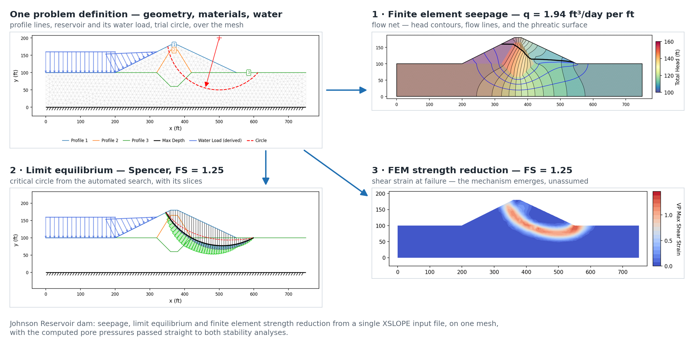
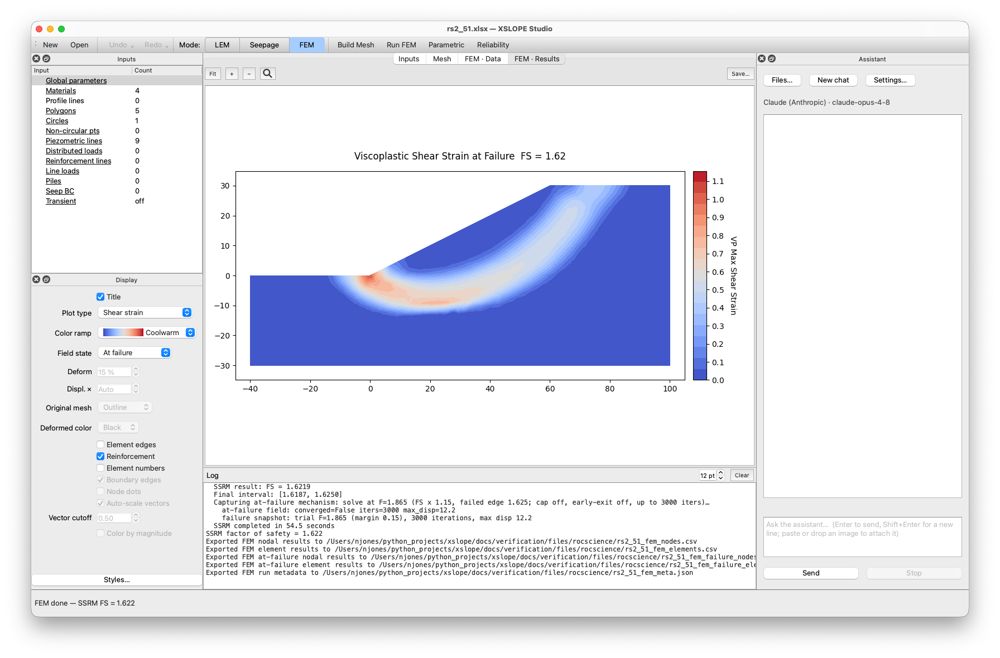

<div class="hero" markdown="1">

# XSLOPE — free, open-source slope stability analysis software

Limit equilibrium, finite element seepage, and finite element strength reduction —
three analysis modes driven from **one** problem definition, in a desktop
application for macOS and Windows and a Python package you can script. Verified
against more than 800 published benchmark cases, and free under the Apache 2.0
license.
{ .tagline }

<div class="download-buttons" markdown="1">

[Download for macOS](https://github.com/njones61/xslope/releases/latest/download/XSLOPE-Studio-macos-arm64.dmg){ .btn .btn-neutral .download-btn }

[Download for Windows](https://github.com/njones61/xslope/releases/latest/download/XSLOPE-Studio-windows-x64-setup.exe){ .btn .btn-neutral .download-btn }

[`pip install xslope`](usage/installation.md){ .btn .btn-neutral .download-btn }

</div>

No license fees, no seat count, no license server · macOS 11+ (Apple silicon)
and Windows 10 / 11 · [Install guide](getting_started/install.md) ·
[source on GitHub](https://github.com/njones61/xslope){target="blank"}
{ .hero-note }

</div>

<div class="stat-band" markdown="1">
<div class="stat"><span class="num">3</span><span class="lbl">analysis modes, one model</span></div>
<div class="stat"><span class="num">7</span><span class="lbl">limit equilibrium methods</span></div>
<div class="stat"><span class="num">800+</span><span class="lbl">verification cases, all published</span></div>
<div class="stat"><span class="num">&#36;0</span><span class="lbl">per seat, per year, forever</span></div>
</div>

## Three analysis modes, one model

A defensible slope analysis needs three things: a seepage solution for the pore
pressures, a limit equilibrium factor of safety, and — increasingly — a finite
element strength reduction check that finds the failure mechanism without being
told where it is. Commercial suites sell those as separate modules. XSLOPE runs
all three from a single problem definition: enter the geometry, materials and
water conditions once, and the computed pore pressure field passes straight into
both stability analyses, on the same mesh, with no re-meshing and no manual
transfer.

{width="1200"}

The Johnson Reservoir dam, analysed three ways from one input file. Every panel
is drawn by the same plotting functions the package ships, and every number on it
is computed by the run that produced the figure —
[see the worked example](seep/seep_slope.md).
{ .figure-caption }

## What you get

<div class="feature-cards" markdown="1">

<div class="card" markdown="1">
### [Limit equilibrium](lem/overview.md)
Seven methods — OMS, Bishop, Janbu, Corps of Engineers, Lowe & Karafiath,
Spencer and Morgenstern–Price — with automated circular and non-circular
critical surface searches, reinforcement, piles, seismic loading and rapid
drawdown.
</div>

<div class="card" markdown="1">
### [Finite element seepage](seep/overview.md)
Saturated and unsaturated flow, steady state or transient, confined or
unconfined, with anisotropic materials, three unsaturated conductivity models
and flow nets — usable on its own as a 2D groundwater program.
</div>

<div class="card" markdown="1">
### [Finite element stability](fem/overview.md)
Shear strength reduction with an elastic–perfectly-plastic Mohr–Coulomb model,
so the critical mechanism emerges from the stress field instead of being
assumed, on the same mesh and pore pressures as the seepage run.
</div>

<div class="card" markdown="1">
### [Reliability and parametric studies](reliability/index.md)
Monte Carlo and Taylor-series probability of failure, one-at-a-time sensitivity
curves, tornado and spider plots, design solves for a target factor of safety,
and back-analysis of an observed failure.
</div>

<div class="card" markdown="1">
### [Works with your existing files](usage/geostudio.md)
Reads and writes GeoStudio SLOPE/W projects, imports Rocscience Slide2 and RS2
models, and exchanges geometry with CAD through DXF — so you can migrate your
existing projects outright, or run XSLOPE alongside them as a second opinion.
</div>

<div class="card" markdown="1">
### [A desktop app for Mac and Windows](getting_started/install.md)
XSLOPE Studio is a simple, intuitive graphical interface — build, mesh, analyze
and plot without writing a line of code. Native installers for both platforms,
no Python required, updates built in — including the Mac, where the commercial
suites don't go.
</div>

<div class="card" markdown="1">
### [An AI assistant, built in](studio/assistant.md)
Hand it a sketch or describe the problem, and the assistant builds the input
file; ask, and it runs the analyses and interprets the results — with the
verified solvers doing all the computing. It's also a tutor: ask about the
underlying equations, how pore pressures affect stability, or whether XSLOPE
can handle your case, and it answers like an instructor. Bring your own API
key for Claude, GPT and other models. No commercial package has anything
like it.
</div>

<div class="card" markdown="1">
### [A real Python API](api/solve.md)
Every solver is a callable function on a pandas DataFrame. Loop it for parametric
sweeps and reliability, drive it from a notebook, run it in
[Colab](usage/notebooks.md), or let an AI agent orchestrate it.
</div>

</div>

## Verified against the manuals practitioners already trust

Open geotechnical software usually meets one reasonable objection: how do you
know the numbers are right? XSLOPE answers it at scale. Rather than a handful of
textbook cases, it is checked problem by problem against the published
verification manuals of the major commercial codes — the Rocscience Slide2,
Slide2 groundwater and RS2 manuals and the GeoStudio SLOPE/W manual and SEEP/W
examples — alongside classical closed-form solutions. More than 800 cases are
locked into an automated regression suite that re-runs on every change, and every
comparison is published here, problem by problem, including the ones where
XSLOPE and the vendor disagree.

**[Inspect every verification case →](verification/index.md)**

## XSLOPE Studio — a desktop application for macOS and Windows

Studio brings the whole engine into a point-and-click workflow. Open an Excel
problem and see its geometry rendered; edit any input through forms, tables, or
by double-clicking a feature on the canvas; build a mesh; run limit equilibrium,
seepage and finite element analyses; and review results across dedicated views —
without writing a line of code. It installs from a single download, with no
Python setup of any kind, and updates itself.

{width="1200"}

<div class="download-buttons" markdown="1">

[Download for macOS](https://github.com/njones61/xslope/releases/latest/download/XSLOPE-Studio-macos-arm64.dmg){ .btn .btn-neutral .download-btn }

[Download for Windows](https://github.com/njones61/xslope/releases/latest/download/XSLOPE-Studio-windows-x64-setup.exe){ .btn .btn-neutral .download-btn }

</div>

See [Install](getting_started/install.md) for system requirements and first
launch, and the [XSLOPE Studio](studio/index.md) section for a tour of the
interface, editing, and running analyses.

## An AI assistant inside the application

The most tedious part of routine practice is building the input file. Studio's
built-in assistant does it from what you already have: paste a photograph of a
hand sketch, a figure from a report, or a CAD export, and it reads the geometry,
materials, water conditions and loads, writes the input file, runs the analysis,
and explains the result. It can also drive the engine — "vary the slope angle
from 20° to 30° and plot the factor of safety", "why did the strength reduction
run not converge?" — because the engine underneath is a scriptable library.

{width="1200"}

It is also a tutor — ask it a question instead of a task:

<div class="callout" markdown="1">
**"Why does raising the water table lower my factor of safety?"** — effective
stress worked through on a single slice, numbers and all.

**"Can I run Bishop on a non-circular surface?"** — no, and the reason why, checked
against the solver rather than guessed.

**"How do I model a tieback wall?"** — where the capacities go, with links to worked
problems verified against published results.
</div>

Every answer can cite this documentation — links open in your browser — and the
example problems it points you to come with published verification.

The assistant sets up and orchestrates; the analysis itself is done by the same
verified solvers, so results are never invented. See
[AI Assistant](studio/assistant.md) for what it can do, and the portable
[Claude Code skill](usage/claude/index.md) for the same workflow outside Studio.

## Free and open source

<div class="callout" markdown="1">
Commercial slope stability suites are typically licensed per seat at roughly
&#36;10,000–&#36;20,000 per year, and the source code behind a result cannot be
inspected. XSLOPE costs nothing, runs on as many machines as you like, and every
algorithm — and every verification case behind it — is open to inspection,
audit and extension.
</div>

XSLOPE is released under the [Apache License 2.0](https://github.com/njones61/xslope/blob/main/LICENSE){target="blank"},
a permissive license that allows commercial and private use, requiring only that
copyright and license notices be preserved. It grants express patent rights and
permits derivative works under different terms. The intent is straightforward:
remove both the cost barrier and the code barrier for students, researchers, and
practitioners — including those in under-resourced regions — while keeping the
methods open to the community that relies on them.

## The Python package

The same engine is a Python package on
[PyPI](https://pypi.org/project/xslope/){target="blank"}, with source on
[GitHub](https://github.com/njones61/xslope){target="blank"}:

```bash
pip install xslope
```

Scripts and notebooks call the same solvers, meshers and plotting functions that
Studio calls, and read and write the same Excel problems — so a model can be
built in Studio and swept in a notebook, or the reverse. That is what makes
parametric sweeps, Monte Carlo reliability studies and AI-assisted workflows
ordinary here and awkward in a closed graphical program. The
[Usage Guide](usage/installation.md) covers installation and the input template,
[Colab Notebooks](usage/notebooks.md) runs XSLOPE in a browser with nothing
installed, and the [API](api/solve.md) section documents every function.

## Who makes it

XSLOPE is developed by Norman L. Jones, PhD, a professor in the Civil and
Construction Engineering Department at
[Brigham Young University](https://cce.byu.edu/){target="blank"} and founder and
principal of [Jones Geoscience LLC](https://jonesgeo.com/){target="blank"}.
Prof. Jones earned his PhD at the University of Texas under
[Stephen G. Wright](https://caee.utexas.edu/person/stephen-wright/){target="blank"},
and has taught *CE 544 — Seepage and Slope Stability Analysis* at BYU since 1991.
That course is built around XSLOPE and its curriculum is
[publicly available](https://byu-ce544.readthedocs.io/en/latest/){target="blank"}.

!!! warning "Beta — under active development"
    XSLOPE is still in development: changes land daily, interfaces and input
    templates may shift between releases, and results should be independently
    verified before use in practice. Version 1.0 is expected soon. Feedback and
    [issue reports](https://github.com/njones61/xslope/issues){target="blank"}
    are welcome in the meantime.
