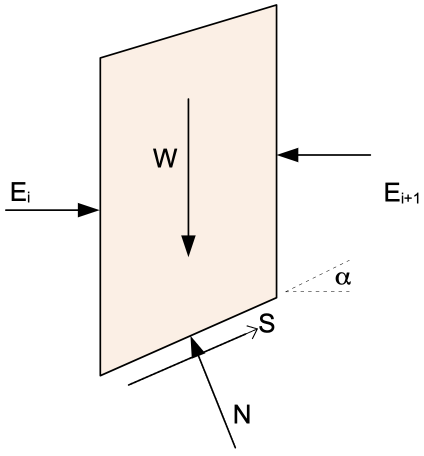
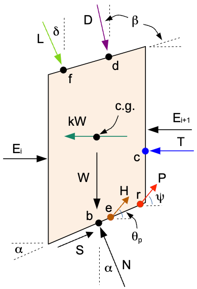

# Bishop's Simplified Method

Bishop's Simplified Method is a widely used limit equilibrium technique for analyzing slope stability, especially suitable for **circular slip surfaces**. It improves on the Ordinary Method of Slices by including interslice normal forces and satisfies both **moment** and **vertical force** equilibrium. On circular surfaces its factor of safety is typically very close to the rigorous Spencer value, which makes it a dependable choice for routine design and a convenient check on Spencer; its main restriction is that it applies only to circular slip surfaces. The key assumptions are:

- Circular slip surface  
- Interslice side forces are **horizontal** and the moments they create are negligible
- Satisfies:
    - Moment equilibrium
    - Vertical force equilibrium
- Does **not** satisfy horizontal force equilibrium

With these assumptions, the forces acting on the slice are as follows:

{width=400px}

Where:

>$W$ = weight of the slice  
$\alpha$ = base inclination angle of the slice  
$\Delta \ell$ = length of the base  
$c', \phi'$ = effective cohesion and friction angle  
$u$ = pore water pressure  
$N$ = normal force on the base of the slice  
$S$ = shear force at the base

Recall that:

>$N = N' + u \Delta \ell$

>$N' = N - u \Delta \ell$

Where $N'$ is the effective normal stress on the base of the slice.

Summing forces in the vertical direction:

>$\sum F_y = 0$

>$N \cos \alpha + S \sin \alpha - W = 0$
>
>$(N' + u \Delta \ell) \cos \alpha + S \sin \alpha - W = 0$
> 
>$N' \cos \alpha + u \Delta \ell \cos \alpha + S \sin \alpha - W = 0  \qquad (1)$

Where $S$ is the mobilized shear force at the base of the slice. The shear force is given by:

>$S = \dfrac{1}{F} \left[c \Delta \ell + N' \tan \phi' \right]   \qquad (2)$

Substituting (2) into (1):

>$N' \cos \alpha + u \Delta \ell \cos \alpha + \dfrac{1}{F} \left[ c \Delta \ell + N' \tan \phi' \right] \sin \alpha - W = 0$

Now solve for the effective normal force $N'$. First, we rearrange the equation:

>$N' \cos \alpha + u \Delta \ell \cos \alpha + \dfrac{c \Delta \ell}{F} \sin \alpha + \dfrac{N' \tan \phi'}{F} \sin \alpha - W = 0$

Next, we isolate all terms involving $N'$:

>$N' \cos \alpha + \dfrac{N' \tan \phi'}{F} \sin \alpha = W - u \Delta \ell \cos \alpha - \dfrac{c \Delta \ell}{F} \sin \alpha$

>$N' \left( \cos \alpha + \dfrac{\sin \alpha \tan \phi'}{F} \right) = W - u \Delta \ell \cos \alpha - \dfrac{c \Delta \ell}{F} \sin \alpha$

Finally, we can solve for $N'$:

>$N' = \dfrac{W - u \Delta \ell \cos \alpha - \dfrac{c \Delta \ell}{F} \sin \alpha}{\cos \alpha + \dfrac{\sin \alpha \tan \phi'}{F}}   \qquad (3)$

Next we use the general equation for the factor of safety based on moment equilibrium (resisting moments divided by driving moments):

>$F = \dfrac{\sum (c + \sigma' \tan \phi') \Delta \ell}{\sum W \sin \alpha}$

>$N' = \sigma' \Delta \ell$

thus:

>$F = \dfrac{\sum (c \Delta \ell + N' \tan \phi')}{\sum W \sin \alpha}   \qquad (4)$

Next, we substitute (3) into (4):

>$F = \dfrac{\sum \left[ c \Delta \ell + \left( \dfrac{W - u \Delta \ell \cos \alpha - \dfrac{c \Delta \ell}{F} \sin \alpha}{\cos \alpha + \dfrac{\sin \alpha \tan \phi'}{F}} \right) \tan \phi' \right]}{\sum W \sin \alpha}$

To simplify the numerator, we multiply  $c \Delta \ell$ by $\dfrac{\cos \alpha + \dfrac{\sin \alpha \tan \phi'}{F}}{\cos \alpha + \dfrac{\sin \alpha \tan \phi'}{F}}$ to combine like terms:

>$F = \dfrac{\sum \left[ \dfrac{c \Delta \ell (\cos \alpha + \dfrac{\sin \alpha \tan \phi'}{F}) + (W - u \Delta \ell \cos \alpha - \dfrac{c \Delta \ell}{F} \sin \alpha) \tan \phi'}{\cos \alpha + \dfrac{\sin \alpha \tan \phi'}{F}} \right]}{\sum W \sin \alpha}$

Now we rearrange the numerator:

>$F = \dfrac{\sum \left[ \dfrac{c \Delta \ell \cos \alpha + \dfrac{c \Delta \ell}{F} \sin \alpha \tan \phi' + (W - u \Delta \ell \cos \alpha)  \tan \phi' - \dfrac{c \Delta \ell}{F} \sin \alpha \tan \phi'}{\cos \alpha + \dfrac{\sin \alpha \tan \phi'}{F}} \right]}{\sum W \sin \alpha}$

Finally, the $\dfrac{c \Delta \ell}{F} \sin \alpha \tan \phi'$ terms cancel out, leading to:

>$F = \dfrac{\sum \left[ \dfrac{c \Delta \ell \cos \alpha + (W - u \Delta \ell \cos \alpha)  \tan \phi'}{\cos \alpha + \dfrac{\sin \alpha \tan \phi'}{F}} \right]}{\sum W \sin \alpha}   \qquad (5)$

Which is the standard equation for the factor of safety for Bishop's method.

The factor of safety $F$ appears on both sides of the equation, so it must be solved **iteratively**.

Once $F$ is determined, $N'$ can be computed using equation (3) above.

## Complete Formulation

For a complete implementation of Bishop's Simplified Method, we need to consider additional forces acting on the slice. The full set of forces are shown in the following figure:

{width=400px}

Where:

>$D$ = distributed load resultant force  
$\beta$ = inclination of the distributed load (perpendicular to slope)  
$kW$ = seismic force for pseudo-static seismic analysis  
$c.g.$ = center of gravity of the slice  
$P$ = reinforcement force at point $r$ on the base of the slice, at angle $\psi$ from horizontal ($\psi = \alpha$ for tangent/flexible reinforcement, the default; $\psi$ = the line's own inclination for axial/rigid reinforcement)  
$T$ = tension crack water force  
$H$ = pile/pier force at point $e$ on the failure surface  
$\theta_p$ = angle of pile force from horizontal (positive = counterclockwise/upward)  
$L$ = line load at point $f$ on the top of the slice, at angle $\delta$ from horizontal (default $-90°$ = straight down)  

Each of these forces is described in detail in the [Ordinary Method of Slices (OMS)](oms.md) section. The forces $D$, $kW$, $P$, $T$, $H$, and $L$ are included in the Bishop's method factor of safety equation as follows:

### Vertical Force Equilibrium

First we need to consider how these forces affect the vertical force equilibrium. The vertical force equilibrium equation becomes:

>$N \cos \alpha + S \sin \alpha + P \sin \psi + H \sin \theta_p + L \sin \delta - W - D \cos \beta = 0$
>
>$(N' + u \Delta \ell) \cos \alpha + S \sin \alpha + P \sin \psi + H \sin \theta_p + L \sin \delta - W - D \cos \beta = 0$

>$N'  \cos \alpha + u \Delta \ell \cos \alpha + S \sin \alpha + P \sin \psi + H \sin \theta_p + L \sin \delta - W - D \cos \beta = 0  \qquad (6)$
 
The shear force on the base of the slice remains the same as before:

>$S = \dfrac{1}{F} \left[c \Delta \ell + N' \tan \phi' \right]   \qquad (7)$

Substituting (7) into (6) and solving for N':

>$N' \cos \alpha + u \Delta \ell \cos \alpha + \dfrac{1}{F} \left[c \Delta \ell + N' \tan \phi' \right] \sin \alpha + P \sin \psi + H \sin \theta_p + L \sin \delta - W - D \cos \beta = 0$

>$N' \cos \alpha + u \Delta \ell \cos \alpha + \dfrac{1}{F} c \Delta \ell \sin \alpha + \dfrac{1}{F} N' \tan \phi' \sin \alpha + P \sin \psi + H \sin \theta_p + L \sin \delta - W - D \cos \beta = 0$
>
>$N' \cos \alpha + \dfrac{1}{F} N' \tan \phi' \sin \alpha = W + D \cos \beta - P \sin \psi - H \sin \theta_p - L \sin \delta - u \Delta \ell \cos \alpha - \dfrac{1}{F} c \Delta \ell \sin \alpha$
>
>$N' \left( \cos \alpha + \dfrac{\sin \alpha \tan \phi'}{F} \right) = W + D \cos \beta - P \sin \psi - H \sin \theta_p - L \sin \delta - u \Delta \ell \cos \alpha - \dfrac{1}{F} c \Delta \ell \sin \alpha$

Finally, we can solve for $N'$:

>$N' = \dfrac{W + D \cos \beta - P \sin \psi - H \sin \theta_p - L \sin \delta - u \Delta \ell \cos \alpha - \dfrac{c \Delta \ell}{F}  \sin \alpha}{\cos \alpha + \dfrac{\sin \alpha \tan \phi'}{F}}   \qquad (8)$

### Moment Equilibrium

The moment equilibrium equation about the center of the slip circle must also be revised to include the moments from
the additional forces. The mobilized shear force is $S_{mob} = S/F$, where $S = c \Delta \ell + N' \tan \phi'$ is the full shear strength. The reinforcement force $P$ (when Appl = Active, the default), the pile force $H$, and the line load $L$ are known applied forces and are **not** factored by $F$; a Passive reinforcement force instead joins the mobilized side and is divided by $F$. For Dir = Tangent ($\psi = \alpha$) the reinforcement acts tangent to the circle with moment arm exactly $R$, so its component terms below collapse to $R \sum P$; the component form is required for Dir = Axial. Taking moments about the center of the circle:

>$R \sum \dfrac{S}{F} + \sum \left[ P \cos \psi \, a_{ry} + P \sin \psi \, a_{rx} \right] + \sum D \sin \beta \, a_{dy} + \sum \left[ H \cos \theta_p \, a_{ey} + H \sin \theta_p \, a_{ex} \right] + \sum \left[ L \cos \delta \, a_{fy} + L \sin \delta \, a_{fx} \right] = R \sum W \sin \alpha + \sum D \cos \beta \, a_{dx} + k\sum W \, a_s + T \, a_t   \qquad (9)$

Where:
>$a_{dx}$ = horizontal distance from center of circle to point $d$ 
> $a_{dy}$ = vertical distance from center of circle to point $d$ 
> $a_s$ = vertical distance from center of circle to center of gravity of the slice 
> $a_t$ = vertical distance from center of circle to point $c$ 
> $a_{ey}$ = vertical distance from center of circle to point $e$: $Y_o - y_e$ 
> $a_{ex}$ = horizontal distance from center of circle to point $e$: $x_e - X_o$

The pile force $H$ is decomposed into horizontal ($H \cos \theta_p$) and vertical ($H \sin \theta_p$) components, each with its own moment arm about the circle center.

Isolating the shear term on the left side:

>$R \sum \dfrac{S}{F} = R \sum W \sin \alpha + \sum D \cos \beta \, a_{dx} + k\sum W \, a_s + T \, a_t - \sum \left[ P \cos \psi \, a_{ry} + P \sin \psi \, a_{rx} \right] - \sum D \sin \beta \, a_{dy} - \sum \left[ H \cos \theta_p \, a_{ey} + H \sin \theta_p \, a_{ex} \right] - \sum \left[ L \cos \delta \, a_{fy} + L \sin \delta \, a_{fx} \right]$

Dividing by $R$:

>$\dfrac{1}{F} \sum S = \sum W \sin \alpha + \frac{1}{R}\sum D \cos \beta \, a_{dx} + \frac{k}{R}\sum W \, a_s + \frac{1}{R} T \, a_t - \frac{1}{R}\sum \left[ P \cos \psi \, a_{ry} + P \sin \psi \, a_{rx} \right] - \frac{1}{R}\sum D \sin \beta \, a_{dy} - \frac{1}{R}\sum \left[ H \cos \theta_p \, a_{ey} + H \sin \theta_p \, a_{ex} \right] - \frac{1}{R}\sum \left[ L \cos \delta \, a_{fy} + L \sin \delta \, a_{fx} \right]$

Solving for $F$:

>$F = \dfrac{\sum S}{\sum W \sin \alpha + \frac{1}{R}\sum D \cos \beta \, a_{dx} + \frac{k}{R}\sum W \, a_s + \frac{1}{R} T \, a_t - \frac{1}{R}\sum \left[ P \cos \psi \, a_{ry} + P \sin \psi \, a_{rx} \right] - \frac{1}{R}\sum D \sin \beta \, a_{dy} - \frac{1}{R}\sum \left[ H \cos \theta_p \, a_{ey} + H \sin \theta_p \, a_{ex} \right] - \frac{1}{R}\sum \left[ L \cos \delta \, a_{fy} + L \sin \delta \, a_{fx} \right]}$

Substituting $S = c \Delta \ell + N' \tan \phi'$:

>$F = \dfrac{\sum \left( c \Delta \ell + N' \tan \phi' \right)}{\sum W \sin \alpha + \frac{1}{R}\sum D \cos \beta \, a_{dx} + \frac{k}{R}\sum W \, a_s + \frac{1}{R} T \, a_t - \frac{1}{R}\sum \left[ P \cos \psi \, a_{ry} + P \sin \psi \, a_{rx} \right] - \frac{1}{R}\sum D \sin \beta \, a_{dy} - \frac{1}{R}\sum \left[ H \cos \theta_p \, a_{ey} + H \sin \theta_p \, a_{ex} \right] - \frac{1}{R}\sum \left[ L \cos \delta \, a_{fy} + L \sin \delta \, a_{fx} \right]}$

Substituting (8) for $N'$:

>$F = \dfrac{\sum \left(c \Delta \ell + \left[ \dfrac{W + D \cos \beta - P \sin \psi - H \sin \theta_p - L \sin \delta - u \Delta \ell \cos \alpha - \dfrac{c \Delta \ell}{F}  \sin \alpha}{\cos \alpha + \dfrac{\sin \alpha \tan \phi'}{F}} \right]  \tan \phi' \right)}{\sum W \sin \alpha + \frac{1}{R}\sum D \cos \beta \, a_{dx} + \frac{k}{R}\sum W \, a_s + \frac{1}{R} T \, a_t - \frac{1}{R}\sum \left[ P \cos \psi \, a_{ry} + P \sin \psi \, a_{rx} \right] - \frac{1}{R}\sum D \sin \beta \, a_{dy} - \frac{1}{R}\sum \left[ H \cos \theta_p \, a_{ey} + H \sin \theta_p \, a_{ex} \right] - \frac{1}{R}\sum \left[ L \cos \delta \, a_{fy} + L \sin \delta \, a_{fx} \right]}$

To simplify the numerator, we multiply $c \Delta \ell$ by $\dfrac{\cos \alpha + \dfrac{\sin \alpha \tan \phi'}{F}}{\cos \alpha + \dfrac{\sin \alpha \tan \phi'}{F}}$:

>$F = \dfrac{\sum \left[ \dfrac{c \Delta \ell (\cos \alpha + \dfrac{\sin \alpha \tan \phi'}{F}) + (W + D \cos \beta - P \sin \psi - H \sin \theta_p - L \sin \delta - u \Delta \ell \cos \alpha)  \tan \phi' - \dfrac{c \Delta \ell}{F}  \sin \alpha  \tan \phi'}{\cos \alpha + \dfrac{\sin \alpha \tan \phi'}{F}} \right]}{\sum W \sin \alpha + \frac{1}{R}\sum D \cos \beta \, a_{dx} + \frac{k}{R}\sum W \, a_s + \frac{1}{R} T \, a_t - \frac{1}{R}\sum \left[ P \cos \psi \, a_{ry} + P \sin \psi \, a_{rx} \right] - \frac{1}{R}\sum D \sin \beta \, a_{dy} - \frac{1}{R}\sum \left[ H \cos \theta_p \, a_{ey} + H \sin \theta_p \, a_{ex} \right] - \frac{1}{R}\sum \left[ L \cos \delta \, a_{fy} + L \sin \delta \, a_{fx} \right]}$

Now, we can rearrange the numerator:

>$F = \dfrac{\sum \left[ \dfrac{c \Delta \ell \cos \alpha + \dfrac{c \Delta \ell}{F}  \sin \alpha  \tan \phi' + (W + D \cos \beta - P \sin \psi - H \sin \theta_p - L \sin \delta - u \Delta \ell \cos \alpha)  \tan \phi' - \dfrac{c \Delta \ell}{F}  \sin \alpha  \tan \phi'}{\cos \alpha + \dfrac{\sin \alpha \tan \phi'}{F}} \right]}{\sum W \sin \alpha + \frac{1}{R}\sum D \cos \beta \, a_{dx} + \frac{k}{R}\sum W \, a_s + \frac{1}{R} T \, a_t - \frac{1}{R}\sum \left[ P \cos \psi \, a_{ry} + P \sin \psi \, a_{rx} \right] - \frac{1}{R}\sum D \sin \beta \, a_{dy} - \frac{1}{R}\sum \left[ H \cos \theta_p \, a_{ey} + H \sin \theta_p \, a_{ex} \right] - \frac{1}{R}\sum \left[ L \cos \delta \, a_{fy} + L \sin \delta \, a_{fx} \right]}$

Finally, the $\dfrac{c\Delta\ell}{F} \sin \alpha \tan \phi'$ terms cancel out, leading to:

>$F = \dfrac{\sum \left[ \dfrac{c \Delta \ell \cos \alpha + (W + D \cos \beta - P \sin \psi - H \sin \theta_p - L \sin \delta - u \Delta \ell \cos \alpha)  \tan \phi'}{\cos \alpha + \dfrac{\sin \alpha \tan \phi'}{F}} \right]}{\sum W \sin \alpha + \frac{1}{R}\sum D \cos \beta \, a_{dx} + \frac{k}{R}\sum W \, a_s + \frac{1}{R} T \, a_t - \frac{1}{R}\sum \left[ P \cos \psi \, a_{ry} + P \sin \psi \, a_{rx} \right] - \frac{1}{R}\sum D \sin \beta \, a_{dy} - \frac{1}{R}\sum \left[ H \cos \theta_p \, a_{ey} + H \sin \theta_p \, a_{ex} \right] - \frac{1}{R}\sum \left[ L \cos \delta \, a_{fy} + L \sin \delta \, a_{fx} \right]}   \qquad (10)$

This is the **complete formulation** for Bishop's Simplified Method. Note that:

- The reinforcement force $P$, the pile force $H$, and the distributed load resisting moment $D \sin \beta\, a_{dy}$ appear in the **denominator** because they are known forces that are **not** factored by the safety factor $F$
- $P$ and $H$ affect the numerator indirectly through their effect on $N'$
- The water force $T$ only applies to the uppermost slice

The factor of safety $F$ appears on both sides of the equation, so it must be solved **iteratively**, just like the basic formulation.

### Composite Surfaces

Bishop's moment equation, like the OMS equation, factors out a constant radius $R$ and drops the base normal on the grounds that it points at the center of rotation. Both steps assume every slice base lies on the circle. On a [composite surface](overview.md#composite-failure-surfaces) — a circle truncated at bedrock, running along the floor between the crossings — they do not, and XSLOPE substitutes the general moment arms derived in [Ordinary Method of Slices](oms.md#composite-surfaces):

>$F = \dfrac{\sum \left( c \Delta \ell + N' \tan \phi \right) a_S}{\sum W x_r - \sum \left( N' + u \Delta \ell \right) a_N + \sum D \cos \beta \, a_{dx} + k \sum W \, a_s + T \, a_t - \ldots}$

with $a_S = x_r \sin \alpha - y_r \cos \alpha$ and $a_N = x_r \cos \alpha + y_r \sin \alpha$, both measured from the center of rotation. On a true circle $a_S = R$ and $a_N = 0$, recovering the equation above exactly.

One difference from OMS: $N'$ in Bishop comes from vertical equilibrium and so depends on $F$, which means the normal-force moment $\sum (N' + u \Delta \ell)\, a_N$ is itself part of the iteration. It is recomputed inside the fixed-point loop rather than once up front. The expression for $N'$ (equation 11) is unaffected — it comes from vertical equilibrium of a single slice, which knows nothing about the shape of the surface as a whole.

---

## Summary

Assumes **horizontal side forces** 
Satisfies **moment** and **vertical force** equilibrium 
Applicable to **circular** and **composite** slip surfaces 
Requires **iteration** to solve for $F$ 
More accurate than OMS, especially for **effective stress analysis** with high pore pressures
