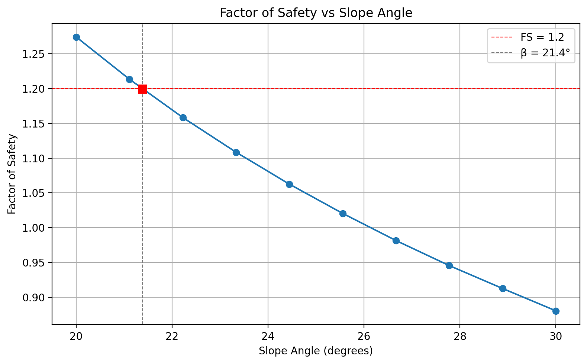
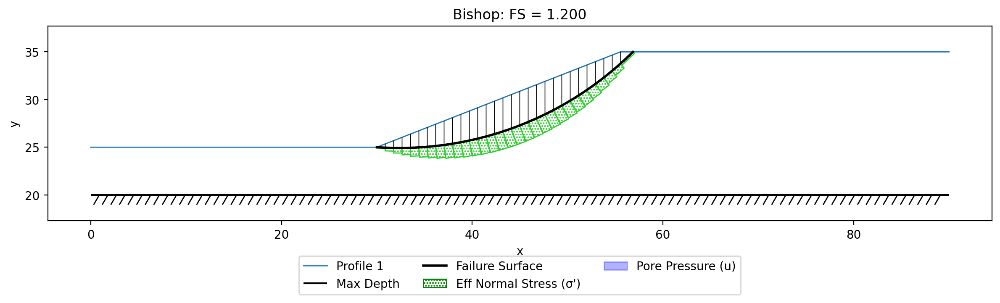
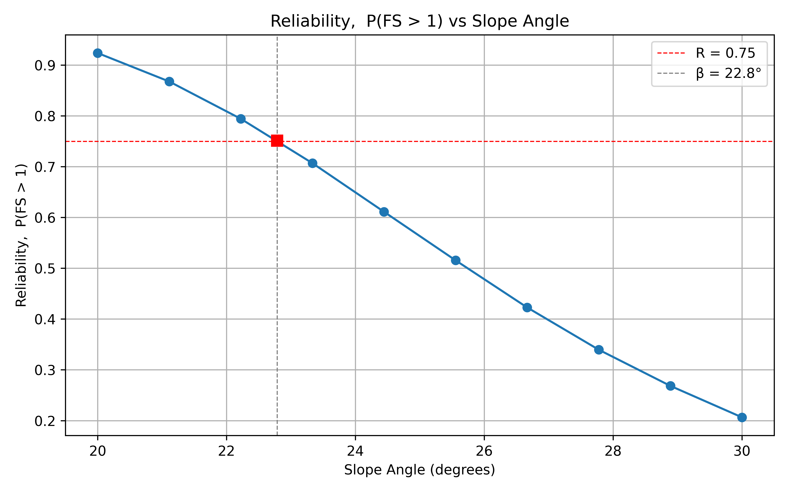
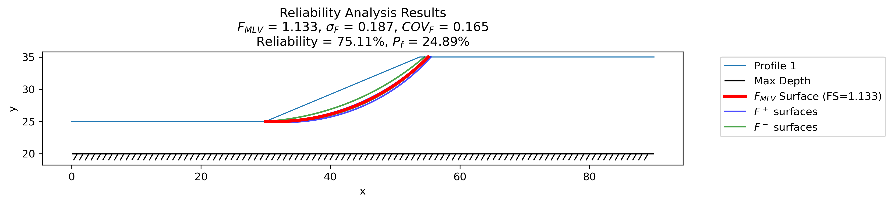

# Slope Design Example

One of the powerful benefits of using XSLOPE as a Python package is the ability to perform slope design by iteratively adjusting the slope geometry until a target performance level is achieved. This example shows how to use XSLOPE to find the critical slope angle that corresponds to either:

- a target **factor of safety** (deterministic design, e.g. FS = 1.2), or
- a target **reliability** $R = P(FS > 1)$ (probabilistic design, e.g. R = 0.75).

The same driver script (`main_design.py`) performs both studies; you select between them with the `design_mode` parameter (`"fs"` or `"reliability"`).

The following Colab notebook has been prepared to implement the design process:

This example assumes a simple slope profile where the slope angle can be adjusted by moving a single point on the first profile line. It is assumed that profile line #1 contains a point at the toe of the slope and that the next point is at the top of the slope face. This point is moved to change the slope angle.

## How It Works

The design process modifies the slope geometry by adjusting a single point on the first profile line. The key steps are:

1. **Choose the design mode and target.** `design_mode = "fs"` sweeps the factor of safety toward a target `design_fs`; `design_mode = "reliability"` sweeps the reliability $R = P(FS>1)$ toward a target `design_reliability`.
2. **Define the range of slope angles** ($\beta_1$ to $\beta_2$) and the number of angles to evaluate (`num_angles`).
3. **Sweep the angles.** For each angle, the x-coordinate of the slope point is recalculated, the material polygons and ground surface are rebuilt from the edited profile, and the design metric is evaluated:
    - In FS mode, a full automated search finds the critical factor of safety.
    - In reliability mode, a full reliability analysis finds the critical surface and computes $R$.
4. **Interpolate the results** to find the slope angle that corresponds to the target metric.
5. **Verify** by re-running the analysis at the interpolated angle.

The user specifies two point indices:

- **toe_index**: the zero-based index of the toe of the slope on the first profile line.
- **slope_index**: the zero-based index of the point at the top of the slope face. This is the point whose x-coordinate is adjusted to achieve the desired slope angle. For a slope rising to the right, this is typically `toe_index + 1`; for a slope rising to the left, `toe_index - 1`.

Given a slope angle $\beta$, the x-coordinate of the slope point is calculated as:

>>$x_{top} = x_{toe} + \dfrac{y_{top} - y_{toe}}{\tan(\beta)}$

The y-coordinate of the slope point is held constant, so only the horizontal position changes. Both the factor of safety and the reliability decrease monotonically as the slope steepens, so the target is located by linear interpolation (`numpy.interp`) between the swept data points and confirmed with a verification run at the interpolated angle.

The search uses **Bishop's method** by default. For the simple circular surfaces in this example it returns the same factor of safety as Spencer's method but is markedly faster — which matters in reliability mode, where several searches are run per angle. Spencer can be used when a force-and-moment method or a non-circular surface is required.

## Sample Problem

Consider the slope shown below: a single c-φ soil with appreciable strength uncertainty, sitting on a horizontal bedrock surface. The slope face is 10 m high (a 10 m rise over a 20 m run in the starting geometry, a slope angle of about 26.6°), and two starting circles are defined for the search.

{width=1000}

Excel input file: [xslope_acads_simple.xlsx](files/xslope_acads_simple.xlsx)

The soil properties (metric units) are:

| Property | Mean | Std. dev. |
|:--------:|:----:|:---------:|
| Unit weight, $\gamma$ (kN/m³) | 20.0 | 1.2 |
| Cohesion, $c'$ (kPa) | 3.0 | 1.8 |
| Friction angle, $\phi'$ (°) | 19.6 | 2.74 |

The standard deviations are required only for the reliability study; they are ignored in the factor-of-safety study. The design parameters are:

| Parameter | Value |
|:---------:|:-----:|
| beta1     | 20°   |
| beta2     | 30°   |
| num_angles | 10   |
| toe_index | 1     |
| slope_index | 2   |
| method    | Bishop |

The sweep produces 10 equally spaced angles between 20° and 30°.

## Factor of Safety Design

With `design_mode = "fs"`, the script reports the critical factor of safety at each slope angle:

| Slope angle | FS |
|:-----------:|:----:|
| 20.0° | 1.27 |
| 22.2° | 1.16 |
| 24.4° | 1.06 |
| 26.7° | 0.98 |
| 28.9° | 0.91 |
| 30.0° | 0.88 |

For this weak soil the factor of safety ranges from about 0.88 to 1.27 across the swept angles, so the target `design_fs` must fall **within that range**. With `design_fs = 1.2`, interpolation gives a critical slope angle of about **21.4°**:

{width=1000}

A verification run at the interpolated angle confirms a factor of safety equal to the target, and the critical failure surface is plotted below:

{width=1000}

If the target lies outside the computed range (for example FS = 1.5, which is above the entire range for this slope), the script reports that the target is out of range and asks you to adjust `beta1`/`beta2` or the target.

## Reliability-Based Design

Setting `design_mode = "reliability"` performs a probabilistic design. For each slope angle the script runs a full reliability analysis using the Taylor Series (TSPM) method: it finds the critical surface, perturbs each material property that has a non-zero standard deviation by $\pm\sigma$ to estimate the variance of the factor of safety, and computes the reliability $R = P(FS > 1)$ assuming a lognormal distribution of FS. Reliability-based design therefore requires standard deviations for at least one material property (columns L–Q of the **mat** sheet); the example provides $\sigma$ for $\gamma$, $c'$, and $\phi'$.

The reliability decreases as the slope steepens. Interpolating to a target reliability of **R = 0.75** gives a critical slope angle of **22.78°**:

{width=1000}

A verification run at that angle confirms the result and reports the full reliability statistics:

{width=1000}

At the critical angle the most-likely-value (mean) factor of safety is $F_{MLV} = 1.13$ with a standard deviation $\sigma_F = 0.19$ (coefficient of variation $\approx 0.17$), giving a reliability of about 75% and a corresponding probability of failure of about 25%. Note that designing to $R = 0.75$ corresponds to a mean factor of safety well above 1.0 — the gap reflects the strength uncertainty. Typical real-world reliability targets are higher (0.95–0.99); this sample's relatively large coefficient of variation in the strength keeps the achievable reliability modest over the swept angles, which is why R = 0.75 is used here to bracket the sweep.

## Limitations

This design tool is intended for simple parametric studies where the slope angle is the primary design variable. The following limitations apply:

- **Simple slope geometry only.** The tool adjusts a single point on the first profile line. Slopes with benches, berms, or other complex geometries would require a more sophisticated approach.
- **Profile-line input only.** The sweep edits profile lines and rebuilds the material polygons from them, so a polygon-sheet input (which has no profile lines to reshape) cannot be used for the design sweep.
- **Reliability mode requires standard deviations.** At least one material property must have a non-zero standard deviation in the **mat** sheet, or the reliability analysis cannot run.
- **No distributed loads.** If the slope has distributed loads (e.g., surcharge, water), these are not automatically adjusted as the geometry changes. The loads would need to be updated manually for each configuration.
- **No FEM mesh for pore pressures.** If pore pressures are derived from a finite element seepage mesh, the mesh is tied to the original geometry and is not rebuilt when the slope angle changes. Piezometric line-based pore pressures will work correctly since they are computed from the slice geometry.
- **No reinforcement adjustment.** If the slope includes soil reinforcement (e.g., geogrids), the reinforcement geometry is not adjusted as the slope angle changes.
- **Single design variable.** The tool sweeps a single variable (slope angle). Multi-variable optimization (e.g., simultaneously varying slope angle and berm width) is not supported.
- **Linear interpolation.** The critical angle is found by linear interpolation between the swept data points. For highly nonlinear relationships, increasing `num_angles` will improve accuracy.

Both circular and non-circular surfaces are supported (set `surface_type`); this example uses circular surfaces. These limitations could be addressed with additional coding, but the current implementation is intended as a straightforward starting point for simple slope design problems.
