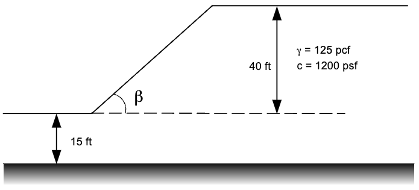
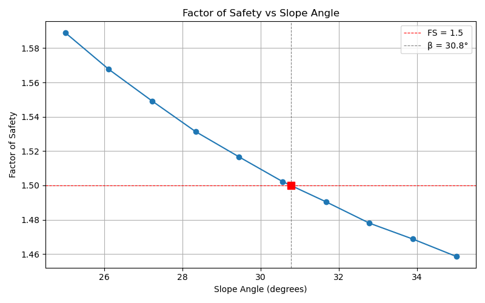
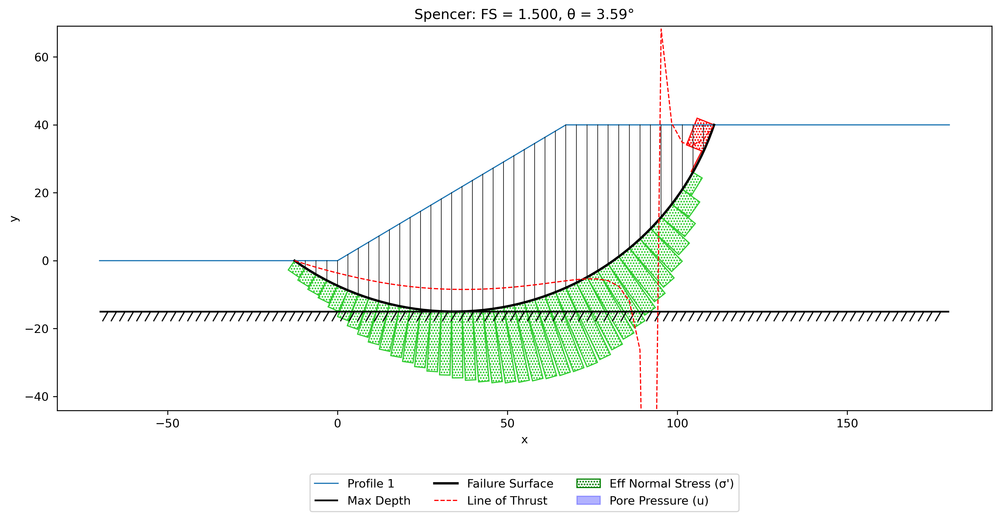

# Slope Design Example

One of the powerful benefits of using a slope stability analysis tool like XSlope as a Python package is the ability to perform slope design by iteratively adjusting the slope geometry until a target factor of safety is achieved. In this example, we will demonstrate how to use XSlope to find the critical slope angle that corresponds to a desired factor of safety (e.g., FS = 1.5) for a given slope profile.

The following Colab notebook has been prepared to implement the design process:

This notebook assumes that we are dealing with a simple slope profile where we can adjust the slope angle by modifying the coordinates of the slope surface. It is assumed that profile line #1 contains a point at the toe of the slope and the next point is at the top of the slope face. This point can be adjusted to change the slope angle.

## How It Works

The design process modifies the slope geometry by adjusting a single point on the first profile line. The key steps are:

1. **Define the range of slope angles** ($\beta_1$ to $\beta_2$) and the target factor of safety.
2. **Sweep the angles.** For each angle, the x-coordinate of the slope point is recalculated and a full automated circular search is performed to find the critical FS.
3. **Interpolate the results** to find the slope angle that corresponds to the target FS.
4. **Verify** by re-running the analysis at the interpolated angle.

The user specifies two point indices:

- **toe_index**: The zero-based index of the toe of the slope on the first profile line.
- **slope_index**: The zero-based index of the point at the top of the slope face. This is the point whose x-coordinate is adjusted to achieve the desired slope angle. For a right-facing slope (high on the left), this is typically `toe_index + 1`. For a left-facing slope (high on the right), this is typically `toe_index - 1`.

Given a slope angle $\beta$, the x-coordinate of the slope point is calculated as:

>>$x_{top} = x_{toe} + \dfrac{y_{top} - y_{toe}}{\tan(\beta)}$

The y-coordinate of the slope point is held constant, so only the horizontal position changes. The ground surface is rebuilt after each adjustment, and a full automated circular search is performed to find the critical factor of safety at that angle.

After sweeping the range of angles, the results are interpolated using `numpy.interp` to find the angle that corresponds to the target FS. A verification run is then performed at the interpolated angle to confirm the result.

## Sample Problem

Consider the following slope profile, where we want to find the critical slope angle that yields a factor of safety of 1.5. The slope consists of a single material ($\gamma$ = 125 pcf, c = 1200 psf, $\phi$ = 0) with a height of 40 ft sitting on a 15 ft foundation layer of the same material.

Excel input file: [xslope_design.xlsx](files/xslope_design.xlsx)

The design parameters are:

| Parameter | Value |
|:---------:|:-----:|
| beta1     | 25°   |
| beta2     | 35°   |
| design_fs | 1.5   |
| toe_index | 1     |
| slope_index | 2   |
| method    | Spencer |

The sweep produces 10 equally spaced angles between 25° and 35°. For each angle, the slope geometry is adjusted and a circular search finds the critical FS. The results are then interpolated and verified:

The critical failure surface at the interpolated slope angle is plotted below, confirming a factor of safety close to the target value of 1.5:

{width=1000}

## Limitations

This design tool is intended for simple parametric studies where the slope angle is the primary design variable. The following limitations apply:

- **Simple slope geometry only.** The tool adjusts a single point on the first profile line. Slopes with benches, berms, or other complex geometries would require a more sophisticated approach.
- **Circular failure surfaces only.** The automated search uses the circular search algorithm. Non-circular failure surfaces are not supported in the design sweep.
- **No distributed loads.** If the slope has distributed loads (e.g., surcharge, water), these are not automatically adjusted as the geometry changes. The loads would need to be manually updated for each configuration.
- **No FEM mesh for pore pressures.** If pore pressures are derived from a finite element seepage mesh, the mesh is tied to the original geometry and is not rebuilt when the slope angle changes. Piezometric line-based pore pressures will work correctly since they are computed from the slice geometry.
- **No reinforcement adjustment.** If the slope includes soil reinforcement (e.g., geogrids), the reinforcement geometry is not adjusted as the slope angle changes.
- **Single parameter only.** The tool sweeps a single variable (slope angle). Multi-variable optimization (e.g., simultaneously varying slope angle and berm width) is not supported.
- **Linear interpolation.** The critical angle is found by linear interpolation between the swept data points. For highly nonlinear FS vs. angle relationships, increasing the number of sweep points will improve accuracy.

These limitations could be addressed with additional coding, but the current implementation is intended as a straightforward starting point for simple slope design problems.
