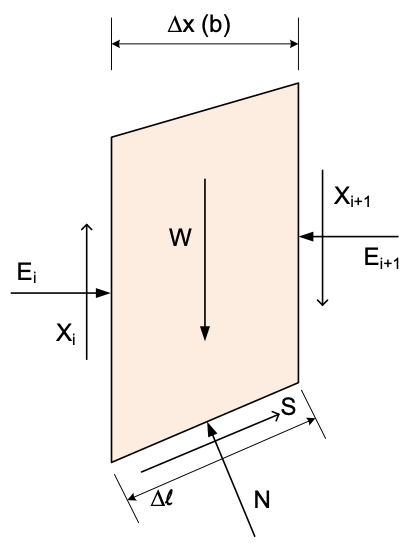
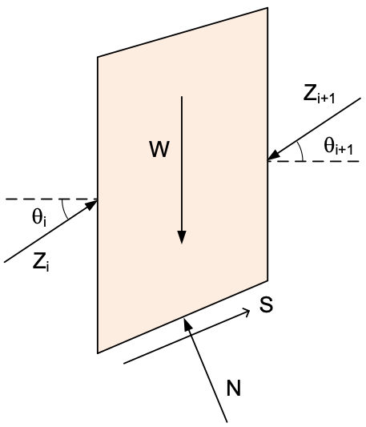
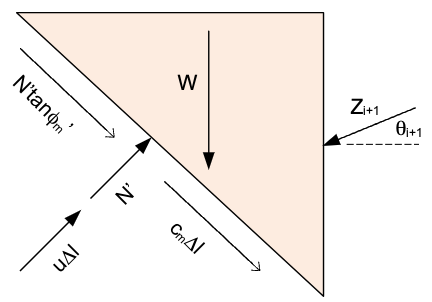
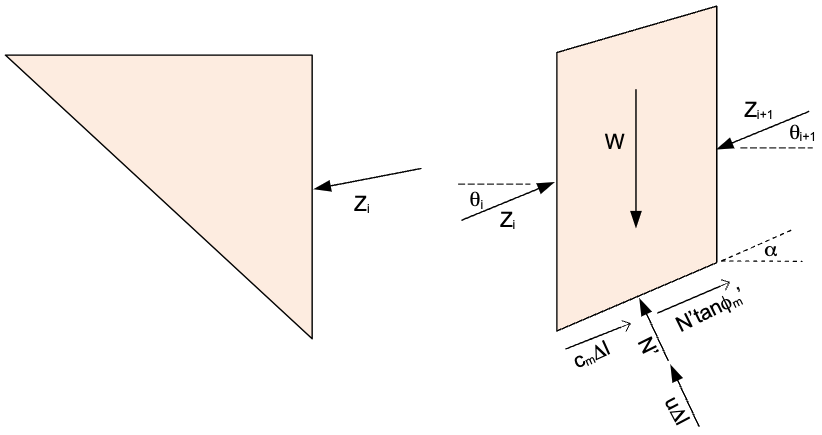
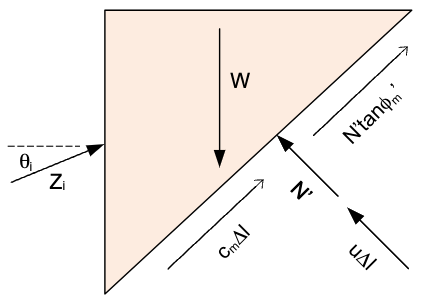
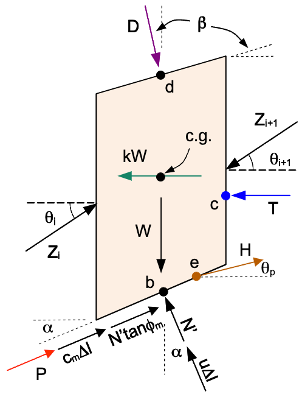
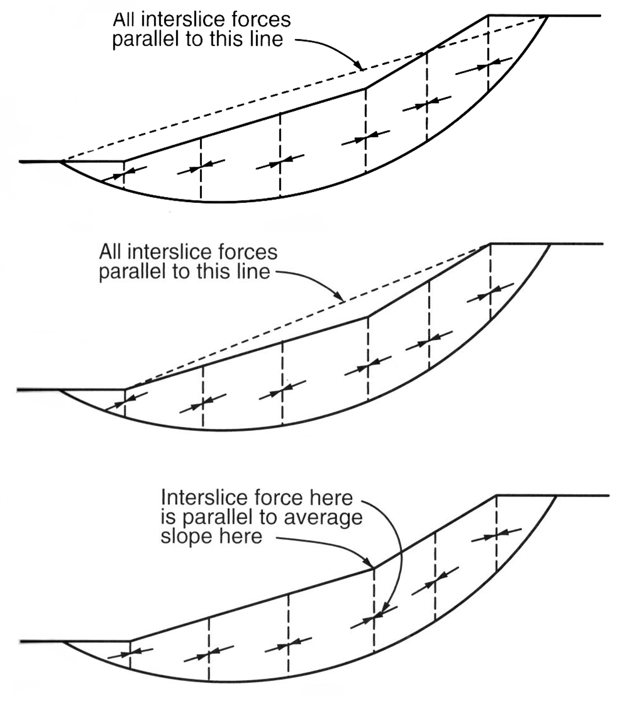

# The Force Equilibrium Method

The force equilibrium method is a common method used to analyze the stability of slopes. It works for both circular 
and non-circular surfaces. It satisfies the force equilibrium equations for each slice, but it does not satisfy the 
moment equilibrium equations. There are several variations of the force equilibrium method, depending on the 
assumptions used for the side force inclination. In **xslope**, two variations of the force equilibrium method are 
supported: the **Lowe and 
Karafiath** method and the **US Army Corps of Engineers** method. Both methods use the same equations, but they differ in 
the side force assumptions. Because they satisfy force but not moment equilibrium, the computed factor of safety depends on the assumed side-force inclination and can be inaccurate — too high or too low — so these methods are best used for comparison, with a complete-equilibrium method such as Spencer preferred for design (see [Conventions and Limitations](#conventions-and-limitations) below).

## Forces Acting on the Slice

To formulate the force equilibrium equations, consider the following slice diagram:

{width=350px }

Note that the side forces are defined by the vertical ($X_i$) and horizontal ($E_i$) components of the force acting on 
the slice. The side forces can also be defined by the magnitude ($Z_i$) and the angle of inclination ($\theta_i$) of 
the force as follows:

{width=350px }

The shear force ($S$) acting on the bottom of the slice is the mobilized shear strength of the soil, which is equal to:

>>$S = \tau_m  \Delta \ell$

where $\tau_m$ is the mobilized shear strength of the soil and $\Delta \ell$ is the length of the slice. The mobilized shear strength is equal to:

>>$\tau_m = \dfrac{c + (\sigma-u)tan\phi}{F}$
 
>>$\tau_m = c_m + \sigma' tan\phi_m$

where:

- $c$ = the cohesion of the soil
- $c_m$ = the mobilized cohesion of the soil = $c/F$
- $\sigma$ = the normal stress acting on the slice
- $\sigma'$ = the effective normal stress acting on the slice = $\sigma - u$
- $u$ = the pore water pressure acting on the slice
- $\phi$ = the angle of internal friction of the soil
- tan$\phi_m$ = the mobilized friction of the soil = tan$\phi/F$
- $F$ = the factor of safety

Inserting $\tau_m$ into the equation for $S$ gives:

>>$S = \left[c_m + (\sigma')  tan\phi_m\right]  \Delta \ell$

>>$S = c_m  \Delta \ell + N'  tan\phi_m$

where:

>>$N'$ = the effective normal force acting on the slice = $\sigma'  \Delta \ell$

>>$N$ = the total normal force acting on the slice = $N' + u \Delta \ell$

## Solving for Unknown Forces

To satisfy force equilibrium, we need to solve for the unknown forces acting on each slice. The ultimate goal is to solve for the factor of safety, F. However, the mobilized shear strength ($c_m$ and $tan \phi_m$) is a function of the factor of safety. Therefore, we first assume a value for the factor of safety and the solve the equilbrium equations for all slices. If the forces balance, we are done. If not, we adjust the factor of safety and repeat until balance is achieved. Also, the side force inclination ($\theta$) is required for all slice boundaries. There are a number of methods for 
establishing the side force inclination. These methods will be reviewed below. For now, we will assume we have a value for the side force inclinations.

So our next step is to use the force equilibrium equations to solve for the unknown forces acting on each slice. We do this by starting on the bottom slice (slice 1) and working our way up to the top slice (slice n). For the first slice, we have:

{width=400px }


The unknowns in this case are the normal force ($N'$) and magnitude of the side force ($Z_{i+1}$). We do know the side 
force inclination ($\theta_{i+1}$). So we have two equations: $\sum F_x = 0$ and $\sum F_y = 0$ and two unknowns. After 
solving for the unknows, we proceed to the next slice:

{width=700px }

The side force on the left side ($Z_{i-1}$) is known from the previous slice. The side force on the right side ($Z_
{i+1}$) is unknown. The effective normal force ($N'$) is also unknown. So again, we have two equations and two unknowns. 

We can continue this process until we reach the top slice:

{width=400px }

At this point, there is no side force on the right side, so we have two equations and one unknown ($N'$), if both 
equilibrium equations are balanced (no residual forces), then the factor of safety is correct. If not, we need to adjust the factor of safety and repeat the process.

## Matrix Solution for Unknown Forces

As shown in the previous section, we need to solve for two unknowns at each slice. For the general case, we can set up equations to solve for the unknowns as follows. First, we sum forces in the x-direction:

>>$\sum F_x = 0 \Rightarrow \left[c_m \Delta \ell + N'  tan(\phi_m)\right]  cos(\alpha) - (N' + u \Delta \ell)  sin(\alpha) + Z_{i}
>   cos(\theta_i) - Z_{i+1}  cos(\theta_{i+1}) = 0$

>>$c_m \Delta \ell   cos(\alpha) + N'  tan(\phi_m)  cos(\alpha) - N'  sin(\alpha) - u \Delta \ell  sin(\alpha) - + Z_{i}  cos
> (\theta_{i}) - Z_
> {i+1}  cos(\theta_{i+1}) = 0$

>>$c_m \Delta \ell   cos(\alpha) + N' \left[tan(\phi_m) cos(\alpha) - sin(\alpha)\right] - u \Delta \ell sin(\alpha) + Z_{i}
>  cos
> (\theta_{i}) - Z_{i+1} cos(\theta_{i+1}) = 0$

Rearranging in terms of our two unknows ($N'$ and $Z_{i+1}$) gives:

>>$N' \left[tan(\phi_m) cos(\alpha) - sin(\alpha)\right] - Z_{i+1} cos(\theta_{i+1}) = - c_m \Delta \ell  cos(\alpha) + u 
> \Delta \ell sin(\alpha) - Z_{i} cos(\theta_i)   \qquad (1)$

Likewise, we can sum forces in the y-direction:

>>$\sum F_y = 0 \Rightarrow \left[c_m \Delta \ell + N' tan(\phi_m)\right] sin(\alpha) + (N' + u \Delta \ell) cos(\alpha) - 
> W + Z_{i} sin(\theta_{i}) - Z_{i+1} sin(\theta_{i+1}) = 0$

>>$c_m \Delta \ell  sin(\alpha) + N' tan(\phi_m) sin(\alpha) + N' cos(\alpha) + u \Delta \ell cos(\alpha) - W + Z_{i} sin
> (\theta_{i}) - 
> Z_{i+1} sin(\theta_{i+1}) = 0$

>>$c_m \Delta \ell  sin(\alpha) + N' \left[tan(\phi_m) sin(\alpha) +  cos(\alpha)\right] + u \Delta \ell cos(\alpha) - W + 
> Z_{i} sin
> (\theta_{i}) - Z_{i+1} sin(\theta_{i+1}) = 0$

Rearranging in terms of our two unknows ($N$ and $Z_{i+1}$) gives:

>>$N' \left[tan(\phi_m) sin(\alpha) + cos(\alpha)\right] - Z_{i+1} sin(\theta_{i+1}) = -c_m \Delta \ell  sin(\alpha) - u\Delta \ell cos(\alpha) + W - Z_{i} sin(\theta_{i})   \qquad (2)$ 

Now we can take equations (1) and (2) and rearrange them into a matrix form. We can write the two equations as:

>>$Ax = b$

where:

- $A$ is a 2x2 matrix of coefficients
- $x$ is a 2x1 vector of unknowns
- $c$ is a 2x1 vector of constants

The matrix $A$ is given by:

>>$A = \begin{bmatrix}tan(\phi_m) cos(\alpha) - sin(\alpha) & -cos(\theta_{i+1})\\tan(\phi_m) sin(\alpha) + cos(\alpha) & -sin(\theta_{i+1})\end{bmatrix}    \qquad (3)$

The vector $x$ is given by:

>>$x = \begin{bmatrix}N'\\Z_{i+1}\end{bmatrix}   \qquad (4)$

The vector $b$ is given by:

>>$b = \begin{bmatrix}- c_m \Delta \ell  cos(\alpha) + u \Delta \ell sin(\alpha) - Z_{i} cos(\theta_{i})\\-c_m \Delta \ell  sin(\alpha) - u\Delta \ell cos(\alpha) + W - Z_{i} sin(\theta_{i})\end{bmatrix}   \qquad (5)$

The matrix equation can then be solved for the two unknowns
($N$ and $Z_{i+1}$) using the numpy linalg method. The solution is given by:

```python
import numpy as np

N[i], Z[i + 1] = np.linalg.solve(A, b)
```

## Complete Formulation

For a complete implementation of the Force Equilibrium method, we need to consider additional forces acting on the slice. The full set of forces are shown in the following figure:

{width=400px}

where:

>$D$ = distributed load resultant force <br>
$\beta$ = inclination of the distributed load (perpendicular to slope) <br>
$kW$ = seismic force for pseudo-static seismic analysis <br>
$c.g.$ = center of gravity of the slice <br>
$P$ = reinforcement force on base of slice <br>
$T$ = tension crack water force <br>
$H$ = pile/pier force at point $e$ on the failure surface <br>
$\theta_p$ = angle of pile force from horizontal (positive = counterclockwise/upward) <br>

Each of these forces is described in detail in the [Ordinary Method of Slices (OMS)](oms.md) section. The forces $D$, $kW$, $P$, $T$, and $H$ are included in the Force Equilibrium method as follows.

Once again, we begin by summing forces in the x-direction, but now we include the additional forces. The pile force $H$ at angle $\theta_p$ has a horizontal component $H \cos \theta_p$ that resists sliding (same direction as reinforcement $P$), so it enters the equilibrium equation with the same sign as $P$:

>>$\sum F_x = 0 \Rightarrow \left[c_m \Delta \ell + N' \tan (\phi_m) + P\right] \cos (\alpha) + H \cos \theta_p - (N' + u \Delta \ell) \sin (\alpha) + Z_{i} \cos (\theta_i) - Z_{i+1} \cos (\theta_{i+1}) + D \sin \beta - kW - T = 0$

>>$c_m \Delta \ell \cos (\alpha) + N' \tan (\phi_m) \cos (\alpha) + P \cos (\alpha) + H \cos \theta_p - N' \sin (\alpha) - u \Delta \ell \sin (\alpha) + Z_{i} \cos (\theta_i) - Z_{i+1} \cos (\theta_{i+1}) + D \sin \beta - kW - T= 0$

>>$c_m \Delta \ell \cos (\alpha) + N' \left[\tan (\phi_m) \cos (\alpha) - \sin (\alpha)\right] + P \cos (\alpha) + H \cos \theta_p - u \Delta \ell \sin (\alpha) + Z_{i} \cos (\theta_i) - Z_{i+1} \cos (\theta_{i+1}) + D \sin \beta -kW -T  = 0$

Rearranging in terms of our two unknowns ($N'$ and $Z_{i+1}$) gives:

>>$N' \left[\tan (\phi_m) \cos (\alpha) - \sin (\alpha)\right] - Z_{i+1} \cos (\theta_{i+1}) = - c_m \Delta \ell \cos (\alpha) - P \cos (\alpha) - H \cos \theta_p + u \Delta \ell \sin (\alpha) - Z_{i} \cos (\theta_i) - D \sin \beta + kW + T   \qquad (6)$

It should be noted that the tension crack water force ($T$) only applies to right side of the top slice on a left-facing slope. For a right-facing slope, the tension crack water force is applied to the left side of the top slice and would act in the opposite direction. Therefore, the sign on $T$ would be negative in that case.

Likewise, we can sum forces in the y-direction. The pile force has a vertical component $H \sin \theta_p$ (upward for positive $\theta_p$), which acts in the same direction as the reinforcement vertical component $P \sin \alpha$:

>>$\sum F_y = 0 \Rightarrow \left[c_m \Delta \ell + N' \tan (\phi_m) + P\right] \sin (\alpha) + H \sin \theta_p + (N' + u \Delta \ell) \cos (\alpha) - W + Z_{i} \sin (\theta_{i}) - Z_{i+1} \sin (\theta_{i+1}) - D \cos \beta = 0$

>>$c_m \Delta \ell \sin (\alpha) + N' \tan (\phi_m) \sin (\alpha) + P \sin (\alpha) + H \sin \theta_p + N' \cos (\alpha) + u \Delta \ell \cos (\alpha) - W + Z_{i} \sin (\theta_{i}) - Z_{i+1} \sin (\theta_{i+1}) - D \cos \beta = 0$

>>$c_m \Delta \ell \sin (\alpha) + N' \left[\tan (\phi_m) \sin (\alpha) +  \cos (\alpha)\right] + P \sin (\alpha) + H \sin \theta_p + u \Delta \ell \cos (\alpha) - W + Z_{i} \sin (\theta_{i}) - Z_{i+1} \sin (\theta_{i+1}) - D \cos \beta = 0$

Rearranging in terms of our two unknowns ($N'$ and $Z_{i+1}$) gives:

>>$N' \left[\tan (\phi_m) \sin (\alpha) +  \cos (\alpha)\right] - Z_{i+1} \sin (\theta_{i+1}) = -c_m \Delta \ell \sin (\alpha) - P \sin (\alpha) - H \sin \theta_p - u\Delta \ell \cos (\alpha) + W - Z_{i} \sin (\theta_{i}) + D \cos \beta   \qquad (7)$

Now we can take equations (6) and (7) and rearrange them into a matrix form. We can write the two equations as:

>>$Ax = b$

The matrix $A$ is given by:

>>$A = \begin{bmatrix}\tan (\phi_m) \cos (\alpha) - \sin (\alpha) & -\cos (\theta_{i+1})\\\tan (\phi_m) \sin (\alpha) +  \cos (\alpha) & -\sin (\theta_{i+1})\end{bmatrix}   \qquad (8)$

The vector $x$ is given by:

>>$x = \begin{bmatrix}N'\\Z_{i+1}\end{bmatrix}   \qquad (9)$

The vector $b$ is given by:

>>$b = \begin{bmatrix}- c_m \Delta \ell \cos (\alpha) - P \cos (\alpha) - H \cos \theta_p + u \Delta \ell \sin (\alpha) - Z_{i} \cos (\theta_i) - D \sin \beta + kW + T\\-c_m \Delta \ell \sin (\alpha) - P \sin (\alpha) - H \sin \theta_p - u\Delta \ell \cos (\alpha) + W - Z_{i} \sin (\theta_{i}) + D \cos \beta\end{bmatrix}   \qquad (10)$

Note that $A$ and $x$ are the same as before, but $b$ has changed to include the additional forces. The matrix equation can then be solved for the two unknowns ($N'$ and $Z_{i+1}$) using the numpy **linalg** method as described above.

Once again, care must be taken to ensure that the tension crack water force ($T$) is applied correctly based on the slope direction.

## Side Force Inclination Assumptions

The side force inclination is a critical parameter in the force equilibrium method. Two solution methods are 
supported in **xslope**:

### Lowe and Karafiath

The Lowe and Karafiath method assumes that the side force inclinations are equal to the average slope of ground 
surface and slip surface as defined by the top and bottom of the slice. 

!!! warning "Lowe-Karafiath on non-circular surfaces"
    Because the side-force inclination is tied to the **base slope**, the Lowe and Karafiath method is sensitive to the *shape* of a non-circular surface. Where the base steepens — typically the segment rising to the toe — the assumed interslice angle steepens with it, and the force balance can return an artificially **low** factor of safety. During an automated non-circular search this creates a spurious local minimum: the surface is drawn toward a near-vertical toe segment because that geometry keeps lowering the Lowe-Karafiath factor of safety (the more the toe steepens, the lower the FS), even though the surface is not physically realistic. The rigorous Spencer method, which solves for a single constant interslice angle from full force *and* moment equilibrium, does not chase this artifact.

    xslope's non-circular search guards against the worst of it with a base-angle cap (`max_base_angle`, default 65°, the active-wedge angle for φ ≈ 40°), which keeps the search off the near-vertical surfaces. But because Lowe-Karafiath still tends to ride that cap on irregular geometries, treat its result there as a rough check rather than the governing value, and prefer Spencer when the methods disagree. The cap does not affect circular surfaces, where the base slope varies smoothly and the assumption is well-behaved.

    For ordinary surfaces the Lowe-Karafiath assumption is well regarded: EM 1110-2-1902 (§C-4) — which describes it as the per-slice average of the ground-surface and shear-surface inclinations — judges it "better than" the single-line side-force assumptions and notes it is normally within about 10 percent of complete-equilibrium methods (Duncan & Wright 1980). The behavior above is the exception that arises only when an automated search is free to drive the base toward vertical, a case that typical-use guidance does not contemplate.

### US Army Corps of Engineers

The US Army Corps of Engineers method assumes the side-force inclinations are parallel to the slope. The figure
below (from EM 1110-2-1902) illustrates three such conventions; xslope implements the top and bottom ones:

{width=500px }

The convention is selected through the `variant` argument of `corps_engineers`:

- **variant 1** (top panel) — a single constant inclination parallel to a line connecting the bottom of the failure
  surface to the top of the failure surface (the crest-to-toe chord). This matches the "Corps of Engineers #1"
  option in commercial packages.
- **variant 2 (default)** (bottom panel) — the inclination at each slice boundary is parallel to the ground surface
  at the top of that slice (the "Corps of Engineers #2" option).

The **middle panel** of the figure — all side forces parallel to the average embankment slope (a single straight
line from the crest to the toe of the slope) — is a third Corps convention that xslope does not currently support.
EM 1110-2-1902 (§C-4) notes that this average-embankment-slope assumption can yield unconservative (too-high)
factors of safety relative to complete-equilibrium methods such as Spencer.

xslope defaults to **variant 2**. Because xslope can drive its own non-circular search, a single fixed inclination
(variant 1) can return a spuriously low factor of safety on surfaces with steep segments — the search will seek out
exactly those surfaces. The per-slice ground-parallel inclination (variant 2) is robust to this, which is why it is
the default; variant 1 remains available to reproduce the "#1" results reported by other codes on a fixed surface.

Variant 2 is the default for robustness, **not** because it is conservative. The ground-parallel ("Corps #2")
convention systematically produces the **highest (least conservative)** factor of safety among xslope's methods —
typically a few percent to ~15% above Spencer. EM 1110-2-1902 cautions that methods which do not satisfy all
conditions of equilibrium "may involve significant inaccuracies and should be used only under the restricted
conditions described herein"; use a rigorous, complete-equilibrium method (Spencer) for design and report Corps for
comparison.

## Conventions and Limitations

The following apply to **both** the Lowe & Karafiath and Corps of Engineers methods, since they share xslope's force-equilibrium engine.

**Inter-slice inclination sign convention.** The force-equilibrium engine assembles slices from left to right with
a fixed sliding sense. Both Corps conventions and Lowe & Karafiath therefore take the inter-slice inclination from
the *signed* ground (or base) slope and negate it on right-facing slopes, so the computed factor of safety is the
same for a slope and its mirror image. (A force-equilibrium factor of safety differing from Spencer's — in either
direction — is expected given the side-force assumption, not a numerical error; EM 1110-2-1902 notes that methods
which do not satisfy all conditions of equilibrium can be significantly inaccurate.)

**Limitation — undrained ($\phi = 0$) surfaces with a dominant vertical load.** Because the force-equilibrium
methods satisfy only horizontal force equilibrium, they are unreliable on $\phi = 0$ surfaces carrying a large
vertical load (for example a submerged slope with ponded water modeled as a distributed load). In that
configuration the horizontal force balance can be satisfied at a factor of safety several times larger than the
true value — the method returns a genuine but grossly non-conservative root, not a numerical failure, so it is not
caught by convergence checks. On a submerged $\phi = 0$ test slope the Corps and Lowe & Karafiath factors of safety
exceed the moment-method value (Ordinary = Bishop = Spencer) by a factor of three to five. Use a moment-satisfying
method (Bishop, Spencer, Morgenstern-Price) for undrained or heavily surcharged slopes; the force-equilibrium
methods are appropriate for drained, frictional materials.

## References

- Lowe, J., and Karafiath, L. (1960). "Stability of earth dams upon drawdown." *Proceedings of the First Pan-American Conference on Soil Mechanics and Foundation Engineering*, Mexico City, Vol. 2, pp. 537–552.
- U.S. Army Corps of Engineers (2003). *Slope Stability*. Engineer Manual [EM 1110-2-1902](https://www.publications.usace.army.mil/Portals/76/Publications/EngineerManuals/EM_1110-2-1902.pdf), Department of the Army, Washington, DC.
- Duncan, J. M., Wright, S. G., and Brandon, T. L. (2014). *Soil Strength and Slope Stability*, 2nd ed. John Wiley & Sons, Hoboken, NJ.