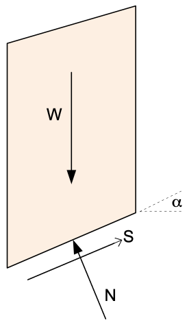
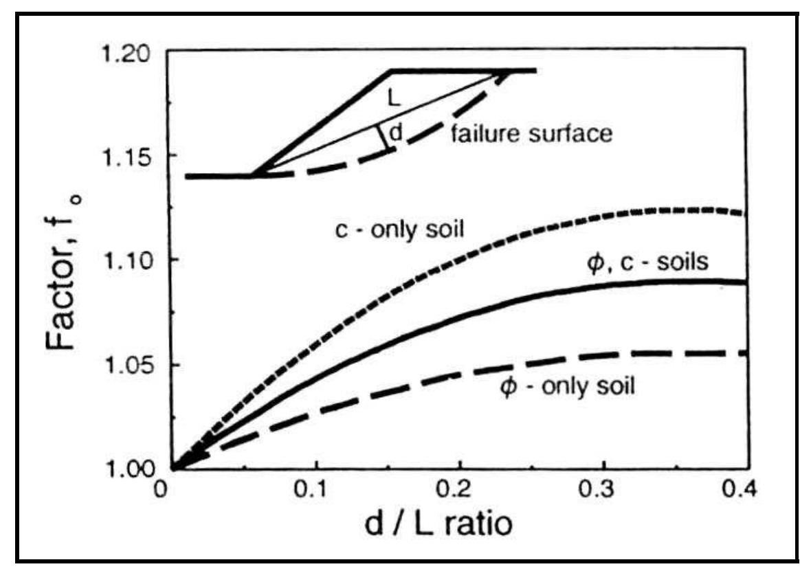
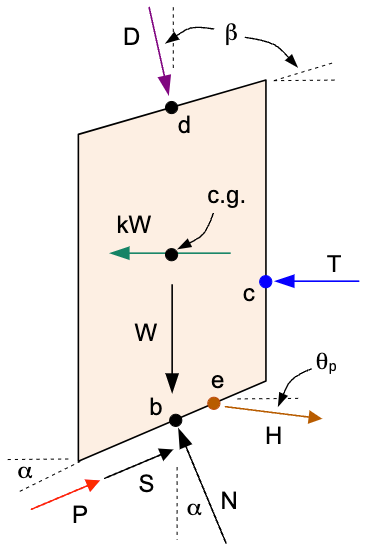

# Janbu Simplified Method

Janbu's Simplified Method is one of the earliest and most commonly used slope stability analysis techniques based on limit equilibrium principles. It provides an approximate factor of safety (FS) for a mass of soil sliding along a specified failure surface by assuming partial force equilibrium . The method was developed by Norwegian engineer **Nils Janbu** in the 1950s to simplify slope stability analysis for circular and non-circular failure surfaces. The factor of safety computed by Janbu's simplified method typically **underestimates** the true FS and is therefore considered conservative. A correction factor was later introduced to compensate for the oversimplifications inherent in the method. Because it satisfies only force equilibrium and leans on this empirical correction, Janbu's method is best suited to quick or preliminary estimates — particularly on non-circular surfaces — with the result confirmed against a complete-equilibrium method such as Spencer before it is relied on for design. 

The forces on the slice considered by the Janbu method are as follows:

>>{width=200px}

For the Janbu method, the inter-slice **shear** forces are assumed to be zero (the inter-slice normal forces are retained). The method satisfies overall **horizontal force equilibrium** of the sliding mass but does not satisfy moment equilibrium. It can be used on both circular and non-circular failure surfaces. Because the inter-slice shear is neglected, the base normal force is found from vertical equilibrium of each slice — the same iterative relation used by Bishop's method.

**Base normal force (vertical equilibrium)** 

Summing forces vertically on a slice, neglecting the inter-slice shear, with the mobilized base shear:

>>$S = \tfrac{1}{F}\left[c\,\Delta\ell + (N - u\,\Delta\ell)\tan\phi\right]$

>>$N\cos\alpha + S\sin\alpha = W$

Solving for the (total) base normal force $N$ gives the Bishop/Janbu form, with $F$ appearing through $m_\alpha$:

>>$N = \dfrac{W - \dfrac{1}{F}\left(c\,\Delta\ell - u\,\Delta\ell\tan\phi\right)\sin\alpha}{m_\alpha}, \qquad m_\alpha = \cos\alpha + \dfrac{\sin\alpha\,\tan\phi}{F}  \qquad (1)$

The mobilized base shear capacity (resisting force along the base) uses the effective normal $N' = N - u\,\Delta\ell$:

>>$S\,F = c\,\Delta\ell + (N - u\,\Delta\ell)\tan\phi   \qquad (2)$

**Factor of safety (horizontal force equilibrium)**

Summing horizontal forces over the whole sliding mass, the inter-slice normal forces cancel and the horizontal components of the base normal ($N\sin\alpha$) and base shear ($S\cos\alpha$) must balance, $\sum S\cos\alpha = \sum N\sin\alpha$. With $S = \tfrac{1}{F}\left[c\,\Delta\ell + (N - u\,\Delta\ell)\tan\phi\right]$ this gives:

>>$F = \dfrac{\sum \left[c\,\Delta\ell + (N - u\,\Delta\ell)\tan\phi\right]\cos\alpha}{\sum N\sin\alpha}     \qquad (3)$

Because $N$ depends on $F$ through $m_\alpha$ in equation (1), equations (1) and (3) are solved by iteration (repeated substitution, starting from $F = 1$) until $F$ converges. This base value is then multiplied by Janbu's correction factor $f_o$ below. (This formulation matches the force-equilibrium factor of safety $F_f$ at zero inter-slice-shear, i.e. the Janbu Simplified value reported by codes such as GeoStudio SLOPE/W.)

## Correction Factor $f_o$

To account for the neglect of interslice forces and moment equilibrium, Janbu proposed a correction factor:

The correction factor $f_o$ is based on the following relationship:

>>{width=500px}

The d/L ratio is the ratio of the distance from the center of the failure surface to the point of interest (d) and the length of the failure surface (L). The correction factor is used to account for the fact that the Janbu method does not satisfy moment equilibrium. The correction factor is a function of the d/L ratio and is calculated using the following equation:

>>$f_o = 1 + b_1  * \left[\dfrac{d}{L} - 1.4 * \left(\dfrac{d}{L}\right)^2\right]    \qquad (4)$

The $b_1$ value is a function of the soils in the slope and is found as follows:

| Soil Type                           | $b_1$ |
|-------------------------------------|-------|
| c-only soil (undrained, $\phi$ = 0) | 0.67  |
| c-$\phi$ soil                       | 0.5   |
| $\phi$-only soil (no cohesion)      | 0.31  |

The polynomial in equation (4) is a fit to Janbu's design chart and is only valid up to the chart domain. It reaches a maximum at $d/L = 1/2.8 \approx 0.357$ and turns over (eventually dropping below 1) for larger $d/L$, which is unphysical. Since $d/L$ is geometrically unbounded, XSLOPE clamps it to that peak so $f_o$ saturates at its maximum rather than decreasing for very deep surfaces. Typical slip surfaces have $d/L$ well below the peak (the verification benchmarks are $\approx 0.13$–$0.20$), so this only guards pathological geometries.

This correction attempts to mimic the effects of moment balance and interslice forces without modeling them directly. Thus, the final factor of safety for Janbu's Simplified Method becomes:

>>$F_{corr} = f_o \cdot F   \qquad (5)$

Where $F_{corr}$ is the corrected factor of safety, $F$ is the base factor of safety from equation (3), and $f_o$ is the correction factor.

## Complete Formulation with Extra Forces

For a complete implementation of Janbu's Simplified Method, we need to consider additional forces acting on the slice. The full set of forces are shown in the following figure:

>>

Where:

>>$D$ = distributed load resultant force  
$\beta$ = inclination of the distributed load (perpendicular to slope)  
$kW$ = seismic force for pseudo-static seismic analysis  
$c.g.$ = center of gravity of the slice  
$P$ = reinforcement force at point $r$ on the base of the slice, at angle $\psi$ from horizontal ($\psi = \alpha$ for tangent/flexible reinforcement, the default; $\psi$ = the line's own inclination for axial/rigid reinforcement)  
$T$ = tension crack water force  
$H$ = pile/pier force at point $e$ on the failure surface  
$\theta_p$ = angle of pile force from horizontal (positive = counterclockwise/upward)  
$L$ = line load at point $f$ on the top of the slice, at angle $\delta$ from horizontal (default $-90°$ = straight down)  

**⚠ TODO (figures): redraw the force diagram above in LibreOffice Draw — show $P$ at a general angle $\psi$ applied at point $r$ (not tangent to the base), and add the line load $L$ at angle $\delta$ at point $f$ on the top of the slice.**

Each of these forces is described in detail in the [Ordinary Method of Slices (OMS)](oms.md) section. The external forces enter in two places: their **vertical** components modify the base normal force (vertical equilibrium of the slice), and their **horizontal** components enter the overall horizontal force balance.

**Effective base normal (vertical equilibrium with external forces).** Adding the vertical components of the distributed load ($D\cos\beta$), reinforcement ($P\sin\psi$), pile force ($H\sin\theta_p$), and line load ($L\sin\delta$) to the vertical equilibrium of equation (1) gives the effective base normal $N'$:

>>$N'  = \dfrac{W + D\cos\beta - P\sin\psi - H\sin\theta_p - L\sin\delta - u\,\Delta\ell\cos\alpha - \dfrac{1}{F}c\,\Delta\ell\sin\alpha}{m_\alpha}  \qquad (6)$

The total base normal is $N = N' + u\,\Delta\ell$, and the mobilized base shear capacity is $c\,\Delta\ell + N'\tan\phi$.

**Factor of safety (horizontal force equilibrium with external forces).** The horizontal force balance now includes the horizontal components of the external forces. The seismic force $kW$ and the tension-crack water force $T$ are magnitudes in the direction of sliding and are driving; the reinforcement horizontal component $P\cos\psi$ and the pile horizontal component $H\cos\theta_p$ are resisting. The surface loads are neither: a distributed load carries the force $(D\sin\beta,\,-D\cos\beta)$, so $D\sin\beta$ is a *signed* component measured in the direction of sliding, and the same holds for a line load's $L\cos\delta$. A load applied normal to a slope face has $\beta > 0$ and therefore pushes **into** the slope, resisting the slide — reservoir water standing against an upstream face is the everyday case — while a load leaning downslope has $\beta < 0$ and drives it. Both enter the denominator negated, and their own sign decides which way they act. The reinforcement (when Appl = Active, the default), pile, and line-load forces are known applied forces (not shear strength) and so are not divided by $F$ — they appear directly in the denominator. (A Passive reinforcement force is instead divided by $F$ alongside the soil strength.)

>>$F = \dfrac{\sum \left[c\,\Delta\ell + N'\tan\phi\right]\cos\alpha}{\sum N\sin\alpha + \sum kW + \sum T - \sum D\sin\beta - \sum P\cos\psi - \sum H\cos\theta_p - \sum L\cos\delta}   \qquad (7)$

with $N = N' + u\,\Delta\ell$. As in the basic case, equations (6) and (7) are solved together by iteration on $F$. Note that $T$ only applies to the side of the uppermost slice ($T = 0$ for all other slices).

The direction of the reinforcement force follows the line's **Dir** setting. For **Tangent** (flexible reinforcement, the default) $\psi = \alpha$ — the force reorients parallel to the base of the slice — and equations (6)-(7) reduce to the classical $P\sin\alpha$ / $P\cos\alpha$ forms. For **Axial** (rigid supports such as nails and tiebacks) $\psi$ is the inclination of the reinforcement line itself, so the same two components are simply evaluated at $\psi$. Note that in the [OMS](oms.md) and [Bishop](bishop.md) methods, tangent reinforcement enters the moment equation as a bare $\sum P$: those methods sum moments about the center of a circular surface, and a force acting tangent to that circle has a moment arm of exactly $R$, so the $R$ cancels — a shortcut that holds *only* for the tangent direction; the axial case requires the full component moment arms given on those pages.

Once again, the correction factor $f_o$ is applied to account for the neglect of inter-slice shear as shown in equation (5) above.

---

## Summary

Advantages:

- Fast and easy to compute
- Conservative (safe) results
- Effective for preliminary design and parametric studies
- Can be applied to circular and non-circular failure surfaces

Limitations:

- May significantly underestimate FS for complex geometries
- Not suitable for highly irregular slopes or layered soils with complex interactions
- Not a complete equilibrium method (no moment or interslice force balance)

**Submerged slopes.** Equation (7) takes a surface load's horizontal component
with the sign its own inclination gives it, so reservoir water standing against
an upstream face resists the slide rather than driving it — the same way the
complete-equilibrium methods treat it. On the upstream face of the
[earth dam sample](samples.md#8-earth-dam) Janbu reads 1.736 against Spencer's
1.800 and Bishop's 1.815, the few-percent conservatism expected of an approximate
method.

