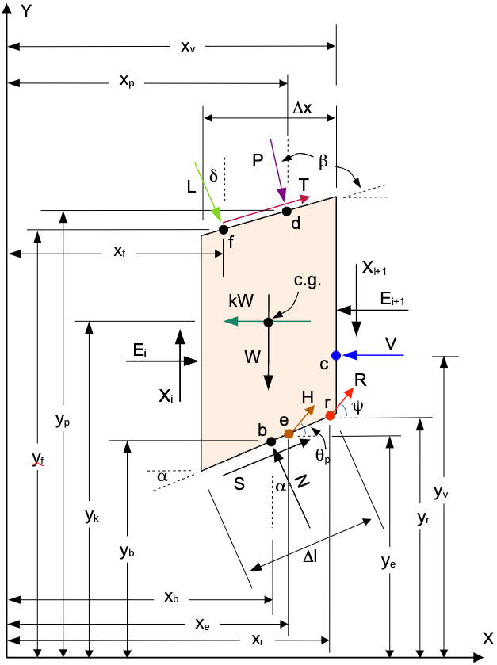
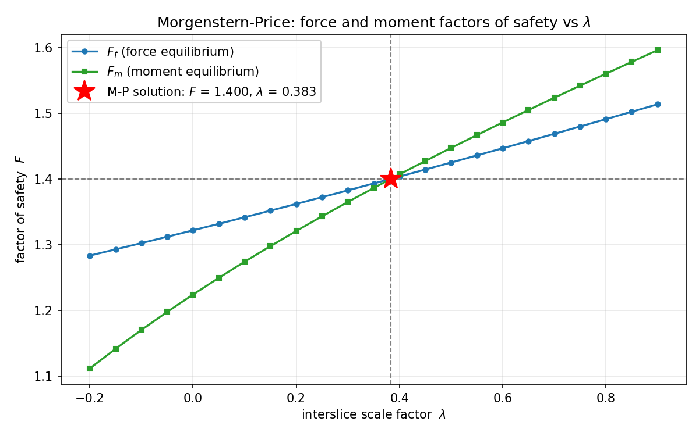

# Morgenstern–Price Method

The Morgenstern–Price method (Morgenstern & Price, 1965) is a **complete-equilibrium**
procedure: like [Spencer's method](spencer.md) it satisfies force equilibrium
(horizontal and vertical) *and* moment equilibrium for the sliding mass, and it
applies to both circular and non-circular surfaces. It is the most general of the
limit-equilibrium methods in XSLOPE, and Spencer's method is a special case of it.

## Relationship to Spencer's Method

Every slice has the same free body as in Spencer's method — refer to the
[Spencer slice geometry](spencer.md#slice-geometry-and-forces) for the definition of
every symbol ($W$, $N$, $S$, the interslice resultant $Z$ and its inclination
$\theta$, the external loads $kW$, $P/D$, $T$, $R$, $V$, $H$, and the angles
$\alpha$, $\beta$, $\theta_p$):



The two methods differ in exactly **one** assumption — how the inclination of the
interslice resultant is allowed to vary along the surface. Writing the interslice
shear $X$ and normal $E$ at a slice boundary, the side-force inclination is

>>$\tan \theta = \dfrac{X}{E}   \qquad (1)$

and:

| Method | Interslice inclination | Unknowns |
|--------|------------------------|----------|
| Spencer | constant: $\tan\theta = \lambda$ everywhere | $F,\ \lambda$ |
| Morgenstern–Price | varies: $\tan\theta(x) = \lambda\, f(x)$ | $F,\ \lambda$ |

Here $f(x)$ is a prescribed, dimensionless **interslice force function** and
$\lambda$ is a single scalar that scales it. Setting $f(x) = 1$ recovers a constant
inclination — **Morgenstern–Price with $f(x)=1$ is identical to Spencer's method**.
XSLOPE uses this as the primary verification of the implementation: run with
$f(x)=1$, the factor of safety and $\lambda$ reproduce Spencer's $F$ and $\theta$
to roughly $10^{-10}$.

## The Interslice Force Function

The Morgenstern–Price assumption fixes the side-force inclination at every slice
boundary $j$ from a prescribed, dimensionless interslice force function $f$ and a
single scalar $\lambda$:

>>$\tan \theta_j = \lambda f(x_j)   \qquad (2)$

where $x_j$ is the horizontal coordinate of boundary $j$, running $j = 0, 1, \dots,
n$ over the $n+1$ boundaries of $n$ slices. Only the *shape* of $f$ enters the
solution — scaling $f$ rescales $\lambda$ by the reciprocal and leaves every
inclination unchanged — so each function is normalized to a unit peak.

XSLOPE provides two interslice force functions, selected with the `f_type` argument
(`half_sine` is the default):

- **Constant**, `f_type='constant'`:

>>$f(x_j) = 1   \qquad (3)$

  Reduces to Spencer's method; used as the regression case.

- **Half-sine**, `f_type='half_sine'`:

>>$f(x_j) = \sin \left( \pi \dfrac{x_j - x_L}{x_R - x_L} \right)   \qquad (4)$

  where $x_L$ and $x_R$ are the left and right ends of the slip surface. The
  half-sine drives the interslice shear smoothly to zero at both ends of the
  surface, which is physically reasonable (no shear can be transmitted past the
  crest or the toe). This is the textbook default and matches the default used by
  GeoStudio SLOPE/W, so it is the most useful choice for comparison.

The computed factor of safety is famously *insensitive* to the choice of $f(x)$;
$\lambda$, on the other hand, does depend on it (see
[Insensitivity to f(x)](#insensitivity-to-fx) below).

## Force Equilibrium — the Per-Slice Sweep

For a trial factor of safety $F$ and trial scale $\lambda$, the per-boundary
inclinations follow from the assumption (2),

>>$\theta_j = \arctan \left( \lambda f(x_j) \right)   \qquad (5)$

evaluated at every slice boundary. With the inclinations known, the slices are
marched left to right, solving on each slice the same $2\times 2$ force-balance
system used by the [force-equilibrium methods](force_eq.md) — two equations
($\sum F_x = 0$, $\sum F_y = 0$) in two unknowns, the **effective** base normal
$N'_i$ and the right-hand interslice resultant $Z_{i+1}$, given the left resultant
$Z_i$ carried over from the previous slice. The pore-water force $u_i \Delta\ell_i$
is carried by those two equations, so the base shear follows from the effective
normal they return:

>>$S_i = \dfrac{c'_i \Delta\ell_i + N'_i \tan\phi'_i}{F}   \qquad (6)$

The sweep starts from $Z_0 = 0$ (no force outside the first slice) and ends with a
leftover interslice resultant $Z_n$ at the downhill end. Global **force
equilibrium** requires that this leftover vanish, which is the first of the two
conditions the solution closes on — the force residual $R_f$:

>>$R_f = Z_n = 0   \qquad (7)$

This is exactly the residual the Corps of Engineers and Lowe–Karafiath methods
root-find on; the only difference is that those methods fix the $\theta_j$ from
geometry, whereas Morgenstern–Price chooses $(F,\lambda)$ to satisfy moment
equilibrium as well.

## Moment Equilibrium about the Origin

The second condition is overall moment equilibrium. XSLOPE sums moments for the
**whole sliding mass about the coordinate origin** $(0,0)$. The origin is a fixed
point that works identically for circular and non-circular surfaces — there is no
reliance on a circle center, so the formulation is uniform across surface types.

The key simplification is that the **interslice forces are internal**: the force on
the boundary between slices $i$ and $i+1$ acts on both adjacent slices with equal
magnitude, the same line of action, and opposite sign. Summing moments over the
entire mass, **every interslice contribution cancels exactly**, regardless of
$\lambda$ and regardless of where on the boundary the force acts. The overall moment
equation therefore contains only the base normals $N_i$, base shears $S_i$, weights
$W_i$, and the external loads.

Taking counter-clockwise moments as positive, the moment about the origin $O$ of a
force with global components $(F_x, F_y)$ acting at the point $(x_F, y_F)$ is

>>$M_O = x_F F_y - y_F F_x   \qquad (8)$

and the second closure condition — the moment residual $R_m$ — is that these
moments, summed over every force acting on the sliding mass, vanish:

>>$R_m = \sum M_O = 0   \qquad (9)$

Summing the per-slice contributions:

| Force | Components $(F_x, F_y)$ | Acts at | Moment about origin |
|---|---|---|---|
| Weight $W$ | $(0,\ -W)$ | $(x_c,\ y_{cg})$ | $-W\,x_c$ |
| Base normal $N$ (total) | $(-N\sin\alpha,\ N\cos\alpha)$ | $(x_c,\ y_{cb})$ | $N\,(x_c\cos\alpha + y_{cb}\sin\alpha)$ |
| Base shear $S$ | $(S\cos\alpha,\ S\sin\alpha)$ | $(x_c,\ y_{cb})$ | $S\,(x_c\sin\alpha - y_{cb}\cos\alpha)$ |
| Surface load $D$ | $(D\sin\beta,\ -D\cos\beta)$ | $(d_x,\ d_y)$ | $-D\,(d_x\cos\beta + d_y\sin\beta)$ |
| Seismic $kW$ | $(-kW,\ 0)$ | $(x_c,\ y_{cg})$ | $kW\,y_{cg}$ |
| Tension-crack water $V$ | $(-V,\ 0)$ | $(x_v,\ y_t)$ | $V\,y_t$ |
| Reinforcement $R$ | $(R\cos\psi,\ R\sin\psi)$ | $(x_r,\ y_r)$ | $R\,(x_r\sin\psi - y_r\cos\psi)$ |
| Pile $H$ | $(H\cos\theta_p,\ H\sin\theta_p)$ | $(x_h,\ y_h)$ | $H\,(x_h\sin\theta_p - y_h\cos\theta_p)$ |
| Line load $L$ | $(L\cos\delta,\ L\sin\delta)$ | $(x_f,\ y_f)$ | $L\,(x_f\sin\delta - y_f\cos\delta)$ |

The reinforcement force angle is $\psi = \alpha$ with $(x_r, y_r)$ at the base center for Dir = Tangent (flexible, the default), or the line's own inclination at the actual crossing point for Dir = Axial. The line load $L$ acts at angle $\delta$ (default $-90°$, straight down) at point $f$ on the top of the slice.

The total base reaction is split into the effective normal $N'$ and the pore-water
uplift $U = u\,\Delta\ell$, both acting in the $(-\sin\alpha, \cos\alpha)$ direction,
so the normal moment term is $(N' + u\,\Delta\ell)(x_c\cos\alpha + y_{cb}\sin\alpha)$.
Assembling the rows over the $n$ slices gives the moment residual XSLOPE evaluates:

>>$\begin{aligned}
R_m = \sum_{i=1}^{n} \Big[ &- W x_c + (N' + u \Delta \ell)(x_c \cos \alpha + y_{cb} \sin \alpha) + S (x_c \sin \alpha - y_{cb} \cos \alpha) \\
&- D (d_x \cos \beta + d_y \sin \beta) + kW y_{cg} + V y_t \\
&+ R (x_r \sin \psi - y_r \cos \psi) + H (x_h \sin \theta_p - y_h \cos \theta_p) \\
&+ L (x_f \sin \delta - y_f \cos \delta) \Big]
\end{aligned}   \qquad (10)$

with $S$ from (6) at the trial factor of safety. Support that mobilizes with the
soil rather than acting on it — passive reinforcement and the passive share of a
pile capacity — carries the same $1/F$ as the base shear, so its moment terms
enter (10) divided by $F$; with no passive elements every term stands as written.

Because the base shear $S_i$ carries the $1/F$ factor, the moment sum is an equation
in $F$ for each trial $\lambda$; its root is the **moment factor of safety**
$F_m(\lambda)$. The scale $\lambda$ still enters this sum, but only *indirectly*
through the $N_i$: the per-slice vertical balance contains the net interslice shear
$X_{i+1} - X_i = \lambda\,(f_{i+1}E_{i+1} - f_i E_i)$, so changing $\lambda$
redistributes the base normals and moves the moment sum.

## Solving for F and λ

Conditions (7) and (9) are two equations in the two unknowns $F$ and $\lambda$. Both
residuals come from one sweep over the slices, so a single pass at a trial
$(F, \lambda)$ returns them together.

Define the two factor-of-safety curves obtained from that sweep at a fixed $\lambda$
— $F_f(\lambda)$, the $F$ that drives the **force** residual to zero, and
$F_m(\lambda)$, the $F$ that drives the **moment** residual to zero:

>>$R_f \left( F_f(\lambda), \lambda \right) = 0, \qquad R_m \left( F_m(\lambda), \lambda \right) = 0   \qquad (11)$

The Morgenstern–Price solution is the value of $\lambda$ where the two curves meet,
$F_f(\lambda) = F_m(\lambda)$; the common value is the factor of safety. The two
curves cross once and nearly linearly — the system (11) on the Arai & Tagyo
benchmark:

{width=700}

XSLOPE uses two cooperating solvers: a bracketed crossing in the Fredlund–Krahn /
GLE style, which is the transparent reference, and a two-dimensional Newton
solution, which is the shipped path. Both agree to roughly $10^{-10}$ on every
benchmark.

### Approach A — the bracketed crossing

The force residual is monotonic in $F$, so $F_f(\lambda)$ is a single well-behaved
root and is found by a secant iteration:

>>$F^{(k+1)} = F^{(k)} - R_f \left( F^{(k)}, \lambda \right) \dfrac{F^{(k)} - F^{(k-1)}}{R_f \left( F^{(k)}, \lambda \right) - R_f \left( F^{(k-1)}, \lambda \right)}   \qquad (12)$

started from the Bishop factor of safety and stopped at $10^{-6}$, in at most 50
iterations. The moment residual is then evaluated **at that force-equilibrium
factor of safety**, which reduces the pair of conditions to one smooth scalar
function of $\lambda$ alone:

>>$h(\lambda) = R_m \left( F_f(\lambda), \lambda \right)   \qquad (13)$

whose root $h(\lambda^*) = 0$ is the solution: force and moment equilibrium both
close there. Working through $F_f$ this way keeps the search off the moment-only
curve $F_m(\lambda)$, which is multivalued and carries an asymptote. XSLOPE
evaluates $h$ at 61 points evenly spaced over $\lambda \in [-1.5, 1.5]$, brackets
every sign change with Brent's method to $10^{-9}$, and takes the crossing nearest
$\lambda = 0$ — the physical one.

### Approach B — the two-dimensional Newton solution

The shipped path drives both residuals to zero at once in $(F, \lambda)$. A force
and a moment differ in magnitude by some three orders, so each residual is first
scaled by its own value at the starting point:

>>$\mathbf{R}(F, \lambda) = \begin{bmatrix} R_f(F, \lambda) / s_f \\ R_m(F, \lambda) / s_m \end{bmatrix}, \qquad s_f = \left| R_f(F_0, 0) \right|, \qquad s_m = \left| R_m(F_0, 0) \right|   \qquad (14)$

which is what makes the $2 \times 2$ system well conditioned; a scale that comes
out at zero is replaced by one. $F_0$ is the Bishop factor of safety for the same
surface, or 1.5 where Bishop does not solve it, and the iteration starts at

>>$\left( F^{(0)}, \lambda^{(0)} \right) = (F_0, 0)   \qquad (15)$

— near the physical solution, which is what keeps it off the other branches. Each
step is the Newton step for the pair,

>>$\begin{bmatrix} F \\ \lambda \end{bmatrix}^{(k+1)} = \begin{bmatrix} F \\ \lambda \end{bmatrix}^{(k)} + \Delta \mathbf{x}^{(k)}, \qquad \mathbf{J}^{(k)} \, \Delta \mathbf{x}^{(k)} = - \mathbf{R}^{(k)}   \qquad (16)$

with the Jacobian of the scaled residuals with respect to the two unknowns:

>>$\mathbf{J} = \begin{bmatrix} \left( \partial R_f / \partial F \right) / s_f & \left( \partial R_f / \partial \lambda \right) / s_f \\ \left( \partial R_m / \partial F \right) / s_m & \left( \partial R_m / \partial \lambda \right) / s_m \end{bmatrix}   \qquad (17)$

The sweep is a recursion over the slices rather than a closed form in
$(F, \lambda)$, and XSLOPE forms **no analytical derivatives** of it. The Jacobian
is built numerically instead, by forward differences,

>>$\dfrac{\partial R}{\partial F} \approx \dfrac{R(F + \Delta F, \lambda) - R(F, \lambda)}{\Delta F}, \qquad \dfrac{\partial R}{\partial \lambda} \approx \dfrac{R(F, \lambda + \Delta \lambda) - R(F, \lambda)}{\Delta \lambda}   \qquad (18)$

and is then carried between steps by rank-one updates with the step limited to a
trust region — MINPACK's hybrid Powell method, reached through
`scipy.optimize.root(method='hybr')`. This is the one structural difference from
[Spencer's solution](spencer.md#solution-of-equilibrium-equations): Spencer's
residuals are closed forms in $(F, \theta)$, so that solver differences nothing —
the Jacobian it forms is the four first-order derivatives, equations (35), (36),
(40) and (41) of that derivation, which publishes the full cascade through (63).

A converged step is accepted only where both scaled residuals have vanished,

>>$\left| R_f / s_f \right| < 10^{-4} \quad \text{and} \quad \left| R_m / s_m \right| < 10^{-4}   \qquad (19)$

and the pair is physical: $F > 0.05$, with $\lambda$ inside the search bracket
widened by 0.5. A step that fails either test is discarded and the solve falls back
to Approach A's bracketed crossing. Each evaluation of (16) costs one sweep, which
is why the Newton path runs about three times faster than root-finding $h(\lambda)$,
where a full $F_f$ solve is nested inside every step.

**Admissibility guard.** An unconstrained search can drive any method onto a
surface whose solution contradicts the strength model it was solved with. XSLOPE
rejects a solution when more than half the base normals are in tension,

>>$\dfrac{\# \left\{ N'_i < 0 \right\}}{n} > 0.5   \qquad (20)$

returning failure so the search skips the surface. A base in tension mobilizes no
Mohr-Coulomb strength, so past that extent the answer rests on a strength the model
does not have; valid critical surfaces across the verification corpus run at 0 to
15%. Tension in the *interslice* forces is reported rather than refused — see
[Interslice tension](overview.md#interslice-tension), the one rule Spencer,
Morgenstern–Price and the force-equilibrium methods share.

## Insensitivity to f(x)

A hallmark of the Morgenstern–Price method is that the factor of safety is nearly
independent of the assumed interslice force function. On a smooth circular surface
the spread between `constant` and `half_sine` is typically a few hundredths of a
percent. The spread is somewhat larger — around 1 to 1.5% — on **non-circular
surfaces that run along a thin weak layer**, where the sharp kinks in the slip
surface make the interslice force distribution matter more. This is expected
behavior, not a defect: it reflects genuine sensitivity of the mechanism, and even
there the factor of safety stays within about 1% of Spencer's value. The interslice
distribution itself (captured by $\lambda$) is more sensitive to $f(x)$ than the
factor of safety is.

## Line of Thrust

Once $F$ and $\lambda$ are found, the line of thrust — the line along which the
interslice resultants $Z$ act — is recovered exactly as in
[Spencer's method](spencer.md#line-of-thrust), except that the inclination now
varies from boundary to boundary. Summing moments about the center of each slice
base and solving for the right-hand thrust elevation,

>>$y_{t,i+1} = y_b - \left[ \dfrac{M_o - Z_i \sin\theta_i \dfrac{\Delta x}{2} - Z_{i+1}\sin\theta_{i+1}\dfrac{\Delta x}{2} - Z_i\cos\theta_i\,(y_{t,i}-y_b)}{Z_{i+1}\cos\theta_{i+1}} \right]   \qquad (21)$

where $M_o$ is the moment, about the center of the slice base, of every force on
the slice other than the base reaction and the interslice forces — equation (3) of
the [Spencer derivation](spencer.md#general-equations), and a different quantity
from the moment $M_O$ about the coordinate origin in (8), which is taken for the
sliding mass as a whole. The inclinations are $\theta_i = \arctan(\lambda f(x_i))$
at each boundary, from (5). Starting from the lower
corner of the first slice and marching across, this traces the thrust line. With a
constant inclination ($f(x)=1$) it reduces exactly to Spencer's expression.

## Using the Method in XSLOPE

Morgenstern–Price is available as the method name `mprice` everywhere a method is
selected — in `solve_selected()`, the automated [search algorithms](search.md), and
[reliability analysis](../reliability/index.md):

```python
from xslope.solve import mprice

success, result = mprice(slice_df, f_type='half_sine')
if success:
    print(f"FS = {result['FS']:.3f}, lambda = {result['lambda']:.3f}")
```

The result dictionary mirrors Spencer's, with the addition of `lambda` and
`f_type`. Because the method solves a standard slice dataframe, it inherits
[rapid drawdown](rapid.md) and all external-load handling without any extra work.

## References

- Morgenstern, N.R. & Price, V.E. (1965). The analysis of the stability of general
  slip surfaces. *Géotechnique* 15(1):79–93.
- Fredlund, D.G. & Krahn, J. (1977). Comparison of slope stability methods of
  analysis. *Canadian Geotechnical Journal* 14(3):429–439.
