# The Limit Equilibrium Method

The Limit Equilibrium Method represents the fundamental approach to slope stability analysis, evaluating the stability of slopes by examining the equilibrium of forces acting on a potential failure mass. This method operates on the principle that a slope remains stable when the resisting forces, primarily the shear strength of the soil, exceed or equal the driving forces such as weight and other destabilizing influences.

Every method on this page can also be run point-and-click in
[XSLOPE Studio](../studio/index.md) — pick a method, choose single-surface, automated
search, or reliability, and view the trial surfaces and critical solution in dedicated
tabs. See [Studio → Running Analyses](../studio/analysis.md#limit-equilibrium-lem).

The first step in a limit equilibrium analysis is to select a candidate failure surface which is typically circular. For slopes with narrow layers of weak soil, a non-circular failure surface may be used.

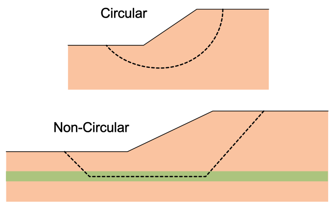

The stresses along the failure surface are then calculated assuming the soil is at the limit of static equilibrium ($\tau$). Next, the total available strength along the failure surface is calculated ($s$).Then the factor of safety $F$ is expressed mathematically as:

> $F = \dfrac{s}{\tau}$

The shear strength of soil is based on the Mohr-Coulomb failure criterion. For a total stress analysis:

> $s = c + \sigma \tan \phi$

Where $s$ represents the shear strength, $c$ is the  cohesion, $\sigma$ is the  normal stress, and $\phi$ is the angle of internal friction. For saturated soils, typically $\phi=0$ and $c = S_u$ where $S_u$ is the undrained shear strength. For an effective stress analysis:

> $s = c' + \sigma' \tan \phi'$

where $c'$ is the effective cohesion, $\sigma'$ is the effective normal stress, and $\phi'$ is the effective angle of internal friction. This expression is typically written as:

> $s = c' + (\sigma - u) \tan \phi'$

where $u$ is the pore pressure. This is the `mc` option in the input template, and it is what the majority of
analyses use.

**Depth-increasing undrained strength.** Normally consolidated clays gain undrained strength with depth as the
effective overburden increases, so a single $S_u$ misrepresents them over any appreciable height. The `cp` option
describes that trend directly:

> $S_u = c + c_p \cdot \max(0,\; r_{elev} - y)$

where $c$ is the undrained strength at the reference elevation `r-elev`, and $c_p$ is the *rate* of strength gain
per unit elevation below it (e.g. psf/ft). At or above the reference elevation the strength is simply $c$. This
plays the role of the familiar $S_u/\sigma'_v$ (c/p) ratio, but keyed to elevation rather than depth below ground —
which is more precise for slope problems, where "depth" is ambiguous once the ground surface is no longer flat. It
is a $\phi = 0$ model: the strength assigned to a slice base depends only on where that base sits, not on the
normal stress acting on it. The rate is normally positive (strength increasing with depth); a negative rate is
accepted for the consolidated-crust case — see [VP30](../verification/rocscience.md#vp30).

**Nonlinear (power-curve) strength.** In addition to the linear Mohr-Coulomb envelope, a material may use the
curved power-curve envelope (option `pow` in the input template):

> $s = pow_a\,(\sigma'_n + pow_d)^{pow_b} + pow_c$

which collapses to Mohr-Coulomb when $pow_b = 1$. Because the strength now depends on the effective normal
stress on the failure surface — which itself depends on the factor of safety — every solution method carries an
outer iteration: the curve is linearized at the current normal stress into an *instantaneous tangent*
($\tan\phi_i$ = the curve's slope at $\sigma'_n$, $c_i$ = its intercept), the method is solved with those
equivalent Mohr-Coulomb parameters, the normal stresses are updated from the solution, and the tangent is
recomputed until the factor of safety is stationary. The linearization is exact at convergence — the mobilized
strength on every slice lies on the curve at that slice's normal stress. Power-curve materials are not supported
in rapid drawdown analysis (both procedures override the per-slice strengths).

### Hoek-Brown strength

Rock masses are the other case where a straight-line envelope misleads, and they have their own standard: the
generalized Hoek-Brown criterion (option `hb`). It is written in principal stresses rather than as a shear
envelope,

> $\sigma'_1 = \sigma'_3 + \sigma_{ci}\left(m_b \dfrac{\sigma'_3}{\sigma_{ci}} + s\right)^{a}$

with the rock-mass constants $m_b$, $s$ and $a$ derived from the three field-observable inputs — the intact
strength $\sigma_{ci}$ (`hb_sci`), the Geological Strength Index (`hb_gsi`), the intact constant $m_i$ (`hb_mi`),
and the blast-disturbance factor $D$ (`hb_d`). See the
[input template](../usage/input_template.md#worksheet-mat) for the definitions and the derivation formulas.

The method of slices needs shear strength as a function of the normal stress on the slice base, so XSLOPE
converts the principal-stress form into the equivalent Mohr envelope with **Balmer's (1952) transformation**.
For a given $\sigma'_3$, with $\partial\sigma'_1/\partial\sigma'_3 = 1 + a\,m_b(m_b\sigma'_3/\sigma_{ci} + s)^{a-1}$:

> $\sigma'_n = \sigma'_3 + \dfrac{\sigma'_1 - \sigma'_3}{\partial\sigma'_1/\partial\sigma'_3 + 1}, \qquad
> \tau = (\sigma'_n - \sigma'_3)\sqrt{\partial\sigma'_1/\partial\sigma'_3}$

That is a *parametric* curve in $\sigma'_3$, so the strength at a prescribed $\sigma'_n$ is found by inverting it
numerically ($\sigma'_n$ increases monotonically with $\sigma'_3$, so the inversion is unconditionally robust).
The instantaneous tangent follows in closed form:

> $\tan\phi_i = \dfrac{\partial\sigma'_1/\partial\sigma'_3 - 1}{2\sqrt{\partial\sigma'_1/\partial\sigma'_3}},
> \qquad c_i = \tau - \sigma'_n \tan\phi_i$

From there Hoek-Brown rides exactly the same outer iteration as the power curve: linearize at the current normal
stress, solve, update the normal stresses, re-linearize, repeat until the factor of safety is stationary. The
same restriction applies — Hoek-Brown materials are not supported in rapid drawdown analysis.

!!! note "Verification"
    Checked against Example 1 of Hammah, R.E., Yacoub, T.E., Corkum, B., & Curran, J.H. (2005), *The shear
    strength reduction method for the generalized Hoek-Brown criterion*, Proc. 40th U.S. Symposium on Rock
    Mechanics (ARMA/USRMS), Paper 05-810: a 10 m, 45° slope in a weak rock mass ($\sigma_{ci}$ = 30 MPa,
    GSI = 5, $m_i$ = 2, $D$ = 0). XSLOPE returns Spencer **1.152** and Bishop **1.150** against the paper's
    1.152 and 1.153. The derived constants ($m_b$ = 0.0672, $s$ = 2.605e-5, $a$ = 0.6192) reproduce its
    Table 1 exactly. The same slope is solved by the FEM in
    [SSRM](../fem/overview.md#curved-failure-envelopes).

Two consequences of the envelope's shape are worth knowing before running rock slopes. A Hoek-Brown envelope is
very steep at low confinement: the instantaneous friction angle on a shallow, lightly-loaded slice near the crest
routinely exceeds 60°. The Corps of Engineers and Lowe & Karafiath methods, which fix the interslice-force
inclination up front rather than solving for it, can fail to converge at friction angles that high. This is a
pre-existing property of those force-equilibrium methods, not of the Hoek-Brown implementation — plain
Mohr-Coulomb materials with $\phi > 55°$ fail the same way. Prefer Bishop, Spencer, or Morgenstern-Price on rock
slopes. The [preflight checks](../usage/preflight.md#what-is-checked) report both traps before a run — either of
those two methods selected on a Hoek-Brown material, and a $\sigma_{ci}$ small enough to have been carried over
in MPa rather than the model's own stress units.

!!! warning "Weak rock masses and shallow surfaces"
    The other side of the same coin: a Hoek-Brown envelope has very little strength at *zero* confinement. The
    unconfined strength of the rock mass is $\sigma_{ci}\,s^{\,a}$, which for a low GSI is a tiny fraction of the
    intact strength — at GSI = 15 a 2.5 MPa intact rock has a rock-mass unconfined strength of only about 2.5 kPa,
    i.e. it is effectively rubble. A material with essentially no cohesion has no depth scale to arrest failure,
    so an automated search will correctly drive the critical surface toward an infinitesimally shallow sliver at
    the crest and report a factor of safety well below 1. This is not a numerical artifact; it is the same
    behavior a $c' = 0$ cohesionless soil shows, where the true minimum is the infinite-slope solution. For heavily
    broken rock, constrain the search depth or model the shallow ravelling mechanism explicitly rather than reading
    the unconstrained global minimum.

### Pore pressures

XSLOPE offers four ways to supply the pore pressure $u$, selected per material through the **u** column of the input
template.

**Piezometric line** (`u = piezo`, the piezo sheet's `Type` = *piezo* or blank). The line is a true piezometric
line — the locus of pressure heads a set of piezometers would read at the slip surface. The pore pressure is the
full static head:

> $u = \Delta z \cdot \gamma_w$

where $\Delta z$ is the vertical distance from the point up to the line and $\gamma_w$ is the unit weight of water
(upper figure).

**Phreatic surface** (the piezo sheet's `Type` = *phreatic*). The equation above is only strictly correct when the
water table is horizontal. When the line is instead a genuine *phreatic surface* — the water table in a slope with
inclined, roughly surface-parallel steady seepage — the equipotentials are no longer vertical, so the head at depth
is *less* than the static column and taking the full vertical distance overstates $u$. The static head is reduced
by $\cos^2\theta$, where $\theta$ is the inclination of the line segment directly above the point (lower figure):

> $u = \Delta z \cdot \gamma_w \cdot \cos^2\theta$

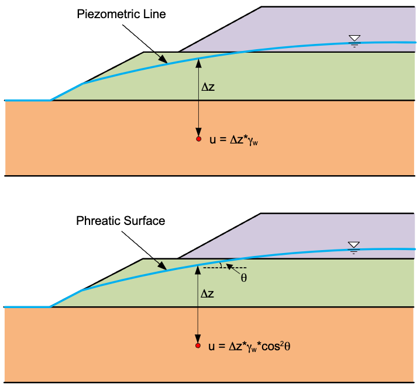

This is the same correction as Slide2's "Hu: Auto" and XSTABL's phreatic-surface option, and it applies in the FEM
as well as the LEM. It matters most on steep phreatic lines — at $\theta = 20°$ it is already a 12% reduction in
$u$ — and on a flat line the two types are identical. Choosing between them: if the line came from piezometer
readings, a flow net, or a seepage analysis, it is a piezometric line; if all you have is the water table position,
*phreatic* is the appropriate shortcut.

**Where a line applies.** Either type assigns pore pressure only over its own horizontal extent; nothing is
extrapolated past either end. A line may therefore stop short of the section, which is the right model when the
water body itself does — an upstream pool with no downstream tailwater, say. What is not allowed is *sampling* one
from outside it: if a slice base whose material takes `u = piezo` falls beyond either end of the line, XSLOPE stops
and reports the failure surface, the slice, its x-coordinate and the line's extent, rather than reading zero pore
pressure and returning an unconservatively high factor of safety. Where a region really is dry, carry the line on
at an elevation below the section to say so. The finite element solver applies the same rule at every mesh node and
Gauss point. Setting `u = piezo` on a material when the file defines no piezometric line at all is refused the same
way — a dry model is `u = none`, not a piezometric line that does not exist.

**Pore pressure ratio** (`u = ru`). The pore pressure is taken as a fixed fraction of the vertical overburden,
$u = r_u \sigma_v$, with $r_u$ entered per material. $\sigma_v$ is the *soil-column* stress only — distributed loads
and tension-crack water are deliberately excluded. This is a coarse idealization, but it is what many published
benchmarks specify, so it is supported for comparison.

**Finite element seepage** (`u = seep`). Pore pressures are interpolated from a 2D finite element seepage solution
using the [seepage tools](../seep/overview.md), at the point in question, from the nodes of the containing element via
the element basis functions. This is the most accurate option, and the only one that represents a genuinely
two-dimensional flow field — including perched water, anisotropy, and internal drains — rather than assuming a head
distribution up front.

A note on all of them: XSLOPE always uses the *explicit* water-force formulation, never buoyant unit weights. Total
unit weights are used for the slice weights and the pore pressure enters separately through $u$.

### Matric suction (apparent cohesion above the water table)

By default XSLOPE clamps pore pressure to $u = \max(0, u)$ before pricing strength, so any suction above the water
table — a piezometric line's negative hydrostatic head, or the negative pressures in an unsaturated seepage
solution — is discarded. This is the conservative default most slope-stability packages ship with: it is safe for
the great majority of slopes, where any suction credit is small next to the target factor of safety.

**Opt-in Fredlund apparent cohesion.** Where matric suction is a first-order effect — an unsaturated cut slope, for
instance ([VP38](../verification/rocscience.md#vp38)) — a per-material unsaturated friction angle $\phi^b$ turns
the suction credit back on, following the Fredlund extended Mohr-Coulomb criterion:

> $\tau = c' + (\sigma_n - u_a)\tan\phi' + (u_a - u_w)\tan\phi^b$

With $u_a = 0$, the last term is $s\tan\phi^b$, where $s = \max(0,\,-u_w)$ is the (unclamped) suction — an
apparent cohesion added on top of $c'$. The effective-normal term still uses the ordinary clamped $u$, so nothing
about the $N'$/interslice-force machinery changes; only the resisting-side cohesion picks up the extra term.
$\phi^b$ defaults to off (no material carries it), which is bit-identical to every pre-v17 result.

**Setting it up.** The **mat** sheet carries this per material as of template version 17 — see
[phi_b / s_cap](../usage/input_template.md#worksheet-mat) in the input template docs for the columns, the
dependency on strength option and pore-pressure source, and the caution about capping suction on a piezometric
line. Loading a file with `phi_b` set auto-wires the suction credit into every solve; no extra code is needed.

The **finite-element solver reads the same two columns** and credits the identical apparent cohesion; in an SSRM
run the suction term is reduced by the strength-reduction factor alongside $c'$ and $\tan\phi'$. See
[Matric suction](../fem/overview.md#matric-suction-apparent-cohesion-above-the-water-table) in the FEM overview.

**Scripted / advanced use.** `generate_slices()` also accepts the underlying run options directly, for callers
building `slope_data` in memory or overriding the file:

```python
success, result = generate_slices(
    slope_data, circle=circle,
    suction_phi_b={"Cut soil": 15},   # {material name: phi_b in degrees}
    suction_cap=70.0,                 # stress units; a scalar caps every named material alike,
)                                     # or pass a {"Cut soil": 70.0, ...} dict to cap per material
```

An explicit `suction_phi_b` always **overrides** the file — the same precedence `t_cut` uses — so a script can
turn the credit on for a file with no `phi_b` column, force it off with `suction_phi_b={}` on a file that does
carry one, or override a template value for a sensitivity study, all without touching the input file. Passing
`suction_phi_b=None` (the default) auto-wires from whatever the mat sheet's `phi_b`/`s_cap` columns specify,
which is `None` (off) on a pre-v17 file.

## Developed Shear Strength

When applying the limit equilibrium method, we often utilize what is called the "developed shear strength". The main equation:

> $F = \dfrac{s}{\tau}$

can be rewritten as:

> $\tau = \dfrac{s}{F}$

> $\tau = \dfrac{c + \sigma \tan \phi}{F}$

> $\tau = \dfrac{c}{F} + \dfrac{\sigma \tan \phi}{F}$

Then the two terms can be expressed as:

> $c_d = \dfrac{c}{F}$

> $\tan \phi_d = \dfrac{\tan \phi}{F}$

where $c_d$ = the developed or mobilized cohesion and $\tan \phi_d$ = the developed or mobilized friction. For example, if $F = 2.0$, the mobilized cohesion and friction would be one half the total available strength values. 

## Method of Slices

The Method of Slices represents a numerical technique that divides the potential failure mass into a series of vertical slices for analysis. Rather than analyzing the entire mass as a single unit, each slice is examined individually, with the overall stability determined by summing the forces and moments acting on all slices. This approach allows us to handle complex geometries and varying soil conditions that would be impossible to analyze using simpler methods.

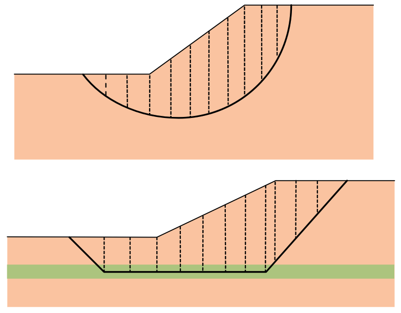

For equilibrium to be satisfied for a candidate failure surface, the following three conditions must be satisfied:

>$\Sigma F_x = 0$

>$\Sigma F_y = 0$

>$\Sigma M = 0$

Typically, the number of equations is less than the number of unknowns. Therefore, simplifying assumptions must be 
used. Some techniques satisfy only a portion of the equilibrium conditions. If all conditions are satisfied, it is called a complete equilibrium procedure. 

The basic forces on each slice and the slice geometry are as follows: 


where:

>$W$ = weight of the slice<br>
$N$ = normal force acting on the base of the slice<br>
$S$ = shear force acting on the base of the slice<br>
$E_i$ = horizontal interslice force on the left side of the slice (boundary $i$); $E_{i+1}$ acts on the right side<br>
$X_i$ = vertical (shear) interslice force on the left side of the slice (boundary $i$); $X_{i+1}$ acts on the right side<br>
$\Delta x$ = width of the slice<br>
$\Delta \ell$ = length of the slice base, calculated as $\Delta x \sec \alpha$<br>
$\alpha$ = inclination angle of the slice base<br>
$\beta$ = inclination angle of the slope at the top of the slice<br>

Sometimes the side forces are represented as: 

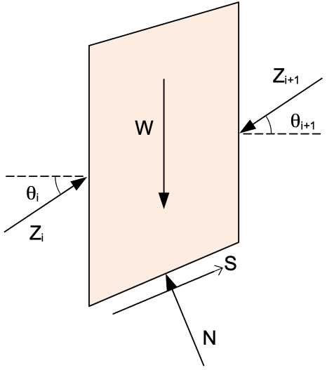

where:
>$Z_i$ = magnitude of the interslice force<br>
$\theta_i$ = inclination angle of the interslice force<br>

Slopes can be either left-facing or right-facing. The diagrams above are based on a left-facing slope and the 
equations for each of the analysis methods are based on this convention. For right-facing slopes, the equations are the same, but the 
directions of the forces are reversed simply by changing the sign convention of $
\alpha$ and $\beta$ as follows:

{width="800px"}

One exception to this is Spencer's method. Details can be found in the XSLOPE source code for Spencer's method.

## Water Pressures: a Practice Note

XSLOPE deliberately offers **no buoyant-unit-weight option**. Water always enters an analysis explicitly: total unit weights for the soil, pore pressures from a piezometric line, r<sub>u</sub>, or an FE seepage solution, and free water (reservoirs, ponds, tailwater) as hydrostatic pressure loads on the ground surface. This follows a maxim Stephen G. Wright taught for decades:

> *"Never use buoyant unit weights. Always use external loads, piezometric lines, etc."*

The reason is not stylistic. The buoyant shortcut — γ′ = γ − γ<sub>w</sub> below the water table, with pore pressures and boundary water loads dropped in exchange — is provably identical to the explicit formulation **only when the water is static** (a horizontal water table, no flow). The moment the phreatic surface is inclined, water is moving, and the shortcut silently omits the seepage forces (γ<sub>w</sub>·i per unit volume) that the flow exerts on the soil skeleton. The explicit formulation costs nothing extra and never carries that hidden assumption: it reproduces the buoyant answer automatically when water happens to be static, and the correct answer when it is not.

The error is not academic. The classic bracket is the infinite slope: fully submerged under a still pool, FS = tanφ′/tanβ, and the shortcut is exact; with seepage parallel to the face, FS ≈ (γ′/γ<sub>sat</sub>)·tanφ′/tanβ — roughly **half** — while the buoyant weight is identical in both cases and cannot tell them apart. The infinite-slope bracket above is the cleanest quantitative illustration of the trap; for a full-scale reservoir-loaded dam analyzed with the explicit formulation, see verification problem [VP42](../verification/rocscience.md#vp42).

## Composite Failure Surfaces

Every model has a floor: bedrock in a polygon-defined problem, or the `max_depth` line in a profile-line problem. No material is defined below it, so no slip surface may pass through it. A trial circle, however, knows nothing about the floor — make it deep enough and it will dip below.

XSLOPE handles this the way every limit equilibrium code does, by **truncating** the circle at the floor. The surface follows the arc down until it meets the floor, runs *along* the floor to the far crossing, and climbs back out on the arc. Because the floor is single-valued in $x$, the truncated surface is just the upper envelope of the two:

>$y(x) = \max \left[ \, y_{circle}(x), \; y_{floor}(x) \, \right]$

The result is called a **composite surface**. Far from being a special case, it is the correct failure mechanism whenever a slope is underlain by a weak seam or a hard stratum: the mass shears along the arc where it can, and along the weak base where that is cheaper. The example below is the [Fredlund & Krahn (1977)](https://doi.org/10.1139/t77-045) benchmark, where a 1-ft weak seam sits on the model base — half the slices ride the seam.

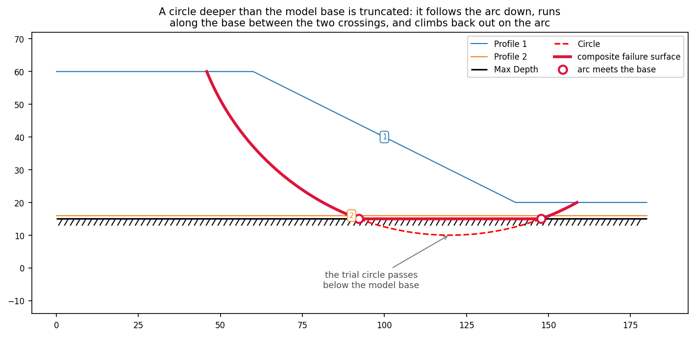

Two things follow from the kink where arc meets floor, and XSLOPE handles both:

- **The crossings become slice boundaries.** A boundary is forced at each point where the arc meets the floor, so no slice base straddles the kink. Every slice then lies wholly on the arc or wholly on the floor, and its base angle $\alpha$ is exact on either one — the circle's tangent on the arc, the floor's own slope on the floor.
- **The moment methods lose their constant radius.** OMS and Bishop take moments about the center of the circle, and both classically assume that every slice base sits at radius $R$ and that every base normal points straight at the center. Neither is true along the floor. XSLOPE uses generalized moment arms, derived in [Ordinary Method of Slices](oms.md); they collapse identically to the classic form on a true circle, so no circular result changes. The force-equilibrium and complete-equilibrium methods (Janbu, Corps of Engineers, Lowe & Karafiath, Spencer, Morgenstern–Price) never reference a circle at all, so they need no change.

Composite surfaces are **opt-in**, because the floor does not always mean the same thing. In a polygon model it is the bottom of the material — a real boundary. In a profile-line model it is `max_depth`, which is usually just a bound on how deep you want to look, and truncating a circle against an arbitrary search bound would be meaningless. So you say when the floor is real:

```python
# a single circle that dips below the base
success, result = generate_slices(slope_data, circle=circle, composite=True)

# let the search ride the base — the critical surface for a weak seam on bedrock
fs_cache, converged, path, cache = circular_search(slope_data, 'bishop', composite=True)
```

With `composite=False` (the default) a circle deeper than the floor is rejected, and the search will not go below it — at best it finds a circle tangent to the base. That is exactly the limitation `composite=True` removes: the critical mechanism for a soft layer resting on bedrock *runs along the bedrock*, and no clamped circle can reach it.

## Advanced Loading Conditions

In addition to the basic forces acting on each slice, modern slope stability analysis often incorporates additional loading conditions that can significantly affect the stability calculations. These advanced loading conditions include distributed loads, seismic loads, reinforcement forces, and tension cracks.

**Distributed Loads**: Surface loads such as traffic, construction equipment, or other surcharges can be represented 
as distributed forces acting on the top of slices. These loads contribute to both the driving forces and the normal 
forces on the slice base. Distributed loads correspond to water for submerged or partially submerged slopes or 
surcharge loads from buildings, roads, or other structures above the slope. 

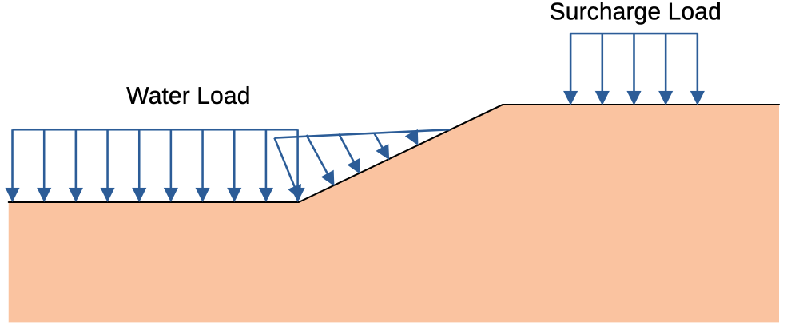{width="800px"}

**Where the water load comes from.** The weight of water standing on the slope is a
distributed load like any other, but it is not one you need to enter. The main sheet's
**Water loads** selector decides who supplies it. On `auto` — what a new file carries —
the engine derives the ponded-water load at solve time from the model's own statement of
where the water stands: the seepage boundary conditions wherever a seepage analysis is
defined, otherwise the piezometric line. The dloads sheets then carry non-water loads
only, and the derived load is drawn on every plot in its own colour so a load nobody
typed is more visible rather than less. On `manual` — what every file written before
template version 22 means, so that no existing model changes — the water load is whatever
is on the dloads sheets, exactly as before. See
[Automatic water loads](../usage/preflight.md#automatic-water-loads).

The derivation is unconditional in the water it applies: a piezometric line above the
ground surface loads the slope whatever the materials' pore-pressure option says. `mat!u`
decides only who *samples* that water as pore pressure. A submerged slope analysed in
total stress — every material undrained, `u = none` — therefore carries the reservoir's
weight with zero pore pressure, which is what a total-stress analysis means.

In XSLOPE, these loads can be applied as a uniform load across the top of the slices or as a varying load that changes with position along the slope.
Distributed loads 
are applied as a 
load per 
unit length, which is then 
converted to a force acting on each slice based on its width and the load intensity (see below). 

**Seismic Loads:** In seismically active regions, the stability of slopes can be significantly affected by seismic 
forces. These forces are typically represented as horizontal accelerations acting on the mass of each slice. The pseudo-static approach is commonly used, where a horizontal acceleration coefficient $k$ is applied to the weight of each slice to calculate the seismic force.

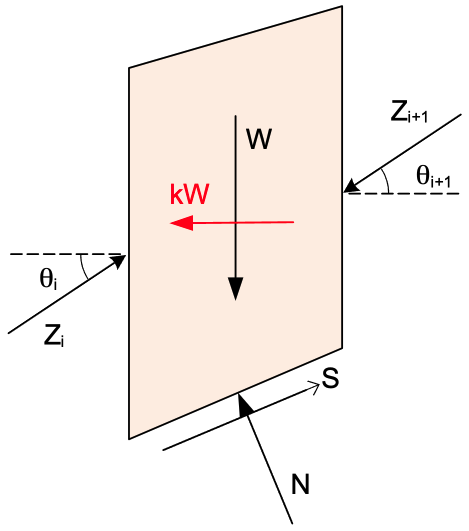

The seismic force is assumed to act horizontally in a direction that causes sliding and it acts through the center of gravity of each slice. That direction follows from the failure surface, so only the magnitude of $k$ is used here; the finite element solver has no failure surface to read it from and uses the signed value instead — see [Seismic forces](../fem/overview.md#seismic-forces).

**Reinforcement:** Reinforcement forces are used to represent the effects of geosynthetics, soil nails, or other 
structural elements that provide additional stability to slopes. These forces can be modeled as tensile forces acting along the base of the slices, providing resistance to sliding and contributing to the overall stability of the slope.


For the limit equilibrium methods in XSLOPE, the direction and factoring of the reinforcement force are controlled per line in the input. The **Dir** setting selects the force direction where the line crosses the slip surface: **Tangent** (the default) assumes flexible reinforcement that bends with the sliding mass so the force acts parallel to the base of the slice, correct for geosynthetics; **Axial** applies the force along the reinforcement's own axis, correct for rigid supports such as soil nails and tiebacks. The **Appl** setting selects how the force enters the factor of safety: **Active** (the default) treats it as a known allowable force not divided by $F$; **Passive** treats it as an ultimate capacity that mobilizes with the soil and is divided by $F$. See the [LEM reinforcement page](reinforcement.md) for the full treatment, including the capacity envelope that sets the force magnitude at the crossing point. Reinforcement is also modeled in the [finite element method](../fem/overview.md), where the force emerges from the analysis rather than being prescribed.

**Line Loads:** Concentrated forces per unit width applied at a point on the ground surface — for example the self-weight of a facing element such as the shotcrete plate of a soil nail wall. Each line load has a magnitude $L$ and a direction $\delta$ measured from horizontal (default $-90°$, straight down), and is applied to the slice whose top boundary contains the point.

**Tension Cracks:** In the upper part of the slope, the cohesion of a soil can be greater than the driving forces. 
Since soils can generally not withstand tension, this is unconservative. To address this problem, a tension crack can be added to a user-specified depth and the tension crack forms the upper boundary of the slices and not cohesive forces are allowed on the slice (crack) boundary. It is also possible to assume that the crack fills with water, providing a small force driving failure as an extra measure of conservative analysis.

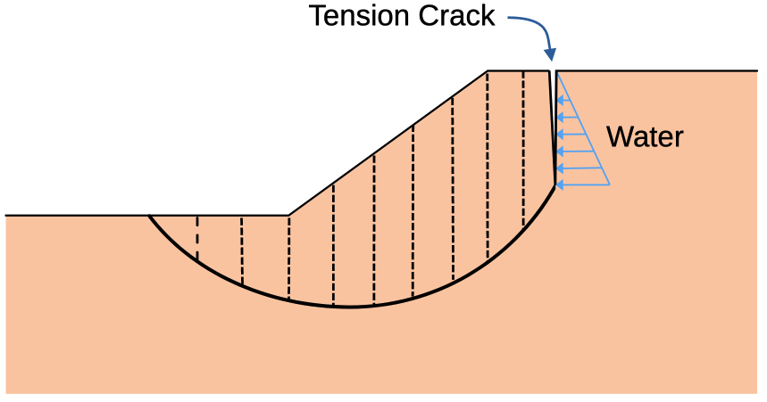{width="700px"}

When applied to the slices, these advanced loading conditions are treated as additional forces acting on the slices 
as follows:


The distributed load acting on the top of each slice is converted to a resultant force by multiplying the load 
intensity by the width of the slice and it acts at point $d$. The seismic force $kW$ acts horizontally at the center 
of gravity of each slice. The reinforcement force $P$ acts at the point where the line crosses the base of the 
slice, in a direction that resists sliding — parallel to the base for tangent (flexible) reinforcement, or along 
the reinforcement axis for axial (rigid) supports. A line load $L$ acts at its point of application on the top of 
the slice at angle $\delta$. The load corresponding to water in the tension crack is converted to a single resultant 
force $T$ acting horizontally at point $c$ which is one third of the distance from the bottom of the slice.

## Limit Equilibrium Methods Supported in XSLOPE

The following limit equilibrium methods are supported in XSLOPE. Each method has a page describing in detail the equations used, solution technique, etc. 

**Ordinary Method of Slices (OMS):** The [Ordinary Method of Slices](oms.md) provides the simplest approach to slope 
stability 
analysis. Since it requires no iteration, results can be obtained rapidly. However, these advantages come with 
significant limitations: the method only satisfies moment equilibrium, can produce unconservative or overly conservative 
results, and completely neglects interslice forces. This makes OMS most suitable for preliminary analysis and simple geometries where quick results are more important than high accuracy. 

**Simplified Janbu Method:** The [Janbu Method](janbu.md) offers a different approach by satisfying force equilibrium rather than 
moment equilibrium. This makes it suitable for circular or non-circular failure surfaces where moment equilibrium might be less critical. The method includes a correction factor to compensate for the missing moment equilibrium, though this factor is empirical and may not always provide accurate compensation. [Documentation]

**Bishop's Simplified Procedure:** [Bishop's Method](bishop.md) represents a significant improvement over OMS and 
Janbu by satisfying both moment and vertical force equilibrium. This approach provides more accurate results while maintaining reasonable computational efficiency. However, the requirement for circular surfaces limits its applicability, and the iterative solution process increases computational time. Bishop's method finds its niche in projects with circular failure surfaces and moderate accuracy requirements.

**Force Equilibrium Methods:** The [General Force Equilibrium Method](force_eq.md) provides a framework for explicit 
treatment of interslice forces using magnitude and angle parameters. This method works on any failure surface and 
offers good accuracy when interslice forces are important. However, it only satisfies force equilibrium, requires an 
iterative solution, and depends on assumptions about interslice force angles. This method is most valuable when 
explicit interslice force treatment is needed and when complex geometries require more sophisticated analysis than 
simple methods can provide. Two variations of the force equilibrium method are available in XSLOPE:

The **Corps Engineers method** applies the force equilibrium framework with the assumption that interslice forces are horizontal. 

The **Lowe-Karafiath method** assumes that the interslice force at each slice boundary is equal to the average of 
the slope angle at the top of the slice $\beta$ and the failure surface angle at the bottom of the slice $\alpha$.

**Spencer's Method:** [Spencer's Method](spencer.md) represents the most sophisticated approach available in XSLOPE, 
satisfying 
both force and moment equilibrium simultaneously. This comprehensive approach provides the highest accuracy and can 
handle both circular and non-circular failure surfaces. However, this accuracy comes at a cost: the method is the 
most complex to implement, requires an iterative solution, and is computationally intensive. Spencer's method is 
generally considered the best and most accurate of the methods supported in XSLOPE. 

**Morgenstern–Price Method:** [Morgenstern–Price](mprice.md) is the most general 
complete-equilibrium method and the parent of Spencer's method. It also satisfies 
force and moment equilibrium on both circular and non-circular surfaces, but instead 
of a single constant interslice inclination it lets the inclination vary along the 
surface as $\tan\theta(x) = \lambda\,f(x)$, where $f(x)$ is a prescribed interslice 
force function (XSLOPE offers a constant function — which reproduces Spencer exactly — 
and a half-sine, the textbook default). The computed factor of safety is famously 
insensitive to the choice of $f(x)$, so in practice Morgenstern–Price and Spencer 
agree very closely; Morgenstern–Price is the method to use when you want to match a 
named $f(x)$ convention (for example, GeoStudio SLOPE/W's half-sine default). 

The primary features of the limit equilibrium methods supported in XSLOPE are summarized in the table below:

| Method | Equilibrium Conditions                       | Failure Surface | Iterative Solution | Interslice Forces |
|--------|----------------------------------------------|-----------------|--------------------|-------------------|
| Ordinary Method of Slices | Overall Moment                               | Circular | No | None |
| Simplified Janbu | $\Sigma F_x=0$                               | Circular/Non-Circular | No | None |
| Bishop's Simplified Procedure | Overall Moment, $\Sigma F_y=0$               | Circular | Yes | None |
| Corps Engineers | $\Sigma F_x=0$, $\Sigma F_y=0$               | Circular/Non-Circular | Yes | Horizontal |
| Lowe-Karafiath | $\Sigma F_x=0$, $\Sigma F_y=0$               | Circular/Non-Circular | Yes | Average of Slope and Surface Angles |
| Spencer's Method | $\Sigma F_x=0$, $\Sigma F_y=0$, $\Sigma M=0$ | Circular/Non-Circular | Yes | Constant inclination |
| Morgenstern–Price | $\Sigma F_x=0$, $\Sigma F_y=0$, $\Sigma M=0$ | Circular/Non-Circular | Yes | Variable inclination $\lambda f(x)$ |

### Choosing a method

For design, use a method that satisfies all conditions of equilibrium: **Spencer's method** is the recommended choice in XSLOPE and applies to both circular and non-circular surfaces. The **Morgenstern–Price method** is its more general form and is equally suitable — the two agree very closely, and Morgenstern–Price is preferred when you need to match a particular interslice force function (such as SLOPE/W's half-sine). **Bishop's Simplified Method** is a dependable alternative on circular surfaces — it usually agrees closely with Spencer — and a convenient check on it. The remaining methods are best treated as comparisons rather than the basis for design: the **Ordinary Method of Slices** is a conservative, largely educational baseline; **Simplified Janbu** and the **force-equilibrium methods** (Corps of Engineers, Lowe-Karafiath) are approximate and, because they do not satisfy moment equilibrium, can be inaccurate — the force-equilibrium result is especially sensitive to the assumed side-force inclination. This mirrors the guidance in the USACE *Slope Stability* manual (EM 1110-2-1902), which cautions that methods not satisfying all conditions of equilibrium "may involve significant inaccuracies and should be used only under the restricted conditions described herein."

## Interslice Tension

The four methods that carry interslice forces — Spencer, Morgenstern–Price, Corps of
Engineers and Lowe-Karafiath — all solve for a side force $Z_j$ at each slice
boundary, and on some surfaces some of those come out **tensile**. Soil has no
tensile strength, so a tensile side force is a departure from the Mohr-Coulomb
model the solution was obtained with, and it is worth knowing about.

XSLOPE measures it one way for all four methods: the **fraction of interior slice
boundaries** ($j = 1 \ldots n-1$; the two end boundaries carry no force by
definition) whose resultant is tensile, with $Z$ taken in the physical convention,
tension negative. The measure applies only where the field is *mixed* — some
boundaries compressive, some tensile. Where every interior boundary carries the same
sign, the fraction saturates at 0 or 1 and reads the sign convention rather than the
mechanics, and no reading is offered.

The reading is **reported, never refused**. It appears in `results['warnings']`
alongside the base-tension and line-of-thrust notes, in the same words from every
method, and it changes no factor of safety:

```
interslice tension on 69% of interior boundaries (min Z = -51.4 vs max compression 21.3)
```

The threshold for reporting is any tension at all, because no larger number
separates a right answer from a wrong one. The
[tension crack sample](samples.md#14-tension-crack) run with its crack removed —
the crest tension a crack exists to handle — reads 10%, and its factor of safety
is 8% above the same model with the crack modeled. Baker's planar benchmark
([GS-2.26](../verification/geostudio.md#gs-2-26)) reads 69 to 71% and every method
returns SLOPE/W's own 1.352 on that plane. On a $\phi = 0$ embankment, where moment
equilibrium fixes the factor of safety whatever the side forces do, a smooth family
of circles sweeps 26 to 36% and every solution in it reproduces Bishop's exact
answer. The case that most needs the engineer's attention sits at the bottom of the
scale and the top of it is correct answers, so a refusal threshold anywhere on it
would discard right answers and keep the wrong one.

This is also what the reference tools do. SLOPE/W reports its interslice forces and
flags the negative ones; Slide2 and RS2 apply no such test. Duncan and Wright treat
interslice tension as a check the engineer makes on a reported solution, whose usual
remedy is to model the tension crack the tension zone implies — and that is a change
to the problem, not to the solver.

What XSLOPE does refuse is a solution that contradicts its own strength model: a
non-positive factor of safety, and base tension on more than half the slices. A base
in tension mobilizes no Mohr-Coulomb strength, so past that extent the answer rests
on strength the model does not have. Spencer applies a second base-tension test
inside its own search, refusing a root whose base tension exceeds twice what
cohesion could carry on any slice.

## Automated Search for the Critical Factor of Safety 

For each of the solution methods, the factor of safety can be computed either for a single failure surface or XSLOPE can perform an exhaustive search where a large number of candidate failure surfaces are considered until the surface with the minimum or critical factor of safety is found. This process is described in more detail in the [search documentation](search.md).

## Rapid Drawdown Analysis

Rapid drawdown analysis represents a specialized application that can use any of the other methods as its foundation. This approach is specifically designed for dam and levee analysis where water level changes create unique stability challenges. The method accounts for undrained conditions and provides multi-stage analysis that captures the complex behavior of soils during rapid water level changes. However, this specialization limits its applicability to specific scenarios, and the multi-stage approach increases computational complexity. In XSLOPE, rapid drawdown analysis can be performed with any of the supported limit equilibrium methods. [Documentation](rapid.md)

## Reliability Analysis

XSLOPE includes an option to perform a reliability analysis with any of the supported limit equilibrium methods. Rather than finding a single factor of safety, selected inputs are perturbed and the critical factor of safety is computed for each combination of inputs allowing the computation of a probability of failure. [Documentation](../reliability/index.md)

## Defining the Geometry

Slope geometry can be defined two ways. The traditional approach uses **profile lines** — material boundaries
ordered top-to-bottom, with a horizontal `max_depth` as the bottom boundary. Alternatively, the **`polygons`**
sheet defines each material zone as a closed polygon, which handles irregular bottom boundaries (e.g. dipping
bedrock), lens-shaped inclusions, and cross-sections imported from CAD. The two are mutually exclusive —
specifying both raises an error.

Internally the two converge on a single representation: profile lines are converted to polygons when the file is
loaded, so all downstream analysis (slice generation, search, seepage, FEM) operates on polygons. With polygon
input, the **ground surface** is derived as the upper boundary of the polygon union, and the **domain polygon**
(the union itself) becomes the boundary that a failure surface may not cross — taking over the role `max_depth`
plays for profile-line input. See the [Input Template](../usage/input_template.md) page for the `polygons` sheet
layout.

## Code Examples and Usage

To perform a limit equilibrium analysis in XSLOPE, the user must first define the slope geometry, material properties, distributed loads, etc using the Excel Input Template as described in the [Input Template](../usage/input_template.md) page. The input template can then be loaded into Python using the 'load_slope_data' function. This function loads the input file and returns a dictionary containing the data from each sheet. The data can then be accessed using the sheet name as the key. For example:

```python
import xslope as xslope
from xslope.fileio import load_slope_data

data = load_slope_data("input_template.xlsx")
profile_lines = data["profile_lines"]
materials = data["materials"]
piezo_line = data["piezo_line"]
gamma_w = data["gamma_water"]
circle = data["circles"][0]  # or whichever one you want
non_circ = data["non_circ"]
dloads = data["dloads"]
max_depth = data["max_depth"]
reinforce_lines = data["reinforce_lines"]
```
However, you don't normally need to access the data directly. In most cases you simply load the slope data and display it as 
follows:

```python
import xslope as xslope
from xslope.fileio import load_slope_data
from xslope.plot import plot_inputs

# Analysis inputs — edit these for your problem
file_name = "input_template.xlsx"   # path to your completed Excel input file
method = "spencer"                  # oms, bishop, janbu, corps, lowe, spencer, mprice
num_slices = 40
rapid_drawdown = False              # True for a rapid-drawdown analysis
surface_type = "circular"           # "circular" or "non-circular"
save_png = False

slope_data = load_slope_data(file_name)
plot_inputs(slope_data)
```

The subsequent examples reuse these variables (`slope_data`, `method`, `num_slices`, `rapid_drawdown`, `surface_type`, `save_png`), so run the blocks below in sequence.
This loads the slope data into a dictionary and displays the inputs as follows:

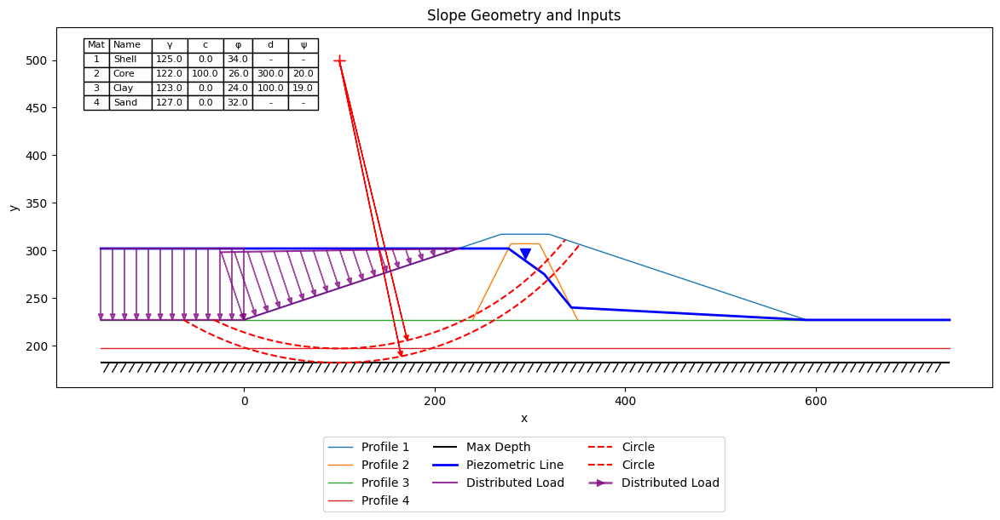

The next is to select the method you want to use for the analysis. You can choose to perform a single analysis for a 
selected failure surface or perform an exhaustive search to find the surface with the lowest or critical factor of 
safety. If you are performing a single analysis, your first build a set of slices using the 'generate_slices' function. 
This function takes the slope data and the failure surface you want to analyze as inputs and returns a set of 
slices in a pandas DataFrame. These slices are then passed to the 'solve_selected' function along with a string 
defining the method to be used ("oms","bishop","janbu","corps","lowe","spencer","mprice"). This function 
returns a dictionary containing the results of the analysis which can then be plotted using the 'plot_solution' 
function. For example:

```python
import xslope as xslope
from xslope.slice import generate_slices
from xslope.plot import plot_solution
from xslope.solve import solve_selected

circle = slope_data['circles'][0] if slope_data['circular'] else None
non_circ = slope_data['non_circ'] if slope_data['non_circ'] else None
success, result = generate_slices(slope_data, circle=circle, non_circ=non_circ, num_slices=num_slices)
if success:
  slice_df, failure_surface = result
  results = solve_selected(method, slice_df, rapid=rapid_drawdown)
  plot_solution(slope_data, slice_df, failure_surface, results, save_png=save_png)
else:
  print(result)
  exit()
```

The 'plot_solution' function takes the slope data, the slices, the failure surface, and the results of the analysis 
as inputs and plots the results. The results are displayed as follows:

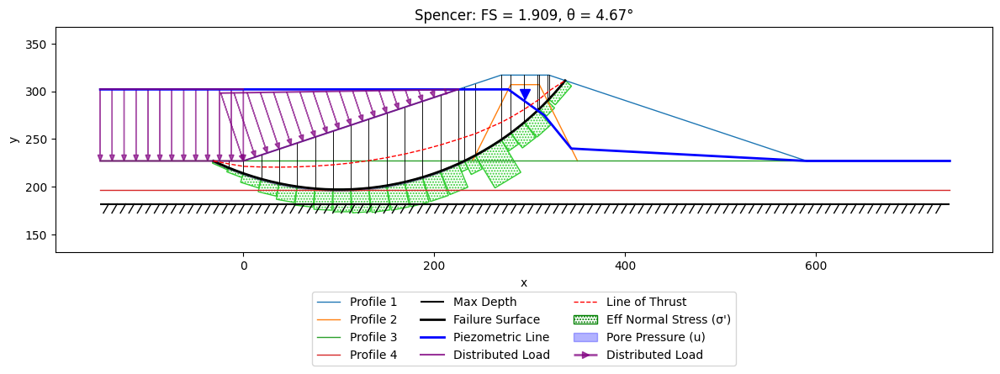

To perform an automated search for the critical factor of safety, you can use the 'circular_search' function for 
circular failure surfaces or the 'non_circular_search' function for non-circular failure surfaces. This function 
takes the slope data, the method string, and flag for the rapid drawdown analysis as inputs and returns a dictionary 
containing the results of the analysis. The results are then plotted using the 'circular_search_results' or 
'non_circular_search_results' functions. You can also plot the results for the critical circle using the 
`plot_solution` function. For 
example:

```python
import xslope as xslope
from xslope.plot import plot_circular_search_results, plot_noncircular_search_results
from xslope.solve import solve_all
from xslope.search import circular_search, noncircular_search

if surface_type == "circular":
  fs_cache, converged, search_path, circle_cache = circular_search(slope_data, method, rapid=rapid_drawdown, diagnostic=False)
  plot_circular_search_results(slope_data, fs_cache, search_path, circle_cache=circle_cache, save_png=save_png)
else:
  fs_cache, converged, search_path = noncircular_search(slope_data, method, rapid=rapid_drawdown, diagnostic=False)
  plot_noncircular_search_results(slope_data, fs_cache, search_path, save_png=save_png)

```
The results are displayed as follows:

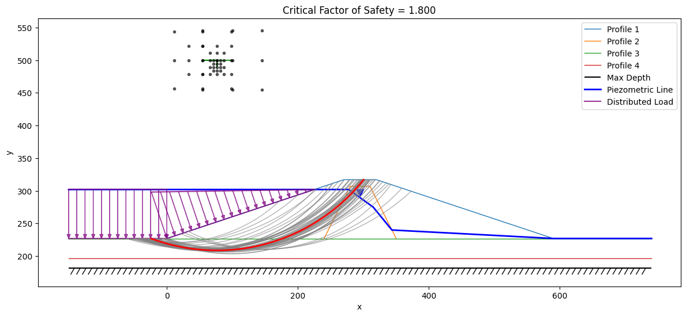

You can also extract the critical factor of safety from the results dictionary as follows:

```python
import xslope as xslope
from xslope.plot import plot_solution

critical_surface = fs_cache[0]
slice_df = critical_surface['slices']
failure_surface = critical_surface['failure_surface']
results = critical_surface['solver_result']
plot_solution(slope_data, slice_df, failure_surface, results, save_png=save_png)
```
The results are displayed as follows:

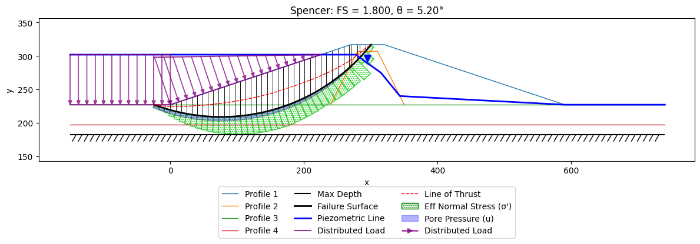

To perform a reliability analysis, you can use the 'reliability_analysis' function. The input template should 
include a set of standard deviations for each of the material properties. The results are then plotted using the 
'plot_reliability_results' function. For example:

```python
import xslope as xslope
from xslope.advanced import reliability
from xslope.plot import plot_reliability_results

circular = (surface_type == "circular")
success, result = reliability(slope_data, method, rapid=rapid_drawdown, circular=circular, debug_level=1)
if success:
  plot_reliability_results(slope_data, result, save_png=save_png)
else:
  print(f"Reliability analysis failed: {result}")
```

You can find a Google Colab notebook with the code examples and usage and a set of sample problems in the [Sample 
Problems](samples.md) page.