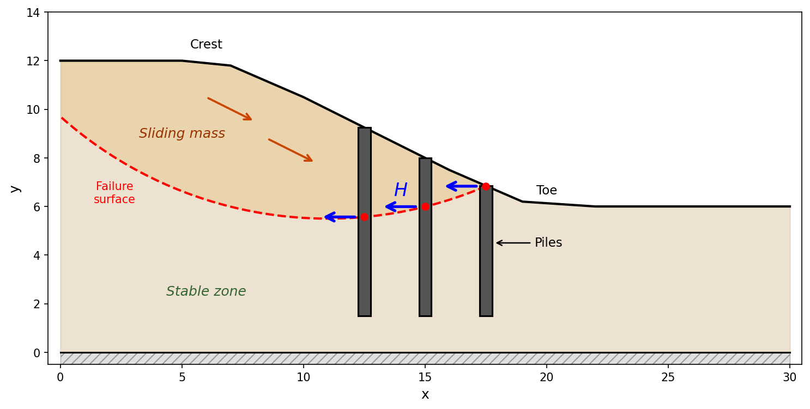
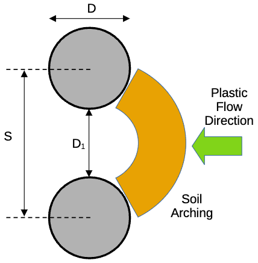
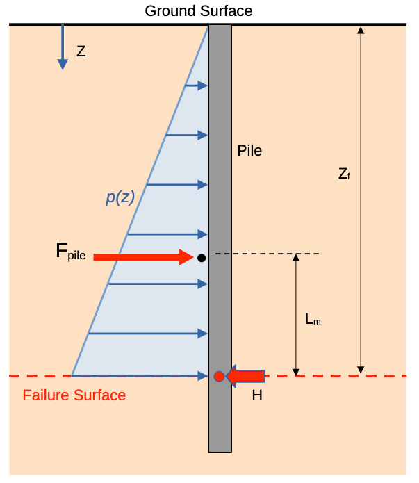

# Piles and Concrete Piers in LEM Slope Stability

## Introduction

Piles and concrete piers are rigid structural elements used to stabilize slopes by resisting lateral soil movement through shear and bending at the failure surface. Unlike flexible reinforcement (geotextiles, soil nails) which deforms with the soil and provides tension along its axis, piles act as passive structural inclusions that the sliding soil mass pushes against. The pile develops a lateral resisting force at the point where the failure surface intersects the pile, directly opposing the driving forces that cause slope instability.

Pile stabilization is widely used in practice for:

- Remediation of active landslides
- Stabilization of slopes for new construction (roads, buildings, retaining structures)
- Protection of existing infrastructure from slope movement
- Increasing the factor of safety of marginally stable slopes

A row of piles is installed through the sliding mass and embedded into stable ground below the failure surface. As the soil mass attempts to move, it pushes against the piles, which resist through their lateral stiffness and embedment in the stable zone.

{width=1000px}

## Pile Force in Limit Equilibrium Analysis

### Force Definition

In the limit equilibrium framework, a pile is characterized by:

- A **force magnitude** $H$ (per unit width of slope, i.e., force/length) acting at the point where the pile intersects the failure surface
- A **force angle** $\theta_p$ measured from horizontal (positive = counterclockwise/upward, default = 0)

The force is decomposed into horizontal and vertical components:

>$H_h = H \cos\theta_p \qquad \text{(horizontal)}$

>$H_v = H \sin\theta_p \qquad \text{(vertical, positive upward)}$

When $\theta_p = 0$ (the default and most common case), the force is purely horizontal: $H_h = H$ and $H_v = 0$.

### Force Resolution on the Slice

The pile force acts at point $e$ on the failure surface where the pile intersects the slice base. Relative to the slice base (inclined at angle $\alpha$), the force resolves into:

>**Normal to base** (increases effective stress): $H \sin(\alpha - \theta_p)$

>**Tangential to base** (resists sliding): $H \cos(\alpha - \theta_p)$

The normal component increases the effective normal stress on the failure surface, which in turn increases frictional resistance. The tangential component directly opposes the sliding force. Both components contribute to stability.

### Moment Contribution

For methods that use moment equilibrium about a circle center $(X_o, Y_o)$, the pile force creates a resisting moment. The horizontal and vertical components of $H$ each contribute through their respective moment arms:

>$M_{\text{pile}} = H \cos\theta_p \cdot (Y_o - y_e) + H \sin\theta_p \cdot (x_e - X_o)$

where $(x_e, y_e)$ is the pile-failure surface intersection point. When $\theta_p = 0$, this reduces to $M_{\text{pile}} = H(Y_o - y_e)$.

The pile force is a **known applied force** and is **not** divided by the factor of safety $F$. This is because $H$ represents the structural resistance of the pile, not a soil strength parameter. It appears in the denominator of the factor of safety equation (reducing driving forces) rather than in the numerator (which contains soil shear strength divided by $F$).

### Setting the Force Angle $\theta_p$

A stabilizing pile always **resists** the sliding mass, so adding a pile can only increase the factor of safety. The angle $\theta_p$ sets the tilt of the pile force away from horizontal:

- $\theta_p = 0$ — a horizontal force pushing back against the moving soil. This is the default and most common case.
- $\theta_p > 0$ — the force is tilted **upward** (for example, a raking pile that also lifts the mass).
- $\theta_p < 0$ — the force is tilted **downward**.

You enter the same $\theta_p$ regardless of which way the slope faces. XSLOPE always directs the horizontal component *against* the soil movement, so $\theta_p = 0$ resists the slide whether the slope descends to the left or to the right — there is no need to flip the angle for a mirror-image slope. The sign of $\theta_p$ only controls the up/down tilt, where positive is upward.

### Per-Unit-Width Convention

All forces in 2D limit equilibrium analysis are expressed per unit width of slope (perpendicular to the cross-section). If a row of piles has individual capacity $H_{\text{single}}$ at center-to-center spacing $S$, the equivalent force per unit width is:

>$H = \dfrac{H_{\text{single}}}{S}$

### Non-Circular Failure Surfaces

The pile force formulation for Janbu, Corps of Engineers, Lowe-Karafiath, and Spencer's method uses only per-slice quantities ($\alpha$, force components) and has no dependence on circle geometry. These methods work with any failure surface shape, and the pile terms carry over without modification. The only circle-dependent pile terms appear in OMS and Bishop (the moment term), but those methods inherently require circular surfaces.

### Integration with LEM Methods

The pile force $H$ at angle $\theta_p$ is incorporated into each limit equilibrium method supported by XSLOPE. The specific modifications for each method are presented in the respective method documentation pages:

- [**OMS**](oms.md): $H\sin(\alpha-\theta_p)$ added to $N'$; pile moment terms added to the denominator
- [**Bishop**](bishop.md): $-H\sin\theta_p$ enters vertical equilibrium for $N'$; pile moment terms added to the denominator
- [**Janbu**](janbu.md): $-H\sin\theta_p$ enters vertical equilibrium for $N'$; $-H\cos\theta_p$ enters the horizontal force balance
- [**Force Equilibrium** (Corps of Engineers, Lowe-Karafiath)](force_eq.md): $-H\cos\theta_p$ added to horizontal equilibrium ($b_0$); $-H\sin\theta_p$ added to vertical equilibrium ($b_1$)
- [**Spencer**](spencer.md): $H\cos\theta_p$ added to $F_h$; $H\sin\theta_p$ added to $F_v$; moment terms added to $M_o$

In all methods, when $\theta_p = 0$, the equations reduce to the simpler horizontal-force-only case.

## Determining the Pile Force $H$

### User-Specified Force

The simplest approach is for the user to specify $H$ directly based on external analysis. The pile force may come from:

- p-y curve analysis software (e.g., LPILE, GROUP, RSPile)
- Structural analysis of the pile section
- Published design charts or empirical correlations
- Full 3D finite element analysis

When using user-specified forces, the user enters $H$ (per unit width) and $\theta_p$ in the `piles` sheet of the input template. This approach gives the user full control and is appropriate when detailed pile analysis has already been performed.

### Ito & Matsui (1975) Theory

The Ito & Matsui method is the most widely used closed-form approach for computing the lateral force that soil exerts on passive stabilizing piles. It models the soil between adjacent piles as being in a state of **plastic equilibrium** — the soil deforms plastically as it squeezes between the piles, like material flowing through a constriction. Using Mohr-Coulomb plasticity theory, Ito & Matsui derived closed-form equations for the lateral pressure on the piles as a function of depth.

#### Setup and Notation

Consider a row of piles embedded in a slope:

- $D$ = pile diameter (or width of the pile cross-section)
- $S$ = center-to-center spacing between piles
- $D_1 = S - D$ = clear spacing between adjacent pile faces
- $z$ = depth below the ground surface
- $z_f$ = depth from the ground surface to the failure surface at the pile location
- Soil properties: cohesion $c$, friction angle $\phi$, unit weight $\gamma$
- Passive earth pressure coefficient: $N_\phi = \tan^2\!\left(45° + \dfrac{\phi}{2}\right)$

The theory applies to the portion of the pile **above** the failure surface — this is the zone where soil is actively moving and pushing against the pile.

**Notation**: The original paper uses $d$ for pile diameter, $D_1$ for center-to-center spacing, and $D_2$ for clear spacing. XSLOPE uses $D$, $S$, and $D_1$ respectively. The equations are identical; only the symbols differ.

#### General $c$-$\phi$ Soil

For a soil with both cohesion and friction ($c > 0$, $\phi > 0$), the distributed lateral force $p(z)$ (force per unit length of pile) at depth $z$ is:

>$p(z) = c \cdot A_1 + \gamma z \cdot A_2$

where $A_1$ and $A_2$ are arching coefficients with units of length. Let $S = D_1 + D$ (center-to-center spacing). The coefficients are computed from three intermediate quantities:

>$R = \left(\dfrac{S}{D_1}\right)^{\sqrt{N_\phi}\,\tan\phi + N_\phi - 1}$

>$\mathcal{E} = \exp\!\left(\dfrac{D}{D_1}\,N_\phi\tan\phi\,\tan\!\left(\dfrac{\pi}{8}+\dfrac{\phi}{4}\right)\right)$

>$F = \dfrac{2\tan\phi + 2\sqrt{N_\phi} + N_\phi^{-1/2}}{\sqrt{N_\phi}\,\tan\phi + N_\phi - 1}$

$R$ is the geometric amplification from the ratio of center-to-center to clear spacing, $\mathcal{E}$ captures the exponential plastic flow between piles, and $F$ is a dimensionless grouping of friction and earth pressure terms.

The overburden coefficient (from Eq. 14, the $c = 0$ specialization of Eq. 13) is:

>$A_2 = \dfrac{S \cdot R \cdot \mathcal{E}\, -\, D_1}{N_\phi}$

The cohesion coefficient (from Eq. 13) is:

>$A_1 = \dfrac{S \cdot R\,(\mathcal{E} - 2\sqrt{N_\phi}\,\tan\phi - 1)}{N_\phi\tan\phi} + S \cdot F\,(R - 1) + \dfrac{2\,D_1}{\sqrt{N_\phi}}$

These expressions were verified against the original paper's parametric charts (Figs. 7–9) and field measurements (Table 1, Figs. 13–14).

Key behavior of $p(z)$:

- **Increases with depth** through the $\gamma z$ term — deeper soil mobilizes more pressure against the pile
- **Increases as $D_1/D$ decreases** (closer piles = more arching = more force per pile)
- **Increases with $\phi$** — higher friction angle produces stronger soil arching between piles
- **Increases with $c$** — cohesion contributes a constant (depth-independent) component

#### Cohesionless Soil ($c = 0$)

For a purely frictional soil with $c = 0$, the cohesion term vanishes and the lateral pressure is:

>$p(z) = \gamma z \cdot A_2$

where $A_2$ is the same expression as above. The pressure increases linearly from zero at the ground surface.

#### Undrained Clay ($\phi = 0$)

For a purely cohesive (undrained) soil with $\phi = 0$, the general $c$-$\phi$ expressions become indeterminate because $N_\phi = 1$ and $\tan\phi = 0$. Deriving the solution independently for $\phi = 0$ (Ito & Matsui Eq. 23) yields:

>$p(z) = c_u \left[S\left(3\ln\dfrac{S}{D_1} + \dfrac{D}{D_1}\tan\dfrac{\pi}{8} - 2\right) + 2D_1\right] + \gamma z \cdot D$

where $S = D_1 + D$ is the center-to-center spacing and $c_u$ is the undrained shear strength. The first term represents the cohesion contribution (constant with depth) and the second term represents the overburden contribution (linear with depth), which simplifies to $\gamma z \cdot D$ (the pile diameter).

#### Total Force per Pile

The total lateral force on a single pile is obtained by integrating $p(z)$ from the ground surface down to the failure surface depth $z_f$:

>$F_{\text{pile}} = \int_0^{z_f} p(z) \, dz$

Since $p(z)$ is linear in $z$ within a homogeneous layer, the integration is straightforward:

>$F_{\text{pile}} = c \cdot A_1 \cdot z_f + \gamma \cdot A_2 \cdot \dfrac{z_f^2}{2}$

#### Force per Unit Width

The 2D plane-strain equivalent force used in LEM (per unit width of slope) is:

>$H = \dfrac{F_{\text{pile}}}{S}$

This is the value entered (or computed) for the pile force in the slope stability analysis.

#### Multi-Layer Soils

When the pile passes through multiple material zones above the failure surface (common in practice), the integration is performed piecewise. For each layer $j$ with properties $c_j$, $\phi_j$, $\gamma_j$ between depths $z_{\text{top},j}$ and $z_{\text{bot},j}$:

>$F_j = c_j \cdot A_{1,j} \cdot (z_{\text{bot},j} - z_{\text{top},j}) + \gamma_j \cdot A_{2,j} \cdot \dfrac{z_{\text{bot},j}^2 - z_{\text{top},j}^2}{2}$

The total force per pile is the sum over all layers:

>$F_{\text{pile}} = \sum_j F_j$

Note that $A_{1,j}$ and $A_{2,j}$ must be recomputed for each layer since $\phi$ may differ between layers. The pile geometry ($D$, $D_1$) remains the same for all layers.

#### Computation at Each Trial Surface

An important characteristic of the Ito & Matsui calculation is that **$H$ depends on the failure surface location**. A deeper failure surface means more soil above it pushing on the pile, giving a higher $H$. Therefore, $H$ should be recomputed for each trial failure surface during an automated search. Since the computation involves only closed-form expressions and simple integration, it is essentially instantaneous and adds no meaningful computational cost.

In XSLOPE, when $H$ is left blank in the `piles` sheet but the pile diameter $D$ and spacing $S$ are provided, the Ito & Matsui force is computed automatically at slice generation time for each trial surface. If the user provides an explicit $H$ value, that value is used instead (override mode).

#### Soil Arching Between Piles

A critical aspect of pile-stabilized slopes is the three-dimensional soil arching that develops between adjacent piles. As the sliding soil mass pushes against the pile row, stress concentrations develop around each pile, and the soil "arches" between piles in a manner analogous to arching above a tunnel. This is the mechanism captured by the Ito & Matsui theory.

The effectiveness of soil arching depends on:

- **Pile spacing**: Closer spacing produces stronger arching and higher force per pile. The optimal spacing balances structural efficiency (fewer piles) against arching effectiveness (closer piles).
- **Soil strength**: Stronger soils develop more effective arching. In very weak soils (soft clay), arching may be minimal and the soil may flow between the piles without mobilizing significant resistance.
- **Pile rigidity**: Rigid piles provide fixed points for arch development. Flexible piles may deflect enough to reduce arching effectiveness.

For design purposes, $S/D$ ratios of 3 to 6 are typical for slope stabilization applications.

#### Low Friction Angle Floor

The general $c$-$\phi$ equation (Eq. 13) and the undrained clay equation (Eq. 23) were derived independently using different mathematical approaches. As $\phi \to 0$, the $c$-$\phi$ equation does **not** converge to the $\phi = 0$ result — the overburden coefficient $A_2$ drops to near zero for small $\phi$ before recovering and exceeding the $\phi = 0$ value at approximately $\phi = 12$–$15°$. This creates an unphysical discontinuity where a soil with $\phi = 2°$ would produce less pile force than one with $\phi = 0°$.

Since friction can only strengthen soil arching (and thus increase the lateral force on the pile), XSLOPE enforces the $\phi = 0$ coefficients as a lower bound for all friction angles:

>$A_1 = \max(A_{1,c\text{-}\phi},\; A_{1,\phi=0}) \qquad A_2 = \max(A_{2,c\text{-}\phi},\; A_{2,\phi=0})$

This ensures that the computed pile force increases monotonically with $\phi$. For further discussion of limitations in the Ito & Matsui formulation, see [Ukritchon & Keawsawasvong (2017)](https://doi.org/10.1061/(ASCE)GT.1943-5606.0001753).

#### Applicability and Limitations

The Ito & Matsui method has the following characteristics and limitations:

- **Rigid pile assumption**: The theory assumes piles do not deflect significantly. This is conservative for flexible piles, which mobilize less soil pressure than rigid piles.
- **Plastic flow assumption**: The method gives an **upper bound** on the soil's capacity to push on the pile. The actual mobilized resistance may be lower if the soil has not fully reached the plastic state.
- **Spacing ratio**: The theory is applicable for $S/D$ between approximately **2 and 8**. Below $S/D \approx 2$, the piles act more like a continuous retaining wall. Above $S/D \approx 8$, soil arching between piles becomes negligible and the method overestimates the force. XSLOPE's model checks warn before a run when an auto-computed row sits outside this band.
- **Originally derived for horizontal ground**: The overburden term $\gamma z$ in $p(z)$ assumes the vertical stress at depth $z$ equals $\gamma z$, which is exact only for horizontal ground. On a slope face, the actual vertical stress at the pile location is less than $\gamma z$ because the soil column above is truncated by the slope geometry. This means the method can overestimate the overburden contribution for piles on the slope face, particularly near the toe where the soil column is shallowest relative to a horizontal surface at the same elevation. For piles behind the crest on level ground, the approximation is accurate. In practice, the theory is routinely applied to slopes and the overestimation is generally accepted as conservative (it increases the computed pile resistance, not the driving forces). XSLOPE uses the vertical depth from the ground surface at the pile location to the failure surface, consistent with standard practice in commercial software (Slide2, SLOPE/W).
- **Upper bound on soil force**: The computed $H$ represents the soil's capacity to push on the pile. The actual pile resistance used in the LEM is the **lesser** of the Ito-Matsui soil force and the pile's structural shear/bending capacity. See [Structural Capacity Checks](#structural-capacity-checks) below for how XSLOPE enforces this limit when $V_{\text{cap}}$ and $M_{\text{cap}}$ are provided.

## Structural Capacity Checks

The pile resistance used in LEM should not exceed the structural capacity of the pile. Two structural failure modes are checked when the optional $V_{\text{cap}}$ and $M_{\text{cap}}$ columns are provided in the `piles` sheet:

- **Shear capacity** ($V_{\text{cap}}$): The maximum lateral shear force that the pile cross-section can resist. For concrete piles, this is governed by the concrete and steel reinforcement; for steel piles, by the web and flange dimensions.
- **Moment capacity** ($M_{\text{cap}}$): The maximum bending moment the pile can resist. The limiting lateral force from bending is $M_{\text{cap}} / L_m$, where $L_m$ is the moment arm from the pressure centroid to the failure surface.

Both $V_{\text{cap}}$ and $M_{\text{cap}}$ are properties of a **single pile** (not per unit width). The capacity check compares them against the per-pile force $F_{\text{pile}}$, not the per-unit-width force $H$. The pile forces xslope reports back — and the FEM pile-shear colorbar — are per unit width of slope; multiply by the spacing $S$ to recover the per-pile force for comparison against the single-pile $V_{\text{cap}}$ / $M_{\text{cap}}$.

### Capacity Check Procedure

The capacity check applies regardless of how the pile force was obtained, but the details differ between the two cases.

**Common steps** (both cases):

1. If $V_{\text{cap}}$ is provided: $\;F_{\text{pile}} = \min(F_{\text{pile}},\; V_{\text{cap}})$
2. If $M_{\text{cap}}$ is provided: $\;F_{\text{pile}} = \min(F_{\text{pile}},\; M_{\text{cap}} / L_m)$
3. Convert back to per-unit-width: $\;H = F_{\text{pile}} / S$

The capped $H$ is then used in the slice equilibrium equations.

### Case 1: Ito & Matsui Auto-Computed $H$

When $H$ is left blank and $D$ and $S$ are provided, XSLOPE computes $F_{\text{pile}}$ by integrating the Ito & Matsui pressure distribution $p(z) = c \cdot A_1 + \gamma z \cdot A_2$ from the ground surface to the failure surface. Because the full pressure distribution is known, XSLOPE also computes the **exact moment arm** $L_m$ from the centroid of that distribution:

>$L_m = \dfrac{\displaystyle\int_0^{z_f} (z_f - z)\, p(z)\, dz}{F_{\text{pile}}}$

The integration is performed piecewise over each soil layer (the same segments used for the force calculation). Some limiting cases:

- **Uniform pressure** ($c > 0$, $\gamma = 0$): $L_m = z_f / 2$
- **Triangular pressure** ($c = 0$, $\gamma > 0$): $L_m = z_f / 3$
- **General** $c$-$\phi$ **soil**: $z_f / 3 < L_m < z_f / 2$

The controlling design value is:

>$H = \dfrac{1}{S}\min(F_{\text{Ito-Matsui}},\; V_{\text{cap}},\; M_{\text{cap}} / L_m)$

The summary output reports the soil force, each capacity check with $[\text{GOVERNS}]$ or $[\text{OK}]$ status, and the capped values if the structural capacity controls.

### Case 2: User-Specified $H$

When the user provides $H$ directly, the per-pile force is computed as $F_{\text{pile}} = H \times S$. The $V_{\text{cap}}$ check is straightforward — it is a direct comparison of $F_{\text{pile}}$ against the shear capacity.

For the $M_{\text{cap}}$ check, the pressure distribution behind the pile is unknown, so XSLOPE cannot compute $L_m$ from integration. Instead, it uses a default of:

>$L_m = z_f / 3$

This corresponds to a triangular pressure distribution (linearly increasing with depth), which gives the **largest** $M_{\text{cap}} / L_m$ and therefore the **least restrictive** cap on $F_{\text{pile}}$. If the actual pressure distribution is more uniform (top-heavy), the true $L_m$ would be larger and the $M_{\text{cap}}$ check would be more restrictive. Users who know their pressure distribution can account for this by pre-computing the capped force externally:

>$H = \dfrac{1}{S}\min(F_{\text{soil}},\; V_{\text{cap}},\; M_{\text{cap}} / L_m) \qquad \text{(enter this value directly)}$

### Summary of Differences

| | $F_{\text{pile}}$ source | $L_m$ for $M_{\text{cap}}$ check | Summary detail |
|---|---|---|---|
| **Ito & Matsui** | From integration of $p(z)$ | Exact, from pressure centroid | Full Ito & Matsui summary with capacity check |
| **User-specified** $H$ | $H \times S$ | Default $z_f / 3$ | Capacity check only (no Ito & Matsui summary) |

### Run-Summary Output

A limit equilibrium run on a model with pile rows prints one line per row
with the factor of safety, so the applied forces are visible without
generating a report: the Ito & Matsui soil force per pile, the capacity
that governed (`bending governs (Mcap/Lm, Lm = ...)` or
`shear governs (Vcap)`), and the force applied per unit width, with a total
when more than
one row contributes. A row with a user-specified $H$ prints its stated
value, or — when a capacity binds it — the governing check and the applied
force. The full per-slice accounting remains in the
[Analysis Report](../studio/reports.md).

## LEM vs. FEM Pile Modeling

A pile row can be put into either of XSLOPE's engines, but the two are not alternative ways of solving the same problem. Which one is appropriate is decided by the member's geometry out of plane.

**How LEM models piles**: the pile contributes a single concentrated force $H$ at the point where the failure surface crosses it. With Ito & Matsui that force is computed from the diameter $D$ and the center-to-center spacing $S$ — a plasticity solution for soil squeezing *between* adjacent piles — then capped by $V_{\text{cap}}$ and $M_{\text{cap}}$, resolved onto the slice base, and carried into the equilibrium equations. Spacing is a first-class input: change $S$ and the arching coefficients, the force per pile and the force per unit width of slope all change with it.

**How FEM models piles**: the pile is meshed as a chain of Euler-Bernoulli beam elements sharing nodes with the soil continuum, and its $EA$ and $EI$ are divided by $S$ and smeared over a unit width of section (see [Assembly](../fem/piles.md#assembly)). Nothing is prescribed — the beam carries whatever the deforming soil pushes onto it, over its whole length rather than at one point — and the analysis returns the moment, shear, deflection and soil reaction down the member.

**Why the two are not interchangeable**: a two-dimensional analysis is plane strain, so every member in it is continuous out of plane. There is no gap between piles for soil to move through. A discrete row modeled in the FEM is therefore a *wall* at $1/S$ of one pile's stiffness, and the mechanism has to pass over, under or around it. Spacing enters the finite element model exactly once, as that divisor, so the quantity that governs the real three-dimensional mechanism reaches the model only as a stiffness.

### Which engine for which member

| Member | Out of plane | Engine | What it gives |
|---|---|---|---|
| Sheet pile, diaphragm or secant wall | continuous | FEM, spacing $S$ = 1 | factor of safety, plus moment, shear, deflection and soil reaction down the member |
| Contiguous or very closely spaced row | nearly continuous | FEM, with the smear stated | the same, with the gap unrepresented |
| Discrete row at spacing | discrete | LEM with Ito & Matsui | factor of safety per spacing, force per row, capacity checks |

For a **continuous member** the beam formulation is an exact description rather than an idealization, its $EA$ and $EI$ already are per unit width, and it returns internal actions that a limit equilibrium analysis cannot produce at all. That path is verified end to end against GeoStudio's SIGMA/W sheet pile wall example, where XSLOPE reads 1.020 without the wall and 1.451 with it and recovers the published moment and shear distributions in shape and turning point — see [the SIGMA/W wall benchmark](../verification/geostudio.md#sigmaw-wall) and [Applicability](../fem/piles.md#applicability-continuous-walls-and-discrete-pile-rows) in the FEM pile documentation.

For a **discrete row** the limit equilibrium route is the one whose mechanism is the real one. The size of the difference is measured on [the pile sample problem](samples.md#10-slope-stabilized-with-piles) — a 1:1 slope in c = 200 psf, $\phi$ = 20° soil with two rows of 2 ft drilled shafts at 6 ft spacing — which is solved by both engines on the same section, soil and pile rows:

| | Without piles | With piles | Credit for the row |
|---|---|---|---|
| **LEM** (Spencer) | 1.149 | 1.842 | ×1.60 |
| **FEM** (SSRM) | 1.164 | 1.361 | ×1.17 |

Without the piles the two engines agree to 1.3%, so nothing structural separates them and what the second column adds is the pile row alone. With the row in place they credit it by a factor of 1.60 and 1.17 — a disagreement on the quantity being designed, not a rounding.

Neither of those is a three-dimensional answer, and the direction of the error is only known where a three-dimensional reference exists. Cai & Ugai (2000) analyzed a pile-stabilized slope with a shear-strength-reduction finite element model that meshes the individual piles, the soil between them and the slip interfaces on each pile's surface. XSLOPE runs the same slope through both of its own engines:

| Case | XSLOPE SSRM (2D beam) | Cai & Ugai 3D FE |
|---|---|---|
| No pile | 1.136 | 1.14 (−0.4%) |
| Pile at $D_1/D$ = 3, free head | 1.453 | 1.36 (+6.8%) |
| Pile, head rotation restrained | 1.570 | 1.45 (+8.3%) |

The unpiled case agrees to 0.4%, which is what makes the other two readable. With the row in place the plane-strain model reads high: it credits the row with multiplying the unreinforced factor of safety by 1.279 where the three-dimensional model credits 1.193. On the same slope a Bishop search with the Ito & Matsui force reads 1.451 against the paper's own limit-equilibrium value of 1.37 and Slide2's 1.43, a credit of 1.269 — a comparable distance above the three-dimensional value rather than a materially smaller one. Neither two-dimensional credit recovers the three-dimensional one. What the one benchmark with a published three-dimensional answer settles is the direction of the plane-strain error, not a ranking of the two routes. Both comparisons are quantified in [VP106](../verification/rocscience.md#vp106) and [the VP106 finite-element diagnostic](../verification/rocscience.md#vp106-fem).

**Practical implications**: take the factor of safety for a discrete pile row from the limit equilibrium analysis with Ito & Matsui, and read its finite element counterpart as a stiffness-and-force study rather than as a competing factor of safety. Do not repair the plane-strain smear by adjusting the pile stiffness or by imposing the Ito & Matsui limit pressure on the beam — the limit pressure is a theory of the very mechanism the two-dimensional model does not contain, and applying it there counts the same resistance twice. Where the member really is continuous, use the finite element path: it is the only one that reports what the member carries.

## Stabilizing Piles vs. Load-Bearing Piles

The discussion above focuses on **stabilizing piles** (also called passive piles) — piles installed specifically to resist lateral soil movement and improve slope stability. However, piles near slopes may also serve as **load-bearing piles** that carry structural loads (buildings, bridges, retaining walls) through the soil to deeper bearing strata. The treatment of these two cases in slope stability analysis is fundamentally different.

### Stabilizing (Passive) Piles

Stabilizing piles are the primary focus of the pile implementation in XSLOPE. These piles:

- Are installed through the sliding mass and embedded in stable ground below the failure surface
- Resist lateral soil movement through shear and bending
- Provide a lateral force $H$ at the failure surface that is incorporated into the LEM equations as described above
- Their own self-weight is typically negligible relative to the soil mass and is ignored

### Load-Bearing Piles

Load-bearing piles carry structural loads (vertical forces from foundations) and transfer them to the subsurface through a combination of **skin friction** along the pile shaft and **end bearing** at the pile tip. The key question for slope stability is: does the structural load contribute to the driving forces on the failure surface?

#### Case 1: Pile tip above the failure surface

If the pile tip is entirely within the sliding mass (a friction pile in weak soil, for example), the entire pile and its load are part of the sliding mass. The structural load **does** contribute to driving forces and should be included in the analysis. Standard practice is to apply the structural load as a **distributed surface surcharge** using the distributed loads (`dloads`) sheet in the XSLOPE input template. This is slightly conservative because it places all the weight at the surface rather than distributing it with depth through skin friction, but the conservatism is generally small and accepted in practice.

#### Case 2: Pile tip below the failure surface

This is the usual design intent for load-bearing piles near slopes — the pile is embedded in stable ground below the failure surface. The pile shaft necessarily passes **through** the sliding mass to reach that stable ground, and skin friction is mobilized along the full shaft length, both above and below the failure surface. The portion of the structural load transferred via skin friction **above** the failure surface loads the sliding mass; the remainder (skin friction below the failure surface plus end bearing) bypasses it.

In principle, determining the split requires a load-transfer analysis (t-z curves or similar). In practice, this is rarely done in the context of slope stability because the complexity is not justified. Instead, two bounding assumptions are used:

**Lower bound (omit the load)**: Assume the pile delivers all of its load to stable ground below the failure surface. The structural load is omitted entirely from the slope stability model. This is the approach recommended by FHWA, AASHTO, and used by commercial slope stability software (SLOPE/W, Slide2). It is appropriate when:

- The pile is designed as an end-bearing pile in competent material (rock, dense sand) — most of the load genuinely reaches the tip
- The skin friction above the failure surface is small relative to the total pile capacity (shallow failure surface relative to the pile length, or weak soil in the sliding mass)
- The structural load is modest relative to the soil driving forces

**Upper bound (full surcharge)**: Treat the full structural load as a surface surcharge, as in Case 1. This is conservative — it assumes all of the load enters the sliding mass, ignoring the load that bypasses via end bearing and deep skin friction. This approach is appropriate when:

- A significant portion of the pile shaft is above the failure surface
- The soil above the failure surface has high skin friction capacity (the pile sheds substantial load before reaching the failure surface)
- The structural load is large relative to the soil driving forces, and the lower-bound assumption would meaningfully affect the computed factor of safety

For most practical cases with end-bearing piles through a shallow sliding mass, the lower-bound (omit) approach is standard and the error is small. When in doubt, run both assumptions to bracket the answer.

#### Summary

For load-bearing piles near slopes, the recommended approach in XSLOPE is:

1. If the pile tip is above the failure surface, apply the structural load as a distributed surface load on the `dloads` sheet
2. If the pile tip is below the failure surface, omit the structural load from the slope stability model (lower bound). If the structural load is significant, also run with full surcharge (upper bound) to bracket the result.
3. If the pile also provides lateral resistance to sliding, model that separately as a stabilizing pile force $H$

The existing distributed load capability in XSLOPE handles the surcharge case. No additional code is needed for load-bearing piles — only clear guidance on when and how to apply the structural load.

For a more complete treatment of load-bearing piles that avoids these bounding assumptions, see the [FEM pile-soil interface discussion](../fem/piles.md#pile-soil-interface-and-load-transfer).

## Typical Parameter Values

The following tables provide typical ranges of pile and pier parameters for use in slope stability analysis. These values are intended as guidance for filling in the `piles` sheet of the input template and for preliminary design estimates.

### Pile Types and Typical Dimensions

| Pile Type | Typical Diameter/Width | Typical Length | Notes |
|-----------|----------------------|----------------|-------|
| Steel H-pile | 200-400 mm (8-14 in) | 6-30 m (20-100 ft) | Wide-flange sections; high strength-to-weight ratio |
| Steel pipe pile | 300-900 mm (12-36 in) | 6-40 m (20-130 ft) | Open-ended or closed-ended; often concrete-filled |
| Precast concrete pile | 250-600 mm (10-24 in) | 6-25 m (20-80 ft) | Square or octagonal cross-section |
| Drilled shaft (caisson) | 450-3000 mm (18-120 in) | 3-60 m (10-200 ft) | Cast-in-place; larger diameters common for slope stabilization |
| Concrete pier | 600-1500 mm (24-60 in) | 3-15 m (10-50 ft) | Often used for slope stabilization; rectangular or circular |
| Micropile | 150-300 mm (6-12 in) | 6-30 m (20-100 ft) | Drilled and grouted; used in tight access or existing structures |
| Timber pile | 200-400 mm (8-16 in) | 6-20 m (20-65 ft) | Tapered; limited to lighter loads |

### Typical Spacing

| Application | Typical $S/D$ Ratio | Typical Spacing $S$ | Notes |
|-------------|---------------------|---------------------|-------|
| Slope stabilization | 3-6 | 1.5-6 m (5-20 ft) | Closer spacing = more arching between piles |
| Retaining structures | 2-4 | 1-4 m (3-12 ft) | Often soldier piles with lagging |
| Ito & Matsui applicability | 2-8 | -- | Theory assumes plastic flow between piles |

### Typical Section Properties

| Section | $A$ (Area) | $I$ (Moment of Inertia) |
|---------|-----------|------------------------|
| Solid circular, $D$ = 0.6 m (24 in) | 0.283 m$^2$ (452 in$^2$) | 6.36 x 10$^{-3}$ m$^4$ (16,286 in$^4$) |
| Solid circular, $D$ = 0.9 m (36 in) | 0.636 m$^2$ (1,018 in$^2$) | 3.22 x 10$^{-2}$ m$^4$ (82,448 in$^4$) |
| Solid circular, $D$ = 1.2 m (48 in) | 1.131 m$^2$ (1,810 in$^2$) | 1.02 x 10$^{-1}$ m$^4$ (260,576 in$^4$) |
| HP 14x117 (steel H-pile) | 0.022 m$^2$ (34.4 in$^2$) | 4.43 x 10$^{-4}$ m$^4$ (1,063 in$^4$) |
| HP 12x84 (steel H-pile) | 0.016 m$^2$ (24.6 in$^2$) | 2.18 x 10$^{-4}$ m$^4$ (524 in$^4$) |
| Pipe pile, $D$ = 0.6 m, $t$ = 12 mm | 0.022 m$^2$ (34.6 in$^2$) | 9.7 x 10$^{-4}$ m$^4$ (2,330 in$^4$) |

For solid circular sections: $A = \pi D^2 / 4$, $\quad I = \pi D^4 / 64$.

### Material Properties

| Material | $E$ (kPa) | $E$ (psf) | $\nu$ |
|----------|-----------|-----------|-------|
| Structural steel | 2.0 x 10$^8$ | 4.18 x 10$^9$ | 0.3 |
| Reinforced concrete ($f'_c$ = 4000 psi) | 2.5 x 10$^7$ | 5.2 x 10$^8$ | 0.2 |
| Reinforced concrete ($f'_c$ = 5000 psi) | 2.8 x 10$^7$ | 5.8 x 10$^8$ | 0.2 |
| Reinforced concrete ($f'_c$ = 6000 psi) | 3.0 x 10$^7$ | 6.3 x 10$^8$ | 0.2 |
| Timber (Douglas Fir) | 1.2 x 10$^7$ | 2.5 x 10$^8$ | 0.3 |

Concrete modulus computed as $E_c = 57{,}000 \sqrt{f'_c}$ (psi) per ACI 318.

### Typical Lateral Resistance $H$

Lateral resistance depends heavily on soil conditions, pile geometry, and embedment depth. The following ranges are approximate for preliminary estimates only.

| Soil Type | Pile Type | Typical $H$ per pile | Notes |
|-----------|-----------|---------------------|-------|
| Stiff clay ($c$ = 50-100 kPa) | Drilled shaft, $D$ = 0.9 m, $S$ = 3 m | 100-400 kN/m (7-27 kip/ft) | Per unit width = $H_{\text{pile}} / S$ |
| Medium dense sand ($\phi$ = 30-35 deg) | Steel H-pile, $S$ = 2 m | 50-200 kN/m (3-14 kip/ft) | Depends on depth above failure surface |
| Soft clay ($c$ = 15-30 kPa) | Concrete pier, $D$ = 1.2 m, $S$ = 3 m | 30-100 kN/m (2-7 kip/ft) | Lower bound; may govern over structural capacity |
| Weathered rock | Drilled shaft, $D$ = 0.9 m, $S$ = 3 m | 200-800 kN/m (14-55 kip/ft) | High capacity but expensive installation |

These values are for preliminary guidance only. Actual $H$ should be determined from Ito & Matsui theory, p-y analysis, or structural analysis of the pile.

### Typical Structural Capacities

The following table provides typical ranges of shear capacity ($V_{\text{cap}}$) and moment capacity ($M_{\text{cap}}$) for common pile types. These are ultimate capacities; appropriate factors of safety or resistance factors should be applied per the governing design code.

| Pile Type | $V_{\text{cap}}$ (kN) | $V_{\text{cap}}$ (kip) | $M_{\text{cap}}$ (kN·m) | $M_{\text{cap}}$ (kip·ft) | Notes |
|-----------|----------------------|----------------------|-------------------------|--------------------------|-------|
| Steel H-pile, HP 12x84 | 600–900 | 135–200 | 400–700 | 300–520 | Weak-axis shear/bending; strong-axis values ~2x higher |
| Steel H-pile, HP 14x117 | 900–1,300 | 200–290 | 700–1,200 | 520–880 | Weak-axis shear/bending |
| Steel pipe pile, $D$ = 600 mm, $t$ = 12 mm | 800–1,200 | 180–270 | 500–900 | 370–660 | Unfilled; concrete-filled values ~2–3x higher |
| Drilled shaft, $D$ = 0.6 m, $f'_c$ = 28 MPa | 300–500 | 65–110 | 200–500 | 150–370 | Depends on reinforcement ratio ($\rho$ = 1–3%) |
| Drilled shaft, $D$ = 0.9 m, $f'_c$ = 28 MPa | 500–900 | 110–200 | 600–1,500 | 440–1,100 | Depends on reinforcement ratio ($\rho$ = 1–3%) |
| Drilled shaft, $D$ = 1.2 m, $f'_c$ = 28 MPa | 800–1,400 | 180–310 | 1,200–3,500 | 880–2,600 | Depends on reinforcement ratio ($\rho$ = 1–3%) |
| Concrete pier, 0.6 m × 0.6 m, $f'_c$ = 28 MPa | 250–400 | 55–90 | 150–400 | 110–300 | Rectangular section; depends on reinforcement |
| Micropile, $D$ = 200 mm, steel casing | 200–400 | 45–90 | 50–150 | 35–110 | Governed by steel casing and grout bond |

$V_{\text{cap}}$ for reinforced concrete is typically computed per ACI 318 as $V_c + V_s$ (concrete + stirrup contributions). $M_{\text{cap}}$ is the nominal moment capacity $M_n$ of the cross-section. For steel sections, $V_{\text{cap}} = 0.6 F_y A_w$ (web area) and $M_{\text{cap}} = F_y Z$ (plastic section modulus).

## References

Ito, T., & Matsui, T. (1975). Methods to estimate lateral force acting on stabilizing piles. *Soils and Foundations*, 15(4), 43-59.

Poulos, H.G. (1995). Design of reinforcing piles to increase slope stability. *Canadian Geotechnical Journal*, 32(5), 808-818.

FHWA. (2009). *Design and Construction of Driven Pile Foundations*. Publication No. FHWA-NHI-05-042/043, Federal Highway Administration.

Hassiotis, S., Chameau, J.L., & Gunaratne, M. (1997). Design method for stabilization of slopes with piles. *Journal of Geotechnical and Geoenvironmental Engineering*, 123(4), 314-323.
