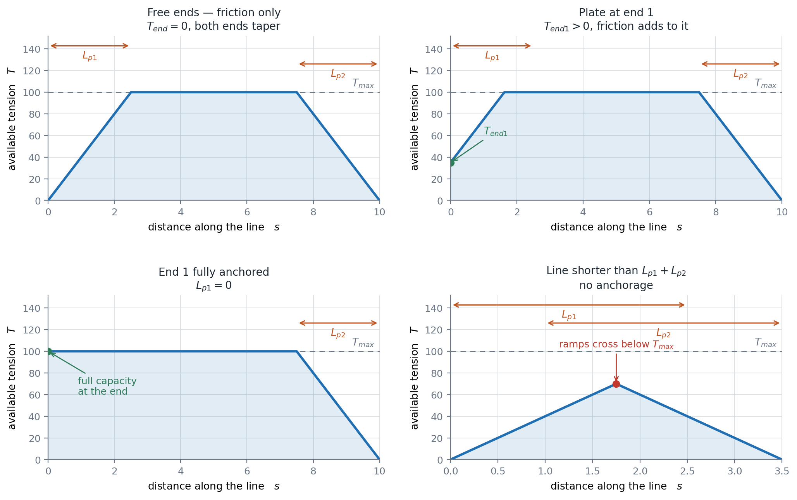
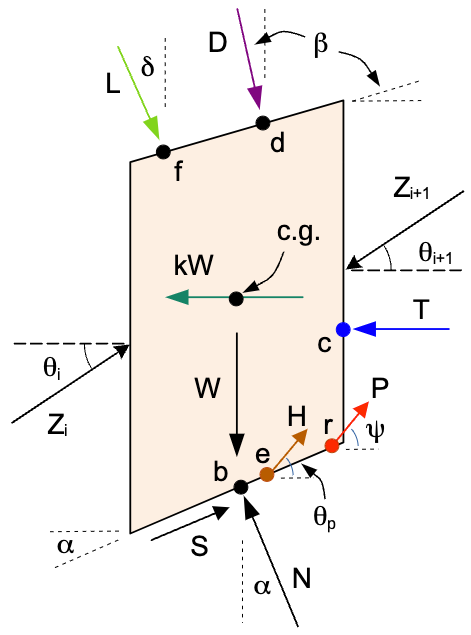
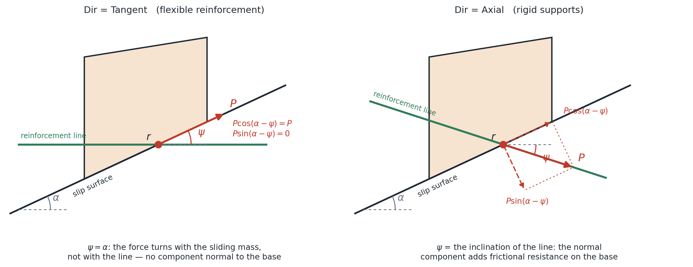

# Soil Reinforcement in LEM Slope Stability

## Introduction

Soil reinforcement — geosynthetics (geotextiles and geogrids), soil nails, grouted tiebacks, and end-anchored
bars — stabilizes slopes by mobilizing **tensile force** across the failure surface. In the limit equilibrium
framework, each reinforcement element is a straight line defined by its endpoint coordinates, and wherever a trial
failure surface crosses a line, a tensile force is applied to the sliding mass at the crossing point.

Three questions determine how that force enters the analysis, and they are independent of one another:

1. **How large is the force?** — governed by the *capacity envelope*: the tensile strength of the element, the
   frictional pullout development from each end, and any end anchorage (plates, connections, anchors).
2. **In what direction does it act?** — governed by the **Dir** setting: tangent to the slip surface (flexible
   reinforcement) or along the reinforcement's own axis (rigid supports).
3. **Is it factored by the safety factor?** — governed by the **Appl** setting: active (a known allowable force,
   not divided by $F$) or passive (an ultimate capacity that mobilizes with the soil, divided by $F$).

This decomposition follows the convention used by Slide2 and other commercial programs, which allows xslope
results to be compared directly against them. The **Type** column in the input template is a *preset* over these
settings — selecting a support type fills Dir and Appl with the appropriate defaults — not a separate mechanism.

## Capacity Envelope

### Force magnitude at the crossing point

The tensile force available at any point along a reinforcement line is limited by three mechanisms, and the
available force is the smallest of them:

>$T(x) = \min\left(T_{max},\;\; T_{end1} + T_{max}\dfrac{d_1}{L_{p1}},\;\; T_{end2} + T_{max}\dfrac{d_2}{L_{p2}}\right)$

where:

- $T_{max}$ = tensile capacity of the element (rupture limit)
- $d_1$, $d_2$ = distances from the point to end 1 and end 2 of the line
- $L_{p1}$, $L_{p2}$ = pullout lengths at each end — the distance over which interface friction develops the full
  tensile capacity
- $T_{end1}$, $T_{end2}$ = anchorage capacity at each end: a bearing plate, a facing connection, or an end anchor
  (default 0)

Special cases:

- **$T_{end} = 0$, $L_p > 0$** (the classical friction-only taper): tension is zero at the free end and develops
  linearly over the pullout length. This is the correct model for geosynthetics and for the embedded end of nails.
- **$L_p = 0$**: the end is fully anchored — the full capacity is available immediately at the end.
- **$T_{end} > 0$**: the end starts at the anchorage capacity and frictional development adds to it. This models
  a nail with a bearing plate at the wall face, a geosynthetic connected to facing panels, or a bar anchored at
  both ends. (If $T_{end} \geq T_{max}$, the end is effectively fully anchored — the tendon governs.)
- **Line shorter than $L_{p1} + L_{p2}$** with no anchorage: the envelopes from the two ends intersect below
  $T_{max}$ and only partial tension is mobilized.

The envelope for each of the four end conditions. The force available where a trial surface crosses the line is
the envelope value at the crossing point, so a surface that clips a line near a free end mobilizes only a
fraction of $T_{max}$.

### Pullout from the effective overburden

$L_p$ states the bond as a development length: the capacity grows at a constant rate $T_{max}/L_p$ no matter how
deep the reinforcement is buried. Interface friction does not work that way — it grows with the normal stress
pressing the soil onto the reinforcement — so the **Adhesion** and **Delta** columns state the interface strength
instead and let the resistance follow the depth of burial. Per unit length of a planar reinforcement, with soil
bearing on both faces:

>$r(s) = 2\left(a + \sigma'_v(s)\tan\delta\right)$

where $a$ is the soil–reinforcement adhesion (stress units), $\delta$ the interface friction angle (degrees), and
$\sigma'_v(s)$ the **effective** vertical stress at the point $s$ along the line: the weight of the soil column
standing above that point — every material zone it crosses at that material's unit weight, saturated below the
water table where the material declares a $\gamma_{sat}$ — less the pore pressure the model declares there
(piezometric line, $r_u$, or seepage field, exactly as a slice base reads it).

The envelope is then the same three-way minimum, with the ramps integrated rather than assumed linear:

>$T(s) = \min\left(T_{max},\;\; T_{end1} + \displaystyle\int_0^s r,\;\; T_{end2} + \int_s^L r\right)$

A constant $r$ recovers the straight ramps above, so the two laws are one formula. Both columns filled selects
this law and $L_{p1}$/$L_{p2}$ are then not read; both blank is the default and leaves the development-length law
exactly as it was. One filled and one blank is refused — half a law is not a law. LEM and FEM read the same
envelope under either law.

**FHWA pullout capacity.** The FHWA form $F^{*}\alpha\sigma'_v$ per unit area is this law with $a = 0$ and
$\delta = \arctan(F^{*}\alpha)$.

**Grouted tiebacks with a bonded length.** A tieback develops pullout resistance only over its grouted (bonded)
length $L_{bond}$ at the far end, at a bond strength $b$ (force per unit length); the free length carries whatever
force the bond zone can supply. This is expressed in the envelope by entering an effective
$T_{max}' = \min(T_{tendon},\, b \cdot L_{bond})$ and $L_p = T_{max}'/b$ at the bonded end, with the connection
capacity as $T_{end}$ at the face end.

### Per-unit-width convention and spacing

All LEM forces are per unit width of slope. Geosynthetic properties are already per unit width (kN/m or lb/ft), so
for them the **Spacing** column is left blank (or 1). Discrete supports — nails, tiebacks — have per-element
capacities (kN per nail) installed at a horizontal spacing $S$; enter the per-element values and the spacing, and
xslope divides all capacity terms ($T_{max}$, $T_{res}$, $T_{end1}$, $T_{end2}$, and the FEM stiffness $EA$)
by $S$. The forces xslope reports back — the LEM line forces, the FEM axial forces, and the
reinforcement-force colorbar — are likewise per unit width; multiply by the spacing $S$ to recover the
per-element (per-nail) force for comparison against a per-element capacity.

## Force Direction (Dir)

Where a reinforcement line crosses the base of a slice at point $r = (x_r, y_r)$, a force of magnitude $T(x_r)$ is
applied to the sliding mass at that point. In the slice free-body diagram it is the force $P$, drawn at the angle
$\psi$ measured from the horizontal — the same reference the slice base inclination $\alpha$ is measured from.
(The $T$ in that diagram is the tension-crack water force, a separate quantity.)

$\psi$ is a property of the force, not of the line, and the **Dir** setting is what fixes it:

- **Tangent to slip surface** ($\psi = \alpha$) — the **default**. Flexible
  reinforcement cannot resist bending; as the sliding mass moves, the reinforcement deforms with it and the force
  reorients tangent to the slip surface, whatever the line's own inclination. The angle between the force and the
  base, $\alpha - \psi$, is then zero. This is the appropriate (and conservative) assumption for geotextiles and
  geogrids, and is discussed by Duncan & Wright (2005).
- **Axial** ($\psi$ = the inclination of the reinforcement line itself) — rigid supports such as soil nails,
  grouted tiebacks, and anchored bars carry their force along their own axis; the soil cannot reorient them.
  UTEXAS/UTEXASED uses this convention, which is why xslope's tangent results for nail problems differ from
  UTEXASED's (see the [reinforced slope sample](samples.md), where the UTEXASED axial result is FS = 1.646 versus
  the tangent 1.587).

The direction affects each solution method the same way the pile force does: the force is resolved into components
normal and tangential to the slice base — $P\sin(\alpha - \psi)$ normal (zero for tangent) and
$P\cos(\alpha - \psi)$ tangential — and for moment-based methods it contributes a moment about the circle center
through its real moment arm at point $r$.

Tangent reinforcement delivers its whole magnitude along the base and nothing across it. Axial reinforcement
delivers less along the base, and the remainder presses the sliding mass onto the base, where it earns
frictional resistance $P\sin(\alpha - \psi)\tan\phi$. Which of the two gives the larger factor of safety
therefore depends on $\phi$ and on the angle between the line and the surface it crosses; for the nail sample
above, the axial result is the higher one. For tangent reinforcement on a circular surface the force is tangent to
the circle and its moment arm is exactly $R$, which is why the classical formulation reduces to a bare $\sum P$ in
the OMS and Bishop denominators. The per-method equations are given on the
[OMS](oms.md), [Bishop](bishop.md), [Janbu](janbu.md), [force equilibrium](force_eq.md), [Spencer](spencer.md),
and [Morgenstern-Price](mprice.md) pages.

## Force Application (Appl)

Two conventions exist for how a support force enters the factor of safety, and published solutions use both —
so the choice is exposed per line:

- **Active** (Slide2's "Method A", the **default**): the force is a known, *allowable* working load. It is applied
  to the driving side of the equilibrium equations and is **not** divided by $F$ — the factor of safety applies to
  the soil strength only. Appropriate for pre-tensioned supports (tiebacks) and whenever the entered capacity
  already carries its own safety factor.
- **Passive** (Slide2's "Method B"): the force is an *ultimate* capacity that mobilizes together with the soil
  strength. It is added to the resisting side and **is** divided by $F$. Appropriate when the support only develops
  force as the soil deforms (nails, geosynthetics in some formulations) and the entered capacity is unfactored.

The distinction matters numerically: on the classic Duncan & Wright tieback example (their Fig. 6.34), the same
9,000 lb/ft support gives FS = 1.51 active and FS = 1.32 passive. It also changes what you should enter in the
$T_{max}$ column — an **allowable** force for active, an **ultimate** force for passive.

## Support Type Presets

The **Type** column fills Dir and Appl automatically (either can be overridden by typing over the value):

| Type | Dir | Appl | Typical use |
|---|---|---|---|
| Geosynthetic | Tangent | Active | geotextile / geogrid layers |
| Nail | Axial | Passive | drilled and grouted soil nails |
| Tieback | Axial | Active | pre-tensioned grouted anchors |
| Anchor | Axial | Active | end-anchored bars |

Leave Type blank for a generic tensile line with the defaults (Tangent, Active) — the behavior of earlier
versions of xslope.

## Which sheet models my support?

| Support | Sheet | Settings | Why |
|---|---|---|---|
| Geotextile / geogrid | reinforce | Tangent, Active | flexible; reorients with the soil |
| Soil nail | reinforce | Axial, Passive, $T_{end}$ = plate capacity | tension-dominated |
| Grouted tieback | reinforce | Axial, Active, $T_{end}$ = connection capacity | pre-tensioned tension member |
| Micropile / pile / pier | [piles](piles.md) | $H$ (user or Ito-Matsui), $V_{cap}$/$M_{cap}$ | shear and bending govern, not tension |
| Facing weight (shotcrete) | lloads | $L$ at the face, $\delta = -90°$ | a load, not a resistance |

## LEM vs. FEM

The same reinforcement lines drive both engines, but the mechanics differ:

- **LEM** applies the capacity envelope value as a *prescribed* force at the crossing point, in the Dir direction,
  factored per Appl. The residual strength $T_{res}$ is not used — LEM has no strain compatibility, so there is no
  notion of an element loading past peak.
- **FEM** models each line as tension-only truss elements whose force *emerges* from displacement compatibility;
  the same capacity envelope caps each element's allowable force. An element that reaches it yields and holds that
  force (elastic-perfectly-plastic) — unless $T_{res}$ has been filled in, in which case it drops to that residual
  where the residual is the lower of the two, and holds the envelope value where the envelope is. Both engines
  therefore treat bond slip the same way; what $T_{res}$ adds in the FEM is rupture of the reinforcement itself.
  Dir and Appl have no meaning in the FEM.
  See [Soil Reinforcement in FEM](../fem/reinforcement.md).

For typical stiffness values ($E$, $Area$) and guidance on pullout lengths by reinforcement type, see the
[FEM reinforcement page](../fem/reinforcement.md#reinforcement-line-input-parameters-and-element-properties) —
the same table serves both engines' inputs.

## Typical Anchorage Capacities

Approximate ranges for the $T_{end}$ columns, for preliminary estimates only:

| End condition | Typical capacity | Notes |
|---|---|---|
| Soil nail bearing plate | 50-150 kN (10-35 kip) per nail | plate punching or facing flexure governs |
| Geosynthetic facing connection | 30-80% of $T_{max}$ | per connection test data (wrap-around, bodkin, panel) |
| Tieback anchor head / connection | tendon capacity | usually the tendon governs, not the head |
| Free (no plate) | 0 | the friction-only default |

Capacities are per element; with a Spacing entry they are converted to per-unit-width automatically.

## References

Duncan, J.M., & Wright, S.G. (2005). *Soil Strength and Slope Stability*. John Wiley & Sons.

Rocscience Inc. *Slide2 Documentation — Support: Active/Passive Force Application; Define Support Properties.*

Wright, S.G. (1999). *UTEXAS4 — A Computer Program for Slope Stability Calculations.* Shinoak Software, Austin.
