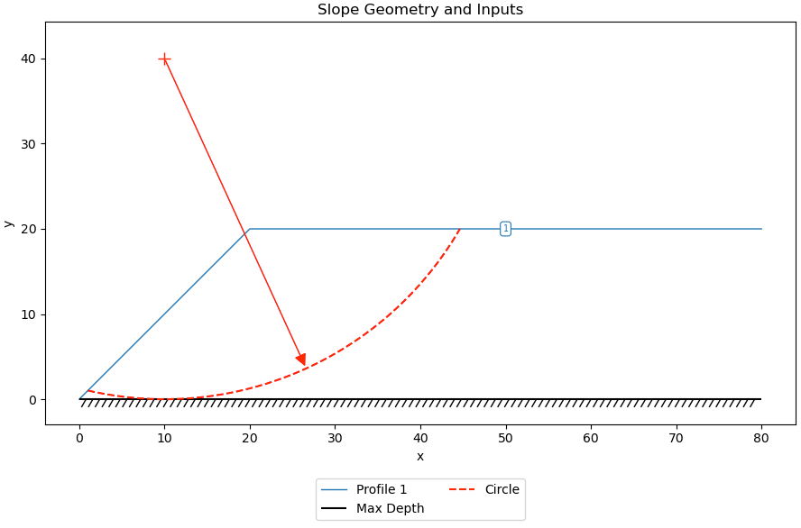

# Sample Problems - Limit Equilibrium Method

The following examples illustrate how to use XSLOPE to perform limit equilibrium slope stability analysis. Each of the Excel input files below can be uploaded and used with the following Google Colab notebook which has been set up specifically for running slope stability analyses:

The notebook allows the user to select a variety of analysis options using simple form inputs and then runs the analysis using the selected method and plots the results.

### 1. Simple Embankment

This problem features a simple slope with a single material. 

{width=800}

Excel input file: [xslope_simple_embankment.xlsx](files/xslope_simple_embankment.xlsx)

Inputs plotted with the XSLOPE plot_inputs() function:

{width=800}

Solution:

{width=800}

Here is copy of the input file with the following variations/changes:

a) Distributed load on top of slope. q = 750 psf 
b) Tension crack. Depth = 3 ft 
c) Submerged by 10 ft depth of water (distributed load)

Excel input file: [xslope_simple_embankment.xlsx](files/xslope_simple_embankment.xlsx)

Inputs:

Solution:

