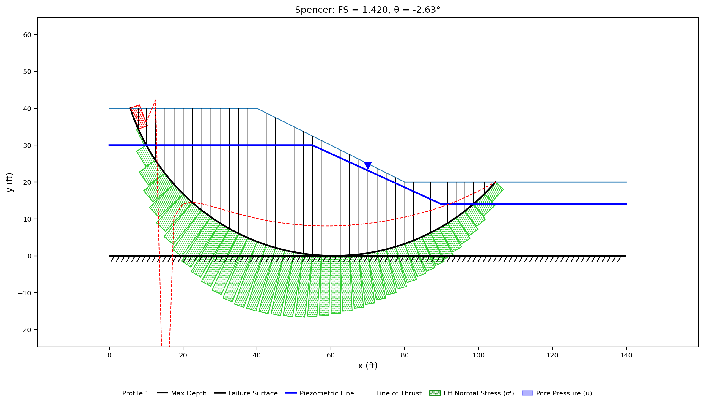
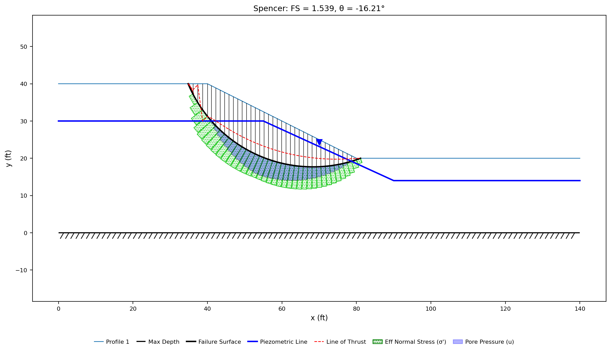
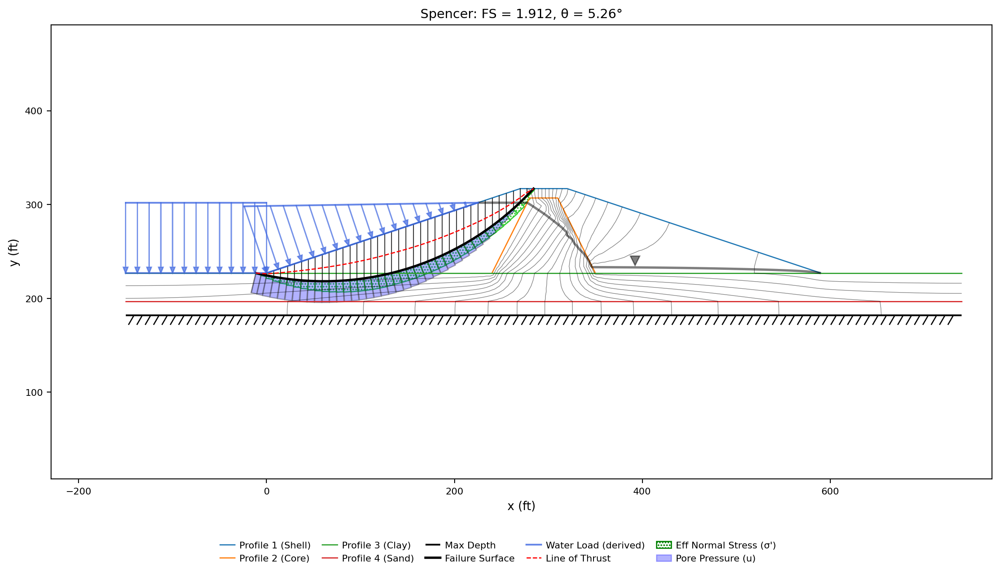
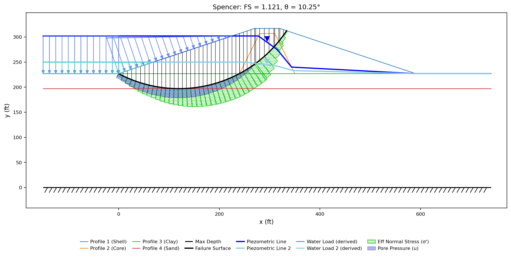
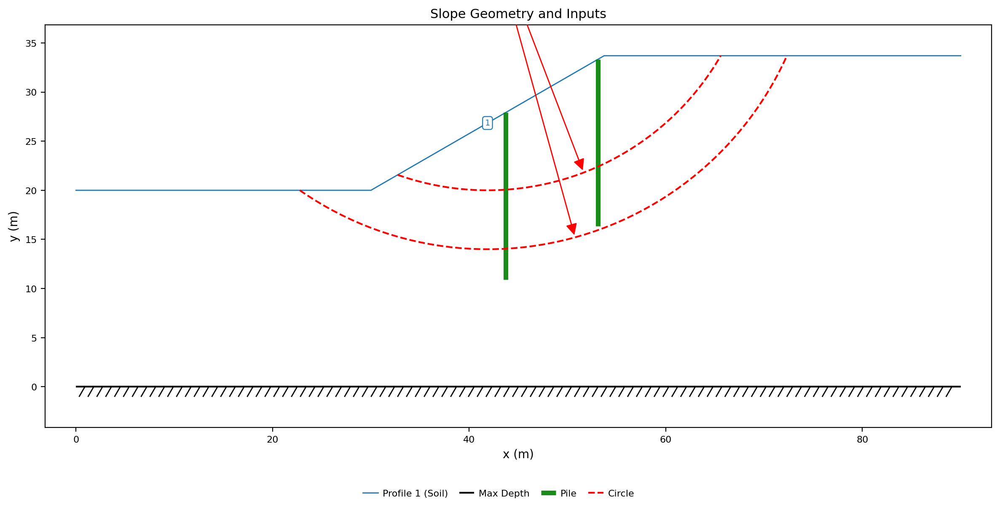
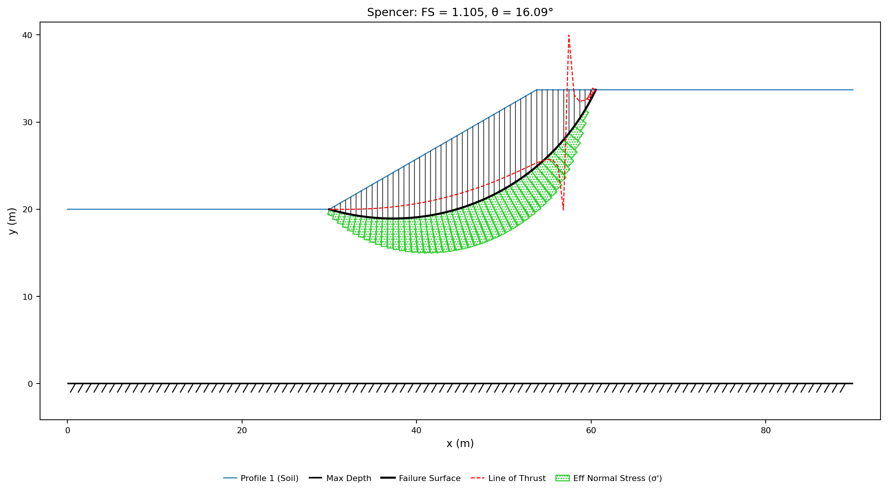
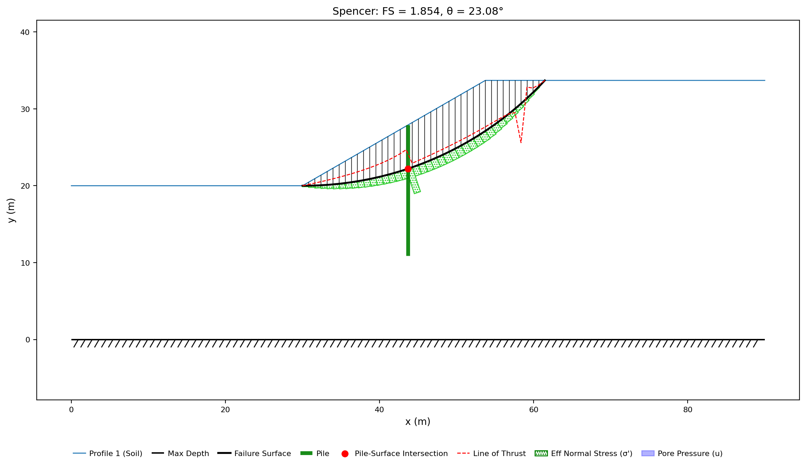
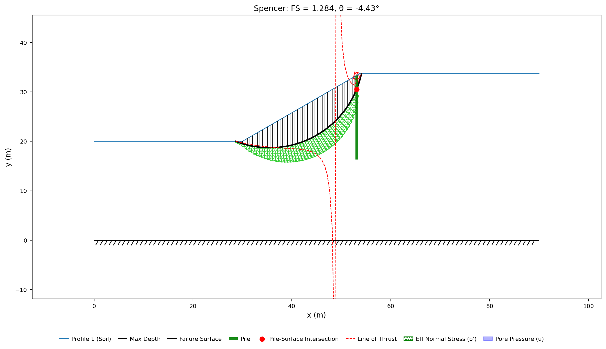

# Sample Problems - Limit Equilibrium Method

> **Verification benchmarks** (ACADS, Arai & Tagyo, and the vendor-manual corpora) are documented in the [Verification and Validation](../verification/index.md) section — see the [Rocscience Slide2](../verification/rocscience.md) and [GeoStudio SLOPE/W](../verification/geostudio.md) corpus pages.


The following examples illustrate how to use XSLOPE to perform limit equilibrium slope stability analysis. Each of the Excel input files below can be uploaded and used with the following Google Colab notebook which has been set up specifically for running slope stability analyses:

<a href="https://colab.research.google.com/github/njones61/xslope/blob/main/notebooks/xslope_lem.ipynb" target="_"></a>

The notebook allows the user to select a variety of analysis options using simple form inputs and then runs the analysis using the selected method and plots the results.

For each problem below, the solution figure shows the critical surface and factor of safety for Spencer's method, and a **Factor of safety by method** table reports the result for every applicable method. On a solution figure, the green bars on the base of each slice are the effective stress there, the red bars are tension, and the red dashed line is the line of thrust computed with Spencer's method. A few things to keep in mind when reading those tables:

- Each value is that method's **own** critical surface — every method runs its own search, so the surfaces (and therefore the factors of safety) are not identical between methods.
- The Ordinary Method of Slices (OMS) and Bishop's method apply only to **circular** surfaces, so they show "—" for non-circular problems.
- The methods differ by how much equilibrium they satisfy: OMS is the most approximate (and usually the most conservative), while Bishop, Janbu (corrected), Spencer, the Corps of Engineers method, and Lowe-Karafiath each enforce more of the force/moment balance. The Corps and Lowe-Karafiath force-equilibrium methods are sensitive to the assumed interslice-force inclination and can fall above the rigorous Spencer value.
- For **purely cohesive** soils ($\phi = 0$), the methods are theoretically identical on any given surface. Small differences in those tables therefore come from each method's search settling on a slightly different critical surface, not from the methods themselves.

### 1. Simple Embankment

Built and run step by step in [LEM-1](../tutorials/lem01_simple_embankment.md).

{width=700}

<!-- fs-table -->
**Factor of safety by method** (each method's own critical surface):

| OMS | Bishop | Janbu | Corps | Lowe | Spencer | M-P |
|---:|---:|---:|---:|---:|---:|---:|
| 1.215 | 1.215 | 1.335 | 1.319 | 1.263 | 1.276 | 1.226 |
<!-- /fs-table -->

<!-- test: file=files/xslope_simple_embankment.xlsx, type=circular_search, num_slices=40, fs_oms=1.215, fs_bishop=1.215, fs_janbu=1.335, fs_corps=1.319, fs_lowe=1.263, fs_spencer=1.276, fs_mprice=1.226 -->

Here is a copy of the model with the following variations/changes:

a) Distributed load on top of slope. q = 750 psf<br>
b) Tension crack. Depth = 3 ft. <br>
c) Tension crack filled with water.<br>
d) Submerged by 10 ft depth of water (distributed load)

Excel input file: [xslope_simple_embankment_mods.xlsx](files/xslope_simple_embankment_mods.xlsx){width=700}

Inputs:

{width=700}

Solution (critical surface and factor of safety):

{width=700}

<!-- fs-table -->
**Factor of safety by method** (each method's own critical surface):

| OMS | Bishop | Janbu | Corps | Lowe | Spencer | M-P |
|---:|---:|---:|---:|---:|---:|---:|
| 0.986 | 0.986 | 0.969 | 1.050 | 1.039 | 0.986 | 0.986 |
<!-- /fs-table -->

<!-- test: file=files/xslope_simple_embankment_mods.xlsx, type=circular_search, num_slices=40, fs_oms=0.986, fs_bishop=0.986, fs_janbu=0.969, fs_corps=1.050, fs_lowe=1.039, fs_spencer=0.986, fs_mprice=0.986 -->

The crest-surcharge variant is built and run step by step in
[LEM-2](../tutorials/lem02_loads_on_the_crest.md).

{width=700}

<!-- fs-table -->
**Factor of safety by method** (each method's own critical surface):

| OMS | Bishop | Janbu | Corps | Lowe | Spencer | M-P |
|---:|---:|---:|---:|---:|---:|---:|
| 0.918 | 0.918 | 0.950 | 0.953 | 0.939 | 0.918 | 0.918 |
<!-- /fs-table -->

<!-- test: file=files/xslope_crest_surcharge.xlsx, type=circular_search, num_slices=40, fs_oms=0.918, fs_bishop=0.918, fs_janbu=0.950, fs_corps=0.953, fs_lowe=0.939, fs_spencer=0.918, fs_mprice=0.918 -->

### 2. Simple Slope with Foundation

This problem involves a uniform material extending below the toe of the slope. 

{width=700}

Excel input file: [xslope_simple_foundation.xlsx](files/xslope_simple_foundation.xlsx) 

Inputs plotted with the XSLOPE plot_inputs() function:

{width=700}

Solution (critical surface and factor of safety):

{width=700}

<!-- fs-table -->
**Factor of safety by method** (each method's own critical surface):

| OMS | Bishop | Janbu | Corps | Lowe | Spencer | M-P |
|---:|---:|---:|---:|---:|---:|---:|
| 0.964 | 0.964 | 1.029 | 1.120 | 1.041 | 0.964 | 0.964 |
<!-- /fs-table -->

<!-- test: file=files/xslope_simple_foundation.xlsx, type=circular_search, num_slices=40, fs_oms=0.964, fs_bishop=0.964, fs_janbu=1.029, fs_corps=1.120, fs_lowe=1.041, fs_spencer=0.964, fs_mprice=0.964 -->

### 3. Simple Slope with Multiple Layers

Built and run step by step in [LEM-3](../tutorials/lem03_layered_slope.md).

{width=900}

<!-- fs-table -->
**Factor of safety by method** (each method's own critical surface):

| OMS | Bishop | Janbu | Corps | Lowe | Spencer | M-P |
|---:|---:|---:|---:|---:|---:|---:|
| 1.244 | 1.244 | 1.314 | 1.326 | 1.285 | 1.244 | 1.244 |
<!-- /fs-table -->

<!-- test: file=files/xslope_simple_mult_layers.xlsx, type=circular_search, num_slices=40, fs_oms=1.244, fs_bishop=1.244, fs_janbu=1.314, fs_corps=1.326, fs_lowe=1.285, fs_spencer=1.244, fs_mprice=1.244 -->

This geometry is reused (with elastic properties added and the strength retuned to a
marginally-stable c–φ profile) for a finite-element **reliability** example — see
[FEM Sample Problems §4](../fem/samples.md).

### 4. Submerged Slope

This problem features a slope submerged by 10 ft of water. 

{width=600}

The submerged slope is analyzed by applying a distributed load over the entire slope based on the unit weight of 
water (62.4 lb/ft3) and the depth of the water at a particular point on the slope. 

Excel input file: [xslope_submerged.xlsx](files/xslope_submerged.xlsx){width=900}

Inputs plotted with the XSLOPE plot_inputs() function:

{width=900}

Solution (critical surface and factor of safety):

{width=900}

<!-- fs-table -->
**Factor of safety by method** (each method's own critical surface):

| OMS | Bishop | Janbu | Corps | Lowe | Spencer | M-P |
|---:|---:|---:|---:|---:|---:|---:|
| 1.154 | 1.154 | 1.248 | 2.011 | 1.861 | 1.154 | 1.154 |
<!-- /fs-table -->

<!-- test: file=files/xslope_submerged.xlsx, type=circular_search, num_slices=40, fs_oms=1.154, fs_bishop=1.154, fs_janbu=1.248, fs_corps=2.011, fs_lowe=1.861, fs_spencer=1.154, fs_mprice=1.154 -->

### 5. Slope with Multiple Materials and Piezometric Line

Built and run step by step in [LEM-4](../tutorials/lem04_water_in_the_slope.md).

This problem is similar to one used in two exercises in a graduate course on slope stability analysis
(CE 544 - Slope Stability Analysis) at Brigham Young University, where limit equilibrium problems are solved
with the method of slices in an Excel spreadsheet. The exercise descriptions are here:

[Ordinary Method of Slices Exercise](https://byu-ce544.readthedocs.io/en/latest/unit2/04_limiteq2/limiteq2_class/)<br>
[Bishop Simplified Procedure Homework](https://byu-ce544.readthedocs.io/en/latest/unit2/04_limiteq2/limiteq2_hw/)

This sample shares the exercises' geometry but carries a different set of material properties, including both
moist and saturated unit weights. In the exercises, a single circular surface was analyzed, which is the surface
solved below with Spencer's method:

{width=900}

<!-- fs-table -->
**Factor of safety by method** (each method on the same specified circle):

| OMS | Bishop | Janbu | Corps | Lowe | Spencer | M-P |
|---:|---:|---:|---:|---:|---:|---:|
| 1.310 | 1.475 | 1.469 | 1.641 | 1.522 | 1.462 | 1.464 |
<!-- /fs-table -->

<!-- test: file=files/xslope_method_slices_problem.xlsx, type=single_circle, num_slices=40, fs_oms=1.310, fs_bishop=1.475, fs_janbu=1.469, fs_corps=1.641, fs_lowe=1.522, fs_spencer=1.462, fs_mprice=1.464 -->

Here is the Excel input file with multiple starting circles for a global search for the critical surface:

Excel input file: [xslope_method_slices_problem2.xlsx](files/xslope_method_slices_problem2.xlsx)

Inputs plotted with the XSLOPE plot_inputs() function:

{width=900}

Search results. This problem is a good example of the search path and the large number of circles that are sometimes 
tested in the search algorithm. The three seeds converge on one mechanism: a deep circle entering the crest at 
x = 121, bottoming out 13 ft into the foundation clay, and exiting on the flat ground at x = 220.

{width=900}

Solution (critical surface and factor of safety):

{width=900}

<!-- fs-table -->
**Factor of safety by method** (each method's own critical surface):

| OMS | Bishop | Janbu | Corps | Lowe | Spencer | M-P |
|---:|---:|---:|---:|---:|---:|---:|
| 1.084 | 1.327 | 1.253 | 1.436 | 1.376 | 1.301 | 1.302 |
<!-- /fs-table -->

<!-- test: file=files/xslope_method_slices_problem2.xlsx, type=circular_search, num_slices=40, fs_oms=1.084, fs_bishop=1.327, fs_janbu=1.253, fs_corps=1.436, fs_lowe=1.376, fs_spencer=1.301, fs_mprice=1.302 -->

### 6. Slope with Eight Layers

This problem features a slope with eight soil layers. This problem was featured in the user manual for the UTEXASED 
slope stability analysis software developed by  at the University of Texas at Austin by Stephen G. Wright. If 
features a series of alternating layers, some of which are analyzed with an effective stress analysis and a 
piezometric line, and some of which are analyzed using a total stress analysis. We will assume that the base (max 
depth) is 10 ft below the top of the bottom material.

{width=900}

In the input file, the slope face rises 20 ft over a 45-ft run (2.25H:1V), and the water
table / piezometric line is horizontal at 2 ft below the toe-level ground surface
(elevation −2, inside the top foundation layer).

To find the critical surface and the global minimum factor of safety, we must use a circle starting at the base of 
each layer. The following Excel input file illustrates the problem.

Excel input file: [xslope_eight_layers.xlsx](files/xslope_eight_layers.xlsx)

Inputs plotted with the XSLOPE plot_inputs() function:

{width=900}

Search results:

{width=900}

Solution (critical surface and factor of safety):

{width=900}

<!-- fs-table -->
**Factor of safety by method** (each method's own critical surface):

| OMS | Bishop | Janbu | Corps | Lowe | Spencer | M-P |
|---:|---:|---:|---:|---:|---:|---:|
| 0.805 | 1.154 | 1.160 | 1.240 | 1.060 | 1.189 | 1.170 |
<!-- /fs-table -->

<!-- test: file=files/xslope_eight_layers.xlsx, type=circular_search, num_slices=40, fs_oms=0.805, fs_bishop=1.154, fs_janbu=1.160, fs_corps=1.240, fs_lowe=1.060, fs_spencer=1.189, fs_mprice=1.170 -->

### 7. Non-Circular Failure Surface

Built and run step by step in [LEM-5](../tutorials/lem05_weak_layer_noncircular.md).

{width=900}

<!-- fs-table -->
**Factor of safety by method** (each method's own critical surface):

| OMS | Bishop | Janbu | Corps | Lowe | Spencer | M-P |
|:---:|:---:|:---:|:---:|:---:|:---:|:---:|
| — | — | 1.575 | 1.523 | 1.321 | 1.656 | 1.634 |
<!-- /fs-table -->

<!-- test: file=files/xslope_noncircular.xlsx, type=noncircular_search, num_slices=40, fs_janbu=1.575, fs_corps=1.523, fs_lowe=1.321, fs_spencer=1.656, fs_mprice=1.634 -->

### 8. Earth Dam 

This problem features a dam with a shell and a clay core on top of a foundation with a clay layer and a sand layer. 
This problem was featured on page 121 of Shear Strength and Slope Stability - Second Edition by Duncan, Wright, and 
Brandon. 

{width=700}

The material properties are as follows:

|  Mat   | c' (psf) | $\phi$' (degrees) | γ (pcf) |
|:------:|:--------:|:-----------------:|:-------:|
| Shell  |    0     |        34         |   125   |
|  Core  |   100    |        26         |   122   |
|  Clay  |    0     |        24         |   123   |
|  Sand  |    0     |        32         |   127   |

**Upstream side of the dam**

First, we will analyze the upstream side. This is accomplished by defining starting circles on the upstream side of the 
dam. The following Excel input file illustrates the problem.

Excel input file: [xslope_earth_dam_up.xlsx](files/xslope_earth_dam_up.xlsx)

Inputs plotted with the XSLOPE plot_inputs() function:

{width=900}

Search results:

{width=900}

Solution (critical surface and factor of safety):

{width=900}

<!-- fs-table -->
**Factor of safety by method** (each method's own critical surface):

| OMS | Bishop | Janbu | Corps | Lowe | Spencer | M-P |
|---:|---:|---:|---:|---:|---:|---:|
| n/a\* | 1.815 | 1.736 | 2.072 | 2.018 | 1.800 | 1.795 |

\* OMS is not reported for this problem. Its base normal force is the Fellenius value $W\cos\alpha + D\cos(\alpha-\beta) - u\,\Delta\ell$, which under a full reservoir goes negative on the deepest slices — a quarter of them on the surface it settles on here — so the shear resistance it computes there is meaningless and the factor of safety it reports (0.886) sits far below every other method's. See the [OMS method note](oms.md).
<!-- /fs-table -->

<!-- test: file=files/xslope_earth_dam_up.xlsx, type=circular_search, num_slices=40, fs_bishop=1.815, fs_janbu=1.736, fs_corps=2.072, fs_lowe=2.018, fs_spencer=1.800, fs_mprice=1.795 -->

**Downstream side of the dam**

Next, we will analyze the other side of the dam by defining starting circles on the downstream 
side of the dam. 

Excel input file: [xslope_earth_dam_down.xlsx](files/xslope_earth_dam_down.xlsx)

Inputs plotted with the XSLOPE plot_inputs() function:

{width=900}

Search results:

{width=900}

Solution (critical surface and factor of safety):

{width=900}

<!-- fs-table -->
**Factor of safety by method** (each method's own critical surface):

| OMS | Bishop | Janbu | Corps | Lowe | Spencer | M-P |
|---:|---:|---:|---:|---:|---:|---:|
| 1.386 | 1.561 | 1.470 | 1.595 | 1.568 | 1.558 | 1.559 |
<!-- /fs-table -->

<!-- test: file=files/xslope_earth_dam_down.xlsx, type=circular_search, num_slices=40, fs_oms=1.386, fs_bishop=1.561, fs_janbu=1.470, fs_corps=1.595, fs_lowe=1.568, fs_spencer=1.558, fs_mprice=1.559 -->

### 9. Reinforced Slope

Built and run step by step in [LEM-8](../tutorials/lem08_reinforced_slope.md).

{width=900}

<!-- fs-table -->
**Factor of safety by method** (each method's own critical surface):

| OMS | Bishop | Janbu | Corps | Lowe | Spencer | M-P |
|---:|---:|---:|---:|---:|---:|---:|
| 1.480 | 1.594 | 1.524 | 1.608 | 1.598 | 1.587 | 1.587 |
<!-- /fs-table -->

<!-- test: file=files/xslope_reinforce.xlsx, type=circular_search, num_slices=40, fs_oms=1.480, fs_bishop=1.594, fs_janbu=1.524, fs_corps=1.608, fs_lowe=1.598, fs_spencer=1.587, fs_mprice=1.587 -->

!!! note
    This problem is UTEXASED's Example 5 (Wright), whose reported solution is FS = 1.646 (Spencer) on a critical
    circle centered at (3.2, 42.0) with R = 43.4. XSLOPE's Spencer solution **on that same circle is FS = 1.646**
    — the two programs' reinforcement mechanics agree (with either the Tangent or Axial direction setting; the
    geogrid crossings on this deep circle occur where the slip surface is nearly parallel to the horizontal
    reinforcement, so the two directions differ by less than 0.1% here). The lower value in the table above arises
    because XSLOPE's automated search finds a **shallower critical surface** (center near (−5, 47), FS = 1.587)
    in a region UTEXASED's tangent-line grid search modes did not explore. UTEXASED's own example documentation
    notes that this model's thin cohesive face layer was added specifically to discourage shallow face surfaces —
    the shallower minimum is a real feature of the model, not a solver disagreement.

A mirrored (right-facing) variant of this model, with the reinforcement set to Type = Nail (Axial direction,
Passive application), is included as a regression guard on the v12 support mechanics: every method must return
the same factor of safety on the mirrored geometry as on the original for each Dir/Appl combination, and the
values below pin the axial + passive path on a right-facing slope.

<!-- test: file=files/xslope_reinforce_rface.xlsx, type=circular_search, num_slices=40, fs_oms=1.282, fs_bishop=1.475, fs_janbu=1.420, fs_spencer=1.471, fs_corps=1.485, fs_lowe=1.477, fs_mprice=1.471 -->
<!-- test: file=files/xslope_reinforce_rface.xlsx, type=mp_spencer -->
<!-- test: file=files/xslope_reinforce_rface.xlsx, type=roundtrip -->

### 10. Slope Stabilized with Piles

Built and run step by step in [LEM-12](../tutorials/lem12_piles.md).

{width=900}

#### Ito & Matsui Summary

The pile force $H$ is not specified directly in the input file. Instead, XSLOPE auto-computes $H$ using the
[Ito & Matsui (1975)](https://doi.org/10.3208/sandf1972.15.4_43) method, which models the plastic flow of soil between adjacent piles to determine the lateral
resistance. Because $H$ is computed for each trial failure surface during the search, the pile resistance varies
with the depth of the failure surface at the pile location.

Structural capacity limits ($V_{\text{cap}}$ = 46,000 lb, $M_{\text{cap}}$ = 60,000 ft·lb) are specified for
each pile, consistent with a 2-ft diameter reinforced concrete section ($f'_c$ = 4000 psi). For the critical
failure surface, the Ito & Matsui soil forces far exceed the structural capacity, and the moment capacity
controls:

```text
  === Ito & Matsui Summary (pile) ===
  Pile diameter (D)          = 2.0
  Pile spacing (S)           = 6.0
  Clear spacing (D1 = S - D) = 4.0
  Depth to failure surface   = 10.1
  Coefficients: A1 = 7.569, A2 = 4.755
  Force per pile (F_pile)    = 44178
  Force per unit width (H)   = 7363.0
  --- Structural Capacity Check ---
  V_cap = 46000  (F_pile within shear capacity)
  M_cap = 60000, L_m = 3.94, F_limit = M_cap/L_m = 15244  (F_pile exceeds moment capacity)
  Controlled by moment (M_cap/L_m)
  F_pile: 44178 -> 15244 (capped)
  H:      7363.0 -> 2540.7 (capped)
  === Ito & Matsui Summary (pile) ===
  Pile diameter (D)          = 2.0
  Pile spacing (S)           = 6.0
  Clear spacing (D1 = S - D) = 4.0
  Depth to failure surface   = 14.5
  Coefficients: A1 = 7.569, A2 = 4.755
  Force per pile (F_pile)    = 81729
  Force per unit width (H)   = 13621.5
  --- Structural Capacity Check ---
  V_cap = 46000  (F_pile exceeds shear capacity)
  M_cap = 60000, L_m = 5.47, F_limit = M_cap/L_m = 10962  (F_pile exceeds moment capacity)
  Controlled by moment (M_cap/L_m)
  F_pile: 81729 -> 10962 (capped)
  H:      13621.5 -> 1827.0 (capped)
```

The Ito & Matsui soil forces (44,178 and 81,729 lb per pile) represent the theoretical upper bound on what the soil
can push onto the pile. These greatly exceed the moment capacity, and the deeper pile exceeds the shear capacity as
well. After capping, the effective pile forces are reduced by 65% and 87% respectively, with the moment capacity
($M_{\text{cap}} / L_m$) controlling in both cases. Without the capacity checks, the LEM would overestimate the pile resistance and produce an
unconservatively high factor of safety.

#### LEM vs. FEM Comparison

The same model solved with the finite element engine (see
[Tutorial FEM-3](../tutorials/fem03_piles.md)) reads FS = 1.363 with the
piles and 1.137 without them, where Spencer reads 1.842 with them and 1.149 without. The two engines
credit the same row by factors of 1.20 and 1.60. That gap is an idealization, not a numerical difference:
a plane-strain finite element model has no space between the piles, so it represents the row as a
continuous wall carrying one pile's stiffness smeared over the spacing, while the Ito & Matsui force is
a theory of the soil flowing between them. For a discrete row at spacing the limit equilibrium result is the applicable one,
and the finite element run is read for the pile's internal forces rather than for its factor of safety —
see [LEM vs. FEM Pile Modeling](piles.md#lem-vs-fem-pile-modeling).

<!-- fs-table -->
**Factor of safety by method** (each method's own critical surface):

| OMS | Bishop | Janbu | Corps | Lowe | Spencer | M-P |
|---:|---:|---:|---:|---:|---:|---:|
| 1.617 | 1.852 | 1.648 | 1.884 | 1.978 | 1.842 | 1.843 |
<!-- /fs-table -->

<!-- test: file=files/xslope_piles.xlsx, type=circular_search, num_slices=40, fs_oms=1.617, fs_bishop=1.852, fs_janbu=1.648, fs_corps=1.884, fs_lowe=1.978, fs_spencer=1.842, fs_mprice=1.843 -->

### 11. Polygon Input with a Sloping Bottom

Built and run step by step in [LEM-6](../tutorials/lem06_polygon_geometry.md).

{width=900}

<!-- fs-table -->
**Factor of safety by method** (each method's own critical surface):

| OMS | Bishop | Janbu | Corps | Lowe | Spencer | M-P |
|---:|---:|---:|---:|---:|---:|---:|
| 1.244 | 1.244 | 1.314 | 1.326 | 1.285 | 1.244 | 1.244 |
<!-- /fs-table -->

<!-- test: file=files/xslope_sloping_bottom.xlsx, type=circular_search, num_slices=40, fs_oms=1.244, fs_bishop=1.244, fs_janbu=1.314, fs_corps=1.326, fs_lowe=1.285, fs_spencer=1.244, fs_mprice=1.244 -->

---

The remaining problems are **verification benchmarks**: published cases used to
validate the limit-equilibrium implementation. Each is locked into the
automated regression suite. See also the [Verification](../verification/index.md) page.

### 12. Rapid Drawdown (Johnson Reservoir Dam)

Built and run step by step in [COMBO-2](../tutorials/combo02_rapid_drawdown.md).

{width=900}

<!-- fs-table -->
**Factor of safety by method** (each method's own critical surface):

| OMS | Bishop | Janbu | Corps | Lowe | Spencer | M-P |
|---:|---:|---:|---:|---:|---:|---:|
| 1.247 | 1.439 | 1.366 | 1.719 | 1.548 | 1.498 | 1.510 |
<!-- /fs-table -->

<!-- test: file=files/xslope_johnson_rapid_KEY.xlsx, type=single_circle, rapid=true, num_slices=40, fs_oms=1.247, fs_bishop=1.439, fs_janbu=1.366, fs_corps=1.719, fs_lowe=1.548, fs_spencer=1.498, fs_mprice=1.510 -->

### 13. Multiple Local Minima

Built and run step by step in [LEM-10](../tutorials/lem10_global_minimum.md).

Degenerate infinite-slope search — seeded from the generated embankment circles, the
search collapses to a near-planar sliver near the crest (critical circle in red,
$FS \approx 1.30$):

{width=900}

Global minimum — the deep foundation failure found from a circle tangent to the
limiting depth (Spencer's method). All methods are evaluated on this same deep
circle:

{width=900}

**Single-seed searches can trap on problems with concentrated forces.** The
pile-stabilized sample ([Problem 10](#10-slope-stabilized-with-piles)) is a measured
example: seeded from its circles sheet, the search converges to the deep surface
tabulated there (Spencer 1.842, Lowe 1.978), but the grid-seeded global search
(`seed='grid'`, which sweeps a coarse grid of centers and tangent depths before
refining) finds a *shallower* surface at $FS \approx 1.70$ for every
complete-equilibrium method — the pile forces make the deep basin locally
attractive while a shallower mechanism governs. Checking that a stabilized slope
cannot fail *around* its piles on a shallower surface is part of pile design.

A grid sweep also reaches circles no single-seed search visits, and on some of
them the **force-equilibrium** closure carries no root that describes a body of
soil. On the eight-layer slope it finds one such circle: the closure's ten roots
there run from 0.12 to 2.55 while Bishop, Spencer and Morgenstern-Price all read
about 9.1 on the identical slices, so Corps of Engineers refuses the surface and
says why rather than reporting the 0.12 (see
[Force Equilibrium Methods](force_eq.md#solving-for-the-factor-of-safety)). The
factor of safety the grid-seeded Corps search reports on that model is 1.240, the
same answer its single-seed search gives.

The tabulated sample values remain single-seed by deliberate choice, and the
working practice is this: run the free search, then cross-check with `seed='grid'`
and with tangent-seeded circles at each candidate depth, and judge the surfaces —
not just the numbers — before accepting any of them.

<!-- fs-table -->
**Factor of safety by method** (each method's own critical surface):

| OMS | Bishop | Janbu | Corps | Lowe | Spencer | M-P |
|---:|---:|---:|---:|---:|---:|---:|
| 1.354 | 1.434 | 1.417 | 1.719 | 1.524 | 1.426 | 1.431 |
<!-- /fs-table -->

<!-- test: file=files/xslope_mult_min_KEY.xlsx, type=single_circle, num_slices=40, fs_oms=1.354, fs_bishop=1.434, fs_janbu=1.417, fs_corps=1.719, fs_lowe=1.524, fs_spencer=1.426, fs_mprice=1.431 -->

### 14. Tension Crack

A slope whose upper layer has cohesion, so an unmodified analysis produces
non-physical **tension at the crest** (and an inverted line of thrust) that
unconservatively raises the factor of safety. The remedy is a **tension crack** at
the top of the slope, whose depth follows
$d_{crack} = \dfrac{2 c_d}{\gamma}\tan\!\left(45 + \dfrac{\phi_d}{2}\right)$ with the
mobilized strengths $c_d = c/F$, $\tan\phi_d = \tan\phi / F$. Because the crack
depth depends on $F$, it is iterated to convergence; this model carries the
converged depth (`tcrack_depth` = 4.5 ft on the **main** sheet), at which the crest
tension just vanishes. The complete-equilibrium methods agree (Spencer and
Morgenstern-Price both 1.414, matching Bishop).

Excel input file: [xslope_tension_KEY.xlsx](files/xslope_tension_KEY.xlsx)

Inputs plotted with the XSLOPE plot_inputs() function:

{width=900}

Solution (critical surface with the tension crack, Spencer's method):

{width=900}

<!-- fs-table -->
**Factor of safety by method** (each method's own critical surface):

| OMS | Bishop | Janbu | Corps | Lowe | Spencer | M-P |
|---:|---:|---:|---:|---:|---:|---:|
| 1.413 | 1.414 | 1.448 | 1.673 | 1.544 | 1.414 | 1.414 |
<!-- /fs-table -->

<!-- test: file=files/xslope_tension_KEY.xlsx, type=circular_search, num_slices=40, fs_oms=1.413, fs_bishop=1.414, fs_janbu=1.448, fs_corps=1.673, fs_lowe=1.544, fs_spencer=1.414, fs_mprice=1.414 -->

### 15. Reliability Analysis (Submerged Slope)

Built and run step by step in [LEM-11](../tutorials/lem11_reliability.md).

Reliability result — the $F_{MLV}$ critical surface (Spencer's method) with the
analysis summary:

{width=900}

| $F_{MLV}$ | $\sigma_F$ | $COV_F$ | $\beta_{LN}$ | Reliability $R$ | $P_f$ |
|---:|---:|---:|---:|---:|---:|
| 1.354 | 0.389 | 28.7% | 0.935 | 82.5% | 17.5% |

<!-- test: file=files/xslope_prob_submerged_KEY.xlsx, type=reliability, method=spencer, expected_beta=0.935, tolerance=0.03 -->
<!-- test: file=files/xslope_prob_submerged_KEY.xlsx, type=reliability_mc, method=spencer, search=true, n_samples=10000, converge_rel=0.10, expected_beta=0.979, tolerance=0.02, expected_pf=0.165, pf_tol=0.02 -->
<!-- test: file=files/xslope_prob_submerged_KEY.xlsx, type=reliability_rs, method=spencer, search=true, n_surrogate=10000000, expected_beta=0.997, tolerance=0.01, expected_pf=0.1657, pf_tol=0.005 -->

### 16. Saturated vs. Moist Unit Weight (γ_sat)

Soil below the water table weighs more than the same soil above it. On the **mat**
sheet, `gamma` is the moist unit weight and `gamma_sat` the saturated unit weight;
when a material carries both, the water table splits each slice's weight — γ_sat
below the water table, γ above it. The water table comes from whichever the model
defines: a piezometric line on the **piezo** sheet, or the phreatic surface of a
finite-element seepage solution. It belongs to the problem rather than to any one
material, so it splits the weight whether or not the material's pore-pressure
option also reads pore pressures from it.

This problem features a slope in undrained clay ($S_u = 600$ psf, $\phi = 0$) with
an internal water table: γ = 120 pcf above the water table and γ_sat = 127 pcf
below. The strength is a total-stress strength, so pore pressure never enters the
analysis (`u = none`) and the piezometric line serves only to locate the water
table. Spencer's method gives $F = 1.420$.

Excel input file: [xslope_gsat_sidecar.xlsx](files/xslope_gsat_sidecar.xlsx)

Solution (critical surface and factor of safety, Spencer's method):

{width=900}

<!-- test: file=files/xslope_gsat_sidecar.xlsx, type=circular_search, num_slices=40, fs_bishop=1.420, fs_spencer=1.420, fs_janbu=1.518 -->

The same slope built as two material zones split at the water table — 120 pcf clay
above, 127 pcf clay below — reproduces that factor of safety:
[xslope_gsat_zoned.xlsx](files/xslope_gsat_zoned.xlsx).

<!-- test: file=files/xslope_gsat_zoned.xlsx, type=gsat_pair, file2=files/xslope_gsat_sidecar.xlsx -->
<!-- test: file=files/xslope_gsat_zoned.xlsx, type=circular_search, num_slices=40, fs_spencer=1.420 -->

A model can also supply γ_sat with no water table anywhere
([xslope_gsat_nowater.xlsx](files/xslope_gsat_nowater.xlsx)); with no elevation
below which the saturated weight applies, the slope is analyzed with γ throughout.

<!-- test: file=files/xslope_gsat_nowater.xlsx, type=circular_search, num_slices=40, fs_bishop=1.468, fs_spencer=1.468, fs_janbu=1.565 -->

The same slope and water table with a drained strength ($c' = 200$ psf,
$\phi' = 25°$) and `u = piezo`: the piezometric line now supplies the pore
pressures as well as the unit-weight split.

Excel input file: [xslope_gsat_piezo.xlsx](files/xslope_gsat_piezo.xlsx)

Solution (critical surface and factor of safety, Spencer's method):

{width=900}

<!-- test: file=files/xslope_gsat_piezo.xlsx, type=circular_search, num_slices=40, fs_bishop=1.538, fs_spencer=1.539, fs_janbu=1.503 -->

The water table can also come from a seepage solution. This is the upstream slope
of the earth dam of [Problem 8](#8-earth-dam) with a saturated unit weight for each
zone and `u = seep`: pore pressures are interpolated from the finite-element
seepage solution, and the phreatic surface of that same solution — the heavy
contour carrying the water-table marker in the figure below — is the water table
that splits the weights. When a model carries both a seepage solution and a
piezometric line, the seepage solution sets the split.

Excel input file: [xslope_gsat_seep.xlsx](files/xslope_gsat_seep.xlsx) (the seepage
mesh and solution are bundled alongside it).

Solution (critical surface and factor of safety, with the seepage head contours):

{width=900}

<!-- test: file=files/xslope_gsat_seep.xlsx, type=circular_search, num_slices=40, fs_bishop=1.933, fs_spencer=1.912 -->

The same dam analyzed for [rapid drawdown](rapid.md), with the reservoir at
El. 302 ft before drawdown and El. 250 ft after. The premise of *rapid* drawdown is
that the pool falls faster than the low-permeability zones can drain, so the soil
stays saturated while the pore pressures fall: slice weights key off the
pre-drawdown water table through all three stages, while the pore pressures follow
the staged piezometric lines.

Excel input file: [xslope_gsat_rapid.xlsx](files/xslope_gsat_rapid.xlsx)

Solution (governing rapid-drawdown surface and factor of safety):

{width=900}

<!-- test: file=files/xslope_gsat_rapid.xlsx, type=circular_search, num_slices=40, rapid=true, fs_bishop=1.120, fs_spencer=1.121 -->

### 17. Pile-Stabilized Slope (Hassiotis et al. 1997)

A published pile-stabilization benchmark, and the check that XSLOPE's built-in
Ito & Matsui force reproduces the force the source designed with. The slope is
homogeneous, 13.7 m high at 30°, with $c = 23.94$ kPa, $\phi = 10°$ and
$\gamma = 19.63$ kN/m³, and is dry. One row of 1.0 m piles at 2.5 m centres is
placed 13.7 m horizontally from the toe, and in a second case 23.1 m from the toe.
The published clear-to-centre spacing ratio $D_2/D_1 = 0.6$ is reproduced exactly:
a 1.0 m pile at 2.5 m centres leaves a 1.5 m clear opening, and $1.5/2.5 = 0.6$.

Inputs, with both pile stations drawn together:

{width=900}

Excel input files:
[xslope_hassiotis.xlsx](files/xslope_hassiotis.xlsx) (unreinforced),
[xslope_hassiotis_p1.xlsx](files/xslope_hassiotis_p1.xlsx) (row 13.7 m from the toe),
[xslope_hassiotis_p2.xlsx](files/xslope_hassiotis_p2.xlsx) (row 23.1 m from the toe).

| Property | Value |
|----------|-------|
| Slope height, $H$ | 13.7 m |
| Slope angle, $\beta$ | 30 degrees |
| Cohesion, $c$ | 23.94 kPa |
| Friction angle, $\phi$ | 10 degrees |
| Unit weight, $\gamma$ | 19.63 kN/m³ |
| Pile diameter, $D$ | 1.0 m |
| Pile spacing, $S$ | 2.5 m |
| Pile length, $L$ | 17 m |
| $V_{\text{cap}}$, $M_{\text{cap}}$ | not specified |

The piles carry no structural capacity limits. The source specifies none, and its
factors of safety are the full soil force, so a cap would change the quantity
being compared. $H$ is left blank, so the Ito & Matsui force is computed for every
trial surface from $D$, $S$ and the soil above that surface at the pile.

#### Unreinforced (FS = 1.105)

{width=900}

Bishop's method gives 1.106 against the 1.12 Hull & Poulos (1999) report with the
same method (−1.2%). Hassiotis et al. report 1.08 and Ausilio et al. (2001) 1.11,
both by the friction-circle method, which XSLOPE does not implement.

<!-- test: file=files/xslope_hassiotis.xlsx, type=circular_search, num_slices=50, fs_oms=1.056, fs_bishop=1.106, fs_janbu=1.105, fs_corps=1.167, fs_lowe=1.135, fs_spencer=1.105, fs_mprice=1.104, benchmark=LEM-HASSIOTIS -->

#### Pile row 13.7 m from the toe (FS = 1.855)

{width=900}

Bishop's method gives 1.859 against 1.82 (Hassiotis et al., friction circle, +2.1%).
The row raises the factor of safety by 68%.

#### Pile row 23.1 m from the toe (FS = 1.284)

{width=900}

Bishop's method gives 1.289 against 1.64 (Hassiotis et al., −21%). The row sits
0.6 m short of the crest, so every surface that reaches it crosses it within a few
metres of the pile head, where the soil column above the surface — and with it the
Ito & Matsui force — is small. Moving the entry limit 2 m further behind the crest
moves this factor of safety to 1.48, so the number is a reading of where the search
is allowed to start rather than a converged property of the slope.

#### Search limits

Both pile files declare a search window on their circles sheet: the surface
daylights within a few metres of the toe (exit 25–32 m), enters behind the crest
(entry 54–75 m) and keeps its lowest point above the pile tip. Without it the
search returns a deep surface that passes *below* the pile tip and collects no pile
force at all — 1.327 for the 13.7 m row, which is the unreinforced slope's
next-deepest mechanism rather than a pile-stabilized one. The published
comparisons are for the mechanism through the row and restrict the search the same
way.

#### Ito & Matsui summary

On the critical surface for the 13.7 m row, the surface crosses the pile 5.72 m
below its head. At $D = 1.0$, $S = 2.5$ and $\phi = 10°$ the coefficients are
$A_1 = 3.2298$ and $A_2 = 1.5695$, giving a pressure of 77.3 kN/m at the head
rising to 253.4 kN/m at the surface, a force of 945.4 kN **per pile**, and

$$H = \frac{F_{\text{pile}}}{S} = \frac{945.4}{2.5} = 378.2 \ \text{kN/m of slope}$$

which is the per-unit-width value the slice equations apply, horizontally, at the
pile–surface intersection.

The same coefficients reproduce the force the source designed with. Hassiotis et
al. state 72.4 kN/m at the pile head and a 561.7 kN/m overburden term at 17 m
depth; XSLOPE's $c\,A_1 = 77.3$ kN/m (+6.8%) and $\gamma A_2 \cdot 17 = 523.8$ kN/m
(−6.7%). The two departures are in opposite directions and largely cancel in the
integral: over the published 6.56 m depth to the slip surface, the published
trapezoid gives 1185.7 kN per pile and XSLOPE's exact integration of the same law
gives 1170.2 kN, a difference of 1.3%.

#### Force direction

XSLOPE applies the pile reaction horizontally for a vertical pile and does not
divide it by the computed factor of safety (`Appl = active`). Hull & Poulos note
that the plastic-deformation theory derives the force horizontally, which is the
direction used here; Hassiotis et al. apply it parallel to the slip surface and
also leave it unfactored, which is why their 1.82 is the value this case is read
against. Their 1.45 comes from a boundary-element shear and moment divided by the
global factor of safety — a different force model, quoted here as the published
spread rather than as a target.

<!-- fs-table -->
**Factor of safety by method** (each method's own critical surface, 13.7 m row):

| OMS | Bishop | Janbu | Corps | Lowe | Spencer | M-P |
|---:|---:|---:|---:|---:|---:|---:|
| 1.822 | 1.859 | 1.788 | 1.885 | 1.871 | 1.855 | 1.855 |
<!-- /fs-table -->

<!-- test: file=files/xslope_hassiotis_p1.xlsx, type=circular_search, num_slices=50, entry_range=54.0;75.0, exit_range=25.0;32.0, tangent_depth=11.01;33.7, fs_oms=1.822, fs_bishop=1.859, fs_janbu=1.788, fs_corps=1.885, fs_lowe=1.871, fs_spencer=1.855, fs_mprice=1.855, benchmark=LEM-HASSIOTIS -->
<!-- test: file=files/xslope_hassiotis_p2.xlsx, type=circular_search, num_slices=50, entry_range=54.0;75.0, exit_range=25.0;32.0, tangent_depth=16.44;33.7, fs_oms=1.244, fs_bishop=1.289, fs_janbu=1.373, fs_corps=1.385, fs_lowe=1.340, fs_spencer=1.284, fs_mprice=1.289, benchmark=LEM-HASSIOTIS -->
