# Sample Problems - Limit Equilibrium Method

The following examples illustrate how to use XSLOPE to perform limit equilibrium slope stability analysis. Each of the Excel input files below can be uploaded and used with the following Google Colab notebook which has been set up specifically for running slope stability analyses:

<a href="https://colab.research.google.com/github/njones61/xslope/blob/main/notebooks/xslope_lem.ipynb" target="_"></a>

The notebook allows the user to select a variety of analysis options using simple form inputs and then runs the analysis using the selected method and plots the results.

For each problem below, the solution figure shows the critical surface and factor of safety for Spencer's method, and a **Factor of safety by method** table reports the result for every applicable method. A few things to keep in mind when reading those tables:

- Each value is that method's **own** critical surface — every method runs its own search, so the surfaces (and therefore the factors of safety) are not identical between methods.
- The Ordinary Method of Slices (OMS) and Bishop's method apply only to **circular** surfaces, so they show "—" for non-circular problems.
- The methods differ by how much equilibrium they satisfy: OMS is the most approximate (and usually the most conservative), while Bishop, Janbu (corrected), Spencer, the Corps of Engineers method, and Lowe-Karafiath each enforce more of the force/moment balance. The Corps and Lowe-Karafiath force-equilibrium methods are sensitive to the assumed interslice-force inclination and can fall above the rigorous Spencer value.
- For **purely cohesive** soils ($\phi = 0$), the methods are theoretically identical on any given surface. Small differences in those tables therefore come from each method's search settling on a slightly different critical surface, not from the methods themselves.

### 1. Simple Embankment

This problem features a simple slope with a single material. 

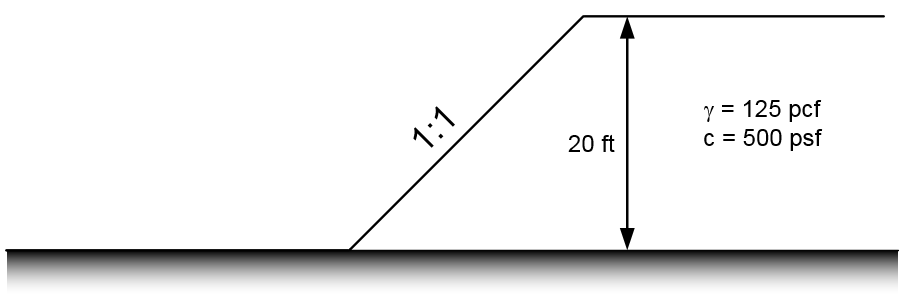{width=700}

Excel input file: [xslope_simple_embankment.xlsx](files/xslope_simple_embankment.xlsx)

Inputs plotted with the XSLOPE plot_inputs() function:

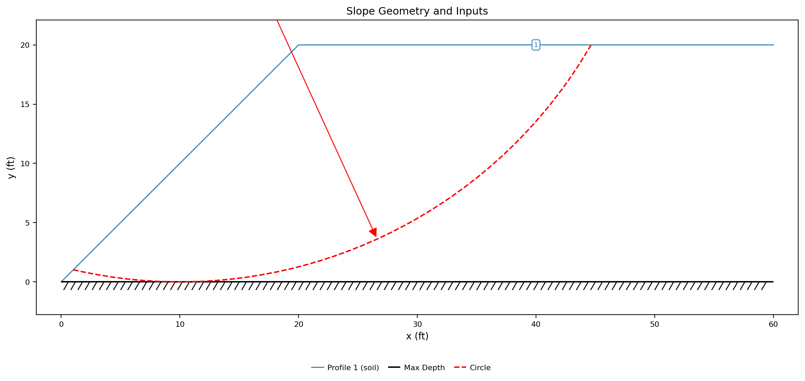

Solution (critical surface and factor of safety). The green bars on the base of each slice represent the effective 
stress on the base of the slice. The red bars correspond to tension at the base of the slice. The red dashed line 
represents the line of thrust computed using Spencer's method.

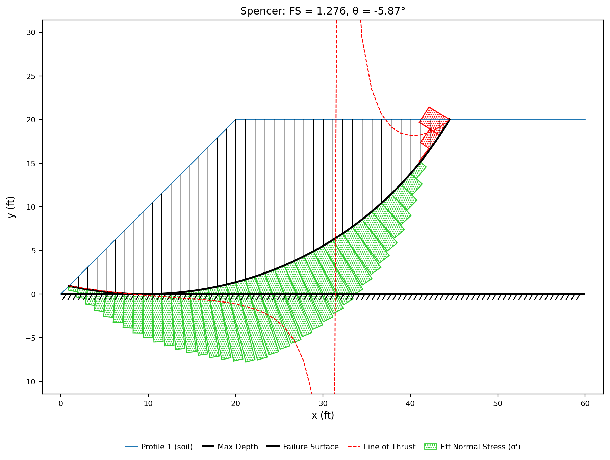{width=700}

<!-- fs-table -->
**Factor of safety by method** (each method's own critical surface):

| OMS | Bishop | Janbu | Corps | Lowe | Spencer | M-P |
|---:|---:|---:|---:|---:|---:|---:|
| 1.215 | 1.215 | 1.335 | 1.319 | 1.263 | 1.276 | 1.260 |
<!-- /fs-table -->

<!-- test: file=files/xslope_simple_embankment.xlsx, type=circular_search, num_slices=40, fs_oms=1.215, fs_bishop=1.215, fs_janbu=1.335, fs_corps=1.319, fs_lowe=1.263, fs_spencer=1.276, fs_mprice=1.260 -->

Here is copy of the input file with the following variations/changes:

a) Distributed load on top of slope. q = 750 psf<br>
b) Tension crack. Depth = 3 ft. <br>
c) Tension crack filled with water.<br>
d) Submerged by 10 ft depth of water (distributed load)

Excel input file: [xslope_simple_embankment_mods.xlsx](files/xslope_simple_embankment_mods.xlsx){width=700}

Inputs:

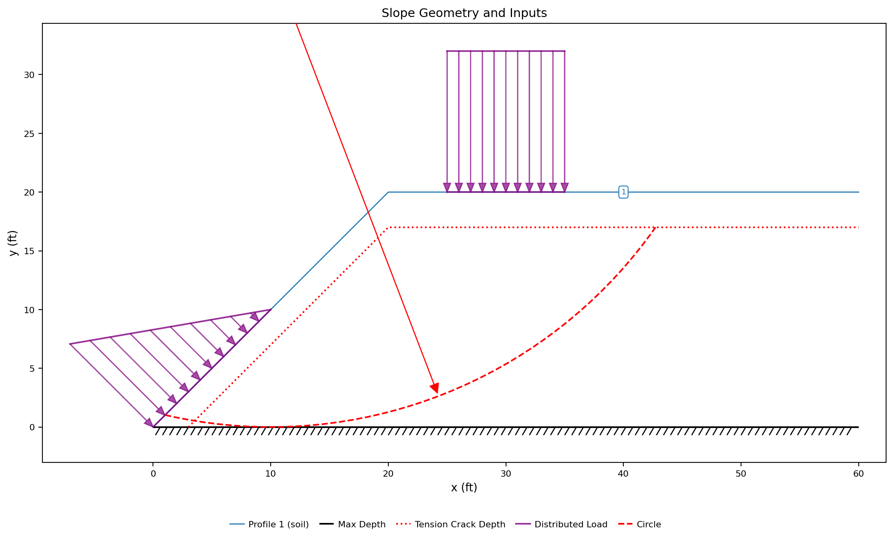{width=700}

Solution (critical surface and factor of safety):

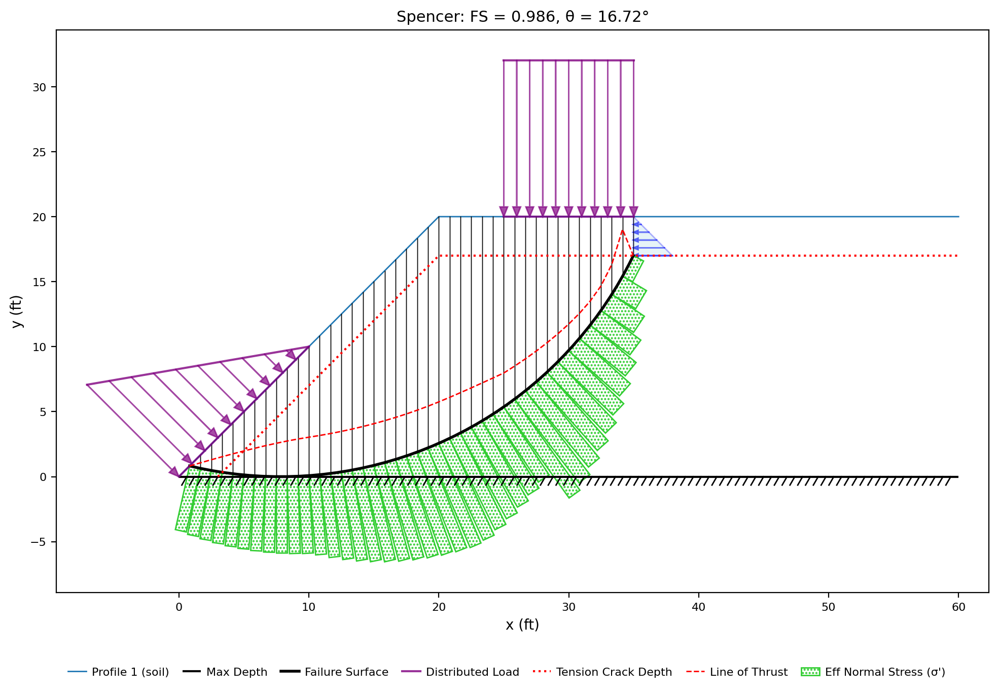{width=700}

<!-- fs-table -->
**Factor of safety by method** (each method's own critical surface):

| OMS | Bishop | Janbu | Corps | Lowe | Spencer | M-P |
|---:|---:|---:|---:|---:|---:|---:|
| 0.985 | 0.985 | 0.807 | 1.050 | 1.039 | 0.986 | 0.985 |
<!-- /fs-table -->

<!-- test: file=files/xslope_simple_embankment_mods.xlsx, type=circular_search, num_slices=40, fs_oms=0.985, fs_bishop=0.985, fs_janbu=0.807, fs_corps=1.050, fs_lowe=1.039, fs_spencer=0.986, fs_mprice=0.985 -->

### 2. Simple Slope with Foundation

This problem involves a uniform material extending below the toe of the slope. 

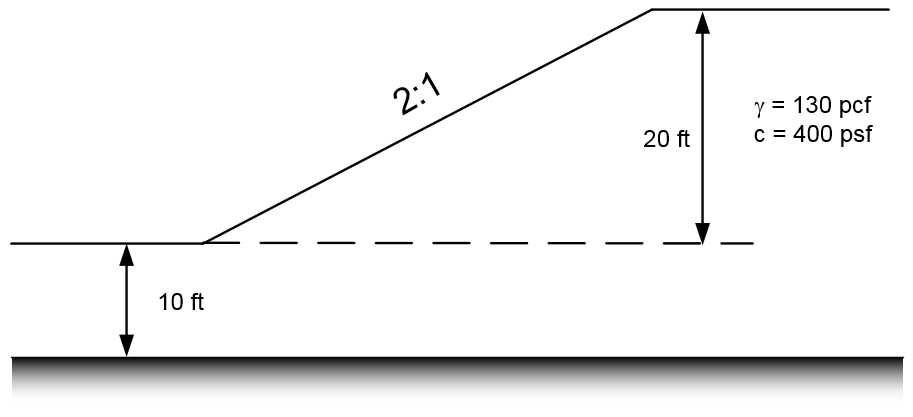{width=700}

Excel input file: [xslope_simple_foundation.xlsx](files/xslope_simple_foundation.xlsx) 

Inputs plotted with the XSLOPE plot_inputs() function:

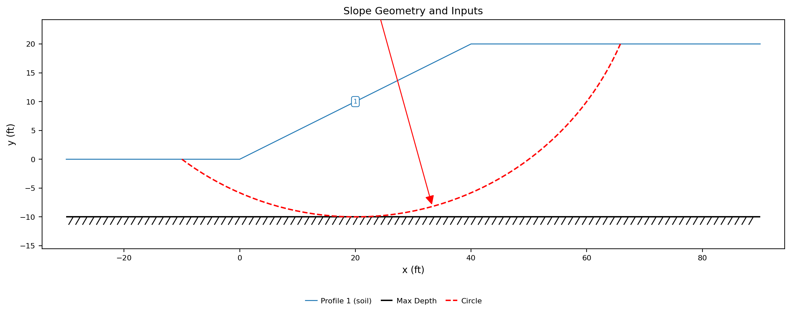{width=700}

Solution (critical surface and factor of safety):

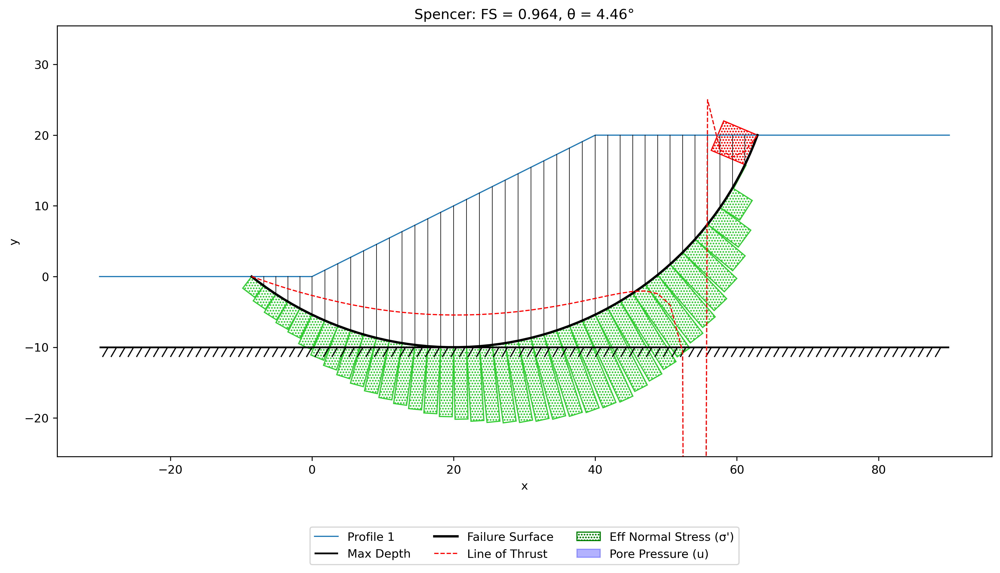{width=700}

<!-- fs-table -->
**Factor of safety by method** (each method's own critical surface):

| OMS | Bishop | Janbu | Corps | Lowe | Spencer | M-P |
|---:|---:|---:|---:|---:|---:|---:|
| 0.964 | 0.964 | 1.029 | 1.120 | 1.041 | 0.964 | 0.964 |
<!-- /fs-table -->

<!-- test: file=files/xslope_simple_foundation.xlsx, type=circular_search, num_slices=40, fs_oms=0.964, fs_bishop=0.964, fs_janbu=1.029, fs_corps=1.120, fs_lowe=1.041, fs_spencer=0.964, fs_mprice=0.964 -->

### 3. Simple Slope with Multiple Layers

This problem involves a simple slope with multiple layers of material. 

{width=700}

Excel input file: [xslope_simple_mult_layers.xlsx](files/xslope_simple_mult_layers.xlsx)

Inputs plotted with the XSLOPE plot_inputs() function. Note that in this case we use two starting circles - one at 
the base each of each of the two materials - to ensure that the search algorithm finds the critical surface 
corresponding to a global and not a local minimum. 

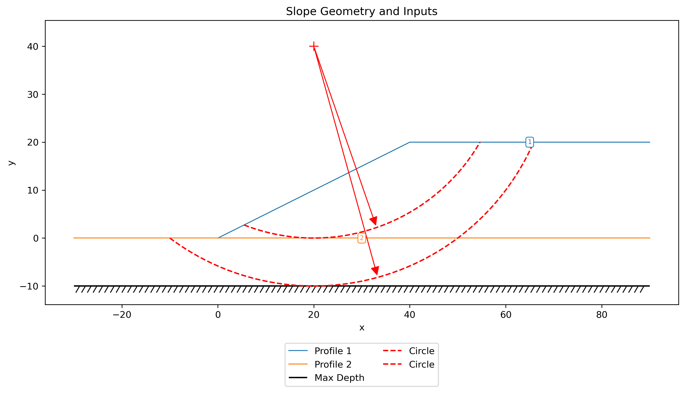{width=900}

Search results. Each gray line represent each circle used in the search. The dots represent the center of the 
circles used in the nine-point search algorithm, and the green arrows represent the path of grid centers taken to 
reach the critical surface. The red circle represents the critical surface.

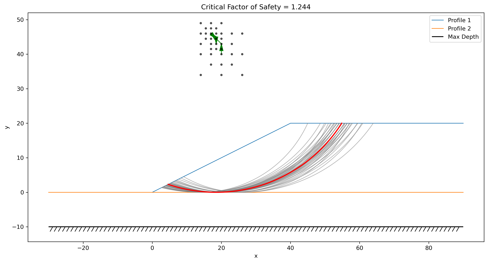{width=900}

Solution (critical surface and factor of safety):

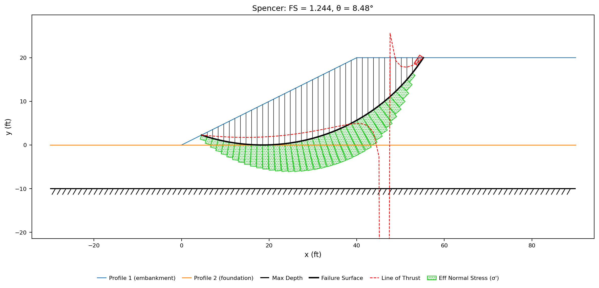{width=900}

<!-- fs-table -->
**Factor of safety by method** (each method's own critical surface):

| OMS | Bishop | Janbu | Corps | Lowe | Spencer | M-P |
|---:|---:|---:|---:|---:|---:|---:|
| 1.244 | 1.244 | 1.313 | 1.326 | 1.285 | 1.244 | 1.244 |
<!-- /fs-table -->

<!-- test: file=files/xslope_simple_mult_layers.xlsx, type=circular_search, num_slices=40, fs_oms=1.244, fs_bishop=1.244, fs_janbu=1.313, fs_corps=1.326, fs_lowe=1.285, fs_spencer=1.244, fs_mprice=1.244 -->

### 4. Submerged Slope

This problem features a slope submerged by 10 ft of water. 

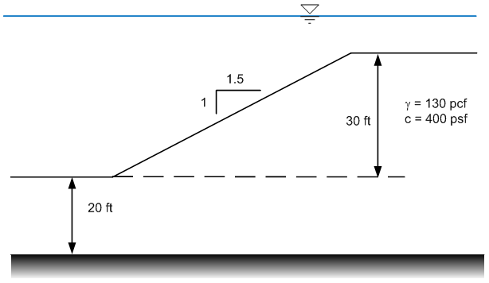{width=600}

The submerged slope is analyzed by applying a distributed load over the entire slope based on the unit weight of 
water (62.4 lb/ft3) and the depth of the water at a particular point on the slope. 

Excel input file: [xslope_submerged.xlsx](files/xslope_submerged.xlsx){width=900}

Inputs plotted with the XSLOPE plot_inputs() function:

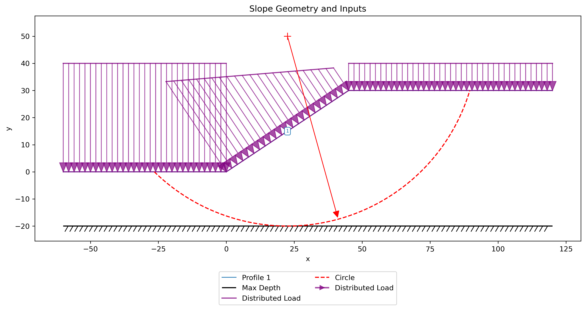{width=900}

Solution (critical surface and factor of safety):

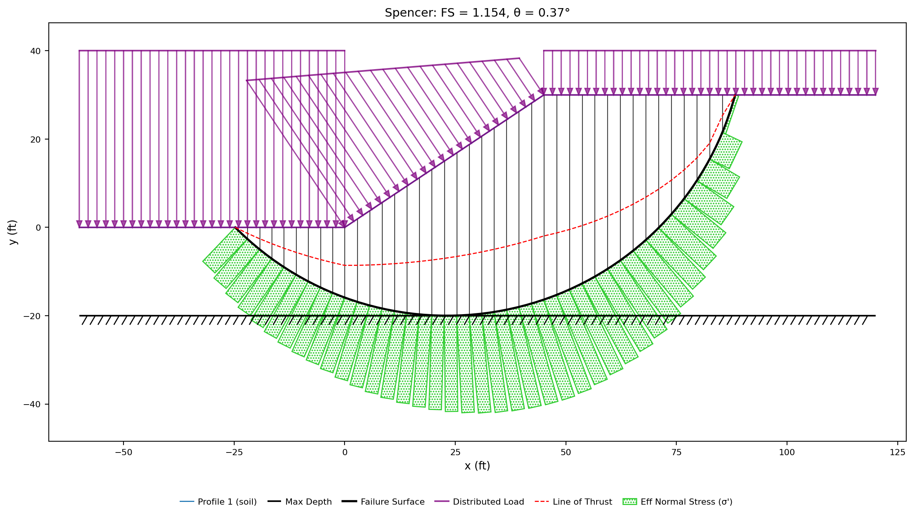{width=900}

<!-- fs-table -->
**Factor of safety by method** (each method's own critical surface):

| OMS | Bishop | Janbu | Corps | Lowe | Spencer | M-P |
|---:|---:|---:|---:|---:|---:|---:|
| 1.154 | 1.154 | 0.175 | 2.011 | 1.861 | 1.154 | 1.154 |
<!-- /fs-table -->

<!-- test: file=files/xslope_submerged.xlsx, type=circular_search, num_slices=40, fs_oms=1.154, fs_bishop=1.154, fs_janbu=0.175, fs_corps=2.011, fs_lowe=1.861, fs_spencer=1.154, fs_mprice=1.154 -->

### 5. Slope with Multiple Materials and Piezometric Line

This problem features three layers of material with an effective stress analysis where pore pressures are derives 
from a piezometric line. 

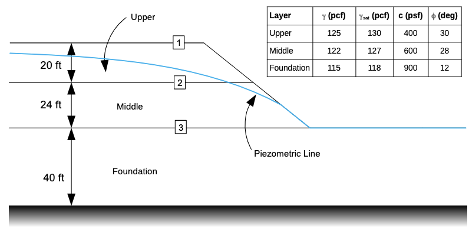{width=900}

This problem is featured as part of a graduate course on slope stability analysis (CE 544 - Slope Stability Analysis)
at Brigham Young University. The problem used in two exercises to illustrate how to solve limit equilibrium slope 
stability problems using the method of slices and an Excel spreadsheet. The problem descriptions are here:

[Ordinary Method of Slices Exercise](https://byu-ce544.readthedocs.io/en/latest/unit2/04_limiteq2/limiteq2_class/)<br>
[Bishop Simplified Procedure Homework](https://byu-ce544.readthedocs.io/en/latest/unit2/04_limiteq2/limiteq2_hw/)

In these exercises, a single circular surface was analyzed. The following Excel input file illustrates the problem:

Excel input file: [xslope_method_slices_problem.xlsx](files/xslope_method_slices_problem.xlsx)

Inputs plotted with the XSLOPE plot_inputs() function:

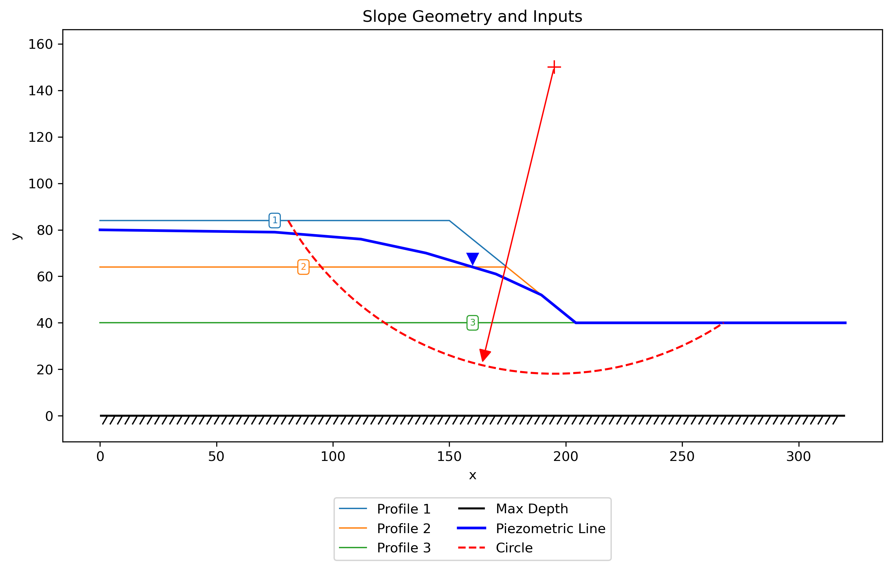{width=900}

Here is the solution for just the starting circle (to match the problem description) using Bishop's simplified procedure:

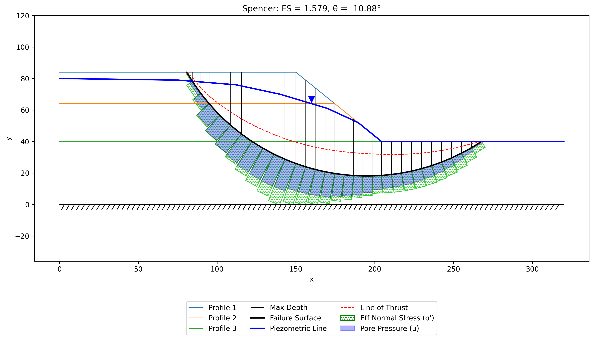{width=900}

<!-- fs-table -->
**Factor of safety by method** (each method's own critical surface):

| OMS | Bishop | Janbu | Corps | Lowe | Spencer | M-P |
|---:|---:|---:|---:|---:|---:|---:|
| 1.303 | 1.576 | 1.533 | 1.766 | 1.641 | 1.579 | 1.579 |
<!-- /fs-table -->

<!-- test: file=files/xslope_method_slices_problem.xlsx, type=single_circle, num_slices=40, fs_oms=1.303, fs_bishop=1.576, fs_janbu=1.533, fs_corps=1.766, fs_lowe=1.641, fs_spencer=1.579, fs_mprice=1.579 -->

Here is the Excel input file with multiple starting circles for a global search for the critical surface:

Excel input file: [xslope_method_slices_problem2.xlsx](files/xslope_method_slices_problem2.xlsx)

Inputs plotted with the XSLOPE plot_inputs() function:

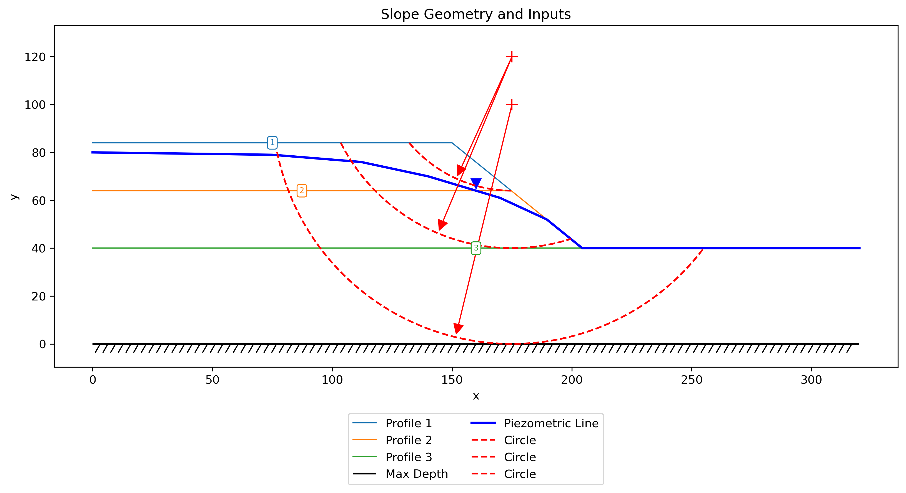{width=900}

Sarch results. This problem is a good example of the search path and the large number of circles that are sometimes 
tested in the search algorithm. In this case, the critical surface is isolated to sloughing of the 2nd layer.

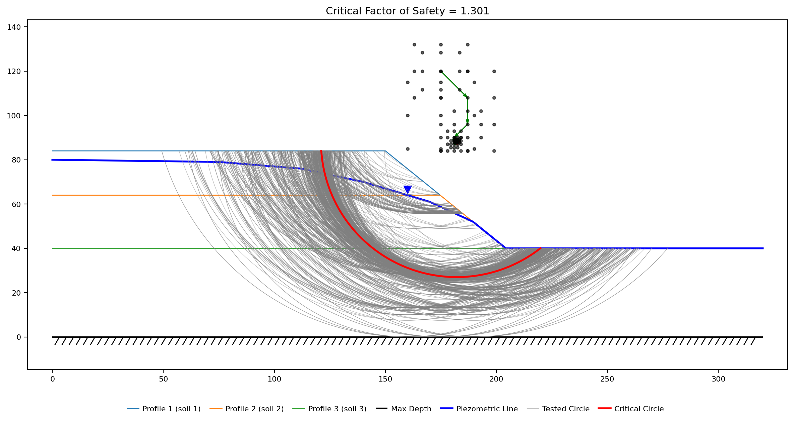{width=900}

Solution (critical surface and factor of safety):

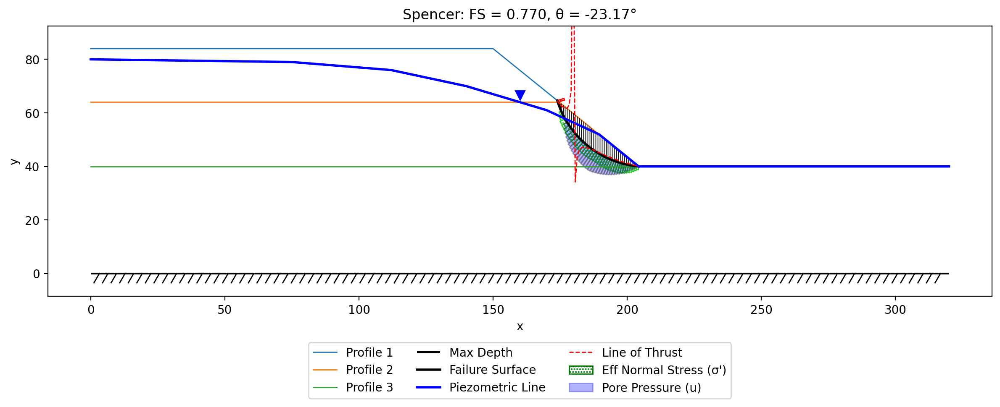{width=900}

<!-- fs-table -->
**Factor of safety by method** (each method's own critical surface):

| OMS | Bishop | Janbu | Corps | Lowe | Spencer | M-P |
|---:|---:|---:|---:|---:|---:|---:|
| 0.628 | 0.762 | 0.734 | 0.721 | 0.788 | 0.770 | 0.767 |
<!-- /fs-table -->

<!-- test: file=files/xslope_method_slices_problem2.xlsx, type=circular_search, num_slices=40, fs_oms=0.628, fs_bishop=0.762, fs_janbu=0.734, fs_corps=0.721, fs_lowe=0.788, fs_spencer=0.770, fs_mprice=0.767 -->

### 6. Slope with Eight Layers

This problem features a slope with eight soil layers. This problem was featured in the user manual for the UTEXASED 
slope stability analysis software developed by  at the University of Texas at Austin by Stephen G. Wright. If 
features a series of alternating layers, some of which are analyzed with an effective stress analysis and a 
piezometric line, and some of which are analyzed using a total stress analysis. We will assume that the base (max 
depth) is 10 ft below the top of the bottom material.

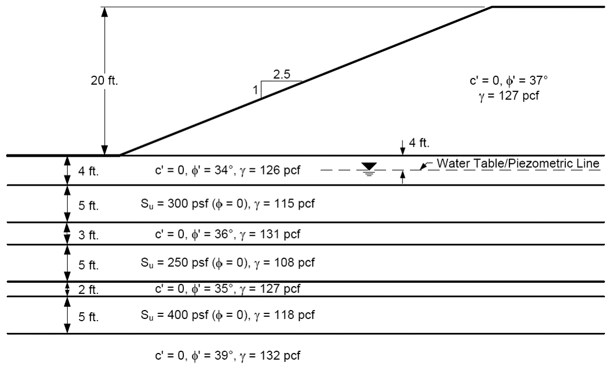{width=900}

To find the critical surface and the global minimum factor of safety, we must use a circle starting at the base of 
each layer. The following Excel input file illustrates the problem.

Excel input file: [xslope_eight_layers.xlsx](files/xslope_eight_layers.xlsx)

Inputs plotted with the XSLOPE plot_inputs() function:

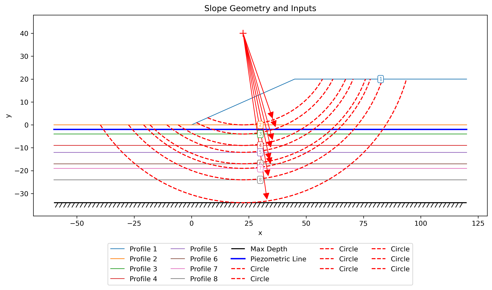{width=900}

Search results:

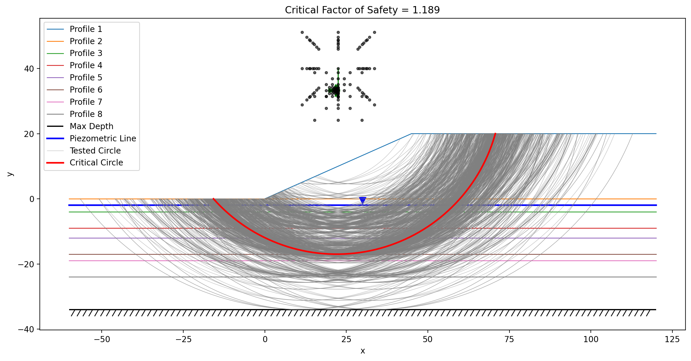{width=900}

Solution (critical surface and factor of safety):

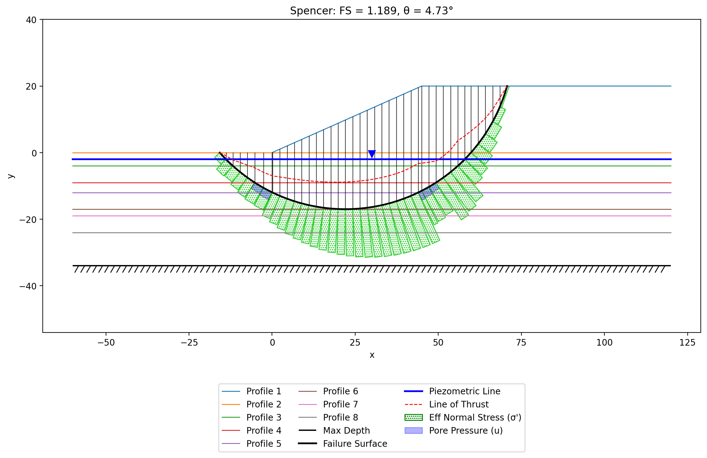{width=900}

<!-- fs-table -->
**Factor of safety by method** (each method's own critical surface):

| OMS | Bishop | Janbu | Corps | Lowe | Spencer | M-P |
|---:|---:|---:|---:|---:|---:|---:|
| 0.805 | 1.154 | 1.160 | 1.240 | 1.060 | 1.189 | 1.170 |
<!-- /fs-table -->

<!-- test: file=files/xslope_eight_layers.xlsx, type=circular_search, num_slices=40, fs_oms=0.805, fs_bishop=1.154, fs_janbu=1.160, fs_corps=1.240, fs_lowe=1.060, fs_spencer=1.189, fs_mprice=1.170 -->

### 7. Non-Circular Failure Surface

This problem features a thin weak layer in the foundation of a slope. In such cases, a non-circular failure surface 
constrained to fit in the weak layer often corresponds to the critical failure surface. This can be modeled with 
non-circular options in XSLOPE. This problem is also featured in the user manual for the UTEXASED slope stability 
analysis software developed by Stephen G. Wright at the University of Texas at Austin.

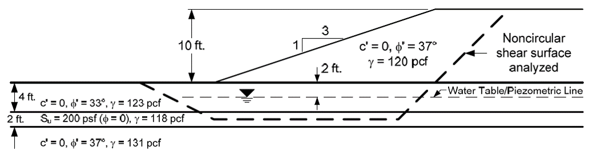{width=900}

The non-circular failure surface is modeled with the following Excel input file. The failure surface is defined by 
four points. The first and last point are assigned the "Free" option, which causes them to be automatically 
calculated based on the slope geometry. The two middle points are assigned the "Horiz" option, which causes them to 
be moved horizontally inside the weak layer.

Excel input file: [xslope_noncircular.xlsx](files/xslope_noncircular.xlsx)

Inputs plotted with the XSLOPE plot_inputs() function:

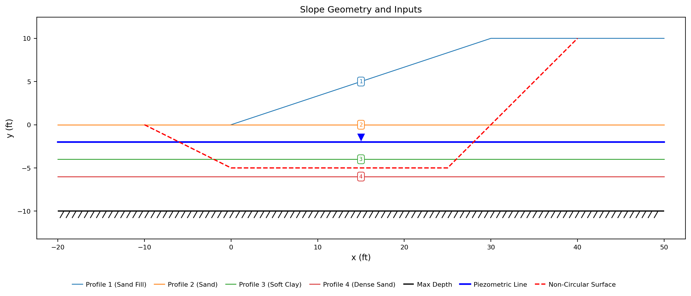{width=900}

Search results:

{width=900}

!!! note
    The search algorithm for non-circular failure surfaces is highly sensitive to the starting location. It the 
    angle of the wedge at the toe of the slope is too steep, there will be tension at the toe of the slope and the search 
    will fail to find a correct solution.

Solution (critical surface and factor of safety):

{width=900}

<!-- fs-table -->
**Factor of safety by method** (each method's own critical surface):

| OMS | Bishop | Janbu | Corps | Lowe | Spencer | M-P |
|---:|---:|---:|---:|---:|---:|---:|
| — | — | 1.657 | 1.794 | 1.369 | 1.739 | 1.710 |
<!-- /fs-table -->

<!-- test: file=files/xslope_noncircular.xlsx, type=noncircular_search, num_slices=40, fs_janbu=1.657, fs_corps=1.794, fs_lowe=1.369, fs_spencer=1.739, fs_mprice=1.710 -->

### 8. Earth Dam 

This problem features a dam with a shell and a clay core on top of a foundation with a clay layer and a sand layer. 
This problem was featured on page 121 of Shear Strength and Slope Stability - Second Edition by Duncan, Wright, and 
Brandon. 


The material properties are as follows:

|  Mat   | c' (psf) | $\phi$' (degrees) | γ (pcf) |
|:------:|:--------:|:-----------------:|:-------:|
| Shell  |    0     |        34         |   125   |
|  Core  |   100    |        26         |   122   |
|  Clay  |    0     |        24         |   123   |
|  Sand  |    0     |        32         |   127   |

**Upstream side of the dam**

First, we will analyze the upstream side. This is accomplished by defining starting circles on the upstream side of the 
dam. The following Excel input file illustrates the problem.

Excel input file: [xslope_earth_dam_up.xlsx](files/xslope_earth_dam_up.xlsx)

Inputs plotted with the XSLOPE plot_inputs() function:

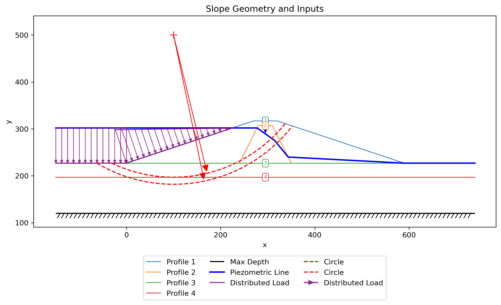{width=900}

Search results:

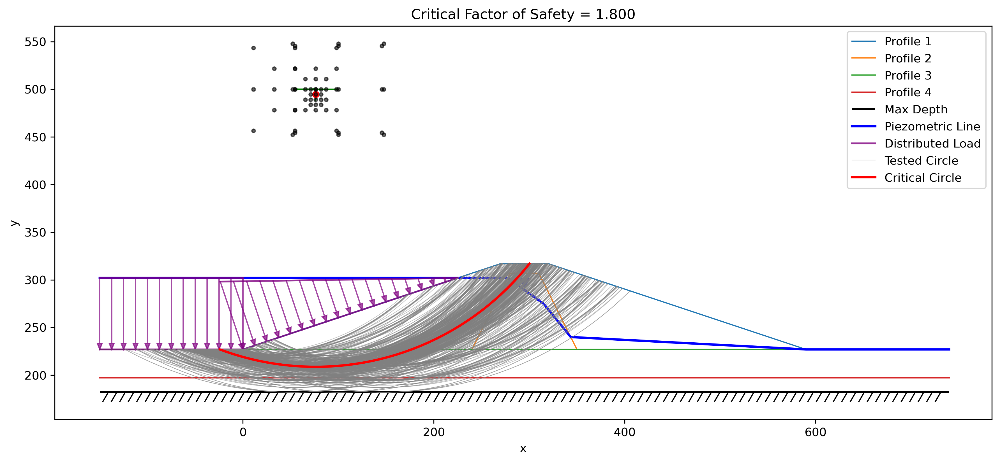{width=900}

Solution (critical surface and factor of safety):

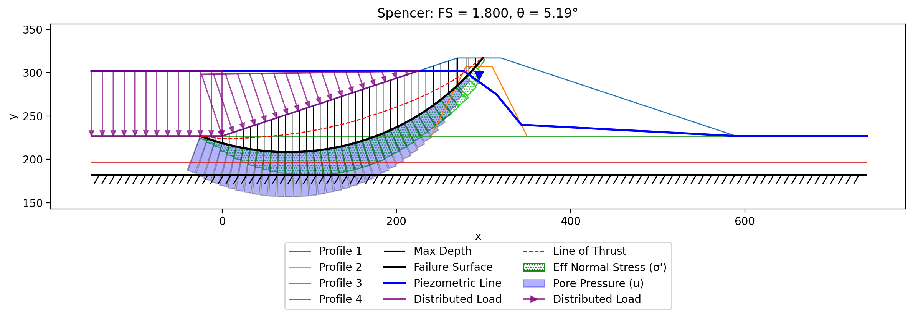{width=900}

<!-- fs-table -->
**Factor of safety by method** (each method's own critical surface):

| OMS | Bishop | Janbu | Corps | Lowe | Spencer | M-P |
|---:|---:|---:|---:|---:|---:|---:|
| n/a\* | 1.815 | n/a\* | 2.072 | 2.018 | 1.800 | 1.795 |

\* OMS and Janbu are not reported for this problem. On a fully-submerged slope their simplified equations cannot balance the large reservoir water load, so they return a spurious near-zero factor of safety; the rigorous methods (Bishop, Spencer, Corps, Lowe) remain reliable. See the OMS and Janbu method notes.
<!-- /fs-table -->

<!-- test: file=files/xslope_earth_dam_up.xlsx, type=circular_search, num_slices=40, fs_bishop=1.815, fs_corps=2.072, fs_lowe=2.018, fs_spencer=1.800, fs_mprice=1.795 -->

**Downstream side of the dam**

Next, we will analyze the other side of the dam by defining starting circles on the downstream 
side of the dam. 

Excel input file: [xslope_earth_dam_down.xlsx](files/xslope_earth_dam_down.xlsx)

Inputs plotted with the XSLOPE plot_inputs() function:

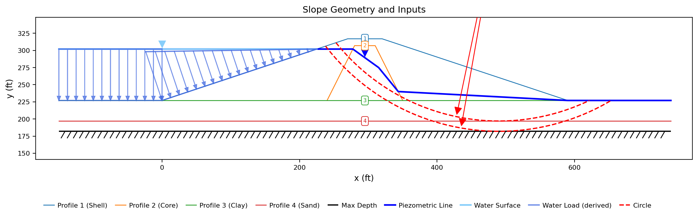{width=900}

Search results:

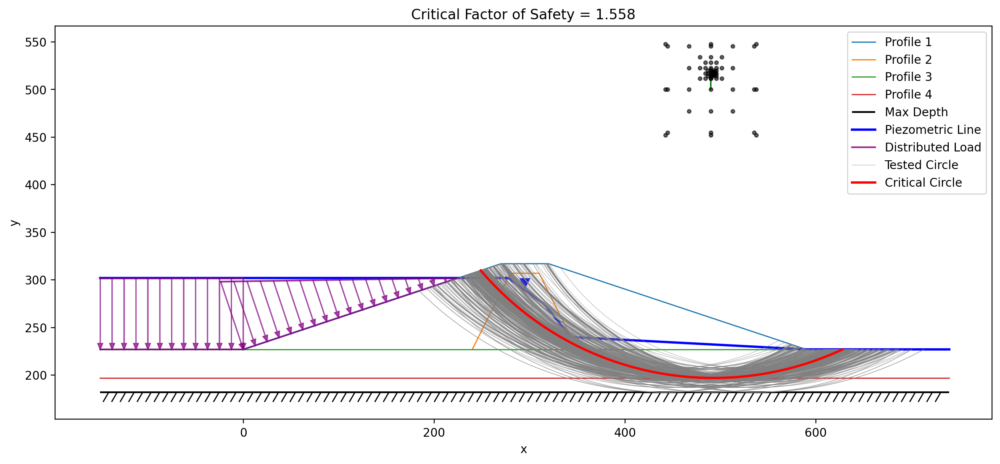{width=900}

Solution (critical surface and factor of safety):

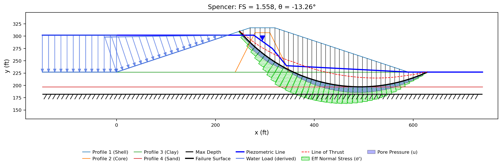{width=900}

<!-- fs-table -->
**Factor of safety by method** (each method's own critical surface):

| OMS | Bishop | Janbu | Corps | Lowe | Spencer | M-P |
|---:|---:|---:|---:|---:|---:|---:|
| 1.386 | 1.561 | 1.470 | 1.595 | 1.568 | 1.558 | 1.559 |
<!-- /fs-table -->

<!-- test: file=files/xslope_earth_dam_down.xlsx, type=circular_search, num_slices=40, fs_oms=1.386, fs_bishop=1.561, fs_janbu=1.470, fs_corps=1.595, fs_lowe=1.568, fs_spencer=1.558, fs_mprice=1.559 -->

### 9. Reinforced Slope

This problem features an engineered slope with six layers of geogrid reinforcement. This problem was featured in the 
user manual for the UTEXASED slope stability analysis software developed by Stephen G. Wright at the University of Texas 
at Austin.

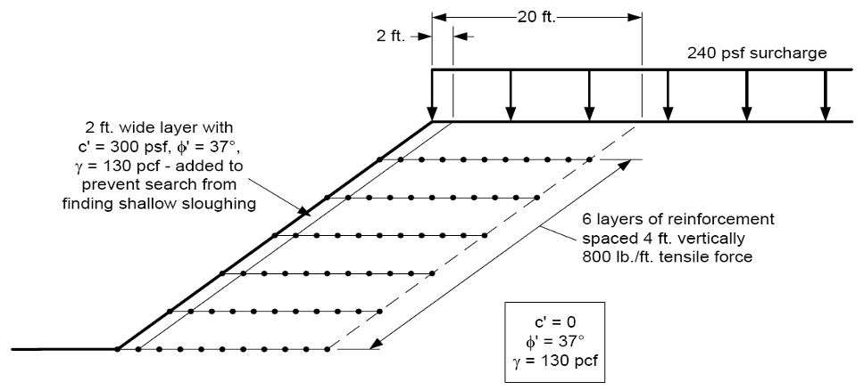{width=900}

A 240 psf surcharge is applied along the slope crest. For each line of reinforcement, the full tensile force develops over a length of 4 ft. The toe of the slope corresponds
to (0, 0) and the top of the slope corresponds to (30, 24). 

The following Excel input file illustrates the problem. The soil reinforcement is entered in the "reinforce" sheet.

Excel input file: [xslope_reinforce.xlsx](files/xslope_reinforce.xlsx)

Inputs plotted with the XSLOPE plot_inputs() function:

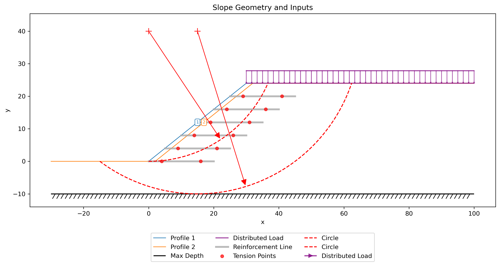{width=900}

Solution (critical surface and factor of safety):

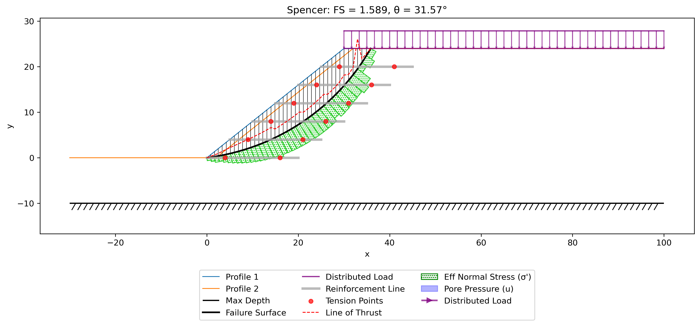{width=900}

<!-- fs-table -->
**Factor of safety by method** (each method's own critical surface):

| OMS | Bishop | Janbu | Corps | Lowe | Spencer | M-P |
|---:|---:|---:|---:|---:|---:|---:|
| 1.480 | 1.593 | 1.590 | 1.377 | 1.597 | 1.587 | 1.587 |
<!-- /fs-table -->

<!-- test: file=files/xslope_reinforce.xlsx, type=circular_search, num_slices=40, fs_oms=1.480, fs_bishop=1.593, fs_janbu=1.590, fs_corps=1.377, fs_lowe=1.597, fs_spencer=1.587, fs_mprice=1.587 -->

!!! note
    The solution for this problem found by XSLOPE is not the same as the solution found by UTEXASED. The difference
    is due to the fact that XSLOPE assumes the reinforcement is flexible and the force from the reinforcement is
    therefore parallel to the base of the slope. UTEXASED assumes the reinforcement is rigid and the force from the
    reinforcement is in the direction of the reinforcement line. The flexible assumption is more conservative. The
    UTEXASED solution for this problem is FS = 1.646.

### 10. Slope Stabilized with Piles

This problem features a 1:1 slope in a medium-stiff clay stabilized by two rows of drilled shafts.

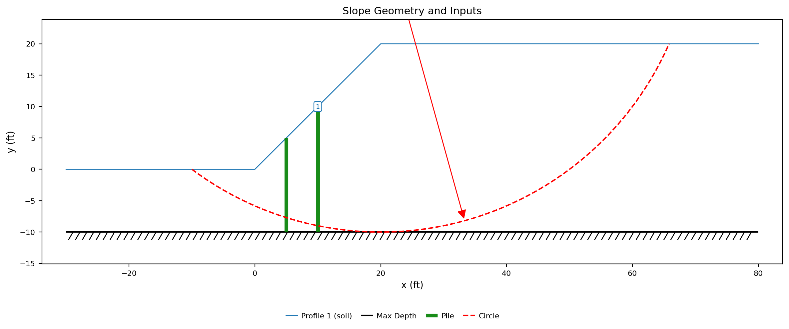{width=900}

Excel input file: [xslope_piles.xlsx](files/xslope_piles.xlsx)

| Property | Value |
|----------|-------|
| Cohesion, $c$ | 200 psf |
| Friction angle, $\phi$ | 20 degrees |
| Unit weight, $\gamma$ | 120 pcf |
| Pile diameter, $D$ | 2.0 ft |
| Pile spacing, $S$ | 6.0 ft |
| $V_{\text{cap}}$ | 46,000 lb |
| $M_{\text{cap}}$ | 60,000 ft·lb |

#### Results Without Piles (FS = 1.15)

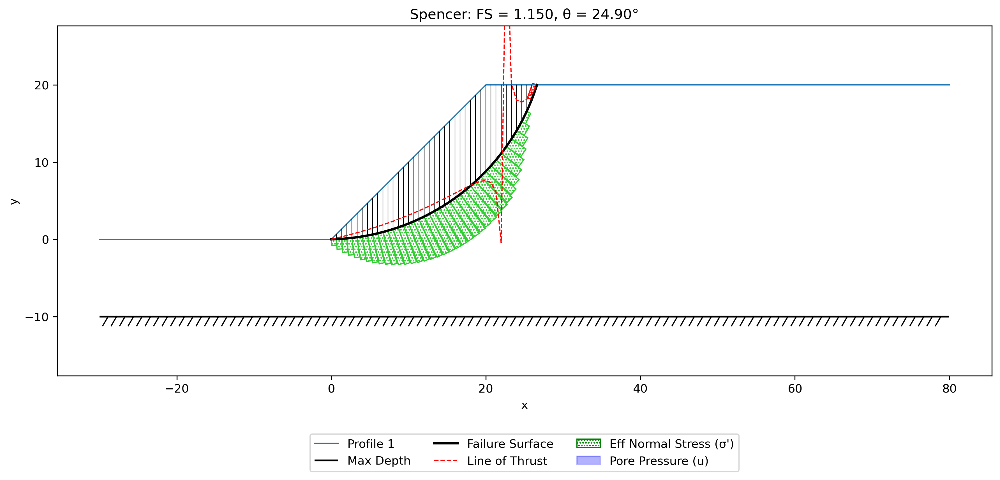{width=900}

#### Results With Piles (FS = 1.85)

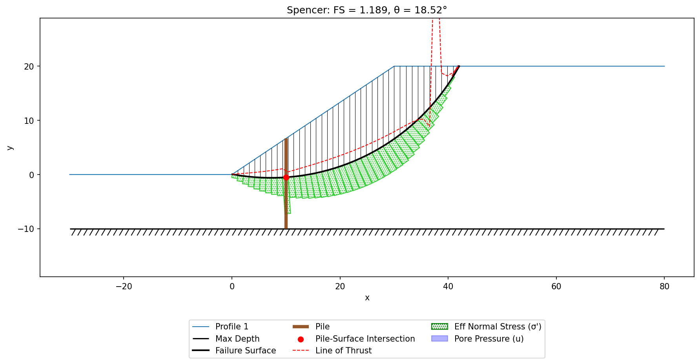{width=900}

The two rows of piles increase the factor of safety from 1.15 to 1.85.

#### Ito & Matsui Summary

The pile force $H$ is not specified directly in the input file. Instead, XSLOPE auto-computes $H$ using the
Ito & Matsui (1975) method, which models the plastic flow of soil between adjacent piles to determine the lateral
resistance. Because $H$ is computed for each trial failure surface during the search, the pile resistance varies
with the depth of the failure surface at the pile location.

Structural capacity limits ($V_{\text{cap}}$ = 46,000 lb, $M_{\text{cap}}$ = 60,000 ft·lb) are specified for
each pile, consistent with a 2-ft diameter reinforced concrete section ($f'_c$ = 4000 psi). For the critical
failure surface, the Ito & Matsui soil forces far exceed the structural capacity, and the moment capacity
controls:

```text
  === Ito & Matsui Summary (Pile 1) ===
  Pile diameter (D)          = 2.0
  Pile spacing (S)           = 6.0
  Clear spacing (D1 = S - D) = 4.0
  Depth to failure surface   = 9.5
  Coefficients: A1 = 7.569, A2 = 4.755
  Force per pile (F_pile)    = 39810
  Force per unit width (H)   = 6635.1
  --- Structural Capacity Check ---
  V_cap = 46000  (F_pile within shear capacity)
  M_cap = 60000, L_m = 3.72, F_limit = M_cap/L_m = 16139  (F_pile exceeds moment capacity)
  Controlled by moment (M_cap/L_m)
  F_pile: 39810 -> 16139 (capped)
  H:      6635.1 -> 2689.8 (capped)

  === Ito & Matsui Summary (Pile 2) ===
  Pile diameter (D)          = 2.0
  Pile spacing (S)           = 6.0
  Clear spacing (D1 = S - D) = 4.0
  Depth to failure surface   = 13.9
  Coefficients: A1 = 7.569, A2 = 4.755
  Force per pile (F_pile)    = 76447
  Force per unit width (H)   = 12741.2
  --- Structural Capacity Check ---
  V_cap = 46000  (F_pile exceeds shear capacity)
  M_cap = 60000, L_m = 5.28, F_limit = M_cap/L_m = 11356  (F_pile exceeds moment capacity)
  Controlled by moment (M_cap/L_m)
  F_pile: 76447 -> 11356 (capped)
  H:      12741.2 -> 1892.6 (capped)
```

The Ito & Matsui soil forces (39,810 and 76,447 lb per pile) represent the theoretical upper bound on what the soil
can push onto the pile. These greatly exceed both the shear and moment capacities. After capping, the effective
pile forces are reduced by 59% and 85% respectively, with the moment capacity ($M_{\text{cap}} / L_m$) controlling
in both cases. Without the capacity checks, the LEM would overestimate the pile resistance and produce an
unconservatively high factor of safety.

#### LEM vs. FEM Comparison

The corresponding FEM analysis of this problem (see [FEM Samples](../fem/samples.md), Problem 3) gives
FS = 1.32 with piles — significantly lower than the LEM result of 1.85. This difference arises because
the LEM applies the Ito & Matsui force (even after capping) as a concentrated load at the failure surface,
while the FEM beam elements only develop as much resistance as the global deformation pattern naturally
produces. The FEM result is generally considered more realistic for pile-stabilized slopes.

<!-- fs-table -->
**Factor of safety by method** (each method's own critical surface):

| OMS | Bishop | Janbu | Corps | Lowe | Spencer | M-P |
|---:|---:|---:|---:|---:|---:|---:|
| 1.622 | 1.854 | 1.649 | 1.369 | 1.857 | 1.842 | 1.842 |
<!-- /fs-table -->

<!-- test: file=files/xslope_piles.xlsx, type=circular_search, num_slices=40, fs_oms=1.622, fs_bishop=1.854, fs_janbu=1.649, fs_corps=1.369, fs_lowe=1.857, fs_spencer=1.842, fs_mprice=1.842 -->

### 11. Polygon Input with a Sloping Bottom

This problem demonstrates two features together: **polygon-based geometry input** and a
**sloping (non-horizontal) bottom boundary**. Rather than profile lines and a horizontal
`max_depth`, the cross-section is defined directly on the `polygons` sheet as two
material-zone polygons — an embankment over a foundation — whose shared base dips from
left to right (elevation −15 on the left to −5 on the right). With polygon input there is
no `max_depth`; the union of the polygons forms the **domain polygon**, and its lower
boundary is the dipping base shown by the hatched line.

The failure surface is constrained to stay within the domain polygon. During the search,
trial circles that would dip below the sloping base are automatically rejected, so the
critical surface follows the dipping foundation rather than a fictitious flat cutoff.

Excel input file: [xslope_sloping_bottom.xlsx](files/xslope_sloping_bottom.xlsx)

Inputs plotted with the XSLOPE plot_inputs() function (filled material zones and a hatched
sloping base, instead of profile lines and a horizontal max-depth line):

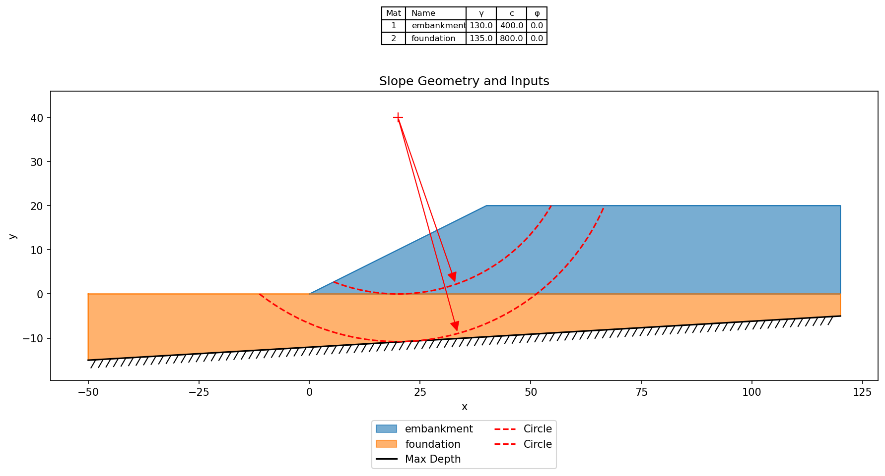{width=900}

Search results:

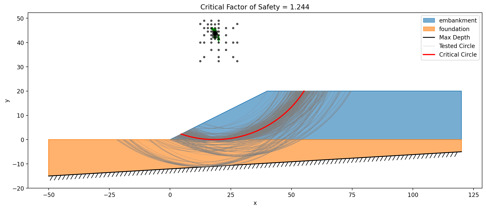{width=900}

Solution (critical surface and factor of safety):

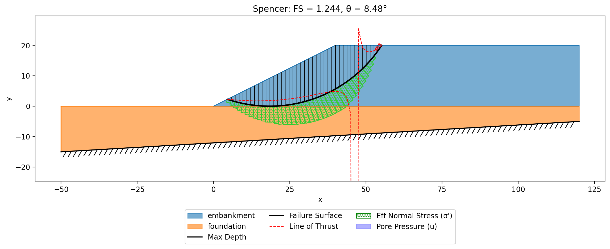{width=900}

<!-- fs-table -->
**Factor of safety by method** (each method's own critical surface):

| OMS | Bishop | Janbu | Corps | Lowe | Spencer | M-P |
|---:|---:|---:|---:|---:|---:|---:|
| 1.244 | 1.244 | 1.313 | 1.326 | 1.285 | 1.244 | 1.244 |
<!-- /fs-table -->

<!-- test: file=files/xslope_sloping_bottom.xlsx, type=circular_search, num_slices=40, fs_oms=1.244, fs_bishop=1.244, fs_janbu=1.313, fs_corps=1.326, fs_lowe=1.285, fs_spencer=1.244, fs_mprice=1.244 -->

---

The remaining problems are **verification benchmarks**: published cases used to
validate the limit-equilibrium implementation. Each is locked into the
automated regression suite. See also the [Verification](../verification.md) page.

### 12. Verification: ACADS Simple Homogeneous Slope {#verification-acads-simple}

This is the headline limit-equilibrium verification benchmark, from the ACADS
slope stability program review (Donald & Giam, 1989; Giam & Donald, 1992), as
documented in the [GeoStudio SLOPE/W Verification Manual (Oct 2022)](https://files.seequent.com/PDFs/Geostudio-Slope%20Stability%20Verification%20Manual-Oct2022.pdf). A simple
homogeneous slope analyzed with a circular search; the ACADS consensus answer
is FOS ≈ 1.00, making percent differences easy to read.

| Property | Value |
|---|---|
| Slope | 2:1, 10 m high, with a bench |
| Cohesion, $c'$ | 3.0 kPa |
| Friction angle, $\phi'$ | 19.6° |
| Unit weight, $\gamma$ | 20.0 kN/m³ |
| Pore pressure | none (total stress) |

Excel input file: [xslope_acads_simple.xlsx](files/xslope_acads_simple.xlsx)

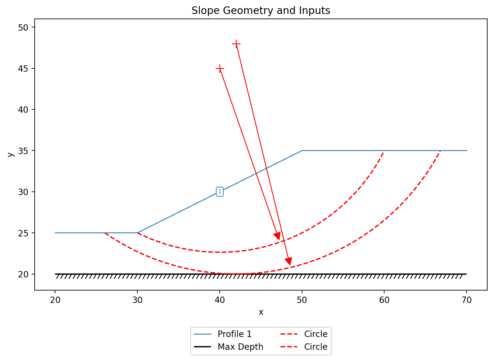{width=900}

Critical circle from the automated search (Spencer's method shown):

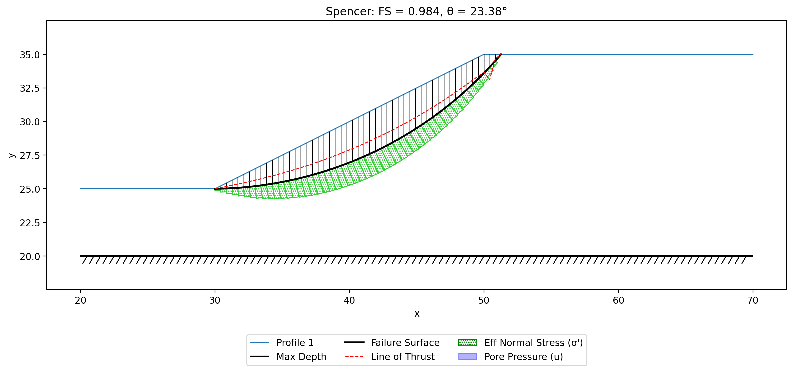{width=900}

XSLOPE results for all six methods (automated critical-circle search, 50
slices, each method searched independently):

| Method | XSLOPE FOS | Reference | Diff |
|---|---|---|---|
| Ordinary (OMS) | 0.942 | 1.00 | -5.8% |
| Bishop's Simplified | 0.985 | 1.00 | -1.5% |
| Simplified Janbu | 0.986 | 1.00 | -1.4% |
| Corps of Engineers | 0.990 | 1.00 | -1.0% |
| Lowe & Karafiath | 0.987 | 1.00 | -1.3% |
| Spencer | 0.984 | 1.00 | -1.6% |
| Morgenstern-Price | 0.984 | 1.00 | -1.6% |

All rigorous methods fall within the ACADS accepted band; OMS reads low, as
expected for the legacy method (its conservative bias on this class of problem
is why it is reported for completeness only). This benchmark also appears on
the [Verification](../verification.md#limit-equilibrium) page.

**Sources:** Donald, I.B. & Giam, P. (1989), *Soil slope stability programs
review*, ACADS, Melbourne; Giam, P. & Donald, I.B. (1992); GeoStudio
[SLOPE/W Verification Manual (Oct 2022)](https://files.seequent.com/PDFs/Geostudio-Slope%20Stability%20Verification%20Manual-Oct2022.pdf),
ACADS suite.

<!-- fs-table -->
**Factor of safety by method** (each method's own critical surface):

| OMS | Bishop | Janbu | Corps | Lowe | Spencer | M-P |
|---:|---:|---:|---:|---:|---:|---:|
| 0.942 | 0.985 | 0.986 | 0.990 | 0.987 | 0.984 | 0.984 |
<!-- /fs-table -->

<!-- test: file=files/xslope_acads_simple.xlsx, type=circular_search, num_slices=50, fs_oms=0.942, fs_bishop=0.985, fs_janbu=0.986, fs_corps=0.990, fs_lowe=0.987, fs_spencer=0.984, fs_mprice=0.984, benchmark=LEM-1 -->

### 13. Verification: ACADS Weak-Layer Slope (Non-Circular) {#verification-acads-weak-layer}

The ACADS weak-layer case
([SLOPE/W Verification Manual](https://files.seequent.com/PDFs/Geostudio-Slope%20Stability%20Verification%20Manual-Oct2022.pdf)
sec. 2.7): a 2:1 slope
crossed by a thin low-strength interlayer with a piezometric line at its base.
The critical surface is non-circular, sliding along the weak layer with a back
scarp to the crest — this is the non-circular search verification test. The
ACADS accepted band is FOS ≈ 1.26.

| Property | Soil 1 | Weak layer |
|---|---|---|
| Cohesion, $c'$ (kPa) | 28.5 | 0 |
| Friction angle, $\phi'$ | 20° | 10° |
| Unit weight, $\gamma$ (kN/m³) | 18.84 | 18.84 |

Excel input file: [xslope_acads_weak_layer.xlsx](files/xslope_acads_weak_layer.xlsx)

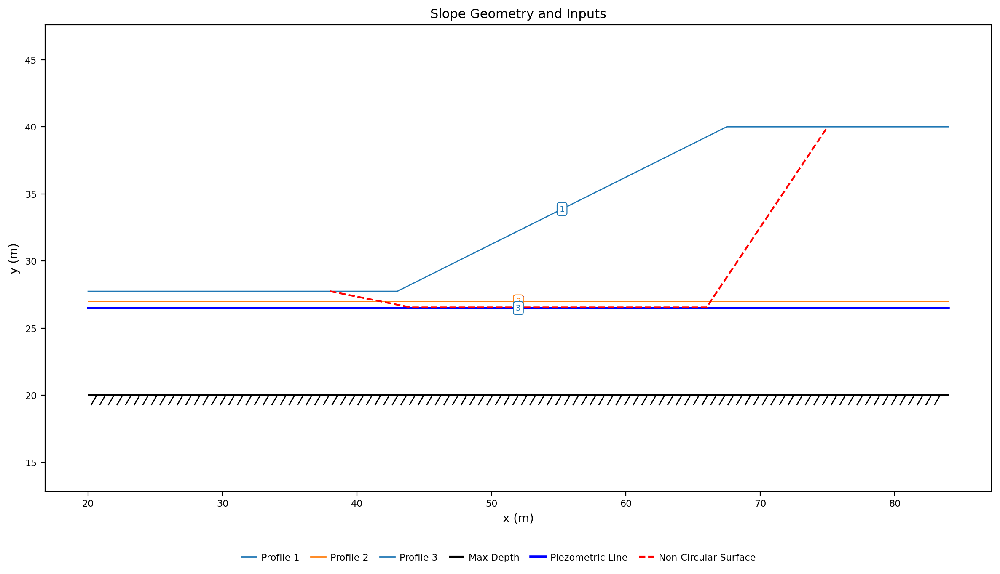{width=900}

Critical non-circular surface (Spencer's method shown):

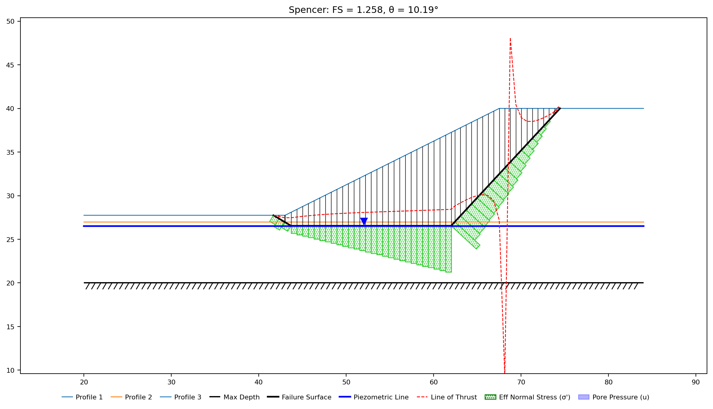{width=900}

Results for the methods applicable to non-circular surfaces:

| Method | XSLOPE FOS | Reference | Diff |
|---|---|---|---|
| Spencer | 1.258 | ~1.26 | −0.2% |
| Morgenstern-Price | 1.248 | ~1.26 | −1.0% |
| Corps of Engineers | 1.336 | ~1.26 | +6.0% |
| Lowe & Karafiath | 1.249 | ~1.26 | −0.9% |
| Simplified Janbu | 1.278 | ~1.26 | +1.4% |

The two interior surface points are seeded just above the base of the weak
layer (base $y=26.5$, top $y=27.0$). Because the non-circular search moves
``Horiz`` points horizontally only, that seed elevation *is* the sliding plane:
placing it near the base of a weak interlayer is standard practice and matches
the reference, whereas seeding it at the layer center biases the factor of
safety roughly 1.5% high. With the base placement, XSLOPE's complete-equilibrium
methods land within ~1% of SLOPE/W's Morgenstern-Price value (1.261): Spencer at
1.258 (−0.2%) and Morgenstern-Price (half-sine) at 1.248 (−1.0%). Corps of
Engineers reads modestly
high here, consistent with ground-parallel side-force inclinations on a surface
with a steep back scarp (XSLOPE uses the standard "Corps #2" convention — see
[Force Equilibrium Methods](force_eq.md)). This benchmark also appears on the
[Verification](../verification.md#limit-equilibrium) page.

**Sources:** GeoStudio [SLOPE/W Verification Manual (Oct 2022)](https://files.seequent.com/PDFs/Geostudio-Slope%20Stability%20Verification%20Manual-Oct2022.pdf),
sec. 2.7; Donald, I.B. & Giam, P. (1989), ACADS.

<!-- fs-table -->
**Factor of safety by method** (each method's own critical surface):

| OMS | Bishop | Janbu | Corps | Lowe | Spencer | M-P |
|---:|---:|---:|---:|---:|---:|---:|
| — | — | 1.278 | 1.336 | 1.249 | 1.258 | 1.248 |
<!-- /fs-table -->

<!-- test: file=files/xslope_acads_weak_layer.xlsx, type=noncircular_search, num_slices=50, fs_janbu=1.278, fs_corps=1.336, fs_lowe=1.249, fs_spencer=1.258, fs_mprice=1.248, benchmark=LEM-2 -->

### 14. Verification: Arai & Tagyo Homogeneous Slope {#verification-arai-tagyo}

From [Arai & Tagyo (1985)](https://doi.org/10.3208/sandf1972.25.43), *Soils
and Foundations* 25(1), and republished by Greco (1996), Malkawi et al.
(2001), and Kim et al. (2002); also
[SLOPE/W Verification Manual](https://files.seequent.com/PDFs/Geostudio-Slope%20Stability%20Verification%20Manual-Oct2022.pdf)
sec. 2.11. A homogeneous 1.5:1 slope, 20 m high, with
c = 41.65 kPa, φ = 15.0°, γ = 18.82 kN/m³ (total stress). Published FOS ≈ 1.451.

Excel input file: [xslope_arai_tagyo.xlsx](files/xslope_arai_tagyo.xlsx)

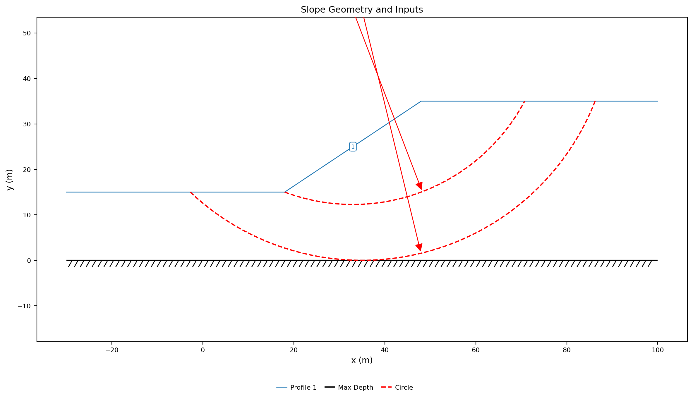{width=900}

Critical circle (Spencer's method shown):

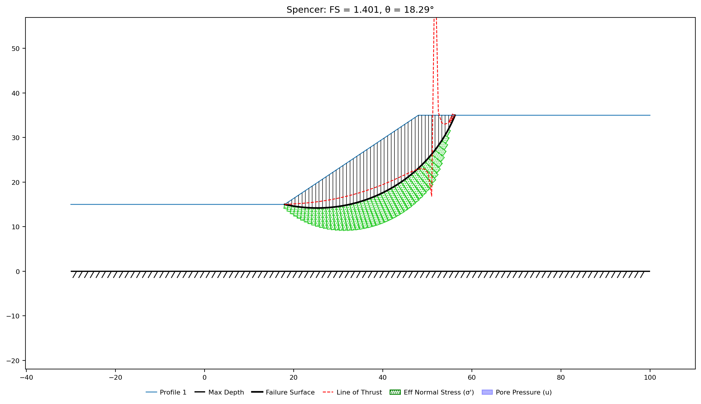{width=900}

Results for all six methods (automated critical-circle search, 50 slices):

| Method | XSLOPE FOS | Reference | Diff |
|---|---|---|---|
| Ordinary (OMS) | 1.344 | 1.451 | -7.4% |
| Bishop's Simplified | 1.404 | 1.451 | -3.2% |
| Simplified Janbu | 1.411 | 1.451 | -2.8% |
| Corps of Engineers | 1.476 | 1.451 | +1.7% |
| Lowe & Karafiath | 1.438 | 1.451 | -0.9% |
| Spencer | 1.401 | 1.451 | -3.4% |
| Morgenstern-Price | 1.400 | 1.451 | -3.5% |

This benchmark also appears on the
[Verification](../verification.md#limit-equilibrium) page.

**Source:** Arai, K. & Tagyo, K. (1985). Determination of noncircular slip
surface giving the minimum factor of safety in slope stability analysis.
*Soils and Foundations* 25(1):43-51.
[doi:10.3208/sandf1972.25.43](https://doi.org/10.3208/sandf1972.25.43).
Republished in Greco (1996), Malkawi et al. (2001), and Kim et al. (2002);
also SLOPE/W Verification Manual sec. 2.11.

<!-- fs-table -->
**Factor of safety by method** (each method's own critical surface):

| OMS | Bishop | Janbu | Corps | Lowe | Spencer | M-P |
|---:|---:|---:|---:|---:|---:|---:|
| 1.344 | 1.404 | 1.411 | 1.476 | 1.438 | 1.401 | 1.400 |
<!-- /fs-table -->

<!-- test: file=files/xslope_arai_tagyo.xlsx, type=circular_search, num_slices=50, fs_oms=1.344, fs_bishop=1.404, fs_janbu=1.411, fs_corps=1.476, fs_lowe=1.438, fs_spencer=1.401, fs_mprice=1.400, benchmark=LEM-2b -->

### 15. Rapid Drawdown (Johnson Reservoir Dam)

This sample exercises XSLOPE's **rapid drawdown** capability — the three-stage
procedure (Duncan, Wright & Brandon) for the *upstream* slope of an earth dam
after the reservoir is lowered faster than the low-permeability zones can drain.
The Johnson Reservoir dam is analyzed on its upstream design circle:

- **Stage 1** — pre-drawdown stability with drained strengths and full-pool
  (El. 160 ft) pore pressures.
- **Stage 2** — post-drawdown stability with the interpolated undrained
  strengths (the bilinear $d$, $\psi$ envelope on the core and foundation; the
  shell is free-draining).
- **Stage 3** — post-drawdown check with drained strengths and the lowered-pool
  (El. 110 ft) pore pressures.

The governing factor of safety is the **minimum of Stage 2 and Stage 3**. Pore
pressures for both pool levels come from finite-element seepage solutions
(`u = seep`), and the two reservoir levels are carried as the two distributed-load
and seepage-boundary-condition sets that the rapid-drawdown wrapper swaps in per
stage. See [Rapid Drawdown Analysis](rapid.md) for the methodology.

The table reports the governing rapid-drawdown FS on the upstream circle by
method. The complete-equilibrium methods agree closely (Spencer 1.646,
Morgenstern-Price 1.649, and Bishop 1.649).

<!-- fs-table -->
**Factor of safety by method** (each method's own critical surface):

| OMS | Bishop | Janbu | Corps | Lowe | Spencer | M-P |
|---:|---:|---:|---:|---:|---:|---:|
| 1.355 | 1.649 | 1.686 | 2.119 | 1.804 | 1.646 | 1.649 |
<!-- /fs-table -->

<!-- test: file=files/xslope_johnson_rapid_KEY.xlsx, type=single_circle, rapid=true, num_slices=40, fs_oms=1.355, fs_bishop=1.649, fs_janbu=1.686, fs_corps=2.119, fs_lowe=1.804, fs_spencer=1.646, fs_mprice=1.649 -->
