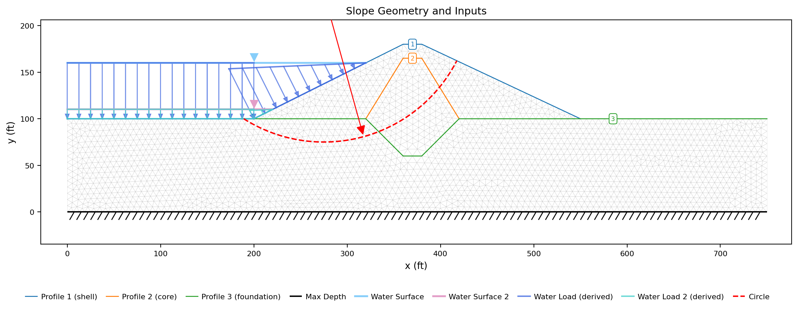
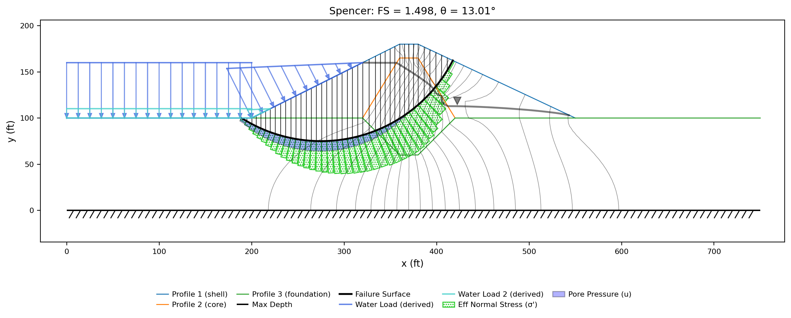
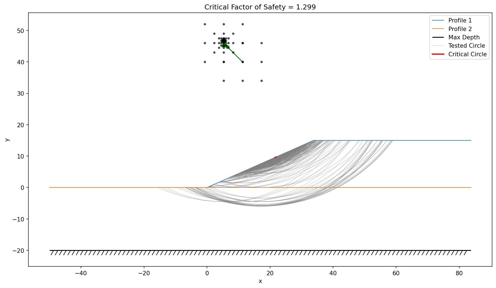
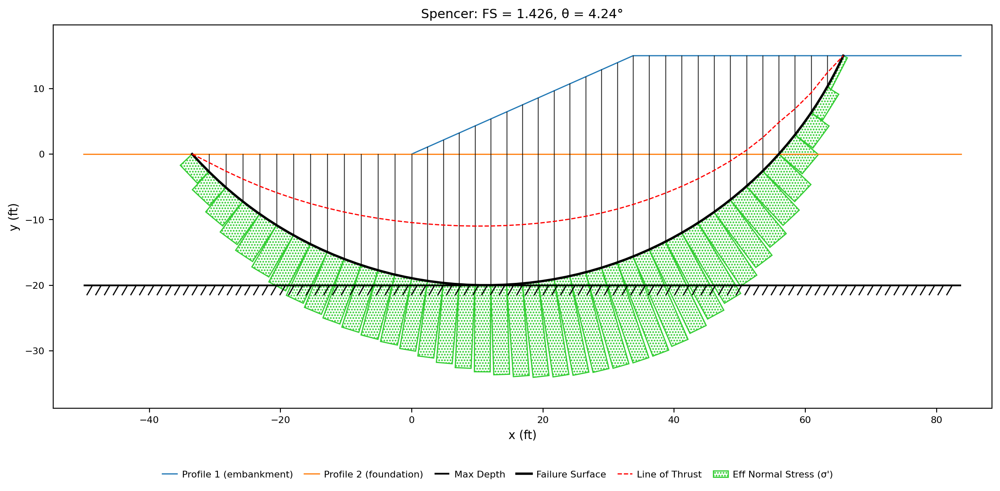
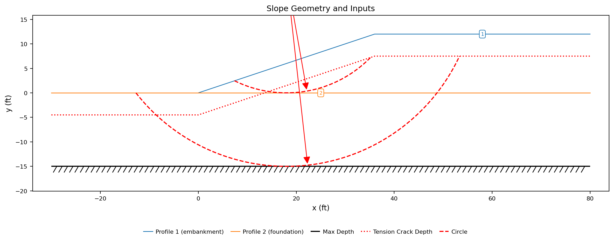
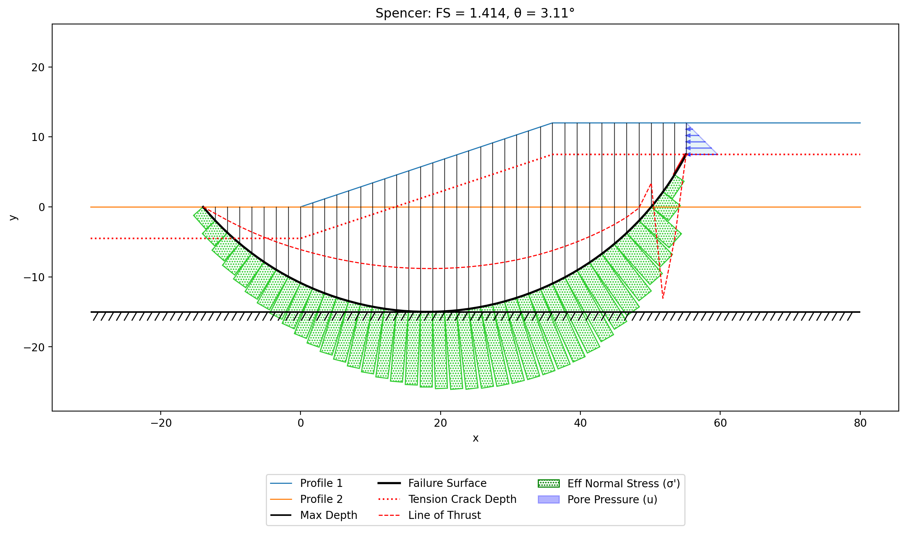
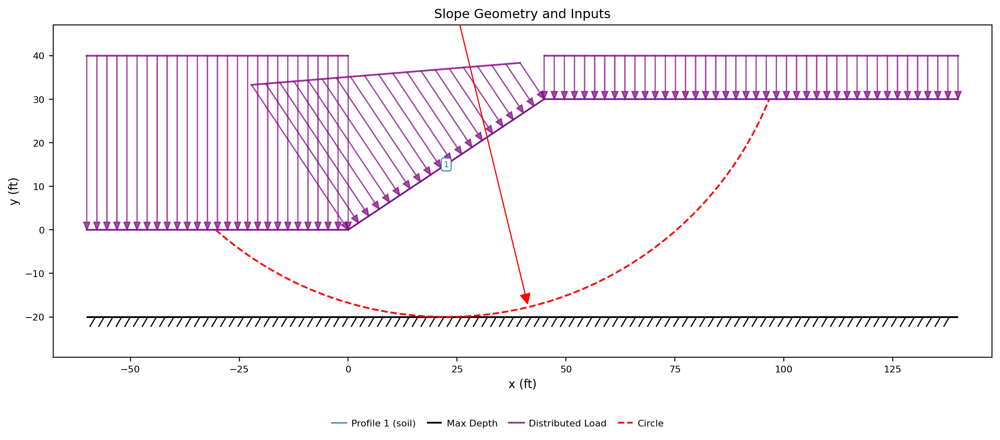
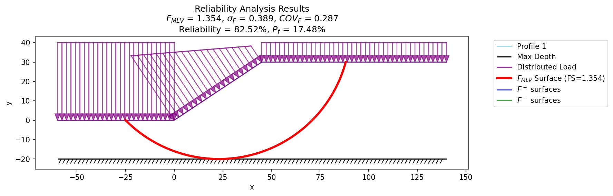

# Sample Problems - Limit Equilibrium Method

> **Verification benchmarks** (ACADS, Arai & Tagyo, and the vendor-manual corpora) are documented in the [Verification and Validation](../verification/index.md) section — see the [LEM page](../verification/lem.md).


The following examples illustrate how to use XSLOPE to perform limit equilibrium slope stability analysis. Each of the Excel input files below can be uploaded and used with the following Google Colab notebook which has been set up specifically for running slope stability analyses:

<a href="https://colab.research.google.com/github/njones61/xslope/blob/main/notebooks/xslope_lem.ipynb" target="_"></a>

The notebook allows the user to select a variety of analysis options using simple form inputs and then runs the analysis using the selected method and plots the results.

For each problem below, the solution figure shows the critical surface and factor of safety for Spencer's method, and a **Factor of safety by method** table reports the result for every applicable method. A few things to keep in mind when reading those tables:

- Each value is that method's **own** critical surface — every method runs its own search, so the surfaces (and therefore the factors of safety) are not identical between methods.
- The Ordinary Method of Slices (OMS) and Bishop's method apply only to **circular** surfaces, so they show "—" for non-circular problems.
- The methods differ by how much equilibrium they satisfy: OMS is the most approximate (and usually the most conservative), while Bishop, Janbu (corrected), Spencer, the Corps of Engineers method, and Lowe-Karafiath each enforce more of the force/moment balance. The Corps and Lowe-Karafiath force-equilibrium methods are sensitive to the assumed interslice-force inclination and can fall above the rigorous Spencer value.
- For **purely cohesive** soils ($\phi = 0$), the methods are theoretically identical on any given surface. Small differences in those tables therefore come from each method's search settling on a slightly different critical surface, not from the methods themselves.

### 1. Simple Embankment

This problem features a simple slope with a single material. 

{width=700}

Excel input file: [xslope_simple_embankment.xlsx](files/xslope_simple_embankment.xlsx)

Inputs plotted with the XSLOPE plot_inputs() function:


Solution (critical surface and factor of safety). The green bars on the base of each slice represent the effective 
stress on the base of the slice. The red bars correspond to tension at the base of the slice. The red dashed line 
represents the line of thrust computed using Spencer's method.

{width=700}

<!-- fs-table -->
**Factor of safety by method** (each method's own critical surface):

| OMS | Bishop | Janbu | Corps | Lowe | Spencer | M-P |
|---:|---:|---:|---:|---:|---:|---:|
| 1.215 | 1.215 | 1.335 | 1.319 | 1.263 | 1.276 | 1.260 |
<!-- /fs-table -->

<!-- test: file=files/xslope_simple_embankment.xlsx, type=circular_search, num_slices=40, fs_oms=1.215, fs_bishop=1.215, fs_janbu=1.335, fs_corps=1.319, fs_lowe=1.263, fs_spencer=1.276, fs_mprice=1.260 -->

Here is copy of the input file with the following variations/changes:

a) Distributed load on top of slope. q = 750 psf<br>
b) Tension crack. Depth = 3 ft. <br>
c) Tension crack filled with water.<br>
d) Submerged by 10 ft depth of water (distributed load)

Excel input file: [xslope_simple_embankment_mods.xlsx](files/xslope_simple_embankment_mods.xlsx){width=700}

Inputs:

{width=700}

Solution (critical surface and factor of safety):

{width=700}

<!-- fs-table -->
**Factor of safety by method** (each method's own critical surface):

| OMS | Bishop | Janbu | Corps | Lowe | Spencer | M-P |
|---:|---:|---:|---:|---:|---:|---:|
| 0.985 | 0.985 | 0.807 | 1.050 | 1.039 | 0.986 | 0.985 |
<!-- /fs-table -->

<!-- test: file=files/xslope_simple_embankment_mods.xlsx, type=circular_search, num_slices=40, fs_oms=0.985, fs_bishop=0.985, fs_janbu=0.807, fs_corps=1.050, fs_lowe=1.039, fs_spencer=0.986, fs_mprice=0.985 -->

### 2. Simple Slope with Foundation

This problem involves a uniform material extending below the toe of the slope. 

{width=700}

Excel input file: [xslope_simple_foundation.xlsx](files/xslope_simple_foundation.xlsx) 

Inputs plotted with the XSLOPE plot_inputs() function:

{width=700}

Solution (critical surface and factor of safety):

{width=700}

<!-- fs-table -->
**Factor of safety by method** (each method's own critical surface):

| OMS | Bishop | Janbu | Corps | Lowe | Spencer | M-P |
|---:|---:|---:|---:|---:|---:|---:|
| 0.964 | 0.964 | 1.029 | 1.120 | 1.041 | 0.964 | 0.964 |
<!-- /fs-table -->

<!-- test: file=files/xslope_simple_foundation.xlsx, type=circular_search, num_slices=40, fs_oms=0.964, fs_bishop=0.964, fs_janbu=1.029, fs_corps=1.120, fs_lowe=1.041, fs_spencer=0.964, fs_mprice=0.964 -->

### 3. Simple Slope with Multiple Layers

This problem involves a simple slope with multiple layers of material. 

{width=700}

Excel input file: [xslope_simple_mult_layers.xlsx](files/xslope_simple_mult_layers.xlsx)

Inputs plotted with the XSLOPE plot_inputs() function. Note that in this case we use two starting circles - one at 
the base each of each of the two materials - to ensure that the search algorithm finds the critical surface 
corresponding to a global and not a local minimum. 

{width=900}

Search results. Each gray line represent each circle used in the search. The dots represent the center of the 
circles used in the nine-point search algorithm, and the green arrows represent the path of grid centers taken to 
reach the critical surface. The red circle represents the critical surface.

{width=900}

Solution (critical surface and factor of safety):

{width=900}

<!-- fs-table -->
**Factor of safety by method** (each method's own critical surface):

| OMS | Bishop | Janbu | Corps | Lowe | Spencer | M-P |
|---:|---:|---:|---:|---:|---:|---:|
| 1.244 | 1.244 | 1.313 | 1.326 | 1.285 | 1.244 | 1.244 |
<!-- /fs-table -->

<!-- test: file=files/xslope_simple_mult_layers.xlsx, type=circular_search, num_slices=40, fs_oms=1.244, fs_bishop=1.244, fs_janbu=1.313, fs_corps=1.326, fs_lowe=1.285, fs_spencer=1.244, fs_mprice=1.244 -->

!!! tip "FEM reliability variant"
    This geometry is reused (with elastic properties added and the strength
    retuned to a marginally-stable c–φ profile) for a finite-element **reliability**
    example — see [FEM Sample Problems §4](../fem/samples.md).

### 4. Submerged Slope

This problem features a slope submerged by 10 ft of water. 

{width=600}

The submerged slope is analyzed by applying a distributed load over the entire slope based on the unit weight of 
water (62.4 lb/ft3) and the depth of the water at a particular point on the slope. 

Excel input file: [xslope_submerged.xlsx](files/xslope_submerged.xlsx){width=900}

Inputs plotted with the XSLOPE plot_inputs() function:

{width=900}

Solution (critical surface and factor of safety):

{width=900}

<!-- fs-table -->
**Factor of safety by method** (each method's own critical surface):

| OMS | Bishop | Janbu | Corps | Lowe | Spencer | M-P |
|---:|---:|---:|---:|---:|---:|---:|
| 1.154 | 1.154 | 0.175 | 2.011 | 1.861 | 1.154 | 1.154 |
<!-- /fs-table -->

<!-- test: file=files/xslope_submerged.xlsx, type=circular_search, num_slices=40, fs_oms=1.154, fs_bishop=1.154, fs_janbu=0.175, fs_corps=2.011, fs_lowe=1.861, fs_spencer=1.154, fs_mprice=1.154 -->

### 5. Slope with Multiple Materials and Piezometric Line

This problem features three layers of material with an effective stress analysis where pore pressures are derives 
from a piezometric line. 

{width=900}

This problem is featured as part of a graduate course on slope stability analysis (CE 544 - Slope Stability Analysis)
at Brigham Young University. The problem used in two exercises to illustrate how to solve limit equilibrium slope 
stability problems using the method of slices and an Excel spreadsheet. The problem descriptions are here:

[Ordinary Method of Slices Exercise](https://byu-ce544.readthedocs.io/en/latest/unit2/04_limiteq2/limiteq2_class/)<br>
[Bishop Simplified Procedure Homework](https://byu-ce544.readthedocs.io/en/latest/unit2/04_limiteq2/limiteq2_hw/)

In these exercises, a single circular surface was analyzed. The following Excel input file illustrates the problem:

Excel input file: [xslope_method_slices_problem.xlsx](files/xslope_method_slices_problem.xlsx)

Inputs plotted with the XSLOPE plot_inputs() function:

{width=900}

Here is the solution for just the starting circle (to match the problem description) using Bishop's simplified procedure:

{width=900}

<!-- fs-table -->
**Factor of safety by method** (each method's own critical surface):

| OMS | Bishop | Janbu | Corps | Lowe | Spencer | M-P |
|---:|---:|---:|---:|---:|---:|---:|
| 1.303 | 1.576 | 1.533 | 1.766 | 1.641 | 1.579 | 1.579 |
<!-- /fs-table -->

<!-- test: file=files/xslope_method_slices_problem.xlsx, type=single_circle, num_slices=40, fs_oms=1.303, fs_bishop=1.576, fs_janbu=1.533, fs_corps=1.766, fs_lowe=1.641, fs_spencer=1.579, fs_mprice=1.579 -->

Here is the Excel input file with multiple starting circles for a global search for the critical surface:

Excel input file: [xslope_method_slices_problem2.xlsx](files/xslope_method_slices_problem2.xlsx)

Inputs plotted with the XSLOPE plot_inputs() function:

{width=900}

Sarch results. This problem is a good example of the search path and the large number of circles that are sometimes 
tested in the search algorithm. In this case, the critical surface is isolated to sloughing of the 2nd layer.

{width=900}

Solution (critical surface and factor of safety):

{width=900}

<!-- fs-table -->
**Factor of safety by method** (each method's own critical surface):

| OMS | Bishop | Janbu | Corps | Lowe | Spencer | M-P |
|---:|---:|---:|---:|---:|---:|---:|
| 0.628 | 0.762 | 0.734 | 0.721 | 0.788 | 0.770 | 0.767 |
<!-- /fs-table -->

<!-- test: file=files/xslope_method_slices_problem2.xlsx, type=circular_search, num_slices=40, fs_oms=0.628, fs_bishop=0.762, fs_janbu=0.734, fs_corps=0.721, fs_lowe=0.788, fs_spencer=0.770, fs_mprice=0.767 -->

### 6. Slope with Eight Layers

This problem features a slope with eight soil layers. This problem was featured in the user manual for the UTEXASED 
slope stability analysis software developed by  at the University of Texas at Austin by Stephen G. Wright. If 
features a series of alternating layers, some of which are analyzed with an effective stress analysis and a 
piezometric line, and some of which are analyzed using a total stress analysis. We will assume that the base (max 
depth) is 10 ft below the top of the bottom material.

{width=900}

In the input file, the slope face rises 20 ft over a 45-ft run (2.25H:1V), and the water
table / piezometric line is horizontal at 2 ft below the toe-level ground surface
(elevation −2, inside the top foundation layer).

To find the critical surface and the global minimum factor of safety, we must use a circle starting at the base of 
each layer. The following Excel input file illustrates the problem.

Excel input file: [xslope_eight_layers.xlsx](files/xslope_eight_layers.xlsx)

Inputs plotted with the XSLOPE plot_inputs() function:

{width=900}

Search results:

{width=900}

Solution (critical surface and factor of safety):

{width=900}

<!-- fs-table -->
**Factor of safety by method** (each method's own critical surface):

| OMS | Bishop | Janbu | Corps | Lowe | Spencer | M-P |
|---:|---:|---:|---:|---:|---:|---:|
| 0.805 | 1.154 | 1.160 | 1.240 | 1.060 | 1.189 | 1.170 |
<!-- /fs-table -->

<!-- test: file=files/xslope_eight_layers.xlsx, type=circular_search, num_slices=40, fs_oms=0.805, fs_bishop=1.154, fs_janbu=1.160, fs_corps=1.240, fs_lowe=1.060, fs_spencer=1.189, fs_mprice=1.170 -->

### 7. Non-Circular Failure Surface

This problem features a thin weak layer in the foundation of a slope. In such cases, a non-circular failure surface 
constrained to fit in the weak layer often corresponds to the critical failure surface. This can be modeled with 
non-circular options in XSLOPE. This problem is also featured in the user manual for the UTEXASED slope stability 
analysis software developed by Stephen G. Wright at the University of Texas at Austin.

{width=900}

The non-circular failure surface is modeled with the following Excel input file. The failure surface is defined by 
four points. The first and last point are assigned the "Free" option, which causes them to be automatically 
calculated based on the slope geometry. The two middle points are assigned the "Horiz" option, which causes them to 
be moved horizontally inside the weak layer.

Excel input file: [xslope_noncircular.xlsx](files/xslope_noncircular.xlsx)

Inputs plotted with the XSLOPE plot_inputs() function:

{width=900}

Search results:

{width=900}

!!! note
    The search algorithm for non-circular failure surfaces is highly sensitive to the starting location. It the 
    angle of the wedge at the toe of the slope is too steep, there will be tension at the toe of the slope and the search 
    will fail to find a correct solution.

Solution (critical surface and factor of safety):

{width=900}

<!-- fs-table -->
**Factor of safety by method** (each method's own critical surface):

| OMS | Bishop | Janbu | Corps | Lowe | Spencer | M-P |
|---:|---:|---:|---:|---:|---:|---:|
| — | — | 1.657 | 1.794 | 1.369 | 1.739 | 1.710 |
<!-- /fs-table -->

<!-- test: file=files/xslope_noncircular.xlsx, type=noncircular_search, num_slices=40, fs_janbu=1.657, fs_corps=1.794, fs_lowe=1.369, fs_spencer=1.739, fs_mprice=1.710 -->

### 8. Earth Dam 

This problem features a dam with a shell and a clay core on top of a foundation with a clay layer and a sand layer. 
This problem was featured on page 121 of Shear Strength and Slope Stability - Second Edition by Duncan, Wright, and 
Brandon. 


The material properties are as follows:

|  Mat   | c' (psf) | $\phi$' (degrees) | γ (pcf) |
|:------:|:--------:|:-----------------:|:-------:|
| Shell  |    0     |        34         |   125   |
|  Core  |   100    |        26         |   122   |
|  Clay  |    0     |        24         |   123   |
|  Sand  |    0     |        32         |   127   |

**Upstream side of the dam**

First, we will analyze the upstream side. This is accomplished by defining starting circles on the upstream side of the 
dam. The following Excel input file illustrates the problem.

Excel input file: [xslope_earth_dam_up.xlsx](files/xslope_earth_dam_up.xlsx)

Inputs plotted with the XSLOPE plot_inputs() function:

{width=900}

Search results:

{width=900}

Solution (critical surface and factor of safety):

{width=900}

<!-- fs-table -->
**Factor of safety by method** (each method's own critical surface):

| OMS | Bishop | Janbu | Corps | Lowe | Spencer | M-P |
|---:|---:|---:|---:|---:|---:|---:|
| n/a\* | 1.815 | n/a\* | 2.072 | 2.018 | 1.800 | 1.795 |

\* OMS and Janbu are not reported for this problem. On a fully-submerged slope their simplified equations cannot balance the large reservoir water load, so they return a spurious near-zero factor of safety; the rigorous methods (Bishop, Spencer, Corps, Lowe) remain reliable. See the OMS and Janbu method notes.
<!-- /fs-table -->

<!-- test: file=files/xslope_earth_dam_up.xlsx, type=circular_search, num_slices=40, fs_bishop=1.815, fs_corps=2.072, fs_lowe=2.018, fs_spencer=1.800, fs_mprice=1.795 -->

**Downstream side of the dam**

Next, we will analyze the other side of the dam by defining starting circles on the downstream 
side of the dam. 

Excel input file: [xslope_earth_dam_down.xlsx](files/xslope_earth_dam_down.xlsx)

Inputs plotted with the XSLOPE plot_inputs() function:

{width=900}

Search results:

{width=900}

Solution (critical surface and factor of safety):

{width=900}

<!-- fs-table -->
**Factor of safety by method** (each method's own critical surface):

| OMS | Bishop | Janbu | Corps | Lowe | Spencer | M-P |
|---:|---:|---:|---:|---:|---:|---:|
| 1.386 | 1.561 | 1.470 | 1.595 | 1.568 | 1.558 | 1.559 |
<!-- /fs-table -->

<!-- test: file=files/xslope_earth_dam_down.xlsx, type=circular_search, num_slices=40, fs_oms=1.386, fs_bishop=1.561, fs_janbu=1.470, fs_corps=1.595, fs_lowe=1.568, fs_spencer=1.558, fs_mprice=1.559 -->

### 9. Reinforced Slope

This problem features an engineered slope with six layers of geogrid reinforcement. This problem was featured in the 
user manual for the UTEXASED slope stability analysis software developed by Stephen G. Wright at the University of Texas 
at Austin.

{width=900}

A 240 psf surcharge is applied along the slope crest from x = 30 to x = 100. For each line of reinforcement, the full tensile force develops over a length of 4 ft. The toe of the slope corresponds
to (0, 0) and the top of the slope corresponds to (30, 24). The six reinforcement lines are horizontal at elevations y = 0, 4, 8, 12, 16, and 20 ft (the lowest at the toe elevation); each starts on the slope face and is 20 ft long. 

The following Excel input file illustrates the problem. The soil reinforcement is entered in the "reinforce" sheet.

Excel input file: [xslope_reinforce.xlsx](files/xslope_reinforce.xlsx)

Inputs plotted with the XSLOPE plot_inputs() function:

{width=900}

Solution (critical surface and factor of safety):

{width=900}

<!-- fs-table -->
**Factor of safety by method** (each method's own critical surface):

| OMS | Bishop | Janbu | Corps | Lowe | Spencer | M-P |
|---:|---:|---:|---:|---:|---:|---:|
| 1.480 | 1.593 | 1.524 | 1.377 | 1.597 | 1.587 | 1.587 |
<!-- /fs-table -->

<!-- test: file=files/xslope_reinforce.xlsx, type=circular_search, num_slices=40, fs_oms=1.480, fs_bishop=1.593, fs_janbu=1.524, fs_corps=1.377, fs_lowe=1.597, fs_spencer=1.587, fs_mprice=1.587 -->

!!! note
    This problem is UTEXASED's Example 5 (Wright), whose reported solution is FS = 1.646 (Spencer) on a critical
    circle centered at (3.2, 42.0) with R = 43.4. XSLOPE's Spencer solution **on that same circle is FS = 1.646**
    — the two programs' reinforcement mechanics agree (with either the Tangent or Axial direction setting; the
    geogrid crossings on this deep circle occur where the slip surface is nearly parallel to the horizontal
    reinforcement, so the two directions differ by less than 0.1% here). The lower value in the table above arises
    because XSLOPE's automated search finds a **shallower critical surface** (center near (−5, 47), FS = 1.587)
    in a region UTEXASED's tangent-line grid search modes did not explore. UTEXASED's own example documentation
    notes that this model's thin cohesive face layer was added specifically to discourage shallow face surfaces —
    the shallower minimum is a real feature of the model, not a solver disagreement.

A mirrored (right-facing) variant of this model, with the reinforcement set to Type = Nail (Axial direction,
Passive application), is included as a regression guard on the v12 support mechanics: every method must return
the same factor of safety on the mirrored geometry as on the original for each Dir/Appl combination, and the
values below pin the axial + passive path on a right-facing slope.

<!-- test: file=files/xslope_reinforce_rface.xlsx, type=circular_search, num_slices=40, fs_oms=1.282, fs_bishop=1.475, fs_janbu=1.420, fs_spencer=1.471, fs_corps=1.091, fs_lowe=1.477, fs_mprice=1.471 -->
<!-- test: file=files/xslope_reinforce_rface.xlsx, type=mp_spencer -->
<!-- test: file=files/xslope_reinforce_rface.xlsx, type=roundtrip -->

### 10. Slope Stabilized with Piles

This problem features a 1:1 slope in a medium-stiff clay stabilized by two rows of drilled shafts.

{width=900}

Excel input file: [xslope_piles.xlsx](files/xslope_piles.xlsx)

| Property | Value |
|----------|-------|
| Cohesion, $c$ | 200 psf |
| Friction angle, $\phi$ | 20 degrees |
| Unit weight, $\gamma$ | 120 pcf |
| Pile diameter, $D$ | 2.0 ft |
| Pile spacing, $S$ | 6.0 ft |
| $V_{\text{cap}}$ | 46,000 lb |
| $M_{\text{cap}}$ | 60,000 ft·lb |

#### Results Without Piles (FS = 1.15)

{width=900}

#### Results With Piles (FS = 1.85)

{width=900}

The two rows of piles increase the factor of safety from 1.15 to 1.85.

#### Ito & Matsui Summary

The pile force $H$ is not specified directly in the input file. Instead, XSLOPE auto-computes $H$ using the
Ito & Matsui (1975) method, which models the plastic flow of soil between adjacent piles to determine the lateral
resistance. Because $H$ is computed for each trial failure surface during the search, the pile resistance varies
with the depth of the failure surface at the pile location.

Structural capacity limits ($V_{\text{cap}}$ = 46,000 lb, $M_{\text{cap}}$ = 60,000 ft·lb) are specified for
each pile, consistent with a 2-ft diameter reinforced concrete section ($f'_c$ = 4000 psi). For the critical
failure surface, the Ito & Matsui soil forces far exceed the structural capacity, and the moment capacity
controls:

```text
  === Ito & Matsui Summary (Pile 1) ===
  Pile diameter (D)          = 2.0
  Pile spacing (S)           = 6.0
  Clear spacing (D1 = S - D) = 4.0
  Depth to failure surface   = 9.5
  Coefficients: A1 = 7.569, A2 = 4.755
  Force per pile (F_pile)    = 39810
  Force per unit width (H)   = 6635.1
  --- Structural Capacity Check ---
  V_cap = 46000  (F_pile within shear capacity)
  M_cap = 60000, L_m = 3.72, F_limit = M_cap/L_m = 16139  (F_pile exceeds moment capacity)
  Controlled by moment (M_cap/L_m)
  F_pile: 39810 -> 16139 (capped)
  H:      6635.1 -> 2689.8 (capped)

  === Ito & Matsui Summary (Pile 2) ===
  Pile diameter (D)          = 2.0
  Pile spacing (S)           = 6.0
  Clear spacing (D1 = S - D) = 4.0
  Depth to failure surface   = 13.9
  Coefficients: A1 = 7.569, A2 = 4.755
  Force per pile (F_pile)    = 76447
  Force per unit width (H)   = 12741.2
  --- Structural Capacity Check ---
  V_cap = 46000  (F_pile exceeds shear capacity)
  M_cap = 60000, L_m = 5.28, F_limit = M_cap/L_m = 11356  (F_pile exceeds moment capacity)
  Controlled by moment (M_cap/L_m)
  F_pile: 76447 -> 11356 (capped)
  H:      12741.2 -> 1892.6 (capped)
```

The Ito & Matsui soil forces (39,810 and 76,447 lb per pile) represent the theoretical upper bound on what the soil
can push onto the pile. These greatly exceed both the shear and moment capacities. After capping, the effective
pile forces are reduced by 59% and 85% respectively, with the moment capacity ($M_{\text{cap}} / L_m$) controlling
in both cases. Without the capacity checks, the LEM would overestimate the pile resistance and produce an
unconservatively high factor of safety.

#### LEM vs. FEM Comparison

The corresponding FEM analysis of this problem (see [FEM Samples](../fem/samples.md), Problem 3) gives
FS = 1.32 with piles — significantly lower than the LEM result of 1.85. This difference arises because
the LEM applies the Ito & Matsui force (even after capping) as a concentrated load at the failure surface,
while the FEM beam elements only develop as much resistance as the global deformation pattern naturally
produces. The FEM result is generally considered more realistic for pile-stabilized slopes.

One more caution this problem teaches: the tabulated values are the deep-surface results the Ito & Matsui
walkthrough analyzes, found by the search seeded from the circles sheet. A grid-seeded global search
(`seed='grid'`) finds a *shallower* surface at FS ≈ 1.70 for the complete-equilibrium methods — the
pile forces make the deep basin locally attractive while a shallower mechanism governs. See the
[Multiple Local Minima](#13-multiple-local-minima) discussion; checking the shallow bypass is part of
pile design.

<!-- fs-table -->
**Factor of safety by method** (each method's own critical surface):

| OMS | Bishop | Janbu | Corps | Lowe | Spencer | M-P |
|---:|---:|---:|---:|---:|---:|---:|
| 1.622 | 1.854 | 1.649 | 1.369 | 1.978 | 1.842 | 1.842 |
<!-- /fs-table -->

<!-- test: file=files/xslope_piles.xlsx, type=circular_search, num_slices=40, fs_oms=1.622, fs_bishop=1.854, fs_janbu=1.649, fs_corps=1.369, fs_lowe=1.978, fs_spencer=1.842, fs_mprice=1.842 -->

### 11. Polygon Input with a Sloping Bottom

This problem demonstrates two features together: **polygon-based geometry input** and a
**sloping (non-horizontal) bottom boundary**. Rather than profile lines and a horizontal
`max_depth`, the cross-section is defined directly on the `polygons` sheet as two
material-zone polygons — an embankment over a foundation — whose shared base dips from
left to right (elevation −15 on the left to −5 on the right). With polygon input there is
no `max_depth`; the union of the polygons forms the **domain polygon**, and its lower
boundary is the dipping base shown by the hatched line.

The failure surface is constrained to stay within the domain polygon. During the search,
trial circles that would dip below the sloping base are automatically rejected, so the
critical surface follows the dipping foundation rather than a fictitious flat cutoff.

Excel input file: [xslope_sloping_bottom.xlsx](files/xslope_sloping_bottom.xlsx)

Inputs plotted with the XSLOPE plot_inputs() function (filled material zones and a hatched
sloping base, instead of profile lines and a horizontal max-depth line):

{width=900}

Search results:

{width=900}

Solution (critical surface and factor of safety):

{width=900}

<!-- fs-table -->
**Factor of safety by method** (each method's own critical surface):

| OMS | Bishop | Janbu | Corps | Lowe | Spencer | M-P |
|---:|---:|---:|---:|---:|---:|---:|
| 1.244 | 1.244 | 1.313 | 1.326 | 1.285 | 1.244 | 1.244 |
<!-- /fs-table -->

<!-- test: file=files/xslope_sloping_bottom.xlsx, type=circular_search, num_slices=40, fs_oms=1.244, fs_bishop=1.244, fs_janbu=1.313, fs_corps=1.326, fs_lowe=1.285, fs_spencer=1.244, fs_mprice=1.244 -->

---

The remaining problems are **verification benchmarks**: published cases used to
validate the limit-equilibrium implementation. Each is locked into the
automated regression suite. See also the [Verification](../verification/index.md) page.

### 12. Rapid Drawdown (Johnson Reservoir Dam)

This sample exercises XSLOPE's **rapid drawdown** capability — the three-stage
procedure (Duncan, Wright & Brandon) for the *upstream* slope of an earth dam
after the reservoir is lowered faster than the low-permeability zones can drain.
The Johnson Reservoir dam is analyzed on its upstream design circle:

- **Stage 1** — pre-drawdown stability with drained strengths and full-pool
  (El. 160 ft) pore pressures.
- **Stage 2** — post-drawdown stability with the interpolated undrained
  strengths (the bilinear $d$, $\psi$ envelope on the core and foundation; the
  shell is free-draining).
- **Stage 3** — post-drawdown check with drained strengths and the lowered-pool
  (El. 110 ft) pore pressures.

The governing factor of safety is the **minimum of Stage 2 and Stage 3**. Pore
pressures for both pool levels come from finite-element seepage solutions
(`u = seep`), and the two reservoir levels are carried as the two distributed-load
and seepage-boundary-condition sets that the rapid-drawdown wrapper swaps in per
stage. See [Rapid Drawdown Analysis](rapid.md) for the methodology.

Excel input file: [xslope_johnson_rapid_KEY.xlsx](files/xslope_johnson_rapid_KEY.xlsx)
(the seepage mesh and the two seep solutions are bundled alongside it).

Inputs plotted with the XSLOPE plot_inputs() function:

{width=900}

Solution (governing rapid-drawdown surface and factor of safety, Spencer's method):

{width=900}

The table reports the governing rapid-drawdown FS on the upstream circle by
method. The two complete-equilibrium methods agree (Spencer 1.646,
Morgenstern-Price 1.649), with Bishop — which satisfies moment but not full force
equilibrium — close behind at 1.649. The Corps of Engineers (2.119) and
Lowe-Karafiath (1.804) force-equilibrium methods read **substantially higher**
here: as noted in the introduction, they are sensitive to the assumed
interslice-force inclination, and the large pore pressures carried through the
post-drawdown stages amplify that sensitivity, pushing the factor of safety well
above the rigorous Spencer value.

<!-- fs-table -->
**Factor of safety by method** (each method's own critical surface):

| OMS | Bishop | Janbu | Corps | Lowe | Spencer | M-P |
|---:|---:|---:|---:|---:|---:|---:|
| 1.355 | 1.649 | 1.686 | 2.119 | 1.804 | 1.646 | 1.649 |
<!-- /fs-table -->

<!-- test: file=files/xslope_johnson_rapid_KEY.xlsx, type=single_circle, rapid=true, num_slices=40, fs_oms=1.355, fs_bishop=1.649, fs_janbu=1.686, fs_corps=2.119, fs_lowe=1.804, fs_spencer=1.646, fs_mprice=1.649 -->

### 13. Multiple Local Minima

A two-layer slope — a **cohesionless embankment** ($c' = 0$, $\phi' = 30°$) over a
**soft clay foundation** ($c = 450$ psf, $\phi = 0$) — with two competing failure
mechanisms that a single automated search can easily confuse.

Because the embankment is cohesionless, a free search collapses onto the
**degenerate infinite-slope limit**: a vanishingly shallow, near-planar sliver high
on the slope face with $F = \tan\phi'/\tan\beta \approx 1.30$. The search figure
below shows it — every tested circle shrinks toward the face and the "critical"
surface (red) is a tiny sliver carrying essentially no sliding mass. It is a
mathematical artifact, not a design-relevant failure.

The engineering-critical mechanism is the **deep foundation failure**. Seeding a
circle **tangent to the limiting depth** (the base of the soft foundation,
$y = -20$) finds it: a deep circle through the clay with $FS \approx 1.43$. This is
the global minimum among physical surfaces — and it is *lower* than any shallow
embankment circle, so a search that stops at the sliver is both non-physical and
unconservative for the foundation. The lesson: on a cohesionless-over-soft-foundation
profile, never trust a single free search — seed circles tangent to each candidate
failure depth and compare.

**Single-seed searches can also trap on problems with concentrated forces.** The
pile-stabilized sample ([Problem 10](#10-pile-reinforced-slope)) is a measured
example: seeded from its circles sheet, the search converges to the deep surface
tabulated there (Spencer 1.842, Lowe 1.978), but the grid-seeded global search
(`seed='grid'`, which sweeps a coarse grid of centers and tangent depths before
refining) finds a *shallower* surface at $FS \approx 1.70$ for every
complete-equilibrium method — the pile forces make the deep basin locally
attractive while a shallower mechanism governs. Checking that a stabilized slope
cannot fail *around* its piles on a shallower surface is part of pile design.

Grid seeding is not a universal upgrade, however: swept across the whole sample
library, it drives the simplified and force-only methods onto exactly the
degenerate slivers this section warns about (Janbu collapsing to near-zero on a
few-foot sliver, Corps dropping below OMS), because the global sweep finds the
mathematical minimum of each method's equation with no regard for physical sense.
The tabulated sample values therefore remain single-seed by deliberate choice, and
the working practice is the same as above: run the free search, then cross-check
with `seed='grid'` and with tangent-seeded circles at each candidate depth, and
judge the surfaces — not just the numbers — before accepting any of them.

Excel input file: [xslope_mult_min_KEY.xlsx](files/xslope_mult_min_KEY.xlsx)

Inputs plotted with the XSLOPE plot_inputs() function:

{width=900}

Degenerate infinite-slope search — a free search collapses to a near-planar sliver
near the crest (critical circle in red, $FS \approx 1.30$):

{width=900}

Global minimum — the deep foundation failure found from a circle tangent to the
limiting depth (Spencer's method). All methods are evaluated on this same deep
circle:

{width=900}

<!-- fs-table -->
**Factor of safety by method** (each method's own critical surface):

| OMS | Bishop | Janbu | Corps | Lowe | Spencer | M-P |
|---:|---:|---:|---:|---:|---:|---:|
| 1.354 | 1.434 | 1.417 | 1.719 | 1.524 | 1.426 | 1.431 |
<!-- /fs-table -->

<!-- test: file=files/xslope_mult_min_KEY.xlsx, type=single_circle, num_slices=40, fs_oms=1.354, fs_bishop=1.434, fs_janbu=1.417, fs_corps=1.719, fs_lowe=1.524, fs_spencer=1.426, fs_mprice=1.431 -->

### 14. Tension Crack

A slope whose upper layer has cohesion, so an unmodified analysis produces
non-physical **tension at the crest** (and an inverted line of thrust) that
unconservatively raises the factor of safety. The remedy is a **tension crack** at
the top of the slope, whose depth follows
$d_{crack} = \dfrac{2 c_d}{\gamma}\tan\!\left(45 + \dfrac{\phi_d}{2}\right)$ with the
mobilized strengths $c_d = c/F$, $\tan\phi_d = \tan\phi / F$. Because the crack
depth depends on $F$, it is iterated to convergence; this model carries the
converged depth (`tcrack_depth` = 4.5 ft on the **main** sheet), at which the crest
tension just vanishes. The complete-equilibrium methods agree (Spencer and
Morgenstern-Price both 1.414, matching Bishop).

Excel input file: [xslope_tension_KEY.xlsx](files/xslope_tension_KEY.xlsx)

Inputs plotted with the XSLOPE plot_inputs() function:

{width=900}

Solution (critical surface with the tension crack, Spencer's method):

{width=900}

<!-- fs-table -->
**Factor of safety by method** (each method's own critical surface):

| OMS | Bishop | Janbu | Corps | Lowe | Spencer | M-P |
|---:|---:|---:|---:|---:|---:|---:|
| 1.413 | 1.414 | 1.453 | 1.673 | 1.544 | 1.414 | 1.414 |
<!-- /fs-table -->

<!-- test: file=files/xslope_tension_KEY.xlsx, type=circular_search, num_slices=40, fs_oms=1.413, fs_bishop=1.414, fs_janbu=1.453, fs_corps=1.673, fs_lowe=1.544, fs_spencer=1.414, fs_mprice=1.414 -->

### 15. Reliability Analysis (Submerged Slope)

XSLOPE can run a **reliability analysis** with any of the limit equilibrium methods
(see [Taylor Series Probability Method](../reliability/taylor.md)). Instead of a single factor of safety,
each uncertain input is given a most-likely value (MLV) and a standard deviation
($\sigma$) on the **mat** sheet. XSLOPE perturbs each variable to estimate the
standard deviation of the factor of safety ($\sigma_F$) and its coefficient of
variation ($COV_F = \sigma_F / F_{MLV}$), then forms the **lognormal reliability
index**

$$\beta_{LN} = \frac{\ln\!\left(F_{MLV} / \sqrt{1 + COV_F^2}\right)}{\sqrt{\ln\!\left(1 + COV_F^2\right)}},$$

from which the reliability $R$ and probability of failure $P_f = 1 - R$ follow.

This sample is a submerged slope in undrained clay; the unit weight and the
undrained strength are the uncertain inputs, and the water standing above the slope
is modeled as a distributed load.

Excel input file: [xslope_prob_submerged_KEY.xlsx](files/xslope_prob_submerged_KEY.xlsx)

Inputs plotted with the XSLOPE plot_inputs() function:

{width=900}

Reliability result — the $F_{MLV}$ critical surface (Spencer's method) with the
analysis summary:

{width=900}

| $F_{MLV}$ | $\sigma_F$ | $COV_F$ | $\beta_{LN}$ | Reliability $R$ | $P_f$ |
|---:|---:|---:|---:|---:|---:|
| 1.354 | 0.389 | 28.7% | 0.935 | 82.5% | 17.5% |

<!-- test: file=files/xslope_prob_submerged_KEY.xlsx, type=reliability, method=spencer, expected_beta=0.935, tolerance=0.03 -->

### 16. Saturated vs. Moist Unit Weight (γ_sat)

**⚠ FIGURE NEEDED: add result plots for the paired models below.**

Template v12 adds a saturated unit weight (`gsat`) to the material sheet. The water table — a
piezometric line or a seepage solution's u = 0 contour — is a *global* property of the problem that
splits every slice's weight into γ_sat below and γ (moist) above, independent of the per-material
pore-pressure option (the "sidecar" model). This family of samples exercises and guards every path.

**S1 — the equivalence pair (the correctness proof).** An undrained clay slope (Su = 600 psf, φ = 0)
with an internal water table, built two ways: (a) *zoned* — two material polygons split at the water
table, with γ = 120 above and γ = 127 below; (b) *sidecar* — one material with γ = 120 / γ_sat = 127
plus the same line on the piezo sheet and `u = none`, so the line affects *weight only*. The two
formulations force different slice boundaries, so they are compared at 300 slices, where they converge
to the same factor of safety (difference < 5×10⁻⁸ at build time). Input files:
`files/xslope_gsat_zoned.xlsx`, `files/xslope_gsat_sidecar.xlsx`.

<!-- test: file=files/xslope_gsat_zoned.xlsx, type=gsat_pair, file2=files/xslope_gsat_sidecar.xlsx -->
<!-- test: file=files/xslope_gsat_sidecar.xlsx, type=circular_search, num_slices=40, fs_bishop=1.420, fs_spencer=1.420, fs_janbu=1.518 -->
<!-- test: file=files/xslope_gsat_zoned.xlsx, type=circular_search, num_slices=40, fs_spencer=1.420 -->

**S2 — the line doing double duty.** The same geometry and water table, drained (c′ = 200 psf,
φ′ = 25°) with `u = piezo`: the piezometric line now supplies pore pressure *and* the unit-weight
split. Input file: `files/xslope_gsat_piezo.xlsx`.

<!-- test: file=files/xslope_gsat_piezo.xlsx, type=circular_search, num_slices=40, fs_bishop=1.538, fs_spencer=1.539, fs_janbu=1.503 -->

**S3 — seepage contour as the water table.** The earth-dam seepage model run single-stage with
`u = seep` and γ_sat: the weight split is taken from the seepage solution's u = 0 contour,
root-found on the unclamped signed pressure field (a seepage solution always beats a piezometric
line for the weight split, with a console note when both are present). Input file:
`files/xslope_gsat_seep.xlsx` (+ companion `_mesh.json` / `_seep.csv`).

<!-- test: file=files/xslope_gsat_seep.xlsx, type=circular_search, num_slices=40, fs_bishop=1.933, fs_spencer=1.912 -->

**S4 — the guard.** γ_sat supplied with *no* water table anywhere in the model: xslope warns that
the saturated unit weight can never apply, and the analysis proceeds with γ throughout. Input file:
`files/xslope_gsat_nowater.xlsx`.

<!-- test: file=files/xslope_gsat_nowater.xlsx, type=circular_search, num_slices=40, fs_bishop=1.468, fs_spencer=1.468, fs_janbu=1.565 -->

**S5 — rapid drawdown.** The rapid-drawdown sample with γ_sat added: slice weight keys off the
**pre-drawdown** (stage 1) water table in all three stages, while the pore pressures follow the
staged lines — the premise of *rapid* drawdown is that the pool drops faster than the soil drains,
so the soil stays saturated while the pore pressures fall. Input file: `files/xslope_gsat_rapid.xlsx`.

<!-- test: file=files/xslope_gsat_rapid.xlsx, type=circular_search, num_slices=40, rapid=true, fs_bishop=1.120, fs_spencer=1.121 -->
