# Sample Problems - Limit Equilibrium Method

> **Verification benchmarks** (ACADS, Arai & Tagyo, and the vendor-manual corpora) are documented in the [Verification and Validation](../verification/index.md) section — see the [Rocscience Slide2](../verification/rocscience.md) and [GeoStudio SLOPE/W](../verification/geostudio.md) corpus pages.

The following examples illustrate how to use XSLOPE to perform limit equilibrium slope stability analysis. Each of the Excel input files below can be uploaded and used with the following Google Colab notebook which has been set up specifically for running slope stability analyses:

The notebook allows the user to select a variety of analysis options using simple form inputs and then runs the analysis using the selected method and plots the results.

For each problem below, the solution figure shows the critical surface and factor of safety for Spencer's method, and most problems carry a **Factor of safety by method** table with the result for every method. On a solution figure, the green bars on the base of each slice are the effective stress there, the red bars are tension, and the red dashed line is the line of thrust computed with Spencer's method. The tables follow these conventions:

- Each value is that method's **own** critical surface — every method runs its own search, so the surfaces (and therefore the factors of safety) are not identical between methods.
- The methods differ by how much equilibrium they satisfy: OMS is the most approximate (and usually the most conservative), while Bishop, Janbu (corrected), Spencer, the Corps of Engineers method, and Lowe-Karafiath each enforce more of the force/moment balance. The Corps and Lowe-Karafiath force-equilibrium methods are sensitive to the assumed interslice-force inclination and can fall above the rigorous Spencer value.
- For **purely cohesive** soils ($\phi = 0$), the methods are theoretically identical on any given surface. Small differences in those tables therefore come from each method's search settling on a slightly different critical surface, not from the methods themselves.

### 1. Simple Slope with Foundation

This problem involves a uniform material extending below the toe of the slope. 

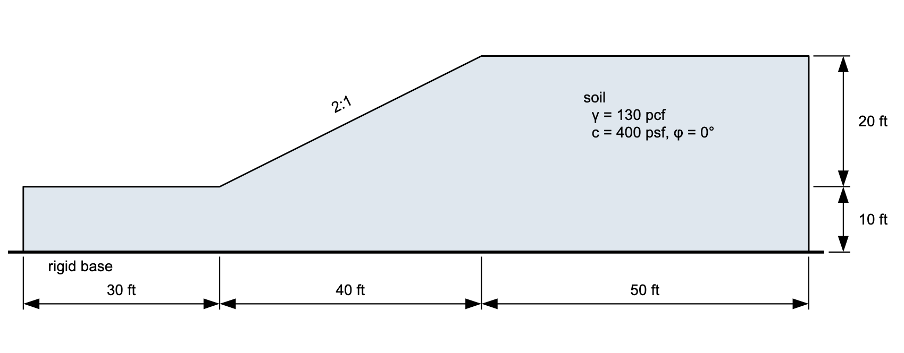{width=1000}

Excel input file: [xslope_simple_foundation.xlsx](files/xslope_simple_foundation.xlsx) 

Inputs plotted with the XSLOPE plot_inputs() function:

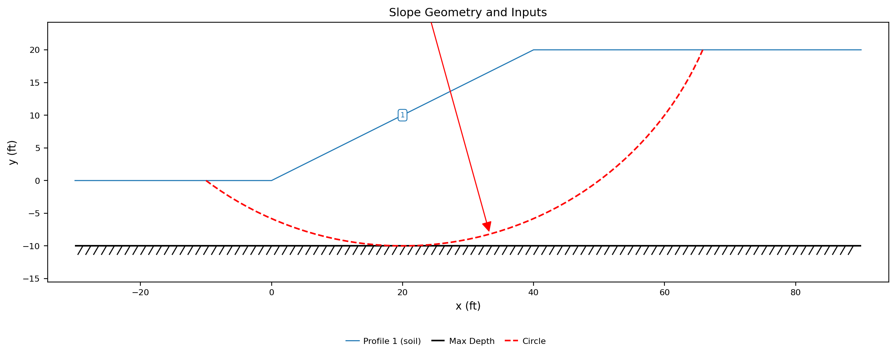{width=700}

Solution (critical surface and factor of safety):

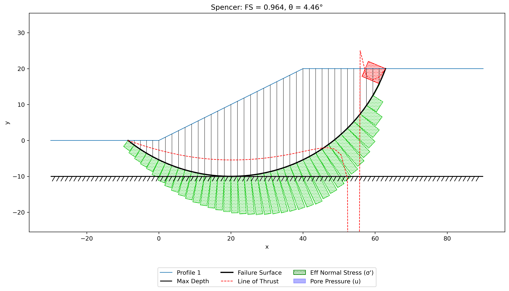{width=700}

<!-- fs-table -->
**Factor of safety by method** (each method's own critical surface):

| OMS | Bishop | Janbu | Corps | Lowe | Spencer | M-P |
|---:|---:|---:|---:|---:|---:|---:|
| 0.964 | 0.964 | 1.029 | 1.120 | 1.041 | 0.964 | 0.964 |
<!-- /fs-table -->

<!-- test: file=files/xslope_simple_foundation.xlsx, type=circular_search, num_slices=40, fs_oms=0.964, fs_bishop=0.964, fs_janbu=1.029, fs_corps=1.120, fs_lowe=1.041, fs_spencer=0.964, fs_mprice=0.964 -->

### 2. Submerged Slope

This problem features a slope submerged by 10 ft of water. 

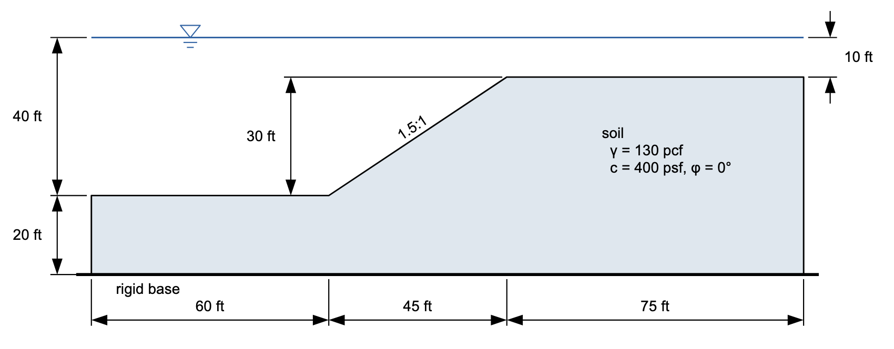{width=1000}

The submerged slope is analyzed by applying a distributed load over the entire slope based on the unit weight of 
water (62.4 lb/ft3) and the depth of the water at a particular point on the slope. 

Excel input file: [xslope_submerged.xlsx](files/xslope_submerged.xlsx){width=900}

Inputs plotted with the XSLOPE plot_inputs() function:

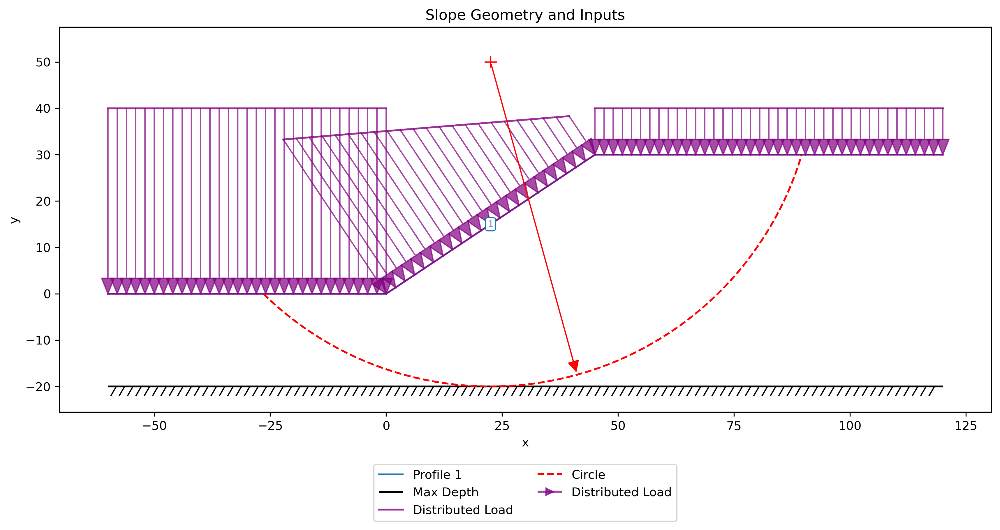{width=900}

Solution (critical surface and factor of safety):

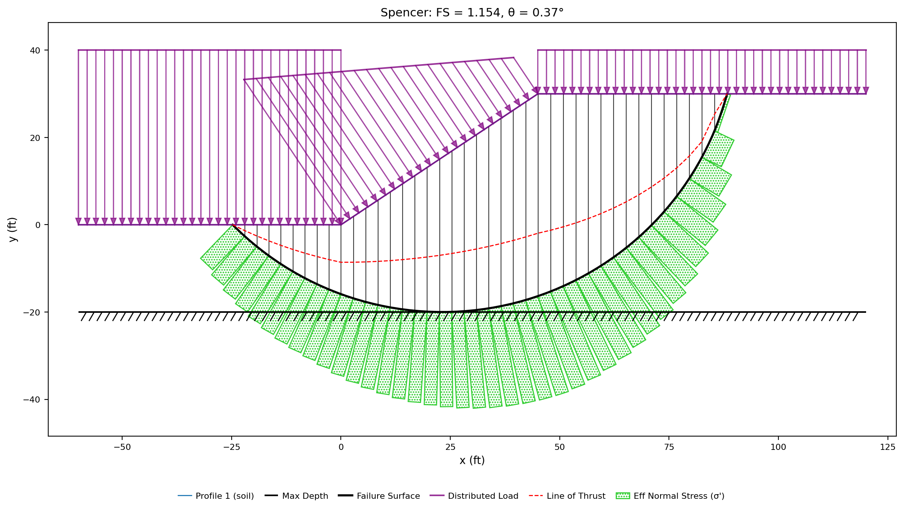{width=900}

<!-- fs-table -->
**Factor of safety by method** (each method's own critical surface):

| OMS | Bishop | Janbu | Corps | Lowe | Spencer | M-P |
|---:|---:|---:|---:|---:|---:|---:|
| 1.154 | 1.154 | 1.248 | 2.011 | 1.861 | 1.154 | 1.154 |
<!-- /fs-table -->

<!-- test: file=files/xslope_submerged.xlsx, type=circular_search, num_slices=40, fs_oms=1.154, fs_bishop=1.154, fs_janbu=1.248, fs_corps=2.011, fs_lowe=1.861, fs_spencer=1.154, fs_mprice=1.154 -->

### 3. Slope with Eight Layers

This problem features a slope with eight soil layers. This problem was featured in the user manual for the UTEXASED 
slope stability analysis software developed by Stephen G. Wright at the University of Texas at Austin. It 
has a series of alternating layers, some of which are analyzed with an effective stress analysis and a 
piezometric line, and some of which are analyzed using a total stress analysis. We will assume that the base (max 
depth) is 10 ft below the top of the bottom material.

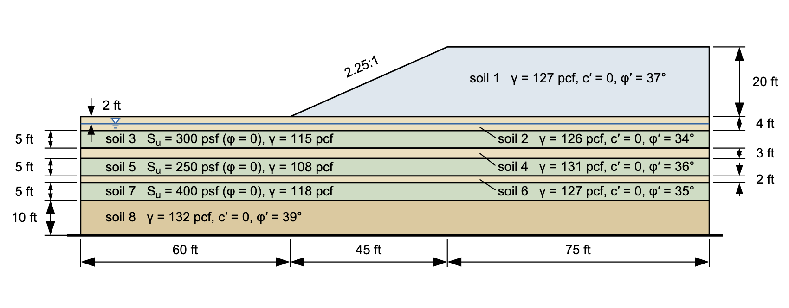{width=1000}

In the input file, the slope face rises 20 ft over a 45-ft run (2.25H:1V), and the water
table / piezometric line is horizontal at 2 ft below the toe-level ground surface
(elevation −2, inside the top foundation layer).

To find the critical surface and the global minimum factor of safety, we must use a circle starting at the base of 
each layer. The following Excel input file illustrates the problem.

Excel input file: [xslope_eight_layers.xlsx](files/xslope_eight_layers.xlsx)

Inputs plotted with the XSLOPE plot_inputs() function:

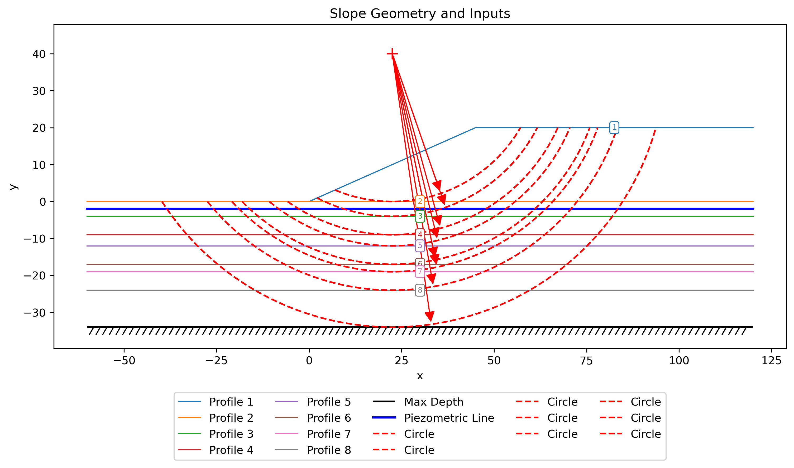{width=900}

Search results:

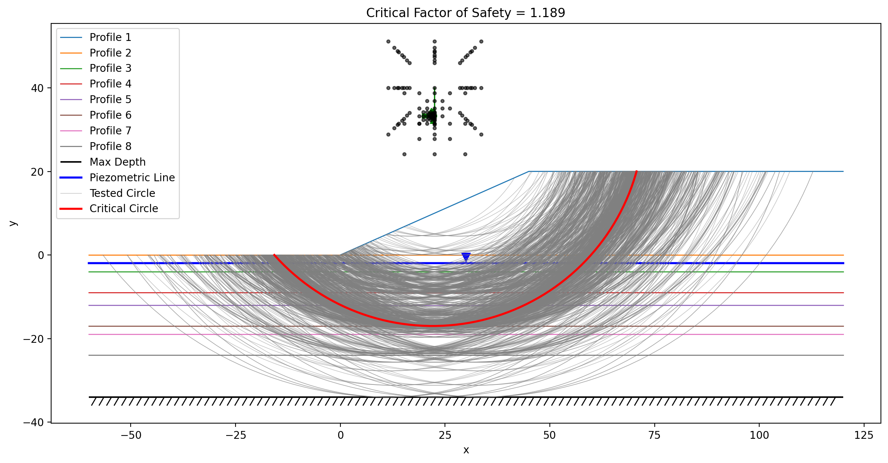{width=900}

Solution (critical surface and factor of safety):

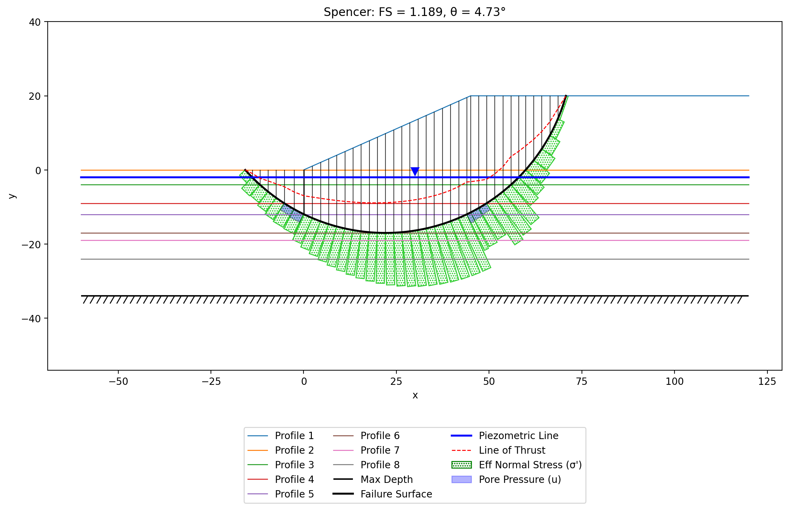{width=900}

<!-- fs-table -->
**Factor of safety by method** (each method's own critical surface):

| OMS | Bishop | Janbu | Corps | Lowe | Spencer | M-P |
|---:|---:|---:|---:|---:|---:|---:|
| 0.805 | 1.154 | 1.160 | 1.240 | 1.060 | 1.189 | 1.170 |
<!-- /fs-table -->

<!-- test: file=files/xslope_eight_layers.xlsx, type=circular_search, num_slices=40, fs_oms=0.805, fs_bishop=1.154, fs_janbu=1.160, fs_corps=1.240, fs_lowe=1.060, fs_spencer=1.189, fs_mprice=1.170 -->

A grid search on this model (`seed='grid'`, which sweeps a coarse grid of centers and
tangent depths before refining) reaches circles that the search from the file's circles
never visits, and on one of them the **force-equilibrium** equation has no root that
corresponds to a physically possible sliding mass. Its ten roots there range from 0.12 to
2.55, while Bishop, Spencer and Morgenstern-Price all give about 9.1 on the same slices.
The Corps of Engineers method rejects that surface with a message giving the reason
instead of reporting 0.12 (see
[Force Equilibrium Methods](force_eq.md#solving-for-the-factor-of-safety)), and its
grid-seeded search reports 1.240, the same as the table above.

### 4. Earth Dam

This problem features a dam with a shell and a clay core on top of a foundation with a clay layer and a sand layer. 
This problem was featured on page 121 of Shear Strength and Slope Stability - Second Edition by Duncan, Wright, and 
Brandon. 

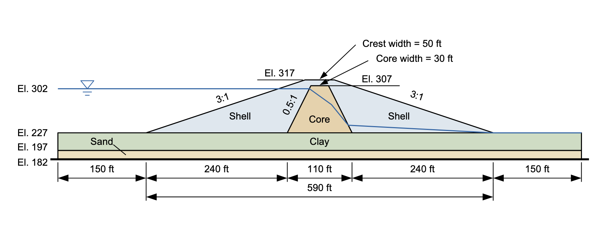{width=1000}

The material properties are as follows:

|  Mat   | c' (psf) | $\phi$' (degrees) | γ (pcf) |
|:------:|:--------:|:-----------------:|:-------:|
| Shell  |    0     |        34         |   125   |
|  Core  |   100    |        26         |   122   |
|  Clay  |    0     |        24         |   123   |
|  Sand  |    0     |        32         |   127   |

**Upstream side of the dam**

First, we will analyze the upstream side. This is accomplished by defining starting circles on the upstream side of the 
dam. The following Excel input file illustrates the problem.

Excel input file: [xslope_earth_dam_up.xlsx](files/xslope_earth_dam_up.xlsx)

Inputs plotted with the XSLOPE plot_inputs() function:

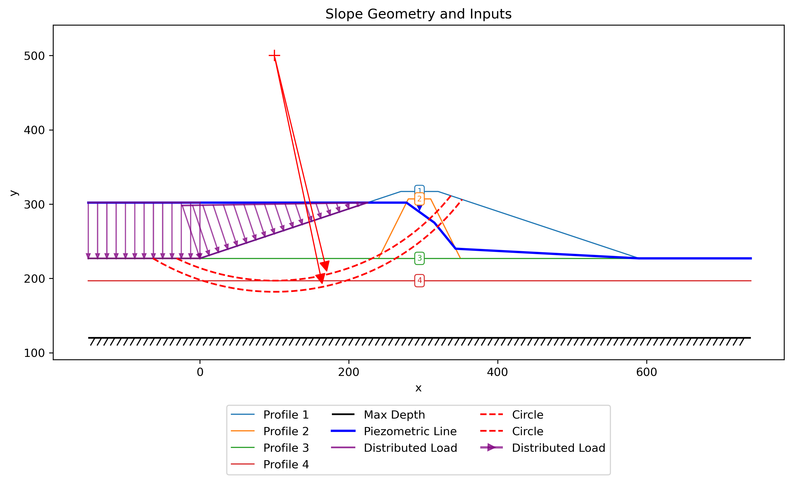{width=900}

Search results:

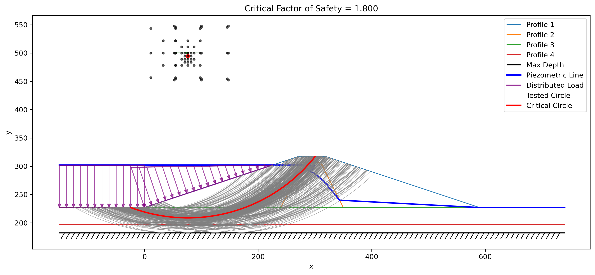{width=900}

Solution (critical surface and factor of safety):

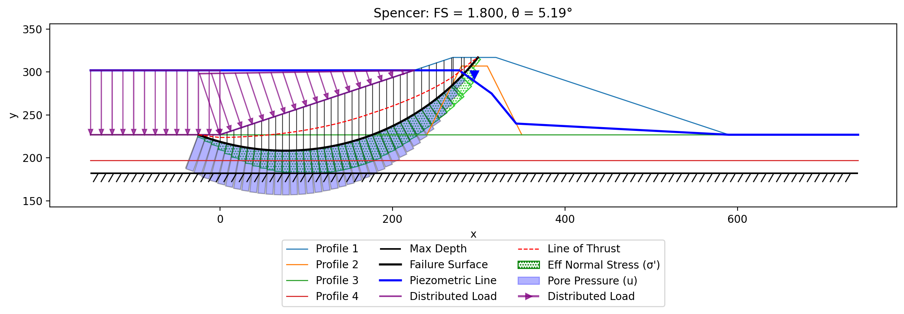{width=900}

<!-- fs-table -->
**Factor of safety by method** (each method's own critical surface):

| OMS | Bishop | Janbu | Corps | Lowe | Spencer | M-P |
|---:|---:|---:|---:|---:|---:|---:|
| n/a\* | 1.815 | 1.736 | 2.072 | 2.018 | 1.800 | 1.795 |

\* OMS is not reported for this problem. Its base normal force is the Fellenius value $W\cos\alpha + D\cos(\alpha-\beta) - u\,\Delta\ell$, which under a full reservoir goes negative on the deepest slices — a quarter of them on the surface it settles on here — so the shear resistance it computes there is meaningless and the factor of safety it reports (0.886) sits far below every other method's. See the [OMS method note](oms.md).
<!-- /fs-table -->

<!-- test: file=files/xslope_earth_dam_up.xlsx, type=circular_search, num_slices=40, fs_bishop=1.815, fs_janbu=1.736, fs_corps=2.072, fs_lowe=2.018, fs_spencer=1.800, fs_mprice=1.795 -->

**Downstream side of the dam**

Next, we will analyze the other side of the dam by defining starting circles on the downstream 
side of the dam. 

Excel input file: [xslope_earth_dam_down.xlsx](files/xslope_earth_dam_down.xlsx)

Inputs plotted with the XSLOPE plot_inputs() function:

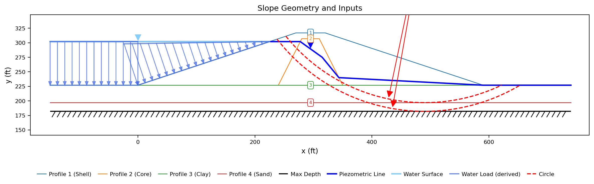{width=900}

Search results:

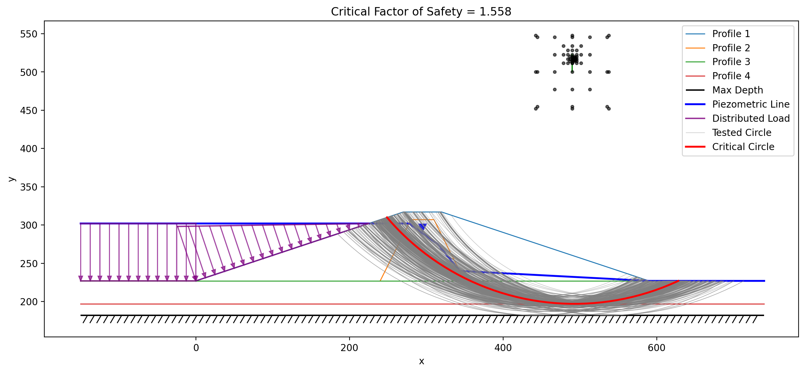{width=900}

Solution (critical surface and factor of safety):

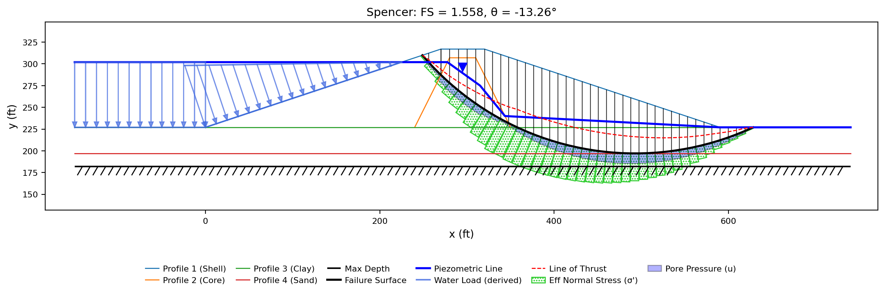{width=900}

<!-- fs-table -->
**Factor of safety by method** (each method's own critical surface):

| OMS | Bishop | Janbu | Corps | Lowe | Spencer | M-P |
|---:|---:|---:|---:|---:|---:|---:|
| 1.386 | 1.561 | 1.470 | 1.595 | 1.568 | 1.558 | 1.559 |
<!-- /fs-table -->

<!-- test: file=files/xslope_earth_dam_down.xlsx, type=circular_search, num_slices=40, fs_oms=1.386, fs_bishop=1.561, fs_janbu=1.470, fs_corps=1.595, fs_lowe=1.568, fs_spencer=1.558, fs_mprice=1.559 -->

### 5. Tension Crack

A slope whose upper layer has cohesion, so an unmodified analysis produces
non-physical **tension at the crest** (and an inverted line of thrust) that
unconservatively raises the factor of safety. The remedy is a **tension crack** at
the top of the slope, whose depth follows
$d_{crack} = \dfrac{2 c_d}{\gamma}\tan\!\left(45 + \dfrac{\phi_d}{2}\right)$ with the
mobilized strengths $c_d = c/F$, $\tan\phi_d = \tan\phi / F$. Because the crack
depth depends on $F$, it is iterated to convergence; this model carries the
converged depth (`tcrack_depth` = 4.5 ft on the **main** sheet), at which the crest
tension just vanishes. The crack is taken as full of water (`tcrack_water` = 4.5 ft). The complete-equilibrium methods agree (Spencer and
Morgenstern-Price both 1.414, matching Bishop).

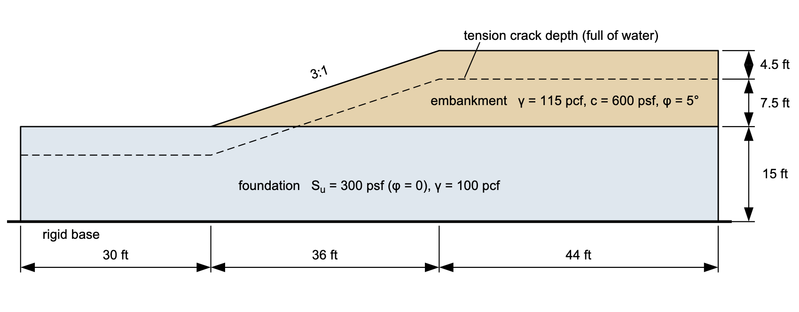{width=1000}

Excel input file: [xslope_tension_KEY.xlsx](files/xslope_tension_KEY.xlsx)

Inputs plotted with the XSLOPE plot_inputs() function:

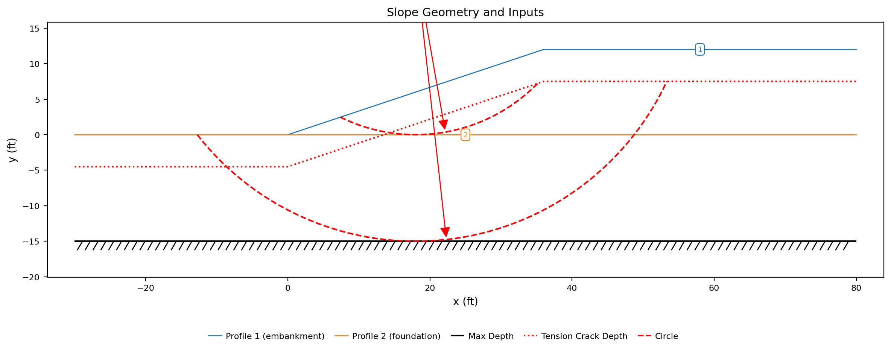{width=900}

Solution (critical surface with the tension crack, Spencer's method):

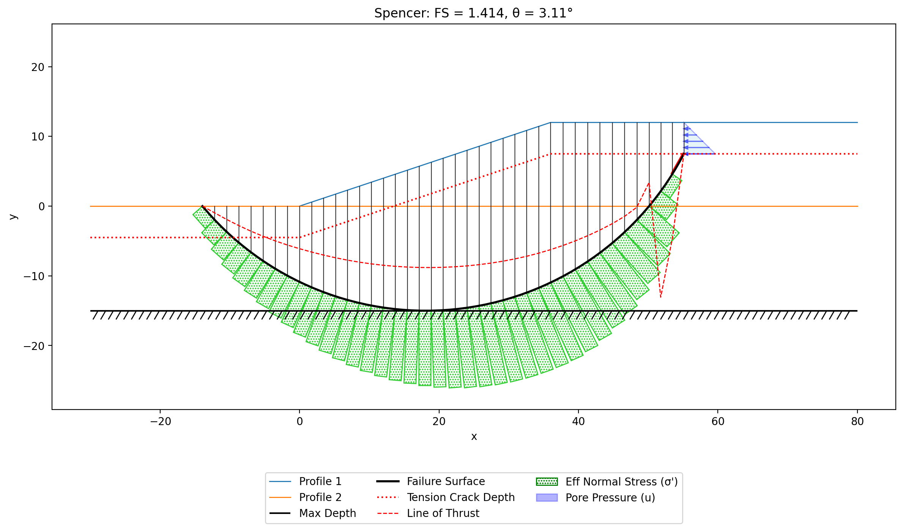{width=900}

<!-- fs-table -->
**Factor of safety by method** (each method's own critical surface):

| OMS | Bishop | Janbu | Corps | Lowe | Spencer | M-P |
|---:|---:|---:|---:|---:|---:|---:|
| 1.413 | 1.414 | 1.448 | 1.673 | 1.544 | 1.414 | 1.414 |
<!-- /fs-table -->

<!-- test: file=files/xslope_tension_KEY.xlsx, type=circular_search, num_slices=40, fs_oms=1.413, fs_bishop=1.414, fs_janbu=1.448, fs_corps=1.673, fs_lowe=1.544, fs_spencer=1.414, fs_mprice=1.414 -->

### 6. Saturated vs. Moist Unit Weight (γ_sat)

Soil below the water table weighs more than the same soil above it. On the **mat**
sheet, `gamma` is the moist unit weight and `gamma_sat` the saturated unit weight;
when a material carries both, the water table splits each slice's weight — γ_sat
below the water table, γ above it. The water table comes from whichever the model
defines: a piezometric line on the **piezo** sheet, or the phreatic surface of a
finite-element seepage solution. It belongs to the problem rather than to any one
material, so it splits the weight whether or not the material's pore-pressure
option also reads pore pressures from it.

This problem features a slope in undrained clay ($S_u = 600$ psf, $\phi = 0$) with
an internal water table: γ = 120 pcf above the water table and γ_sat = 127 pcf
below. The strength is a total-stress strength, so pore pressure never enters the
analysis (`u = none`) and the piezometric line serves only to locate the water
table. Spencer's method gives $F = 1.420$.

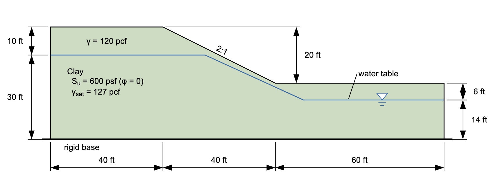{width=1000}

Excel input file: [xslope_gsat_sidecar.xlsx](files/xslope_gsat_sidecar.xlsx)

Solution (critical surface and factor of safety, Spencer's method):

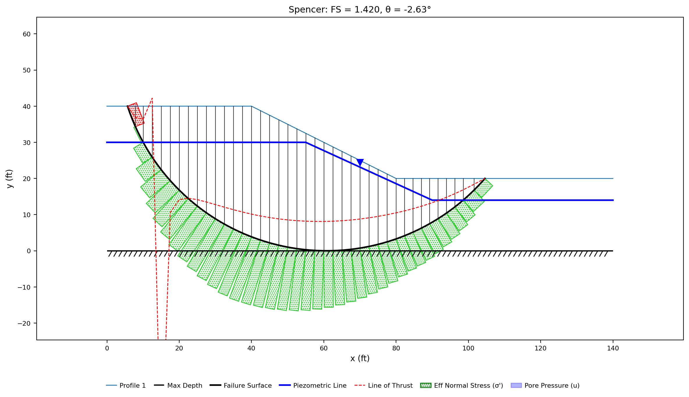{width=900}

<!-- test: file=files/xslope_gsat_sidecar.xlsx, type=circular_search, num_slices=40, fs_bishop=1.420, fs_spencer=1.420, fs_janbu=1.518 -->

The same slope built as two material zones split at the water table — 120 pcf clay
above, 127 pcf clay below — reproduces that factor of safety:
[xslope_gsat_zoned.xlsx](files/xslope_gsat_zoned.xlsx).

<!-- test: file=files/xslope_gsat_zoned.xlsx, type=gsat_pair, file2=files/xslope_gsat_sidecar.xlsx -->
<!-- test: file=files/xslope_gsat_zoned.xlsx, type=circular_search, num_slices=40, fs_spencer=1.420 -->

A model can also supply γ_sat with no water table anywhere
([xslope_gsat_nowater.xlsx](files/xslope_gsat_nowater.xlsx)); with no elevation
below which the saturated weight applies, the slope is analyzed with γ throughout.

<!-- test: file=files/xslope_gsat_nowater.xlsx, type=circular_search, num_slices=40, fs_bishop=1.468, fs_spencer=1.468, fs_janbu=1.565 -->

The same slope and water table with a drained strength ($c' = 200$ psf,
$\phi' = 25°$) and `u = piezo`: the piezometric line now supplies the pore
pressures as well as the unit-weight split.

Excel input file: [xslope_gsat_piezo.xlsx](files/xslope_gsat_piezo.xlsx)

Solution (critical surface and factor of safety, Spencer's method):

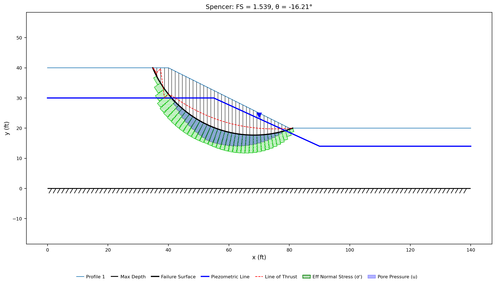{width=900}

<!-- test: file=files/xslope_gsat_piezo.xlsx, type=circular_search, num_slices=40, fs_bishop=1.538, fs_spencer=1.539, fs_janbu=1.503 -->

The water table can also come from a seepage solution. This is the upstream slope
of the earth dam of [Problem 4](#4-earth-dam) with a saturated unit weight for each
zone and `u = seep`: pore pressures are interpolated from the finite-element
seepage solution, and the phreatic surface of that same solution — the heavy
contour carrying the water-table marker in the figure below — is the water table
that splits the weights. When a model carries both a seepage solution and a
piezometric line, the seepage solution sets the split.

Excel input file: [xslope_gsat_seep.xlsx](files/xslope_gsat_seep.xlsx) (the seepage
mesh and solution are bundled alongside it).

Solution (critical surface and factor of safety, with the seepage head contours):

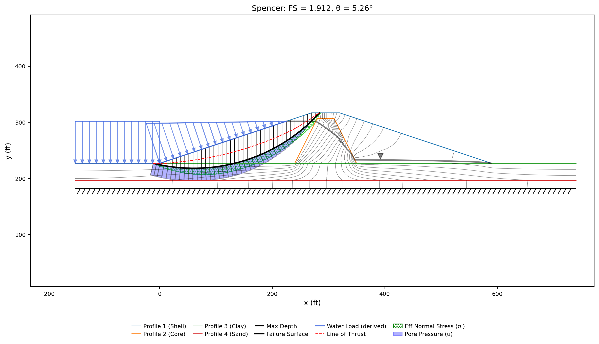{width=900}

<!-- test: file=files/xslope_gsat_seep.xlsx, type=circular_search, num_slices=40, fs_bishop=1.933, fs_spencer=1.912 -->

The same dam analyzed for [rapid drawdown](rapid.md), with the reservoir at
El. 302 ft before drawdown and El. 250 ft after. The premise of *rapid* drawdown is
that the pool falls faster than the low-permeability zones can drain, so the soil
stays saturated while the pore pressures fall. The slice weights use the
pre-drawdown water table in all three stages, while the pore pressures follow
the staged piezometric lines.

Excel input file: [xslope_gsat_rapid.xlsx](files/xslope_gsat_rapid.xlsx)

Solution (governing rapid-drawdown surface and factor of safety):

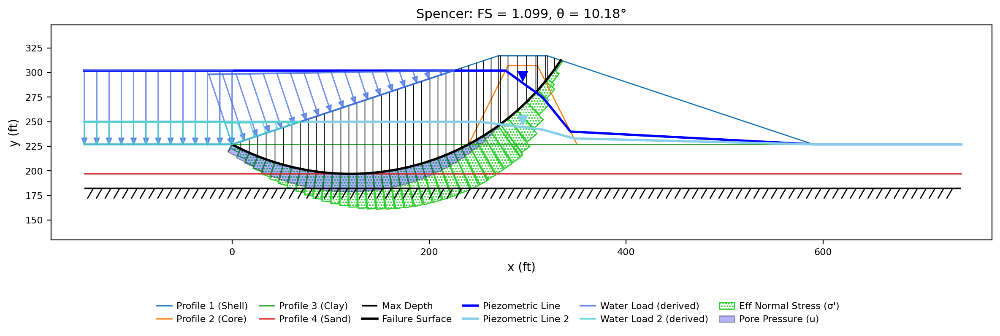{width=900}

<!-- test: file=files/xslope_gsat_rapid.xlsx, type=circular_search, num_slices=40, rapid=true, fs_bishop=1.100, fs_spencer=1.099 -->

### 7. Pile-Stabilized Slope (Hassiotis et al. 1997)

This is a published pile-stabilization benchmark. It checks that XSLOPE's built-in
Ito & Matsui force reproduces the force used in the source's design. The slope is
homogeneous, 13.7 m high at 30°, with $c = 23.94$ kPa, $\phi = 10°$ and
$\gamma = 19.63$ kN/m³, and is dry. One row of 1.0 m piles at 2.5 m centers is
placed 13.7 m horizontally from the toe, and in a second case 23.1 m from the toe.
The published clear-to-center spacing ratio $D_2/D_1 = 0.6$ is reproduced exactly:
a 1.0 m pile at 2.5 m centers leaves a 1.5 m clear opening, and $1.5/2.5 = 0.6$.

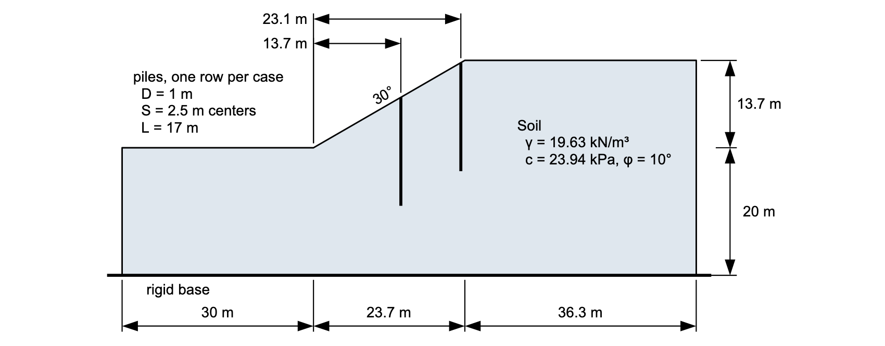{width=1000}

Inputs, with both pile stations drawn together:

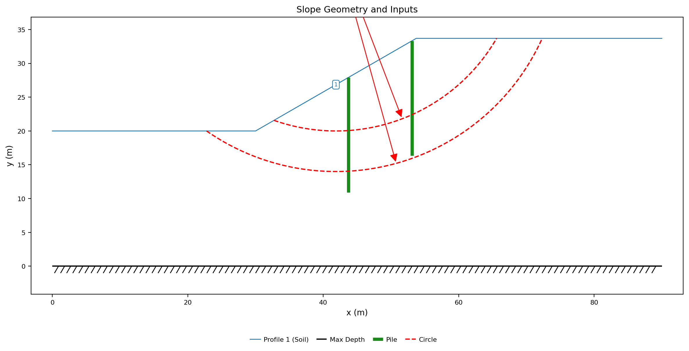{width=900}

Excel input files:
[xslope_hassiotis.xlsx](files/xslope_hassiotis.xlsx) (unreinforced),
[xslope_hassiotis_p1.xlsx](files/xslope_hassiotis_p1.xlsx) (row 13.7 m from the toe),
[xslope_hassiotis_p2.xlsx](files/xslope_hassiotis_p2.xlsx) (row 23.1 m from the toe).

| Property | Value |
|----------|-------|
| Slope height, $H$ | 13.7 m |
| Slope angle, $\beta$ | 30 degrees |
| Cohesion, $c$ | 23.94 kPa |
| Friction angle, $\phi$ | 10 degrees |
| Unit weight, $\gamma$ | 19.63 kN/m³ |
| Pile diameter, $D$ | 1.0 m |
| Pile spacing, $S$ | 2.5 m |
| Pile length, $L$ | 17 m |
| $V_{\text{cap}}$, $M_{\text{cap}}$ | not specified |

The piles carry no structural capacity limits. The source specifies none, and its
factors of safety are the full soil force, so a cap would change the quantity
being compared. $H$ is left blank, so the Ito & Matsui force is computed for every
trial surface from $D$, $S$ and the soil above that surface at the pile.

#### Unreinforced (FS = 1.105)

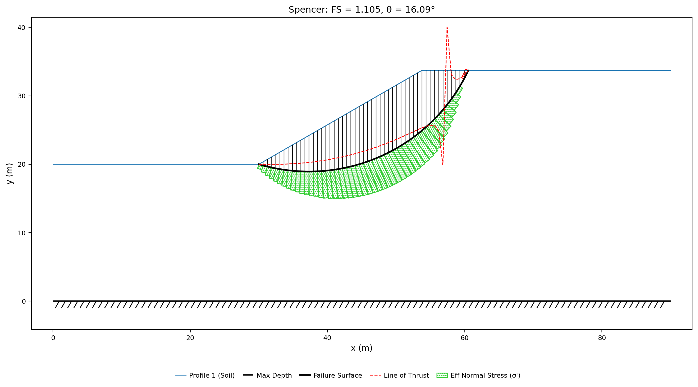{width=900}

Bishop's method gives 1.106 against the 1.12 Hull & Poulos (1999) report with the
same method (−1.2%). Hassiotis et al. report 1.08 and Ausilio et al. (2001) 1.11,
both by the friction-circle method, which XSLOPE does not implement.

<!-- test: file=files/xslope_hassiotis.xlsx, type=circular_search, num_slices=50, fs_oms=1.056, fs_bishop=1.106, fs_janbu=1.105, fs_corps=1.167, fs_lowe=1.135, fs_spencer=1.105, fs_mprice=1.104, benchmark=LEM-HASSIOTIS -->

#### Pile row 13.7 m from the toe (FS = 1.855)

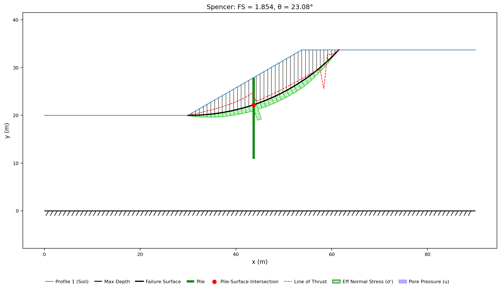{width=900}

Bishop's method gives 1.859 against 1.82 (Hassiotis et al., friction circle, +2.1%).
The row raises the factor of safety by 68%.

#### Pile row 23.1 m from the toe (FS = 1.284)

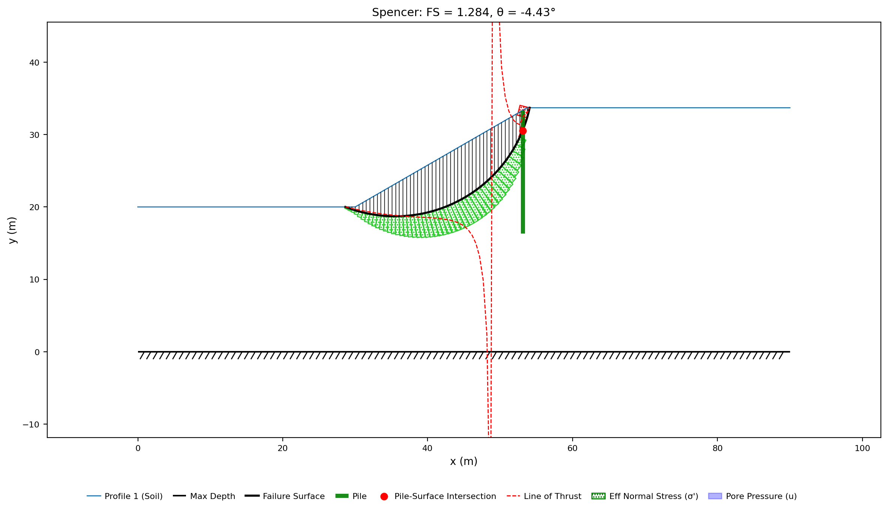{width=900}

Bishop's method gives 1.289 against 1.64 (Hassiotis et al., −21%). The row sits
0.6 m short of the crest, so every surface that reaches it crosses it within a few
meters of the pile head, where the soil column above the surface — and with it the
Ito & Matsui force — is small. Moving the entry limit 2 m further behind the crest
moves this factor of safety to 1.48, so for this row the result depends on where the
search is allowed to start.

#### Search limits

Both pile files declare a search window on their circles sheet: the surface
daylights within a few meters of the toe (exit 25–32 m), enters behind the crest
(entry 54–75 m) and keeps its lowest point above the pile tip. Without it the
search returns a deep surface that passes *below* the pile tip and collects no pile
force at all: 1.327 for the 13.7 m row, on a deeper mechanism of the unreinforced
slope that the piles do not cross. The published comparisons are for the mechanism
through the row, and their searches are restricted in the same way.

#### Ito & Matsui summary

On the critical surface for the 13.7 m row, the surface crosses the pile 5.72 m
below its head. At $D = 1.0$, $S = 2.5$ and $\phi = 10°$ the coefficients are
$A_1 = 3.2298$ and $A_2 = 1.5695$, giving a pressure of 77.3 kN/m at the head
rising to 253.4 kN/m at the surface, a force of 945.4 kN **per pile**, and

$$H = \frac{F_{\text{pile}}}{S} = \frac{945.4}{2.5} = 378.2 \ \text{kN/m of slope}$$

which is the per-unit-width value the slice equations apply, horizontally, at the
pile–surface intersection.

The same coefficients reproduce the force the source designed with. Hassiotis et
al. state 72.4 kN/m at the pile head and a 561.7 kN/m overburden term at 17 m
depth; XSLOPE's $c\,A_1 = 77.3$ kN/m (+6.8%) and $\gamma A_2 \cdot 17 = 523.8$ kN/m
(−6.7%). The two departures are in opposite directions and largely cancel in the
integral: over the published 6.56 m depth to the slip surface, the published
trapezoid gives 1185.7 kN per pile and XSLOPE's exact integration of the same law
gives 1170.2 kN, a difference of 1.3%.

#### Force direction

XSLOPE applies the pile reaction horizontally for a vertical pile and does not
divide it by the computed factor of safety (`Appl = active`). Hull & Poulos note
that the plastic-deformation theory derives the force horizontally, which is the
direction used here. Hassiotis et al. apply it parallel to the slip surface and
also leave it unfactored, so their 1.82 is the value this case is compared with.
Their 1.45 comes from a boundary-element shear and moment divided by the global
factor of safety. That is a different force model, and the value is quoted only to
show the range of published results.

<!-- fs-table -->
**Factor of safety by method** (each method's own critical surface, 13.7 m row):

| OMS | Bishop | Janbu | Corps | Lowe | Spencer | M-P |
|---:|---:|---:|---:|---:|---:|---:|
| 1.822 | 1.859 | 1.788 | 1.885 | 1.871 | 1.855 | 1.855 |
<!-- /fs-table -->

<!-- test: file=files/xslope_hassiotis_p1.xlsx, type=circular_search, num_slices=50, entry_range=54.0;75.0, exit_range=25.0;32.0, tangent_depth=11.01;33.7, fs_oms=1.822, fs_bishop=1.859, fs_janbu=1.788, fs_corps=1.885, fs_lowe=1.871, fs_spencer=1.855, fs_mprice=1.855, benchmark=LEM-HASSIOTIS -->
<!-- test: file=files/xslope_hassiotis_p2.xlsx, type=circular_search, num_slices=50, entry_range=54.0;75.0, exit_range=25.0;32.0, tangent_depth=16.44;33.7, fs_oms=1.244, fs_bishop=1.289, fs_janbu=1.373, fs_corps=1.385, fs_lowe=1.340, fs_spencer=1.284, fs_mprice=1.289, benchmark=LEM-HASSIOTIS -->
