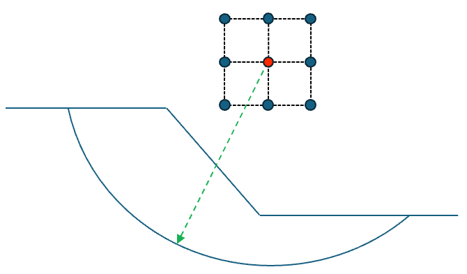
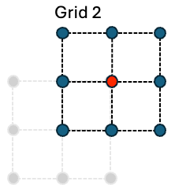
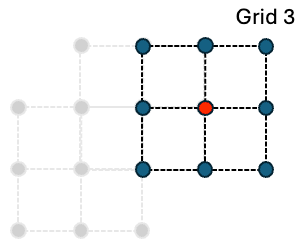
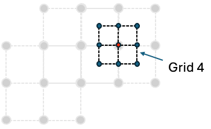
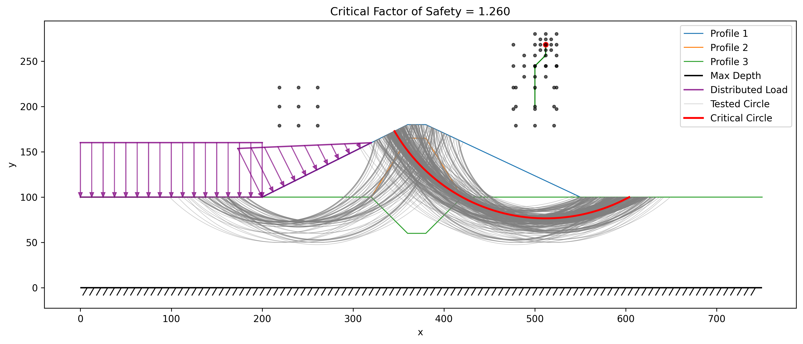

# Automated Search Algorithms

The xslope package provides sophisticated automated search algorithms for locating critical failure surfaces in slope stability analysis. These algorithms systematically explore the design space to find the surface geometry that yields the minimum factor of safety, which represents the most dangerous potential failure mode. The search functionality supports both circular and non-circular failure surfaces, each employing distinct optimization strategies tailored to the geometric constraints of the failure mechanism.

## Circular Failure Surfaces

The circular search algorithm (`circular_search()` in xslope/search.py) implements a global optimization approach using adaptive grid refinement to locate the critical circular failure surface. The algorithm begins with one or more user-defined starting circles that serve as initial guesses for the optimization process. Each starting circle is characterized by its center coordinates (Xo, Yo), depth, and radius. The search process recognizes that even if a user's initial guess is approximate, the algorithm can systematically refine the solution to find the true critical surface.

The heart of the circular search algorithm is a two-stage optimization process that operates on both the spatial location of the circle center and the depth of the failure surface. When evaluating a particular center location (x, y), the algorithm first performs a nested depth optimization. This inner optimization recognizes that for any given center point, there exists an optimal depth that minimizes the factor of safety. The depth optimizer uses a three-point bracketing approach, evaluating the factor of safety at the current best depth and at depths one step above and below it. By iteratively selecting the depth that produces the lowest factor of safety and shrinking the step size by a factor of 0.25, the algorithm converges to the locally optimal depth for that center location. This depth optimization continues until the step size falls below a tolerance threshold, typically set to 1% of the current step size.

Once the algorithm can efficiently evaluate any point in the (x, y) plane by optimizing its depth, it employs a nine-point grid search strategy to locate the optimal center coordinates. Starting from the best point found among all initial starting circles, the algorithm constructs a 3×3 grid centered on the current best location. The grid spacing is initially set to 15% of the circle radius, providing a balance between exploration and computational efficiency. The algorithm evaluates the factor of safety at all nine points on this grid, utilizing a caching mechanism to avoid redundant calculations when grid points overlap between iterations. 



After identifying which of the nine points yields the lowest factor of safety, the algorithm updates its center location if an improvement was found. For example, for the grid shown above, suppose the upper right point had the lowest FS of the 9 grid points. The next grid would then shift so that this is the center point:



The new points on this grid are then evaluated with the circles at various depths to get a new FS value for each point. Then if the grid point on the middle right had the lowest FS, the grid would shift again as follows:



Again, the new points on this grid are evaluated for minimum FS. If the best point on the grid is the center point itself (meaning no improvement was discovered), the algorithm shrinks the grid size by multiplying it by the shrink factor (default 0.5), effectively zooming in on the current location to search at a finer resolution as follows:



Each of the new points on this grid are then evaluated. This iterative process of grid evaluation and refinement continues until the **factor of safety stops changing**, rather than until the grid reaches some fixed spacing. Specifically, the search converges once two successive refinement levels each lower the best factor of safety by less than `fs_tol` (default `5e-4`, so the reported FS is stable to three decimal places), provided the center grid has already refined below a small fraction of the slope height (`min_grid_frac`, default 1%). That second condition prevents a coarse grid from stopping early on a plateau before it has resolved the true minimum. A geometric grid floor (`tol`) and an iteration cap (`max_iter`) remain only as backstops. Keying convergence on the factor of safety rather than an absolute grid length makes the stopping point **scale-invariant** — a fixed length threshold such as "grid < 0.01" would mean something entirely different on a 20 ft slope than on a 500 ft slope. The algorithm tracks its progression through the search space, recording each jump to a new best location along with the corresponding factor of safety. Diagnostic output reports the center coordinates, factor of safety, and grid size at each iteration. The search typically converges within 10-20 iterations, depending on the complexity of the slope geometry and the quality of the initial starting guess.

Throughout the search process, the algorithm maintains a comprehensive cache (`fs_cache`) that stores every evaluated circle configuration along with its computed factor of safety and associated solution details. This cache serves multiple purposes: it prevents redundant calculations, enables post-analysis visualization of the entire search space, and provides a ranked list of all evaluated failure surfaces. The cache is implemented as a dictionary keyed by (x, y) coordinates, with each entry storing the circle center coordinates, depth, factor of safety, slice dataframe, failure surface geometry, and the detailed solver results.

At the end of the process, the search results can be displayed using the **plot_circular_search_results** function as follows:



Note that all circles tested in the search are displayed along with all grid points evaluated using the 9-point search algorithm. Furthermore, the sequence of center points for the moving 9-point grids are connected with a series of arrows showing the "search path".

## Non-Circular Failure Surfaces

The non-circular search algorithm (`noncircular_search()` in xslope/search.py) takes a fundamentally different approach from the circular search, as it must optimize the positions of multiple control points that define an arbitrary failure surface rather than just optimizing a center and depth. The algorithm begins with a user-defined initial failure surface specified as a sequence of points in the slope_data['non_circ'] array. Each point in this sequence is characterized by its x and y coordinates along with a movement constraint that controls how the point is allowed to move during the optimization process.

The movement constraints are critical to ensuring that the optimized failure surface remains physically realistic and geometrically valid. Points can be designated as "Fixed" (remaining stationary throughout the search), "Horiz" (allowed to move only horizontally), or "Free" (able to move in any direction that reduces the factor of safety). The endpoints of the failure surface have special handling—they are constrained to remain on the ground surface, with only their x-coordinates varying. When an endpoint moves horizontally, its y-coordinate is automatically updated by finding the intersection of a vertical line at the new x-position with the ground surface. This ensures that the failure surface always properly intersects the slope face at both ends.

The optimization algorithm employs a coordinate descent strategy, systematically attempting to move each point to reduce the overall factor of safety. During each iteration, the algorithm cycles through all points in the failure surface, and for each movable point, it tests movements in both the positive and negative directions. For points constrained to horizontal movement, these directions are simply left and right displacements. For free points, however, the algorithm implements a more sophisticated movement strategy: it moves each free point perpendicular to the local tangent of the failure surface. This perpendicular movement is calculated by finding the tangent vector between the point's neighbors, rotating it 90 degrees, and normalizing it to the current movement distance. This approach naturally tends to smooth out irregularities in the surface while allowing it to deform toward lower factors of safety.

The movement distance parameter controls the step size of these trial movements, starting at a user-specified initial value (typically 4.0 length units). After attempting to move each point in both directions, the algorithm checks whether any improvement in the factor of safety was achieved. If the entire pass through all points fails to find any improvement, or if the change in factor of safety falls below the tolerance threshold (default 0.001), the movement distance is reduced by multiplying it by the shrink factor (default 0.8). This gradual reduction in step size allows the algorithm to make large exploratory moves early in the search while refining the solution with increasingly precise adjustments as it approaches convergence.

Geometric validity is strictly enforced through a series of constraints checked by the `move_point()` function. The x-coordinates of points must maintain their sequential ordering—each point must remain to the right of its left neighbor and to the left of its right neighbor. Middle points (non-endpoints) must remain below the ground surface, which is verified by interpolating the ground surface elevation at the point's x-coordinate and ensuring the y-coordinate doesn't exceed it. Additionally, all points must remain above the maximum depth constraint specified in the slope geometry. If a proposed movement would violate any of these constraints, it is rejected and the point remains in its current position.

A further **admissibility guard** rejects any trial surface whose base inclination exceeds `max_base_angle` (default 65°, the active-wedge angle 45° + φ/2 for φ ≈ 40°, near the steep limit of realistic soils). Without this cap the coordinate-descent search tends to drive the points into a near-vertical base segment running up to the toe — a geometrically unrealistic surface that the rigorous methods (Spencer in particular, and Lowe-Karafiath) score as a spurious low minimum. Capping the base angle keeps the search on physically realistic surfaces; trial surfaces that exceed the cap are treated as inadmissible (assigned an infinite factor of safety) so the search never settles on them.

Convergence is determined using an AND logic that requires both the change in factor of safety between iterations to fall below the specified tolerance (default 0.001) AND the movement distance to shrink below the movement tolerance (default 0.1). This dual criterion ensures that the algorithm has not only found a local minimum in terms of factor of safety but has also refined the surface position to a satisfactory precision. The maximum iteration limit (default 100) provides a safeguard against excessive computation time, though most searches converge well before reaching this limit.

Once again, XSLOPE preserves the search results and all of the non-circular results tested can be plotted with the **plot_noncircular_search_results** function.


## Search Results Structure

The circular search returns a four-element tuple `(fs_cache, converged, search_path, circle_cache)`, and the non-circular search returns a three-element tuple `(fs_cache, converged, search_path)`. These return structures provide comprehensive information about the optimization process, supporting both immediate access to the critical failure surface and detailed post-processing analysis of the entire search trajectory.

The `fs_cache` is returned as a sorted list of dictionaries, ordered by factor of safety from lowest to highest. Each dictionary in this list represents one evaluated failure surface configuration and contains several key fields. The 'FS' field stores the computed factor of safety, which serves as the primary metric for ranking surfaces. The 'slices' field contains the complete pandas DataFrame of slice properties that was used in the limit equilibrium calculation, including slice widths, base inclinations, weights, normal forces, and shear strengths. The 'failure_surface' field holds the shapely LineString geometry representing the exact path of the failure surface through the slope. The 'solver_result' field stores the detailed output from the limit equilibrium solver method (such as Bishop, Spencer, or Janbu), which may include additional information like interslice force angles, iteration counts, and convergence metrics.

For circular searches, each cache entry additionally includes the 'Xo', 'Yo', and 'Depth' fields that fully specify the circle geometry. For non-circular searches, the 'points' field contains the array of control point coordinates. This structure means that the critical failure surface—the one with the minimum factor of safety—is always the first element in the returned `fs_cache[0]`, making it trivial to extract the most important result.

The `converged` boolean flag indicates whether the search algorithm successfully converged according to its termination criteria or whether it hit the maximum iteration limit. A value of `True` means the algorithm found a local minimum and refined it to within the specified tolerances, while `False` suggests that either more iterations are needed or the algorithm encountered numerical difficulties. Users should check this flag and potentially adjust search parameters if convergence was not achieved.

The `search_path` list documents the progression of the search algorithm through the design space, recording each significant step where a better solution was found. For circular searches, each element in the search path is a dictionary with 'x', 'y', and 'FS' fields showing where the circle center moved and what factor of safety was achieved. For non-circular searches, the path tracking is more complex, as it needs to capture the evolution of the entire multi-point surface. This search path data enables visualization of the optimization trajectory and helps diagnose potential issues like premature convergence to local minima or oscillatory behavior.

The circular search additionally returns a `circle_cache` containing every circle evaluated during the search (not just the improving steps), which is used to plot all tested circles alongside the critical surface.

## Visualization of Search Results

The xslope package provides specialized plotting functions that transform the numerical search results into intuitive visual representations of the failure surface exploration process. These functions leverage matplotlib to create publication-quality figures that overlay the discovered failure surfaces onto the slope geometry.

The `plot_circular_search_results()` function (in xslope/plot.py) creates a comprehensive visualization that begins by plotting all the fundamental slope features—the ground surface profile, subsurface stratigraphy boundaries, maximum depth line, piezometric surface, distributed loads, and tension crack geometry. This establishes the physical context within which the failure surfaces were searched. The function then overlays every circular failure surface stored in the `fs_cache`, plotting them as curved lines. The critical surface (with the minimum factor of safety) is rendered in a bold red line with width 2, while all other explored surfaces are shown as semi-transparent gray lines with reduced width. This visual hierarchy immediately draws attention to the most dangerous surface while still revealing the breadth of the search space that was explored.

The circle centers are marked with small points, and if the `search_path` was provided, the function plots arrows showing how the optimization algorithm moved from one center location to another. These arrows create a visual trace of the search trajectory, making it easy to see whether the algorithm made large jumps early on before converging with small refinements, or whether it struggled with many small steps. The plot title displays the critical factor of safety value, providing immediate quantitative feedback. The resulting figure uses equal aspect ratio to prevent geometric distortion and includes a legend to identify the different surface types.

Similarly, `plot_noncircular_search_results()` (in xslope/plot.py) follows the same pattern for non-circular surfaces, plotting all cached failure surfaces with the critical one highlighted. For non-circular searches, the search path visualization is more elaborate—instead of simple arrows between center points, it can show arrows for each control point that moved between iterations, revealing how different parts of the failure surface evolved during optimization. This detailed movement tracking helps users understand which portions of the surface were most active in the search and whether the final surface has smooth, natural-looking geometry or potentially unrealistic kinks that might indicate convergence issues.

Both plotting functions accept optional parameters for figure size, whether to save the plot as a PNG file, and the DPI resolution for saved figures. The `highlight_fs` parameter can be set to `False` to give all surfaces equal visual weight, which is useful when examining the entire population of explored surfaces rather than focusing solely on the critical case.

## Example Usage

The following example demonstrates a complete workflow for performing an automated circular failure surface search and visualizing the results:

```python
from xslope.fileio import load_slope_data
from xslope.search import circular_search
from xslope.plot import plot_circular_search_results

# Load slope geometry and material properties from Excel template
slope_data = load_slope_data("inputs/slope/input_template_reliability6.xlsx")

# Perform circular search using Spencer's method
# The 'circles' in slope_data provide the starting guess(es)
fs_cache, converged, search_path, circle_cache = circular_search(
    slope_data,
    method_name='spencer',
    diagnostic=False,    # Set True to see detailed iteration output
    num_slices=40,       # Slices per trial surface (default 40)
    fs_tol=5e-4,         # FS convergence tolerance (stable to ~3 decimals)
    min_grid_frac=0.01,  # Min center-grid resolution (fraction of slope height)
    max_iter=50,         # Maximum iterations (backstop)
    shrink_factor=0.5,   # Grid reduction factor
    tol=0.01,            # Geometric grid floor (backstop only)
)

# Check if search converged
if converged:
    print(f"Search converged successfully")
else:
    print(f"Warning: Search did not converge within max iterations")

# Extract critical failure surface
critical_surface = fs_cache[0]
critical_fs = critical_surface['FS']
critical_center = (critical_surface['Xo'], critical_surface['Yo'])
critical_depth = critical_surface['Depth']

print(f"Critical FS = {critical_fs:.4f}")
print(f"Circle center at ({critical_center[0]:.2f}, {critical_center[1]:.2f})")
print(f"Failure depth = {critical_depth:.2f}")

# Visualize all explored surfaces with critical one highlighted
plot_circular_search_results(slope_data, fs_cache, search_path, save_png=True)

# Access detailed solution information
slices_df = critical_surface['slices']
solver_result = critical_surface['solver_result']
print(f"\nSolver converged in {solver_result.get('iterations', 'N/A')} iterations")
```

For non-circular failure surface searches, the workflow is nearly identical but uses `noncircular_search()` and `plot_noncircular_search_results()`:

```python
from xslope.fileio import load_slope_data
from xslope.search import noncircular_search
from xslope.plot import plot_noncircular_search_results

# Load slope data (must include 'non_circ' specification)
slope_data = load_slope_data("inputs/slope/input_template_noncircular.xlsx")

# Perform non-circular search using Lowe-Karafiath method
fs_cache, converged, search_path = noncircular_search(
    slope_data,
    method_name='lowe_karafiath',
    diagnostic=True,           # Print iteration details
    movement_distance=4.0,     # Initial step size
    shrink_factor=0.8,         # Step reduction factor
    fs_tol=0.001,             # FS convergence tolerance
    max_iter=100,             # Maximum iterations
    move_tol=0.1              # Movement distance tolerance
)

# Extract and display critical surface
critical_surface = fs_cache[0]
critical_points = critical_surface['points']
critical_fs = critical_surface['FS']

print(f"Critical FS = {critical_fs:.4f}")
print(f"Failure surface defined by {len(critical_points)} points:")
for i, (x, y) in enumerate(critical_points):
    print(f"  Point {i}: ({x:.2f}, {y:.2f})")

# Visualize the search results
plot_noncircular_search_results(slope_data, fs_cache, search_path)
```

Both search algorithms can also be combined with rapid drawdown analysis by setting the `rapid=True` parameter, which modifies the solution method to account for transient pore pressure conditions during reservoir drawdown scenarios. The search algorithms automatically handle this by passing the appropriate parameters to the underlying limit equilibrium solvers, making it seamless to find critical surfaces under various loading conditions.