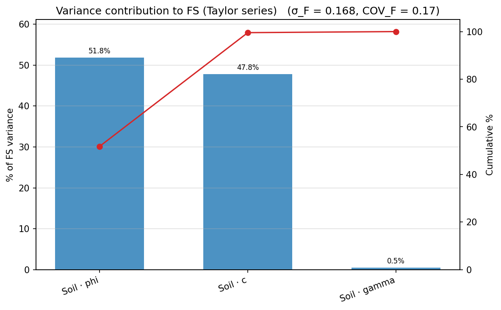
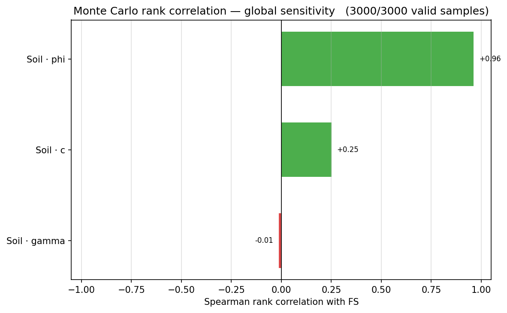

# Parametric Studies

Vary the inputs and watch the answer move. XSLOPE groups three closely related studies
under one **Parametric** umbrella — one Studio button, one API family, one parameter
grammar:

- **Sensitivity** — sweep one or more parameters and see how the factor of safety
  responds. The results feed a family of plots: a tornado, scaled-sensitivity bars, a
  spider plot, and — when the model carries standard deviations — a variance-contribution
  Pareto and a Monte Carlo rank-correlation chart.
- **[Design](#design-mode-finding-the-value-that-hits-a-target-fs)** — sweep one
  parameter across an explicit range and find the value at which FS meets a target
  (FS = 1.5, say).
- **[Back-Analysis](#back-analysis-mode)** — the same single-parameter sweep framed as a
  failure investigation: a slide has occurred, so FS = 1.0 is known, and the study
  back-calculates the parameter value consistent with the observed failure.

This is the geotechnical staple — Duncan & Wright present exactly these charts (FS vs
parameter, and tornado diagrams comparing several parameters at their low/high bounds) —
and half of slope-stability judgment is knowing *which* parameter matters on a given slope.

Sensitivity is deliberately distinct from [reliability analysis](../reliability/taylor.md): the
Taylor-series method perturbs parameters by ±σ to estimate the *distribution* of FS,
which requires the parameters to be independent. A sensitivity sweep asserts nothing
statistical — it simply evaluates the model across a range — which also makes it the
right tool for **correlated fit coefficients** (the power-curve `A` and `b`, for
example) that the reliability method must not treat as independent. The Hoek-Brown
inputs are in the same category: `hb_sci`, `hb_gsi`, `hb_mi` and `hb_d` are all
sweepable here, but they carry no standard-deviation columns and reliability rejects
them, because $m_b$, $s$ and $a$ are all *derived* from GSI, $m_i$ and $D$ — perturbing
them independently would be meaningless.

Sweeps are configured entirely through the API — sensitivity describes an analysis you
run, not a property of the model, so nothing is added to the Excel input template. The same
engine drives the point-and-click
[Parametric study dialog in Studio](../studio/analysis.md#parametric-study)
and the recipes in the [`/xslope` Claude Code skill](../usage/claude/index.md), so a study
set up one way reads the same the others.

## Addressing a parameter

A sweep needs an unambiguous name for the thing being varied. Parameter references are
strings of the form `"kind:name:field"`:

| kind | name | fields | example |
|---|---|---|---|
| `mat` | material name | strength fields valid for the material's `option` (`c`, `phi` for `mc`; `c`, `cp` for `cp`), plus `gamma`, `gamma_sat`, `ru`, `d`, `psi` | `"mat:Clay:c"` |
| `reinforce` | line label | `t_max`, `t_res`, `lp1`, `lp2`, `tend1`, `tend2`, `spacing` | `"reinforce:Row 2:t_max"` |
| `piles` | pile label | `H`, `theta`, `D`, `S`, `V_cap`, `M_cap` | `"piles:Pile 1:H"` |
| `global` | — | `k_seismic`, `tcrack_depth`, `tcrack_water` | `"global:k_seismic"` |
| `seep` | material name | `k1`, `k2`, `alpha`, `kr0`, `h0` | `"seep:Sand:k1"` |
| `geom` | — | `piezo:dy` — shift the piezometric line vertically (the value is a *delta*) | `"geom:piezo:dy"` |

Every reference is validated against the loaded model before anything runs: an unknown
kind, an unmatched name, or a field the material's strength option does not use raises
immediately, naming what was given and what exists. Names resolve case-insensitively;
duplicated names are an error rather than a guess. Sweeping `c` on a `cp` material is
rejected for the same reason the reliability module rejects it — the model would not
read the value, and the sweep would silently report zero sensitivity.

Note that `gamma` and `gamma_sat` are the same soil weighed two ways, so sweeping
`gamma` moves `gamma_sat` by the same absolute delta (the same coupling the reliability
module applies); `gamma_sat` remains separately addressable when that is what you mean.

## Discovering and specifying parameters

Rather than hand-write every reference, `list_params(slope_data)` enumerates every sweepable
parameter in the loaded model — each material's option-aware strength and general fields,
plus the global `k_seismic` — as plain dicts. It is the menu a GUI parameter-picker (or an
assistant driving the API) chooses from, so a reference is never guessed:

```python
from xslope.sensitivity import list_params

for p in list_params(slope_data):
    print(p['ref'], p['value'], p['sigma'])
    # mat:Soil:c        3.0   1.8
    # mat:Soil:phi      19.6  2.744
    # mat:Soil:gamma    20.0  1.2
    # global:k_seismic  0.0   None
```

Each entry carries `ref` (the canonical string), `kind`, `name`, `index` (the 1-based
material index), `field`, `value` (the current value, or `None` if unset), `sigma` (the
reliability standard deviation — `sigma_c`, `sigma_phi`, … — if the model carries a non-zero
one, so a picker can offer a one-click ±σ range), and a short `label`. Blank or zero-valued
fields are still listed, so a design study can target them with explicit bounds.

Anywhere a `"kind:name:field"` string is accepted, the entry points also accept the
equivalent **dict** or **tuple** — often what a GUI or an assistant naturally produces. All
forms resolve to the same setter and validate identically:

```python
design(slope_data, {"material": "Soil", "property": "c"}, low=6, high=18)  # dict, by name
design(slope_data, {"material": 1, "property": "phi"}, low=15, high=25)     # 1-based index
design(slope_data, {"global": "k_seismic"}, low=0.0, high=0.3)             # a global
design(slope_data, ("mat", "Soil", "c"), low=6, high=18)                    # tuple form
```

The dict accepts `ref` (passed straight through), `material`/`name` and `property`/`field`,
or a `global` key; a material may be named or given by 1-based index.

## Running a sweep

```python
from xslope import load_slope_data
from xslope.sensitivity import sensitivity
from xslope.plot import plot_sensitivity

slope_data = load_slope_data("docs/lem/files/xslope_acads_simple.xlsx")

success, result = sensitivity(
    slope_data,
    param="mat:Soil:c",
    rel_range=0.5, n=9,          # ±50% about the base value, 9 points
    # values=[...],              # ...or give the values explicitly
    methods=("bishop", "spencer"),
    search=True,                 # re-search the critical surface per point
)
plot_sensitivity(result['df'], target_fs=1.2)
```

`search=True` is the default and the honest setting: **the critical surface moves as
parameters change**, and re-solving a fixed surface silently understates sensitivity.
`search=False` re-solves the stored surface (`circles[0]` or the non-circular polyline)
instead — roughly fifty times faster, and correct when the question is "given this
surface" (prescribed-surface benchmarks, for example).

The result is a tidy long-format DataFrame — one row per (value × method), with the
unmodified model included as a flagged `is_base` row:

| column | meaning |
|---|---|
| `param` | canonical reference, e.g. `"mat:Soil:c"` |
| `value`, `rel` | the swept value and `value / base_value` |
| `is_base` | this row is the unmodified model |
| `method`, `fs` | solver name and factor of safety |
| `success`, `msg` | per-point outcome — a failed point is a row, not an exception, so a sweep that breaks at value 7 of 9 still reports 1–6 (finding where things break is often the point) |
| `Xo`, `Yo`, `R` | the critical circle per point (searched sweeps), so a jump of the critical surface is visible in the data — `plot_sensitivity` draws jumped points open |

`plot_sensitivity` draws one line per method with FS = 1 (and an optional `target_fs`) as
guide lines, marks the unmodified model as a labelled **base case** entry in the legend — so
the black square in the plot reads as `base case (value, FS = …)` rather than an unexplained
point — and draws any point where the critical surface jumped as an open circle.

`mode=` selects the engine that evaluates each swept point. `mode='lem'` (the default)
runs the limit-equilibrium methods and reports a factor of safety. `mode='fem'` runs a
full SSRM solve at every point — the output is still a factor of safety, but each step is
a complete finite-element analysis (expect minutes per step; run it in the background) and
the model must carry a mesh in `slope_data['mesh']`. `mode='seep'` rebuilds and solves the
seepage problem at every point and reports the **total discharge q** through the section
(the same flow rate the seepage solver returns), and likewise needs a mesh. The result's
value column stays `fs` for a consistent schema; `result['output']` (`'FS'` or `'q'`) and
`result['output_label']` say what it really is, so a discharge sweep is never mislabelled a
factor of safety.

## Sweeping anything else: `modify=`

For changes that are not a single stored scalar — geometry above all — pass a callable
instead of a parameter reference. The callable receives a copy of the model and the
swept value, and owns whatever consistency its edit requires (rebuilding the material
polygons and ground surface after moving profile points, keeping reinforcement anchored
to a moved face):

```python
import math
from shapely.geometry import Polygon
from xslope.fileio import build_ground_surface_from_polygons
from xslope.mesh import build_polygons

def set_slope_angle(sd, beta_deg):
    """Rotate the slope face about the toe to beta_deg, then rebuild the
    polygon geometry (slice weights come from the polygons, not the raw
    profile lines — see the Slope Design page for this pattern)."""
    prof = sd['profile_lines'][0]['coords']
    x_toe, y_toe = prof[1]
    _, y_top = prof[2]
    prof[2] = (x_toe + (y_top - y_toe) / math.tan(math.radians(beta_deg)), y_top)
    polys = [{'polygon': Polygon(p['coords']), 'mat_id': p['mat_id']}
             for p in build_polygons(slope_data={'profile_lines': sd['profile_lines'],
                                                 'max_depth': sd.get('max_depth')})]
    sd['polygons'] = polys
    sd['ground_surface'], sd['domain_polygon'] = build_ground_surface_from_polygons(polys)
    return sd

success, result = sensitivity(slope_data, modify=set_slope_angle,
                              label="slope angle (deg)",
                              values=[20, 22.5, 25, 27.5, 30],
                              methods=("bishop",))
```

Built-in references and `modify=` callables are one code path — every `param` reference
resolves internally to exactly the setter signature `modify=` accepts — and the engine
validates the modified model at every point (polygon validity, ground surface present)
precisely because setters may be user-written: a broken edit becomes a `success=False`
row naming what broke, never a silently inconsistent answer.

## Sensitivity plots

A sweep across several parameters feeds a family of views. Which one to read depends on the
question: *which parameter matters most* (tornado, scaled bars), *how the answer moves across
the range* (spider), or *where the uncertainty comes from* (variance Pareto, Monte Carlo
rank). Each is a function in `xslope.plot`; all are reachable from the Studio **Parametric**
dialog's plot-type selector and from the assistant's `parametric_sweep` call. The
[tornado](#tornado-diagrams) — the most common — is covered in its own section below.

### Scaled-sensitivity bars

`scaled_sensitivity()` estimates the local derivative $\partial F/\partial p$ for each
parameter with a **central difference at ±1%** (relative) about the base case, then reports
it under three scalings so parameters with different units compare on one axis. `plot_scaled_sensitivity()`
draws one vertical bar per parameter — height is the magnitude, color the sign (green: FS
*rises* with the parameter; red: FS *falls*):

- **`elasticity`** (the default) — the dimensionless $\dfrac{\partial F}{\partial p}\cdot\dfrac{p}{F}$,
  i.e. the percent change in FS per percent change in the parameter.
- **`per_1pct`** — the change in FS for a 1% change in the parameter.
- **`per_sigma`** — the change in FS for a one-σ change (offered only for parameters that
  carry a standard deviation).

```python
from xslope.sensitivity import scaled_sensitivity
from xslope.plot import plot_scaled_sensitivity

ok, result = scaled_sensitivity(slope_data,
                                ["mat:Soil:c", "mat:Soil:phi", "mat:Soil:gamma"],
                                method="bishop")
plot_scaled_sensitivity(result, scaling="elasticity")
```

{width=800}

For the ACADS sample the friction angle dominates on the elasticity scaling — a percent
change in φ moves FS several times more than a percent change in c or γ. The estimator (the
central-difference derivative and each scaling) is documented in the `scaled_sensitivity`
docstring.

### Spider plot

`plot_spider()` overlays every parameter's FS-vs-value curve on one **normalized** x-axis
(percent change from the base value), with a black base-case marker at the origin and an
FS = 1 guide. The steepness of each line *is* its sensitivity, and a curving line reveals
nonlinearity a single tornado bar would hide. It reuses the per-parameter sweeps you already
ran:

```python
from xslope.sensitivity import sensitivity
from xslope.plot import plot_spider

sweeps = {ref: sensitivity(slope_data, param=ref, rel_range=0.3, n=7,
                           methods=("bishop",))[1]["df"]
          for ref in ("mat:Soil:c", "mat:Soil:phi", "mat:Soil:gamma")}
plot_spider(sweeps)
```

{width=800}

### Variance-contribution Pareto

When the model carries standard deviations, `variance_contribution()` asks *which
uncertainties actually drive the scatter in FS*. It reuses the Taylor-series
[reliability](../reliability/taylor.md) machinery — each parameter's variance term is
$\left(\dfrac{\partial F}{\partial p}\,\sigma_p\right)^2$, exactly the $(\Delta F/2)^2$ the
TSPM already computes — normalizes each to a percent of $\mathrm{Var}(F)$, and
`plot_variance_pareto()` draws them descending with a cumulative line:

```python
from xslope.sensitivity import variance_contribution
from xslope.plot import plot_variance_pareto

ok, result = variance_contribution(slope_data, method="bishop")
plot_variance_pareto(result)
```

{width=800}

Note how this reorders the parameters versus the elasticity bars: c and φ contribute almost
equally to $\mathrm{Var}(F)$ even though φ has the larger elasticity, because c's standard
deviation is a much larger fraction of its mean. A scaled bar answers *how strong is the
response*; the Pareto answers *how much does this parameter's uncertainty matter* — the
per-σ scaling above is the bridge between the two.

### Monte Carlo rank correlation

`mc_rank_correlation()` runs a Monte Carlo [reliability](../reliability/monte_carlo.md) campaign and computes
the **Spearman rank correlation** between each sampled input and the resulting FS.
`plot_mc_rank_correlation()` draws them signed and sorted:

```python
from xslope.sensitivity import mc_rank_correlation
from xslope.plot import plot_mc_rank_correlation

ok, result = mc_rank_correlation(slope_data, method="bishop", n_samples=10000)
plot_mc_rank_correlation(result)
```

{width=800}

This is a **global** sensitivity measure: unlike the scaled bars — a derivative *at the base
case* — it ranks parameters over the whole sampled distribution, so it captures a
parameter's spread and any nonlinearity in its effect. The local and global measures can
disagree, and the disagreement is itself informative; read the two together.

## Design mode: finding the value that hits a target FS

Where a sweep asks *how much does FS move*, a **design study** asks the inverse — *what value
of this parameter gives FS = 1.5?* `design()` runs a fixed number of evenly spaced solves
across an explicit `[low, high]` range and linearly interpolates the parameter value where the
FS curve crosses the target. It is the deterministic-design staple: "vary the undrained
strength between X and Y and find where FS reaches the design factor."

```python
from xslope.sensitivity import design
from xslope.plot import plot_sensitivity

success, result = design(
    slope_data,
    param="mat:Soil:c",          # or {"material": "Soil", "property": "c"}, or a tuple
    low=6, high=18, steps=7,     # 7 evenly spaced solves across [6, 18]
    target_fs=1.5,
    method="bishop",             # one method — a design study locates a single curve
    num_slices=30,
)
print(result['message'])
plot_sensitivity(result['df'], target_fs=result['target_fs'])
```

`design()` returns `(success, result)`; on success `result` carries the sweep DataFrame
(`result['df']`, exactly the sensitivity shape above) plus a summary:

| field | meaning |
|---|---|
| `crossing` | interpolated parameter value at FS = `target_fs`, or `None` if the target is not reached |
| `crossings` | every crossing found — a non-monotonic curve can cross twice; `crossing` is the first |
| `bracketed` | `True` only when the target is crossed *inside* `[low, high]` |
| `fs_range` | `(min FS, max FS)` over the successful sweep points |
| `direction` | `'increasing'` / `'decreasing'` / `'non-monotonic'` trend of FS vs the parameter |
| `extend` | on a miss, `'above {high}'` or `'below {low}'` — which way to widen the range; else `None` |
| `message` | one-line human-readable summary |
| `param`, `target_fs`, `base_value`, `runtime` | canonical ref, the target, the parameter's current value, wall-clock seconds |

`design()` also takes `progress_callback` and `cancel_check` hooks (a per-point progress
callback and a cooperative cancel), which is how Studio streams a progress bar and a Cancel
button over a background sweep; a plain data-in/data-out call leaves both `None`.

**Honest about misses — the engine never extrapolates.** A crossing is reported *only* when
the target is bracketed by two actual solves. If the swept range never reaches the target,
`bracketed` is `False`, `crossing` is `None`, and `extend` names the direction to widen the
range — the study reports that it fell short rather than projecting a value past the last
solve.

Worked example, on the [ACADS simple slope](files/xslope_acads_simple.xlsx) used throughout
these pages (base cohesion c = 3 kPa, base Bishop FS = 0.985). Sweeping the cohesion from 6 to
18 kPa in seven steps and asking where FS reaches 1.5:

```
FS = 1.5 at mat:Soil:c = 13.4 (interpolated between solves).
```

`result['crossing']` is 13.40, `result['bracketed']` is `True`, and `result['direction']` is
`'increasing'`; the sweep spans FS = 1.154 (c = 6) to FS = 1.693 (c = 18). Re-solving at the
interpolated c = 13.40 returns FS = 1.500 — the linear interpolation between the c = 12 and
c = 14 solves lands the target to within 0.01%.

Ask the same question over a range that never reaches the target — say c from 3 to 9 — and the
study declines to guess:

```
FS = 1.5 is not reached for mat:Soil:c in [3, 9] — FS spans [0.985, 1.302].
Extend the range above 9 to bracket it.
```

Here `result['bracketed']` is `False`, `result['crossing']` is `None`, and `result['extend']`
is `'above 9'`.

## Back-Analysis mode

Back-analysis is the same single-parameter sweep as design, inverted for a *failure
investigation*. A slide has already occurred, so the factor of safety at the moment of
failure is known to be exactly 1.0; the unknown is a strength (or pore-pressure, or loading)
parameter, and the study back-calculates the value **consistent with the observed failure** —
the mobilized shear strength implied by the slide, most commonly. `back_analysis()` is
`design()` with `target_fs` defaulting to 1.0 and the result worded for the forensic reading:

```python
from xslope.sensitivity import back_analysis

success, result = back_analysis(
    slope_data,
    param="mat:Soil:c",          # the strength parameter to back-calculate
    low=1.0, high=6.0, steps=11, # sweep the plausible range...
    # target_fs=1.0,             # ...to the known failure condition (the default)
    method="bishop",
)
print(result['message'])
# Back-analysis: mat:Soil:c = 3.25 gives FS = 1 (the value consistent with the
# observed failure).
```

`result['crossing']` is the back-calculated value; `result['study']` is `'back_analysis'`;
every other field carries the same meaning as `design()`. The same *never-extrapolate*
discipline applies — if the swept range never reaches FS = 1.0, `bracketed` is `False` and
`extend` says which way to widen it, rather than guessing a value past the last solve.

## Tornado diagrams

To compare several parameters at once, `tornado()` evaluates each at its low and high
bound (two solves per parameter plus one shared base case) and `plot_tornado` draws the
Duncan-style summary — horizontal bars of the FS swing, sorted so the parameter that
matters most sits on top:

```python
from xslope.sensitivity import tornado
from xslope.plot import plot_tornado

success, result = tornado(
    slope_data,
    ["mat:Soil:c", "mat:Soil:phi", "mat:Soil:gamma"],
    rel_range=0.25,              # ±25% per parameter...
    # bounds={"mat:Soil:c": (2.0, 5.0)},   # ...or explicit bounds per ref
    method="bishop",
)
plot_tornado(result)
```

For the shipped ACADS sample (a weak c–φ soil), the tornado ranks φ far ahead of c and
γ — the ±25% φ band alone swings FS from 0.77 to 1.21 across FS = 1.

`plot_tornado` draws the base-case FS as a labelled vertical reference line and stacks the
bars widest-on-top by default — the classic Duncan ordering that gives the diagram its name.
Pass `widest_on_top=False` to invert the stack (widest at the bottom); the parameter is kept
for programmatic callers, and Studio deliberately exposes no toggle for it.

When you have already run *full* per-parameter sweeps — a GUI that draws an FS-vs-value curve
per parameter for click-through, for instance — `tornado_from_sweeps()` assembles the same
diagram from those DataFrames with no extra solves, since `plot_tornado` reads each
parameter's lowest- and highest-value FS:

```python
from xslope.sensitivity import sensitivity, tornado_from_sweeps

sweeps = {ref: sensitivity(slope_data, param=ref, rel_range=0.25, n=5,
                           methods=("bishop",))[1]['df']
          for ref in ("mat:Soil:c", "mat:Soil:phi", "mat:Soil:gamma")}
result = tornado_from_sweeps(sweeps, method="bishop")   # {'df', 'base_fs', 'method'}
plot_tornado(result)
```

## Worked sample

The sweep below reproduces the base case of the ACADS simple slope sample
([xslope_acads_simple.xlsx](files/xslope_acads_simple.xlsx), the same file used
throughout these pages) and brackets it over ±50% of the cohesion, re-searching the
critical surface at every point. The regression suite locks the end points: at c = 1.5
the critical circle has retreated toward the face (the surface-jump columns show the
radius growing as cohesion falls), and at c = 4.5 the slope crosses FS = 1.

<!-- test: file=files/xslope_acads_simple.xlsx, type=sensitivity, param=mat:Soil:c, method=bishop, num_slices=30, n=3, rel_range=0.5, expected_base=0.985, expected_low=0.882, expected_high=1.073, tolerance=0.01, benchmark=SENS-acads-c -->

| c (kPa) | Bishop FS |
|---|---|
| 1.5 (−50%) | 0.882 |
| 3.0 (base) | 0.985 |
| 4.5 (+50%) | 1.073 |

A `geom:piezo:dy` sweep on any of the water-table samples answers the most common
geometry question — "how sensitive is this slope to the water table?" — without writing
a setter: the reference shifts the piezometric line vertically by the swept delta.

For a published benchmark of the sweep itself, see
[verification problem VP40](../verification/rocscience.md#vp40) — Perry (1993)'s
power-curve sensitivity study, where the swept ΔFS matches Slide's published curves
within about a percent at every range endpoint.
