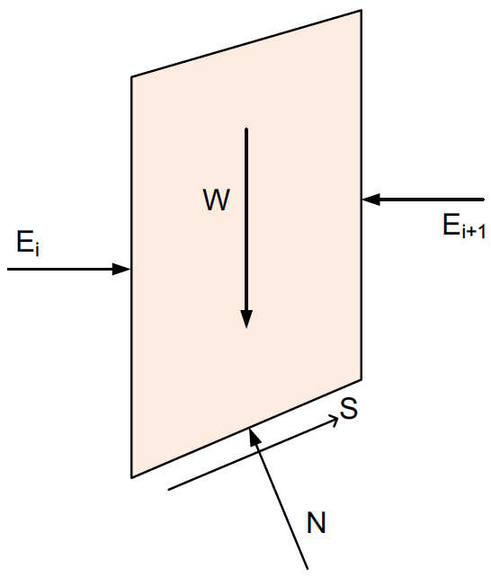
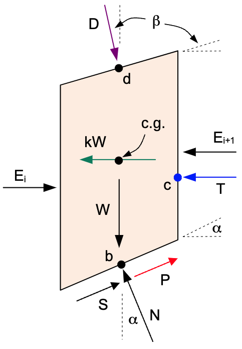

# Bishop's Simplified Method

Bishop's Simplified Method is a widely used limit equilibrium technique for analyzing slope stability, especially suitable for **circular slip surfaces**. It improves on the Ordinary Method of Slices by including interslice normal forces and satisfies both **moment** and **vertical force** equilibrium. The key assumptions are:

- Circular slip surface  
- Interslice side forces are **horizontal** and the moments they create are negligible
- Satisfies:
    - Moment equilibrium
    - Vertical force equilibrium
- Does **not** satisfy horizontal force equilibrium

With these assumptions, the forces acting on the slice are as follows:

{width=400px}

Where:

>$W$ = weight of the slice  
$\alpha$ = base inclination angle of the slice  
$\Delta \ell$ = length of the base  
$c', \phi'$ = effective cohesion and friction angle  
$u$ = pore water pressure  
$N$ = normal force on the base of the slice  
$S$ = shear force at the base

Recall that:

>$N = N' + u \Delta \ell$

>$N' = N - u \Delta \ell$

Where $N'$ is the effective normal stress on the base of the slice.

Summing forces in the vertical direction:

>$\sum F_y = 0$

>$N \cos \alpha + S \sin \alpha - W = 0$
>
>$(N' + u \Delta \ell) \cos \alpha + S \sin \alpha - W = 0$
> 
>$N' \cos \alpha + u \Delta \ell \cos \alpha + S \sin \alpha - W = 0  \qquad (1)$

Where $S$ is the mobilized shear force at the base of the slice. The shear force is given by:

>$S = \dfrac{1}{F} \left[c \Delta \ell + N' \tan \phi' \right]   \qquad (2)$

Substituting (2) into (1):

>$N' \cos \alpha + u \Delta \ell \cos \alpha + \dfrac{1}{F} \left[ c \Delta \ell + N' \tan \phi' \right] \sin \alpha - W = 0$

Now solve for the effective normal force $N'$. First, we rearrange the equation:

>$N' \cos \alpha + u \Delta \ell \cos \alpha + \dfrac{c \Delta \ell}{F} \sin \alpha + \dfrac{N' \tan \phi'}{F} \sin \alpha - W = 0$

Next, we isolate all terms involving $N'$:

>$N' \cos \alpha + \dfrac{N' \tan \phi'}{F} \sin \alpha = W - u \Delta \ell \cos \alpha - \dfrac{c \Delta \ell}{F} \sin \alpha$

>$N' \left( \cos \alpha + \dfrac{\sin \alpha \tan \phi'}{F} \right) = W - u \Delta \ell \cos \alpha - \dfrac{c \Delta \ell}{F} \sin \alpha$

Finally, we can solve for $N'$:

>$N' = \dfrac{W - u \Delta \ell \cos \alpha - \dfrac{c \Delta \ell}{F} \sin \alpha}{\cos \alpha + \dfrac{\sin \alpha \tan \phi'}{F}}   \qquad (3)$

Next we use the general equation for the factor of safety based on moment equilibrium (resisting moments divided by driving moments):

>$F = \dfrac{\sum (c + \sigma' tan \phi') \Delta \ell}{\sum W sin \alpha}$

>$N' = \sigma' \Delta \ell$

thus:

>$F = \dfrac{\sum (c \Delta \ell + N' tan \phi')}{\sum W sin \alpha}   \qquad (4)$

Next, we substitute (3) into (4):

>$F = \dfrac{\sum \left[ c \Delta \ell + \left( \dfrac{W - u \Delta \ell \cos \alpha - \dfrac{c \Delta \ell}{F} \sin \alpha}{\cos \alpha + \dfrac{\sin \alpha \tan \phi'}{F}} \right) \tan \phi' \right]}{\sum W \sin \alpha}$

To simplify the numerator, we multiply  $c \Delta \ell$ by $\dfrac{\cos \alpha + \dfrac{\sin \alpha \tan \phi'}{F}}{\cos \alpha + \dfrac{\sin \alpha \tan \phi'}{F}}$ to combine like terms:

>$F = \dfrac{\sum \left[ \dfrac{c \Delta \ell (\cos \alpha + \dfrac{\sin \alpha \tan \phi'}{F}) + (W - u \Delta \ell \cos \alpha - \dfrac{c \Delta \ell}{F} \sin \alpha) \tan \phi'}{\cos \alpha + \dfrac{\sin \alpha \tan \phi'}{F}} \right]}{\sum W \sin \alpha}$

Now we rearrange the numerator:

>$F = \dfrac{\sum \left[ \dfrac{c \Delta \ell \cos \alpha + \dfrac{c \Delta \ell}{F} \sin \alpha \tan \phi' + (W - u \Delta \ell \cos \alpha)  \tan \phi' - \dfrac{c \Delta \ell}{F} \sin \alpha \tan \phi'}{\cos \alpha + \dfrac{\sin \alpha \tan \phi'}{F}} \right]}{\sum W \sin \alpha}$

Finally, the $\dfrac{c \Delta \ell}{F} \sin \alpha \tan \phi'$ terms cancel out, leading to:

>$F = \dfrac{\sum \left[ \dfrac{c \Delta \ell \cos \alpha + (W - u \Delta \ell \cos \alpha)  \tan \phi'}{\cos \alpha + \dfrac{\sin \alpha \tan \phi'}{F}} \right]}{\sum W \sin \alpha}   \qquad (5)$

Which is the standard equation for the factor of safety for Bishop's method.

The factor of safety $F$ appears on both sides of the equation, so it must be solved **iteratively**.

Once $F$ is determined, $N'$ can be computed using equation (3) above.

## Complete Formulation

For a complete implementation of Bishop's Simplified Method, we need to consider additional forces acting on the slice. The full set of forces are shown in the following figure:

{width=400px}

Where:

>$D$ = distributed load resultant force  
$\beta$ = inclination of the distributed load (perpendicular to slope)  
$kW$ = seismic force for pseudo-static seismic analysis  
$c.g.$ = center of gravity of the slice  
$P$ = reinforcement force on base of slice  
$T$ = tension crack water force  

Each of these forces is described in detail in the [Ordinary Method of Slices (OMS)](oms.md) section. The forces $D$, $kW$, $P$, and $T$ are included in the Bishop's method factor of safety equation as follows:

### Vertical Force Equilibrium

First we first need to consider how these forces affect the vertical force equilibrium. The vertical force equilibrium equation becomes:

>$N \cos \alpha + S \sin \alpha + P \sin \alpha - W - D \cos \beta = 0$
> 
>$(N' + u \Delta \ell) \cos \alpha + S \sin \alpha + P \sin \alpha - W - D \cos \beta = 0$

>$N'  \cos \alpha + u \Delta \ell \cos \alpha + S \sin \alpha + P \sin \alpha - W - D \cos \beta = 0  \qquad (6)$
 
The shear force on the base of the slice remains the same as before:

>$S = \dfrac{1}{F} \left[c \Delta \ell + N' \tan \phi' \right]   \qquad (7)$

Substituting (7) into (6) and solving for N':

>$N' \cos \alpha + u \Delta \ell \cos \alpha + \dfrac{1}{F} \left[c \Delta \ell + N' \tan \phi' \right] \sin \alpha + P \sin \alpha - W - D \cos \beta = 0$

>$N' \cos \alpha + u \Delta \ell \cos \alpha + \dfrac{1}{F} c \Delta \ell \sin \alpha + \dfrac{1}{F} N' \tan \phi' \sin \alpha + P \sin \alpha - W - D \cos \beta = 0$
> 
>$N' \cos \alpha + \dfrac{1}{F} N' \tan \phi' \sin \alpha = W + D \cos \beta - P \sin \alpha - u \Delta \ell \cos \alpha - \dfrac{1}{F} c \Delta \ell \sin \alpha$
> 
>$N' \left( \cos \alpha + \dfrac{\sin \alpha \tan \phi'}{F} \right) = W + D \cos \beta - P \sin \alpha - u \Delta \ell \cos \alpha - \dfrac{1}{F} c \Delta \ell \sin \alpha$

Finally, we can solve for $N'$:

>$N' = \dfrac{W + D \cos \beta - P \sin \alpha - u \Delta \ell \cos \alpha - \dfrac{c \Delta \ell}{F}  \sin \alpha}{\cos \alpha + \dfrac{\sin \alpha \tan \phi'}{F}}   \qquad (8)$

### Moment Equilibrium

The moment equilibrium equation about the center of the slip circle must also be revised to include the moments from 
the additional forces. The resisting moments are in the numerator and the driving moments in the denominator:

>$F = \dfrac{R \sum (S + P) + \sum D \sin \beta a_{dy}}{R \sum W \sin \alpha + \sum D \cos \beta a_{dx} + k\sum W 
> a_s + T a_t}   \qquad (9)$

Where:
>$a_{dx}$ = horizontal distance from center of circle to point $d$ 
> $a_{dy}$ = vertical distance from center of circle to point $d$ 
> $a_s$ = vertical distance from center of circle to center of gravity of the slice 
> $a_t$ = vertical distance from center of circle to point $c$

Dividing by $R$, we get:

>$F = \dfrac{\sum (S + P) + \frac{1}{R}\sum D \sin \beta a_{dy}}{\sum W \sin \alpha + \frac{1}{R}\sum D \cos \beta a_
> {dx}  + \frac{k}{R}\sum W a_s + \frac
> {1}{R} T a_t}$

Substituting for $S$ (note: in this case $S$ is the full shear force at the base of the slice - not the mobilized shear force):

>$F = \dfrac{\sum \left( \left[c \Delta \ell + N' \tan \phi' \right] + P \right) + \frac{1}{R}\sum D \sin \beta a_
> {dy}}{\sum W \sin \alpha + \frac{1}{R}
> \sum D \cos \beta a_{dx}  + \frac{k}{R}\sum W a_s + \frac{1}{R} T a_t}$

Substituting (8) for $N'$:

>$F = \dfrac{\sum \left(c \Delta \ell + \left[ \dfrac{W + D \cos \beta - P \sin \alpha - u \Delta \ell \cos \alpha - 
> \dfrac{c \Delta \ell}{F}  \sin \alpha}{\cos \alpha + \dfrac{\sin \alpha \tan \phi'}{F}} \right]  \tan \phi' + P\right) - \frac{1}{R}\sum D \sin \beta a_{dy}}{\sum W \sin \alpha + \frac{1}{R}\sum D \cos \beta a_{dx} + \frac{k}{R}\sum W a_s + \frac{1}{R} T a_t}$

Again, to simplify the numerator, we multiply $c \Delta \ell$ by $\dfrac{\cos \alpha + \dfrac{\sin \alpha \tan \phi'}{F}}{\cos \alpha + \dfrac{\sin \alpha \tan \phi'}{F}}$:

>$F = \dfrac{\sum \left[ \dfrac{c \Delta \ell (\cos \alpha + \dfrac{\sin \alpha \tan \phi'}{F}) + (W + D \cos \beta 
- P \sin \alpha - u \Delta \ell \cos \alpha)  \tan \phi' - \dfrac{c \Delta \ell}{F}  \sin \alpha  \tan \phi'}{\cos 
  \alpha + \dfrac{\sin \alpha \tan \phi'}{F}} + P\right] + \frac{1}{R}\sum D \sin \beta a_{dy}}{\sum W \sin \alpha + \frac{1}{R}\sum D \cos \beta a_{dx} + \frac{k}{R}\sum W a_s + \frac{1}{R} T a_t}$

Now, we can rearrange the numerator:

>$F = \dfrac{\sum \left[ \dfrac{c \Delta \ell \cos \alpha + \dfrac{c \Delta \ell}{F}  \sin \alpha  \tan \phi' + (W + 
> D \cos \beta - P \sin \alpha - u \Delta \ell \cos \alpha)  \tan \phi' - \dfrac{c \Delta \ell}{F}  \sin \alpha  \tan \phi'}{\cos \alpha + \dfrac{\sin \alpha \tan \phi'}{F}} + P\right] + \frac{1}{R}\sum D \sin \beta a_{dy}}{\sum W \sin \alpha + \frac{1}{R}\sum D \cos \beta a_{dx} + \frac{k}{R}\sum W a_s + \frac{1}{R} T a_t}$

Finally, the $\dfrac{c\Delta\ell}{F} \sin \alpha \tan \phi'$ terms cancel out, leading to:

>$F = \dfrac{\sum \left[ \dfrac{c \Delta \ell \cos \alpha + (W + D \cos \beta - P \sin \alpha - u \Delta \ell \cos 
> \alpha)  \tan \phi' + P}{\cos \alpha + \dfrac{\sin \alpha \tan \phi'}{F}} \right] + \frac{1}{R}\sum D \sin \beta a_{dy}}{\sum W \sin \alpha + \frac{1}{R}\sum D \cos \beta a_{dx} + \frac{k}{R}\sum W a_s + \frac{1}{R} T a_t}   \qquad (10)$

This is the **complete formulation** for Bishop's Simplified Method. Note that the water force $T$ only applies to the uppermost slice, so for the summation in the numerator, the $T$ value is zero for all other slices.

The factor of safety $F$ appears on both sides of the equation, so it must be solved **iteratively**, just like the basic formulation.

---

## Summary

Assumes **horizontal side forces** 
Satisfies **moment** and **vertical force** equilibrium 
Applicable to **circular slip surfaces** 
Requires **iteration** to solve for $F$ 
More accurate than OMS, especially for **effective stress analysis** with high pore pressures
