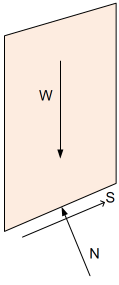
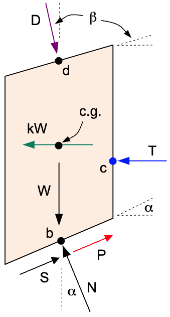

# Ordinary Method of Slices (OMS)

The Ordinary Method of Slices (also known as the Swedish Method) is one of the simplest limit equilibrium techniques used for slope stability analysis. The factor of safety to be calculated directly without iteration. The key assumption for the OMS method is that the side forces can be neglected, meaning interslice shear and normal forces cancel out and are excluded from equilibrium considerations. Thus, the forces on the slice are as follows:

>{ width=200px }

Further, only **moment equilibrium** about the center of the slip circle is enforced:

>$\sum M = 0$

Force equilibrium in the horizontal and vertical directions is **not** satisfied.

## Basic Formulation

To solve for the factor of safety, we need to consider the forces acting on the slice:

>$W$ = weight of the slice   
$\alpha$ = inclination of the base of the slice
$\Delta \ell$ = length of the slice base   
$S$ = shear force on the base of the slice = $c \Delta \ell + N \tan \phi$ 
$c$ = cohesion   
$\phi$ = friction angle   
$N$ = normal force on the base of the slice  
$u$ = pore water pressure   

The general expression for the factor of safety $FS$ is:

>$FS = \dfrac{\sum (c \Delta \ell + N \tan \phi)}{\sum W \sin \alpha}  \qquad (1)$

Summing forces perpendicular to the base, the normal force on the base is:

>$N = W \cos \alpha$

Therefore, we can rewrite (1) as:

>$FS = \dfrac{\sum (c \Delta \ell + W \cos \alpha \tan \phi)}{\sum W \sin \alpha}$

If $\phi = 0$, the expression simplifies to:

>$FS = \dfrac{\sum c \Delta \ell}{\sum W \sin \alpha}$

which is the same equation used in the Swedish method and the log-spiral method under the same assumptions.

To use effective stress parameters $c', \phi'$, and effective normal stress $\sigma'$, the expression becomes:

>$S = c' \Delta \ell + N' \tan \phi$

>$N' = N - u \Delta \ell = W \cos \alpha - u \Delta \ell$

>$S = c' \Delta \ell + (W \cos \alpha - u \Delta \ell) \tan \phi$

>$FS = \dfrac{\sum (c' \Delta \ell + (W \cos \alpha - u \Delta \ell) \tan \phi')}{\sum W \sin \alpha}  \qquad (2)$

## Alternate (Preferred) Formulation

This equation for FS can produce unconservative results, including negative normal stresses under high pore pressures. The following formulation is preferred. First, we define the effective weight as follows:

>$W' = W - u b, \quad \text{where} \quad b = \Delta \ell \cos \alpha$
 
>$W' = W - u  \Delta \ell \cos \alpha$

Then:

>$N' = W' \cos \alpha = (W - u  \Delta \ell \cos \alpha) \cos \alpha$

>$N' = W  \cos \alpha - u  \Delta \ell \cos^2 \alpha$

Substituting into (2):

>$F = \dfrac{\sum \left[ c' \Delta \ell + (W \cos \alpha - u \Delta \ell \cos^2 \alpha) \tan \phi' \right]}{\sum W \sin \alpha}   \qquad (3)$

This is the **preferred formulation** for OMS.

## Complete Formulation

For a complete implementation of the Ordinary Method of Slices, we need to consider some additional forces to the slice. The full set of forces acting on the slice are as follows:

>

Where:

>$D$ = distributed load resultant force  
$\beta$ = inclination of the distributed load (perpendicular to slope)  
$kW$ = seismic force for pseudo-static seismic analysis  
$c.g.$ = center of gravity of the slice  
$R_f$ = reinforcement force on base of slice  
$water$ = tension crack water force  

The rest of the forces are the same as before.

The **distributed load** resultant force $D$ is calculated from the distributed load input which is defined as a stress along the top of the slope. It is assumed to act perpendicular to the slope, therefore the inclination of the distributed load from a vertical line is equal to the slope angle, $\beta$. The distributed load acts through point $d$ which is often the center of the slice, but it can be offset from the center, depending on how the distributed load is defined. 

The **seismic force** $kW$ is calculated as a horizontal pseudo-static force acting on the slice through the center of gravity of the slice. It is assumed to act in the direction of sliding. It is equal to the seismic coefficient $k$ multiplied by the weight of the slice $W$. The seismic coefficient is a user-defined input, depending on the seismic conditions of the site.

The **reinforcement force** $P$ is a force on the base of the slice resisting sliding. The reinforcement force is calculated using the reinforcement lines in the input, where the user defines a longitudinal reinforcement force $F_L$ and a transverse reinforcement force $F_T$ at a series of points along each reinforcement line. With the current implementation of **xslope**, only the longitudinal reinforcement force $F_L$ is used. We assume that the reinforcement is flexible and therefore bends with the sliding of the failure surface to act parallel to the bottom of the slice. Thus, the reinforcement force is equal to the sum of the interpolated $F_L$ values for the reinforcement lines that intersect the base of the slice.

The **water force** $T$ on the side of the slice is calculated from the tension crack water input only applies if there is both a tension crack, and if the user has selected to fill the crack with water. This force only applies to the side of the uppermost slice and pushes in the direction of sliding. The force is calculated using the hydrostatic water pressure that is zero at the top of the crack (side of slice) and = $\gamma_w d_{tc}$ where $\gamma_w$ = the unit wt of water and $d_{tc}$ is the depth of the tension crack. The resultant force = $\frac{1}{2} \gamma_w d_{tc}^2$ and it acts at point $c$ which is 1/3 of the height of the slice $d_{tc}$.

### Normal Force

To revise the factor of safety equation for the OMS method to include the $D$, $kw$, $P$, and $T$ forces, we first need to consider how these forces affect the normal force on the base of the slice. In doing so, we will return to the original equation for the normal force, not the preferred formulation that uses an effective weight. Previously, the normal force on the base of the slice was defined as:

>$N = W \cos \alpha$

This is defined by considering the forces parallel to N, or perpendicular to the base of the slice. But if we include the new foces, the normal force is:

>$N = W \cos \alpha + D \cos(\alpha - \beta) - kW \sin \alpha - T \sin \alpha$

and the effective normal force is:

>$N' = W \cos \alpha + D \cos(\alpha - \beta) - kW \sin \alpha - T \sin \alpha - u \Delta \ell    \qquad (4)$

This effective normal force is used in the shear force equation in the numerator of the factor of safety equation. The shear force on the base of the slice was originally defined as:

>$S = c' \Delta \ell + N' \tan \phi$

Substituting the new normal force from (4) into this gives:

>$S = c' \Delta \ell + (W \cos \alpha + D \cos(\alpha - \beta) - kW \sin \alpha - T \sin \alpha - u \Delta \ell ) \tan \phi    \qquad (5)$

### Moments

The OMS equation is based on moment equilibrium about the center of the slip circle. The moments in the original method of slices formulation included the weight of the slice and the shear force. The normal force acts through the center of the slice and therefore produces no moment. In the original equation, the limit equilibrium equation is:

>$F = \dfrac{R \sum S}{R \sum W sin \alpha}    \qquad (6)$ 

R is the moment arm for both $S$ and $W sin \alpha$. Before, we factored out the R value because it was in both the numerator and denominator. But now we have to consider the moments resulting from the extra forces. Relative to the center of the circle, the moment arm for each force is as follows:   

|      Force      | Moment Arm | Calculation                                                                      |
|:---------------:|:----------:|----------------------------------------------------------------------------------|
| $W \sin \alpha$ |    $R$     | Radius of the circle                                                             |
|       $S$       |    $R$     | Radius of the circle                                                             |
| $D \cos \beta$  |  $a_{dx}$  | Horizontal distance from center of circle to point $d$                             |
| $D \sin \beta$  |  $a_{dy}$  | Vertical distance from center of circle to point $d$                           |
|      $kW$       |   $a_s$    | Vertical distance from center of circle to center of gravity of the slice        |
|       $P$       |    $R$     | Radius of the circle                                                             |
|       $T$       |   $a_t$    | The vertical distance beteeen center of circle and the y-coordinate of point $c$ |

Notice that for the distributed load, $D$, because the load is at an oblique angle, we decompose it into vertical and horizontal components. The vertical component of the distributed load is $D \cos \beta$ and the horizontal component is $D \sin \beta$. 

We can now add these moments to the limit equilibrium equation (6). To do this, we put resisting moments in the numerator and driving moments in the denominator. The new equation is:

>$F = \dfrac{R \sum (S + P) + \sum  D \sin \beta a_{dy}}{R \sum W sin \alpha + \sum  D \cos \beta a_{dx}  + k\sum W a_s  + T a_t }   \qquad (7)$

There is no summation for the term involving $T$ because it only applies to the uppermost slice. 

### Complete Factor of Safety Equation

Combining (5) and (7), we get:

>$F = \dfrac{R \sum \left[ c \Delta \ell + (W \cos \alpha + D \cos(\alpha - \beta) - kW \sin \alpha - T \sin \alpha - u \Delta \ell ) \tan \phi + P \right] + \sum  D \sin \beta a_{dy}}{R \sum W sin \alpha  + \sum  D \cos \beta a_{dx}  + k\sum W a_s  + T a_t }   \qquad (8)$

If we divide everything by R, we get:

>$F = \dfrac{\sum \left[ c \Delta \ell + (W \cos \alpha + D \cos(\alpha - \beta) - kW \sin \alpha - T \sin \alpha - u \Delta \ell ) \tan \phi + P \right] + \frac{1}{R}\sum  D \sin \beta a_{dy} }{\sum W sin \alpha + \frac{1}{R}\sum  D \cos \beta a_{dx}  + \frac{k}{R}\sum W a_s + \frac{1}{R} T a_t}   \qquad (9)$

Remember that the water force only applies to the side of the uppermost slice, so for the summation in the numerator, the $T$ value is zero for all other slices.

## Summary

- Applicable only to **circular** slip surfaces.
- **Only moment equilibrium** is satisfied.
- **No iteration** is required.
- **Less accurate** than more complete methods (e.g., Bishop's or Spencer's).
- Provides the same solution as the Swedish method when $\phi = 0$.
