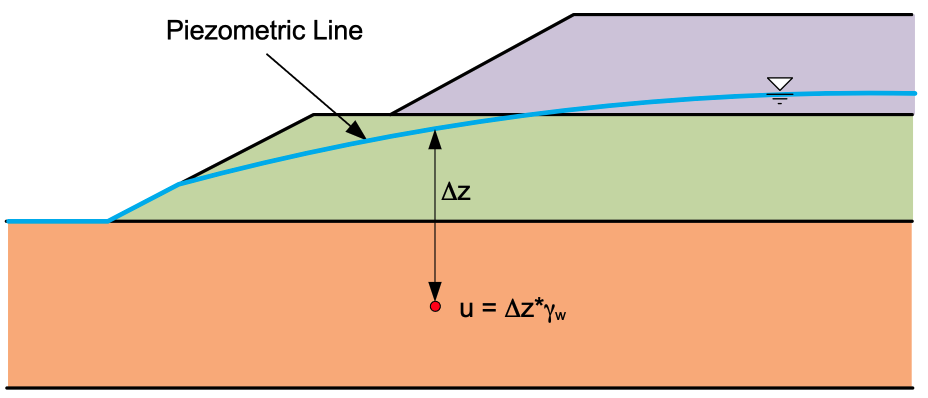

# The Limit Equilibrium Method

The Limit Equilibrium Method represents the fundamental approach to slope stability analysis, evaluating the stability of slopes by examining the equilibrium of forces acting on a potential failure mass. This method operates on the principle that a slope remains stable when the resisting forces, primarily the shear strength of the soil, exceed or equal the driving forces such as weight and other destabilizing influences.

The first step in a limit equilibrium analysis is to select a candidate failure surface which is typically circular. For slopes with narrow layers of weak soil, a non-circular failure surface may be used.

The stresses along the failure surface are then calculated assuming the soil is at the limit of static equilibrium ($\tau$). Next, the total available strength along the failure surface is calculated ($s$).Then the factor of safety $F$ is expressed mathematically as:

> $F = \dfrac{s}{\tau}$

The shear strength of soil is based on the Mohr-Coulomb failure criterion. For a total stress analysis:

> $s = c + \sigma \tan \phi$

Where $s$ represents the shear strength, $c$ is the  cohesion, $\sigma$ is the  normal stress, and $\phi$ is the angle of internal friction. For saturated soils, typically $\phi=0$ and $c = S_u$ where $S_u$ is the undrained shear strength. For an effective stress analysis:

> $s = c' + \sigma' \tan \phi'$

where $c'$ is the effective cohesion, $\sigma'$ is the effective normal stress, and $\phi'$ is the effective angle of internal friction. This expression is typically written as:

> $s = c' + (\sigma - u) \tan \phi'$

where $u$ is the pore pressure. In XSLOPE, pore pressures are defined by entering the geometry of a piezometric line and then for any point below the line, the pore pressure is calculated as:

> $u = \Delta y * \gamma_w$

where $\Delta y$ is the distance from the piezometric line to the point in question and $\gamma_w$ is the unit weight of water. 

{width="700px"}

The pore pressures can also be derived from a 2D finite element seepage analysis of the slope using the [seepage tools](../seepage/overview.md) in XSLOPE. In this case, the pore pressure at a point is interpolated from the nodes of the element containing the point using the element basis functions. This is the most accurate way to obtain pore pressures.  

## Developed Shear Strength

When applying the limit equilibrium method, we often utilize what is called the "developed shear stregth". The main equation:

> $F = \dfrac{s}{\tau}$

can be rewritten as:

> $\tau = \dfrac{s}{F}$

> $\tau = \dfrac{c + \sigma \tan \phi}{F}$

> $\tau = \dfrac{c}{F} + \dfrac{\sigma \tan \phi}{F}$

Then the two terms can be expressed as:

> $c_d = \dfrac{c}{F}$

> $\tan \phi_d = \dfrac{\tan \phi}{F}$

where $c_d$ = the developed or mobilized cohesion and $\tan \phi_d$ = the developed or mobilized friction. For example, if $F = 2.0$, the mobilized cohesion and friction would be one half the total available strength values. 

## Method of Slices

The Method of Slices represents a numerical technique that divides the potential failure mass into a series of vertical slices for analysis. Rather than analyzing the entire mass as a single unit, each slice is examined individually, with the overall stability determined by summing the forces and moments acting on all slices. This approach allows us to handle complex geometries and varying soil conditions that would be impossible to analyze using simpler methods.

For equilibrium to be satisfied for a candidate failure surface, the following three conditions must be satisfied:

>$\Sigma F_x = 0$

>$\Sigma F_x = 0$

>$\Sigma M = 0$

Typically, the number of equations is less than the number of unknowns. Therefore, simplifying assumptions must be 
used. Some techniques satisfy only a portion of the equilibrium conditions. If all conditions are satisfied, it is called a complete equilibrium procedure. 

The basic forces on each slice and the slice geometry are as follows: 

where:

>$W$ = weight of the slice 
$N$ = normal force acting on the base of the slice 
$S$ = shear force acting on the base of the slice 
$E_i$ = interslice force acting on the left side of the slice 
$X_i$ = interslice force acting on the right side of the slice 
$\Delta x$ = width of the slice 
$\Delta \ell$ = length of the slice base, calculated as $\Delta x \sec \alpha$ 
$\alpha$ = inclination angle of the slice base 
$\beta$ = inclination angle of the slope at the top of the slice 

Sometimes the side forces are represented as: 

where:
>$Z_i$ = magnitude of the interslice force 
$\theta_i$ = inclination angle of the interslice force 

Slopes can be either left-facing or right-facing. The diagrams above are based on a left-facing slope and the 
equations for each of the analysis methods are based on this convention. For right-facing slopes, the equations are the same, but the 
directions of the forces are reversed simply by changing the sign convention of $
\alpha$ and $\beta$ as follows:

{width="800px"}

One exception to this is Spencer's method. Details can be found in the XSLOPE source code for Spencer's method.

## Advanced Loading Conditions

In addition to the basic forces acting on each slice, modern slope stability analysis often incorporates additional loading conditions that can significantly affect the stability calculations. These advanced loading conditions include distributed loads, seismic loads, reinforcement forces, and tension cracks.

**Distributed Loads**: Surface loads such as traffic, construction equipment, or other surcharges can be represented 
as distributed forces acting on the top of slices. These loads contribute to both the driving forces and the normal 
forces on the slice base. Distributed loads correspond to water for submerged or partially submerged slopes or 
surchage loads from buildings, roads, or other structures above the slope. 

{width="800px"}

In XSLOPE, these loads can be applied as a uniform load across the top of the slices or as a varying load that changes with position along the slope.
Distributed loads 
are applied as a 
load per 
unit length, which is then 
converted to a force acting on each slice based on its width and the load intensity (see below). 

**Seismic Loads:** In seismically active regions, the stability of slopes can be significantly affected by seismic 
forces. These forces are typically represented as horizontal accelerations acting on the mass of each slice. The pseudo-static approach is commonly used, where a horizontal acceleration coefficient $k$ is applied to the weight of each slice to calculate the seismic force.

The seismic force is assumped to act horizontally in a direction that causes sliding and it acts through the center of gravity of each slice. 

**Reinforcement:** Reinforcement forces are used to represent the effects of geosynthetics, soil nails, or other 
structural elements that provide additional stability to slopes. These forces can be modeled as tensile forces acting along the base of the slices, providing resistance to sliding and contributing to the overall stability of the slope.

For the limit equilibrium methods in XSLOPE, the reinforcement is assumed to be flexible and therefore acts in a direction parallel to the base of the slice in a direciton that resists shear. More comprehensize treatment of reinforcement is included in the [finite element method](../fem/overview.md).

**Tension Cracks:** In the upper part of the slope, the cohesion of a soil can be greater than the driving forces. 
Since soils can generally not withstand tension, this is unconservative. To address this problem, a tension crack can be added to a user-specified depth and the tension crack forms the upper boundary of the slices and not cohesive forces are allowed on the slice (crack) boundary. It is also possible to assume that the crack fills with water, providing a small force driving failure as an extra measure of conservative analysis.

{width="700px"}

When applied to the slices, these advanced loading conditions are treated as additional forces acting on the slices 
as follows:

The distributed load acting on the top of each slice is converted to a resultant force by multiplying the load 
intensity by the width of the slice and it acts at point $d$. The seismic force $kW$ acts horizontally at the center 
of gravity of each slice, and the reinforcement force $P$ acts along the base of the slice in a direction that 
resists sliding. The load corresponding to water in the tension crack is converted to a single resultant force $T$ 
acting horizontally at point $c$ which is one third of the distance from the bottom of the slice.

## Limit Equilibrium Methods Supported in XSLOPE

The following limit equilibrium methods are supported in XSLOPE. Each method has a page describing in detail the equations used, solution technique, etc. 

**Ordinary Method of Slices (OMS):** The [Ordinary Method of Slices](oms.md) provides the simplest approach to slope 
stability 
analysis. Since it requires no iteration, results can be obtained rapidly. However, these advantages come with 
significant limitations: the method only satisfies moment equilibrium, can produce unconservative or overly consrvative 
results, and completely neglects interslice forces. This makes OMS most suitable for preliminary analysis and simple geometries where quick results are more important than high accuracy. 

**Simplified Janbu Method:** The [Janbu Method](janbu.md) offers a different approach by satisfying force equilibrium rather than 
moment equilibrium. This makes it suitable for circular or non-circular failure surfaces where moment equilibrium might be less critical. The method includes a correction factor to compensate for the missing moment equilibrium, though this factor is empirical and may not always provide accurate compensation. [Documentation]

**Bishop's Simplified Procedure:** [Bishop's Method](bishop.md) represents a significant improvement over OMS and 
Janbu by satisfying both moment and vertical force equilibrium. This approach provides more accurate results while maintaining reasonable computational efficiency. However, the requirement for circular surfaces limits its applicability, and the iterative solution process increases computational time. Bishop's method finds its niche in projects with circular failure surfaces and moderate accuracy requirements.

**Force Equilibrium Methods:** The [General Force Equilibrium Method](force_eq.md) provides a framework for explicit 
treatment of interslice forces using magnitude and angle parameters. This method works on any failure surface and 
offers good accuracy when interslice forces are important. However, it only satisfies force equilibrium, requires an 
iterative solution, and depends on assumptions about interslice force angles. This method is most valuable when 
explicit interslice force treatment is needed and when complex geometries require more sophisticated analysis than 
simple methods can provide. Two variations of the force equilibrium method are available in XSLOPE:

The **Corps Engineers method** applies the force equilibrium framework with the assumption that interslice forces are horizontal. 

The **Lowe-Karafiath method** assumes that the interslice force at each slice boundary is equal to the average of 
the slope angle at the top of the slice $\beta$ and the failure surface angle at the bottom of the slice $\alpha$.

**Spencer's Method:** [Spencer's Method](spencer.md) represents the most sophisticated approach available in XSLOPE, 
satisfying 
both force and moment equilibrium simultaneously. This comprehensive approach provides the highest accuracy and can 
handle both circular and non-circular failure surfaces. However, this accuracy comes at a cost: the method is the 
most complex to implement, requires and iterative solution, and is computationally intensive. Spencer's method is 
generally considered the best and most accurate of the methods supported in XSLOPE. 

The primary features of the limit equilibrium methods supported in XSLOPE are summarized in the table below:

| Method | Equilibrium Conditions                       | Failure Surface | Iterative Solution | Interslice Forces | Accuracy |
|--------|----------------------------------------------|-----------------|--------------------|-------------------|----------|
| Ordinary Method of Slices | Overall Moment                               | Circular | No | None | Low |
| Simplified Janbu | $\Sigma F_x=0$                               | Circular/Non-Circular | No | None | Low |
| Bishop's Simplified Procedure | Overall Moment, $\Sigma F_y=0$               | Circular | Yes | None | Moderate |
| Corps Engineers | $\Sigma F_x=0$, $\Sigma F_y=0$               | Circular/Non-Circular | Yes | Horizontal | High |
| Lowe-Karafiath | $\Sigma F_x=0$, $\Sigma F_y=0$               | Circular/Non-Circular | Yes | Average of Slope and Surface Angles | High |
| Spencer's Method | $\Sigma F_x=0$, $\Sigma F_y=0$, $\Sigma M=0$ | Circular/Non-Circular | Yes | Explicit | Very High |

## Automated Search for the Critical Factor of Safety 

For each of the solution methods, the factor of safety can be computed either for a single failure surface or XSLOPE can perform an exhaustive search where a large number of candidate failure surfaces are considered until the surface with the minimum or critical factor of safety is found. This process is described in more detail in the [search documentation](search.md).

## Rapid Drawdown Analysis

Rapid drawdown analysis represents a specialized application that can use any of the other methods as its foundation. This approach is specifically designed for dam and levee analysis where water level changes create unique stability challenges. The method accounts for undrained conditions and provides multi-stage analysis that captures the complex behavior of soils during rapid water level changes. However, this specialization limits its applicability to specific scenarios, and the multi-stage approach increases computational complexity. In XSLOPE, rapid drawdown analysis can be peformed with any of the supported limit equilibrium methods. [Documentation](rapid.md)

## Reliability Analysis

XSLOPE includes an option to perform a reliability analysis with any of the supported limit equilibrium methods. Rather than finding a single factor of safety, selected inputs are perturbed and the critical factor of safety is computed for each combination of inputs allowing the computation of a probability of failure. [Documentation](reliability.md)

