# Rapid Drawdown Analysis

When designing a dam or levee, it is crucial to consider the potential for rapid drawdown of the water level. This can occur due to various factors such as dam failure, sluice gate operation, or other emergency situations. When the water level drops rapidly, it can lead to significant changes in the forces acting on the structure, potentially causing instability or failure. Specifically, the rapid drawdown eliminates the hydrostatic pressure on the upstream side of the structure, removing the buoyancy effect of the water, which can lead to a sudden increase in effective stress and shearing under undrained conditions.

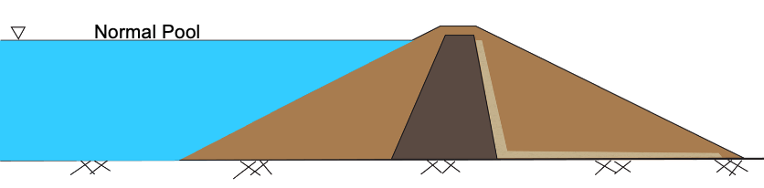

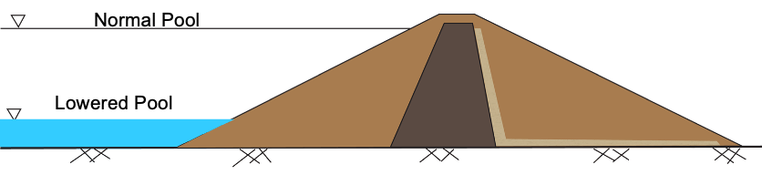

To simulate this scenario, we utilize a "multi-stage" approach in our analysis. In the first stage, we apply the initial conditions with the water level at its full height and use the consolidation stresses resulting from these conditions to determine the undrained strength of the soils. In the second stage, we use these undrained strengths and the loading conditions corresponding to the lowered water level and determine the factor of safety for rapid drawdown conditions. The **slopetools** package provides a convenient way to perform this analysis using the `rapid_drawdown` function. The equations and methodology used in this function are described in the following sections.

## When Does Rapid Drawdown Apply?

Rapid drawdown occurs when the pool is lowered rapidly enough that pore water pressures in some of the soils cannot dissipate quickly enough to maintain stability. To determine when rapid drawdown may apply, Duncan, et al. (1992) suggested using the dimensionless time factor, T, from consolidation theory. T is defined as:

>>$T = \dfrac{c_v t}{D^2}   \qquad (1)$

where:

>> $c_v$ = coefficient of consolidation [L²/t] 
$t$ = time since the pool was lowered [t] 
$D$ = maximum drainage distance [L]

Then, we use the following rubric:

|  T   | Rapid Drawdown Applicable?                         |
|:----:|----------------------------------------------------|
| >3.0 | Drainage should be sufficient - not rapid drawdown |  
| <3.0 | Assume rapid drawdown                              |

Approximate values of $c_v$ are as follows:

| Soil Type    | $c_v$ [ft²/day] |
|--------------|----------------|
| Coarse Sand  | > 10,000       |
| Fine Sand    | 100 - 10,000   |
| Silty Sand   | 10 - 1000      |
| Silt         | 0.5 - 100      |
| Compacted Clay | 0.05 - 5       |
| Soft Clay    | < 0.02         |

_(Taken from Duncan et al, 1992)_

For example, consider the following levee. The maximum drainage distance for pore pressures do dissipate is 35 ft, and the coefficient of consolidation for the compacted clay is 2 ft²/day. If the pool is lowered over 50 days, we can calculate T as follows:

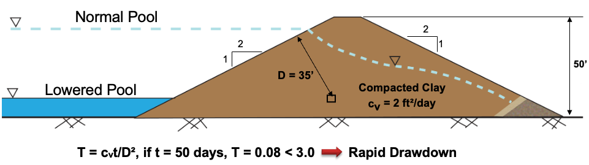

Since T = 0.09 < 3.0, we assume rapid drawdown applies.

Here is another example involving a dam with a high permeability shell and a low permeability core. In this case, we need to examine the core and the shell separately. The core consists of compacted clay with a maximum drainage distance of 14 ft and a coefficient of consolidation of 2 ft²/day. The shell consists of fine sand with a maximum drainage distance of 31 ft and a coefficient of consolidation of 200 ft²/day. If the pool is lowered over 50 days, we can calculate T for each soil as follows:

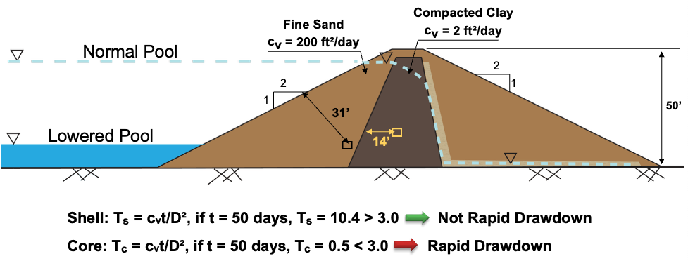

In this case T for the core = 0.5 < 3.0, so we assume rapid drawdown applies to the core. T for the shell = 10.4 > 3.0, so we  assume rapid drawdown does not apply to the shell.

## Three-Stage Analysis

In slopetools, we use the three-stage analysis method developed by Duncan, Wright, and Wong (1990) to analyze rapid drawdown conditions. This technique is described in detail in Soil Strength and Slope Stability, 2nd Edition, Duncan, Wright, and Brandon. The three stages are:

>>1) Compute effective stresses based on pre-drawdown conditions 
2) Compute FS for post-drawdown conditions using total stress analysis. Undrained strength is a function of effective stress from stage 1. 
3) Compute FS for post-drawdown conditions using drained strengths

The lower FS from stages 2 and 3 is the final FS for rapid drawdown conditions.

### Stage 1: Pre-Drawdown Conditions

Stage 1 analysis is performed for conditions prior to drawdown. The objective is to estimate the effective stresses along the slip surface prior to drawdown. This is also referred to as the consolidation stage.

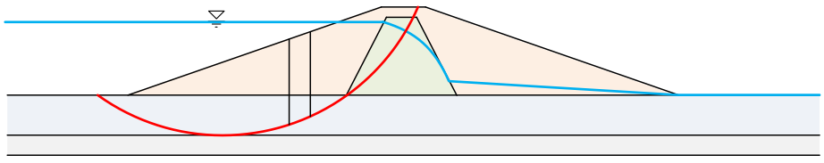

To get the consolidation stresses, we perform a normal slope stability analysis using the conditions corresponding to the pool at the full level. The objective of this stage of the analysis is not the factor of safety, but the effective normal stresses on the base of each slice, which is one of the products of the slope stability functions (oms, bishop, spencer, etc.).

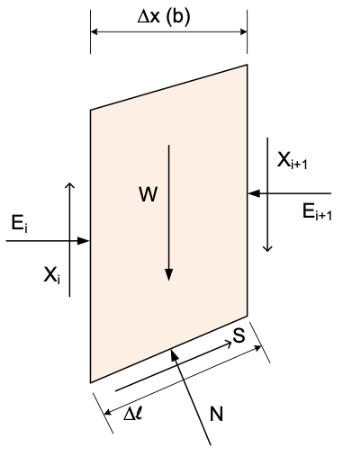{width=300px}

Using the normal force ($N$) found by the solution, we can calculate the effective normal stress on the failure plane at the end of the consolidation stage as:

>>$\sigma_{fc} = \dfrac{N}{\Delta \ell} - u$

Since the values returned by the solvers are actually effective normal forces ($N'$), we can also calculate as follows:

>>$\sigma'_{fc} = \dfrac{N'}{\Delta \ell}   \qquad (2)$

The precise mechanics of how $N'$ is computed vary according to the solver used. The equations and methodology for computing $N'$ is described in the **Methods** section of this documentation.

Likewise, the shear stress on the failure plane at the end of the consolidation stage is:

>>$\tau_{fc} = \dfrac{S}{\Delta \ell}$

>>$\tau_{fc} = \dfrac{1}{F}(c' + \sigma'_{fc} \tan \phi')   \qquad (3)$

Note that this is the mobilized shear strength and $F$ is the factory of safety returned by the solver in the Stage 1 solution.

## Stage 2 - Compute FS for Post-Drawdown Conditions

In Stage 2, we perform a total stress analysis using undrained shear strengths for the low-K zones. The undrained strengths are estimated using the consolidation stresses computed in Stage 1, and the driving forces are calculated using post-drawdown conditions.

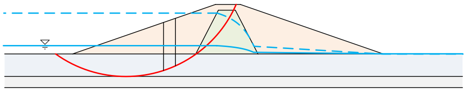

The process of finding the appropriate undrained strength for the Stage 2 analysis based on the consolidation stresses from Stage 1, involves a variation of the Mohr-Coulomb failure envelope. Consider the following diagram:

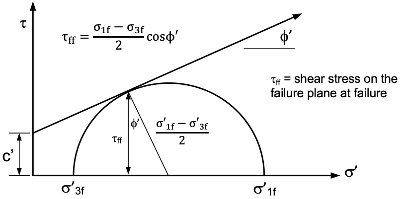{width=610px}

The $\tau_{ff}$ is the shear stress on the failure plane at failure. $\sigma'_{1f}$ and $\sigma'_{3f}$ are major and minor principal effective stresses at failure. For our application, we need to correlate $\tau_{ff}$ with $\sigma'_{fc}$. To do this, we create a new plot as follows:

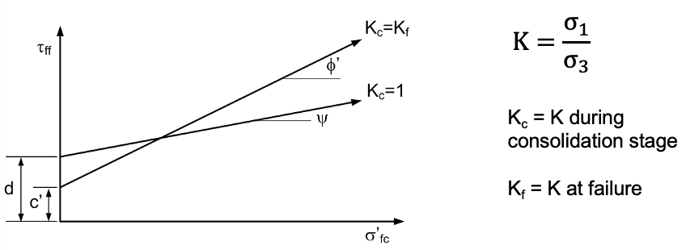

These two curves are function of the stress anisotropy during the consolidation stage. The $K_c = K_f$ curve with $c'$ and $\phi'$ corresponds to the case where the ratio of $\sigma'_1$ and $\sigma'_3$ is on the verge of failure. The other curve with $d$ and $\psi$ corresponds to the case where $\sigma'_1 = \sigma'_3$ during the consolidation stage. Note that the $c'$ and $\phi'$ values for the $K_c = K_f$ curve can be obtained from a $CU$ triaxial test or they can be obtained from a $CD$ or $\overline{CU}$ triaxial test. The $K_c = 1$ line represents $\tau_{ff}$ vs. $\sigma'_3$ from $CU$ triaxial tests. The $\tau_{ff}$ values are found using the equation in the previous figure above. Thus, both lines can be obtained from one set of $\overline{CU}$ triaxial tests.

When performing rapid drawdown analysis with the **slopetools** package, a set of $d$ and $\psi$ values should be entered in the material properties table for each soil with poor drainage and assumed to apply to rapid drawdown conditions. The more freely draining soils are not included in the analysis, and the $d$ and $\psi$ values should be left blank.

### Anisotropy and K Interpolation

For the stresses on the base of each slice, the actual $K$ ratio should vary somewhere between $K_c = 1$ and $K_c = K_f$. For example, if $K_c = 2$, the middle line in this figure would apply.

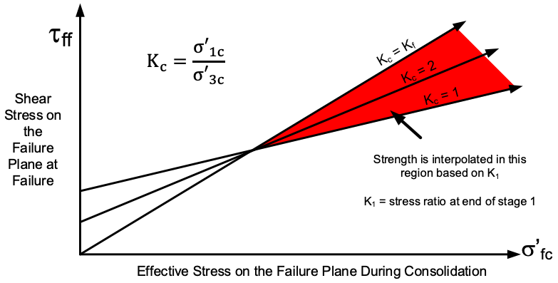{width=720px}

If we define $K_1$ as the stress ratio on the failure plane at the end of stage 1, we interpoloate the two curves and extract the appropriate $\tau_{ff}$ value to use in the Stage 2 calculations. First of all, we compute $K_1$ as follows:

>>$K_1 = \dfrac{\sigma'_{fc} + \tau_{fc}[(\sin \phi' + 1) / \cos \phi']}{\sigma'_{fc} + \tau_{fc}[(\sin \phi' - 1) / \cos \phi']}   \qquad (4)$

Where $\sigma'_{fc}$ and $\tau_{fc}$ are the effective normal and shear stresses on the shear plane at the end of consolidation and are found using equations (2) and (3) above. Equation (4) assumes that the orientation of the principal stresses at the end of consolidation is the same as the orientation of the principal stresses at failure. Values of the undrained shear strength for the effective consolidation stress $\sigma'_{fc}$ and a consolidation ratio $K_c = K_1$ are obtained by interpolating the $K_c = 1$  and $K_c = K_f$  failure envelopes using the following equation:

>>$\tau_{ff} = \dfrac{(K_f - K_1) \tau_{ff(K_c=1)} + (K_1 - 1) \tau_{ff(K_c=K_f)}}{K_f - 1}  \qquad (5)$

The two $\tau_{ff}$ values are found by evaluating the two envelopes using the $\sigma'_{fc}$ found from stage 1. The $K_f$ value used in this equation can be found from:

>>$K_f = \dfrac{(\sigma'_{fc} + c' \cos \phi')(1 + \sin \phi')}{(\sigma'_{fc} - c' \cos \phi')(1 - \sin \phi')}   \qquad (6)$

### Negative Stresses

If significant cohesion exists, the $\sigma'_3$ values can become negative, leading to a negative (and meaningless) $K$ value.

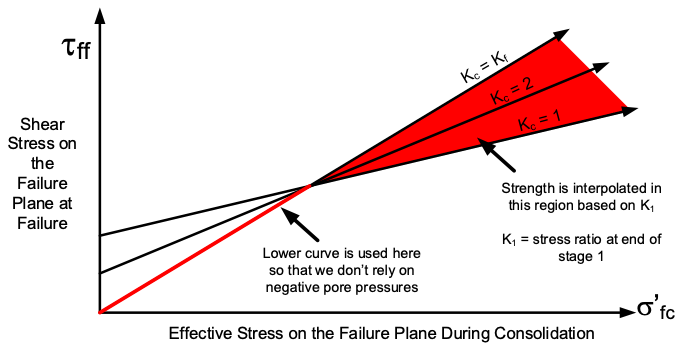

In this case, we use the lower of the $K_c = 1$  and $K_c = K_f$  curves. Negative effective stresses can be checked using the following two equations:

>>$\sigma'_{3c} = \sigma'_{fc} + \tau_{fc} \dfrac{\sin \phi' - 1}{\cos \phi'}  \qquad (7)$ (for the $K_c = 1$ envelope)

>>$\sigma'_{3c} = (\sigma'_{fc} - c' \cos \phi') \dfrac{1 - \sin \phi'}{\cos^2 \phi'}  \qquad (8)$ (for the $K_c = K_f$ envelope)  

If either is negative, no interpolation is required and we use the lower of the two strength values coming from the two curves.

### FS Calculations

After the undrained strengths are computed for low K zones, the factor of safety ($FS$) is calculated. Drained strengths are used for high K zones, and driving forces (based on weight of slices) are calculated using post-drawdown conditions. 

## Stage 3 - Check Drained Strengths

For Stage 3, undrained strengths used for slices in low K zones are compared with drained strengths. If drained strength is lower than the undrained strength, the drained strength is assigned to that slice and the FS is re-calculated. Note that some slices may used drained strength while others may use undrained. If drained > undrained for all slices, there is no need to re-calculate FS. For the drained strength calculations:

>>$\sigma' = \dfrac{N'}{\Delta \ell}   \qquad (9)$

>>$\tau = c' + \sigma' \tan \phi'   \qquad (10)$

Where $N'$ is the effective normal force found in Stage 2 using post-drawdown conditions.

If Stage 3 calculations are required (drained less than undrained in at least one slice), then the FS from Stage 3 = the rapid drawdown FS. If Stage 3 calculations are not required, the FS from Stage 2 = the rapid drawdown FS. 

## Inputs and Calculations

To perform a rapid drawdown analysis, the following additional inputs must be provided in the input template Excel file:

| Category | Description |
|----------|-------------|
| Material Properties| $d$ and $\psi$ for all materials to be analyzed using multi-stage approach. |
| Pore Pressures | Two piezometric lines: one for Stage 1 and one for Stage 2 |
| Distributed Loads | Two sets of distributed loads, one for Stage 1 (full pool) and one for Stage 2 (lowered pool) |

In summary, the calculations are done in the following process:

**Stage 1**

1. Using the drained strength ($c'$ and $\phi'$) strength properties for all materials and using the piezometric line and distributed loads for the full pool condition, calculate the factory of safety using the selected solver. This will return a factor of safety (FS) and a set of effective normal forces ($N'$) on the base of the slice. 

2.  Calculate $\sigma'_{fc}$ and $\tau_{fc}$ using equations (2) and (3). 

**Stage 2**

3. Calculate $K_1$ via equation (4), using $\sigma'_{fc}$ and $\tau_{fc}$ from step 2. 

4. Using $\sigma'_{fc}$ from step 2, calculate $\tau_{ff(K_c=1)}$ from the $d - \psi$ curve and $\tau_{ff(K_c=K_f)}$ from the $c - \phi$ curve. 

5. Calculate $K_f$ using equation (6) and $\sigma'_{fc}$ from step 2. 

6. Calculate $\tau_{ff}$ from equation (5) 

7. Steps 3-6 are performed for each low K soil. For each of these soils, set $c$ = $\tau_{ff}$ and set $\phi = 0$. For the high K soils, use the normal $c - \phi$ values.

8. Using the strengths from step 7 and the pore pressures and distributed loads corresponding to drawdown (lowered pool) conditions, calculate $FS$ using the selected solver. This is the $FS$ for Stage 2.

**Stage 3**

9. For each slice with a low K soil at the bottom, use the $N'$ values calculated in Stage 2 and calculate the drained shear strength ($\tau$) using equations (9) and (10). Compare this value to the $\tau_{ff}$ value used in Stage 2. If the drained strength is smaller for any slice, replace the undrained strength values with the original $c - \phi$ values and recompute $FS$. This is the $FS$ for Stage 3.

10. Compare the $FS$ for Stages 2 & 3. The smaller of the two is the final $FS$ for rapid drawdown conditions.