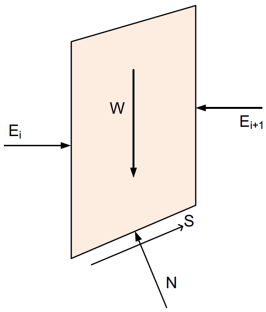

# Bishop's Simplified Method

Bishop's Simplified Method is a widely used limit equilibrium technique for analyzing slope stability, especially suitable for **circular slip surfaces**. It improves on the Ordinary Method of Slices by including interslice normal forces and satisfies both **moment** and **vertical force** equilibrium. The key assumptions are:

- Circular slip surface  
- Side forces are **horizontal** (i.e., interslice shear forces are neglected, but normal forces are included)
- Satisfies:
    - Moment equilibrium
    - Vertical force equilibrium
- Does **not** satisfy horizontal force equilibrium

With these assumptions, the forces acting on the slice are as follows:

{width=400px}

Where:

>$W$ = weight of the slice  
$\alpha$ = base inclination angle of the slice  
$\Delta \ell$ = length of the base  
$c', \phi'$ = effective cohesion and friction angle  
$u$ = pore water pressure  
$N$ = normal force on the base of the slice  
$S$ = shear force at the base

Summing forces in the vertical direction:

>$\sum F_y = 0$

>$N \cos \alpha + S \sin \alpha - W = 0  \qquad (1)$

>$S = \tau \Delta l = \dfrac{s \Delta \ell}{F}$

>$S = \dfrac{1}{F} \left[c \Delta \ell + (N - u \Delta \ell) \tan \phi' \right]   \qquad (2)$

Substituting (2) into (1):

>$N \cos \alpha + \left( \dfrac{1}{F} \left[ c \Delta \ell + (N - u \Delta \ell) \tan \phi' \right] \right) \sin \alpha - W = 0$

Solving for N:

>$N = \dfrac{W - \dfrac{1}{F} \left[ c \Delta \ell - u \Delta \ell \tan \phi' \right] \sin \alpha}{\cos \alpha + \dfrac{\sin \alpha \tan \phi'}{F}}   \qquad (3)$

From the general equation (based on moment equilibrium):

>$F = \dfrac{\sum (c + \sigma' tan \phi') \Delta \ell}{\sum W sin \alpha}$

>$\sigma' = \dfrac{N}{\Delta \ell} - u$

thus:

>$F = \dfrac{\sum (c \Delta \ell + (N - u \Delta \ell) tan \phi')}{\sum W sin \alpha}   \qquad (4)$

Substituing (3) into (4) and solving for $F$ gives:

>$F = \dfrac{\sum \left[ \dfrac{c \Delta \ell \cos \alpha + (W - u \Delta \ell \cos \alpha) \tan \phi'}{\cos \alpha + \dfrac{\sin \alpha \tan \phi'}{F}} \right]}{\sum W \sin \alpha}   \qquad (5)$

For total stress analysis:

>$F = \dfrac{\sum \left[ \dfrac{c \Delta \ell \cos \alpha + W \tan \phi'}{\cos \alpha + \dfrac{\sin \alpha \tan \phi}{F}} \right]}{\sum W \sin \alpha}$

The factor of safety $F$ appears on both sides of the equation, so it must be solved **iteratively**.

Once $F$ is determined, $N$ can be computed using equation (3) above.

---

## Summary

Assumes **horizontal side forces**
Satisfies **moment** and **vertical force** equilibrium
Applicable to **circular slip surfaces**
Requires **iteration** to solve for $F$
More accurate than OMS, especially for **effective stress analysis** with high pore pressures

