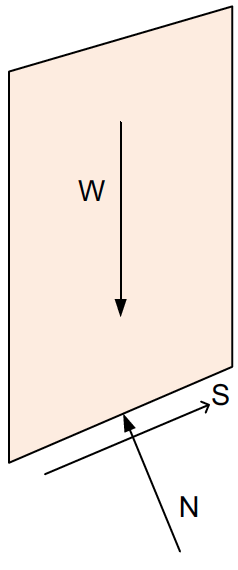
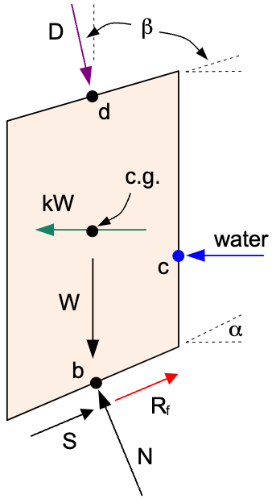

#Janbu Simplified Method

Janbu's Simplified Method is one of the earliest and most commonly used slope stability analysis techniques based on limit equilibrium principles. It provides an approximate factor of safety (FS) for a mass of soil sliding along a specified failure surface by assuming partial force equilibrium . The method was developed by Norwegian engineer **Nils Janbu** in the 1950s to simplify slope stability analysis for circular and non-circular failure surfaces. The factor of safety computed by Janbu's simplified method typically **underestimates** the true FS and is therefore considered conservative. A correction factor was later introduced to compensate for the oversimplifications inherent in the method. 

The forces on the slice considered by the Janbu method are as follows:

>>{width=200px}

For the Janbu method, the side forces are assumed to cancel each other and are therefore iginored. The method does not satisfy moment equilibrium and only partially satisfies force equilibrium. It can be used on both circular and non-circular failure surfaces. 

From the basic theory of limit equilibrium, the factor of safety $F$ is defined as the ratio of the resisting forces to the driving forces acting on the sliding mass, or:

>>$F = \dfrac{\sum \text{Resisting Forces}}{\sum \text{Driving Forces}}$

For the Janbu simplified method, equilibrium is analyzed along the base of each slice. The resisting forces are the shear resistance at the base of each slice, while the driving forces are the weight of each slice acting parallel to the base of the slice. The  shear force on the base of each slice is given by:

>>$S = c \Delta \ell + (N - u \Delta \ell) \tan\phi   \qquad (1)$

To get the normal force N, we sum forces in perpendicular to the base of the slice. The normal force N is given by:

>>$N = W \cos\alpha  \qquad (2)$

>>$N' = W \cos\alpha - u \Delta \ell  \qquad (3)$

Therefore, the shear force becomes:

>>$S = c \Delta \ell + N' \tan\phi$

>>$S = c \Delta \ell + (W \cos\alpha - u \Delta \ell) \tan\phi  \qquad (4)$

This represents the resisting force on the base of the slice. The driving force is the component of the weight acting parallel to the base of the slice, which is given by:

>>$W \sin\alpha     \qquad (5)$

So the factor of safety can be expressed as:

>>$F = \dfrac{resisting force}{driving force}   \qquad (6)$

>>$F = \dfrac{\sum \left[c \Delta \ell + (W \cos\alpha - u \Delta \ell) \tan\phi\right]}{\sum W \sin\alpha}     \qquad (7)$

## Correction Factor $f_o$

To account for the neglect of interslice forces and moment equilibrium, Janbu proposed a correction factor:

The correction factor $f_o$ is based on the following relationship:

>>{width=500px}

The d/L ratio is the ratio of the distance from the center of the failure surface to the point of interest (d) and the length of the failure surface (L). The correction factor is used to account for the fact that the Janbu method does not satisfy moment equilibrium. The correction factor is a function of the d/L ratio and is calculated using the following equation:

>>$f_o = 1 + b_1  * \left[\dfrac{d}{L} - 1.4 * \left(\dfrac{d}{L}\right)^2\right]    \qquad (8)$

The $b_1$ value is a function of the soils in the slope and is found as follows:

| Soil Type                           | $b_1$ |
|-------------------------------------|-------|
| c-only soil (undrained, $\phi$ = 0) | 0.67  |
| c-$\phi$ soil                       | 0.5   |
| $\phi$-only soil (no cohesion)      | 0.31  |

This correction attempts to mimic the effects of moment balance and interslice forces without modeling them directly. Thus, the final factor of safety equation for Janbu's Simplified Method becomes:

>>$F_{corr} = f_o \cdot F   \qquad (9)$

Where $F_{corr}$ is the corrected factor of safety, $F$ is the factor of safety calculated using equation (7), and $f_o$ is the correction factor.

## Complete Formulation with Extra Forces

For a complete implementation of Janbu's Simplified Method, we need to consider additional forces acting on the slice. The full set of forces are shown in the following figure:

>>{width=300px}

Where:

>>$D$ = distributed load resultant force  
$\beta$ = inclination of the distributed load (perpendicular to slope)  
$kW$ = seismic force for pseudo-static seismic analysis  
$c.g.$ = center of gravity of the slice  
$P$ = reinforcement force on base of slice  
$T$ = tension crack water force  

Each of these forces is described in detail in the [Ordinary Method of Slices (OMS)](oms.md) section. The forces $D$, $kW$, $P$, and $T$ are included in the Janbu simplified method factor of safety equation as follows:

To revise the factor of safety equation for Janbu's method to include the $D$, $kw$, $P$, and $T$ forces, we first need to consider how these forces affect the calculation of the effective normal force $N'$ (equation 3 above). To do this, we again sum forces perpendicular to the base of the slice. The equation for N then becomes:

>>$N'  = W \cos \alpha - kW \sin \alpha + D \cos (\beta - \alpha) - T \sin \alpha - u \Delta \ell  \qquad (10)$

The resisting force parallel to the base of the slice includes both the shear force $S$ and the reinforcement force $P$. The shear force is given by:

>>$S = c \Delta \ell + N' \tan\phi$

Substituting equation (10) into this gives:

>>$S = c \Delta \ell + (W \cos \alpha - kW \sin \alpha + D \cos (\beta - \alpha) - T \sin \alpha - u \Delta \ell) \tan\phi   \qquad (11)$

Next, we need to update the driving force parallel to the base of the slice. Updating equation (5) above gives:

>>$W \sin \alpha + kW \cos \alpha  - D \sin (\beta - \alpha)  + T \cos \alpha   \qquad (12)$

Finally, the factor of safety is founcd by substituting the updated resisting and driving forces into equation (6):

>>$F = \dfrac{\sum \left[c \Delta \ell + (W \cos\alpha - kW \sin \alpha + D \cos (\beta - \alpha) - T \sin \alpha - u \Delta \ell) \tan\phi\right] + P}{\sum (W \sin\alpha + kW \cos\alpha  - D \sin (\beta - \alpha))  + T \cos \alpha}   \qquad (13)$

It should be remembered that $T$ only applies to the side of the uppermost slice. $T$ = 0  for all the other slices.

Once again, we apply the correction factor $f_o$ to account for the neglect of interslice forces and moment equilibrium as shown in equation (9) above.

---

## Summary

Advantages:

- Fast and easy to compute
- Conservative (safe) results
- Effective for preliminary design and parametric studies
- Can be applied to circular and non-circular failure surfaces

Limitations:

- May significantly underestimate FS for complex geometries
- Not suitable for highly irregular slopes or layered soils with complex interactions
- Not a complete equilibrium method (no moment or interslice force balance)

