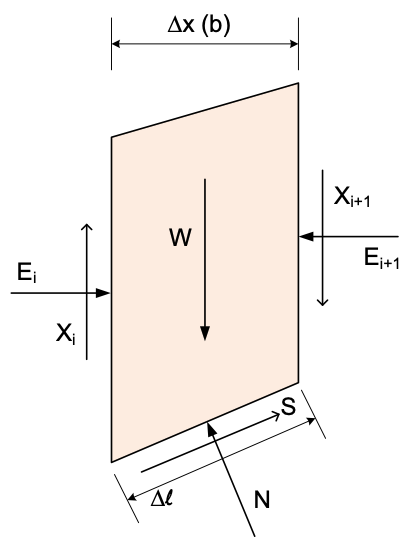
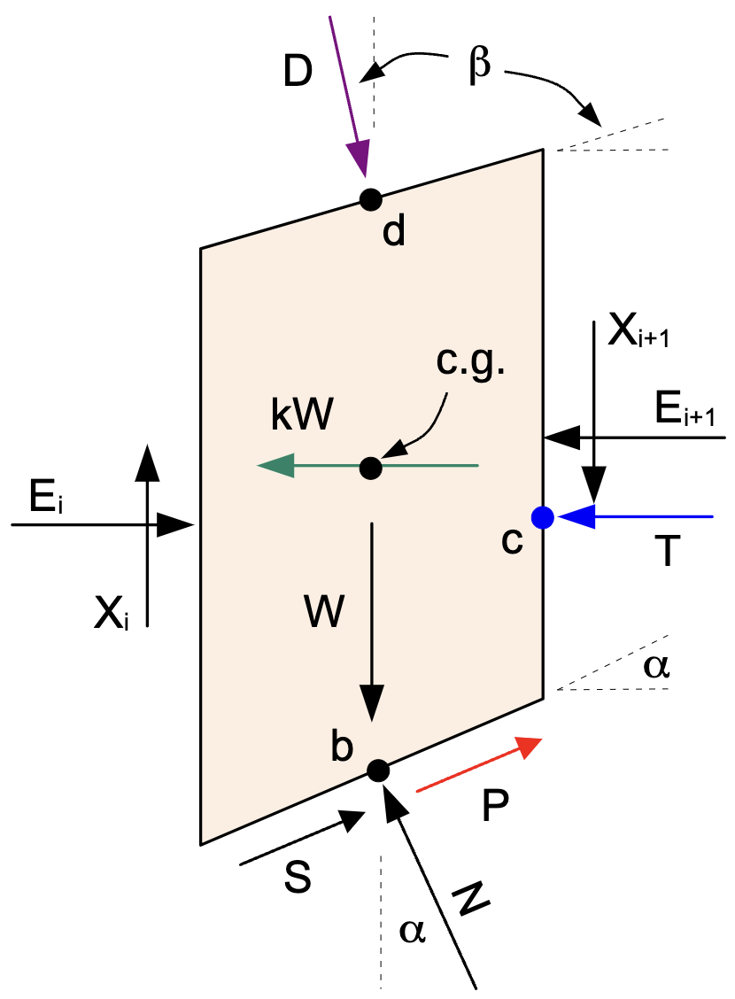

# Line of Thrust

For complete equilibrium procedures like Spencer's method, it is common to compute and display a "line of thrust" to 
assess the slope stability solution. The line of thrust is a line connecting the locations of the side forces acting 
on the sides of the slices. The line of thrust is generally expected to be about 1/3 of the way up from the base of 
the slice. However, if tension is present in the slice, the line of thrust may be higher or lower, typically at the 
top of the slope. 
After computing 
and plotting the line of thrust, if significant deviations from the expected location are observed, it may be 
necessary to add a tension crack to get rid of the tension. Soils cannot generally withstand tension, and the 
inclusion of tension is unconservative as it adds to resistance of the slope to failure and may artificially 
increase the factor of safety.

## Forces Acting on the Slice

The line of thrust is calculated by computing the location of the resultant force acting on each slice. To do this, 
we must first compute the forces acting on each slice, including the side forces. Consider the following slice diagram:

{width=350px }

Note that the side forces are defined by the vertical ($X_i$) and horizontal ($E_i$) components of the force acting on 
the slice. The side forces can also be defined by the magnitude ($Z_i$) and the angle of inclination ($\theta$) of 
the force as follows:

{width=350px }

The shear force ($S_i$) acting on the bottom of the slice is the mobilized shear strength of the soil, which is equal to:

>>$S = c_m \Delta \ell  + (N - u \Delta \ell) tan\phi_m$

where:

- $c_m$ = the mobilized cohesion of the soil = $c/F$
- $N$ = the normal force acting on the slice 
- $u$ = the pore water pressure acting on the slice
- $\phi$ = the angle of internal friction of the soil
- tan$\phi_m$ = the mobilized friction of the soil = tan$\phi/F$
- $F$ = the factor of safety

## Solving for the Side Forces

To solve for the line of thrust, we need to know the values of $Z_i$ and $Z_{i+1}$ for each slice. The  force$Q_i$ that is the central component of Spencer's method represents the resultant of the of the side forces on each slice. Specifically, 
 
>>$Q_i = Z_i - Z_{i+1}$

For the first slice, the left side force is zero. So we have:

>>$Z_{i} = 0$

>>$Z_{i+1} = Z_i - Q_i = - Q_i$

For each subsequent slice, we have:

>>$Z_{i+1} = Z_i - Q_i$

where $Z_i$ is the left side force computed from the prior slice. We continue this process until we reach the last slice and for the last slice, we have:

>>$Z_{i+1} = 0$

## Solving for the Thrust Line - Center of Base of Slice

Now that we have the forces acting on each slice, we can compute the locations of the resultant sides force acting on each slice. The side force locations are found by summing moments about the center of the base of each slice. $W$, $S$, and $N$ all go through the base so the only components in the moment equilibrium equation are the side forces. Also, rather than working in terms of $Z$ and $theta$, we will work in terms of the vertical and horizontal components of the side forces. The horizontal and vertical components are given by:

>>$X_{i} = Z_i sin(\theta)$

>>$E_{i} = Z_i cos(\theta)$

where $X_i$ is the vertical component of the side force and $E_i$ is the horizontal component of the side force. 
Next, we define $\Delta y_{i}$ and $\Delta y_{i+1}$ as the distance from the center point of the base of the slice 
up to the left and right side forces, $E_{i}$ and $E_{i-1}$ respectively, and $\Delta x$ is the width of the slice. Assuming CCW rotation is positive (right-hand rule) we can write the moment equilibrium equation as:

>>$\sum M = 0 \Rightarrow - E_{i} \Delta y_{i} - X_{i} \dfrac{\Delta x}{2} + E_{i+1} \Delta y_{i+1} - X_{i+1} \dfrac
> {\Delta x}{2}= 0   \qquad (1)$

If we start with slice 1 on the left side, the left side force is zero so we have one unknown ($\Delta y_{i+1}$) and one equation. Then on the next slice, the left side moment arm is known and the right side moment arm is unknown. So again we have one equation and one unknown ($\Delta y_{i+1}$) which we can solve for as follows:

>>$\Delta y_{i+1} = \dfrac{E_{i} \Delta y_{i} + X_{i} \dfrac{\Delta x}{2} + X_{i+1} \dfrac{\Delta x}{2}}{E_{i+1}}   \qquad (2)$

We can continue this process until we reach the top slice where the right side moment arm i set to zero. Another alternative is to start from the left side and sweep to the the right side and then start from the right side and sweep to the left side. This will give two different moment arms for the same slice and the average of the two moment arms can be used to compute the location of the resultant side force. 

## Solving for the Thrust Line - Dual Sweep on Corner of Slice

 An alternative method is to compute the moment arms for each slice by summing moments about the corner of each slice. In this case, only the shear force and the vertical component of the side force on the side in question pass through the pivot point and all other forces create a moment. This method is slightly more stable, but more complicated. Once again, we can use a dual sweep approach to compute the moment arms. First, we sweep from the left side to the right side and then we sweep from the right 
side to the left. As we sweep from the left side to the right side, we compute the moment arm for each slice 
assuming a pivot point at the bottom right corner of the slice. For the first slice, there is no left side force, so 
we can solve for the moment arm of the right side force. For the second slice, we use the moment arm from the first 
slice and solve for the moment arm of the right side force. We can continue this process until we reach the last slice. 
Then we can sweep from the right side to the left side and solve for the moment arm of the left side force and 
iterate in the same manner. The two results will be similar, but not exactly the same due to rounding errors, which 
accumulate as we move from slice to slice. The average of the two moment arms can be used to compute the location of the resultant side force. In practice, the moments from the left and right sweeps are very close, so the average is not significantly different from either one.

### Left Sweep

For the sweep starting on the left side, we pivot about the base of the right side of the slice. We define $\Delta y_
{i}$ and $\Delta y_{i+1}$ as the vertical distance above the bottom right corner of the slice - i.e., the moment 
arms for the left and right side forces, respectively. Assuming CCW rotation is positive (right-hand rule) we can write the moment equilibrium equation as:

>>$\sum M = 0 \Rightarrow - E_{i} \Delta y_{i} - X_{i} \Delta x + E_{i+1} \Delta y_{i+1} + W \dfrac{\Delta x}{2} - 
> N \dfrac{\Delta \ell}{2} = 0   \qquad (3)$

Solving for $\Delta y_{i+1}$ gives:

>>$\Delta y_{i+1} = \dfrac{E_{i} \Delta y_{i} + X_{i} \Delta x - W \dfrac{\Delta x}{2} + N \dfrac {\Delta \ell}{2}}{E_{i+1}}   \qquad (4)$

We then convert both $\Delta y_{i}$ and $\Delta y_{i+1}$ to y values by adding the elevation of the lower right 
corner of the slice $y_{rb}$ as follows:

>>$y_{i} = y_{rb} + \Delta y_{i}$

>>$y_{i+1} = y_{rb} + \Delta y_{i+1}$

We then proceed to the next slice, where the left side moment arm is known and the right side moment arm is unknown.

### Right Sweep

For the sweep starting on the right side, we pivot about the base of the left side of the slice. We define $\Delta y_
{i}$ and $\Delta y_{i-1}$ as the vertical distance above the bottom left corner of the slice - i.e., the moment arms 
for the left and right side forces, respectively. Assuming CCW rotation is positive (right-hand rule) we can write 
the moment equilibrium equation as shown below. Please note that even though we are sweeping in opposite direction, the 
i vs i+1 indexing is the same as before - i.e., the left side is always i and the right side is always i+1 and
we iterate through the slices from i = n to i = 1, where n is the number of slices. In this case, the moment arm on 
the right side is known and the moment arm on the left side is unknown. The moment equilibrium equation is given by:

>>$\sum M = 0 \Rightarrow - E_{i} \Delta y_{i} + E_{i+1} \Delta y_{i+1} - X_{i+1} \Delta x - W \dfrac{\Delta x}{2} +  N \dfrac{\Delta \ell}{2} = 0   \qquad (5)$

Solving for $\Delta y_{i}$ gives:

>>$\Delta y_{i} = \dfrac{E_{i+1} \Delta y_{i+1} - X_{i+1} \Delta x - W \dfrac{\Delta x}{2} + N \dfrac {\Delta \ell}{2}}{E_{i}}   \qquad (6)$

Again, we then convert both $\Delta y_{i}$ and $\Delta y_{i+1}$ to y values by adding the elevation of the lower left 
corner of the slice $y_{lb}$ as follows:

>>$y_{i} = y_{lb} + \Delta y_{i}$

>>$y_{i+1} = y_{lb} + \Delta y_{i+1}$

## Complete Formulation

For a complete formulation of the line of thrust, we need to consider the entire set of forces that could potentially act on the slice. The forces include:

{width=400px}

where:

>>$D$ = distributed load resultant force  
$\beta$ = inclination of the distributed load (perpendicular to slope)  
$kW$ = seismic force for pseudo-static seismic analysis  
$c.g.$ = center of gravity of the slice  
$P$ = reinforcement force on base of slice  
$T$ = tension crack water force  

Each of these forces is described in detail in the [Ordinary Method of Slices (OMS)](oms.md) section.

### Center of Base of Slice

When summing moments about the center of the base of the slice, we have $X_i$ and $E_i$ as before, but now we can include the additional forces. Once again, we define $\Delta y_i$ and $\Delta y_{i+1}$ as the distances from the center of the base of the slice up to the left and right side forces, $E_{i}$ and $E_{i-1}$ respectively, and $\Delta x$ is the horizontal width of the slice. Assuming CCW rotation is positive (right-hand rule) we can write the moment equilibrium equation as:

>>$\sum M = 0 \Rightarrow - E_{i} \Delta y_{i} - X_{i} \dfrac{\Delta x}{2} + E_{i+1} \Delta y_{i+1} - X_{i+1} \dfrac {\Delta x}{2} + D \cos \beta a_{dx} - D \sin \beta a_{dy} + kW  a_k + T a_t= 0   \qquad (7)$

where:

>>$a_{dx}$ = horizontal distance from the pivot point to the point $d$  
> $a_{dy}$ = vertical distance from the pivot point to point $d$  
> $a_k$ = vertical distance from the pivot point to the center of gravity (c.g.)  
> $a_t$ = vertical distance from the pivot point to the tension crack water force  

Note: this equation assumes that point $d$ is just to the left of the center of the base of the slice. The forces $S$, $P$, $W$, and $N$ all go through the center of the base of the slice, so they do not create a moment about this point.

If we start with slice 1 on the left side, the left side force is zero so we have one unknown ($\Delta y_{i+1}$) and one equation. Then on the next slice, the left side moment arm is known and the right side moment arm is unknown. So again we have one equation and one unknown ($\Delta y_{i+1}$) which we can solve for as follows:

>>$\Delta y_{i+1} = \dfrac{E_{i} \Delta y_{i} + X_{i} \dfrac{\Delta x}{2} + X_{i+1} \dfrac{\Delta x}{2} - D \cos(\beta) a_{dx} + D \sin(\beta) a_{dy} - kW a_k - T a_t}{E_{i+1}}   \qquad (8)$

We can continue this process until we reach the top slice where the right side moment arm is set to zero.  

### Dual Sweep on Corner of Slice

 Next we will repeat the dual sweep method for computing the moment arms for the side forces based on the corners of the slices. 

#### Left Sweep with Additional Forces

For the left sweep, we pivot about the base of the right side of the slice. The moment equilibrium equation is given by:

>>$\sum M = 0 \Rightarrow - E_{i} \Delta y_{i} - X_{i} \Delta x + E_{i+1} \Delta y_{i+1} + W \dfrac{\Delta x}{2} - N \dfrac{\Delta \ell}{2} + D \cos(\beta) a_{dx} - D \sin(\beta) a_{dy} + kW a_k  + T a_t = 0   \qquad (9)$

where:

>>$a_{dx}$ = horizontal distance from the pivot point to the point $d$  
> $a_{dy}$ = vertical distance from the pivot point to point $d$  
> $a_k$ = vertical distance from the pivot point to the center of gravity (c.g.)  
> $a_t$ = vertical distance from the pivot point to the tension crack water force  

Solving for $\Delta y_{i+1}$ gives:

>>$\Delta y_{i+1} = \dfrac{E_{i} \Delta y_{i} + X_{i} \Delta x - W \dfrac{\Delta x}{2} + N \dfrac {\Delta \ell}{2} - D \cos(\beta) a_{dx} + D \sin(\beta) a_{dy} - kW a_k - T a_t}{E_{i+1}}   \qquad (10)$

It should be noted that the tension crack water force ($T$) only applies to right side of the top slice on a left-facing slope. For a right-facing slope, the tension crack water force is applied to the left side of the top slice and would act in the opposite direction. Therefore, the sign on $T$ in equation (8) would be reversed (positive) in that case.

Finally, we then convert both $\Delta y_{i}$ and $\Delta y_{i+1}$ to y values by adding the elevation of the lower right corner of the slice $y_{rb}$ as described earlier.

#### Right Sweep with Additional Forces

For the right sweep, we pivot about the base of the left side of the slice. The moment equilibrium equation is given by:

>>$\sum M = 0 \Rightarrow - E_{i} \Delta y_{i} + E_{i+1} \Delta y_{i+1} - X_{i+1} \Delta x - W \dfrac{\Delta x}{2} + N \dfrac{\Delta \ell}{2} - D \cos(\beta) a_{dx} - D \sin(\beta) a_{dy} + kW a_k + T a_t = 0   \qquad (11)$

Again, care must be taken with the tension crack water force ($T$) as described earlier.

Solving for $\Delta y_{i}$ gives:

>>$\Delta y_{i} = \dfrac{E_{i+1} \Delta y_{i+1} - X_{i+1} \Delta x - W \dfrac{\Delta x}{2} + N \dfrac {\Delta \ell}{2} - D \cos(\beta) a_{dx} - D \sin(\beta) a_{dy} + kW a_k + T a_t}{E_{i}}   \qquad (12)$

Again, we convert both $\Delta y_{i}$ and $\Delta y_{i+1}$ to y values by adding the elevation of the lower left corner of the slice $y_{lb}$ as described earlier. 