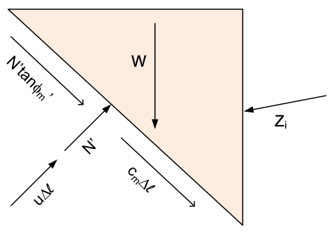
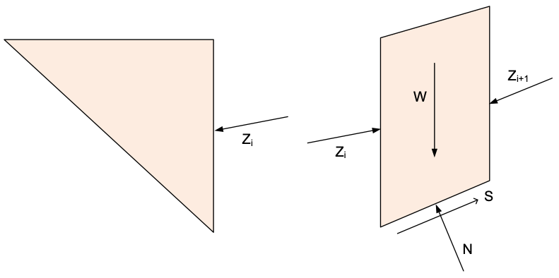
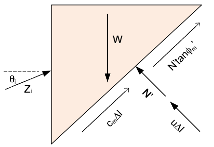

# Line of Thrust

For complete equilibrium procedures like Spencer's method, it is common to compute and display a "line of thrust" to 
assess the slope stability solution. The line of thrust is a line connecting the locations of the side forces acting 
on the sides of the slices. The line of thrust is generally expected to be about 1/3 of the way up from the base of 
the slice. However, if tension is present in the slice, the line of thrust may be higher or lower, typically at the 
top of the slope. 
After computing 
and plotting the line of thrust, if significant deviations from the expected location are observed, it may be 
necessary to add a tension crack to get rid of the tension. Soils cannot generally withstand tension, and the 
inclusion of tension is unconservative as it adds to resistance of the slope to failure and may artificially 
increase the factor of safety.

## Forces Acting on the Slice

The line of thrust is calculated by computing the location of the resultant force acting on each slice. To do this, 
we must first compute the forces acting on each slice, including the side forces. Consider the following slice diagram:

{width=350px }

Note that the side forces are defined by the vertical ($X_i$) and horizontal ($E_i$) components of the force acting on 
the slice. The side forces can also be defined by the magnitude ($Z_i$) and the angle of inclination ($\theta$) of 
the force as follows:

{width=350px }

The shear force ($S_i$) acting on the bottom of the slice is the mobilized shear strength of the soil, which is equal to:

>>$S = \tau_m*\Delta l$

where $\tau_m$ is the mobilized shear strength of the soil and $\Delta l$ is the length of the slice. The mobilized shear strength is equal to:

>>$\tau_m = \dfrac{c + (\sigma-u)tan\phi}{F}$
 
>>$\tau_m = c_m + \sigma' tan\phi_m$

where:

- $c$ = the cohesion of the soil
- $c_m$ = the mobilized cohesion of the soil = $c/F$
- $\sigma$ = the normal stress acting on the slice
- $\sigma'$ = the effective normal stress acting on the slice = $\sigma - u$
- $u$ = the pore water pressure acting on the slice
- $\phi$ = the angle of internal friction of the soil
- tan$\phi_m$ = the mobilized friction of the soil = tan$\phi/F$
- $F$ = the factor of safety

Inserting $\tau_m$ into the equation for $S$ gives:

>>$S = \left[c_m + (\sigma')*tan\phi_m\right]*\Delta l$

>>$S = c_m*\Delta l + N'*tan\phi_m$

where:

- $N'$ = the effective normal force acting on the slice = $\sigma'*\Delta l$

## Solving for Unknown Forces

Next, we need to solve for the unknown forces acting on each slice. The solution to Spencer's method gives the Factor of Safety ($F$) and the side force inclination ($\theta$) for each slice. Also, the side force inclination is the same for all slices. Spencer's method is also a complete equilibrium method so we know that we should have force and moment equilibrium on each slice. So our next step is to use the force equilibrium equations to solve for the unknown forces acting on each slice. We do this by starting on the bottom slice (slice 1) and working our way up to the top slice (slice n). For the first slice, we have:

{width=400px }

The unknowns in this case are the normal force ($N'$) and magnitude of the side force ($Z_i$). We do know the side force inclination ($\theta$). So we have two equations: $\sum F_x = 0$ and $\sum F_y = 0$ and two unknowns. After solving for the unknows, we proceed to the next slice:

{width=700px }

The side force on the left side ($Z_{i-1}$) is known from the previous slice. The side force on the right side ($Z_
{i+1}$) is unknown. The effective normal force ($N'$) is also unknown. So again, we have two equations and two unknowns. 

We can continue this process until we reach the top slice:

{width=400px }

At this point, there is no side force on the right side, so we have two equations and one unknown ($N'$), which we can solve for and the force equilibrium equations are satisfied.

## Matrix Solution for Unknown Forces

As shown in the previous section, we need to solve for two unknowns at each slice. For the general case, we can set up equations to solve for the unknowns as follows. First, we sum forces in the x-direction:

>>$\sum F_x = 0 \Rightarrow \left[c_m \Delta l + N'*tan(\phi_m)\right]*cos(\alpha) - (N' + u \Delta l)*sin(\alpha) + Z_{i}
> *cos(\theta) - Z_{i+1}*cos(\theta) = 0$

>>$c_m \Delta l *cos(\alpha) + N'*tan(\phi_m)*cos(\alpha) - N'*sin(\alpha) - u \Delta l*sin(\alpha) - + Z_{i}*cos
> (\theta) - Z_
> {i+1}*cos(\theta) = 0$

>>$c_m \Delta l *cos(\alpha) + N'*\left[tan(\phi_m)*cos(\alpha) - sin(\alpha)\right] - u \Delta l*sin(\alpha) + Z_{i}
> *cos
> (\theta) - Z_{i+1}*cos(\theta) = 0$

Rearranging in terms of our two unknows ($N'$ and $Z_{i+1}$) gives:

>>$N'*\left[tan(\phi_m)*cos(\alpha) - sin(\alpha)\right] - Z_{i+1}*cos(\theta) = - c_m \Delta l *cos(\alpha) + u \Delta l*sin(\alpha) - Z_{i}*cos(\theta)$

Likewise, we can sum forces in the y-direction:

>>$\sum F_y = 0 \Rightarrow \left[c_m \Delta l + N'*tan(\phi_m)\right]*sin(\alpha) + (N' + u \Delta l)*cos(\alpha) - 
> W + Z_{i}*sin(\theta) - Z_{i+1}*sin(\theta) = 0$

>>$c_m \Delta l *sin(\alpha) + N'*tan(\phi_m)*sin(\alpha) + N'*cos(\alpha) + u \Delta l*cos(\alpha) - W + Z_{i}*sin
> (\theta) - 
> Z_{i+1}*sin(\theta) = 0$

>>$c_m \Delta l *sin(\alpha) + N'*\left[tan(\phi_m)*sin(\alpha) + *cos(\alpha)\right] + u \Delta l*cos(\alpha) - W + 
> Z_{i}*sin
> (\theta) - Z_{i+1}*sin(\theta) = 0$

Rearranging in terms of our two unknows ($N$ and $Z_{i+1}$) gives:

>>$N'*\left[tan(\phi_m)*sin(\alpha) + cos(\alpha)\right] - Z_{i+1}*sin(\theta) = -c_m \Delta l *sin(\alpha) - u\Delta l*cos(\alpha) + W - Z_{i}*sin(\theta)$

Now we can take these two equations and rearrange them into a matrix form. We can write the two equations as:

>>$A*x = b$

where:

- $A$ is a 2x2 matrix of coefficients
- $x$ is a 2x1 vector of unknowns
- $c$ is a 2x1 vector of constants

The matrix $A$ is given by:

>>$A = \begin{bmatrix}tan(\phi_m)*cos(\alpha) - sin(\alpha) & -cos(\theta)\\tan(\phi_m)*sin(\alpha) + cos(\alpha) & -sin(\theta)\end{bmatrix}$

The vector $x$ is given by:

>>$x = \begin{bmatrix}N\\Z_{i+1}\end{bmatrix}$

The vector $b$ is given by:

>>$b = \begin{bmatrix}- c_m \Delta l *cos(\alpha) + u \Delta l*sin(\alpha) - Z_{i}*cos(\theta)\\-c_m \Delta l *sin(\alpha) - u\Delta l*cos(\alpha) + W - Z_{i}*sin(\theta)\end{bmatrix}$

The matrix equation can then be solved for the two unknowns
($N$ and $Z_{i+1}$) using the numpy linalg method. The solution is given by:

```python
import numpy as np

N[i], Z[i + 1] = np.linalg.solve(A, b)
```

## Solving for the Thrust Line

Now that we have the forces acting on each slice, we can compute the locations of the resultant sides force acting on each slice. The side force locations are found by summing moments about the center of the base of each slice. W, S, and N all go through the base so the only components in the moment equilibrium equation are the side forces. Also, rather than working in terms of $Z$ and $theta$, we will work in terms of the vertical and horizontal components of the side forces. The horizontal and vertical components are given by:

>>$X_{i} = Z_i*cos(\theta)$

>>$E_{i} = Z_i*sin(\theta)$

where $X_i$ is the horizontal component of the side force and $E_i$ is the vertical component of the side force. 
Next, we define $\Delta y_{i}$ and $\Delta y_{i+1}$ as the distance from the center point of the base of the slice 
up to the left and right side forces, $E_{i}$ and $E_{i-1}$ respectively, and $\Delta x$ is the width of the slice. Assuming CCW rotation is positive (right-hand rule) we can write the moment equilibrium equation as:

>>$\sum M = 0 \Rightarrow - E_{i}*\Delta y_{i} - X_{i}*\dfrac{\Delta x}{2} + E_{i+1}*\Delta y_{i+1} - X_{i+1}*\dfrac
> {\Delta x}{2}= 0$

If we start with slice 1 on the left side, the left side force is zero so we have one unknown ($\Delta y_{i+1}$) and one equation. Then on the next slice, the left side moment arm is known and the right side moment arm is unknown. So again we have one equation and one unknown ($\Delta y_{i+1}$) which we can solve for as follows:

>>$\Delta y_{i+1} = \dfrac{E_{i}*\Delta y_{i} + X_{i}*\dfrac{\Delta x}{2} + X_{i+1}*\dfrac{\Delta x}{2}}{E_{i+1}}$

We can continue this process until we reach the top slice where the right side moment arm is zero. On the last slice, the moment equation should balance using the known left side moment arm, but it may not close exactly due to accumulated rounding errors. Another alternative is to start from the left side and sweep to the the right side and then start from the right side and sweep to the left side. This will give two different moment arms for the same slice, but they should be very close. The average of the two moment arms can be used to compute the location of the resultant side force. 

## Solving for the Thrust Line - VERSION 2

Now that we have the forces acting on each slice, we can compute the locations of the resultant sides force acting 
on each slice. This can be accomplished by solving the moment equilibrium equations for each slice. We do this by 
using a dual sweep approach. First, we sweep from the left side to the right side and then we sweep from the right 
side to the left. As we sweep from the left side to the right side, we compute the moment arm for each slice 
assuming a pivot point at the bottom right corner of the slice. For the first slice, there is no left side force, so 
we can solve for the moment arm of the right side force. For the second slice, we use the moment arm from the first 
slice and solve for the moment arm of the right side force. We can continue this process until we reach the last slice. 
Then we can sweep from the right side to the left side and solve for the moment arm of the left side force and 
iterate in the same manner. The two results will be similar, but not exactly the same due to rounding errors, which 
accumulate as we move from slice to slice. The average of the two moment arms can be used to compute the location of the resultant side force.

### Left Sweep

For the sweep starting on the left side, we pivot about the base of the right side of the slice. We define $\Delta y_
{i}$ and $\Delta y_{i+1}$ as the vertical distance above the bottom right corner of the slice - i.e., the moment 
arms for the left and right side forces, respectively. Assuming CCW rotation is positive (right-hand rule) we can write the moment equilibrium equation as:

>>$\sum M = 0 \Rightarrow - E_{i}*\Delta y_{i} - X_{i}*\Delta x + E_{i+1}*\Delta y_{i+1} + W*\dfrac{\Delta x}{2} - 
> (N'+ u\Delta l)*\dfrac{\Delta x}{2} = 0$

Solving for $\Delta y_{i+1}$ gives:

>>$\Delta y_{i+1} = \dfrac{E_{i}*\Delta y_{i} + X_{i}*\Delta x - W*\dfrac{\Delta x}{2} + (N' + u\Delta l)*\frac
> {\Delta l}{2}}{E_{i+1}}$

We then convert both $\Delta y_{i}$ and $\Delta y_{i+1}$ to y values by adding the elevation of the lower right 
corner of the slice $y_{rb}$ as follows:

>>$y_{i} = y_{rb} + \Delta y_{i}$

>>$y_{i+1} = y_{rb} + \Delta y_{i+1}$

We then proceed to the next slice, where the left side moment arm is known and the right side moment arm is unknown.

### Right Sweep

For the sweep starting on the right side, we pivot about the base of the left side of the slice. We define $\Delta y_
{i}$ and $\Delta y_{i-1}$ as the vertical distance above the bottom left corner of the slice - i.e., the moment arms 
for the left and right side forces, respectively. Assuming CCW rotation is positive (right-hand rule) we can write 
the moment equilibrium equation as shown below. Please note that even though we are sweeping in opposite direction, the 
i vs i+1 indexing is the same as before - i.e., the left side is always i and the right side is always i+1 and
we iterate through the slices from i = n to i = 1, where n is the number of slices. In this case, the moment arm on 
the right side is known and the moment arm on the left side is unknown. The moment equilibrium equation is given by:

>>$\sum M = 0 \Rightarrow - E_{i}*\Delta y_{i} + E_{i+1}*\Delta y_{i+1} - X_{i+1}*\Delta x - W*\dfrac{\Delta x}{2} +  (N' + u\Delta l) *\dfrac{\Delta l}{2} = 0$


Solving for $\Delta y_{i}$ gives:

>>$\Delta y_{i} = \dfrac{E_{i+1}*\Delta y_{i+1} - X_{i+1}*\Delta x - W*\dfrac{\Delta x}{2} + (N' + u\Delta l)*\dfrac
> {\Delta l}{2}}{E_{i}}$

Again, we then convert both $\Delta y_{i}$ and $\Delta y_{i+1}$ to y values by adding the elevation of the lower left 
corner of the slice $y_{rl}$ as follows:

>>$y_{i} = y_{rl} + \Delta y_{i}$

>>$y_{i+1} = y_{rl} + \Delta y_{i+1}$


