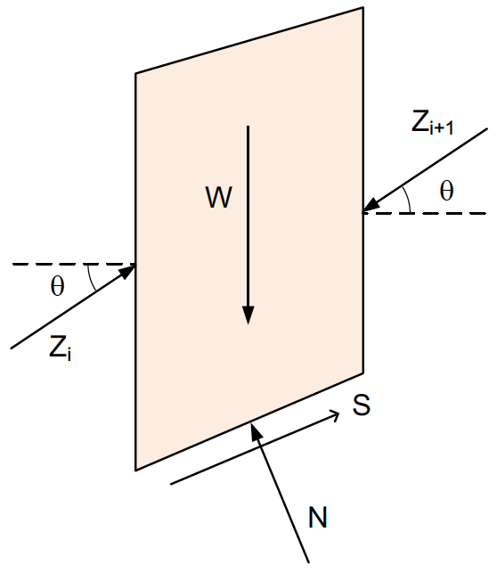
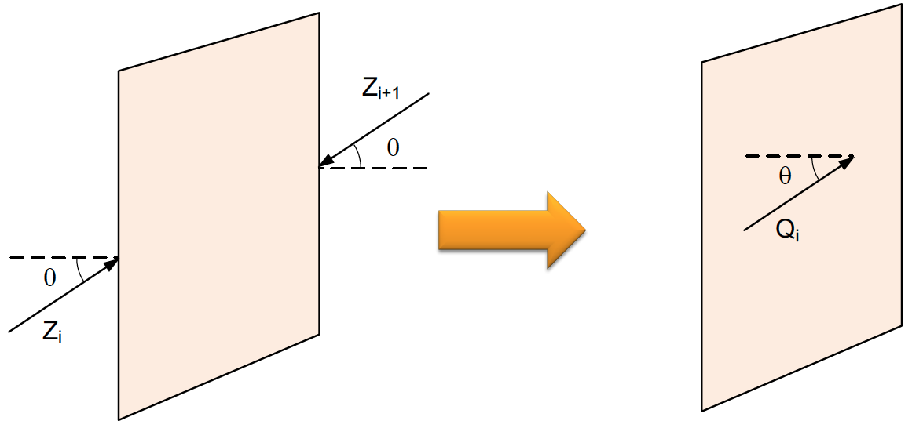
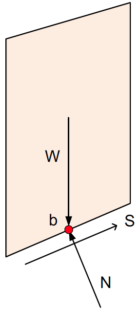
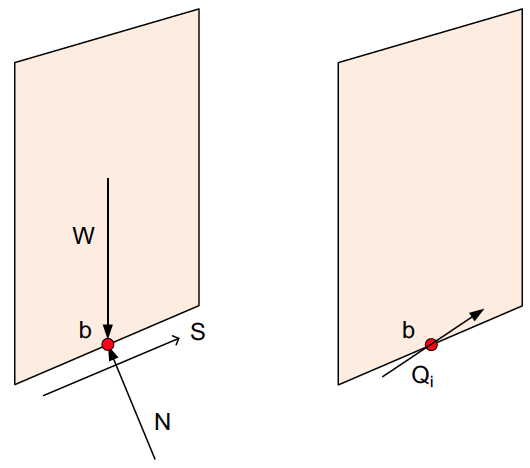
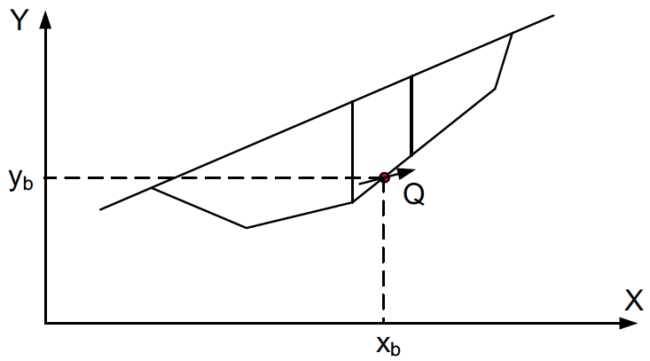

# Spencer's Method

Spencer's Method is a complete equilibrium slope stability method that satisfies both force and moment equilibrium 
and can be used on circular and non-circular slip surfaces. The primary assumption for Spencer's method is that all 
side forces are parallel, i.e., the interslice forces have a constant inclination angle $\theta$.

The following forces are considered on each slice:

>{width=400px}

**Unknowns:**

- 1 factor of safety $F$
- $n$ normal forces $N$
- $n - 1$ side forces $Z$
- 1 inclination angle $\theta$
- $n - 1$ locations for $Z$

Total unknowns = $3n$

**Equilibrium equations:**

- $n$ moment equilibrium equations
- $n$ force equilibrium equations in the horizontal direction
- $n$ force equilibrium equations in the vertical direction

Total equations = $3n$

The basic idea of Spencer's methods is that the two interslice forces $Z_i$ and $Z_{i+1}$ are combined into a single **resultant force** $Q_i$ acting at an angle $\theta$.

>{width=700px}

Since the assumption is that all interslice forces are parallel, $Q_i$ captures the net effect of $Z_i$ and $Z_{i+1}$. More specifically:

>$Q_i$ = $Z_{i+1}$ - $Z_i$

We also assume that W, S, and N act through the center of the base of each slice. This is a reasonable assumption for most practical applications.

>{width=200px}

Therefore, Qi must also act through the same point b in order to maintain moment equilibrium:

>{width=200px}

## Moment Equilibrium

For overall moment equilibrium, we can sum the moments about the circle center for all slices:

>{width=700px}

and we get:

>$\sum M = \sum (W R \sin \alpha) - \sum (S R) = 0$

Where:

>$\alpha$ = base inclination of slice 
$R$ = moment arm to center

Since Q acts through point b, Q must be equal to the sum of W, S, and N. Therefore, we can work in terms of Q.

>{width=400px}

There are two components of Q:

>$Q_\perp = Q \sin(\alpha - \theta)$  (perpendicular to base)

>$Q_\parallel = Q \cos(\alpha - \theta)$  (parallel to base)

Now if we sum moments in terms of Q, we get:

>$\sum M = \sum (R Q_i \cos(\alpha - \theta)) = 0$

## Force Equilibrium

For overall force equilibrium, we can sum the forces in the vertical and horizontal directions for all slices:

>$\sum F_v = \sum Q \sin \theta = 0$

>$\sum F_H = \sum Q \cos \theta = 0$

Since $theta$ = constant, both simplify to:

>$\sum Q = 0$

## Deriving an Expression for $Q$

In order to solve the equilbrium equations, we need to derive an expression for $Q_i$. We start with the following 
detailed diagram of a slice:

>

where: 

>$W$ = weight of the slice (vertical) 
$N$ = normal force on base = $N'$ + $u \Delta \ell$ 
$N'$ = effective normal force on base  
$S$ = shear force on base = $c_m \Delta \ell + N' \tan \phi_m'$ 
$c_m$ = mobilized cohesion = $\dfrac{c}{F}$ 
$tan \phi_m'$ = mobilized friction  = $\dfrac{tan\phi'}{F}$ 
$Z_i$ = side force on interslice boundary 
$theta$ = interslice force inclination 
$\alpha$ = base inclination 
$\Delta x$ = horizontal width of slice 
$\Delta \ell$ = length along base of slice 
$u$ = pore pressure

In the following derivation we replace the resultant side force ($Z_i$ - $Z_{i+1}$ with $Q$ and then solve for Q in relation to the other forces on the slice.

**Step 1** - Resolve Equilibrium Perpendicular to the Base.

>$N =  W \cos \alpha + Q \sin(\alpha - \theta)  \qquad (1)$

**Note:** In the diagram above with $Q$ shown on the base of the slice, the $Q$ vector is inclined at an angle $\theta$ such that it is pointing above the base of the slice which is at an angle $\alpha$. However, the expression for the component of $Q$ perpendicular to the base is $Q \sin(\alpha - \theta)$. This expression is positive only if $\alpha$ is greater than $\theta$. Thus, when summing the forces, we assume the expression is positive and therefore acting in a downward direction from the base. For this reason, we put it on the right hand side in equation (1).

**Step 2** - Resolve Equilibrium Parallel to the Base

>$Q \cos(\alpha - \theta) + S = W \sin \alpha   \qquad (2)$

**Step 3** - Shear Strength (Mohr–Coulomb Criterion)

>$S = \dfrac{1}{F} \left( c \Delta \ell + \sigma' \tan \phi' \right)$

Where:

> $\sigma' = \dfrac{N}{\Delta \ell} - u$

Substitute in:

>$S = \dfrac{1}{F} \left[ c' \Delta \ell + (N - u \Delta \ell) \tan \phi' \right]  \qquad (3)$

**Step 4** - Eliminate $N$ 

From (1):

>$N = W \cos \alpha + Q \sin(\alpha - \theta)$

Substitute into (3):

>$S = \dfrac{1}{F} \left[ c' \Delta \ell + (W \cos \alpha + Q \sin(\alpha - \theta) - u \Delta \ell)
> \tan \phi' \right]  \qquad (4)$

**Step 5** - Substitute $S$ into (2)

>$Q \cos(\alpha - \theta) + S = W \sin \alpha$

Substitute (4):

>$Q \cos(\alpha - \theta) + \dfrac{1}{F} \left[ c' \Delta \ell + (W \cos \alpha + Q \sin(\alpha - \theta) - 
> u \Delta \ell) \tan \phi' \right] = W \sin \alpha$

**Step 6** - Solve for $Q$

Group terms:

>$Q \left[ \cos(\alpha - \theta) + \dfrac{1}{F} \sin(\alpha - \theta) \tan \phi' \right] =
W \sin \alpha - \dfrac{1}{F} \left[ c' \Delta \ell + (W \cos \alpha - u \Delta \ell) \tan \phi' 
> \right]$

Final form:

>$Q = \dfrac{
W \sin \alpha - \dfrac{c'}{F} \Delta \ell - \dfrac{(W \cos \alpha - u \Delta \ell) \tan \phi'}{F}
}{
\cos(\alpha - \theta) \left( 1 + \dfrac{\tan(\alpha - \theta) \tan \phi'}{F} \right)
}$

## Solving the System of Equations

We now have **two equations**:

- $\sum Q \cos(\alpha - \theta) = 0$ (moment equilibrium)
- $\sum Q = 0$ (force equilibrium)

and **two unknowns**:

- Factor of safety $FS$
- Interslice force inclination $\theta$

For non-circular surfaces, we can use coordinates of base center $(x_b, y_b)$ to write the moment equation:

>{width=600px}

>$\sum M = \sum \left[ x_b (-Q \sin \theta) + y_b (Q \cos \theta) \right] = 0$

Again, solved simultaneously with:

>$\sum Q = 0$

In both cases, we need to solve for $FS$ and $\theta$ **iteratively**. 

To do this, we assume a value for $theta$ and then find the factor of safety that satisfies the moment equilibrium equation $FS_{mom}$ and the factor of safety that satisfies the force equilibrium equation, $FS_{force}$. If the two are different, we pick a new value of $theta$ and iterate until they converge, i.e., $FS_{mom}$ = $FS_{force}$.

## Complete Formulation of Q

For a complete implementation of Spencer's method, we need to consider additional forces acting on the slice. The full set of forces are shown in the following figure:

>{width=400px}

where:

>$D$ = distributed load resultant force  
$\beta$ = inclination of the distributed load (perpendicular to slope)  
$kW$ = seismic force for pseudo-static seismic analysis  
$c.g.$ = center of gravity of the slice  
$P$ = reinforcement force on base of slice  
$T$ = tension crack water force  

Each of these forces is described in detail in the [Ordinary Method of Slices (OMS)](oms.md) section. 

Also, recall that:

>$S$ = shear force on base = $c_m \Delta \ell + N' \tan \phi_m'$ 
>$S = \dfrac{1}{F} \left[ c' \Delta \ell + (N - u \Delta \ell) \tan \phi' \right]$ 
>$N = N' + u \Delta \ell$ 

To include these additional forces in the Spencer's method formulation, we can modify the expression for $Q$. We will follow the same steps as before, but now we will include the additional forces in the equilibrium equations. Once again, we replace the resultant side force ($Z_i$ - $Z_{i+1}$ with $Q$ and then solve for Q in relation to the other forces on the slice.

**Step 1** - Resolve Equilibrium Perpendicular to the Base

>$N + kW \sin \alpha + T \sin \alpha = W \cos \alpha  + D \cos(\beta - \alpha)  + Q \sin(\alpha - \theta) \qquad (5)$

**Step 2** - Resolve Equilibrium Parallel to the Base

>$Q \cos(\alpha - \theta) + S  + P  + D \sin(\beta - \alpha) = W \sin \alpha + kW \cos \alpha + T \cos \alpha  \qquad (6)$

**Step 3** - Shear Strength (Mohr–Coulomb Criterion)

>$S = \dfrac{1}{F} \left[ c' \Delta \ell + (N - u \Delta \ell) \tan \phi' \right]  \qquad (7)$

**Step 4** - Eliminate $N$

From (5):

>$N = W \cos \alpha + D \cos(\beta - \alpha) + Q \sin(\alpha - \theta) - kW \sin \alpha - T \sin \alpha \qquad (8)$

Substitute into (7):

>$S = \dfrac{1}{F} \left[ c' \Delta \ell + (W \cos \alpha + D \cos(\beta - \alpha) + Q \sin(\alpha - \theta) - kW \sin \alpha - T \sin \alpha - u \Delta \ell) \tan \phi' \right]  \qquad (9)$

**Step 5** - Substitute $S$ into (6)

>$Q \cos(\alpha - \theta) + S + P + D \sin(\beta - \alpha) = W \sin \alpha + kW \cos \alpha + T \cos \alpha$

Substitute (9):

>$\begin{aligned}
Q \cos(\alpha - \theta) 
&+ \frac{1}{F} \Big[ c' \Delta \ell + \big(W \cos \alpha + D \cos(\beta - \alpha) + Q \sin(\alpha - \theta) - kW \sin \alpha - T \sin \alpha - u \Delta \ell\big) \tan \phi' \Big] + P + D \sin(\beta - \alpha) \\
&= W \sin \alpha + kW \cos \alpha + T \cos \alpha
\end{aligned}$

**Step 6** - Solve for $Q$  

Group terms:

>$\begin{aligned}
Q \Big[ \cos(\alpha - \theta) + \frac{1}{F} \sin(\alpha - \theta) \tan \phi' \Big]
&= W \sin \alpha + kW \cos \alpha + T \cos \alpha - P - D \sin(\beta - \alpha) - \frac{c'}{F} \Delta \ell \\
&\quad - \frac{(W \cos \alpha + D \cos(\beta - \alpha) - kW \sin \alpha - T \sin \alpha - u \Delta \ell) \tan \phi'}{F}
\end{aligned}$

Final form:

>$Q = \dfrac{W \sin \alpha + kW \cos \alpha + T \cos \alpha - P - D \sin(\beta - \alpha) -\dfrac{c'}{F} \Delta \ell - \dfrac{(W \cos \alpha + D \cos(\beta - \alpha) - kW \sin \alpha - T \sin \alpha - u \Delta \ell) \tan \phi'}{F}
}{\cos(\alpha - \theta) \left( 1 + \dfrac{\tan(\alpha - \theta) \tan \phi'}{F} \right)
}$

**Note:** It is important to remember that the tension crack water force $T$ is only included if a tension crack is present. Furthermore, for a left-facing slope, $T$ applies to the right side of the uppermost (last) slice as shown in the diagram above. However, for a right-facing slope, $T$ applies to the left side of the uppermost (first) slice (slices are numbered from left to right in either case). In this case, the derivation of $Q$ is the same, but the sign of $T$ will be flipped (negated) before insertion in the final expression. $T = 0$ for all other slices.

## Solving for the Normal Force

It is useful to solve for the effective normal force at the same time that the factor of safety is calculated. These 
can be plotted (as stresses) along with the line of thrust. Negative values are another indicator of tension in the 
slice. We can do this as follows:

>$N' = N - u \Delta \ell$

Substituting the expression for $N$ from (8):

>$N' = \left[ W \cos \alpha + D \cos(\beta - \alpha) + Q \sin(\alpha - \theta) - kW \sin \alpha - T \sin \alpha \right] - u \Delta \ell$

## Summary

- Assumes constant side force inclination $\theta$
- Works for circular and non-circular surfaces
- Satisfies both force and moment equilibrium
- Must be solved iteratively
- $Q$ represents the net interslice force and is central to the formulation
