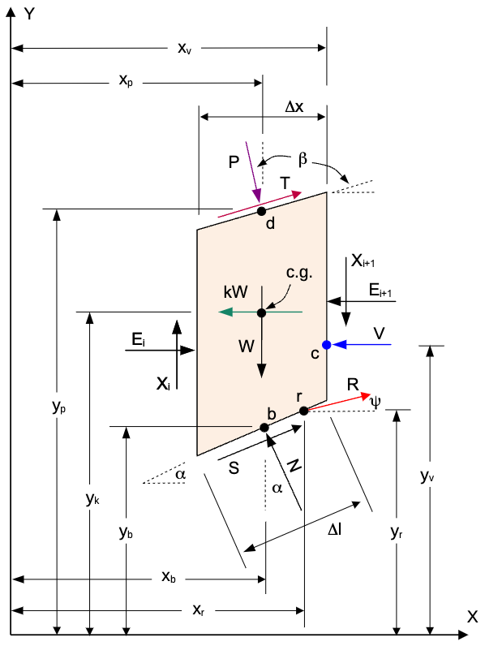

# Spencer's Method

Spencer's Method is a complete equilibrium slope stability method that satisfies both force and moment equilibrium 
and can be used on circular and non-circular slip surfaces. The primary assumption for Spencer's method is that all 
side forces are parallel, i.e., the interslice forces have a constant inclination angle $\theta$.

The following derivation is adapted from the US Army Corps of Engineers (USACE) UTEXAS Version 2.0 user manual, which is based on the original work by Spencer (1967). The UTEXAS manual can accessed via this [link](https://apps.dtic.mil/sti/tr/pdf/ADA207044.pdf){target='blank'}.

## Slice Geometry and Forces

The geometry and the forces associated with a representative slice on a left-facing slope are as follows:

where:

>>$W$ = weight of the slice 
> $N$ = normal force on the base of the slice 
> $S$ = shear force on the base of the slice 
> $E_i$ = horizontal interslice force on the left side of the slice 
> $X_i$ = vertical interslice force on the left side of the slice 
> $E_{i+1}$ = horizontal interslice force on the right side of the slice 
> $X_{i+1}$ = vertical interslice force on the right side of the slice 
> $kW$ = seismic force on the center of gravity (c.g.) of the slice 
> $P$ = normal force on the top of the slice 
> $d$ = point of action for the normal force on the top of the slice 
> $T$ = shear force on the top of the slice 
> $R$ = reinforcement force on the base of the slice 
> $r$ = point of action for the reinforcement force 
> $V$ = resultunt force of water in tension crack 
> $c$ = point of action for the resultant force of water in the tension crack 
> $\beta$ = angle of the top of the slope 
> $\alpha$ = angle of the base of the slice 
> $\psi$ = angle of the reinforcement force 
> $\Delta \ell$ = length of the base of the slice 
> $\Delta x$ = width of the slice 

## General Equations

The equations for Spencer's method are derived from the equilibrium of forces and moments acting on the slice. One of the key features of Spencer's method is how the side forces are represented and lumped to a single force $Q_i$, which will be introduced later. Thus, it is helpeful to sum forces and moments using the forces acting on the slice except for the side forces and $N$ and $S$. Summing forces in the horizontal and vertical directions gives:

>>$F_h = -kW + P \sin \beta + T \cos \beta + R \cos \psi  \qquad (1)$

>>$F_v = - W - P \cos \beta + T \sin \beta + R \sin \psi  \qquad (2)$

Likewise, summing moments about the center of the base of the slice gives:

$\begin{aligned}
M_o &= - P \sin \beta (y_p - y_b) - P \cos \beta (x_p - x_b) - T \cos \beta (y_p - y_b) \\
&\quad + T \sin \beta (x_p - x_b) + kW (y_k - y_b) - R \cos \psi (y_r - y_b) + R \sin \psi (x_r - x_b)
\end{aligned}   \qquad (3)$

Note that counter-clockwise moments are positive (right-hand rule).

The shear force on the base of the slice is:

>>$S = \tau \Delta \ell  \qquad (4)$

where $\tau$ is the shear stress on the base of the slice. Recall that from limit equilibrium, the factor of safety $F_s$ is defined as the ratio of the resisting shear strength $s$ to the driving: stress $t$:

>>$F_s = \dfrac{s}{t}  \qquad (5)$

The shear strength $s$ is given by:

>>$s = c' + (\sigma - u) \tan \phi'  \qquad (6)$

This can also be written in terms of effective stress as:

>>$s = c' + \sigma' \tan \phi'$

where$\sigma'$ = $\sigma - u$. It is also convenient to express the shear stress in terms of the mobilized shear strength as follows:

>>$\tau =  \dfrac{c' + (\sigma - u) \tan \phi'}{F}  \qquad (7)$

Combining equations (4) and (7) gives:

>>$S = \dfrac{c' \Delta \ell + (N - u \Delta \ell) \tan \phi'}{F}   \qquad (8)$

Sometimes this is written as:

>>$S = \dfrac{c' \Delta x \sec \alpha + (N - u \Delta x \sec \alpha) \tan \phi'}{F}   \qquad (9)$

where $\Delta x \sec \alpha$ = $\Delta \ell$. 

Using total stresses, the shear stress can be expressed as:

>>$s = c + \sigma \tan \phi  \qquad (10)$

And in terms of forces:

>>$S = \dfrac{c \Delta \ell + N \tan \phi}{F}  \qquad (11)$

or:

>>$S = \dfrac{c \Delta x \sec \alpha + N \tan \phi}{F}  \qquad (12)$

where $c$ is the total cohesion, and $\phi$ is the total angle of internal friction.

## Spencer's Method Equations

As stated above, The primary assumption for Spencer's method is that all side forces are parallel, i.e., the interslice forces have a constant inclination angle $\theta$. Thus, there are two unknowns: the inclination angle $\theta$ and the factor of safety $F$. The interslice forces are lumped to a single force $Q$ as follows:

Since $Q$ is the resultant of the interslice forces and acts through a single point, the resultant of all of the 
other forces must be equivalent to $Q$. Thus, for overall equilibrium, we can work in terms of 
$Q$. Summing over all slices, we have:

>>$\sum Q \cos \theta = 0  \qquad (13)$

>>$\sum Q \sin \theta = 0  \qquad (14)$

Since $\theta$ is constant, we can simplify these equations to:

>>$\sum Q  = 0  \qquad (15)$

For the moment equilibrium, we can sum moments about the origin as follows:

>>$\sum Q (x_b \sin \theta - y_Q \cos \theta) = 0  \qquad (16)$

## Solving for Q

Next, we need to solve for $Q$. To do this, we can use equations (1-3) derived above for the forces and moments. First,
we will sum forces perpendicular to the base of the slice. This gives:

>>$N + F_v \cos \alpha - F_h \sin \alpha - Q \sin (\alpha - \theta) = 0  \qquad (17)$

Solving for the normal force $N$ gives:

>>$N = - F_v \cos \alpha  + F_h \sin \alpha + Q \sin (\alpha - \theta) \qquad (18)$

Substituting this into equation (9) gives:

>>$S = \dfrac{1}{F} \left[ c' \Delta x \sec \alpha + (- F_v \cos \alpha + F_h \sin \alpha + Q \sin (\alpha - \theta) 
- u \Delta x \sec \alpha) \tan \phi' \right]  \qquad (19)$

Next, we can sum forces parallel to the base of the slice. This gives:

>>$S + F_v \sin \alpha + F_h \cos \alpha + Q \cos (\alpha - \theta) = 0  \qquad (20)$

Solving for $S$ gives:

>>$S = - F_v \sin \alpha - F_h \cos \alpha - Q \cos (\alpha - \theta)  \qquad (21)$

Combining equations (19) and (21) gives:

>>$\dfrac{1}{F} \left[ c' \Delta x \sec \alpha + (- F_v \cos \alpha + F_h \sin \alpha + Q \sin (\alpha - \theta) - u 
> \Delta x \sec \alpha) \tan \phi' \right] = - F_v \sin \alpha - F_h \cos \alpha - Q \cos (\alpha - \theta)  \qquad (22)$

Solving for $Q$ gives:

>>$Q = \left[ - F_v \sin \alpha - F_h \cos \alpha - \dfrac{c'}{F} \Delta x \sec \alpha + (F_v \cos \alpha - F_h \sin \alpha + u \Delta x \sec \alpha) \dfrac{\tan \phi'}{F} \right] m_{\alpha}  \qquad (23)$

where:

>>$m_{\alpha} = \dfrac{1}{\cos (\alpha - \theta) + \sin (\alpha - \theta) \dfrac{\tan \phi'}{F}}  \qquad (24)$

Next, we need to solve for $y_Q$. To do this, we sum moments about the center of the base of the slice. The moment 
from $Q$ must equal the moment from the other forces $M_o$ from equation (3). Therefore:

>>$- Q \cos \theta (y_Q - y_b) + M_o = 0  \qquad (25)$

Solving for $y_Q$ gives:

>>$y_Q = y_b + \dfrac{M_o}{Q \cos \theta}  \qquad (26)$

## Solution of Equations

To solve the equations, we can use a numerical method such as the Newton-Raphson method. The steps are as follows:

1. **Initial Guess**: Start with an initial guess for the factor of safety $F$ and the inclination angle $\theta$.
2. **Calculate Forces and Moments**: For each slice, calculate the forces and moments using equations (1) to (3).
3. **Calculate $Q$ and $y_Q$**: Use equations (23) and (26) to calculate $Q$ and $y_Q$ for each slice.
4. **Sum Forces and Moments**: Sum the forces and moments for all slices using equations (15) and (16).
5. **Check Convergence**: Check if the sum of forces and moments is close to zero. If not, adjust $F$ and $\theta$ and repeat steps 2-5.

Once the solution converges, we can use equation (18) to calculate the normal force $N$. The effective normal force $N'$ can be calculated as:

>>$N' = N - u \Delta \ell  \qquad (27)$

For the side forces, we note that the interslice forces $E_i$ and $X_i$ can be expressed in terms of a resultant force 
$Z$ acting at  
$\theta$ as follows:

After solving for $Q$, we note that $Q_i$ can be expressed in terms of the interslice forces $Z_i$ and $Z_{i+1} as 
follows:

>>$Q_i = Z_i - Z_{i+1}$

Starting from the left side, we can calculate the interslice forces iteratively. For the first slice, we 
 set $Z_1 = 0$. For each subsequent slice, we  calculate the interslice forces as:

>>$Z_{i+1} = Z_i - Q_i  \qquad (28)$

## Line of Thrust

The line of thrust is the line along which the side forces $Z$ act on the slice. It is calculated by starting from 
the left side and summing moments about the center of the base of the slice. The moments are calculated as follows:

>>$M_o - Z_i \sin \theta \dfrac{\Delta x}{2} - Z_{i+1} \sin \theta \dfrac{\Delta x}{2} - Z_i \cos \theta (y_{t,i} - y_b) + Z_{i+1} \cos \theta (y_{t,i+1} - y_b) = 0   \qquad (29)$

where $y_{t,i}$ and $y_{t,i+1}$ are y coordinates of the line of thrust of the left and right side, respectively. If 
$y_{t,i}$ is known, we can solve for $y_{t,i+1}$ as follows:

>>>$y_{t,i+1} = y_b - \left[ \dfrac{M_o - Z_i \sin \theta \dfrac{\Delta x}{2} - Z_{i+1} \sin \theta \dfrac{\Delta x}
> {2} - 
> Z_i \cos \theta (y_{t,i} - y_b)}{Z_{i+1} \cos \theta} \right]  \qquad (30)$

For the first slice, we can set $y_{t,1} = y_{lb}$ where $y_{lb}$ is the lower left corner of the slice. For each 
subsequent slice,  $y_{t,i}$ is equal to $y_{t,i+1}$ from the previous slice. We can use that in equation (30) to 
calculate $y_{t,i+1}$. We repeat this process for all slices until we reach the right side of the slope.