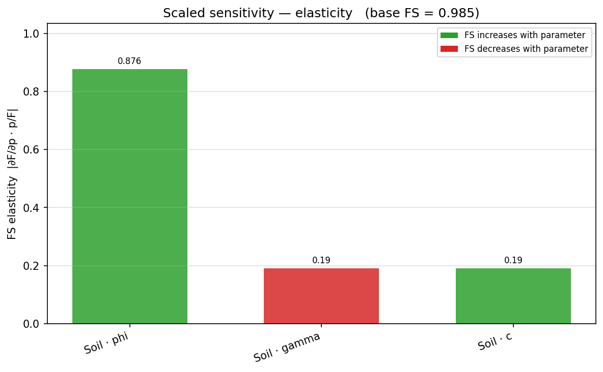
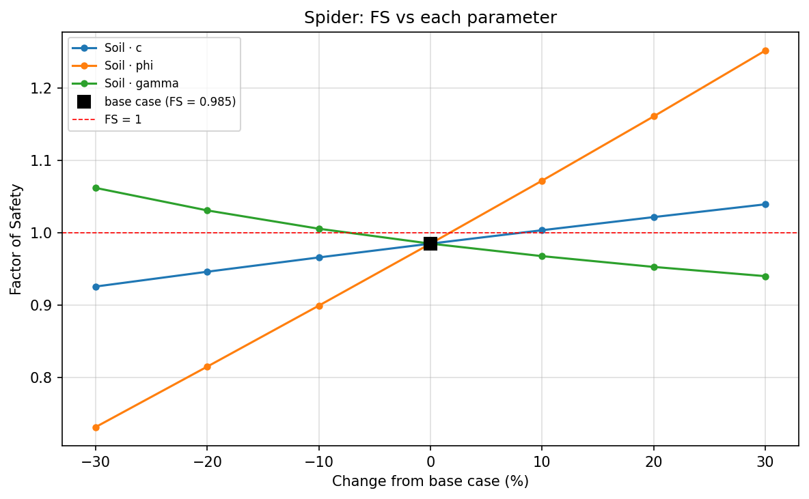

# Sensitivity

See [Addressing a parameter](index.md#addressing-a-parameter) and
[Discovering and specifying parameters](index.md#discovering-and-specifying-parameters) for the
parameter grammar `sensitivity()` and every other function on this page shares with
[Design](design.md) and [Back-Analysis](back_analysis.md).

## Running a sweep

```python
from xslope import load_slope_data
from xslope.sensitivity import sensitivity
from xslope.plot import plot_sensitivity

slope_data = load_slope_data("docs/lem/files/xslope_acads_simple.xlsx")

success, result = sensitivity(
    slope_data,
    param="mat:Soil:c",
    rel_range=0.5, n=9,          # ±50% about the base value, 9 points
    # values=[...],              # ...or give the values explicitly
    methods=("bishop", "spencer"),
    search=True,                 # re-search the critical surface per point
)
plot_sensitivity(result['df'], target_fs=1.2)
```

`search=True` is the default and the honest setting: **the critical surface moves as
parameters change**, and re-solving a fixed surface silently understates sensitivity.
`search=False` re-solves the stored surface (`circles[0]` or the non-circular polyline)
instead — roughly fifty times faster, and correct when the question is "given this
surface" (prescribed-surface benchmarks, for example).

The result is a tidy long-format DataFrame — one row per (value × method), with the
unmodified model included as a flagged `is_base` row:

| column | meaning |
|---|---|
| `param` | canonical reference, e.g. `"mat:Soil:c"` |
| `value`, `rel` | the swept value and `value / base_value` |
| `is_base` | this row is the unmodified model |
| `method`, `fs` | solver name and factor of safety |
| `success`, `msg` | per-point outcome — a failed point is a row, not an exception, so a sweep that breaks at value 7 of 9 still reports 1–6 (finding where things break is often the point) |
| `Xo`, `Yo`, `R` | the critical circle per point (searched sweeps), so a jump of the critical surface is visible in the data — `plot_sensitivity` draws jumped points open |

`plot_sensitivity` draws one line per method with FS = 1 (and an optional `target_fs`) as
guide lines, marks the unmodified model as a labelled **base case** entry in the legend — so
the black square in the plot reads as `base case (value, FS = …)` rather than an unexplained
point — and draws any point where the critical surface jumped as an open circle.

`mode=` selects the engine that evaluates each swept point (see
[Analysis modes: LEM, FEM, seepage](index.md#analysis-modes-lem-fem-seepage)). `mode='lem'`
(the default) runs the limit-equilibrium methods and reports a factor of safety. `mode='fem'` runs a
full SSRM solve at every point — the output is still a factor of safety, but each step is
a complete finite-element analysis (expect minutes per step; run it in the background) and
the model must carry a mesh in `slope_data['mesh']`. `mode='seep'` rebuilds and solves the
seepage problem at every point and reports the **total discharge q** through the section
(the same flow rate the seepage solver returns), and likewise needs a mesh. The result's
value column stays `fs` for a consistent schema; `result['output']` (`'FS'` or `'q'`) and
`result['output_label']` say what it really is, so a discharge sweep is never mislabelled a
factor of safety.

## Sweeping anything else: `modify=`

For changes that are not a single stored scalar — geometry above all — pass a callable
instead of a parameter reference. The callable receives a copy of the model and the
swept value, and owns whatever consistency its edit requires (rebuilding the material
polygons and ground surface after moving profile points, keeping reinforcement anchored
to a moved face):

```python
import math
from shapely.geometry import Polygon
from xslope.fileio import build_ground_surface_from_polygons
from xslope.mesh import build_polygons

def set_slope_angle(sd, beta_deg):
    """Rotate the slope face about the toe to beta_deg, then rebuild the
    polygon geometry (slice weights come from the polygons, not the raw
    profile lines — see the Slope Design page for this pattern)."""
    prof = sd['profile_lines'][0]['coords']
    x_toe, y_toe = prof[1]
    _, y_top = prof[2]
    prof[2] = (x_toe + (y_top - y_toe) / math.tan(math.radians(beta_deg)), y_top)
    polys = [{'polygon': Polygon(p['coords']), 'mat_id': p['mat_id']}
             for p in build_polygons(slope_data={'profile_lines': sd['profile_lines'],
                                                 'max_depth': sd.get('max_depth')})]
    sd['polygons'] = polys
    sd['ground_surface'], sd['domain_polygon'] = build_ground_surface_from_polygons(polys)
    return sd

success, result = sensitivity(slope_data, modify=set_slope_angle,
                              label="slope angle (deg)",
                              values=[20, 22.5, 25, 27.5, 30],
                              methods=("bishop",))
```

Built-in references and `modify=` callables are one code path — every `param` reference
resolves internally to exactly the setter signature `modify=` accepts.

### What is checked, and when

A sweep validates in two stages.

**Once, before the first point,** the base model goes through the full
[preflight input check](../usage/preflight.md) for whichever engine the sweep will run.
A model that cannot be analysed at all is refused there, with the field named — rather
than failing identically at every one of nine points.

**Then, per point,** the substituted value is re-checked against only the rules that read
the field being swept, and the modified model against the geometry (polygon validity,
ground surface present) because setters may be user-written. A value that would produce a
wrong answer — a unit weight at or below zero, a negative cohesion, a friction angle at or
above 90° — makes that point a `success=False` row **carrying the reason as its `msg`**,
and the sweep carries on. Points before and after it are unaffected.

Finally, each point's result is screened before it is recorded: a factor of safety of 9999
is the search's no-admissible-surface flag rather than an answer, and a negative one is not
a result either. Both become failed rows with a stated reason instead of numbers that would
dominate every plot and derivative built from the sweep.

Pass `check_inputs=False` to skip both validation stages. The result screen still runs — a
sentinel recorded as a success is a defect in the record, not a strictness setting.

## Sensitivity plots

A sweep across several parameters feeds a family of views. Which one to read depends on the
question: *which parameter matters most* (tornado, scaled bars), *how the answer moves across
the range* (spider), or *where the uncertainty comes from* (variance Pareto, Monte Carlo
rank). Each is a function in `xslope.plot`; all are reachable from the
[Studio **Parametric** dialog](../studio/analysis.md#parametric-study)'s plot-type selector
and from the assistant's `parametric_sweep` call. The
[tornado](#tornado-diagrams) — the most common — is covered in its own section below.

### Tornado diagrams

To compare several parameters at once, `tornado()` evaluates each at its low and high
bound (two solves per parameter plus one shared base case) and `plot_tornado` draws the
Duncan-style summary — horizontal bars of the FS swing, sorted so the parameter that
matters most sits on top:

```python
from xslope.sensitivity import tornado
from xslope.plot import plot_tornado

success, result = tornado(
    slope_data,
    ["mat:Soil:c", "mat:Soil:phi", "mat:Soil:gamma"],
    rel_range=0.25,              # ±25% per parameter...
    # bounds={"mat:Soil:c": (2.0, 5.0)},   # ...or explicit bounds per ref
    method="bishop",
)
plot_tornado(result)
```

For the shipped ACADS sample (a weak c–φ soil), the tornado ranks φ far ahead of c and
γ — the ±25% φ band alone swings FS from 0.77 to 1.21 across FS = 1.

`plot_tornado` draws the base-case FS as a labelled vertical reference line and stacks the
bars widest-on-top by default — the classic Duncan ordering that gives the diagram its name.
Pass `widest_on_top=False` to invert the stack (widest at the bottom); the parameter is kept
for programmatic callers, and Studio deliberately exposes no toggle for it.

When you have already run *full* per-parameter sweeps — a GUI that draws an FS-vs-value curve
per parameter for click-through, for instance — `tornado_from_sweeps()` assembles the same
diagram from those DataFrames with no extra solves, since `plot_tornado` reads each
parameter's lowest- and highest-value FS:

```python
from xslope.sensitivity import sensitivity, tornado_from_sweeps

sweeps = {ref: sensitivity(slope_data, param=ref, rel_range=0.25, n=5,
                           methods=("bishop",))[1]['df']
          for ref in ("mat:Soil:c", "mat:Soil:phi", "mat:Soil:gamma")}
result = tornado_from_sweeps(sweeps, method="bishop")   # {'df', 'base_fs', 'method'}
plot_tornado(result)
```

### Scaled-sensitivity bars

`scaled_sensitivity()` estimates the local derivative $\partial F/\partial p$ for each
parameter with a **central difference at ±1%** (relative) about the base case, then reports
it under three scalings so parameters with different units compare on one axis. `plot_scaled_sensitivity()`
draws one vertical bar per parameter — height is the magnitude, color the sign (green: FS
*rises* with the parameter; red: FS *falls*):

- **`elasticity`** (the default) — the dimensionless $\dfrac{\partial F}{\partial p}\cdot\dfrac{p}{F}$,
  i.e. the percent change in FS per percent change in the parameter.
- **`per_1pct`** — the change in FS for a 1% change in the parameter.
- **`per_sigma`** — the change in FS for a one-σ change (offered only for parameters that
  carry a standard deviation).

```python
from xslope.sensitivity import scaled_sensitivity
from xslope.plot import plot_scaled_sensitivity

ok, result = scaled_sensitivity(slope_data,
                                ["mat:Soil:c", "mat:Soil:phi", "mat:Soil:gamma"],
                                method="bishop")
plot_scaled_sensitivity(result, scaling="elasticity")
```

{width=800}

For the ACADS sample the friction angle dominates on the elasticity scaling — a percent
change in φ moves FS several times more than a percent change in c or γ. The estimator (the
central-difference derivative and each scaling) is documented in the `scaled_sensitivity`
docstring.

### Spider plot

`plot_spider()` overlays every parameter's FS-vs-value curve on one **normalized** x-axis
(percent change from the base value), with a black base-case marker at the origin and an
FS = 1 guide. The steepness of each line *is* its sensitivity, and a curving line reveals
nonlinearity a single tornado bar would hide. It reuses the per-parameter sweeps you already
ran:

```python
from xslope.sensitivity import sensitivity
from xslope.plot import plot_spider

sweeps = {ref: sensitivity(slope_data, param=ref, rel_range=0.3, n=7,
                           methods=("bishop",))[1]["df"]
          for ref in ("mat:Soil:c", "mat:Soil:phi", "mat:Soil:gamma")}
plot_spider(sweeps)
```

{width=800}

### Variance-contribution Pareto

When the model carries standard deviations, `variance_contribution()` asks *which
uncertainties actually drive the scatter in FS*. It reuses the Taylor-series
[reliability](../reliability/taylor.md) machinery — each parameter's variance term is
$\left(\dfrac{\partial F}{\partial p}\,\sigma_p\right)^2$, exactly the $(\Delta F/2)^2$ the
TSPM already computes — normalizes each to a percent of $\mathrm{Var}(F)$, and
`plot_variance_pareto()` draws them descending with a cumulative line:

```python
from xslope.sensitivity import variance_contribution
from xslope.plot import plot_variance_pareto

ok, result = variance_contribution(slope_data, method="bishop")
plot_variance_pareto(result)
```

{width=800}

Note how this reorders the parameters versus the elasticity bars: c and φ contribute almost
equally to $\mathrm{Var}(F)$ even though φ has the larger elasticity, because c's standard
deviation is a much larger fraction of its mean. A scaled bar answers *how strong is the
response*; the Pareto answers *how much does this parameter's uncertainty matter* — the
per-σ scaling above is the bridge between the two.

### Monte Carlo rank correlation

`mc_rank_correlation()` runs a Monte Carlo [reliability](../reliability/monte_carlo.md) campaign and computes
the **Spearman rank correlation** between each sampled input and the resulting FS.
`plot_mc_rank_correlation()` draws them signed and sorted:

```python
from xslope.sensitivity import mc_rank_correlation
from xslope.plot import plot_mc_rank_correlation

ok, result = mc_rank_correlation(slope_data, method="bishop", n_samples=10000)
plot_mc_rank_correlation(result)
```

{width=800}

This is a **global** sensitivity measure: unlike the scaled bars — a derivative *at the base
case* — it ranks parameters over the whole sampled distribution, so it captures a
parameter's spread and any nonlinearity in its effect. The local and global measures can
disagree, and the disagreement is itself informative; read the two together.

## Worked sample

The sweep below reproduces the base case of the ACADS simple slope sample
([xslope_acads_simple.xlsx](../lem/files/xslope_acads_simple.xlsx), the same file used
throughout these pages) and brackets it over ±50% of the cohesion, re-searching the
critical surface at every point. The regression suite locks the end points: at c = 1.5
the critical circle has retreated toward the face (the surface-jump columns show the
radius growing as cohesion falls), and at c = 4.5 the slope crosses FS = 1.

<!-- test: file=../lem/files/xslope_acads_simple.xlsx, type=sensitivity, param=mat:Soil:c, method=bishop, num_slices=30, n=3, rel_range=0.5, expected_base=0.985, expected_low=0.882, expected_high=1.073, tolerance=0.01, benchmark=SENS-acads-c -->

| c (kPa) | Bishop FS |
|---|---|
| 1.5 (−50%) | 0.882 |
| 3.0 (base) | 0.985 |
| 4.5 (+50%) | 1.073 |

A `geom:piezo:dy` sweep on any of the water-table samples answers the most common
geometry question — "how sensitive is this slope to the water table?" — without writing
a setter: the reference shifts the piezometric line vertically by the swept delta.

For a published benchmark of the sweep itself, see
[verification problem VP40](../verification/rocscience.md#vp40) — [Perry (1993)](https://doi.org/10.1144/GSL.QJEGH.1994.027.P3.04)'s
power-curve sensitivity study, where the swept ΔFS matches Slide's published curves
within about a percent at every range endpoint.
