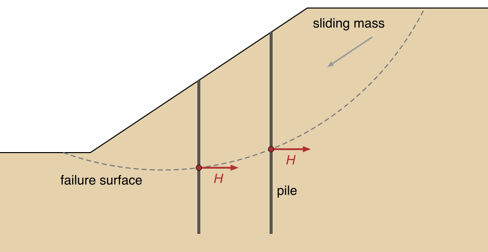
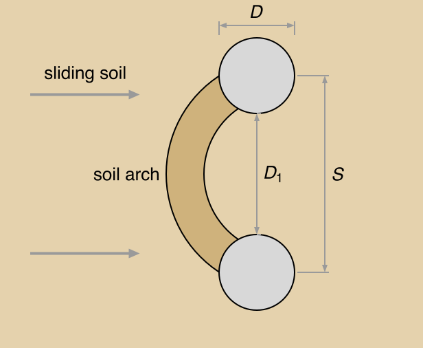
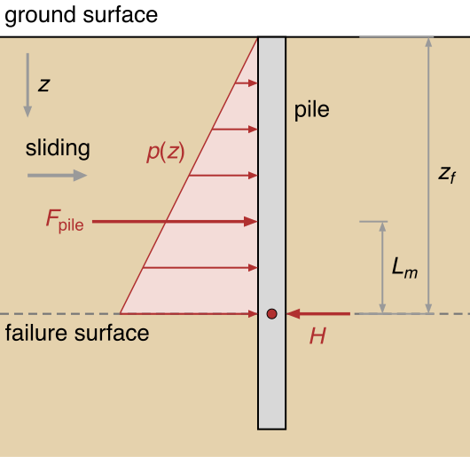

# Piles and Concrete Piers in LEM Slope Stability

In a limit equilibrium analysis, a pile is one force on the sliding mass, at the point where a trial slip surface
crosses it. The `piles` sheet and its columns are on the [Piles and Walls Overview](overview.md), and what to enter
for each type of pile or wall is on [Pile and Wall Types](types.md).

{width=598}

## The Pile Force

$H$ is a force per unit width of slope. It acts at the point $e$ where the pile crosses the failure surface,
perpendicular to the pile. Its inclination $\theta_p$ from horizontal, positive upward, gives the components

>$H_h = H\cos\theta_p, \qquad H_v = H\sin\theta_p$

For a vertical pile, $\theta_p = 0$ and the force is horizontal.

XSLOPE takes the higher end of the pile as its head and the lower end as its tip. The force is perpendicular to the
pile, with its horizontal component against the movement of the sliding mass. So $\theta_p$ equals the pile's
inclination from vertical:

>$\theta_p = \tan^{-1}\!\left(\dfrac{d_u}{y_h - y_t}\right)$

where $y_h$ and $y_t$ are the elevations of the head and the tip, and $d_u$ is how far the tip lies upslope of the
head, negative when it lies downslope. A pile whose head leans out toward the toe gets a force tilted upward. One
whose head leans back into the slope gets a force tilted downward. XSLOPE finds the direction of movement for each
failure surface, so a model and its mirror image give a pile the same angle.

On a slice base inclined at $\alpha$, the force has a component $H\cos(\alpha - \theta_p)$ along the base, which
opposes sliding, and a component $H\sin(\alpha - \theta_p)$ normal to it. The normal component adds to the normal
force, and so to the friction, where $\alpha > \theta_p$. It reduces the normal force where $\alpha < \theta_p$:
near the toe of a circle, where the base rises toward the toe, or under a force tilted upward more steeply than the
base. OMS takes the base normal force from this resolution. The other methods take it from their own equilibrium
equations.

The methods that take moments about a circle center $(X_o, Y_o)$ add the pile's moment:

>$M_{\text{pile}} = H\cos\theta_p\,(Y_o - y_e) + H\sin\theta_p\,(x_e - X_o)$

where $(x_e, y_e)$ is the point $e$. The equation is written for a slope that descends to the left. On a slope that
descends to the right, the arm $x_e - X_o$ changes sign. For a vertical pile, the moment is $H(Y_o - y_e)$.

Each method's page gives the pile terms in its equations: [OMS](../lem/oms.md), [Bishop](../lem/bishop.md),
[Janbu](../lem/janbu.md), [Corps of Engineers and Lowe-Karafiath](../lem/force_eq.md), and
[Spencer](../lem/spencer.md). Only the moment about a circle center depends on the shape of the surface, and only OMS
and Bishop use it. The other methods apply the pile force on any non-circular surface unchanged.

The `Appl` column sets how $H$ enters the factor of safety $F$. With Active, the default, $H$ is an allowable force.
It is applied at full value, like the slice's weight: its moment reduces the driving moment, and its components
enter the force equations in full. With Passive, $H$ is a capacity that is mobilized with the soil's strength, so
its components are divided by $F$, as $c$ and $\tan\phi$ are, and its moment joins the resisting side. OMS, which
computes $F$ directly, takes only that moment and leaves the passive force out of the base normal force.

## Computing H by Ito & Matsui {#ito-matsui-1975-theory}

An entered `H` is used as it stands. It can come from a lateral analysis of the pile with p-y curves (LPILE, GROUP or
RSPile), a structural analysis of the section, or a three-dimensional finite element model. A battered pile always
needs `H` entered, since Ito & Matsui's method is for vertical piles.

If `H` is left blank for a vertical pile, XSLOPE computes it from `D` and `S` by the method of Ito & Matsui (1975),
for each trial surface. The method treats the soil between adjacent piles as in plastic flow. As the sliding mass
moves, it squeezes between the piles and arches onto them. The method applies to the part of the pile above the
failure surface, where the soil moves.

| Symbol | Meaning |
|---|---|
| $D$ | Pile diameter, or width of the pile section. |
| $S$ | Center-to-center spacing of the piles. |
| $D_1 = S - D$ | Clear spacing between the faces of adjacent piles. |
| $z$ | Depth below the ground surface at the pile. |
| $z_f$ | Depth to the failure surface at the pile. |
| $c$, $\phi$, $\gamma$ | The soil's cohesion, friction angle and unit weight. |
| $N_\phi = \tan^2(45° + \phi/2)$ | Passive earth pressure coefficient. |

The paper writes $d$ for the diameter, $D_1$ for the center-to-center spacing and $D_2$ for the clear spacing. The
equations are the same.

### Pressure on One Pile

At depth $z$, the soil pushes on the pile with a force per unit length of pile

>$p(z) = c \cdot A_1 + \gamma z \cdot A_2$

where the arching coefficients $A_1$ and $A_2$ have units of length. They are built from three quantities:

>$R = \left(\dfrac{S}{D_1}\right)^{\sqrt{N_\phi}\,\tan\phi + N_\phi - 1}$

>$\mathcal{E} = \exp\!\left(\dfrac{D}{D_1}\,N_\phi\tan\phi\,\tan\!\left(\dfrac{\pi}{8}+\dfrac{\phi}{4}\right)\right)$

>$F = \dfrac{2\tan\phi + 2\sqrt{N_\phi} + N_\phi^{-1/2}}{\sqrt{N_\phi}\,\tan\phi + N_\phi - 1}$

$R$ grows with the ratio of center-to-center to clear spacing, $\mathcal{E}$ carries the exponential effect of
plastic flow between the piles, and $F$, not to be confused with the factor of safety, groups the friction and earth
pressure terms. The overburden coefficient is the paper's
Eq. 14, the $c = 0$ case of its Eq. 13, and the cohesion coefficient is Eq. 13:

>$A_2 = \dfrac{S \cdot R \cdot \mathcal{E}\, -\, D_1}{N_\phi}$

>$A_1 = \dfrac{S \cdot R\,(\mathcal{E} - 2\sqrt{N_\phi}\,\tan\phi - 1)}{N_\phi\tan\phi} + S \cdot F\,(R - 1) + \dfrac{2\,D_1}{\sqrt{N_\phi}}$

These expressions were checked against the paper's parametric charts (Figs. 7–9) and field measurements (Table 1,
Figs. 13–14). In a cohesionless soil, $p(z) = \gamma z \cdot A_2$, which rises linearly from zero at the ground
surface.

In undrained clay, $\phi = 0$, the expressions above are indeterminate, since $N_\phi = 1$ and $\tan\phi = 0$. Ito &
Matsui derive this case separately (Eq. 23):

>$p(z) = c_u \left[S\left(3\ln\dfrac{S}{D_1} + \dfrac{D}{D_1}\tan\dfrac{\pi}{8} - 2\right) + 2D_1\right] + \gamma z \cdot D$

where $c_u$ is the undrained shear strength.

The two derivations do not meet. As $\phi$ falls toward zero, the $c$–$\phi$ coefficient $A_2$ drops to near zero
before it recovers, and it passes the $\phi = 0$ value only at about 12° to 15°. A soil at $\phi = 2°$ would then push
less on the pile than one at $\phi = 0°$. Friction can only strengthen the arching, so XSLOPE uses the $\phi = 0$
coefficients as a floor at every friction angle:

>$A_1 = \max(A_{1,c\text{-}\phi},\; A_{1,\phi=0}) \qquad A_2 = \max(A_{2,c\text{-}\phi},\; A_{2,\phi=0})$

The force then never decreases as $\phi$ rises. [Ukritchon & Keawsawasvong (2017)](https://doi.org/10.1061/(ASCE)GT.1943-5606.0001753)
discuss other limits of the formulation.

### Force per Unit Width

The force on one pile is $p(z)$ integrated from the ground surface down to the failure surface. In one layer,
$p(z)$ is linear in $z$, so

>$F_{\text{pile}} = \int_0^{z_f} p(z) \, dz = c \cdot A_1 \cdot z_f + \gamma \cdot A_2 \cdot \dfrac{z_f^2}{2}$

Where the pile passes through several layers above the failure surface, each layer $j$, between depths
$z_{\text{top},j}$ and $z_{\text{bot},j}$, adds

>$F_j = c_j \cdot A_{1,j} \cdot (z_{\text{bot},j} - z_{\text{top},j}) + \gamma_j \cdot A_{2,j} \cdot \dfrac{z_{\text{bot},j}^2 - z_{\text{top},j}^2}{2}$

with $A_{1,j}$ and $A_{2,j}$ computed from that layer's $\phi_j$, and $F_{\text{pile}} = \sum_j F_j$. The force per
unit width of slope is

>$H = \dfrac{F_{\text{pile}}}{S}$

A deeper failure surface leaves more soil above it to push on the pile, so $H$ changes from one trial surface to the
next. XSLOPE recomputes it for each one.

### Limits of the Method

The method assumes rigid piles. A flexible pile deflects and mobilizes less pressure than the method gives.

It assumes the soil between the piles is fully plastic, so it gives the most the soil can push on a pile. Less may be
mobilized. The [structural capacity checks](#structural-capacity-checks) also cap the force at what the pile can
carry.

It holds for $S/D$ between about 2 and 8. Below 2, the row acts as a wall. Above 8, the arching fades and the method
overstates the force. The [model checks](../studio/analysis.md#model-checks-before-a-run) warn before a run when a
computed row is outside this range.

It was derived for level ground, where the vertical stress at depth $z$ is $\gamma z$. On a slope face, the slope cuts
the soil column above the pile, the vertical stress is less, and the method overstates the overburden term, most of
all near the toe. Behind the crest, the approximation is accurate. XSLOPE makes no correction for this. It measures
$z$ vertically from the ground surface at the pile.

## Structural Capacity Checks

If `Vcap` or `Mcap` is entered, the LEM limits the force on each pile to what the pile can carry. Both are for a
single pile, so the check uses the force on one pile, $F_{\text{pile}} = H \times S$:

>$H = \dfrac{1}{S}\min\!\left(F_{\text{pile}},\; V_{\text{cap}},\; \dfrac{M_{\text{cap}}}{L_m}\right)$

where $L_m$ is the moment arm from the centroid of the pressure on the pile down to the failure surface. The capped
$H$ is used in the slice equations. XSLOPE reports pile forces per unit width of slope, so multiply one by $S$ to
compare it with `Vcap` or `Mcap`.

With $H$ from Ito & Matsui, the pressure distribution is known, and $L_m$ comes from its centroid, layer by layer:

>$L_m = \dfrac{\displaystyle\int_0^{z_f} (z_f - z)\, p(z)\, dz}{F_{\text{pile}}}$

It is $z_f/2$ for a uniform pressure ($\gamma = 0$), $z_f/3$ for a triangular one ($c = 0$), and between the two in a
$c$–$\phi$ soil.

### With an Entered H {#case-2-user-specified-h}

With an entered $H$, the pressure distribution is unknown, so XSLOPE takes $L_m = z_f/3$, the triangular case. That
gives the largest $M_{\text{cap}}/L_m$, and so the least restrictive cap. If the pressure is more uniform, the true
arm is longer and the cap tighter. To account for that, cap the force outside XSLOPE and enter the result as `H`.

### Run Summary

A run on a model with pile rows prints one line per row with the factor of safety: the Ito & Matsui force per pile,
the capacity that governed (`bending governs (Mcap/Lm, Lm = ...)` or `shear governs (Vcap)`), and the force applied
per unit width, with a total when more than one row contributes. A row with an entered `H` prints that value, or,
when a capacity binds it, the governing check and the applied force. The per-slice accounting is in the
[Analysis Report](../studio/reports.md).

## LEM vs. FEM Pile Modeling

The [Overview](overview.md#lem-vs-fem) says which analysis suits which member. This section compares the two on
the slopes where both have been run.

On GeoStudio's SIGMA/W sheet-pile wall example, a continuous wall, XSLOPE's FEM gives 1.048 without the wall and
1.691 with it, against about 1.025 and 1.4 from SIGMA/W. With the wall, XSLOPE is about 20% above SIGMA/W
([the SIGMA/W wall benchmark](../verification/geostudio.md#sigmaw-wall)).

For a row of separate piles, [Tutorial LEM-12](../tutorials/lem12_piles.md) and
[Tutorial FEM-4](../tutorials/fem04_piles.md) solve the same slope both ways: a 1:1 slope in soil with
c = 200 psf (9.6 kPa) and $\phi$ = 20°, with two rows of 2 ft (0.6 m) drilled shafts at 6 ft (1.8 m) spacing.

| | Without piles | With piles | Credit for the row |
|---|---|---|---|
| **LEM** (Spencer) | 1.149 | 1.842 | ×1.60 |
| **FEM** (SSRM) | 1.137 | 1.363 | ×1.20 |

Without the piles, the two agree to about 1%. The LEM credits the pile rows with a factor of 1.60, and the FEM with
1.20.

Neither is a three-dimensional answer. Cai & Ugai (2000) solved a pile-stabilized slope by three-dimensional
strength reduction, meshing each pile, the soil between the piles and a slip interface on each pile's surface. XSLOPE
solves the same slope with both engines. The FEM gives:

| Case | XSLOPE SSRM (2D beam) | Cai & Ugai 3D FE |
|---|---|---|
| No pile | 1.136 | 1.14 (−0.4%) |
| Pile at $D_1/D$ = 3, free head | 1.578 | 1.36 (+16.0%) |
| Pile, head rotation restrained | 1.594 | 1.45 (+9.9%) |

Without the pile, the two agree to 0.4%, so the other two rows' differences come from the pile. The FEM credits the
row with a factor of 1.389, and the three-dimensional model with 1.193. On the same slope, an LEM Bishop search gives
1.143 without the pile and 1.451 with the Ito & Matsui force, a credit of 1.269. The paper's own limit equilibrium
value is 1.37, and Slide2's is 1.43. Both two-dimensional credits are above the three-dimensional one, the FEM's by 0.196 and the LEM's by
0.076, so the LEM lands nearer. This is the only benchmark here with a published three-dimensional answer
([VP106](../verification/rocscience.md#vp106), [the VP106 finite element diagnostic](../verification/rocscience.md#vp106-fem)).

## References

Ito, T., & Matsui, T. (1975). Methods to estimate lateral force acting on stabilizing piles. *Soils and Foundations*, 15(4), 43-59.

Poulos, H.G. (1995). Design of reinforcing piles to increase slope stability. *Canadian Geotechnical Journal*, 32(5), 808-818.

Hassiotis, S., Chameau, J.L., & Gunaratne, M. (1997). Design method for stabilization of slopes with piles. *Journal of Geotechnical and Geoenvironmental Engineering*, 123(4), 314-323.
