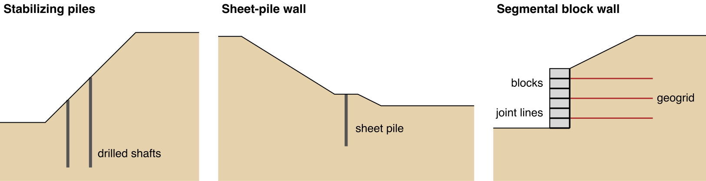
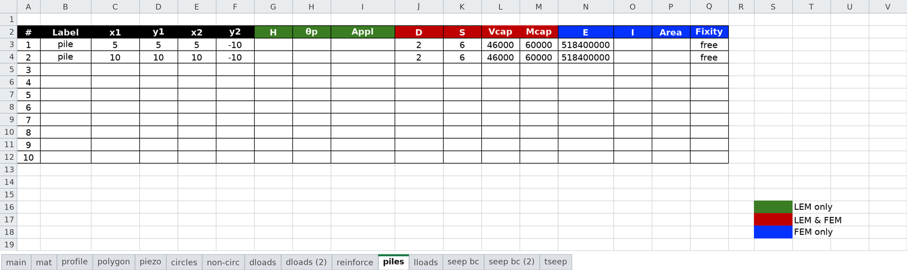
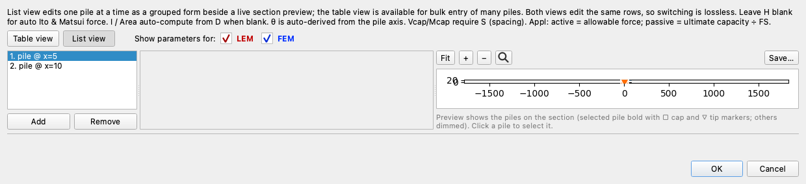
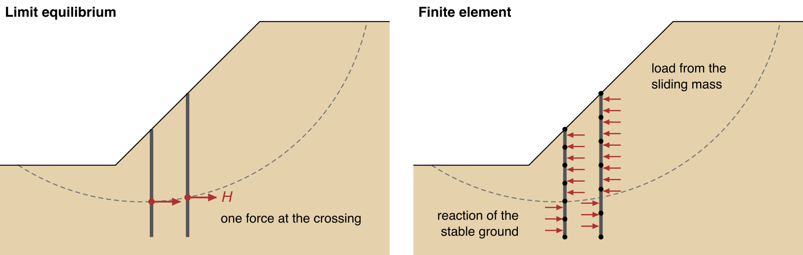
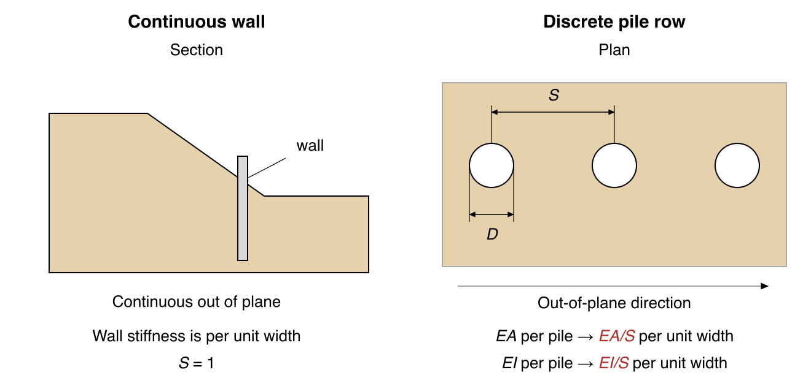

# Piles and Walls

Piles and walls resist a slide in shear and bending, where reinforcement resists it in tension. A row of
stabilizing piles or drilled piers runs through the sliding mass into stable ground. As the mass moves, it pushes
against the piles, and the piles push back. A sheet-pile or soldier-pile wall works the same way over its full
height and is often held by tiebacks. A segmental block wall or a concrete gravity wall is different: it stands by
its own weight and its friction on the ground beneath it.

{width=1000}

From left to right: two rows of drilled shafts stabilizing a slope ([Tutorial LEM-12](../tutorials/lem12_piles.md)), a
sheet-pile wall on a bench in a slope ([the SIGMA/W wall benchmark](../verification/geostudio.md#sigmaw-wall)), and a
segmental block wall with its joint lines and geogrid ([Tutorial FEM-3](../tutorials/fem03_block_wall_joints.md)).

A pile, micropile or pier, or a sheet-pile or soldier-pile wall, is entered as a straight line on the `piles` sheet,
which both the limit equilibrium (LEM) and finite element (FEM) analyses read. A block wall or a gravity wall is drawn as polygons of its own material, with joint lines where the FEM lets it slide
or open. [Pile and Wall Types](types.md) gives what to enter for each type, with typical values from the design
manuals, and how to connect a tieback or a facing to a wall.

## Entering a Pile Line

Each pile line is one row of the `piles` sheet of the
[input template](../usage/input_template.md#worksheet-piles):

In XSLOPE Studio, the same rows are edited in the pile editor. Its list view shows one pile at a time beside a
preview of the section ([Editing Inputs](../studio/editing.md#the-inputs-tree-and-the-editors)):

A pile runs from (`x1`, `y1`) to (`x2`, `y2`). The ends can be entered in either order: XSLOPE takes the higher end
as the head and the lower end as the tip. For a vertical pile, `x1` = `x2`. The template has rows formatted for 20
piles, and more can be added below them.

The user picks a unit system, SI or Imperial, on the `main` sheet
([Worksheet: main](../usage/input_template.md#worksheet-main)), and enters every value in it: kN and m, or lb and ft.
The pile force `H` is entered per unit width of slope, like every force in a two-dimensional analysis. The
capacities `Vcap` and `Mcap` and the section properties `I` and `Area` are entered for a single pile. The spacing
`S` converts between the two: the force on one pile is `H` × `S`, and the FEM divides each pile's flexural
stiffness EI and axial stiffness EA by `S` to get stiffness per unit width. For a continuous wall, enter values per
unit length of wall and set `S` = 1.

## The Columns

Each column name is colored as its header is on the sheet, to show which analysis reads it. In the Units column,
F is force and L is length.

Used by: geometry (both)LEM onlyLEM and FEMFEM only

| Column | Name | Units | Meaning |
|---|---|---|---|
| B | <code class="rc rc-geom">Label</code> | — | Optional name, used in messages, plots and reports. |
| C, D | <code class="rc rc-geom">x1</code>, <code class="rc rc-geom">y1</code> | L | One end of the pile. |
| E, F | <code class="rc rc-geom">x2</code>, <code class="rc rc-geom">y2</code> | L | The other end. |
| G | <code class="rc rc-lem">H</code> | F/L | Force the pile row exerts on the sliding mass, per unit width of slope. The LEM applies it perpendicular to the pile, where the slip surface crosses it. For a vertical pile, if left blank, `H` is computed from `D` and `S` by [Ito & Matsui's method](lem.md#ito-matsui-1975-theory). |
| H | <code class="rc rc-lem">Appl</code> | — | Active, or left blank: `H` is an allowable force and is not divided by the factor of safety. Passive: `H` is a nominal force and is divided by the factor of safety, as the soil's strength is. |
| I | <code class="rc rc-both">D</code> | L | Pile diameter. Used by the LEM to compute `H` by Ito & Matsui's method, and by the FEM to compute `I` and `Area` when they are blank. |
| J | <code class="rc rc-both">S</code> | L | Center-to-center spacing of the piles in the row; 1 for a continuous wall. Used by the LEM to compute `H` by Ito & Matsui's method and to convert `H` to the force on one pile for the capacity checks, and by the FEM to convert each pile's stiffness to stiffness per unit width. |
| K | <code class="rc rc-both">Vcap</code> | F per pile | Shear capacity of one pile. If left blank, there is no limit ([Structural Capacity Checks](lem.md#structural-capacity-checks)). |
| L | <code class="rc rc-both">Mcap</code> | F·L per pile | Moment capacity of one pile. If left blank, there is no limit. The LEM limits the force on a pile to `Mcap` divided by the moment arm. In the FEM, the pile forms a plastic hinge where the moment reaches `Mcap`: the section yields there and rotates freely. |
| M | <code class="rc rc-fem">E</code> | F/L² | Elastic modulus of the pile material. |
| N | <code class="rc rc-fem">I</code> | L⁴ per pile | Moment of inertia of one pile. If left blank, `I` is computed from the pile diameter, `D`, as πD⁴/64. |
| O | <code class="rc rc-fem">Area</code> | L² per pile | Cross-sectional area of one pile. If left blank, `Area` is computed from the pile diameter, `D`, as πD²/4. |
| P | <code class="rc rc-fem">Head</code> | `free`, `pinned`, `unrotated` or `fixed` | Restraint at the pile head. If left blank, the head is free ([Head and Tip Fixity](fem.md#head-and-tip-fixity)). |
| Q | <code class="rc rc-fem">Tip</code> | the same four | Restraint at the pile tip. If left blank, the tip is free. |

## LEM vs FEM

The LEM applies a single force, `H`, where a trial slip surface crosses the pile. It acts perpendicular to the
pile, against the movement of the sliding mass. `H` is either entered or computed by Ito & Matsui's method, and is
limited by `Vcap` and `Mcap`. The FEM instead builds the pile into the mesh as a chain of beam elements that share
nodes with the soil. No force is prescribed: the deforming soil loads the beam along its whole length, and the
analysis returns the moment, shear and deflection along the pile. The figure compares the two on the
[LEM-12](../tutorials/lem12_piles.md) slope and its critical circle:

{width=1000}

On the left, the LEM's force $H$ where each pile crosses the circle. On the right, the soil pressure along each
FEM beam: the sliding mass pushes the pile downslope above the slip surface, and the stable ground holds it back
below.

A two-dimensional analysis assumes plane strain, so it treats every member as continuous out of plane. That is
true of a wall but not of a row of separate piles:

{width=880}

On the left, a wall in section, entered with `S` = 1. On the right, a row of piles in plan, of diameter `D` at
spacing `S`. Dividing each pile's EA and EI by `S` turns the row into a wall of the same average stiffness, with no
gaps between the piles. In the ground, the soil arches between the piles and, if they are far enough apart, flows
between them. A two-dimensional analysis can represent neither, and that decides which analysis suits which
member:

| Member | Out of plane | Analysis | What it gives |
|---|---|---|---|
| Sheet-pile, diaphragm or secant wall | continuous | FEM, `S` = 1 | factor of safety, plus moment, shear, deflection and soil reaction down the member |
| Contiguous or very closely spaced row | nearly continuous | FEM, as a continuous wall | the same, ignoring the gaps |
| Row of separate piles | discrete | LEM with Ito & Matsui | factor of safety for the spacing, force per pile, capacity checks |

For a row of separate piles, take the factor of safety from the LEM with Ito & Matsui, and use the FEM to study
stiffness and member forces. [LEM vs FEM Pile Modeling](lem.md#lem-vs-fem-pile-modeling) compares the two analyses
on the same slopes, including the one pile-stabilized slope with a published three-dimensional solution. The
formulations are on [Piles in LEM](lem.md) and [Piles in FEM](fem.md).

## Worked Examples

[Tutorial LEM-12](../tutorials/lem12_piles.md) stabilizes a slope with two rows of drilled shafts, with `H` from
Ito & Matsui, and [Tutorial FEM-4](../tutorials/fem04_piles.md) runs the same slope by finite elements.
[Tutorial LEM-9](../tutorials/lem09_tieback_wall.md) builds a soldier-pile wall held by tiebacks, and
[Tutorial FEM-3](../tutorials/fem03_block_wall_joints.md) models a segmental block wall on slip joints, with and
without geogrid.
