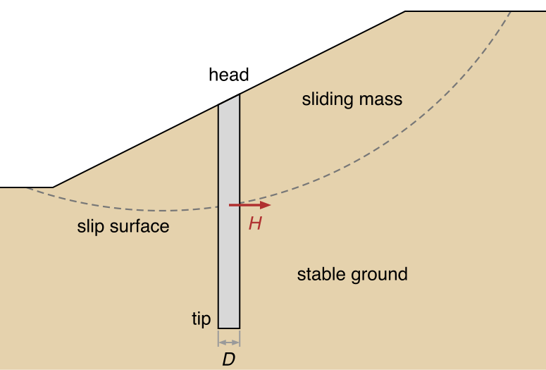
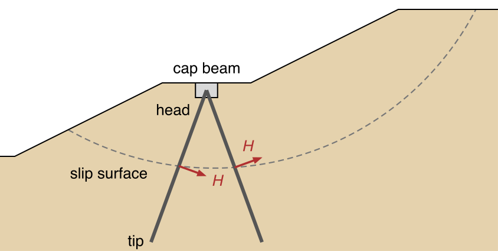
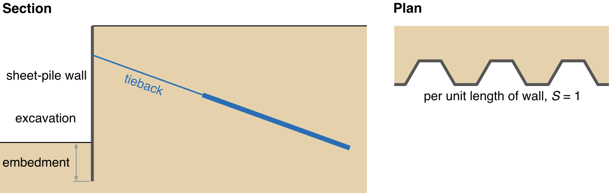
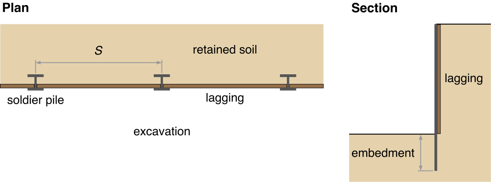
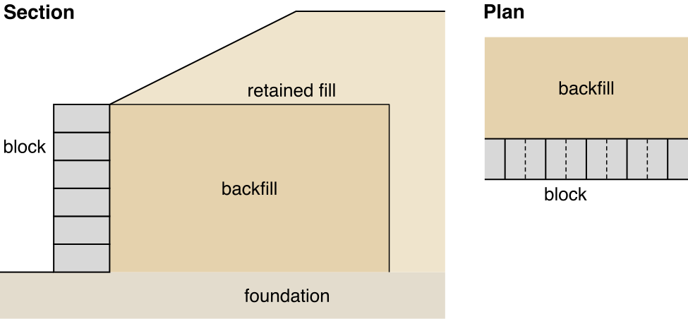
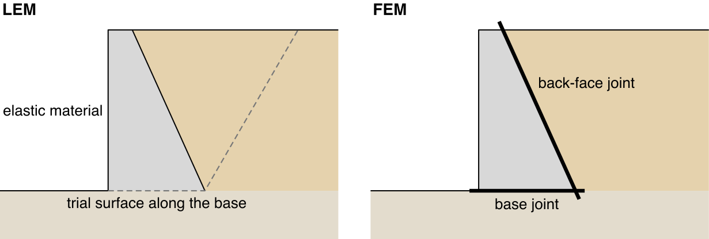
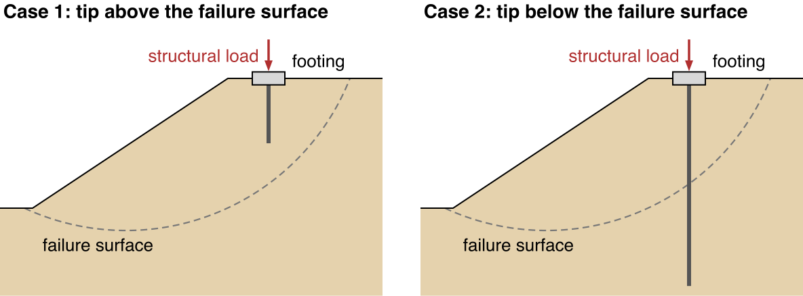
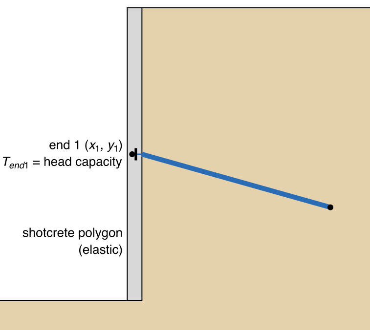

# Pile and Wall Types

A row of stabilizing piles or drilled shafts, a row of micropiles, a sheet-pile wall and a soldier-pile wall each
enter the model as one line on the `piles` sheet, with the columns described on the
[Piles and Walls Overview](overview.md#the-columns), but each fills those columns its own way. A segmental block
wall and a concrete gravity wall are drawn as polygons instead, with joint lines where they can slide. A wall that
holds tiebacks, nails or geogrid connects to them as under
[Connecting Reinforcement to a Wall or Facing](#connecting-reinforcement-to-a-wall-or-facing). F is the factor of
safety, and LEM and FEM are the limit equilibrium and finite element analyses.

Typical values come from the Federal Highway Administration (FHWA) manuals on drilled shafts (Geotechnical
Engineering Circular 10, cited as [GEC 10][gec10]), micropiles (the [micropile manual][mp]), ground anchors and
anchored walls ([GEC 4][gec4]), soil nail walls ([GEC 7][gec7]) and mechanically stabilized earth walls
([GEC 11][gec11v1]), and, for steel
sections, one sheet-pile maker's published tables ([Nucor Skyline][nucor]) ([References](#references)). Where a
source gives a value in one unit system only, the value in parentheses is converted from it, and a value given in
inches or millimeters (ksi, in², in⁴, mm²) is also given in model units, built on feet or meters.

## A Row of Stabilizing Piles or Drilled Shafts

A row of drilled shafts, or piers, is installed through the sliding mass into stable ground, at a spacing close
enough for the soil to arch between them. The shafts act as shear dowels across the slip surface
([GEC 10][gec10] p. 12-59).

**Use the LEM**, with `H` computed by Ito & Matsui's method. The shafts are separate piles, and Ito & Matsui's
method accounts for the soil moving between them ([LEM vs FEM](overview.md#lem-vs-fem)). If the shafts touch, as in
a contiguous or secant pile wall, the row is a wall: use the FEM, as for a [sheet-pile wall](#sheet-pile-wall).

The figure shows one shaft in section and the row in plan.

{width=842}

In section, the pile line runs from the head to the tip. Where a trial slip surface crosses the shaft, the LEM
applies `H` into the slope, against the movement of the sliding mass. In plan, shafts of diameter `D` stand in a row
across the slope at center-to-center spacing `S`, and the sliding mass moves past them.

Used by: LEM onlyLEM and FEMFEM only

| Column | Entry | Typical values |
|---|---|---|
| <code class="rc rc-lem">H</code> | Leave blank to have the LEM compute `H` by Ito & Matsui's method from `D` and `S` for each trial surface (vertical piles only). Or enter the force per unit width from a lateral analysis of the pile: the force on one pile ÷ `S`. [GEC 10][gec10] sizes a row for the smaller of the passive force on the shafts and the force the slope needs to reach its target factor of safety (p. 12-58). | None given in the sources. |
| <code class="rc rc-lem">Appl</code> | `Active`, so that `H` is not divided by F, as in [Tutorial LEM-12](../tutorials/lem12_piles.md). | — |
| <code class="rc rc-both">D</code> | Shaft diameter. | Casing and drilling tools come in 6 in. (0.5 ft, 0.152 m) steps ([GEC 10][gec10] p. 4-11). GEC 10's wall example uses 4 ft (1.22 m) shafts (pp. 12-14, 12-15). |
| <code class="rc rc-both">S</code> | Center-to-center spacing along the row. | 3 diameters is routine for groups of shafts, and 2.5 is sometimes advantageous ([GEC 10][gec10] p. 14-2). |
| <code class="rc rc-both">Vcap</code> | Shear capacity of one shaft, or leave blank for no limit. | [GEC 10][gec10] gives the design method, not typical values. |
| <code class="rc rc-both">Mcap</code> | Nominal moment capacity of one shaft. | About 27 D³ kip-ft with 1 percent longitudinal steel and 40 D³ kip-ft with 1.5 percent, with D in ft ([GEC 10][gec10] p. 12-14); in SI, 1,290 D³ and 1,915 D³ kN·m with D in m. For D = 4 ft (1.22 m), that is 1.73 × 10⁶ to 2.56 × 10⁶ lb-ft (2,340 to 3,470 kN·m). Longitudinal steel is typically 1 to 2 percent of the gross area (pp. 16-4, 16-5). |
| <code class="rc rc-fem">E</code> | Modulus of the concrete. | Ec = 1,820 √f′c ksi, where f′c is the concrete's compressive strength in ksi, generally 3.5 to 5.0 ([GEC 10][gec10] pp. 16-3, 16-4). That gives 3,400 to 4,070 ksi, or 4.9 × 10⁸ to 5.9 × 10⁸ psf (2.35 × 10⁷ to 2.81 × 10⁷ kPa). |
| <code class="rc rc-fem">I</code>, <code class="rc rc-fem">Area</code> | Leave blank. They are computed from `D` for the gross section, as πD⁴/64 and πD²/4. | For D = 4 ft: I = 12.6 ft⁴ (0.109 m⁴), Area = 12.6 ft² (1.17 m²). |
| <code class="rc rc-fem">Head</code> | Leave blank (free) unless a cap beam ties the heads (`unrotated`) or anchors hold them (`pinned` or `fixed`). | — |
| <code class="rc rc-fem">Tip</code> | Leave blank (free), since the embedment below the slip surface holds the shaft. Use `fixed` only for a tip socketed into rock. | — |

## Micropiles

A micropile is a small drilled and grouted pile, typically less than 300 mm (12 in) in diameter, reinforced with a
steel casing or bar ([micropile manual][mp] p. 1-4). To stabilize a slope, micropiles are installed in rows, often
in pairs battered across the slip surface, with their heads tied together by a concrete cap beam at the ground
surface (pp. 6-44, 6-54).

**Use the LEM**, since the micropiles in a row are separate piles. Ito & Matsui's method applies to vertical piles
only, so enter `H` for each battered micropile.

The figure shows one battered pair under its cap beam in section, and three pairs in plan.

{width=801}

In section, each leg is a separate pile line, from its head in the cap beam to its tip in stable ground, with its
own `H` perpendicular to the leg where the slip surface crosses it. In plan, the pairs stand along the cap beam at
spacing `S`, with each pair's legs running upslope and downslope below the ground.

Used by: LEM onlyLEM and FEMFEM only

| Column | Entry | Typical values |
|---|---|---|
| <code class="rc rc-lem">H</code> | The resistance per unit width: the force one micropile develops at the slip surface ÷ `S`. Enter each leg of a pair as a separate line, with its own `H`. | In the manual's slope example, 365 kN (82 kip) for the upslope leg and 450 kN (101 kip) for the downslope leg, against 650 kN/m (44.5 kip/ft) required (pp. 6-51, 6-52). |
| <code class="rc rc-lem">Appl</code> | `Active` for an allowable `H`. `Passive` for an ultimate `H`, such as the example's; the LEM then divides it by F. | — |
| <code class="rc rc-both">D</code> | Leave blank. `H`, `I` and `Area` are entered, so the diameter is not used. | The grouted diameter is typically less than 0.3 m (1 ft) (p. 1-4), and 0.2 m (0.66 ft) in the manual's group example (p. 5-25). |
| <code class="rc rc-both">S</code> | Spacing along the row, between micropiles or between pairs. | At least 0.76 m (2.5 ft) or 3 diameters, whichever is greater (p. 5-8); 1.25 m (4.1 ft) between pairs in the slope example (p. 6-52). |
| <code class="rc rc-both">Vcap</code> | Shear capacity of one micropile. | 365 kN (82 kip) at zero axial load for the slope example's 177.8 mm (7 in) casing (p. 6-51). |
| <code class="rc rc-both">Mcap</code> | Moment capacity of one micropile. | 161 kN·m (119,000 lb-ft) at zero axial load for the same casing ([micropile manual][mp] Table 6-2, p. 6-47). |
| <code class="rc rc-fem">E</code> | Modulus of the steel casing. | 29,000 ksi (4.18 × 10⁹ psf, or about 2.0 × 10⁸ kPa) ([micropile manual][mp] p. 5-16). |
| <code class="rc rc-fem">Area</code> | Area of the steel casing. | 3,760 to 8,760 mm² (5.8 to 13.6 in²) for 139.7 to 244.5 mm (5.5 to 9.625 in.) casings (Table 4-5, p. 4-33); in model units, 0.00376 to 0.00876 m², or 0.0405 to 0.0943 ft². |
| <code class="rc rc-fem">I</code> | Moment of inertia of the casing, π(OD⁴ − ID⁴)/64, where OD and ID are its outside and inside diameters. | For the same casings, 8.05 × 10⁻⁶ to 5.94 × 10⁻⁵ m⁴, or 9.32 × 10⁻⁴ to 6.88 × 10⁻³ ft⁴. |
| <code class="rc rc-fem">Head</code> | `unrotated` where a cap beam ties the heads, as in the slope example (p. 6-54); otherwise leave blank (free). | — |
| <code class="rc rc-fem">Tip</code> | Leave blank (free), since the bond length below the slip surface holds the tip. Use `fixed` for a tip socketed into rock. | The slope example sockets its tips 4.5 m (15 ft) into bedrock (p. 6-57). |

The values of `I` and `Area` above leave out the grout inside the casing; the moment capacity includes it.

## Sheet-Pile Wall

A sheet-pile wall is a line of interlocking steel sheets driven to form a continuous wall, cantilevered or held by
tiebacks.

**Use the FEM.** The wall is continuous out of plane, so the FEM represents it directly and also returns the moment,
shear and deflection in it. Enter it per unit length of wall, with `S` = 1.

The figure shows a wall held by a tieback in section, and its sheets in plan.

{width=766}

The pile line runs from the top of the wall to its tip, which is below the excavation's base by the embedment depth.
The tieback is a line on the `reinforce` sheet, connected as described under
[A tieback and a soldier-pile or sheet-pile wall](#a-tieback-and-a-soldier-pile-or-sheet-pile-wall). In plan, the
interlocked sheets form one continuous wall, so `I`, `Area` and `Mcap` are entered per unit length of wall.

Used by: LEM onlyLEM and FEMFEM only

| Column | Entry | Typical values |
|---|---|---|
| <code class="rc rc-lem">H</code> | The wall's resistance per unit length where a slip surface crosses it: the smaller of its shear capacity and the passive force the soil can develop against the wall, from the slip surface down to its toe ([GEC 4][gec4] p. 101). | — |
| <code class="rc rc-lem">Appl</code> | `Active`, since `H` is an allowable resistance and is not divided by F. | — |
| <code class="rc rc-both">D</code> | Leave blank. A wall's `I` and `Area` are entered, so the diameter is not used. | — |
| <code class="rc rc-both">S</code> | 1, since the values are per unit length of wall. | — |
| <code class="rc rc-both">Vcap</code> | Leave blank for no limit. | The sources give no typical value. |
| <code class="rc rc-both">Mcap</code> | Plastic moment per unit length of wall, Fy × Z, where Fy is the steel's yield strength and Z the plastic section modulus. | Fy = 50 ksi (345 MPa) is the most common grade ([Nucor Skyline][nucor] p. 6). The table below gives values for four sections. |
| <code class="rc rc-fem">E</code> | Modulus of the steel. | 29,000 ksi (4.18 × 10⁹ psf, or about 2.0 × 10⁸ kPa) ([micropile manual][mp] p. 5-16). |
| <code class="rc rc-fem">I</code>, <code class="rc rc-fem">Area</code> | Per unit length of wall, from the section table. | The table below. |
| <code class="rc rc-fem">Head</code> | Leave blank (free). Tiebacks are entered on the `reinforce` sheet and connected as described under [A tieback and a soldier-pile or sheet-pile wall](#a-tieback-and-a-soldier-pile-or-sheet-pile-wall). | — |
| <code class="rc rc-fem">Tip</code> | Leave blank (free), since the embedment holds the toe. | — |

Four common hot-rolled PZ (Z-shaped) sections, per foot and per meter of wall ([Nucor Skyline][nucor] p. 5; `Mcap` computed with
Fy = 50 ksi):

| Section | `Area` per ft (per m) | `I` per ft (per m) | `Mcap` per ft (per m) |
|---|---|---|---|
| PZ 22 | 0.0449 ft² (0.0137 m²) | 0.00407 ft⁴ (1.15 × 10⁻⁴ m⁴) | 90,800 lb-ft (404 kN·m) |
| PZ 27 | 0.0551 ft² (0.0168 m²) | 0.00888 ft⁴ (2.52 × 10⁻⁴ m⁴) | 152,000 lb-ft (676 kN·m) |
| PZ 35 | 0.0715 ft² (0.0218 m²) | 0.0174 ft⁴ (4.93 × 10⁻⁴ m⁴) | 238,000 lb-ft (1,060 kN·m) |
| PZ 40 | 0.0817 ft² (0.0249 m²) | 0.0237 ft⁴ (6.70 × 10⁻⁴ m⁴) | 300,000 lb-ft (1,330 kN·m) |

The manufacturer states these as 6.47 to 11.77 in² and 84.4 to 491 in⁴ per foot of wall.

## Soldier-Pile Wall

A soldier-pile wall is a row of steel beams, either driven H-piles or pairs of channels or wide-flange beams set in
concrete-filled drilled holes, with timber lagging spanning between them to hold the soil ([GEC 4][gec4] p. 13).

**Use the LEM**, with `H` entered, as in [Tutorial LEM-9](../tutorials/lem09_tieback_wall.md). Above the
excavation, the lagging makes the wall continuous. Below it, the beams are separate piles, and the soil can move
between them. Enter the wall per beam, with `S` the beam spacing.

`H` is the smaller of the beam's allowable shear capacity and the passive force the soil can develop in front of the
beam, from the slip surface down to its toe, divided by the beam spacing `S` ([GEC 4][gec4] p. 101). GEC 4
computes the passive force by Broms' method (pp. 84–86). In sand, and in clay under drained conditions, the Rankine
passive pressure acts over three times the beam width. In clay under undrained conditions, a pressure of 9 times
the undrained shear strength acts over one beam width, with none in the top 1.5 beam widths below the excavation.
The beam width is the flange width for a driven beam, or the hole diameter for a beam set in concrete. Compute `H`
for the depth where the critical slip surface crosses the wall.

The FEM cannot represent this. It spreads each beam over the full spacing `S`, so the soil in front of the embedded
beams resists across the whole spacing.

The figure shows the wall in section and in plan.

{width=658}

In section, the lagging stops at the excavation's base, and the beam continues below it as the embedment. In plan,
the soldier piles stand at spacing `S`, with the lagging spanning between them. The pile line represents one beam,
and `I`, `Area` and `Mcap` are entered for one beam.

Used by: LEM onlyLEM and FEMFEM only

| Column | Entry | Typical values |
|---|---|---|
| <code class="rc rc-lem">H</code> | The wall's resistance per unit length, computed as described above. | — |
| <code class="rc rc-lem">Appl</code> | `Active`, since `H` is an allowable resistance and is not divided by F, as in [Tutorial LEM-9](../tutorials/lem09_tieback_wall.md). | — |
| <code class="rc rc-both">D</code> | Leave blank. `H`, `I` and `Area` are entered, so the diameter is not used. | A drilled-in beam's hole is 0.61 m (2 ft) in GEC 4's examples (pp. A-10, A-29). |
| <code class="rc rc-both">S</code> | Center-to-center spacing of the beams. | 1.5 to 3 m (4.9 to 9.8 ft) for driven beams, up to 3 m for drilled-in beams ([GEC 4][gec4] p. 76); 2.5 m (8.2 ft) in GEC 4's examples (p. A-7). |
| <code class="rc rc-both">Vcap</code> | Leave blank for no limit. | The sources give no typical value. |
| <code class="rc rc-both">Mcap</code> | Moment capacity of one beam about its strong axis, Fy × Z. For allowable stress design, GEC 4 uses an allowable bending stress Fb = 0.55 Fy (p. A-10). | Grade 50 (Fy = 50 ksi) steel H-piles (HP sections): HP 12×84, 500,000 lb-ft (678 kN·m); HP 14×117, 808,000 lb-ft (1,096 kN·m) ([Nucor Skyline][nucor] pp. 6, 33). |
| <code class="rc rc-fem">E</code> | Modulus of the steel. | 29,000 ksi (4.18 × 10⁹ psf, or about 2.0 × 10⁸ kPa) ([micropile manual][mp] p. 5-16). |
| <code class="rc rc-fem">I</code>, <code class="rc rc-fem">Area</code> | For one beam, about its strong axis. | HP 12×84: `I` = 650 in⁴, or 0.0314 ft⁴ (2.71 × 10⁻⁴ m⁴); `Area` = 24.6 in², or 0.171 ft² (0.0159 m²). HP 14×117: `I` = 1,220 in⁴, or 0.0588 ft⁴ (5.08 × 10⁻⁴ m⁴); `Area` = 34.4 in², or 0.239 ft² (0.0222 m²) ([Nucor Skyline][nucor] p. 33). |
| <code class="rc rc-fem">Head</code> | Leave blank (free). Tiebacks are connected as described under [A tieback and a soldier-pile or sheet-pile wall](#a-tieback-and-a-soldier-pile-or-sheet-pile-wall). | — |
| <code class="rc rc-fem">Tip</code> | Leave blank (free), since the embedment holds the toe. | — |

## Segmental Block Wall

A segmental, or modular block, wall is a column of dry-stacked concrete units. The blocks themselves do not fail.
The wall fails at its contacts: a course can slide on the one below it, the whole column can slide on its
foundation, and its back face can separate from the fill. Many block walls also have geogrid layers laid between
the courses and running back into the fill
([A geosynthetic and facing blocks, panels or a wrapped face](#a-geosynthetic-and-facing-blocks-panels-or-a-wrapped-face)).

**Use the FEM.** Only the FEM models the contacts.

The figure shows the wall of [Tutorial FEM-3](../tutorials/fem03_block_wall_joints.md) in section and in plan.

{width=600}

The plan looks down on the wall with its face at the bottom. Solid lines separate the units of the top course, and
dashed lines separate those of the course below, offset by half a unit.

#### In the LEM

The LEM cannot model a block wall. It does not read the `joints` sheet. If the blocks are drawn as a soil material,
with the `mc` strength option, trial surfaces cut through them, and the factor of safety comes out far too low. If
they are drawn as `elastic`, trial surfaces must pass under the wall, and the factor of safety comes out too high.

#### In the FEM

The wall is drawn as polygons rather than entered on the `piles` sheet:

- **Blocks.** Draw one polygon per course on the `polygon` sheet, in a block material with the `elastic` strength
  option ([Worksheet: mat](../usage/input_template.md#worksheet-mat)). An elastic material cannot fail, so the
  strength reduction does not weaken the blocks. Give each block polygon a local `Size` of about half the course height,
  so the mesh resolves every course without refining the whole section.
- **Contacts.** Enter one row on the `joints` sheet for the base, one for the back face, and one for each
  course joint ([The joints worksheet](../fem/joints.md#the-joints-worksheet)). In a battered wall, where each
  course is set back from the one below, the back face steps at every course, and each step needs its own joint
  line.

#### Typical values

Typical values for the blocks and their contacts:

| Quantity | Entry | Typical values |
|---|---|---|
| Block size | The polygons' height and depth. | Units 0.33 to 1.25 ft (0.10 to 0.375 m) high and 0.67 to 2 ft (0.20 to 0.60 m) deep ([GEC 11][gec11v1] Vol. I p. 3-43). |
| Batter | Set each course polygon back from the one below. | From near vertical up to 15 degrees (Vol. I p. 2-40). |
| Course joints | `c` = 0; `phi` from the manufacturer's inter-unit shear tests; `t_cut` = 0. | GEC 11 requires the inter-unit shear capacity from tests on the unit (ASTM D6916) (Vol. I p. 4-58) and gives no typical value. |
| Base and back face | `c` = 0; `phi` = the friction angle of concrete on the adjacent soil; `t_cut` = 0. | As for a [gravity wall](#gravity-or-cantilever-wall) below. |
| `kn`, `ks`, `Jred` | Leave blank. The stiffnesses then come from the softer adjacent material, and the strength reduction weakens the contacts along with the soil. | — |

## Gravity or Cantilever Wall

A concrete gravity wall stands by its own weight, and a cantilever wall by its weight plus the soil on its heel.
Draw either as a polygon of concrete, in a material with the `elastic` strength option so that it cannot fail.

**Use the FEM**, with a joint line under the wall's base and another up its back face, so that the wall can slide
and separate from the soil. The base joint slides at δ, the friction angle of concrete on the foundation. The LEM
has no entry for δ.

{width=758}

On the left, for comparison, the LEM: a trial surface cannot pass through the wall, so a non-circular surface runs
along its base and up through the backfill. On the right, the FEM's base joint and back-face joint.

| Quantity | Entry | Typical values |
|---|---|---|
| Unit weight | Unit weight γ of the concrete material. | 150 lb/ft³ (23.6 kN/m³) for reinforced concrete ([GEC 4][gec4] p. A-13). |
| `E` (FEM) | Modulus of the concrete material. | Ec = 1,820 √f′c ksi: 4.9 × 10⁸ to 5.9 × 10⁸ psf (2.35 × 10⁷ to 2.81 × 10⁷ kPa) for f′c = 3.5 to 5.0 ksi ([GEC 10][gec10] p. 16-3). |
| Base joint (FEM) | `c` = 0, since the sources give friction only; `phi` = δ, the friction angle of concrete on the foundation; `t_cut` = 0. | Mass concrete on clean sound rock 35°; on clean gravel or coarse sand 29 to 31°; on clean fine to medium sand 24 to 29°; on fine sand, silty or clayey 19 to 24°; on very stiff to hard clay 22 to 26°; on medium stiff to stiff clay 17 to 19° ([GEC 10][gec10] p. 12-50). |
| Back-face joint (FEM) | `c` = 0; `phi` = δ, the friction angle of the wall against the backfill; `t_cut` = 0. | About two thirds of the backfill's φ′ in GEC 10's example: 24° against sand at 36°, 19° against clay at 28° (pp. 12-52, 12-53). |

## Load-Bearing Piles Near a Slope

A load-bearing pile carries a vertical load from a structure, such as a footing, down into the ground. It passes the
load to the soil by skin friction along its shaft and by end bearing at its tip. For slope stability, the question is
whether that load adds to the driving force on the failure surface.

**Use either analysis.** To count the resistance of a pile that crosses the failure surface, use the LEM.

{width=871}

In plan, the footings stand along the crest (the line with ticks pointing down the slope) at center-to-center
spacing *s*. Each is *B* wide across the crest, with its pile dashed below it.

Which case applies depends on the critical failure surface, which is not known before the run. If the critical
surface passes on the other side of the pile tip from the one assumed, switch to the other case and run again.

### Case 1: Pile tip above the failure surface

If the pile ends inside the sliding mass, as a friction pile in weak soil can, the pile and its load slide with the
mass. The load adds to the driving force, so include it. Apply it as a surcharge on the `dloads` sheet. For a force
*P* on each footing, the surcharge is *P* ÷ (*B* × *s*). Enter it in the `Normal` column at two points on the ground
surface, one at each edge of the footing, with Direction set to `vertical`
([Worksheet: dloads](../usage/input_template.md#worksheet-dloads)).

Use either analysis. Both read the `dloads` sheet. In the FEM, do not enter the pile on the `piles` sheet, since the
FEM would spread the row of piles into a continuous wall
([Continuous Walls and Discrete Pile Rows](fem.md#applicability-continuous-walls-and-discrete-pile-rows)).

### Case 2: Pile tip below the failure surface

A load-bearing pile near a slope is usually designed to reach stable ground below the failure surface. To get there,
it passes through the sliding mass. Skin friction develops along the whole shaft, above and below the failure
surface. The load carried by skin friction above the failure surface adds to the driving force. The rest, carried
by skin friction below the failure surface and by end bearing, goes to stable ground.

Finding this split takes a load-transfer analysis, such as one with t-z curves. That is rarely done for slope
stability. Instead, two assumptions bracket the load: leave it out, or apply all of it.

#### Leave the load out

Assume the pile delivers all of its load to stable ground below the failure surface, and leave the load out of the
model. It suits these cases:

- The pile is an end-bearing pile in competent material, such as rock or dense sand. Most of the load reaches the
  tip.
- The skin friction above the failure surface is small compared with the pile's total capacity. This is the case
  when the failure surface is shallow compared with the pile's length, or when the soil in the sliding mass is weak.
- The structural load is small compared with the driving force of the soil.

#### Apply the full load

Apply the full structural load as a surcharge, as in Case 1. This assumes that all of the load enters the sliding
mass, so it is conservative. It suits these cases:

- A large part of the pile shaft is above the failure surface.
- The soil above the failure surface develops high skin friction, so the pile sheds much of its load before it
  reaches the failure surface.
- The structural load is large compared with the driving force of the soil, so leaving it out would noticeably
  change the factor of safety.

When in doubt, run both. Use either analysis. In the FEM, do not enter the pile on the `piles` sheet, as in Case 1.

#### The pile's resistance to sliding

The pile crosses the failure surface, so it also resists the slide. Leaving that resistance out is conservative. To
count it, use the LEM and enter the pile on the `piles` sheet, with `D` the pile diameter and `S` = *s* for one pile
per footing, as for any row of separate piles ([Piles and Walls](overview.md#lem-vs-fem)). Enter `Vcap` and `Mcap`
for the pile, so that `H` is limited to what the pile can carry. Ito & Matsui's method applies for `S`/`D` between
2 and 8. Above 8, it overestimates the force, so enter `H` from a lateral analysis of the pile. Do not count it in
the FEM, which would spread the row into a continuous wall.

### Summary

1. If the pile tip is above the failure surface, apply the structural load as a surcharge on the `dloads` sheet.
2. If the pile tip is below the failure surface, leave the load out or apply all of it, as the lists above describe.
   When in doubt, run both.
3. To count the pile's resistance to sliding, enter the pile on the `piles` sheet and use the LEM.

## Connecting Reinforcement to a Wall or Facing

A tieback, nail or geosynthetic that bears on a wall or a facing is connected at its end 1. The two analyses treat
the connection differently. The LEM applies each member's force separately. The FEM connects a bar to another
member only at a node the two share or, for a jointed sheet, through a tie at end 1.

### A tieback and a soldier-pile or sheet-pile wall

Use the LEM for a soldier-pile wall and the FEM for a sheet-pile wall ([Soldier-Pile Wall](#soldier-pile-wall),
[Sheet-Pile Wall](#sheet-pile-wall)). Enter the wall on the `piles` sheet and each tieback on the `reinforce` sheet,
with end 1 at the wall.

#### In the LEM

The wall resists with the force `H` where a trial surface crosses it ([Piles in LEM](lem.md)). Enter `H` as
described under [Soldier-Pile Wall](#soldier-pile-wall). The `piles` sheet has its own `Appl` column, which works as
it does on the `reinforce` sheet. [Tutorial LEM-9](../tutorials/lem09_tieback_wall.md) enters the `H` its reference
publishes, with `Appl` set to Active. The figure shows one tieback through a soldier-pile wall, with a trial
surface that crosses both.

{width=450}

The trial surface starts at the corner of the excavation, where it crosses the pile line and the wall's `H` acts.
It then crosses the tieback's unbonded length, where `Tmax` acts along the tendon. A trial surface that passes
below the toe of the wall receives no force from the wall.

#### In the FEM

The wall is a chain of beam elements ([Piles in FEM](fem.md)), and a tieback is a chain of bar elements. A bar
that ends on or crosses a pile line shares a node with the pile there, so the tieback pulls on the wall at that
node. The figure shows one tieback whose end 1 lies on the pile line, below the pile's head.

{width=447}

End 1 can also lie on the wall face in front of the pile line. In [Tutorial LEM-9](../tutorials/lem09_tieback_wall.md),
the face is at x = 0 and the pile line 0.5 ft (0.15 m) behind it. The bar then crosses the pile line and is joined to
it at the crossing. The [model checks](../studio/analysis.md#model-checks-before-a-run) note the join.

### A soil nail and a shotcrete facing

A nail's head plate bears on the shotcrete facing at end 1, where `Tend1` sets the head's capacity in both
analyses ([Soil Nail](../reinforcement/types.md#soil-nail)). The manner in which the shotcrete is represented in
the analysis is different for LEM vs FEM.

#### In the LEM

Leave the facing out of the geometry and run the ground surface down the cut face. Start each nail on the cut
face, and enter the facing's weight on the `lloads` sheet as a vertical load on the crest, a few inches (about
0.1 m) behind the face ([Worksheet: lloads](../usage/input_template.md#worksheet-lloads)). The nails carry the
facing ([GEC 7][gec7] p. 200), so its weight goes into the reinforced soil that slides. For a vertical face and a
slip surface that exits at the toe, one load at the top has the same effect as the weight spread down the face;
for a battered face it is an approximation. Verification problems
[VP47](../verification/rocscience.md#vp47) and [VP48](../verification/rocscience.md#vp48) enter their facings this
way, with line loads of 14.6 kN/m and 13.2 kN/m.

{width=478}

Do not draw the facing as a concrete polygon in the LEM: a trial surface cannot cut through an `elastic` material,
so it passes under the facing and misses the surfaces that govern.

#### In the FEM

Draw the facing as a polygon of shotcrete on the air side of the cut face, from the toe to the crest and as thick
as the whole facing, so that its outer face becomes the ground surface. Give its material the unit weight and
stiffness of concrete ([Typical values](#typical-values)) and the `elastic` strength option, as for a
[gravity wall](#gravity-or-cantilever-wall). Extend each nail into the polygon so that end 1 sits at the head plate.
The polygon carries the facing's weight, so leave out the LEM's line load.

{width=466}

The facing is thin, a foot (0.3 m) or less, so give its polygon a Size of a quarter of its thickness. That puts
about four elements across it ([A Size on one zone](../fem/mesh.md#a-size-on-one-zone)).

#### Typical values

| Quantity | Entry | Typical values |
|---|---|---|
| Facing thickness | The initial and final facings together, used in the line load (LEM) and as the polygon's thickness normal to the face (FEM). | Initial facing of shotcrete: typically 4 in. (0.33 ft, 0.10 m), or 6 in. (0.5 ft, 0.15 m). Final facing of shotcrete: 6 or 8 in. (0.5 or 0.67 ft, 0.15 or 0.20 m), typically 8. Final facing cast in place: 10 in. (0.83 ft, 0.25 m) and thicker ([GEC 7][gec7] p. 164). |
| Unit weight | Used in the line load (LEM), and as γ of the shotcrete material (FEM). | 150 lb/ft³ (23.6 kN/m³), as for reinforced concrete ([GEC 4][gec4] p. A-13). |
| Line load (LEM) | `P` on the `lloads` sheet, with `Angle` left blank (straight down). | Unit weight × facing thickness × face height: for a 4 in. initial and an 8 in. final facing, 1 ft in all, on a 20 ft face, 150 lb/ft³ × 1 ft × 20 ft = 3,000 lb/ft (43.8 kN/m). |
| `E` (FEM) | Modulus of the shotcrete material. | Ec = 1,820 √f′c ksi, with f′c in ksi ([GEC 10][gec10] p. 16-3): 3,640 ksi, or 5.24 × 10⁸ psf (2.51 × 10⁷ kPa), for f′c = 4 ksi (4,000 psi). Shotcrete is typically 3,000 to 4,000 psi, more commonly 4,000 ([GEC 7][gec7] p. 164). |

### A geosynthetic and facing blocks, panels or a wrapped face

Use the FEM for a block facing ([Segmental Block Wall](#segmental-block-wall)). Use either analysis for a wrapped
face.

Enter each layer with end 1 at the back of the facing and end 2 in the fill. `Tend1` is the capacity of the
connection. The figure shows one layer connected to a block facing.

{width=455}

A wrapped face has no facing unit. The sheet is folded back over the face and buried under the next lift. Enter each
layer with end 1 at the face, and set `Tend1` to the pullout resistance of the folded-back part.

#### In the LEM

A block facing needs the FEM. For a wrapped face, `Tend1` sets the layer's capacity at end 1, where its capacity
envelope starts
([Capacity Envelope](../reinforcement/lem.md#capacity-envelope)).

#### In the FEM

Draw the blocks and their joint lines as described under [Segmental Block Wall](#segmental-block-wall). A bonded
layer cannot end on a joint line, so set `Joint` to `Yes` on every layer. `Tend1` is the strength of the tie between
end 1 and the blocks ([Ends, ties and the bar](../reinforcement/fem.md#ends-ties-and-the-bar)). In
[Tutorial FEM-3](../tutorials/fem03_block_wall_joints.md#part-2-the-same-wall-with-geogrid), each of the three layers
is tied to the blocks with `Tend1` = 40 kN/m (2,740 lb/ft). The figure shows that wall.

{width=653}

In section, joint lines run under the base, up the back face and between the courses. Each layer starts on the back
face, where a dot marks its tie to the blocks. In plan, one layer runs back from the blocks into the reinforced fill
along the whole length of the wall.

A wrapped face has no blocks and needs no joint lines. Run the model twice, once with the layers bonded and once
with them jointed ([Choosing a Bonded Bar or a Joint](../reinforcement/fem.md#bonded-bar-or-joint)). For a bonded
layer, `Tend1` sets the layer's capacity at end 1. For a jointed layer, `Tend1` is the strength of the tie between
end 1 and the soil at the face.

#### Connection strength

FHWA bases the connection's long-term strength, per unit width of the layer, on connection tests of the facing
unit with the geosynthetic:

>$T_{alc} = \dfrac{T_{ult} \times CR_{cr}}{RF_D}$

where Tult is the layer's ultimate tensile strength, CRcr is the fraction of that strength
the connection keeps over the long term, measured in those tests, and RFD is the reduction factor for
chemical and biological degradation ([GEC 11][gec11] Eq. 4-41, p. B-13). Talc increases with the normal
pressure on the connection. In GEC 11's Example E1, it ranges from 533 lb/ft (7.8 kN/m) at the top layer to
2,550 lb/ft (37.2 kN/m) at the bottom (Table E1-7.6, p. E1-18). The wall uses two grades of geogrid, GG-I and
GG-II, with long-term strengths Tal ([Geosynthetic Layer](../reinforcement/types.md#geosynthetic-layer))
of 1,085 and 2,169 lb/ft (15.8 and 31.7 kN/m) (Table E1-7.3, p. E1-15). On eight of the wall's eleven layers, the
connection is weaker than the layer and limits the force at the face.

Enter Talc as `Tend1`. In the LEM, with `Appl` set to Active, first divide it by the factor of safety
the design applies to the connection. With `Appl` set to Passive, enter it as it is
([Geosynthetic Layer](../reinforcement/types.md#geosynthetic-layer)). The FEM ignores `Appl` and uses `Tend1` as
entered.

## References

**GEC 4:** Sabatini, P.J., Pass, D.G., & Bachus, R.C. (1999). *Geotechnical Engineering Circular No. 4: Ground
Anchors and Anchored Systems*. [FHWA-IF-99-015](https://www.fhwa.dot.gov/engineering/geotech/pubs/if99015.pdf).
Federal Highway Administration, Washington, D.C.

**GEC 7:** Lazarte, C.A., Robinson, H., Gómez, J.E., Baxter, A., Cadden, A., & Berg, R. (2015). *Geotechnical
Engineering Circular No. 7: Soil Nail Walls Reference Manual*.
[FHWA-NHI-14-007](https://www.fhwa.dot.gov/engineering/geotech/pubs/nhi14007.pdf). Federal Highway Administration,
Washington, D.C.

**GEC 10:** Brown, D.A., Turner, J.P., & Castelli, R.J. (2010). *Drilled Shafts: Construction Procedures and LRFD
Design Methods* (Geotechnical Engineering Circular No. 10).
[FHWA-NHI-10-016](https://rosap.ntl.bts.gov/view/dot/40746/dot_40746_DS1.pdf). Federal Highway Administration,
Washington, D.C.

**GEC 11:** Berg, R.R., Christopher, B.R., & Samtani, N.C. (2009). *Design of Mechanically Stabilized Earth Walls
and Reinforced Soil Slopes*, Volume I, [FHWA-NHI-10-024](https://www.fhwa.dot.gov/engineering/geotech/pubs/nhi10024/nhi10024.pdf),
and Volume II, [FHWA-NHI-10-025](https://www.fhwa.dot.gov/engineering/geotech/pubs/nhi10025/nhi10025.pdf)
(Geotechnical Engineering Circular No. 11). Federal Highway Administration, Washington, D.C.

**Micropile manual:** Sabatini, P.J., Tanyu, B., Armour, T., Groneck, P., & Keeley, J. (2005). *Micropile Design and
Construction Reference Manual*. [FHWA-NHI-05-039](https://rosap.ntl.bts.gov/view/dot/50231/dot_50231_DS1.pdf).
Federal Highway Administration, Washington, D.C.

**Nucor Skyline:** Nucor Skyline (2026). *Technical Product Manual*.
[nucorskyline.com](https://www.nucorskyline.com/file%20library/document%20library/english/brochures/product_manual_en.pdf).

[gec4]: https://www.fhwa.dot.gov/engineering/geotech/pubs/if99015.pdf
[gec7]: https://www.fhwa.dot.gov/engineering/geotech/pubs/nhi14007.pdf
[gec10]: https://rosap.ntl.bts.gov/view/dot/40746/dot_40746_DS1.pdf
[gec11v1]: https://www.fhwa.dot.gov/engineering/geotech/pubs/nhi10024/nhi10024.pdf
[gec11]: https://www.fhwa.dot.gov/engineering/geotech/pubs/nhi10025/nhi10025.pdf
[mp]: https://rosap.ntl.bts.gov/view/dot/50231/dot_50231_DS1.pdf
[nucor]: https://www.nucorskyline.com/file%20library/document%20library/english/brochures/product_manual_en.pdf
