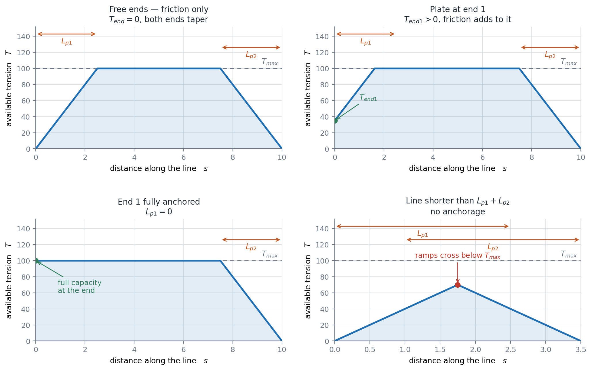
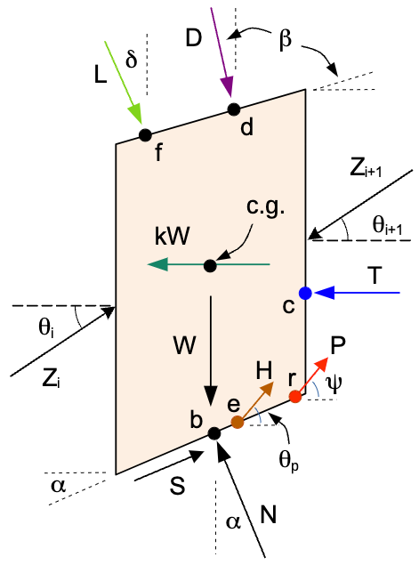
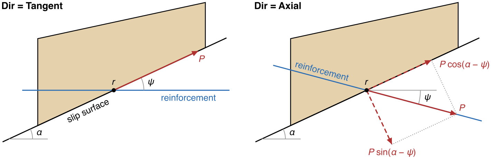

# Soil Reinforcement in LEM Slope Stability

Reinforcement supplies the tension soil cannot carry. The kinds of support and how a line is entered are on the
[Reinforcement Overview](overview.md), and what to enter for each support on [Reinforcement Types](types.md).

In a limit equilibrium analysis each reinforcement line is a straight line defined by its end points, and wherever a
trial slip surface crosses a line, a tensile force is applied to the sliding mass at the crossing point. Three
questions determine that force, and they are independent of one another:

1. **How large is the force?** — governed by the *capacity envelope*: the tensile strength of the element, the
   frictional pullout development from each end, and any end anchorage (plates, connections, anchors).
2. **In what direction does it act?** — governed by the **Dir** setting: tangent to the slip surface (flexible
   reinforcement) or along the reinforcement's own axis (rigid supports).
3. **Is it factored by the safety factor?** — governed by the **Appl** setting: active (a known allowable force,
   not divided by $F$) or passive (a nominal, unfactored capacity that mobilizes with the soil, divided by $F$).

This decomposition follows the convention used by Slide2 and other commercial programs, which allows xslope
results to be compared directly against them. The **Type** column in the input template is a *preset* over these
settings ([Support Type Presets](#support-type-presets)).

The finite element treatment, in which each reinforcement line is a row of bar elements in the mesh and carries the
tension its stretch produces, is on the [FEM reinforcement](fem.md) page. The LEM does not read $T_{res}$, the tension
a bar keeps after rupture in the FEM: it computes no strains, so no line can load past its peak. The two analyses
are compared under [LEM vs FEM](overview.md#lem-vs-fem).

## Capacity Envelope

The tension a line can carry varies along it, set by its own strength in the middle and by its anchorage toward
each end. The LEM takes the value where a trial slip surface crosses the line.

### Force magnitude at the crossing point

The tensile force available at any point along a reinforcement line is limited by three mechanisms, and the
available force is the smallest of them:

>$T(x) = \min\left(T_{max},\;\; T_{end1} + T_{max}\dfrac{d_1}{L_{p1}},\;\; T_{end2} + T_{max}\dfrac{d_2}{L_{p2}}\right)$

where:

- $T_{max}$ = tensile capacity of the element: an allowable value with Appl Active, a nominal one with Appl Passive
- $d_1$, $d_2$ = distances from the point to end 1 and end 2 of the line
- $L_{p1}$, $L_{p2}$ = pullout lengths at each end — the distance over which interface friction develops the full
  tensile capacity
- $T_{end1}$, $T_{end2}$ = anchorage capacity at each end: a bearing plate, a facing connection, or an end anchor
  (default 0)

Special cases:

- **$T_{end} = 0$, $L_p > 0$** (the classical friction-only taper): tension is zero at the free end and develops
  linearly over the pullout length. This is the correct model for geosynthetics and for the embedded end of nails.
- **$L_p = 0$**: the end is fully anchored — the full capacity is available immediately at the end.
- **$T_{end} > 0$**: the end starts at the anchorage capacity and frictional development adds to it. This models
  a nail with a bearing plate at the wall face, a geosynthetic connected to facing panels, or a bar anchored at
  both ends. (If $T_{end} \geq T_{max}$, the end is effectively fully anchored — the tendon governs.)
- **Line shorter than $L_{p1} + L_{p2}$** with no anchorage: the envelopes from the two ends intersect below
  $T_{max}$ and only partial tension is mobilized.

The envelope for each of the four end conditions. The force available where a trial surface crosses the line is
the envelope value at the crossing point, so a surface that clips a line near a free end mobilizes only a
fraction of $T_{max}$.

Typical end capacities for each support, from the FHWA manuals, are on
[Reinforcement Types](types.md).

### Pullout from the effective overburden

$L_p$ states the bond as a development length: the capacity grows at a constant rate $T_{max}/L_p$ no matter how
deep the reinforcement is buried. Interface friction does not work that way — it grows with the normal stress
pressing the soil onto the reinforcement — so the **Adhesion** and **Delta** columns state the interface strength
instead and let the resistance follow the depth of burial. Per unit length of a planar reinforcement, with soil
bearing on both faces:

>$r(s) = 2\left(a + \sigma'_v(s)\tan\delta\right)$

where $a$ is the soil–reinforcement adhesion (stress units), $\delta$ the interface friction angle (degrees), and
$\sigma'_v(s)$ the **effective** vertical stress at the point $s$ along the line: the weight of the soil column
standing above that point — every material zone it crosses at that material's unit weight, saturated below the
water table where the material declares a saturated unit weight $\gamma_{sat}$ — less the pore pressure the model declares there
(piezometric line, pore pressure ratio $r_u$, or seepage field, in the same way as for a slice base).

The envelope is then the same three-way minimum, with the ramps integrated rather than assumed linear:

>$T(s) = \min\left(T_{max},\;\; T_{end1} + \displaystyle\int_0^s r,\;\; T_{end2} + \int_s^L r\right)$

A constant $r$ recovers the straight ramps above, so the two laws are one formula. Both columns filled selects
this law and $L_{p1}$/$L_{p2}$ are then not read; both blank is the default and selects the development-length
law. Filling one column and leaving the other blank is an input error. LEM and FEM use the same envelope under
either law.

**FHWA pullout capacity.** The FHWA form $F^{*}\alpha\sigma'_v$ per unit area is this law with $a = 0$ and
$\delta = \arctan(F^{*}\alpha)$. Written out, FHWA's nominal pullout resistance of a layer is
$P_r = F^{*}\alpha\,\sigma'_v L_e C R_c$, where $F^{*}$ is the pullout resistance factor, $\alpha$ the scale-effect
correction (not the slice-base angle $\alpha$ of [Force Direction](#force-direction-dir)), $L_e$ the embedded length, $C = 2$ counts the two bearing faces of a sheet and $R_c$ is the
fraction of the wall the reinforcement covers. For a continuous geosynthetic ($R_c = 1$) that is the integral
above, term for term: the factor of two is already in $r(s)$, and the per-unit-width convention is what $R_c = 1$
means. The entries for a geosynthetic, with typical values of $F^{*}$ and $\alpha$, are under
[Geosynthetic Layer](types.md#geosynthetic-layer). In FHWA's Example E1, a 20 ft geogrid-reinforced wall, reading
the envelope where the design failure surface crosses each of the wall's eleven layers reproduces the manual's
whole pullout table ([published problems](../verification/published.md#fhwa-e1)).

**Grouted tiebacks with a bonded length.** A tieback develops pullout resistance only over its grouted bond
length; the sleeved unbonded length transfers no load to the ground. Its envelope is the development-length law,
with $L_{p1} = 0$ at the head and the ramp $L_{p2}$ at the bonded end, $T_{max}$ divided by the load transfer per
unit length. The overburden law would accumulate resistance from the head along the unbonded length. The entries
are under [Tieback](types.md#tieback-grouted-ground-anchor).

### Per-unit-width convention and spacing

All LEM forces are per unit width of slope. Geosynthetic properties are already per unit width (kN/m or lb/ft), so
for them the **Spacing** column is left blank (or 1). Discrete supports — nails, tiebacks — have per-element
capacities (kN per nail) installed at a horizontal spacing $S$; enter the per-element values and the spacing, and
xslope divides all capacity terms ($T_{max}$, $T_{res}$, $T_{end1}$, $T_{end2}$, and the FEM stiffness $EA$)
by $S$. The forces xslope reports back — the LEM line forces, the FEM axial forces, and the
reinforcement-force colorbar — are likewise per unit width; multiply by the spacing $S$ to recover the
per-element (per-nail) force for comparison against a per-element capacity.

## Force Direction (Dir)

Where a reinforcement line crosses the base of a slice at point $r = (x_r, y_r)$, a force of magnitude $T(x_r)$ is
applied to the sliding mass at that point. In the slice free-body diagram it is the force $P$, drawn at the angle
$\psi$ measured from the horizontal — the same reference the slice base inclination $\alpha$ is measured from.
(The $T$ in that diagram is the tension-crack water force, a separate quantity.)

The **Dir** setting sets $\psi$:

- **Tangent to slip surface** ($\psi = \alpha$) — the **default**. Flexible
  reinforcement cannot resist bending; as the sliding mass moves, the reinforcement deforms with it and the force
  reorients tangent to the slip surface, whatever the line's own inclination. The angle between the force and the
  base, $\alpha - \psi$, is then zero. This is the appropriate (and conservative) assumption for geotextiles and
  geogrids, and is discussed by Duncan & Wright (2005).
- **Axial** ($\psi$ = the inclination of the reinforcement line itself) — rigid supports such as soil nails,
  grouted tiebacks, and anchored bars carry their force along their own axis; the soil cannot reorient them.

The direction affects each solution method the same way a [pile force](../piles/lem.md) does: the force is resolved into components
normal and tangential to the slice base — $P\sin(\alpha - \psi)$ normal (zero for tangent) and
$P\cos(\alpha - \psi)$ tangential — and for moment-based methods it contributes a moment about the circle center
through its real moment arm at point $r$.

{width=874}

Tangent reinforcement acts with its whole magnitude along the base and has no component across it. Axial
reinforcement has a smaller component along the base, and the remainder presses the sliding mass onto the base,
where it adds frictional resistance $P\sin(\alpha - \psi)\tan\phi$. Which of the two gives the larger factor of
safety therefore depends on $\phi$ and on the angle between the line and the surface it crosses. For tangent reinforcement on a circular surface the force is tangent to
the circle and its moment arm is exactly $R$, which is why the classical formulation reduces to a bare $\sum P$ in
the OMS and Bishop denominators. The per-method equations are given on the
[OMS](../lem/oms.md), [Bishop](../lem/bishop.md), [Janbu](../lem/janbu.md), [force equilibrium](../lem/force_eq.md), [Spencer](../lem/spencer.md),
and [Morgenstern-Price](../lem/mprice.md) pages.

## Force Application (Appl)

Two conventions exist for how a support force enters the factor of safety, and published solutions use both,
so the choice is set per line:

- **Active** (Slide2's "Method A", the **default**): the force is a known, *allowable* working load. It is applied
  to the driving side of the equilibrium equations and is **not** divided by $F$ — the factor of safety applies to
  the soil strength only. Appropriate for pre-tensioned supports (tiebacks) and whenever the entered capacity
  already carries its own safety factor.
- **Passive** (Slide2's "Method B"): the force is a *nominal* (unfactored) capacity that mobilizes together with the soil
  strength. It is added to the resisting side and **is** divided by $F$. Appropriate when the support only develops
  force as the soil deforms (nails, geosynthetics in some formulations) and the entered capacity is unfactored.

The distinction matters numerically: on the classic Duncan & Wright tieback example (their Fig. 6.34), the same
9,000 lb/ft support gives FS = 1.51 active and FS = 1.32 passive.

## Support Type Presets

The **Type** column fills Dir and Appl automatically (either can be overridden by typing over the value):

| Type | Dir | Appl |
|---|---|---|
| Geosynthetic | Tangent | Active |
| Nail | Axial | Passive |
| Tieback | Axial | Active |
| Anchor | Axial | Active |

Leave Type blank for a generic tensile line with the defaults (Tangent, Active).

## References

Duncan, J.M., & Wright, S.G. (2005). *Soil Strength and Slope Stability*. John Wiley & Sons.

Rocscience Inc. *Slide2 Documentation — Support: Active/Passive Force Application; Define Support Properties.*

Wright, S.G. (1999). *UTEXAS4 — A Computer Program for Slope Stability Calculations.* Shinoak Software, Austin.
