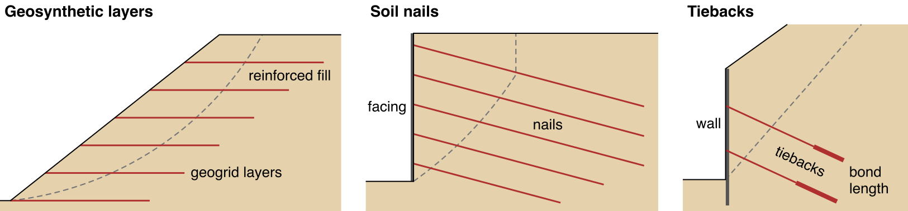
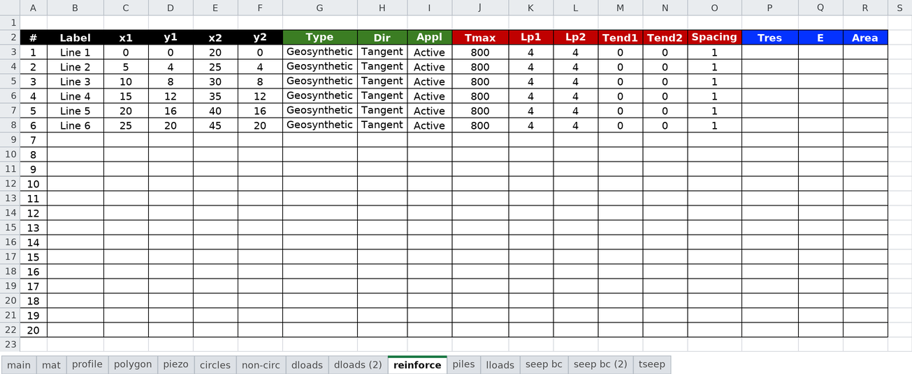
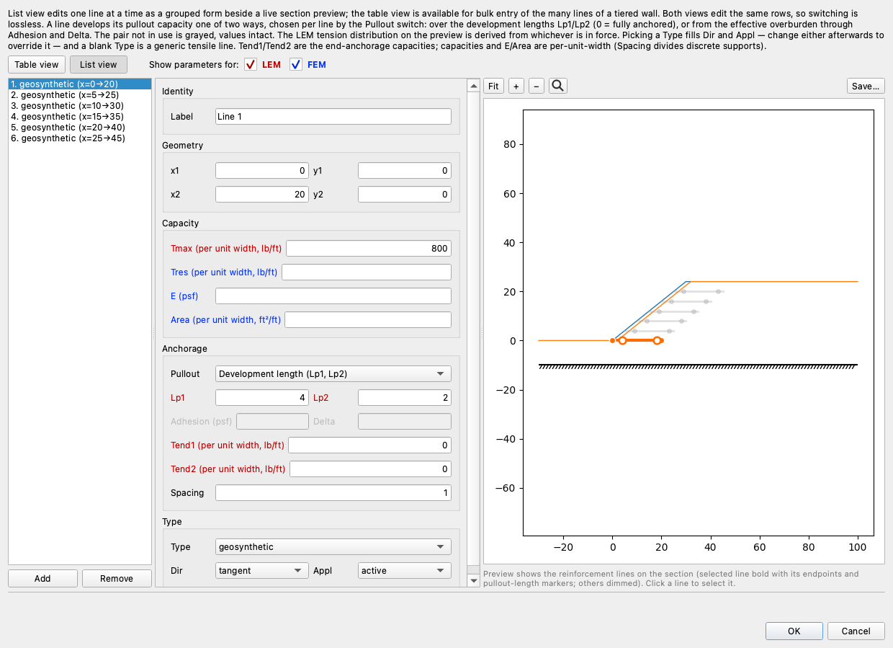
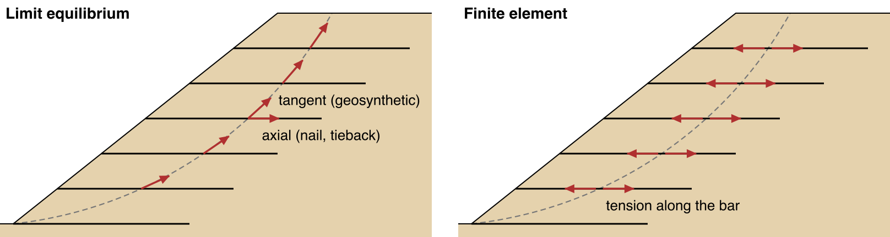

# Reinforcement

Soil can carry compression and shear but little or no tension. Reinforcement adds tensile strength. A reinforcing
member crosses the zone where a slip surface would form and extends into stable ground behind it. When the soil
above the slip surface starts to slide, the member pulls back on it. The common types are geosynthetic layers
(geotextiles and geogrids) placed in a fill as it is built, soil nails grouted into a cut as it is excavated, and
tiebacks that hold a wall and are grouted into the ground well behind the slip surface.

{width=1000}

From left to right: geosynthetic layers in a reinforced fill, soil nails in a cut, and tiebacks behind a wall.
Each crosses a slip surface.

XSLOPE models each of these as a straight line with a tensile capacity, and so it models an end-anchored bar held
by a plate or deadman at each end. The limit equilibrium (LEM) and finite element (FEM) analyses read the same line
but use it differently ([LEM vs FEM](#lem-vs-fem)). [Reinforcement Types](types.md) gives what to enter for each
type of support, with typical values from the design manuals. A micropile, pile or pier resists in shear and
bending rather than tension, so it is entered on the `piles` sheet instead
([Piles and Walls](../piles/overview.md)).

## Entering a Line

Each line is one row of the `reinforce` sheet of the
[input template](../usage/input_template.md#worksheet-reinforce):

In XSLOPE Studio, the same rows are edited in the reinforcement editor. Its list view shows one line at a time
beside a preview of the section ([Editing Inputs](../studio/editing.md#the-inputs-tree-and-the-editors)):

A line runs from end 1 at (`x1`, `y1`) to end 2 at (`x2`, `y2`). `Lp1` and `Tend1` describe the anchorage at end 1,
and `Lp2` and `Tend2` the anchorage at end 2. Either end of the line can be end 1. `Type` is a preset. Picking
`Geosynthetic`, `Nail`, `Tieback` or `Anchor` fills in the usual `Dir` and `Appl` for that support, and either can
then be changed. If `Type` is left blank, the line is a generic tensile member, with `Dir` set to Tangent and
`Appl` set to Active ([The Columns](#the-columns)).

The user picks a unit system, SI or Imperial, on the `main` sheet
([Worksheet: main](../usage/input_template.md#worksheet-main)), and enters every value in it: kN and m, or lb and
ft. A continuous sheet is entered per unit width of slope, with `Spacing` left blank. A discrete member, such as a
nail, tieback or bar, is entered per member, with its out-of-plane spacing in `Spacing`. XSLOPE divides the
member's capacities and `Area` by the spacing and reports forces per unit width
([Per-unit-width convention and spacing](lem.md#per-unit-width-convention-and-spacing)). `E`, `Adhesion` and
`Delta` are not divided by the spacing, but the pullout resistance computed from `Adhesion` and `Delta` is.

## The Columns

Each column name is colored as its header is on the sheet, to show which analysis reads it. In the Units column,
F is force and L is length. Elsewhere on this page, F is the factor of safety.

Used by: geometry (both)LEM onlyLEM and FEMFEM only

| Column | Name | Units | Meaning |
|---|---|---|---|
| B | <code class="rc rc-geom">Label</code> | — | Optional name, used in messages, plots and reports. |
| C, D | <code class="rc rc-geom">x1</code>, <code class="rc rc-geom">y1</code> | L | End 1 of the line. |
| E, F | <code class="rc rc-geom">x2</code>, <code class="rc rc-geom">y2</code> | L | End 2 of the line. |
| G | <code class="rc rc-lem">Type</code> | — | Support type. Picking one fills in `Dir` and `Appl` ([Support Type Presets](lem.md#support-type-presets)). |
| H | <code class="rc rc-lem">Dir</code> | — | Direction of the force where a slip surface crosses the line: Tangent to the slip surface, or Axial along the line ([Force Direction](lem.md#force-direction-dir)). |
| I | <code class="rc rc-lem">Appl</code> | — | Active: the capacities are allowable values and are not divided by the factor of safety. Passive: the capacities are nominal values and are divided by the factor of safety ([Force Application](lem.md#force-application-appl)). |
| J | <code class="rc rc-both">Tmax</code> | F per member, or F/L | Tensile capacity of the member. |
| K, L | <code class="rc rc-both">Lp1</code>, <code class="rc rc-both">Lp2</code> | L | Length from end 1, and from end 2, over which friction or bond builds up to `Tmax`. If 0, the full `Tmax` is available at that end. |
| M, N | <code class="rc rc-both">Adhesion</code>, <code class="rc rc-both">Delta</code> | F/L², degrees | Adhesion and friction angle of the interface between the member and the soil. Enter both to use them in place of `Lp1` and `Lp2`; entering only one is an input error ([Pullout from the effective overburden](lem.md#pullout-from-the-effective-overburden)). |
| O, P | <code class="rc rc-both">Tend1</code>, <code class="rc rc-both">Tend2</code> | F per member, or F/L | Capacity of a plate, connection or anchorage at end 1 and at end 2. Enter 0 if there is none. |
| Q | <code class="rc rc-both">Spacing</code> | L | Out-of-plane spacing of discrete members. Leave blank for a continuous sheet. |
| R | <code class="rc rc-fem">Tres</code> | F per member, or F/L | Tension the bar keeps after it ruptures. If left blank, the bar does not rupture and holds its capacity. Enter 0 for a brittle break, or a value between 0 and `Tmax` for a bar that keeps that much tension ([Force Behavior and Failure Modes](fem.md#force-behavior-and-failure-modes)). |
| S | <code class="rc rc-fem">E</code> | F/L² | Elastic modulus of the member. |
| T | <code class="rc rc-fem">Area</code> | L² per member, or L²/L | Cross-sectional area. `E` × `Area` is the axial stiffness ([Axial Stiffness (EA)](fem.md#axial-stiffness-ea)). |
| U | <code class="rc rc-fem">Joint</code> | `Yes` or blank | `Yes` makes the line a jointed line: the soil can slip along it, with `Adhesion` and `Delta` as the interface strength ([Two Ways to Represent a Sheet](fem.md#two-ways-to-represent-a-sheet)). |
| V, W | <code class="rc rc-fem">kn</code>, <code class="rc rc-fem">ks</code> | F/L³ | Normal and shear stiffness of a jointed line's interfaces. If left blank, they are derived from the adjacent soil ([Stiffness](../fem/joints.md#stiffness)). |
| X | <code class="rc rc-fem">Jred</code> | `Yes`, `No` or blank | `Yes`, or left blank: the strength reduction reduces a jointed line's interface strength along with the soil's. `No`: the interface keeps its full strength. |

## Capacity Along a Line

The tension a line can carry varies along its length. Away from the ends, it is the member's own `Tmax`. Near each
end, it is limited by what that end can develop: the plate or connection capacity (`Tend1` or `Tend2`) plus the
friction or bond along the line from that end. The friction or bond rises linearly from zero at the end to `Tmax` at
a distance of `Lp1` or `Lp2`. At each point, the capacity is the smallest of three values: `Tmax`, what end 1 can
develop, and what end 2 can develop. This is the line's capacity envelope, and both analyses use it
([Capacity Envelope](lem.md#capacity-envelope)).

`Adhesion` and `Delta` are an alternative to `Lp1` and `Lp2`. Instead of a fixed development length, they give the
strength of the interface between the member and the soil. The pullout resistance then depends on the effective
overburden along the line. Per unit length, it is $2(a + \sigma'_v\tan\delta)$, counting both faces of a sheet,
where $a$ is the adhesion, $\delta$ the friction angle and $\sigma'_v$ the vertical effective stress at each
point.

## LEM vs FEM

The LEM finds where a trial slip surface crosses the line and applies the envelope's value there as a force on
the sliding mass. `Dir` sets its direction: tangent to the slip surface, or along the line. The FEM builds the line
into the mesh as a chain of bar elements. The force in each bar is a result, not an input: the bar carries the
tension produced by its stretch, up to the envelope, and that tension acts along the bar. `Dir` and `Appl` have no
effect in the FEM. The figure compares the two on the [FEM-2](../tutorials/fem02_reinforcement.md) slope and its
critical circle:

{width=1000}

On the left, the LEM force at each crossing acts tangent to the circle; the axial alternative is drawn at the
middle layer. On the right, each FEM bar carries tension along its own length, set by how much it stretches.

`Appl` decides whether the LEM divides the line's capacities by the factor of safety F. With `Appl` set to Active,
the LEM does not divide them by F. Enter every capacity (`Tmax`, the pullout resistance, `Tend1` and `Tend2`) as an
allowable value: the nominal capacity divided by its own factor of safety. With `Appl` set to Passive, enter every
capacity as a nominal value. The LEM then divides all of them by F, as it does the soil's strength. If a design
applies a different factor to each part, such as a [soil nail](types.md#soil-nail) design with one factor on the
bar and another on pullout, enter allowable values and set `Appl` to Active.

The FEM's strength reduction reduces only the soil's strength. The bars start with zero force in the finished
geometry; there is no construction sequence. A bonded line shares the soil's nodes along its whole length. Its
capacities act as entered, as in the LEM with `Appl` set to Active. So with `Appl` set to Passive, the LEM divides
the capacities by F but the FEM does not. A jointed line, one with `Joint` set to `Yes`, is separated from the soil
by an interface. The strength reduction reduces the interface strength along with the soil's, unless `Jred` is
`No`. The line's `Tmax`, `Tend1` and `Tend2` act as entered.

The formulations are on [Soil Reinforcement in LEM](lem.md) and
[Soil Reinforcement in Finite Element Analysis](fem.md).

## Worked Examples

[Tutorial LEM-8](../tutorials/lem08_reinforced_slope.md) reinforces a slope with six geogrid layers, and
[Tutorial FEM-2](../tutorials/fem02_reinforcement.md) runs the same slope by finite elements and compares the two.
[Tutorial LEM-9](../tutorials/lem09_tieback_wall.md) builds a soldier-pile wall held by tiebacks, and
[Tutorial FEM-3](../tutorials/fem03_block_wall_joints.md) ties geogrid layers into a block wall built on slip
joints and shows when a sheet is better modeled as a jointed line than as a bonded one.
