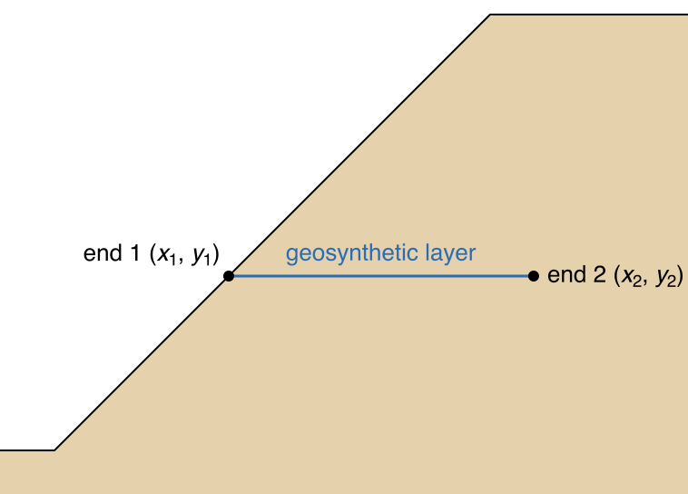
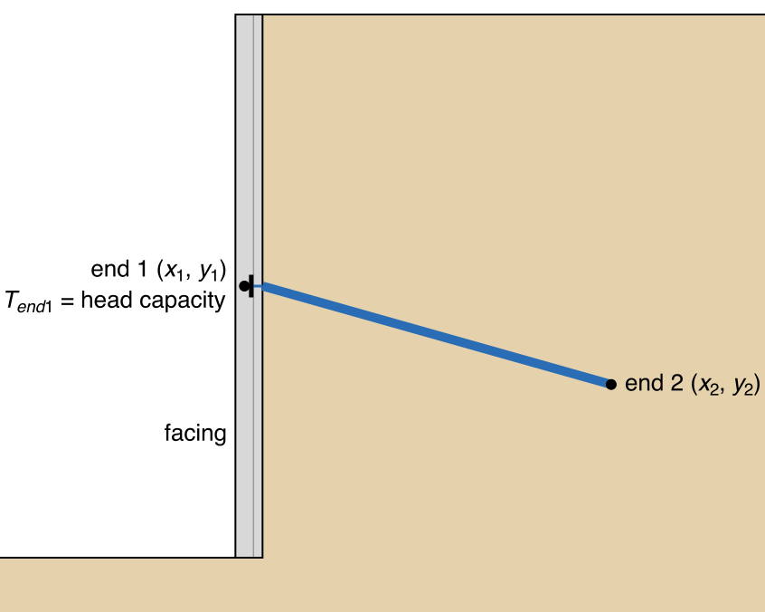
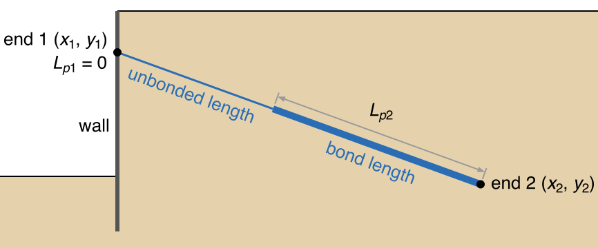
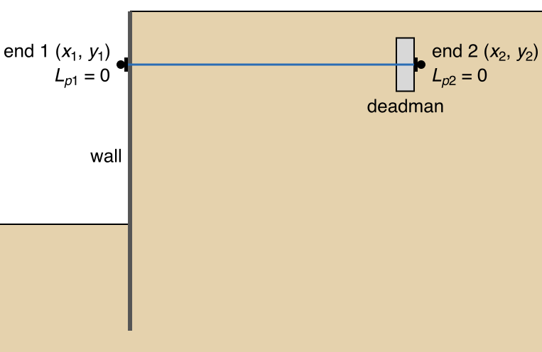
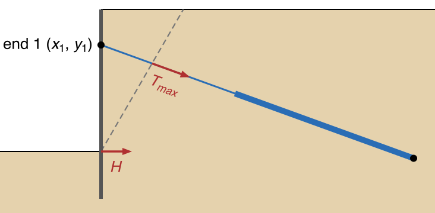
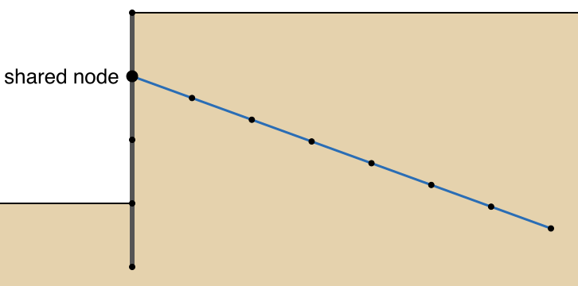
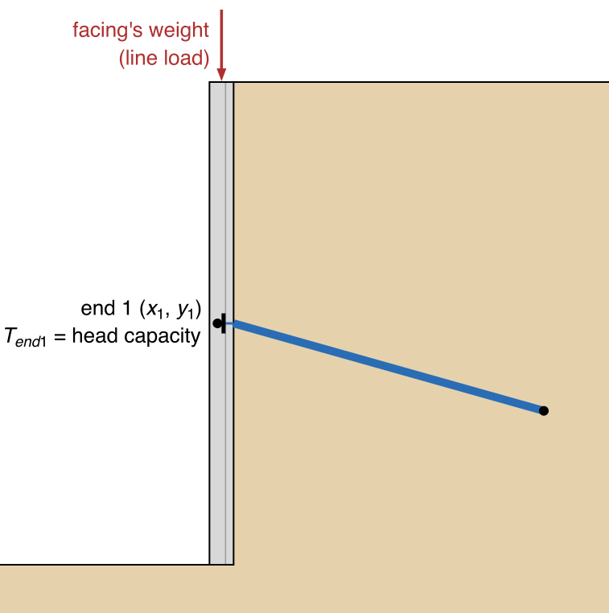
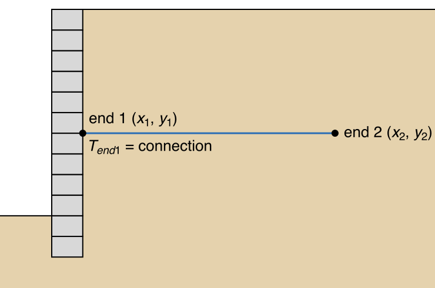
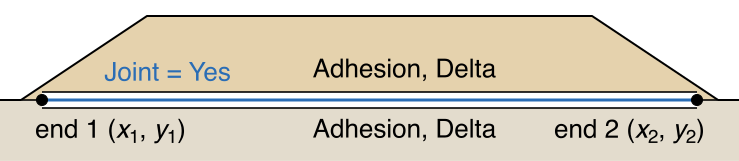
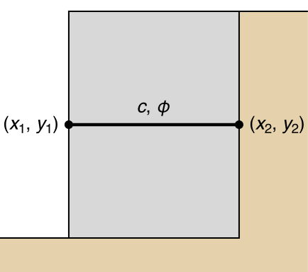

# Reinforcement Types

A geosynthetic layer, a soil nail, a tieback and an end-anchored bar each enter the model as one line on the
`reinforce` sheet, with the columns described on the [Reinforcement Overview](overview.md#the-columns), but each
fills those columns its own way, and most connect to a wall or a facing. A sheet the soil can slide along is
entered as a joint. End 1 is at the face or wall wherever a support has one, and F is the factor of safety.

Typical values come from three Federal Highway Administration (FHWA) manuals, Geotechnical Engineering Circulars 4
(ground anchors), 7 (soil nail walls) and 11 (mechanically stabilized earth walls and reinforced soil slopes),
cited as GEC 4, GEC 7 and GEC 11 ([References](#references)). Where a manual gives a value in one unit system only,
the value in parentheses is converted from it.

## Geosynthetic Layer

A geotextile or geogrid is a sheet laid flat on a lift of fill as a slope or wall is built. It carries tension
where a slip surface cuts it, and develops that tension by friction on both faces of the length buried beyond the
surface. The figure shows one layer in a reinforced slope.

{width=466}

End 1 is on the face of the slope and end 2 at the buried end, so the line is as long as the layer.

The capacity is `Tend1` at the face (zero where the layer ends free) and zero at the buried end; it grows with
the friction on both faces of the layer and is capped at `Tmax`.

`Tmax` is worked out from the sheet's long-term strength Tal. That is its ultimate tensile strength
Tult, from the manufacturer's tensile tests, divided by a reduction factor RF for the strength the sheet
loses over its design life:

>$T_{al} = \dfrac{T_{ult}}{RF}, \qquad RF = RF_{ID} \times RF_{CR} \times RF_{D}$

where RFID allows for damage during installation, RFCR for creep under sustained load and
RFD for chemical and biological degradation (GEC 11 p. 9-5). With Appl Passive the LEM divides the
reinforcement force by the factor of safety, so `Tmax` = Tal. With Appl Active it does not, so `Tmax` =
Tal ÷ FSR, where FSR is the factor of safety the slope is designed for
(GEC 11 pp. 8-7 and 8-8).

Used by: LEM onlyLEM and FEMFEM only

| Column | Entry | Typical values |
|---|---|---|
| <code class="rc rc-lem">Type</code> | `Geosynthetic` | — |
| <code class="rc rc-lem">Dir</code> | `Tangent`, set automatically by `Type`: the force acts tangent to the slip surface where it crosses the layer | — |
| <code class="rc rc-lem">Appl</code> | `Active`, set automatically by `Type`: the `Tmax`, pullout (`Adhesion` and `Delta`, or `Lp1` and `Lp2`) and `Tend1` entries in the rows below are allowable values, which the LEM does not divide by F. To use nominal values in those rows instead, change it to `Passive`. | — |
| <code class="rc rc-both">Tmax</code> | Appl Active: Tal (see above) ÷ FSR. Appl Passive: Tal. | FSR at least 1.3 (GEC 11 p. 9-24). RF = 7 for preliminary design in granular fill (p. 9-5); 2.6 to 2.8 for the geogrids of FHWA Example E1 (Table E1-7.3, p. E1-15). |
| <code class="rc rc-both">Adhesion</code>, <code class="rc rc-both">Delta</code> | `Adhesion` = 0. Appl Active: `Delta` = arctan(F\*α ÷ FSPO), with FSPO the factor of safety against pullout (GEC 11 Eq. 9-9, p. 9-13). Appl Passive: `Delta` = arctan(F\*α). F\* is the pullout resistance factor and α the scale-effect correction. | F\* = 0.67 tan φ with α = 0.6, the most conservative defaults (GEC 11 p. E8-6); α = 0.6 to 0.8 for extensible reinforcement without pullout tests (p. B-2); F\* = 0.45 and α = 0.8 for the geogrids of Example E1 (p. E1-16); FSPO = 1.5 in granular soil and 2 in cohesive soil, and minimum embedment beyond the critical surface 3 ft (1 m) (p. 9-5) |
| <code class="rc rc-both">Lp1</code>, <code class="rc rc-both">Lp2</code> | in place of `Adhesion` and `Delta`: `Tmax` ÷ the pullout resistance per unit length at each end; with Appl Active, the allowable pullout resistance (÷ FSPO) | — |
| <code class="rc rc-both">Tend1</code> | Appl Active: the long-term connection strength Talc divided by the factor of safety the design applies to the connection. Appl Passive: Talc. 0 where the layer ends free at the face. | see [A geosynthetic and facing blocks, panels or a wrapped face](#a-geosynthetic-and-facing-blocks-panels-or-a-wrapped-face) |
| <code class="rc rc-both">Tend2</code> | 0 | — |
| <code class="rc rc-both">Spacing</code> | blank | — |
| <code class="rc rc-fem">E</code>, <code class="rc rc-fem">Area</code> | `E` × `Area` = the sheet's tensile stiffness per unit width ([Axial Stiffness (EA)](../fem/reinforcement.md#axial-stiffness-ea)) | — |
| <code class="rc rc-fem">Tres</code> | blank | — |
| <code class="rc rc-fem">Joint</code> | blank; `Yes` where the soil can slide along the sheet ([A sheet the soil slides along](#a-sheet-the-soil-slides-along)) | — |

The `Geosynthetic` preset's tangent direction is the one FHWA gives for continuous sheets (GEC 11 p. 8-6).

[Tutorial LEM-8](../tutorials/lem08_reinforced_slope.md) builds a slope reinforced with six geogrid layers for
limit equilibrium, and [Tutorial FEM-2](../tutorials/fem02_reinforcement.md) runs it by finite elements with
`E` = 800,000 psf and `Area` = 0.1 ft² (`EA` = 80,000 lb/ft), then with `Adhesion` = 0 and `Delta` = 22°.
[FHWA Example E1](../verification/published.md#fhwa-e1) enters a geogrid wall's pullout through `Adhesion` and
`Delta`.

## Soil Nail

A soil nail is a steel bar grouted into a hole drilled into a cut as the cut is excavated from the top down, with a
plate at the head bearing on a shotcrete facing. It carries tension where a slip surface crosses it, developed by
bond between the grout and the soil along its length and, at the head, by the facing. Nails are installed 10 to 20
degrees below horizontal, most commonly 15 (GEC 7, p. 150). The figure shows one nail through the facing of a
vertical cut.

{width=521}

End 1 is the nail head on the facing, where `Tend1` is the head capacity, and the line runs along the nail's
inclination to its tip, end 2.

At end 1 the capacity starts at the head's `Tend1` and at end 2 at zero, and bond adds to each over `Lp1` and
`Lp2` until the bar's `Tmax` caps it.

Used by: LEM onlyLEM and FEMFEM only

| Column | Entry | Typical values |
|---|---|---|
| <code class="rc rc-lem">Type</code> | `Nail` | — |
| <code class="rc rc-lem">Dir</code> | `Axial`, set automatically by `Type`: the force acts along the nail | — |
| <code class="rc rc-lem">Appl</code> | `Passive`, set automatically by `Type`: the `Tmax`, `Lp1`, `Lp2` and `Tend1` entries in the rows below are nominal values, which the LEM divides by F. To use GEC 7's allowable values in those rows instead, change it to `Active`. | — |
| <code class="rc rc-both">Tmax</code> | nominal tensile resistance of the bar per nail, `At` × `fy`, the bar's cross-sectional area times its yield strength (GEC 7 Eq. 6.5, p. 163); with Appl Active, `At` × `fy` ÷ FST, the factor of safety on bar tension | solid threaded bars #6 to #14: area 0.44 to 2.25 in² (284 to 1,452 mm²); yield load 26 to 135 kip (116 to 601 kN) in Grade 60 and 33 to 168 kip (147 to 747 kN) in Grade 75 (GEC 7 Tables A.1a and A.1b, p. 286); FST = 1.8 for Grades 60 and 75 (Table 5.1, p. 108) |
| <code class="rc rc-both">Lp1</code>, <code class="rc rc-both">Lp2</code> | `Tmax` ÷ `rPO` at both ends, with `rPO` = π × `qu` × `DDH` the nominal pullout resistance per unit length, from the bond strength `qu` and the drill-hole diameter `DDH` (GEC 7 Eq. 6.1, p. 161); with Appl Active, `Tmax` ÷ (`rPO` ÷ FSPO) | `rPO` = 2 to 20 kip/ft (30 to 290 kN/m) for small-diameter gravity-grouted holes, by soil type and density (GEC 7 Table 4.6, p. 86; GEC 4 Table 6, p. 71); `qu` = 3 to 70 psi (21 to 483 kPa) in soil, by soil type and drilling method (GEC 7 Tables 4.4a and 4.4b, pp. 84–85); FSPO = 2.0 (Table 5.1, p. 108) |
| <code class="rc rc-both">Adhesion</code>, <code class="rc rc-both">Delta</code> | blank: GEC 7 states bond as a constant `qu` along the nail, so the development length applies; the `Adhesion` and `Delta` law is written for a sheet with soil on both faces | — |
| <code class="rc rc-both">Tend1</code> | nail-head capacity: the smallest of the facing's resistances in flexure, in punching shear and in headed-stud tension (GEC 7 pp. 104–105); with Appl Active, each resistance divided by its own factor before the smallest is taken | nominal resistances: flexure 12 to 143 kip (53 to 636 kN) for the initial facing; punching shear 32 to 111 kip (142 to 494 kN) initial and 21 to 55 kip (93 to 245 kN) final; headed studs 28 to 146 kip (125 to 649 kN) (GEC 7 Tables 6.6 to 6.8, pp. 171–178); flexure and stud values for Grade 60 steel, × 1.24 for Grade 75; factors of safety 1.5 for flexure and punching shear, 2.0 for A307 and 1.7 for A325 headed studs (Table 5.1, p. 108) |
| <code class="rc rc-both">Tend2</code> | 0 | — |
| <code class="rc rc-both">Spacing</code> | horizontal nail spacing | 4 to 6 ft (1.22 to 1.83 m), routinely 5 ft (1.52 m) (GEC 7 p. 148) |
| <code class="rc rc-fem">E</code> | modulus of the steel bar | 29,000 ksi (GEC 7 p. 250): 4.176 × 10⁹ psf, or about 2.0 × 10⁸ kPa (200 GPa) |
| <code class="rc rc-fem">Area</code> | bar area per nail | as for `Tmax` |
| <code class="rc rc-fem">Tres</code>, <code class="rc rc-fem">Joint</code> | blank | — |

In GEC 7's allowable stress design, which programs such as SNAILZ follow with an allowable bond stress (p. 117), the
factor of safety on the soil is at least 1.5 (Table 5.1, p. 108). How the head connects to the facing in each
analysis is under [A soil nail and a shotcrete facing](#a-soil-nail-and-a-shotcrete-facing).

[VP47](../verification/rocscience.md#vp47) enters this envelope: `Tmax` = 118 kN per nail, `Tend1` = 86 kN,
`Lp1` = `Lp2` = 118 ÷ 15 = 7.87 m from a bond of 15 kN per meter, and `Spacing` = 1.5 m. The 4.9 m nails are
shorter than `Lp1` and `Lp2`, so pullout governs along their whole length.
[VP48](../verification/rocscience.md#vp48) enters each nail as a constant 15 kN tension, with `Lp1` = `Lp2` = 0
and `Spacing` = 1.15 m, the simplification its source analysis makes, so its envelope is flat.

## Tieback (Grouted Ground Anchor)

A tieback, or grouted ground anchor, is a prestressed bar or strand tendon in a grouted hole. Its anchorage (the
anchor head and bearing plate) bears on the wall. Over the unbonded length the tendon is sleeved so that it does
not bond to the grout, and carries the force between the anchorage and the bond length, which transfers it to the
ground behind the critical slip surface (GEC 4, pp. 4–5). The figure shows one tieback anchored on a wall.

{width=533}

End 1 is the anchor head on the wall, with `Lp1` = 0, and the tendon runs through the unbonded length into the
bond length, which `Lp2` spans to end 2.

With `Lp1` = 0 the full `Tmax` is available from the anchor head to within `Lp2` of end 2, and over that last
`Lp2` the capacity falls linearly to zero, as in GEC 4's limit equilibrium treatment of an anchor (p. 100). Where
the bond governs, as in the figure, `Lp2` is the bond length.

Used by: LEM onlyLEM and FEMFEM only

| Column | Entry | Typical values |
|---|---|---|
| <code class="rc rc-lem">Type</code> | `Tieback` | — |
| <code class="rc rc-lem">Dir</code> | `Axial`, set automatically by `Type`: the force acts along the tendon | — |
| <code class="rc rc-lem">Appl</code> | `Active`, set automatically by `Type`: the `Tmax` and `Lp2` entries in the rows below are allowable values, which the LEM does not divide by F | — |
| <code class="rc rc-both">Tmax</code> | allowable anchor load per anchor: the smallest of the tendon's design load, the allowable capacity of the head's connection to the wall, and the bond length times the allowable load transfer per unit length | design load at most 0.6 × the tendon's specified minimum tensile strength (GEC 4 p. 77); design loads of 260 to 1,160 kN (58.5 to 260.8 kip) are typical (p. 70) |
| <code class="rc rc-both">Lp1</code> | 0: the head holds the full `Tmax`, and the sleeved unbonded length adds no friction | — |
| <code class="rc rc-both">Lp2</code> | `Tmax` ÷ the allowable load transfer per unit length, which is the ultimate load transfer ÷ 2.0 in soil or ÷ 3.0 in rock (GEC 4 pp. 71, 74): the bond length where the bond governs, shorter where the tendon or the head governs. A 580 kN anchor in medium dense sand (145 kN/m ultimate, 72.5 kN/m allowable) has `Lp2` = 580 ÷ 72.5 = 8.0 m. | ultimate load transfer of small-diameter gravity-grouted anchors: 30 to 290 kN/m (2 to 20 kip/ft) in soil (GEC 4 Table 6, p. 71; GEC 7 Table 4.6, p. 86) and 150 to 730 kN/m (10.3 to 50.0 kip/ft) in rock (GEC 4 Table 8, p. 74); bond lengths 4.5 to 12 m (14.8 to 39.4 ft) in soil and 3 to 10 m (9.8 to 32.8 ft) in rock (pp. 71, 74) |
| <code class="rc rc-both">Tend1</code>, <code class="rc rc-both">Tend2</code>, <code class="rc rc-both">Adhesion</code>, <code class="rc rc-both">Delta</code> | blank: with `Lp1` = 0 the program does not read `Tend1`; for `Adhesion` and `Delta`, see grouted tiebacks under [Pullout from the effective overburden](../lem/reinforcement.md#pullout-from-the-effective-overburden) | — |
| <code class="rc rc-both">Spacing</code> | horizontal anchor spacing | on a soldier-beam wall the anchors connect to the soldier beams, directly or through wales (GEC 4 pp. 13–14); soldier beams are typically 1.5 to 3 m (4.9 to 9.8 ft) apart when driven and up to 3 m apart when drilled in (p. 76) |
| <code class="rc rc-fem">E</code> | modulus of the tendon steel | 29,000 ksi for a bar tendon (GEC 7 p. 250); for strand, the manufacturer's value, which the Post-Tensioning Institute (PTI) allows to be reduced 3 to 5 percent for a long multistrand tendon when checking apparent free length (GEC 4 p. 151) |
| <code class="rc rc-fem">Area</code> | tendon area per anchor | Grade 150 bars 26 to 64 mm (1 to 2½ in.): 548 to 3,348 mm² (0.85 to 5.19 in²), ultimate strength 568 to 3,461 kN (127.5 to 778.0 kip) (GEC 4 Table 9, p. 77); 15-mm strand: 140 mm² (0.217 in²) and 260.7 kN (58.6 kip) per strand (GEC 4 Table 10, p. 78) |
| <code class="rc rc-fem">Tres</code>, <code class="rc rc-fem">Joint</code> | blank | — |

The unbonded length is at least 3 m (9.8 ft) for a bar tendon and 4.5 m (14.8 ft) for strand (GEC 4 p. 70), and
the bond length starts at least one fifth of the wall height or 1.5 m (4.9 ft) behind the critical slip surface
(p. 65). The critical surface the search reports should therefore cross each tieback on its unbonded length, at
least that distance in front of the bond length.

Neither analysis applies a lock-off load, which designers set at 75 to 100 percent of the design load (GEC 4
p. 154): the LEM applies the envelope value where a trial surface crosses the tendon, and nothing to a surface
beyond end 2, and the FEM bar starts at zero force. In the FEM the unbonded length grips the soil as the bond
length does. In a real anchor, that load transfer is what an apparent free length below GEC 4's minimum may
indicate in a load test, the apparent free length being the tendon length computed from the elastic movement at
the test load (pp. 150–151). How the tendon reaches the wall is under
[A tieback and a soldier-pile or sheet-pile wall](#a-tieback-and-a-soldier-pile-or-sheet-pile-wall).

[Tutorial LEM-9](../tutorials/lem09_tieback_wall.md) builds a soldier-pile tieback wall, the model of
[VP49](../verification/rocscience.md#vp49), with this envelope. It enters capacities per foot of wall (the
per-anchor value ÷ the 8 ft spacing, with `Spacing` = 1), which gives the same force as the per-anchor `Tmax`
with `Spacing` = 8. It enters no separate unbonded length: the bar governs, and `Lp2` is the length of grout that
develops the bar's capacity, 8.87 ft and 12.1 ft. [VP58](../verification/rocscience.md#vp58) has tiebacks 88 ft
long at 20° with a 40 ft bond length that governs at 40,000 lb per foot of wall, so `Lp2` = 40 ft and the 48 ft
in front of the bond length carry the full `Tmax`. Both files enter `Type` = `Anchor`, whose presets are those of
`Tieback`, and neither carries `E` or `Area`, so both run in the LEM only.

## End-Anchored Bar

An end-anchored bar is a steel bar or tie rod held by a plate or a deadman at each end. It carries tension along
its axis when the ground at its two ends moves apart, and is held by its two anchorages, with little or no bond
along the shaft. The figure shows one bar running from a wall to a deadman.

{width=470}

End 1 is at the wall and end 2 at the deadman, with `Lp1` = 0 and `Lp2` = 0.

The bar then delivers `Tmax` wherever a slip surface crosses it between its anchorages.

Used by: LEM onlyLEM and FEMFEM only

| Column | Entry | Typical values |
|---|---|---|
| <code class="rc rc-lem">Type</code> | `Anchor` | — |
| <code class="rc rc-lem">Dir</code> | `Axial`, set automatically by `Type`: the force acts along the bar | — |
| <code class="rc rc-lem">Appl</code> | `Active`, set automatically by `Type`: the `Tmax` entry below is an allowable value, which the LEM does not divide by F | — |
| <code class="rc rc-both">Tmax</code> | the smallest of the bar's allowable tension and the allowable capacities of its two anchorages | bar sizes and strengths as for a nail or a tieback bar (GEC 7 Tables A.1a and A.1b, p. 286; GEC 4 Table 9, p. 77). The tabulated strengths are nominal; divide by the factor of safety the design uses for the bar (GEC 7 uses 1.8 for Grade 60 and 75 nail bars, Table 5.1, p. 108). |
| <code class="rc rc-both">Lp1</code>, <code class="rc rc-both">Lp2</code> | 0 | — |
| <code class="rc rc-both">Tend1</code>, <code class="rc rc-both">Tend2</code>, <code class="rc rc-both">Adhesion</code>, <code class="rc rc-both">Delta</code> | blank | — |
| <code class="rc rc-both">Spacing</code> | out-of-plane (horizontal) spacing of the bars | — |
| <code class="rc rc-fem">E</code>, <code class="rc rc-fem">Area</code> | steel modulus; bar area per bar | `E` = 29,000 ksi (GEC 7 p. 250) |
| <code class="rc rc-fem">Tres</code>, <code class="rc rc-fem">Joint</code> | blank | — |

With both development lengths 0 the envelope does not read `Tend1` or `Tend2`: the shaft develops no friction
between its anchorages, and their capacities enter through `Tmax`. A bar whose shaft also grips the soil is
entered with the allowable anchorage capacities in `Tend1` and `Tend2` and the development lengths of the
allowable friction in `Lp1` and `Lp2` ([Capacity Envelope](../lem/reinforcement.md#capacity-envelope)). In the
FEM the shaft grips the soil along its whole length, and no plate or deadman is built into the mesh.

No tutorial or verification model has an end-anchored bar.

## Connecting Reinforcement to a Wall or Facing

A support that bears on a wall or a facing is connected at end 1. The two analyses treat the connection
differently: the LEM applies each member's force on its own, and the FEM connects a bar to another member only at
a node the two share or, for a jointed sheet, through a tie at its end.

### A tieback and a soldier-pile or sheet-pile wall

The wall is entered on the `piles` sheet ([Piles and Concrete Piers in LEM](../lem/piles.md)) and each tieback on
the `reinforce` sheet, with end 1 on the wall face. The wall's resistance is its shear force `H`, which GEC 4
takes as the smaller of the wall's allowable shear capacity and the passive force the soil develops below the
surface, divided by the soldier beam spacing (GEC 4 p. 101). The `piles` sheet has its own `Appl`, read as on the
`reinforce` sheet; [Tutorial LEM-9](../tutorials/lem09_tieback_wall.md) enters its stated `H` with Appl Active. The
figure shows one tieback through a soldier-pile wall, with a trial surface that crosses both.

{width=450}

The trial surface starts at the corner of the excavation, where it passes through the pile line and the wall's
`H` acts, and crosses the tieback on its unbonded length, where `Tmax` acts along the tendon.

A trial surface that passes below the toe of the wall receives no force from the wall.

In the FEM the wall is a row of beam elements
([Piles and Concrete Piers in Finite Element Analysis](../fem/piles.md)) and a tieback is a row of bar elements.
A bar that ends on a pile line, or crosses it, shares a node with the pile at that point, so the tieback pulls on
the wall at that node. The figure shows one tieback whose end 1 lies on the pile line below the pile's head.

{width=447}

End 1 of the tieback is a node of the pile, and the bar's other nodes run back into the soil.

A bar that crosses a pile line, rather than ending on it, draws a note in the
[model checks](../studio/analysis.md#model-checks-before-a-run) that the two are joined at the crossing; a bar
meant to pass the pile unconnected ends short of it. A tieback entered as in
[Tutorial LEM-9](../tutorials/lem09_tieback_wall.md), starting on the wall face at x = 0 with the pile line 0.5 ft
behind it, crosses the pile line and is joined to it there in the FEM; in the LEM the offset has no effect.

### A soil nail and a shotcrete facing

A nail's head plate bears on the shotcrete facing at end 1. The LEM takes the facing into account in two ways:
the head's capacity, in `Tend1`, and the facing's weight, entered as a vertical line load at the top of the face
([Worksheet: lloads](../usage/input_template.md#worksheet-lloads)). On a vertical face the facing's weight acts along the
face, so one vertical force at the top of the face gives the same force and moment as the weight spread down it,
provided the slip surface exits at the toe; on a battered face it is approximate. The figure shows one nail head
on a shotcrete facing.

{width=466}

End 1 is the nail head on the facing, where `Tend1` sets the capacity, and the facing's weight is a line load at
the top of the face.

[VP47](../verification/rocscience.md#vp47) and [VP48](../verification/rocscience.md#vp48) enter their facings
this way, with line loads of 14.6 kN/m and 13.2 kN/m. The FEM has no facing member: a beam cannot be laid along
the face, because the mesher rejects a line that runs along the ground surface
([Reinforcement and pile lines](../fem/mesh.md#reinforcement-and-pile-lines)), so each nail head is a soil node on
the face and `Tend1` only raises the capacity of the bar at that end.

### A geosynthetic and facing blocks, panels or a wrapped face

A layer connected to facing blocks or panels starts at the back of the facing, end 1. The figure shows one layer
connected to a block facing.

{width=455}

End 1 is on the back of the block facing, where `Tend1` is the connection, and end 2 is in the fill.

FHWA takes the long-term connection strength Talc from connection tests on the facing unit and the geosynthetic
(GEC 11 Eq. 4-41, p. B-13), and it rises with the normal pressure on the connection: in Example E1 it runs
from 533 lb/ft (7.8 kN/m) at the top layer to 2,550 lb/ft (37.2 kN/m) at the bottom, against Tal = 1,085 and
2,169 lb/ft (15.8 and 31.7 kN/m) for the two grades the wall uses, GG-I and GG-II (Table E1-7.3, p. E1-15;
connection strengths Table E1-7.6, p. E1-18), so on eight of the wall's eleven layers the connection limits the
force at the face.

In the LEM, and in the FEM for a bonded layer, `Tend1` only raises the capacity at end 1
([Capacity Envelope](../lem/reinforcement.md#capacity-envelope)); a jointed layer's `Tend1` ties its end to the
facing at end 1, up to that capacity ([Ends, ties and the bar](../fem/reinforcement.md#ends-ties-and-the-bar)).
In the block wall of [Tutorial FEM-3](../tutorials/fem03_block_wall_joints.md#part-2-the-same-wall-with-geogrid)
the back face of the facing is a `joints`-sheet line, and a bonded line may not end on one, so all three layers
are jointed, each tied to the blocks at `Tend1` = 40 kN/m. A wrapped face has no facing unit: the sheet is folded
back over the face and buried under the next lift
([When a Model Needs a Joint](../fem/joints.md#when-a-model-needs-a-joint)). Its line starts at the face, and
`Tend1` is the pullout resistance of that folded-back return.

## Jointed Reinforcement and Joint Lines

`Joint` = `Yes` makes a reinforcement line a slip surface, and `kn`, `ks` and `Jred` set its interfaces; the
`joints` sheet holds slip surfaces with no reinforcement in them. The LEM reads neither: it treats a jointed line
as an ordinary reinforcement line, from `Tmax`, `Tend1`, `Tend2` and either `Lp1` and `Lp2` or `Adhesion` and
`Delta`, and it ignores the `joints` sheet.

### A sheet the soil slides along

Where a slip surface can run along a sheet (a base geotextile under an embankment on soft clay, a smooth
geomembrane liner, the sheets of a wrapped or block-faced wall), `Joint` = `Yes` splits the mesh along the line
and the soil on each side slides on the sheet at the interface strength
([Choosing a Bonded Bar or a Joint](../fem/reinforcement.md#bonded-bar-or-joint)). The figure shows one base sheet
under an embankment.

{width=455}

The sheet runs along the base of the embankment from end 1 to end 2 with `Joint` = `Yes`, and `Adhesion` and
`Delta` set both of its interfaces, against the embankment above and the foundation below.

The sheet's `Tmax`, `E`, `Area` and `Tres` are entered as for a [geosynthetic layer](#geosynthetic-layer); a jointed
sheet differs in these columns:

Used by: LEM onlyLEM and FEMFEM only

| Column | Entry |
|---|---|
| <code class="rc rc-fem">Joint</code> | `Yes` |
| <code class="rc rc-lem">Type</code>, <code class="rc rc-lem">Appl</code> | `Geosynthetic`, with `Appl` set to `Passive` and nominal values throughout when the model also runs in the LEM. The LEM then divides the interface strength by F, as the FEM's strength reduction does; the FEM does not reduce the sheet's `Tmax` or its end ties, which the LEM divides with the rest, so the two analyses treat the sheet alike only where the interface governs. In a model run only in the FEM, `Appl` has no effect. |
| <code class="rc rc-both">Adhesion</code>, <code class="rc rc-both">Delta</code> | both required: the cohesion and friction angle of the two interfaces, whose tension cutoff is zero |
| <code class="rc rc-fem">kn</code>, <code class="rc rc-fem">ks</code> | blank: derived from the softer adjacent material over a notional thickness of one tenth of the element length ([Stiffness](../fem/joints.md#stiffness)) |
| <code class="rc rc-fem">Jred</code> | blank, so strength reduction weakens the interface along with the soil; `No` holds it at full strength |
| <code class="rc rc-both">Tend1</code>, <code class="rc rc-both">Tend2</code> | a value above zero ties that end at that capacity; blank or 0 leaves the end free |
| <code class="rc rc-both">Lp1</code>, <code class="rc rc-both">Lp2</code> | not read |

The model checks warn when a bonded sheet looks like a slip surface
([Signs that a joint is needed](../fem/reinforcement.md#what-says-a-joint-was-needed)).
[Tutorial FEM-3](../tutorials/fem03_block_wall_joints.md#part-3-when-a-sheet-is-a-slip-surface-and-when-it-is-bonded)
runs a base geotextile and a liner both ways, with `kn`, `ks` and `Jred` blank on every jointed line.

### A joint with no reinforcement

A slip surface with no member in it (a rock joint, a contact between facing blocks, the back of a wall against its
fill) goes on the `joints` sheet, with its own `c`, `phi` and `t_cut`
([Joints and Interface Elements](../fem/joints.md)). The figure shows one contact between two stacked blocks.

{width=267}

The contact is one `joints`-sheet line from (`x1`, `y1`) to (`x2`, `y2`), whose `c` and `phi` are its strength.

A bonded reinforcement line or a pile may not end on or cross a jointed line or a `joints`-sheet line
([A reinforcement line as a joint](../fem/joints.md#a-reinforcement-line-as-a-joint)), so a sheet that ends on such
a contact is jointed itself or stops short of it, and a pile stops short. The FEM-3 block wall enters its base,
its back face and the five course joints between its six blocks on the `joints` sheet.

## References

**GEC 4:** Sabatini, P.J., Pass, D.G., & Bachus, R.C. (1999). *Geotechnical Engineering Circular No. 4: Ground
Anchors and Anchored Systems*. FHWA-IF-99-015. Federal Highway Administration, Washington, D.C.

**GEC 7:** Lazarte, C.A., Robinson, H., Gómez, J.E., Baxter, A., Cadden, A., & Berg, R. (2015). *Geotechnical
Engineering Circular No. 7: Soil Nail Walls Reference Manual*. FHWA-NHI-14-007. Federal Highway Administration,
Washington, D.C.

**GEC 11:** Berg, R.R., Christopher, B.R., & Samtani, N.C. (2009). *Design of Mechanically Stabilized Earth Walls
and Reinforced Soil Slopes – Volume II*. FHWA-NHI-10-025 (Geotechnical Engineering Circular No. 11, Vol. II).
Federal Highway Administration, Washington, D.C.
